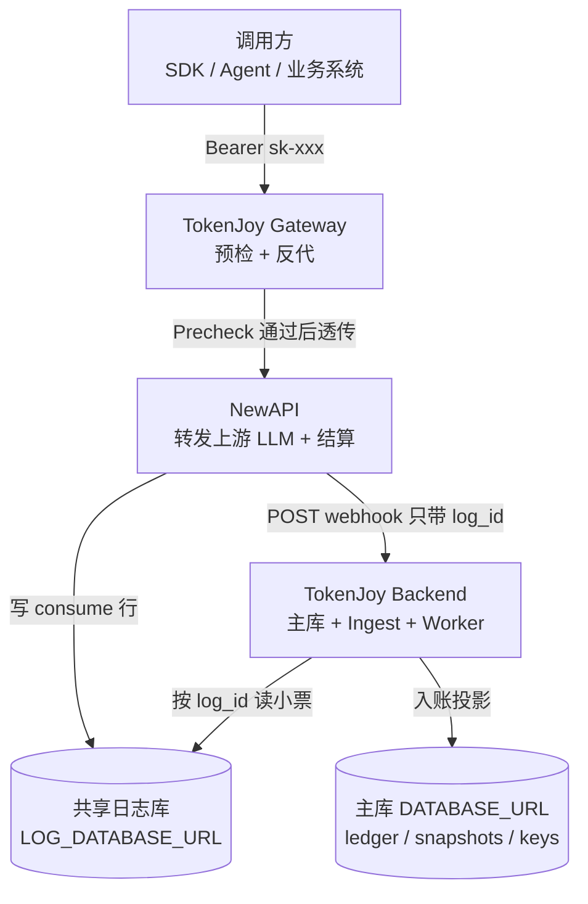
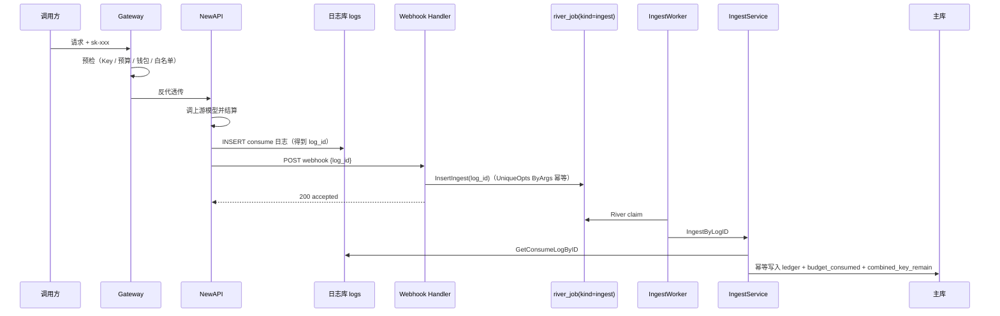
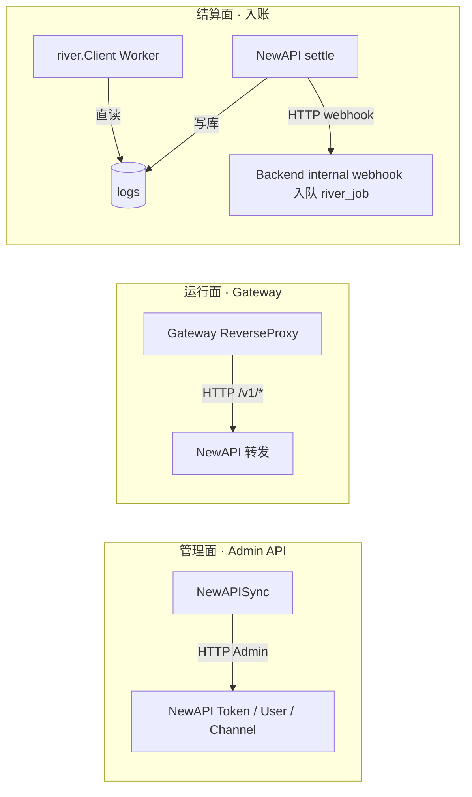
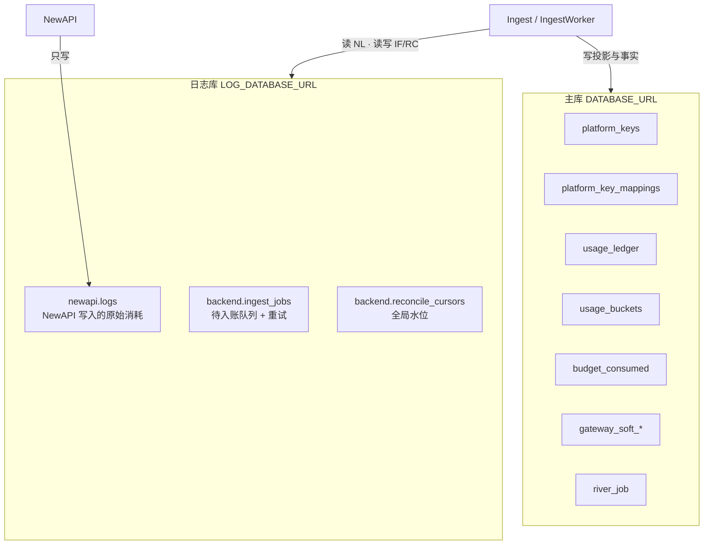
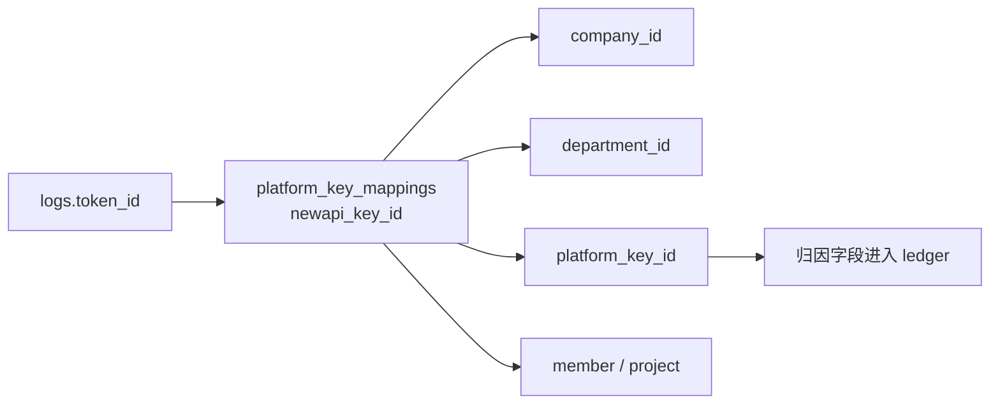
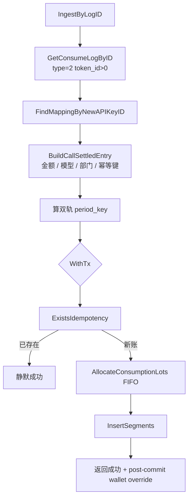
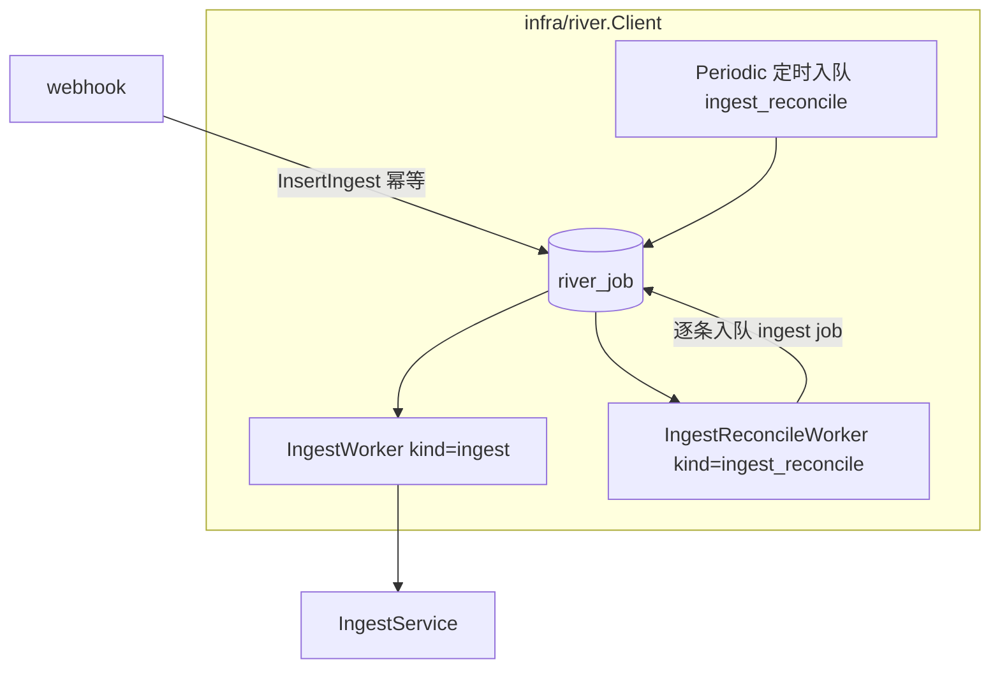

# Backend Ingest 架构：用量如何从 NewAPI 回到 TokenJoy

> **读者**：想搞清「一次 LLM 调用的钱，怎么记到企业账上」的研发 / 运维 / 联调同学。  
> **风格**：由浅入深、只讲机制与数据流；关键路径对应 `apps/backend/internal/domain/usage/` 与 `internal/infra/ingest/`。  
> **相关文档**：[Backend-预算.md](./Backend-预算.md) · [Backend-存储架构.md](./Backend-存储架构.md) · [Backend-计费模式.md](./Backend-计费模式.md) · [Backend-业务时钟与账期.md](./Backend-业务时钟与账期.md) · [Backend-架构.md](./Backend-架构.md) §7

---

## 0. 一句话先建立直觉

TokenJoy **不自己跑模型**。真正转发请求、结算配额的是 **NewAPI**。  
TokenJoy Backend 要做的是：在 NewAPI 记下一笔「消耗日志」之后，把这笔账 **可靠地、幂等地、可归因地** 写进自己的主库——这就是 **Ingest（入账）**。

| 角色              | 类比                                           |
| ----------------- | ---------------------------------------------- |
| NewAPI            | 收银台：收单、扣通道额度、写小票               |
| 共享日志库 `logs` | 小票存根柜（两边都能打开）                     |
| Webhook notify    | 收银员喊一声「有新小票了」                     |
| Backend Ingest    | 会计：按小票入账、分摊到部门/Key、更新预算看板 |
| Worker reconcile  | 夜间对账：漏喊的小票也要补上                   |

---

## 1. 系统里有谁：三层角色



要点：

1. **调用路径**与 **入账路径**是两条线：调用走 Gateway → NewAPI；入账走日志库 + webhook / Worker。
2. Webhook **不传完整账单**，只传 `{ "log_id": N }`。真相在共享日志库里，Backend 自己去读。
3. 审计与看板最终读的是 **主库**（`usage_ledger` / `usage_buckets`），不是直接查 NewAPI。

---

## 2. 从一次调用看完整故事（浅层）

用户用一把 Platform Key 打 `/v1/chat/completions`：



若 webhook 丢了、或 Backend 短暂不可用：

- NewAPI 侧最多重试几次 notify，失败就放弃喊话；
- River Periodic 每隔一段时间触发 `ingest_reconcile` job，用 **水位游标** 扫日志库补洞，保证最终入账。

设计原则：**以共享日志为 SSOT 源**，webhook 只负责 **快速入队**（River job），Worker 异步写账，reconcile 是慢路径兜底。**没有独立的日志库轮询进程**——ingest 与 reconcile 都是普通 River job kind（`ingest` / `ingest_reconcile`），走统一的 River Client。

---

## 3. Backend 与 NewAPI 如何通信

通信不是「一种协议」，而是 **三条正交通道**：



### 3.1 管理面：PlatformKey / NewAPIKey 生命周期

| 方向             | 内容                                                                                  |
| ---------------- | ------------------------------------------------------------------------------------- |
| Backend → NewAPI | Create / Update / Toggle / Revoke / Rotate / Delete Token；TopUp 钱包；Upsert Channel |
| 对齐键           | `platform_key_mappings.newapi_key_id` ↔ NewAPI token 主键                             |

**为什么 Rotate 不能 delete+create？**  
Ingest 靠 `logs.token_id` 反查 mapping。若 Rotate 换了 token 主键，旧日志对不上新 Key，入账归因断裂。因此 Rotate 走 regenerate，**保持 `newapi_key_id` 不变**。

### 3.2 运行面：Gateway

- 调用方只认识 TokenJoy 的 `/v1/*`。
- Gateway 先做 Precheck（`LoadPrecheckContext` + `Evaluate`：企业状态、组织预算、钱包 `wallet_remain_quota`、模型白名单、Key 状态），通过后 **反代** 到 NewAPI。**不读** NewAPI quota，不因 wallet sync 滞后拒单。
- Gateway **不负责入账**；入账发生在 NewAPI settle 之后。

### 3.3 结算面：Webhook + 直读日志库

| 通道   | 谁发起           | 载荷                                   | 作用                                  |
| ------ | ---------------- | -------------------------------------- | ------------------------------------- |
| Notify | NewAPI → Backend | `{ "log_id": N }` + `X-Webhook-Secret` | 入队 River `ingest` job，立即 ACK（不写 ledger） |
| 直读   | Backend → 日志库 | SQL 按 id / 游标扫                     | River `ingest_reconcile` job 读真相、补洞、逐条入队 |

两边共享同一套 secret（NewAPI 的 `MANAGEMENT_WEBHOOK_SECRET` ≈ Backend 的 `NEW_API_WEBHOOK_SECRET`）。

---

## 4. 日志如何共享：双库拓扑

TokenJoy 刻意拆成 **两个 Postgres 库**（或同一实例两个 database）：



| 表                          | 谁写    | 谁读         | 职责                                                     |
| --------------------------- | ------- | ------------ | -------------------------------------------------------- |
| `newapi.logs`               | NewAPI  | Backend      | 消耗原始小票（`type=2` 且 `token_id > 0` 才入账）        |
| `backend.reconcile_cursors` | Backend | reconcile worker | `stream=newapi_consume` 的 `last_log_id` 水位            |

**`backend.ingest_jobs` 为遗留表**：schema 仍保留，但代码零引用——待入账队列已改为主库 `river_job`（kind=`ingest`），不再使用独立日志库队列表。

**为何不把 logs 放进主库？**

- NewAPI 是独立服务，有自己的写入节奏与 schema 习惯；
- 入账失败/游标是 Backend 运维状态，与 NewAPI 表同库但分 schema（`newapi.*` / `backend.*`），边界清晰；
- 主库故障与日志库故障可部分解耦（生产仍要一起监控）。

**Schema 模式**（`LogSchemaIsolated`，非 env，测试/程序内设置）：

| 模式 | 表名                                                                | 场景                                  |
| ---- | ------------------------------------------------------------------- | ------------------------------------- |
| 生产 | `newapi.logs` / `backend.ingest_jobs` / `backend.reconcile_cursors` | 独立 `LOG_DATABASE_URL`               |
| 隔离 | `logs` / `ingest_jobs` / `reconcile_cursors`                        | 单库测试（`WithIngestEnabled(true)`） |

---

## 5. 如何对齐：从 token_id 到企业账本

### 5.1 身份对齐：`token_id` → 租户归因



流程（`IngestService.IngestRaw`）：

1. 读到一条 consume 日志，取出 `token_id`；
2. `FindMappingByNewAPIKeyID` 找到映射；
3. 映射缺失 → 返回 `404 NotFound`（记 warn 日志）；pending 路径最终 **dead**，reconcile 路径 **推进游标** 并 UpsertJob 留痕；
4. 映射存在 → 注入 `company.Context`，继续建账本条目。

### 5.2 幂等对齐：同一张小票只入一次

| 层     | 机制                                                     |
| ------ | -------------------------------------------------------- |
| 幂等键 | `newapi:{log_id}`                                        |
| 事务前 | `ExistsIdempotency` → 已存在则 **静默成功**              |
| 插入   | `InsertSegments` ON CONFLICT DO NOTHING                  |
| 队列   | `ingest_jobs.log_id` UNIQUE — 重复 webhook upsert 同一行 |

因此：**快路径 webhook 与慢路径 reconcile 可以同时跑**，不会把一笔钱记两次。

### 5.3 金额与量纲对齐：双扣 + wallet override

一次真实调用会在两边各扣一次，量纲不同：

| 侧             | 扣什么              | 单位               |
| -------------- | ------------------- | ------------------ |
| NewAPI         | 通道 `quota`        | NewAPI quota units |
| Backend Ingest | 企业钱包 / 组织预算 | TokenJoy **point** |

Ingest 事务提交后，**立即 best-effort** 调 NewAPI `ManageUser("set_quota", mode="override")` 把 `wallet_remain_quota` 绝对值覆盖到 NewAPI user wallet。充值路径同理。NewAPI wallet 是 TokenJoy 的实时镜像（非独立真相）。详见 [Backend-计费模式.md](./Backend-计费模式.md) §4.4。

### 5.4 账期对齐：发生月 vs 开账月（双轨）

调用可能跨月才入库（例如 6/30 发生，7/1 才 Ingest）：

| 写入目标                           | 用哪个月                  | 含义                               |
| ---------------------------------- | ------------------------- | ---------------------------------- |
| `usage_ledger.period_key`          | **发生时间** `OccurredAt` | 审计「这笔调用发生在哪个月」       |
| `budget_consumed`（Ingest 同事务） | **当前开账月** `Clock`    | 门禁与预算树「扣在哪本打开的账上」 |
| `usage_buckets`                    | 发生时间                  | 看板趋势跟真实发生时刻             |

Ingest **同事务**写 ledger + lot + `budget_consumed` + `combined_key_remain`。`usage_buckets` 由 `dashboard.Projector` 异步维护（看门狗每小时检测 lag 触发）。开账轨与发生轨细节见 [Backend-业务时钟与账期.md](./Backend-业务时钟与账期.md)。副作用（overrun/rebalance）约定见 [Backend-离线任务.md](./Backend-离线任务.md)。

---

## 6. Ingest 内部在干什么（中层）

核心入口：`IngestService.IngestByLogID` → `IngestRaw`（`internal/domain/usage/ingest.go`）。



**Ingest 同事务只做：** ledger 幂等插入、FIFO 扣 lot、`budget_consumed` + `combined_key_remain` 原子写入。  
**事务后 best-effort：** `set_quota` override NewAPI wallet。  
`usage_buckets` 由看门狗每小时触发 `dashboard.Projector` 异步维护（见 [Backend-离线任务.md](./Backend-离线任务.md)）。  


### 6.1 预算累计（Ingest 同事务）

| 步骤   | 目标                                 | 作用                                                       |
| ------ | ------------------------------------ | ---------------------------------------------------------- |
| 1      | `budget_consumed` · platform_key     | Key 已用                                                   |
| 2      | `budget_consumed` · project          | 若挂项目（`project` / `project_member` scope）             |
| 3      | `budget_consumed` · member           | 仅 `member` scope（`project` / `project_member` **不写**） |
| —      | **无 org_node 轴**                   | 部门报表：`usage_ledger` 按 `department_id` 聚合           |
| 同事务 | `combined_key_remain`                | Gateway 预检热读                                           |
| 提交后 | overrun **按需入队**；轻量告警可直做 | 见 [Backend-离线任务.md](./Backend-离线任务.md)            |

入账按 Platform Key `scope` 选择性写轴，见 [Backend-预算.md](./Backend-预算.md) §2.2。

看板 `usage_buckets` 由 `dashboard.Projector` 独立维护（看门狗每小时检测 lag 后触发）。

**事实 SSOT** 是 `usage_ledger`；`budget_consumed` / buckets / combined_key 均为可重建投影。

### 6.2 读路径分离（入账后谁读什么）

| 场景              | 读哪里                                           |
| ----------------- | ------------------------------------------------ | ------------------------- |
| 审计调用列表      | `usage_ledger`                                   |
| 分钟级趋势（≤3h） | `usage_ledger` 聚合                              |
| 小时/天看板       | `usage_buckets`                                  |
| Gateway 预检      | `combined_key_remain` + limit（开账月）          |
| 预算树 consumed   | `budget_consumed`（开账月）；部门节点 limit-only | 部门花费见 `usage_ledger` |

控制台 **不会** 为了展示再去扫 NewAPI logs。

### 6.3 入账后副作用

见 [Backend-离线任务.md](./Backend-离线任务.md)、[Backend-预算.md](./Backend-预算.md)。入队统一为 River `Insert` / `InsertInTx` → `river_job`。

| 副作用              | 条件                 | 机制                             |
| ------------------- | -------------------- | -------------------------------- |
| wallet override     | **始终**             | post-commit best-effort HTTP     |
| rebalance / overrun | **不在 Ingest 执行** | 按需入队；方向允许轻量预判后跳过 |
| `dashboard_project` | **不在 Ingest 入队** | 看门狗每小时检测 lag 后入队      |

`NEW_API_ENABLED=false` 时：ledger **照常**；rebalance / overrun **不入队**；wallet override 可执行但无 NewAPI 消费意义。

---

## 7. 后台运行时

**单一异步栈**：ingest 与 reconcile 都是 River job kind，与其它离线任务共用同一个 `river.Client`（详见 [Backend-离线任务.md](./Backend-离线任务.md) §1）：



### 7.1 HTTP 入口

| 路由                                | 方法 | 鉴权               | 行为                                         |
| ----------------------------------- | ---- | ------------------ | -------------------------------------------- |
| `/api/internal/webhooks/newapi-log` | POST | `X-Webhook-Secret` | 入队 River `ingest` job → 200 `accepted`     |
| `/api/internal/metrics/ingest`      | GET  | 同上               | 返回 metrics JSON；`!IngestEnabled()` 时 404 |

入队失败（日志库不可用等）返回 500，让 NewAPI notify 重试。

Webhook 结果语义：

| 情况                       | HTTP           | 含义                  |
| -------------------------- | -------------- | --------------------- |
| 鉴权失败                   | 401            | secret 不对           |
| `log_id` 非法              | 400            | 请求体错误            |
| 入队成功（含重复 notify）  | 200 `accepted` | **不代表已写 ledger** |
| 入队失败（日志库不可用等） | 500            | 让 NewAPI notify 重试 |

### 7.2 入账 job（kind=`ingest`）

`IngestWorker.Work`（`infra/river/workers/ingest.go`）：

1. River 按 `queue=critical`、`MaxAttempts=20` claim
2. 调 `IngestByLogID(source)`
3. 按 `ClassifyIngestError` 分类：
   - 成功 → River 标记完成
   - `IngestBusiness` 且不可恢复（非 mapping-not-found）→ `river.JobCancel`（不再重试）
   - `IngestBusiness` 可恢复（mapping 未找到）/ `IngestLogNotFound` / `IngestLogDBTemp` / `IngestRetryable` → 交给 River 默认重试（指数退避）

入队幂等：`IngestArgs.LogID` 带 `river:"unique"` + `UniqueOpts{ByArgs: true}`——同一 `log_id` 重复 webhook 只会命中同一条 job。

### 7.3 补洞 job（kind=`ingest_reconcile`）

`IngestReconcileWorker.Work`（`infra/river/workers/ingest_reconcile.go`），由 River Periodic 按 `INGEST_RECONCILE_INTERVAL_SEC` 定时入队：

1. 读游标 `newapi_consume`（`reconcile_cursors` 表）
2. `ListConsumeLogIDsAfter(cursor, batchSize)` 批量拉取待补洞 log id
3. 逐条 `jobs.InsertIngest(id, source="reconcile")`——复用同一条 `ingest` job 幂等路径
4. 整批处理完后一次性推进游标到本批最后一个 id
5. 若拉到的数量 < `batchSize` 则本轮结束；否则继续下一轮，最多 `INGEST_RECONCILE_MAX_ROUNDS` 轮

**没有** 独立日志库轮询进程、`scheduler_locks` 租约、`ClaimPendingJobs`、`MarkJobDone`、`ApplyRetry` 这类专属机制——重试 / 幂等 / 并发控制统一交给 River。

## 8. 可观测性

`GET /api/internal/metrics/ingest` 返回（`ingestmetrics/collector.go`）：

| 字段                            | 含义                                             |
| ------------------------------- | ------------------------------------------------ |
| `ingest_webhook_accepted_total` | webhook 200 计数（**入队成功**，非 ledger 条数） |
| `ingest_reconcile_gaps`         | 游标之后尚未 reconcile 的 consume 行数           |
| `ingest_lag_seconds`            | 游标后最老未处理 log 的 `created_at` 距今秒数    |

`Refresh(ctx, logStore)` 由 webhook handler 与 reconcile worker 各自按需调用刷新 gaps / lag（`ingestmetrics.Snapshot` 只有以上三个字段）。

---

## 9. 配置与启用条件

### 9.1 启用逻辑

| 概念                | 条件                                                              | 说明                                                                            |
| ------------------- | ----------------------------------------------------------------- | ------------------------------------------------------------------------------- |
| `IngestEnabled()`   | `LOG_DATABASE_URL != ""`                                          | 创建 log pool、启动 ingestLoop、挂载真实 metrics                                |
| Webhook secret 校验 | `IngestEnabled()` 时 startup **必须** 配 `NEW_API_WEBHOOK_SECRET` | 不是 enable flag，是启动校验                                                    |
| 生产契约            | `DEPLOY_ENV=production`                                           | 还要求 `LOG_DATABASE_URL`、`NEW_API_WEBHOOK_SECRET`、`NEW_API_ENABLED`、Gateway |

### 9.2 环境变量

| 配置                            | 默认    | 作用                                                           |
| ------------------------------- | ------- | -------------------------------------------------------------- |
| `LOG_DATABASE_URL`              | —       | 共享日志库；**Ingest 总开关**                                  |
| `NEW_API_WEBHOOK_SECRET`        | —       | Webhook + metrics 鉴权                                         |
| `NEW_API_ENABLED`               | `true`  | 副作用入队 + River Client 消费 rebalance/overrun               |
| `NEW_API_GATEWAY_ENABLED`       | `false` | 挂载 `/v1` Gateway                                             |
| `INGEST_RECONCILE_INTERVAL_SEC` | `300`   | reconcile Periodic 入队间隔                                    |
| `INGEST_RECONCILE_BATCH_SIZE`   | `500`   | 每批扫描 log 数                                                |
| `INGEST_RECONCILE_MAX_ROUNDS`   | `10`    | 单次 reconcile 最多批次数                                      |
| `MANAGEMENT_WEBHOOK_URL`        | —       | NewAPI 侧喊话地址                                              |
| `MANAGEMENT_WEBHOOK_SECRET`     | —       | NewAPI 发出时带的 secret                                       |

### 9.3 联调常见坑

- Docker 里 NewAPI 打宿主机 Backend：Linux 需 `extra_hosts: host.docker.internal:host-gateway`（见根 `docker-compose.yml`）。
- webhook `200 accepted` **不等于**已入账；看 `ingest_lag_seconds` / `ingest_reconcile_gaps` / ledger。
- `NEW_API_ENABLED=false` 时 ingest **仍工作**（写账），只是不同步 NewAPI remain / overrun。
- webhook 全关时系统仍可工作：只靠 reconcile Periodic，延迟变大。

---

## 10. 端到端架构总图

```mermaid
flowchart TB
  subgraph callers [调用方]
    SDK[SDK / 业务]
  end

  subgraph tokenjoy [TokenJoy Backend]
    API[管理 API]
    GW[Gateway Precheck]
    ING[IngestService]
    RC[river.Client 唯一异步栈]
    MAIN[(主库)]
  end

  subgraph newapi [NewAPI]
    ADM[Admin API]
    NA[/v1 上游]
    SETTLE[Settle 写 logs]
    NOTIFY[Notify Worker]
  end

  subgraph shared [共享]
    LOGS[(日志库)]
  end

  API <-->|Remote-first PlatformKey| ADM
  SDK --> GW --> NA --> SETTLE --> LOGS
  SETTLE --> NOTIFY -->|log_id| WH[Webhook]
  WH -->|InsertIngest| RC
  RC --> ING
  ING --> LOGS
  ING --> MAIN
  RC -->|rebalance / overrun| ADM
  API --> MAIN
```

**数据权威分层：**

| 问题                         | 权威答案在哪                                                                  |
| ---------------------------- | ----------------------------------------------------------------------------- |
| 这次调用 Raw 发生了什么？    | `newapi.logs`                                                                 |
| 企业账上记了多少、归因到谁？ | `usage_ledger`                                                                |
| 本月预算用了多少？           | `budget_consumed`（开账月）                                                   |
| 通道还能不能打？             | Gateway 预检（`wallet_remain_quota` + snapshots）；NewAPI remain 为执行面派生 |
| 企业还剩多少预付？           | Postgres `wallet_remain_quota` / lots（NewAPI user quota 是派生缓存）         |

---

## 11. 代码模块索引

| 模块               | 路径                                                                                     | 职责                          |
| ------------------ | ---------------------------------------------------------------------------------------- | ----------------------------- |
| IngestService      | `internal/domain/usage/ingest.go`                                                        | 入账编排                      |
| Entry / Projection | `internal/domain/usage/entry.go`, `projection.go`                                        | 原始 log → ledger 条目 → 投影 |
| 错误分类           | `internal/domain/usage/ingest_outcome.go`                                                | `ClassifyIngestError` / 可恢复判定 |
| Job 端口           | `internal/domain/usage/ports.go`                                                         | `IngestJobEnqueuer`、`BudgetOps` 等 |
| HTTP Handler       | `internal/http/handler/ingest/handler.go`                                                | webhook + metrics             |
| Ingest Worker      | `internal/infra/river/workers/ingest.go`                                                 | River kind=`ingest`           |
| Reconcile Worker   | `internal/infra/river/workers/ingest_reconcile.go`                                       | River kind=`ingest_reconcile` |
| River Client       | `internal/infra/river/client.go`                                                         | 全部离线 job                  |
| Metrics            | `internal/infra/ingestmetrics/collector.go`                                              | 计数与 lag                    |
| LogStore           | `internal/store/log_repo.go`, `postgres/log_repo.go`                                     | 日志库 CRUD                   |
| Config             | `internal/config/config.go`, `validate.go`                                               | 启用条件与间隔                |
| Wiring             | `internal/app/assemble.go`、`compose_domain.go`、`compose_worker.go`、`registry.go`       | DI 与 Worker 启动             |

---

## 12. 测试覆盖

| 区域         | 测试文件                                          | 覆盖点                                  |
| ------------ | ------------------------------------------------- | --------------------------------------- |
| 入账核心     | `tests/domain/usage/ingest_test.go`               | 幂等、rollup、period、mapping 缺失      |
| 入队         | `tests/domain/usage/ingest_enqueue_test.go`        | Ingest 内部三类 job 入队断言            |
| 错误分类     | `tests/domain/usage/ingest_outcome_test.go`       | River 重试 / cancel 分类规则            |
| 超支门禁     | `tests/domain/usage/ingest_overrun_gate_test.go`  | overrun gate 逻辑                       |
| 透支         | `tests/domain/usage/ingest_overdraft_test.go`     | lot 不足自动 overdraft                  |
| 渠道拆分     | `tests/domain/usage/ingest_channel_split_test.go` | platform / 自管渠道分流                 |
| 审计         | `tests/domain/usage/ingest_audit_test.go`         | 审计归因字段                            |
| HTTP E2E     | `tests/handler/gateway/webhook_ingest_test.go`    | webhook→worker 闭环、metrics            |
| Store        | `tests/store/postgres/log_repo_test.go`           | 队列 dedup、cursor                      |
| Metrics      | `tests/infra/ingestmetrics/collector_test.go`     | snapshot 字段                           |

---

## 13. 已知边界与演进方向

### 13.1 明确不必改的设计

| 项                                     | 原因                                     |
| -------------------------------------- | ---------------------------------------- |
| 以 `log_id` 为幂等源                   | 跨 webhook/retry/reconcile 唯一自然键    |
| Rotate 保持 token_id                   | 保护 ingest 归因连续性                   |
| 双轨 period（发生 vs 开账）            | 跨月入库与预算门禁不能混用同一把尺子     |
| 控制台不直读 NewAPI logs               | 归因、计价、权限都在 TokenJoy 域模型里   |
| webhook 不写 ledger                    | ACK 与入账解耦；入账统一走 River Worker + 幂等 |
| ingest job 与 newapi_sync outbox 分离  | 入账失败与 Token 同步失败的重试语义不同  |

### 13.2 仍可改进（见 [plan/plan.md](./plan/plan.md)）

| 方向                           | 现状                              | 建议                                                                                                                           |
| ------------------------------ | --------------------------------- | ------------------------------------------------------------------------------------------------------------------------------ |
| Notify 队列满                  | NewAPI 内存队列有界，满则 drop    | 可接受因有 reconcile；监控 drop                                                                                                |
| Update Key 非严格 Remote-first | 先写 DB 再 sync                   | 与 Create 路径统一                                                                                                             |
| 预检 estimate                  | 固定最小值                        | 按模型单价动态估价                                                                                                             |
| enqueue→ledger 延迟            | 无直方图                          | 可增加延迟 metric                                                                                                              |
| mapping 缺失自愈               | 拒绝入账                          | 严格审计前提下评估自动重建                                                                                                     |

---

## 14. 阅读路径建议

1. 本文 §0–§2：建立故事线
2. §3–§5：通信、共享库、对齐键
3. §6–§7：入账步骤与 Worker 可靠性
4. §8–§9：可观测性与配置
5. §10：端到端总图
6. 深入算法：[Backend-预算.md](./Backend-预算.md) · [Backend-计费模式.md](./Backend-计费模式.md)
7. 账期细节：[Backend-业务时钟与账期.md](./Backend-业务时钟与账期.md)
8. 表结构：[Backend-存储架构.md](./Backend-存储架构.md)

---

## 15. 小结

- **Ingest** = 把 NewAPI 的消耗小票，变成 TokenJoy 主库里可审计、可预算、可预检的账。
- **通信** = 管理面 Admin API + 运行面 Gateway 反代 + 结算面 webhook/直读，三条线各司其职。
- **日志共享** = 独立日志库；NewAPI 写 `newapi.logs`，Backend 写 pending/cursor，并读 logs 入账。
- **对齐** = `token_id`↔mapping、`newapi:{log_id}` 幂等、point↔quota wallet override（post-commit `set_quota`）、发生月↔开账月双轨。
- **Worker** = **两条异步线**（详见 [Backend-离线任务.md](./Backend-离线任务.md)）：线 A `infra/ingest.Worker`（pending + reconcile）与线 B `infra/river.Client`（rebalance / overrun / org sync 等 River job）并行。wallet sync 已从 River job 改为 post-commit 内联调用。
- **可靠** = webhook 求快 ACK，IngestWorker 求入账，reconcile 求不丢；入账都走同一条 `IngestByLogID`。

---

## 16. Ingest 事务内预算累计（同事务细节）

> 描述 Ingest 事务中 `budget_consumed` 和 `combined_key_remain` 的原子写入。

### 16.1 事务时序

```text
IngestRaw → BEGIN
  → SELECT ... FROM companies WHERE id=$1 FOR UPDATE（公司级串行）
  → ExistsIdempotency?（锁后检查，重复零副作用）
  → ConsumeLots（lot FIFO + wallet_remain_quota）
  → INSERT usage_ledger（segments）
  → IncrementConsumedBatch（UNNEST 批量 UPSERT budget_consumed，最多 3 轴）
  → DecrementBatch（combined_key_remain -= amount；GREATEST(remain - delta, 0)）
  → NULL remain → 锁行重算 → UpdateBatch（仅初始化）
  → 可选 INSERT overrun job（remain ≤ 0 时）
  → COMMIT
→ Post-commit: ManageUser("set_quota", wallet_remain_quota) — best-effort
```

### 16.2 约束

| 约束                | 实现                                              |
| ------------------- | ------------------------------------------------- |
| 公司级串行          | `companies FOR UPDATE` — Ingest 和 reconcile 共用 |
| 幂等在锁后          | 锁后检查 → 重复请求零副作用                       |
| consumed 一次写     | `IncrementConsumedBatch` UNNEST 批量 UPSERT       |
| combined 原子扣减   | `GREATEST(remain - delta, 0)`                     |
| 绝对重算仅初始化    | NULL remain → 锁行 → 重算 → UpdateBatch           |
| wallet sync 不阻塞  | post-commit best-effort HTTP，失败仅 warn log     |
| 无 advisory lock    | Ingest 热路径不拿 budget advisory lock            |

### 16.3 批量 consumed SQL

```sql
INSERT INTO budget_consumed (company_id, axis_kind, axis_id, period_key, consumed, updated_at)
SELECT $1, axis_kind, axis_id, period_key, amount, NOW()
FROM UNNEST($2::text[], $3::text[], $4::text[], $5::numeric[])
    AS input(axis_kind, axis_id, period_key, amount)
ON CONFLICT (company_id, axis_kind, axis_id, period_key)
DO UPDATE SET consumed = budget_consumed.consumed + EXCLUDED.consumed, updated_at = NOW();
```

### 16.4 Overrun Gate

Ingest 只做 gate，不执行 Disable/NewAPI：

- `platformKeyID` 为空 → 跳过
- `summaries == nil`（Unconstrained）→ 跳过
- key 不在 summaries 中（Unknown）→ InsertOverrun
- key 在 summaries 且 `remain ≤ 0` → InsertOverrun
- 否则 → 跳过

`OverrunService` worker 做多轴裁决（platform key → member → project → department），payload 含 `periodKey` 避免跨月误判。

### 16.5 告警（post-commit best-effort）

Ingest commit 后：

1. `CheckBudgetAlerts` — 仅 touched department
2. 收件人：`NotifyRoleIDs` → role name → active members
3. 去重键：`budget-alert:{companyID}:{ruleID}:{threshold}:{periodKey}:{memberID}`
4. 经 `notification.DispatchAsync`，失败只记日志不影响账务

### 16.6 Reconcile（冷路径 ~24h）

`ReconcileService.RunCompany`：

1. `AcquireBudgetLock`（advisory）+ `LockCompanyForUpdate`
2. `ListCallSettledSince`（~2 月窗口）→ 按 entry.OccurredAt 归属开账月
3. diff expected vs actual → `SetConsumed(expected)`；多余行 → `SetConsumed(0)`
4. 有修复 → `LockPlatformKeysForUpdate` → `ComputeGatewaySummaryUpdates` → `UpdateBatch`
5. 修复后 → `InsertRebalance(company)`

### 16.7 数据写入者总览

| 数据                  | 写入者                                       | 时机                         |
| --------------------- | -------------------------------------------- | ---------------------------- |
| `usage_ledger`        | Ingest                                       | 事务内                       |
| `budget_consumed`     | Ingest（IncrementConsumedBatch）             | 事务内                       |
| `budget_consumed`     | Reconcile（SetConsumed）                     | 冷路径修复                   |
| `combined_key_remain` | Ingest（DecrementBatch / absoluteRecompute） | 事务内                       |
| `combined_key_remain` | Reconcile（UpdateBatch）                     | 冷路径修复                   |
| `combined_key_remain` | Rebalance                                    | 充值/月切后                  |
| `usage_buckets`       | dashboard projector                          | 异步投影（看门狗每小时触发） |
