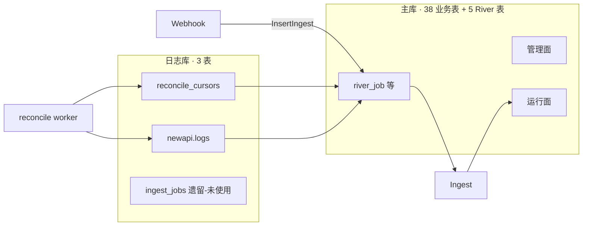
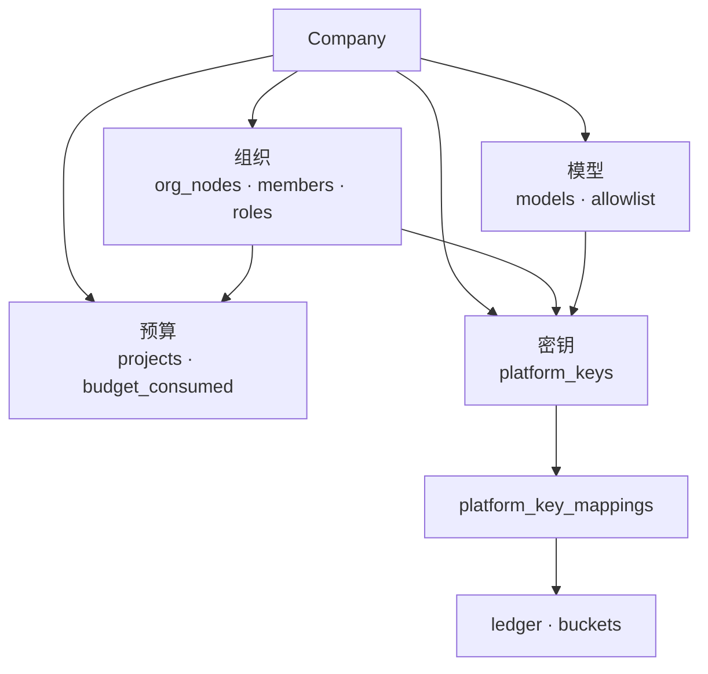
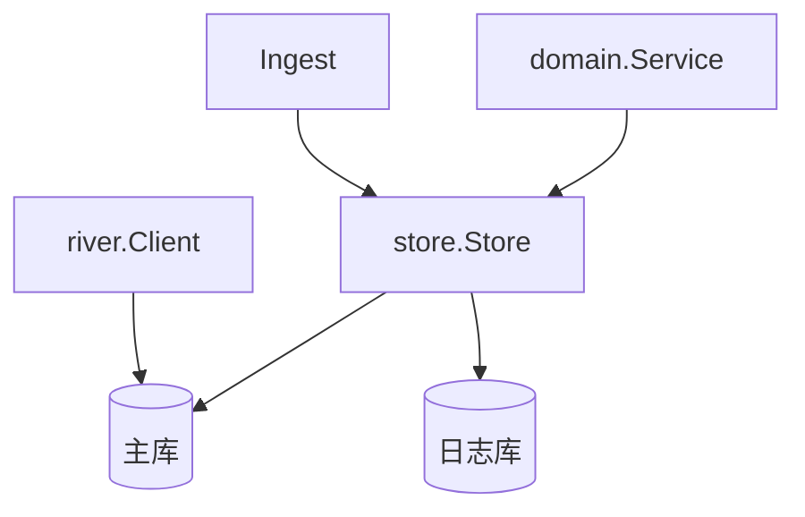
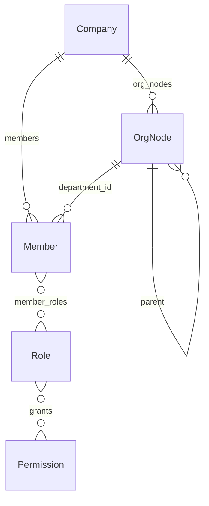
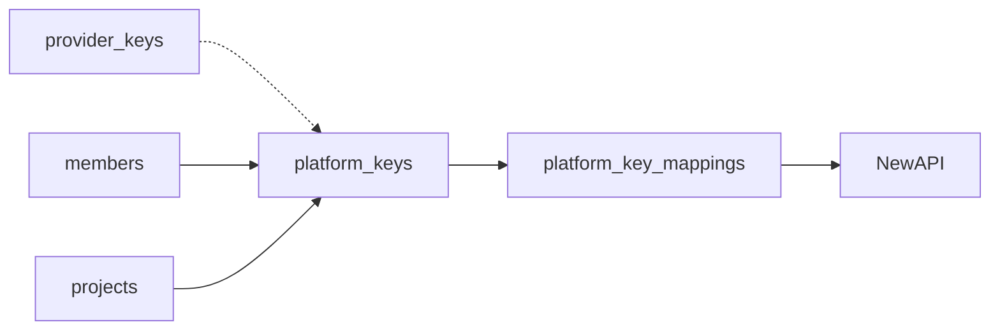
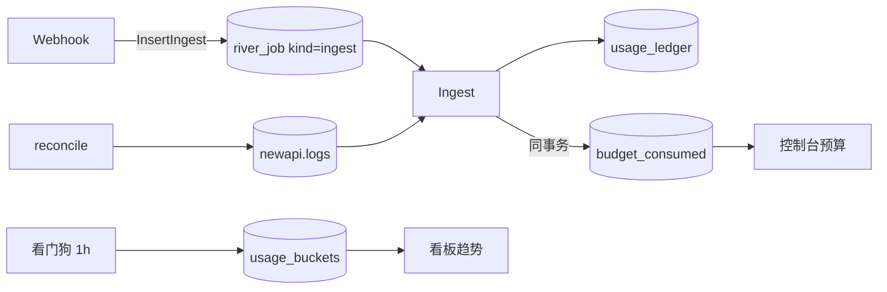
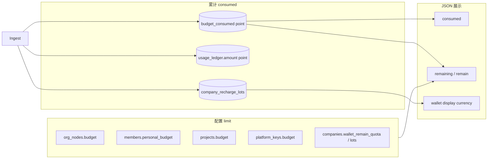

# Backend 存储架构

Postgres 双库：主库 **38** 张业务表 + **5** 张 River 表 + 日志库 **3** 张表。`company_id` 租户隔离，管理面配置 + 运行面入账投影。

**本文定位：** 表结构、域关系、Store 映射与 ID 约定。请求链路见 [Backend-架构.md](./Backend-架构.md)；Ingest / Rebalance / Overrun 算法见 [Backend-预算.md](./Backend-预算.md)；计费模式见 [Backend-计费模式.md](./Backend-计费模式.md)。

| 库     | DDL                                                                    | 连接                       |
| ------ | ----------------------------------------------------------------------- | -------------------------- |
| 主库   | `apps/backend/internal/store/postgres/schema.sql` + `river_schema.sql` | `DATABASE_URL`             |
| 日志库 | `logs_schema.sql`                                                      | `LOG_DATABASE_URL`（可选） |

启动时 `go:embed` 全量 apply，再由 `schema_partitions.go` 创建月分区（2024-01 .. 2032-12）。改表后本地 `pnpm reset` 重建。

---

## 1. 双库拓扑

| 配置                                          | 行为                       |
| --------------------------------------------- | -------------------------- |
| `LOG_DATABASE_URL` + `NEW_API_WEBHOOK_SECRET` | Ingest 启用                |
| 未配置日志库                                  | `Logs()` 为 `NoopLogStore` |
| `LogSchemaIsolated=true`                      | 测试专用；生产禁止         |

---

## 2. 域级关系

| 概念                              | 落点                                                                                                                     |
| --------------------------------- | ------------------------------------------------------------------------------------------------------------------------ |
| 部门 + 节点预算 + 路由            | `org_nodes`（HTTP 投影 `Department` / `BudgetNode` / `RoutingRule`）                                                     |
| 平台 Key 归因                     | `platform_keys`；`platform_key_mappings` 仅同步状态                                                                      |
| 消耗 SSOT / 看板 / Gateway 缓存   | `usage_ledger` / `usage_buckets` / `budget_consumed` + `platform_keys.combined_key_remain`                              |
| 企业钱包余额                      | SSOT：`company_recharge_lots` / `wallet_remain_quota`；NewAPI `users.quota` 为派生通道配额（`newapi_wallet_company_id`） |
| SaaS 上游 Key                     | 全局 `provider_keys`（无 `company_id`）                                                                                  |

---

## 3. Store 与租户隔离

| 接口                                                  | 主表                                                                     |
| ------------------------------------------------------ | -------------------------------------------------------------------------- |
| `Org()`                                               | `org_nodes`, `members`, `roles`, `permissions`, `org_integration`, …     |
| `Budget()`                                            | `projects`, `alert_rules`, `overrun_policy`, …                          |
| `Keys()`                                              | `provider_keys`, `platform_keys`                                        |
| `Models()`                                            | `models`, `model_allowlist`                                             |
| `Ledger()` / `Usage()` / `BudgetConsumed()`           | `usage_ledger`, `usage_buckets`, `budget_consumed`                       |
| `PlatformKeyMappings()`                               | `platform_key_mappings`                                                  |
| `RiverJob()`                                          | `river_job` 只读辅助查询（如 `HasActiveOrgSync`）；写入统一经 `river.Client` |
| `Audit()`                                             | `audit_settings`, `operation_logs`                                       |
| `Company()` / `User()` / `Invite()` / `Billing()`     | 租户与充值                                                               |
| `PlatformQuery()`                                     | 平台面跨租户只读查询                                                     |
| `Approval()`                                          | `approval_requests`                                                      |
| `SystemSettings()` / `ModelPricing()`                 | `system_settings`, `model_pricing`                                       |
| `TenantBackgroundState()` / `ProjectionCursors()`     | `tenant_background_state`, `projection_cursors`                          |
| `Notification()` / `NotificationPreference()`         | `notification_log`, `notification_preferences`                          |
| `SchedulerLock()` / `Logs()`                          | `scheduler_locks`, 日志库三表                                            |
| `Session()` / `GatewayPrecheck()` / `CombinedKeySummaries()` | `sessions`；预检与 combined key 读写                              |

离线任务入队 / 消费统一经 `river.Client`（`internal/infra/river/`）。

**租户：** 复合 PK `(company_id, …)`；全局表 `permissions` · `provider_keys` · `currencies` · `system_settings` · `scheduler_locks`。

**分区：** `operation_logs` · `usage_ledger` · `usage_buckets` → 月子表 `{table}_YYYY_MM`。

---

## 4. 核心实体

### 组织与 RBAC

`members.department_id` = `org_nodes.id` = HTTP `departmentId`。`members.override_fields` 追踪被用户/管理员手动修改过的字段，同步时跳过这些字段。组织同步：`org_integration` + `org_sync_logs` / `org_import_failures`。

**RBAC 无独立关联表**：`roles.permissions` 直接存 `TEXT[]` 权限 key 数组，通过 `member_roles` 关联成员与角色；不存在 `role_permission_grants` 表。

### 组织节点 vs 项目

|          | `org_nodes`                     | `projects`          |
| -------- | ------------------------------- | ------------------- |
| 结构     | 树形逐级分配                    | 扁平共享池          |
| 与 Key   | 经部门归因                      | 挂 `project_id`     |
| consumed | `usage_ledger` 部门聚合（报表） | `axis_kind=project` |

### `org_nodes` 列组

| 列组 | 字段                                                                       | 读写入口                                                                                                        |
| ---- | --------------------------------------------------------------------------- | ----------------------------------------------------------------------------------------------------------------- |
| 树   | `id`, `parent_id`, `path`, `name`, `manager_id`                            | `Org().Nodes()`                                                                                                 |
| 预算 | `budget`, `reserved_pool`, `period`, `member_avg_budget`                   | `budget.Service`；consumed → `budget_consumed`                                                                  |
| 路由 | `default_model_id`, `fallback_model_id`, `routing_inherited`               | `models.Service`；白名单 → `model_allowlist`（`model_id`）；管理 API 读写 `modelId[]`，读路径 enrich `ModelRef` |

### 密钥与 NewAPI 映射

`key_hash` 用于 Gateway 鉴权；明文 Key 不落库。`model_allowlist.owner_type` CHECK 约束仅允许两个值：`platform_key` · `org_node`。

`platform_key_mappings` 列：`company_id`, `platform_key_id`, `newapi_key_id`, `newapi_group`, `sync_status`, `synced_at`（**没有** `newapi_key_remain_quota` 列）；`provider_keys.newapi_channel_id`。outbox kind（River kind `newapi_sync` 的子类型）只有两个：`create_key` / `upsert_channel`。

### `river_job`（离线任务）

业务见 [Backend-离线任务.md](./Backend-离线任务.md)；Schema / Unique 见 `internal/infra/jobs/`。

| kind（`JobArgs.Kind()`）                    | Worker                     | 队列                                                             |
| ------------------------------------------- | --------------------------- | ---------------------------------------------------------------- |
| `ingest`                                    | `IngestWorker`              | `critical`（`UniqueOpts ByArgs` per log_id）                     |
| `ingest_reconcile`                          | `IngestReconcileWorker`     | `default`（L2 Periodic 触发）                                    |
| `newapi_sync`                               | `NewAPISyncWorker`          | `critical`                                                       |
| `rebalance`                                 | `RebalanceWorker`           | `default`（`UniqueOpts ByArgs` per axis）                        |
| `overrun`                                   | `OverrunWorker`             | `default`（`ByArgs` per company）                                |
| `org_sync`                                  | `OrgSyncWorker`             | `default`（Periodic 单 job → `SyncService.RunScheduledSyncAll`） |
| `budget_reconcile`                          | `BudgetReconcileWorker`     | `low`（看门狗检测 staleWindow 后入队）                           |
| `dashboard_project` / `dashboard_reconcile` | Dashboard Workers           | `low`（看门狗每小时检测 lag 后入队）                             |
| `tenant_watchdog`                           | `WatchdogWorker`            | `low`（唯一批量入队 Periodic）                                   |
| `notification_delivery`                     | `NotificationDeliveryWorker`| `default`                                                        |
| `catalog_sync`                               | `CatalogSyncWorker`         | `default`（仅 `SUPPORT_SAAS=false`）                             |

**没有** `wallet_sync` kind——已改为 post-commit 实时 HTTP override（见 [Backend-计费模式.md](./Backend-计费模式.md) §4.4）。

配套表：`river_migration`、`river_queue`、`river_notification`、`river_leader`（Periodic leader，共 5 张 River 表）；主库另保留 `scheduler_locks`（用途已限缩，代码内当前无引用；schema 保留）。

---

## 5. 用量与入账

Ingest 同事务写 ledger + lot + `budget_consumed` + `combined_key_remain`；看板 `usage_buckets` 由 `dashboard.Projector` 异步维护（看门狗每小时触发）。见 [Backend-离线任务.md](./Backend-离线任务.md)、[Backend-预算.md](./Backend-预算.md)。

| 表                | 角色                                                                    |
| ----------------- | ----------------------------------------------------------------------- |
| `usage_ledger`    | 消耗 SSOT                                                               |
| `usage_buckets`   | 看板 hour/day（Dashboard Projector 写，看门狗触发）                     |
| `budget_consumed` | 三轴 consumed（Ingest 同事务写入；部门报表改 ledger 聚合）              |
| `river_job`       | 离线执行意图                                                            |

入账与投影见 [Backend-预算.md](./Backend-预算.md) §7。

---

## 6. 表清单

### 主库业务表（38 张）

预算 consumed 在 `budget_consumed`；Dashboard 投影游标在 `projection_cursors`（`stream='dashboard_buckets'`）。

| 域     | 表                                                                                                                                                                          |
| ------ | ------------------------------------------------------------------------------------------------------------------------------------------------------------------------- |
| 租户   | `companies`, `company_invites`, `company_recharge_orders`, `company_recharge_lots`, `currencies`                                                                          |
| 组织   | `org_nodes`, `members`, `roles`, `permissions`, `member_roles`, `org_integration`, `org_sync_logs`, `org_import_failures`                                                 |
| 预算   | `projects`, `project_members`, `budget_consumed`, `overrun_policy`, `alert_rules`, `alert_rule_notify_roles`, `approval_requests`                                          |
| 密钥   | `provider_keys`, `platform_keys`, `platform_key_mappings`                                                                                                                  |
| 模型   | `models`, `model_pricing`, `model_allowlist`（`models` 同表承载平台源与租户自有模型，读取并集）                                                                            |
| 审计   | `audit_settings`, `operation_logs`, `usage_ledger`                                                                                                                        |
| 运行面 | `usage_buckets`, `scheduler_locks`, `notification_log`, `notification_preferences`, `tenant_background_state`, `projection_cursors`, `system_settings`                    |
| 身份   | `users`, `sessions`                                                                                                                                                        |

### 主库 River 表（5 张）

`river_job`, `river_migration`, `river_queue`, `river_notification`, `river_leader`。

### 日志库（3 张）

| 表                          | 职责                       |
| --------------------------- | -------------------------- |
| `newapi.logs`               | consume 原始行（`type=2`） |
| `backend.reconcile_cursors` | reconcile 水位             |
| `backend.ingest_jobs`       | **遗留表**：schema 保留但代码零引用；入账重试已改为 `river_job`（kind=`ingest`） |

---

## 7. 关键 ID

| 易混项                     | 说明                                                                    |
| -------------------------- | ----------------------------------------------------------------------- |
| `departmentId`             | = `org_nodes.id` = `members.department_id`                              |
| `RoutingRule.id`           | = `nodeId`                                                              |
| `sk-xxx`                   | → `platform_keys.key_hash` → `platform_key_mappings.newapi_key_id`      |
| `newapi_wallet_company_id` | → NewAPI `users.quota`（派生缓存；SSOT 为 lot / `wallet_remain_quota`） |
| `TOKENJOY_COMPANY_ID`      | 平台模型源公司 UUID（默认 `00000000-0000-7000-8000-000000000001`）      |
| `cfg.CompanyID`            | 运行时确定的业务公司 UUID（SaaS=DemoCompanyID, Local=setup 产出）       |
| SaaS 公司 ID               | 创建时由 `uuid.NewV7()` 生成                                            |
| 幂等键                     | `newapi:{log_id}`                                                       |
| `members`                  | TokenJoy 成员，非 NewAPI user                                           |
| `personalQuota`            | 走 `MemberBudget` API，不在 Member JSON                                 |

---

## 8. 消耗与额度术语

代码里 `consumed` / `quota` / `budget` 并存，**语义可统一为三个概念**；下列为文档与评审的**标准读法**。

### 8.1 三个统一概念

| 统一词                 | 含义                       | 典型计算                                    |
| ---------------------- | -------------------------- | ------------------------------------------- |
| **limit**（上限）      | 管理员配置的本周期可花额度 | 控制台写入                                  |
| **consumed**（已消耗） | 本周期已累计花费（point）  | Ingest 累加                                 |
| **remaining**（剩余）  | 还能花多少                 | `limit - consumed`（多为 API 计算，少落库） |

### 8.2 两条轴（limit 归属不同）

| 轴           | limit 权威源                                                                                                                               | consumed 权威源                             | 交汇点                                                 |
| ------------ | ------------------------------------------------------------------------------------------------------------------------------------------ | -------------------------------------------- | ------------------------------------------------------- |
| **企业钱包** | `Σ lot.quota_remaining` / `companies.wallet_remain_quota`                                                                                  | FIFO 扣 lot；ledger 事实                     | NewAPI token unlimited，无需同步 remain                 |
| **组织预算** | `org_nodes.budget` · `personal_budget` · `projects.budget` · `project_members.member_budget`† · `platform_keys.budget`（均为 int64 quota） | **`budget_consumed`**（三轴‡，int64 quota） | Gateway 预检（`combined_key_remain`）、预算树、Overrun |

† `member_budget`，见 [Backend-预算.md](./Backend-预算.md) §3。‡ **三轴** `platform_key` · `member` · `project`；部门花费读 `usage_ledger` 聚合。

组织轴 **consumed 不以列形式存在**于 `org_nodes` / `platform_keys`；`budget_consumed` 是 consumed 的存储 SSOT。Gateway 热路径读 `platform_keys.combined_key_remain`（Rebalance / Ingest 同事务刷新）。单笔事实在 `usage_ledger.quota_amount`（point）+ 锁定的 `cost`/`billing_currency`（展示币）。计费模式见 [Backend-计费模式.md](./Backend-计费模式.md)。

### 8.3 字段对照（代码名 → 统一词）

| 统一词        | 代码 / 表字段                                    | 实体                                                 | 说明                                                     |
| ------------- | -------------------------------------------------- | ---------------------------------------------------- | -------------------------------------------------------- |
| **limit**     | `org_nodes.budget`                                 | 部门节点                                             | 组织树分配额                                             |
| **limit**     | `members.personal_budget`                          | 成员                                                 | 个人可分配上限                                           |
| **limit**     | `projects.budget`                                  | 项目                                                 | 池额度                                                   |
| **limit**     | `project_members.member_budget`                    | 项目成员                                             | 项目内子额度                                             |
| **limit**     | `platform_keys.budget`                             | 平台 Key                                             | Key 分配额                                               |
| **limit**     | `companies.wallet_remain_quota` / lot 剩余         | 企业钱包                                             | 预付资金硬顶（point）；NewAPI quota 为派生               |
| **limit**     | `platform_keys.combined_key_remain`                | Platform Key                                         | Gateway 预检读的缓存剩余（非组织 consumed）              |
| **consumed**  | `budget_consumed.consumed`                         | 三轴                                                 | **组织轴 consumed SSOT**；部门报表改 `usage_ledger` 聚合 |
| **consumed**  | `usage_ledger.quota_amount`                        | 单笔调用                                             | 事实账本（point）                                        |
| **consumed**  | `usage_ledger.cost`                                | 单笔调用                                             | 展示币事实（锁定 `billing_currency`）                    |
| **consumed**  | `usage_buckets.cost`                               | 看板聚合                                             | 展示投影                                                 |
| **consumed**  | JSON `consumed`                                    | `BudgetNode` · `PlatformKey` · `MemberBudget` · 看板 | 读自 `budget_consumed`                                   |
| **remaining** | JSON `remaining` / `remain`                        | `MemberBudgetSummary` 等                             | 计算字段                                                 |
| **remaining** | `platform_keys.combined_key_remain`                | Platform Key                                         | Rebalance / Ingest 刷新                                  |

### 8.4 读代码速查

| 看到                                 | 统一读作                     | 备注                                         |
| ------------------------------------ | ---------------------------- | -------------------------------------------- |
| `quota`（`platform_keys`）           | **limit**                    | Key 分配上限                                 |
| `quota`（NewAPI user）               | **limit 派生缓存**（钱包轴） | 不以对外 SSOT；校准以 Postgres 为准          |
| `combined_key_remain`                | **remaining**（Key）         | 缓存值，`budget_consumed` 是权威             |
| `budget`                             | **limit**（point）           | 部门/项目语境                                |
| `personalQuota`                      | **limit**（成员，point）     | 不在 `Member` JSON，走专用 API               |
| `quota_amount` / `cost`              | **consumed**                 | point 事实 / 展示币                          |

### 8.5 不在此表内的词

| 字段                                               | 原因                             |
| -------------------------------------------------- | -------------------------------- |
| `provider_keys.balance`                            | 上游供应商余额，与组织预算轴无关 |
| `usage_ledger` 的 `input_tokens` / `output_tokens` | 用量计数，不是金额额度           |
| `reserved_pool`                                    | 预留池配置，不是 consumed        |

双轴与入账见 [Backend-预算.md](./Backend-预算.md) §2–§7。point / 展示币 / NewAPI quota 的区别见 [Backend-计费模式.md](./Backend-计费模式.md)。
