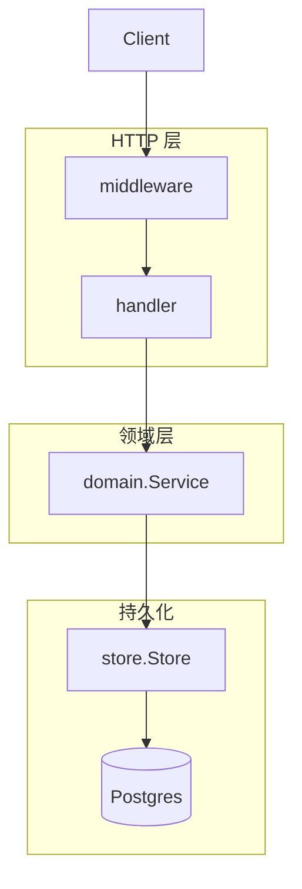
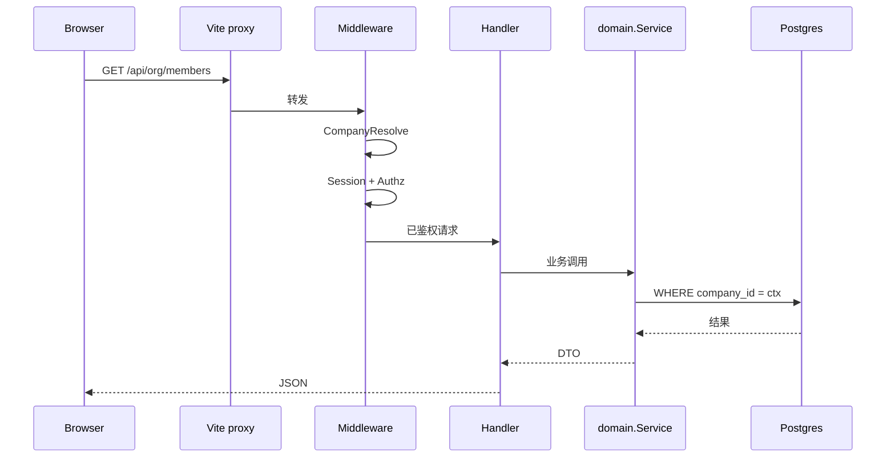
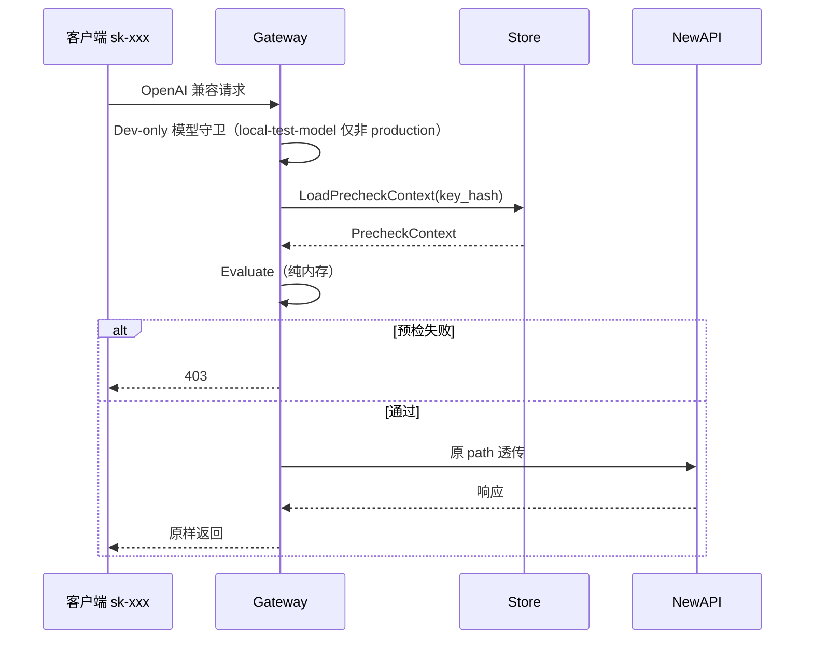
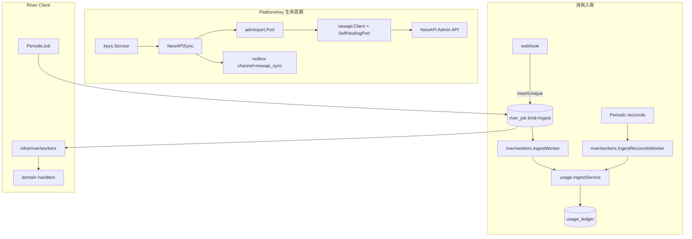
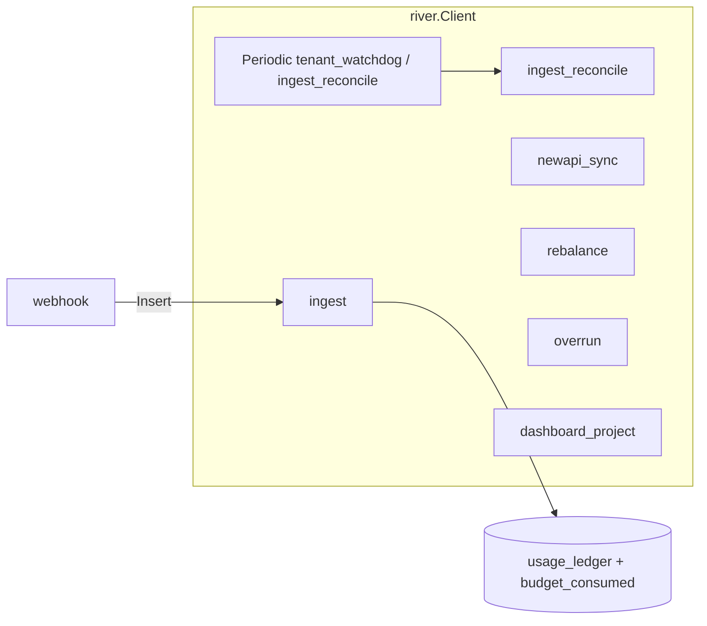
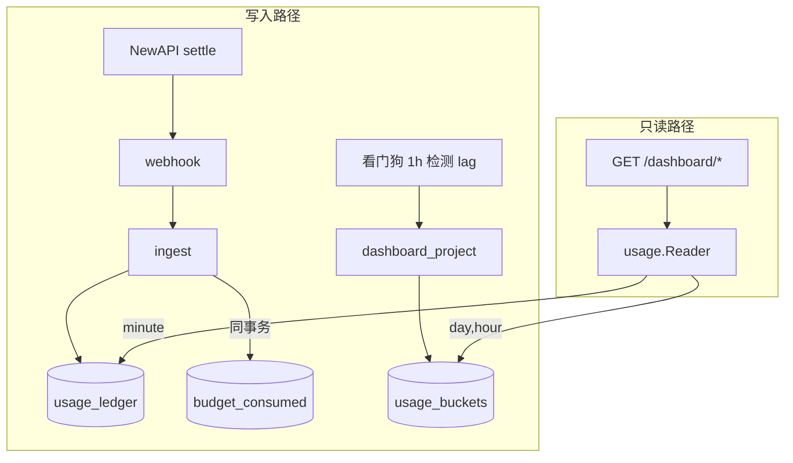

# Backend 架构

`apps/backend/` 分层、请求链路、域划分、Store 抽象、NewAPI/Gateway 集成与看板读路径。

**相关：** [Backend-存储架构.md](./Backend-存储架构.md) · [Backend-预算.md](./Backend-预算.md) · [Backend-业务时钟与账期.md](./Backend-业务时钟与账期.md) · [Backend-离线任务.md](./Backend-离线任务.md) · [Frontend.md](./Frontend.md)

---

## 0. 命名约定

领域词汇用 **Gateway** / **NewAPISync** / **PlatformKey**；不用 Relay；不用 Token 指 Key（JWT/session 写全称；LLM 计量 `inputTokens` 与厂商 Admin API 字面量除外）。`PlatformKey` 全链路保留，不改成 TokenJoyKey。

| 词                                  | 职责                                                                                                                 |
| ----------------------------------- | -------------------------------------------------------------------------------------------------------------------- |
| **NewAPI**                          | 上游服务（转发 LLM、扣额度、写 logs）                                                                                |
| **Gateway**                         | `/v1` 数据面：Precheck + 反代 NewAPI（包 `domain/gateway`）                                                          |
| **NewAPISync**                      | 管理面：把 PlatformKey/ProviderKey/model limits 同步到 NewAPI Admin（包 `integration/newapisync`）                        |
| **PlatformKey**                     | 租户调用钥匙 `sk-xxx`（表 `platform_keys`；API `/api/keys/platform`）                                                |
| **NewAPIKey**                       | PlatformKey 在 NewAPI 上的对应（列 `newapi_key_id`）                                                                 |
| **ProviderKey** / **NewAPIChannel** | 上游凭证 ↔ NewAPI Channel（列 `newapi_channel_id`）                                                                  |
| **PlatformKeyMapping**              | PlatformKey ↔ NewAPIKey 同步状态与 remain 缓存（表 `platform_key_mappings`）                                         |
| **River Jobs**                      | `river_job`：离线任务统一队列；见 [Backend-离线任务.md](./Backend-离线任务.md)、[Backend-预算.md](./Backend-预算.md) |

```text
调用：sk-xxx → Gateway → key_hash → PlatformKeyMapping → Precheck → 反代 NewAPI
入账：NewAPI logs → newapi_key_id → PlatformKeyMapping → 归因 PlatformKey
变更：管理面 → NewAPISync（同步或 newapi_sync outbox）→ NewAPI Admin
```

| 配置 / 脚本     | 取值                                                                 |
| --------------- | -------------------------------------------------------------------- |
| Gateway 开关    | `NEW_API_GATEWAY_ENABLED`                                            |
| SaaS 共享 group | `PLATFORM_SHARED_NEW_API_GROUP`                                      |
| 本地 NewAPI 栈  | `pnpm start`（含 `start:infra`）；调试 attach 用 `pnpm start:newapi` |

**NewAPI Admin 边界**（domain 零 `integration/newapi` import）：

| 层              | 路径                                       | 职责                                                                                          |
| --------------- | ------------------------------------------ | --------------------------------------------------------------------------------------------- |
| **Domain port** | `domain/adminport/`                        | `Port` 接口：`CreateToken` / `UpdateToken` / `GetToken` / `ManageUser`（`set_quota`）/ `RebuildAbilities` 等 |
| **Adapter**     | `integration/newapi/client.go` + `selfhealing.go` | `Client` 为唯一 HTTP 实现，映射厂商 Admin API；外层包 `SelfHealingPort`，401 时自动重读 token 重试 |
| **纯换算**      | `pkg/budget/`                              | point 计算、chain remain；domain 可直接引用                                                   |
| **Wallet 读**   | `company.WalletService`                    | 依赖最小 `NewAPIWalletReader`；`adminport.Port` 满足接口；组合根注入 `adminPort`              |

装配：`compose_infra.go` 的 `buildAdminPort` 直连 NewAPI 库读取 token → `newapi.NewClient` 包 `SelfHealingPort` → `compose_domain.go` 的 `buildServiceRegistry` 注入 `NewAPISync`、`models`、`company`。**注意：** `budget.RebalanceService` 不注入 `adminPort`——NewAPI token 为 `unlimited_quota`，Rebalance 只重算本地 `combined_key_remain`（见 [Backend-预算.md](./Backend-预算.md) §8）。

---

## 1. 技术选型

| 类别 | 选型                                    |
| ---- | --------------------------------------- |
| 语言 | Go 1.24                                 |
| HTTP | chi v5 + `net/http`                     |
| 配置 | `caarlos0/env` 环境变量                 |
| 日志 | `log/slog` JSON                         |
| JSON | `encoding/json`，camelCase 对齐前端     |
| 测试 | `testing` + `httptest`，用例在 `tests/` |
| DI   | 构造函数注入，组合根 `internal/app/`    |

### 1.1 配置与环境（`internal/config`）

配置由 `caarlos0/env` 从环境变量加载，`Load()` 归一化后 `validate()` fail-fast。详见 [Backend-配置架构.md](./Backend-配置架构.md)。

| 变量                         | 默认    | 说明                                                                                                                   |
| ---------------------------- | ------- | ---------------------------------------------------------------------------------------------------------------------- |
| `DEPLOY_ENV`                 | `local` | `local` / `staging` / `production`；`production` 触发生产契约校验                                                      |
| `SUPPORT_SAAS`               | `false` | `true`=SaaS 多租户（空库自动写 demo 快照）；`false`=单租户私有化（setup 流程产出 `cfg.CompanyID`）                     |
| `SECURE_COOKIE`              | `false` | Set-Cookie Secure；`production` 下必须为 `true`                                                                        |
| `DATA_SOURCE_CREDENTIAL_KEY` | 必填    | 数据源凭证加密密钥（32 字节 hex 或 base64）                                                                            |
| `SIMULATE_DELAY`             | `false` | 模拟外部 API 延迟（测试/演示）                                                                                         |

完整 env 表见 [Backend-架构.md](./Backend-架构.md) §3 与 `apps/backend/.env.example`。

---

## 2. 分层



```
HTTP → middleware (CORS, CompanyResolve, Session, Authz, Recover)
     → handler（解析请求、写状态码）
     → domain.Service（业务规则）
     → store.Store（持久化）
```

- 域 DTO 统一定义在 `internal/domain/types/`。
- 各 domain 包保留 Service 接口与业务逻辑；跨域编排放在调用方或 `app/compose_*.go`。
- HTTP 错误收敛到 `httputil`；Service 返回 `domain.DomainError`，Handler 映射 400/401/403/404/422/500。
- **Handler 零业务规则**：鉴权、编解码、调 `domain.Service`；业务校验与规则在 domain（如成员自删保护、`UsageSeries` 参数校验、`audit.ListCalls` 委托 reader）。

### 2.1 领域错误

- 结构化错误：`domain.DomainError`（`errors.go`）+ 哨兵辅助（`errsentinel.go`：`BadRequest`、`Forbidden`、`ServiceUnavailable` 等）。
- NewAPI 不可用：统一 `domain.ServiceUnavailable()` + `domain.IsServiceUnavailable()`（原 `usage/newapi_unavailable.go` 已移除）；`newapisync/outbox_errors.go` 用于 outbox 永久错误分类。
- Handler 经 `httputil` 映射 HTTP 状态码。

---

## 3. 项目结构

```
apps/backend/
├── cmd/server/main.go
├── internal/
│   ├── app/                 # DI 组合根（compose_* + registry）
│   ├── config/
│   ├── identity/            # sessiontoken、credentials、authz、httpx、registertoken、secrets、verifycode
│   ├── domain/
│   │   ├── org/             # 组织域（见下）；对外仍 domain/org.Service
│   │   │   ├── core/        # Deps、provision、authz bump
│   │   │   ├── structure/   # 本地成员/角色/部门
│   │   │   └── remote/      # 数据源凭证、导入、同步（消费 types.DataSourceProvider）
│   │   ├── budget/          # 预算树、组、预警、rebalance、overrun
│   │   ├── keys/            # 平台/上游 Key、审批
│   │   ├── models/          # 模型目录、路由白名单
│   │   ├── dashboard/       # 看板只读聚合
│   │   ├── audit/           # 操作审计、调用审计读模型
│   │   ├── usage/           # Ingest、projection、Reader
│   │   ├── adminport/       # NewAPI Admin 领域端口（Port 接口 + 输入类型）
│   │   ├── grants/          # 预设角色常量 + Normalizer 接口
│   │   ├── gateway/         # GatewayService + Precheck（/v1 数据面）
│   │   ├── company/         # 企业、开户、邀请
│   │   ├── billing/         # 充值、lot 钱包
│   │   │   └── lot/         # lot 写 SSOT（consume / ledger）
│   │   ├── approval/        # 统一审批引擎
│   │   ├── notification/    # 通知领域类型
│   │   ├── port/            # 跨域端口（KeySyncPort、OverrunKeyControl 等）
│   │   └── memberanalytics/ # 成员工作台只读聚合（GET /me/*）
│   ├── http/
│   │   ├── router.go
│   │   ├── deps/            # Deps、Public、Protected、Platform
│   │   ├── handler/         # register.go + 子包
│   │   ├── middleware/
│   │   └── httputil/、response/
│   ├── infra/
│   │   ├── jobs/            # Job kind 常量 SSOT + Enqueuer
│   │   ├── river/           # River client + workers（薄壳调 domain；唯一异步队列）
│   │   ├── scheduler/       # L2 due 查询 + 看门狗批量入队
│   │   ├── budgetcheck/     # Gateway Precheck 预算校验
│   │   ├── permission/
│   │   ├── ratelimit/
│   │   ├── gatewaymetrics/、ingestmetrics/
│   │   └── notification/
│   ├── integration/
│   │   ├── newapi/
│   │   ├── newapisync/          # NewAPISync 实现（platformkey/provision/outbox/policy/provider/ports）
│   │   ├── datasource/feishu/、dingtalk/
│   │   └── catalogsync/         # SaaS→Local 目录同步（models/pricing/currencies/wallet_lots）
│   ├── adapter/
│   │   ├── bridge/              # 跨域适配（usage→alert、usage→billing、usage→budget）
│   │   └── enqueue/             # 域 JobEnqueuer 端口适配（budget/dashboard/newapisync/org/usage_ingest）
│   ├── worker/
│   │   └── catalogsync/         # CatalogSync worker（取代旧 pricingsync/smssync）
│   ├── pkg/                 # budget/、org/、common/、ctxcompany/、clock/、invitetoken/、modelcatalog/、baseurl/、ratelimit/、tree/
│   └── store/               # postgres/（usage_aggregate.go；*_repo_<主题>.go）
├── seed/                    # demo 引导与契约（见 [Backend-架构.md](./Backend-架构.md) §5.3）
├── tests/
│   ├── testutil/            # 根 + budget/gateway/http/newapisync/org/pg/river/saas/mock 子包
│   ├── http/middleware/     # middleware 单元（chi + stub）
│   ├── pkg/
│   ├── domain/<域>/         # helpers_test.go + 主题测试文件
│   ├── handler/<域>/        # core/ 含 contract + mutating_contract
│   └── store/postgres/
└── Makefile
```

**结构基线：** 分层不变；domain 并行访问 Store 与端口（Job 类：五域 `ports.go` + `adapter/enqueue/.go`）；lot 写 SSOT 在 `domain/billing/lot/`；middleware 经 `identity/authz.RevisionReader`；

### 3.1 文件命名与拆分

| 场景          | 命名                                                                                                        |
| ------------- | ----------------------------------------------------------------------------------------------------------- |
| 领域服务      | `service.go`；按流程拆分 `service_<动词>.go`                                                                |
| 领域端口      | `ports.go`（Job enqueuer）        |
| PlatformKey   | `platform_key_<动作>.go`                                                                                    |
| NewAPISync    | 子包 `platformkey/`、`provision/`、`provider/`、`outbox/`、`policy/`；根包 `sync.go` + `lifecycle_iface.go` |
| 投影 / 对账   | `*_projector.go`、`*_reconcile.go`                                                                          |
| org           | 子包 `core/`、`structure/`、`remote/` + 动词文件                                                            |
| Store 大 Repo | `<域>_repo_<主题>.go`                                                                                       |

**子包：** 仅 org 采用三层子包（已验证）；**`billing/lot/`** 为 lot 写 SSOT 子包（避免 `billing ↔ usage` 循环依赖）；其余域保持扁平，直到出现稳定正交子域。  
**Handler 拆分：** org 按 REST 资源多文件；其它域在单文件职责明显超过一个资源时再拆。  
**Store 拆分：** 单 Repo 职责超过一个聚合主题时，按 `<域>_repo_<主题>.go` 拆。

---

## 4. 管理面请求链



### 4.1 中间件

| 中间件           | 作用域                  | 行为                                                                   |
| ---------------- | ----------------------- | ---------------------------------------------------------------------- |
| `Recover`        | 全局                    | panic 恢复                                                             |
| `CORS`           | 全局                    | 允许前端源                                                             |
| `CompanyResolve` | `/api/*`（非 platform） | 从 Session 注入 `company_id`；私有化用运行时 `cfg.CompanyID`           |
| `Session`        | 全部 `/api/*` 业务路由  | **PEP**：解析签名 Session JWT → `SessionContext`（含 `authzRevision`） |
| `PlatformAuth`   | `/api/platform/*`       | 平台签名 JWT；`SUPPORT_SAAS=false` 时路由 404                          |
| `Authz`          | 需权限的路由            | **PEP**：`RequireAnyPermission` 对照 PDP 展开的 capability             |

鉴权与 RBAC：[permission-hierarchy.md](./permission-hierarchy.md)。

**CompanyResolve 规则：**

| 场景                 | 企业来源                                        |
| -------------------- | ----------------------------------------------- |
| 已登录成员（企业面） | **仅** Session `companyId`；忽略 `X-Company-Id` |
| 邀请激活             | token 内嵌 `company_id`                         |
| 平台面               | 不经 CompanyResolve；路径显式 `{id}`            |
| 私有化               | 运行时 `cfg.CompanyID`（setup 产出）            |

部署模式约束：

- `SUPPORT_SAAS=false`：单租户本地化部署，`cfg.CompanyID` 在首次启动的 setup 流程中确定（向 SaaS 注册获取）
- `SUPPORT_SAAS=true`：SaaS 多租户，业务租户 ID 从 `1000000` 起分配
- 单租户与 SaaS 模式不可切换

### 4.2 鉴权

| 范围                               | 要求                                                                                                 |
| ---------------------------------- | ---------------------------------------------------------------------------------------------------- |
| 全部业务 GET / POST / PUT / DELETE | Session JWT + 读/写 capability                                                                       |
| 公开                               | `POST /auth/login`、`POST /auth/logout`、`POST /auth/accept-invite`、`GET /healthz`、Webhook（密钥） |

鉴权不依赖 profile：无 demo GET 免 Session 分叉；统一 Session JWT + capability。

`GET /api/session`：返回 `member`、`permissions[]`、`authzRevision`、`companyId`。详见 [permission-hierarchy.md](./permission-hierarchy.md) §6。

Webhook：`POST /api/internal/webhooks/newapi-log`，Header `X-Webhook-Secret`。

---

## 5. Store 抽象

```go
type Store interface {
    Company() CompanyRepository
    User() UserRepository
    Invite() InviteRepository
    Billing() BillingRepository
    Org() OrgRepository
    Budget() BudgetRepository
    Keys() KeysRepository
    Models() ModelsRepository
    Audit() AuditRepository
    Ledger() LedgerRepository
    PlatformKeyMappings() PlatformKeyMappingRepository
    BudgetConsumed() BudgetConsumedRepository
    GatewayPrecheck() GatewayPrecheckRepository
    CombinedKeySummaries() CombinedKeySummaryRepository
    Usage() UsageRepository
    Notification() NotificationRepository
    Session() SessionRepository
    Approval() ApprovalRepository
    Logs() LogStore
    // + SchedulerLock, TenantBackgroundState, RiverJob, ProjectionCursors,
    //   NotificationPreference, ModelPricing, SystemSettings, PlatformQuery, etc.
    WithTx(ctx context.Context, fn func(Store) error) error
}
```

离线任务 **不在 Store**：由 `internal/infra/river.Client` 负责 `Insert` / `InsertTx`（见 [Backend-离线任务.md](./Backend-离线任务.md)）。

| 模式     | 条件                               | 说明                                                                                                                |
| -------- | ---------------------------------- | ------------------------------------------------------------------------------------------------------------------- |
| Postgres | `DATABASE_URL` 必填                | 主库 38 表 + River 5 表 + 可选日志库 3 表，见 [Backend-存储架构.md](./Backend-存储架构.md)                                       |
| 测试隔离 | `testhook` + per-schema PostgreSQL | 见 [Backend-架构.md](./Backend-架构.md) §5；`testhook_registry.go` 提供 `BuildRegistry()` / `MustNewAPISync()` 等无 HTTP 装配 |

- Schema：`internal/store/postgres/schema.sql`（`go:embed`）；启动全量 apply。
- Bootstrap：`postgres.New` → applySchema → `seed.Init`（幂等写入 currencies/权限/角色/组织/模型；`SUPPORT_SAAS=true` 且库为空时追加 demo 快照 + `runtime.ApplyDemo`；单租户由 setup 流程一次性初始化）。见 [Backend-配置架构.md](./Backend-配置架构.md) §5。
- 企业域读写经 `pkg/ctxcompany` 注入 `company_id`；平台面全局表（`provider_keys`、`companies`）例外。
- `OrgRepository` 实现按职责拆为多文件（`org_repo.go` + `org_repo_members.go` / `org_repo_roles.go` / `org_repo_integration.go`），接口不变。

### 5.1 组织域（`domain/org`）

| 子包            | 职责                                                                                                                                                                   |
| --------------- | ---------------------------------------------------------------------------------------------------------------------------------------------------------------------- |
| `org`（根）     | `Service` 接口、`NewService`；嵌入 `structure.LocalService` + `remote.Service`                                                                                         |
| `org/core`      | 共享 `Deps`（含 `grants.Normalizer`）、部门树 provision、authz revision bump、字段同步策略（`field_sync.go`：`FieldSyncPolicy` / `ShouldSyncField` / `TrackOverride`） |
| `org/structure` | 成员/角色/部门 CRUD、CSV 批量导入                                                                                                                                      |
| `org/remote`    | 凭证加解密、数据源连接、飞书式全量导入与增量同步（消费 `pkg/org` 的 diff/ID 工具）；`syncMember` 按字段策略逐字段覆盖                                                  |

**`pkg/org`（组织纯函数，供 domain 与测试复用）**

| 文件                                                          | 职责                                               |
| ------------------------------------------------------------- | -------------------------------------------------- |
| `remote_ids.go`                                               | 第三方 `external_id` ↔ 本地 `org_nodes` / 成员映射 |
| `sync_diff.go`                                                | `BuildSyncDiff`：远程与本地部门/成员 diff          |
| `departments.go` / `members.go` / `roles.go` / `org_nodes.go` | 树组装、成员筛选等共享逻辑                         |

**扩展钉钉/企微**：在 `integration/datasource` 实现 `types.DataSourceProvider` 并扩展 `factory.ForPlatform`；`org/remote` 保持平台无关，通常无需修改。

### 5.2 `pkg/` 与 `domain/` 放置准则

| 放 `internal/support/`                   | 放 `internal/domain/`  |
| --------------------------------------- | ---------------------- |
| 纯函数、无 I/O（预算树计算、sync diff） | 业务流程、状态机、编排 |
| 2+ 域共用的数据结构变换                 | 单域 CRUD + 规则       |
| `ctxcompany` 等 context 原语            | Service 接口与实现     |

`domain/types/` 继续作为 API DTO 单一来源（与前端 contract 对齐）。

---

## 6. Gateway 请求链

`NEW_API_GATEWAY_ENABLED=true` 时挂载 `/v1/*`；**不经** Session。代理时 **逐字节保留** 客户端 path（如 `/v1/chat/completions`），`NEW_API_BASE_URL` 仅含 scheme + host + port。



预检：`PrecheckService` = `GatewayPrecheck.LoadPrecheckContext` + `Evaluate()`（**1× Postgres round-trip**，0 NewAPI HTTP）。放行条件见 [Backend-预算.md](./Backend-预算.md) §5。

**Dev-only 模型：** `gateway.DevOnlyModel`（`local-test-model`）在 `DEPLOY_ENV=production` 时于 precheck 前直接 403，用于本地 ingest 测试。

### 6.1 Platform Key 写路径

用户触发的 Create、Approve→Create、Toggle、Revoke、Rotate、Delete：**先** NewAPI Admin API 成功，**再** 写 Postgres（Remote-first）。NewAPI 未启用 → `503`，DB 不变。

| 操作                                                 | 模式                                                            |
| ---------------------------------------------------- | --------------------------------------------------------------- |
| Create / Approve / Toggle / Revoke / Rotate / Delete | 同步 Remote-first                                               |
| Update 配额/白名单                                   | 同步：先写 DB → `SyncUpdatePlatformKey`(status+group)，失败回滚 |
| Provider Channel                                     | async outbox → Worker                                           |


---

## 7. NewAPI 集成（可选）

`NEW_API_ENABLED=true` 时启用 NewAPI 同步、Worker、Ingest。



| 组件               | 包                                        | 职责                                                                 |
| ------------------ | ----------------------------------------- | -------------------------------------------------------------------- |
| `adminport.Port`   | `domain/adminport` + `integration/newapi` | NewAPI Admin 写操作边界                                              |
| `NewAPISync`       | `integration/newapisync`                  | Create/Update/Disable NewAPIKey；同步 Channel；注入 `adminport.Port` |
| `IngestService`    | `domain/usage`                            | Webhook 入账（不依赖 NewAPISync）                                    |
| `RebalanceService` | `domain/budget`                           | point → `remain_quota`（封顶 Postgres 钱包）                         |
| `OverrunService`   | `domain/budget`                           | 超限封禁 Key                                                         |
| `PrecheckService`  | `domain/gateway`                          | `LoadPrecheckContext` + `Evaluate()`（纯内存预检，含模型白名单检查） |
| `GatewayService`   | `domain/gateway`                          | `/v1` 鉴权 + Precheck + 反代 NewAPI                                  |

**`adminport.Port` 消费者：** `newapisync`、`models.Service`（RebuildAbilities + ListModelPricing + UpsertModelRatio）、`company.Service`（CreateUser）、`catalogsync.Worker`（UpdateOption）。

**NewAPISync 子接口（嵌入组合，DI 收窄）：**

| 子接口                 | 职责                                        |
| ---------------------- | ------------------------------------------- |
| `PlatformKeyLifecycle` | Create / Update / Revoke / Rotate / Disable |
| `ProviderKeyLifecycle` | Upsert channel                              |
| `RebalanceEnqueuer`    | Rebalance outbox 入队                       |

| 消费者                    | 接口                                                       |
| ------------------------- | ---------------------------------------------------------- |
| `keys`                    | `KeysNewAPISync`（`NewAPIGate` + Platform + Provider）     |
| `overrun`                 | `OverrunKeyControl`（`NewAPIGate` + `DisablePlatformKey`） |
| Worker newapi_sync outbox | `OutboxHandler`（Platform + Provider）                     |
| `app` 装配                | `Lifecycle`（上述全部 + `NewAPIGate`）                     |


### 7.1 后台运行时（as-built）

**单一异步栈**：全部离线工作都是 River job（详见 [Backend-离线任务.md](./Backend-离线任务.md)）。

| 组件                 | 职责                                                        |
| -------------------- | ----------------------------------------------------------- |
| `infra/river.Client` | 全部 `river_job`：claim、retry、Periodic 扇出（唯一异步入口） |




---

## 8. 看板读路径

Dashboard 域**全部 GET、无副作用**；端点见 [Frontend.md](./Frontend.md) §5.4。



| 决策           | 说明                                                   |
| -------------- | ------------------------------------------------------ |
| `usage.Reader` | 统一 buckets/ledger 聚合；`NewReader` 不依赖完整 Store |
| hour 桶        | 只持久化 hour；day/week/month 用 `date_trunc`          |
| minute         | 读 `usage_ledger`，窗口 ≤3h，`source: ledger`          |
| cost consumed  | 读 **buckets 周期 SUM**，不读 `org_nodes.consumed`     |
| 时区           | UTC 存储；展示默认 `Asia/Shanghai`                     |

组织元数据（部门树、模型目录）仍直读 store；`common.LoadDepartments` / `LoadBudgetTree` / `LoadRoutingRules` 签名收窄为 `OrgNodeRepository`（+ `ModelAllowlistRepository`）。

---

## 9. 命名与权限（HTTP 边界）

HTTP JSON **camelCase**；DB **snake_case**。

| 约定             | 说明                           |
| ---------------- | ------------------------------ |
| `departmentId`   | org/budget 域 = `org_nodes.id` |
| `deptId`         | dashboard 钻取 query/path      |
| `RoutingRule.id` | = `nodeId`                     |

权限 key 以 [`manifest.json`](../packages/contracts/permission/manifest.json) 为唯一真相；生成物对齐 `keys.go` ↔ `permission-keys.ts`。详见 [permission-hierarchy.md](./permission-hierarchy.md) §12。

存储侧字段语义见 [Backend-存储架构.md](./Backend-存储架构.md) §6。

---

## 10. 维护要点

| 项               | 说明                                                         |
| ---------------- | ------------------------------------------------------------ |
| Context          | domain 内避免滥用 `context.Background()`                     |
| 读鉴权           | 全部 GET 挂 Session + 读 capability（无 demo 例外）          |
| Worker 测试      | `app.WithoutWorker()`                                        |
| 新 GET           | `tests/handler/core/contract_test.go` 追加用例               |
| 写 smoke         | `tests/handler/core/mutating_contract_test.go`               |
| Middleware       | `tests/http/middleware/middleware_test.go`（非 `NewApp`）    |
| Handler 测       | 按域分子目录；fixture 用 `testutil/http`、`testutil/saas`    |
| Domain 测        | 共享 helper 收拢至 `tests/domain/<域>/helpers_test.go`       |
| pkg 测           | `tests/pkg/org/` 等；组织 diff/ID 与 `internal/support/org` 对称 |

变更检查清单见 [Backend-架构.md](./Backend-架构.md)。

---

## 11. 模块化设计

### 11.1 设计目标

| 目标       | 说明                                                                 |
| ---------- | -------------------------------------------------------------------- |
| **可读**   | 新人 15 分钟内能回答：请求从哪进、业务在哪、持久化在哪、异步从哪触发 |
| **可导航** | 同一概念只在一个目录「当家」；文件名即职责                           |
| **可演进** | 单域改动不牵动全局；`app/` 装配与 `domain/` 业务隔离                 |
| **可验证** | 分层约束可用 `rg` 机械检查                                           |

### 11.2 模块地图（业务能力视图）

| 逻辑模块         | 包路径                                                         | 职责                                  |
| ---------------- | -------------------------------------------------------------- | ------------------------------------- |
| **平台与租户**   | `company`、`org`、`grants`                                     | 开户、邀请、组织树、数据源同步        |
| **身份与鉴权**   | `domain/identity/*`、`domain/grants`                           | Session JWT、RBAC、权限 manifest      |
| **计费与预算**   | `billing`、`billing/lot`、`budget`、`usage`                    | 充值 lot、双轴预算、入账与投影        |
| **数据面与同步** | `gateway`、`keys`、`newapisync`、`adminport`                   | `/v1` 预检、PlatformKey、NewAPI Admin |
| **只读聚合**     | `dashboard`、`memberanalytics`、`audit`、`models`              | 看板、工作台、审计、模型目录          |
| **异步运行时**   | `infra/jobs`、`infra/scheduler`、`infra/river` | 单一 River 队列 + 看门狗                   |
| **横切**         | `config`、`store`、`pkg/*`、`integration/*`                    | 配置、持久化、纯函数、外部适配        |

模块级依赖：只读聚合 → 可读计费/租户；数据面 → 可读计费（预检）；异步 → 调 domain 公开 Processor；`integration/*` 实现 port。

### 11.3 组合根 `app/`（as-built）

16 个文件、单包 `package app`，按装配阶段命名：

| 前缀        | 含义                                            |
| ----------- | ----------------------------------------------- |
| `compose_*` | 装配阶段（infra → domain → http → worker）      |

装配链路：`cmd/server` → `app.New` → `openStore` → `assembleRegistry`（`buildInfraWithStore` → `buildServiceRegistry`）→ `buildBackgroundWorkers` → `http.NewRouter`。

**注入 SSOT（查找改 DI 时从这里开始）：**

| 阶段                      | 文件                             |
| ------------------------- | -------------------------------- |
| 外部适配 / 横切 infra     | `compose_infra.go`               |
| 域服务构造                | `compose_domain.go`（原 `compose_domain_wire.go`） |
| HTTP + Gateway + Identity | `compose_http.go`、`registry.go` |
| 后台 worker               | `compose_worker.go`              |
| Job 端口适配              | `adapter/enqueue/*.go`                      |

### 11.4 `infra/` 异步栈

```text
infra/
├── jobs/          # kind 常量 SSOT（catalog.go）+ kinds_*.go + enqueue
├── scheduler/     # L2 due 查询 + 看门狗批量入队
├── river/         # client + periodic/watchdog + workers/（含 ingest / ingest_reconcile）
└── budgetcheck/   # Gateway 软缓存
```

禁止回退：不新增 `*_fanout` Periodic；不重建独立日志库轮询 worker；调度 SSOT = `tenant_background_state` + `tenant_watchdog`。

---

## 12. 结构基线与分层约束

### 12.1 分层不变量（CI 可验）

```bash
# scripts/layer-guard.sh — make lint 含此检查
rg 'internal/infra/'           apps/backend/internal/domain/       # domain 零 infra import
rg 'integration/newapi|integration/datasource/feishu' apps/backend/internal/integration/
rg '\.Store\b'                 apps/backend/internal/http/handler/  # handler 不直访 Store
rg 'fanout'                    apps/backend/internal/infra/river/periodic/
```

### 12.2 领域端口（Job enqueuer · 5 域）

| 端口                         | 定义                               | 适配器                   |
| ---------------------------- | ---------------------------------- | ------------------------ |
| `budget.JobEnqueuer`         | `domain/budget/ports.go`           | `adapter/enqueue/budget.go`     |
| `usage.IngestJobEnqueuer`    | `domain/usage/ports.go`            | `adapter/enqueue/usage_ingest.go`      |
| `dashboard.JobEnqueuer`      | `domain/dashboard/ports.go`        | `adapter/enqueue/dashboard.go`  |
| `newapisync.SyncJobEnqueuer` | `integration/newapisync/ports/ports.go` | `adapter/enqueue/newapisync.go` |
| `remote.JobEnqueuer`         | `domain/org/remote/ports.go`       | `adapter/enqueue/org.go`        |

billing 域没有独立入队端口——充值只走 post-commit `QuotaSyncer.ManageUser` 实时覆盖 NewAPI，不入队 River job。

**其它端口：** `adminport.Port`、`types.Notifier`、`budgetcheck.Store`、`types.DataSourceProvider`、`authz.RevisionReader`。

### 12.3 钱包与 lot 边界

| 名称              | 路径                                                      |
| ----------------- | --------------------------------------------------------- |
| **Lot 写 SSOT**   | `domain/billing/lot/`（FIFO 消费、`wallet_remain_quota`） |
| **Billing 域**    | `domain/billing/`（充值、展示；wallet override 为 post-commit 实时 HTTP，非异步 job） |
| **WalletService** | `domain/company/`（NewAPI quota 读；依赖 `QuotaReader`）  |
| **Usage 聚合**    | `store/postgres/usage_aggregate.go` → `UsageRepository`   |

### 12.4 PR 自检清单

- [ ] 新异步入队：域端口 + `adapter/enqueue/<域>.go`；domain 不 import `infra/jobs`
- [ ] lot 写路径只经 `domain/billing/lot/`
- [ ] usage 聚合只经 `UsageRepository` / `usage_aggregate.go`
- [ ] domain 无新增 `infra/*` / 具体 integration import
- [ ] 业务 handler 不直访 store
- [ ] `make test-unit` 全绿

### 12.5 入口速查

| 问题      | 入口                                                                           |
| --------- | ------------------------------------------------------------------------------ |
| 进程启动  | `cmd/server/main.go` → `app.New`                                               |
| 装配总线  | `assemble.go` → `buildInfraWithStore`（compose_infra.go） → `buildServiceRegistry`（compose_domain.go） |
| HTTP 路由 | `http/router.go` → `handler/register.go`                                       |
| 域服务 DI | `compose_domain_wire.go`                                                       |
| 后台任务  | `compose_worker.go`（River Client 唯一异步栈）                                          |
| Job 入队  | domain 端口 → `adapter/enqueue/` → `infra/jobs`                                          |
| 看门狗    | `compose_watchdog.go` → `scheduler.RunOnce`；周期注册 `river/periodic/jobs.go`（`BuildPeriodicJobs`），执行体 `river/workers/watchdog.go` |
| 测试装配  | `testhook_registry.go` + `tests/testutil`                                      |


---

## 13. NewAPI 本地部署与集成细节

### 13.1 自定义 Patch

upstream commit `bde9b2f4` 基础上应用 4 个 patch（`apps/newapi/patches/new-api/`）：

| Patch | 功能 |
|-------|------|
| `0001-management-webhook` | 消耗日志插入后 POST webhook 到 Backend |
| `0002-admin-token-contract` | admin 创建 token API 返回完整 token 对象（含 user_id） |
| `0003-username-max-length` | 增加用户名最大长度 |
| `0004-sk-prefix-key-format` | Key 使用 `sk-` 前缀格式 |

### 13.2 Admin Token 管理

Backend 通过 `TokenStore`（`integration/newapi/tokenstore.go`）直连 NewAPI 数据库读 `users.access_token`，不在 .env 存储。`SelfHealingPort`（`selfhealing.go`）检测 401 响应后自动重新读取 token。

DSN：`NEW_API_DATABASE_URL` 或从 `DATABASE_URL` 推导。

### 13.3 本地 Docker 服务

| 服务 | 端口 | 数据库 |
|------|------|--------|
| newapi-apps | 3010 | newapi |
| newapi-sms | 3020 | sms_newapi |

共享 PostgreSQL(5510) + Redis(6310)。

### 13.4 Bootstrap 流程（`pnpm reset` 触发）

1. docker compose up postgres + redis + newapi
2. 创建 `logs.newapi` schema
3. 确保 root 账户（`/api/setup`）
4. 获取 admin JWT
5. Seed 模型定价（`lib/model-catalog.json` → ModelRatio/CompletionRatio）
6. 配置 `platform_shared` 组 + test-model 渠道 + DeepSeek 渠道

### 13.5 定价模型

NewAPI 系统选项 JSON map：`ModelRatio` + `CompletionRatio`。

```
modelRatio      = inputPrice / 2
completionRatio = outputPrice / inputPrice
```

写入语义：read-modify-write merge（不删除未管理的模型）。

### 13.6 关键文件

| 文件 | 用途 |
|------|------|
| `apps/newapi/Dockerfile` | 带 patch 镜像构建 |
| `apps/newapi/scripts/bootstrap-local-after-reset.sh` | 本地 bootstrap |
| `apps/newapi/scripts/lib/model-catalog.json` | 定价数据源 |
| `integration/newapi/tokenstore.go` | 直连 DB 读 token |
| `integration/newapi/selfhealing.go` | 401 自动重试 |


---

## 14. Handler 开发约定

### 14.1 Handler 代码结构

```go
package budget

type Handler struct {
    shared.ProtectedHandlerBase
    service domainbudget.Service
}

func NewHandler(p httpdeps.Protected, service domainbudget.Service) *Handler { ... }

func (h *Handler) RegisterRoutes(r chi.Router) {
    read := httpmiddleware.ReadRoutes(r, h.Protected, permission.BudgetRead)
    read.Get("/tree", h.Tree)

    write := httpmiddleware.ReadRoutes(r, h.Protected)
    allocate := write.With(httpmiddleware.RequireAnyPermission(permission.BudgetManage))
    allocate.Put("/departments/{departmentId}", h.UpdateNode)
}

func (h *Handler) Tree(w http.ResponseWriter, r *http.Request) {
    tree, err := h.service.GetTree(r.Context())
    httputil.WriteJSON(w, http.StatusOK, tree, err)
}
```

### 14.2 响应工具函数（httputil）

| 函数 | 场景 |
|------|------|
| `WriteJSON(w, status, data, err)` | 有返回值（err 非 nil 自动走错误路径） |
| `WriteOK(w, data)` | 确定成功 |
| `WriteVoid(w, err)` | 无返回值变更（成功 204） |
| `WriteError(w, err)` | 手动写错误（自动识别 DomainError） |
| `DecodeJSON(r, &body)` | 请求体解码（限 1MB） |

### 14.3 添加端点步骤

1. 确认域归属（跨域放操作发起方）
2. 后端：handler `RegisterRoutes` 注册 + 权限中间件 + 调 service
3. 前端：`api/{domain}.ts` 添加函数 + `api/types/` 类型
4. 新域额外：创建 handler 包 → `router.go` 注册 → 前端 `app-apis.ts`

### 14.4 禁止事项

- Handler 中写业务逻辑 → 放 domain service
- 跨域 handler 互调 → 通过 domain service 接口
- 返回裸 `error` → 必须 `domain.DomainError`
- 前端直接 import `api/*.ts` → 通过 `useApis()` 注入
- 新建与已有域重叠的 handler → 合并进已有域
- Handler 硬编码权限字符串 → 用 `permission` 包常量
