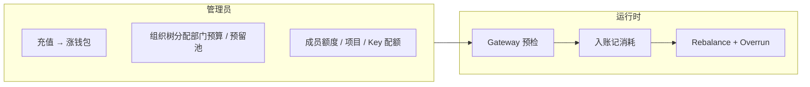
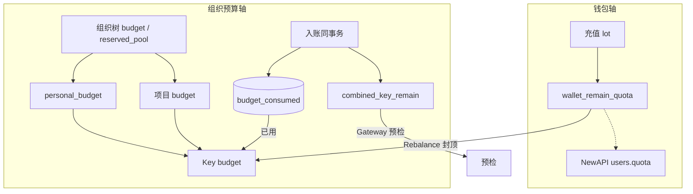
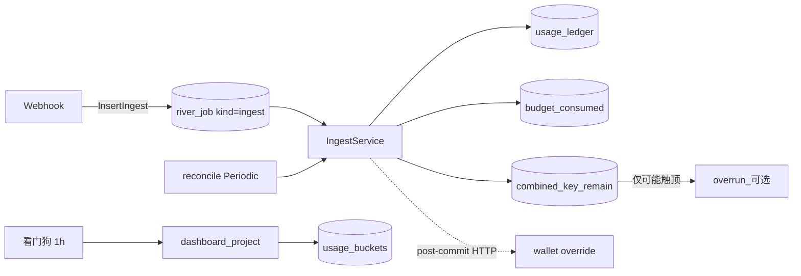
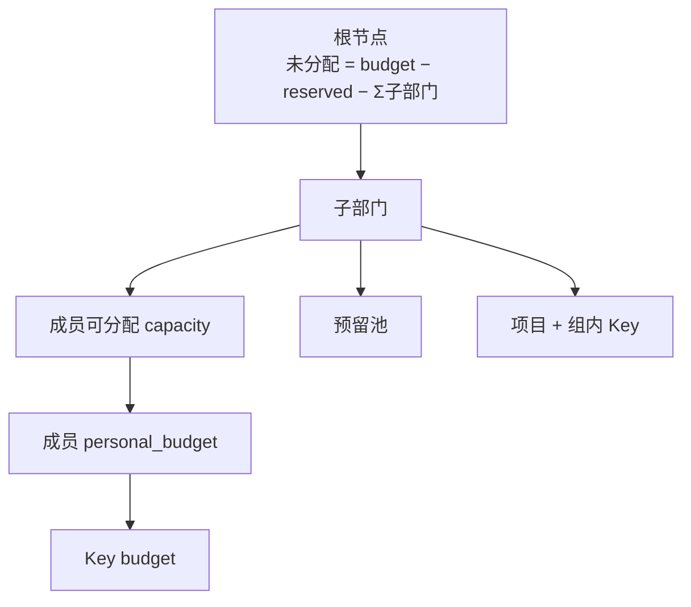
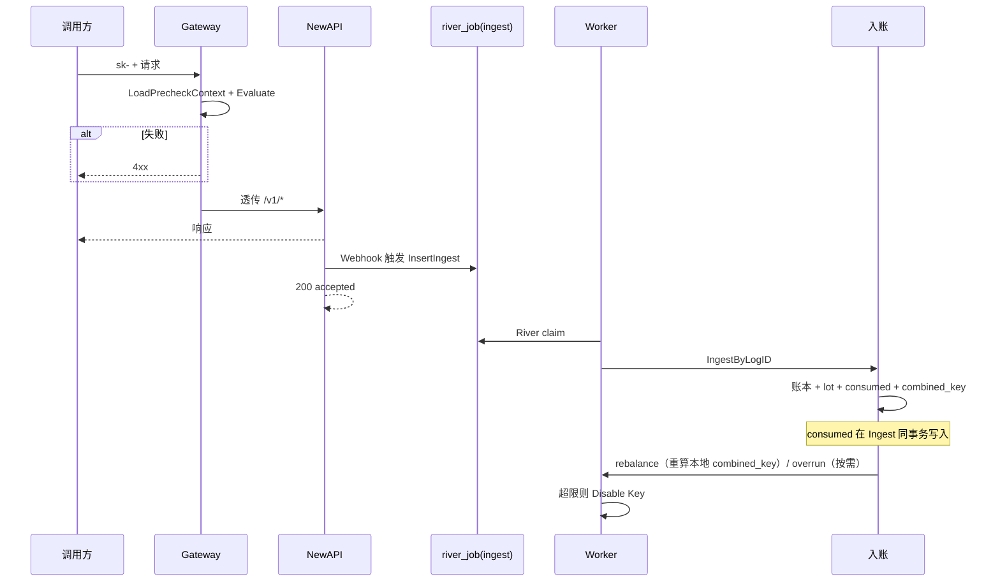
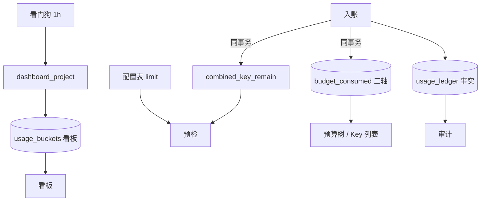
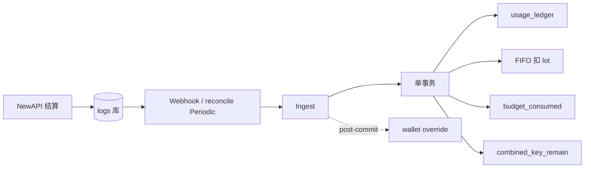
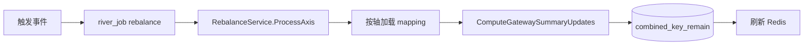
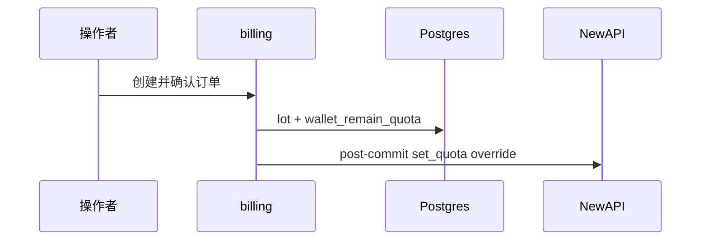

# Backend 预算与消耗

企业钱包与组织预算双轴、入账、配额同步与超限的**当前实现**说明。

**相关：** [Backend-架构.md](./Backend-架构.md) · [Backend-架构.md](./Backend-架构.md) · [Backend-存储架构.md](./Backend-存储架构.md) · [Backend-计费模式.md](./Backend-计费模式.md)

---

## 阅读路径

| 章节   | 适合谁        | 内容                  |
| ------ | ------------- | --------------------- |
| §1–2   | 产品 / 新同学 | 预算管什么、两条轴    |
| §3–4   | 前端 / 实施   | 分配规则、管理面 API  |
| §5     | 全栈联调      | 一次调用全链路        |
| §6–7   | 后端开发      | 存储与入账            |
| §8–10  | 后端 / 运维   | Rebalance、超限、充值 |
| §11–12 | 查表          | 公式、负责域          |
| §13    | 排期          | 待优化与待修复        |

计量单位：内部统一 **point**；钱包展示币由 lot 成本价闭合；NewAPI `remain_quota` 为派生通道配额。详见 [Backend-计费模式.md](./Backend-计费模式.md)。

---

## 1. 产品视角

管理员配置额度，成员在额度内用 Platform Key 调模型：

| 角色        | 关心什么                           |
| ----------- | ---------------------------------- |
| 企业超管    | 钱包余额、根部门总预算、下级分配   |
| 部门 TL     | 本部门预算、预留池、成员额度、项目 |
| 普通成员    | 个人额度、Key 配额、能否继续调用   |
| 审计 / 财务 | 调用花费、归因部门 / 成员          |

**账期：** 分配配置（`budget`、`personal_budget`、Key `budget`）跨月保留；已消耗按开账 `period_key`（通常 `YYYY-MM`，来自业务时钟）写入 `budget_consumed`，新月自动从新账期累计。账本发生月见 [Backend-业务时钟与账期.md](./Backend-业务时钟与账期.md)。

---

## 2. 两条轴

| 轴           | 权威数据                         | 管什么                             | 谁改                                           |
| ------------ | -------------------------------- | ---------------------------------- | ---------------------------------------------- |
| **企业钱包** | 充值 lot、`wallet_remain_quota`  | 预付资金硬上限（point）            | 充值确认 → 异步同步 NewAPI                     |
| **组织预算** | 组织树 limit + `budget_consumed` | 部门 / 成员 / Key / 组的花费与上限 | 控制台写 limit；**Ingest 同事务**累加 consumed |

**约定：**

- 充值**只涨钱包**，不自动涨部门 `budget`。
- **limit** 在组织树、成员、Key、项目；**consumed** 只在 `budget_consumed`（三轴 × 账期；`project_member` sub 已用见 `pkg/budget/chain.go`）。
- API 返回的 `consumed` 为当前账期从快照合并的视图，不是 Key 表上的持久列。

---

## 2a. SSOT 与读写路径（as-built）

| 层             | 存储                                     | 写入                                      | 读方                               |
| -------------- | ---------------------------------------- | ----------------------------------------- | ---------------------------------- |
| **事实**       | `usage_ledger`                           | `usage.IngestService`                     | 审计、minute 看板                  |
| **累计（热）** | `budget_consumed`、`combined_key_remain` | **Ingest 同事务**                         | 预算树、Overrun 判定、Gateway 预检 |
| **展示投影**   | `usage_buckets`                          | `dashboard.Projector`（看门狗小时级触发） | hour/day 看板                      |
| **冷矫正**     | 同上累计表                               | `budget_reconcile` 窗口 `SetConsumed`     | 修漂移                             |

**无** `budget_projection` / 游标 budget Projector——consumed 在 Ingest 同事务写入。

### 2.1 入账路径（as-built）

1. NewAPI settle → 共享 `logs` → webhook / reconcile → `IngestByLogID`
2. 归因 + `BuildCallSettledEntry`（幂等键 `newapi:{log_id}`）
3. `store.WithTx`：ledger → FIFO lot → **`IncrementConsumedBatch(budget_consumed)`** → **`DecrementBatch(combined_key_remain)`**
4. 可选：轻量预判后才 `InsertOverrun`；**不**入队 `dashboard_project`（由看门狗驱动）
5. commit 后：post-commit 直接 HTTP override NewAPI wallet（不经过 river_job）；rebalance：async 按需，多数 Ingest 零 budget job

### 2.2 `budget_consumed` 三轴（Ingest 内）

消耗统一在 `budget_consumed`（`axis_kind`）。业务表无 `consumed` 列。

**三轴：** `platform_key` · `member` · `project`（**不写** `org_node`）。部门花费：`usage_ledger` 按 `department_id` 聚合。Gateway：`combined_key_remain`（`budgetcheck` 缓存）。

| 步骤   | 写入                               | 说明                                               |
| ------ | ---------------------------------- | -------------------------------------------------- |
| 1      | `platform_key` += cost             | Key 已用                                           |
| 2      | `project` += cost                  | `project` / `project_member` scope                 |
| 3      | `member` += cost                   | 仅 `member` scope                                  |
| —      | 无 org_node 轴                     | 部门花费用 ledger 聚合（GetTree 自动 enrichment）  |
| 同事务 | `combined_key_remain`              | 预检热读                                           |
| 提交后 | 告警直做；wallet override 直做；overrun/rebalance 按需 | 见 [Backend-离线任务.md](./Backend-离线任务.md) §5 |

父节点 **limit**：`org_nodes.budget`。看板桶：`dashboard.Projector`（看门狗每小时触发）。

### 2.3 读路径分离

| 场景           | 读什么                        | 为何                                 |
| -------------- | ----------------------------- | ------------------------------------ |
| Gateway 预检   | `combined_key_remain` + limit | ≤0 403；经 budgetcheck 缓存          |
| 看板 cost 趋势 | `usage_buckets` SUM           | Dashboard 投影                       |
| 预算树 limit   | `org_nodes.budget` 等         | 部门 spent 不读 org_node consumed 轴 |
| 部门本月花费   | `usage_ledger` 聚合           | 替代 org_node consumed               |
| 审计调用列表   | `usage_ledger`                | SSOT                                 |
| minute 趋势    | `usage_ledger` 按分钟         | 窗口 ≤3h                             |

---

## 3. 分配层级

| 层级 | 配置                      | 说明                                            |
| ---- | ------------------------- | ----------------------------------------------- |
| 部门 | `budget`、`reserved_pool` | 子节点之和 + 预留池 ≤ 父节点                    |
| 成员 | `personal_budget`         | 部门内成员额度之和 ≤ capacity                   |
| Key  | `budget`、模型白名单      | 从成员或项目剩余额度切分                        |
| 项目 | `budget`                  | 挂项目 Key 走项目额度；Overrun 不走成员个人分支 |

**写入校验：**

| 操作                 | 规则                                                                                                  |
| -------------------- | ----------------------------------------------------------------------------------------------------- |
| 改部门预算           | 子级：新 budget ≥ Σ子节点 + 预留池；对父级：新 budget + 兄弟 + 预留池 ≤ 父可用                        |
| 改成员额度           | ≥ 已分配给 Key 的配额之和；部门内总和 ≤ capacity                                                      |
| 建 Key（成员）       | budget ≤ 成员剩余可分配                                                                               |
| 建 Key（项目）       | budget ≤ 组 budget − 组 consumed − 组内已分配 Key budget（含 `project_member`）                       |
| 建 Key（项目成员）   | roster + `member_budget > 0`；budget ≤ sub 剩余；见 `pkg/budget/scope_validate.go`                    |
| 改项目成员子额度     | `PUT /api/budget/projects/{id}` · `memberBudgets`；须属于 roster                                      |
| 额度追加审批（个人） | 申请额 ≤ 部门 `reserved_pool`；通过后预留池 -= amount，`personal_budget` += amount                    |
| 项目额度追加审批     | Owner 发起，管理员批；申请额 ≤ 部门 `reserved_pool`；通过后预留池 -= amount，project.Budget += amount |
| 项目成员额度审批     | 成员发起，Owner 批；申请额 ≤ 项目未分配余额；通过后 `memberBudgets[applicant]` += amount              |

组织树结构变更与模型白名单同事务提交；预算数字仅经预算域服务修改。

---

## 4. 管理面 API

契约详情见 [Frontend.md](./Frontend.md) §5。

| 能力         | 方法      | 路径                                                              |
| ------------ | --------- | ----------------------------------------------------------------- |
| 预算树       | GET       | `/api/budget/tree`                                                |
| 部门预算     | PUT       | `/api/budget/departments/{departmentId}`                          |
| 成员额度     | GET / PUT | `/api/budget/members/{memberId}`                                  |
| 成员预算汇总 | GET       | `/api/budget/members/{memberId}/summary`                          |
| 项目         | CRUD      | `/api/budget/projects/*`（含 `memberBudgets` patch）              |
| 项目成员已用 | GET       | `/api/budget/projects/{id}/member-consumed`                       |
| 预警规则     | CRUD      | `/api/budget/alerts/*`                                            |
| 超限策略     | GET / PUT | `/api/budget/overrun-policy`                                      |
| 审批         | —         | `/api/approvals/*`（统一审批引擎）                                |
| 充值         | POST      | `/api/billing/recharge`；平台代充见 [Backend-架构.md](./Backend-架构.md) §2 |

---

## 5. 一次调用全链路

生产须开 **Gateway**（`NEW_API_GATEWAY_ENABLED=true`）。

**Gateway 预检（同步）** — 全部通过才代理（单位 point）；1× `LoadPrecheckContext` + 纯内存 `Evaluate`：

| scope            | 公式（见 §14 开发者扩展指南）  |
| ---------------- | ------------------------------------------------------------- |
| `member`         | `min(key, personal, wallet)` — **不含**未分配/预留池/部门报表 |
| `project`        | `min(key, project, wallet)`                                   |
| `project_member` | `min(key, sub_quota, project, wallet)`；sub 已用 = Σ Key 聚合 |

| 检查                      | 数据                                                   |
| ------------------------- | ------------------------------------------------------ |
| 企业 active               | `companies.status`                                     |
| 钱包 ≥ 预估               | `wallet_remain_quota`                                  |
| Key / personal / 项目未超 | `combined_key_remain` + limit（`LoadPrecheckContext`） |
| 模型与 Key 状态           | allowlist、`platform_keys.status`                      |

NewAPI quota **不参与**热路径预检；Gateway 读 Postgres `wallet_remain_quota` 与 `combined_key_remain`；漂移由 Rebalance 与 budget reconcile 消化。

---

## 6. 数据层

| 存储                             | 职责                                                                       |
| -------------------------------- | -------------------------------------------------------------------------- |
| `usage_ledger`                   | 消耗 SSOT；幂等 `newapi:{log_id}`                                          |
| `budget_consumed`                | 三轴 `platform_key` · `member` · `project`；部门 consumed 由 GetTree 从 `usage_ledger` 聚合（read-time enrichment） |
| `platform_keys.combined_key_remain` | Gateway 预检缓存剩余（Ingest / Rebalance 同事务刷新）                    |
| `usage_buckets`                  | 按小时聚合，供趋势图                                                       |
| 组织树 / 成员 / Key / 组         | 仅存 limit                                                                 |

| 读场景                 | 数据源                                                |
| ---------------------- | ----------------------------------------------------- |
| 预算树 limit、Key 已用 | `org_nodes.budget` 等配置 + `budget_consumed`（三轴） |
| 预算树部门 consumed    | `usage_ledger` GROUP BY department_id（GetTree read-time enrichment） |
| Gateway 预检           | `combined_key_remain` + limit                         |
| 看板趋势               | `usage_buckets`                                       |
| 调用审计               | `usage_ledger`                                        |
| 分钟级短趋势           | `usage_ledger` 聚合                                   |

部门本月花费读 `usage_ledger` 按 `department_id` 聚合。表结构见 [Backend-存储架构.md](./Backend-存储架构.md) §5–§8。

---

## 7. 入账与累计

1. 结算日志 → Webhook 或补偿 → 按 mapping 归因
2. 单事务：账本 → lot → **consumed + combined_key**
3. commit 后：直接 HTTP override wallet；overrun / rebalance：**按需**异步（多数跳过）；见 [Backend-离线任务.md](./Backend-离线任务.md)
4. 失败走 River 重试（kind=`ingest`）

`usage_buckets` 由 `dashboard.Projector` 独立维护（看门狗每小时检测 lag 触发）。账期见 [Backend-业务时钟与账期.md](./Backend-业务时钟与账期.md)。

---

## 8. Rebalance

NewAPI token 为 `unlimited_quota`（无需同步远端配额）；Rebalance 只做**本地重算**：按轴拉取相关 Platform Key 的 mapping，重新计算 `combined_key_remain` 并写回 Postgres + 刷新 Redis 缓存，供 Gateway 预检读取。**不调用 NewAPI Admin API**。

| `axis_kind` | 触发                                                                          |
| ----------- | ------------------------------------------------------------------------------ |
| member      | 额度审批通过、成员改预算、project 删除后释放成员 Key                          |
| project     | 入账命中项目（budget reconcile 修复后按 company 轴统一重算，不单独触发 project 轴） |
| company     | 月切（`EnsureMonthRebalance`）、budget reconcile 修复后                       |

**充值不触发 rebalance**（充值只涨钱包，不影响月度限额；Gateway 独立检查 `wallet_remain_quota`）。**Key 创建/变更** 走同步的 `RefreshPlatformKeyCombined`，不经过 river_job 队列。**`platform_key` 不是 rebalance 轴**；`newapisync.EnqueueRebalanceAxis` 已实现但当前无调用点。

（**已移除** `org_node` rebalance 触发；部门触顶仅 notify。）

去重：`dedupe_key = axis_kind:axis_id`。

---

## 9. 超限与预警

**双层封禁：**

| 时机   | 机制                                           |
| ------ | ---------------------------------------------- |
| 请求前 | Precheck：consumed + 预估 > limit → 4xx        |
| 入账后 | Overrun Worker：consumed ≥ limit → Disable Key |

**Overrun 条件（当前账期快照，硬比较 ≥）：**

| 范围               | 条件                                  | 动作                                            |
| ------------------ | ------------------------------------- | ----------------------------------------------- |
| Platform Key       | platform_key 轴 consumed ≥ key.budget | disable 该 Key                                  |
| 成员 personal      | member 轴 consumed ≥ personal_budget  | 禁用该成员 **member** scope Key                 |
| 部门               | ledger 聚合 ≥ `org_nodes.budget`      | **通知 only**；不封 Key                         |
| 项目               | project 轴 consumed ≥ budget          | 禁用该项目 **project** + **project_member** Key |
| project_member sub | Σ Key consumed ≥ `member_budget`      | 禁用该人该项目 **project_member** Key           |

personal 用尽后的追加路径：**US-10 额度审批**（预留池 → `personal_budget`），不是运行时自动蹭未分配。见 §14。

**预警配置：** `alert_rules`、`overrun_policy` 可经 API 配置并持久化；超限通知经 `NOTIFY_WEBHOOK_URL` 出站（如 `overrun_blocked`）。

---

## 10. 充值

充值不改 `org_nodes.budget`；**不触发 rebalance**（月度限额不变，wallet 约束由 Gateway 独立保障）。钱包闭合见 [Backend-计费模式.md](./Backend-计费模式.md)。

---

## 11. 公式速查

| 名称               | 计算                                                                           |
| ------------------ | ------------------------------------------------------------------------------ |
| 部门可分给成员     | budget − reserved_pool − Σ子部门 budget                                        |
| 成员可分给 Key     | personal_budget − Σ已分配 Key budget                                           |
| 成员本账期已用     | `budget_consumed` member 轴                                                    |
| 组可分给 Key       | 组 budget − 组 consumed − Σ组内 Key budget                                     |
| `combined_key_remain` | `ComputeGatewaySummaryUpdates`（纯月度限额剩余，不含 wallet；NewAPI token unlimited 无需同步）     |
| 企业硬顶           | Gateway precheck 独立检查 `wallet_remain_quota`；与 `combined_key_remain` 解耦 |

---

## 12. 负责域

| 职责                                         | 域                                                                    |
| -------------------------------------------- | --------------------------------------------------------------------- |
| 预算树、组、成员额度、预警策略、成员预算汇总 | `domain/budget`                                                       |
| 入账与 ledger                                | `domain/usage`                                                        |
| 预算 / consumed 写入                         | `domain/budget`（Ingest 同事务 `ApplyIncrement`）                     |
| 看板 buckets 投影                            | `domain/dashboard`                                                    |
| Rebalance                                    | `domain/budget/rebalance.go`（纯本地重算 `combined_key_remain`，不调 NewAPI）  |
| NewAPI Admin 边界                            | `domain/adminport` + `integration/newapi/client.go` + `selfhealing.go` |
| Quota 换算                                   | `pkg/budget`                                                     |
| Key 额度校验                                 | `domain/keys` + `pkg/budget`                                          |
| Gateway 缓存                                 | `domain/budget/gateway_summary.go` + `infra/budgetcheck`              |
| consumed 加载                                | `pkg/budget` + `store.BudgetConsumed()`                               |
| Gateway 预检                                 | `domain/gateway`                                                      |
| 充值                                         | `domain/billing`                                                      |
| 异步任务                                     | `river_job`（River；见 [Backend-离线任务.md](./Backend-离线任务.md)） |

---

## 13. 待优化与待修复

按优先级归纳；工程细节另见 [plan/plan.md](./plan/plan.md)、产品差距见 [Roadmap.md](./Roadmap.md)。

### 应修复（行为与配置不一致）

| 项         | 现状                                                        | 建议                                          |
| ---------- | ----------------------------------------------------------- | --------------------------------------------- |
| 超限文案   | `overrun_policy.blockMessage` 已存库，Precheck 返回通用错误 | Gateway 拒绝时读取并返回配置文案              |

**已实现（从此表移除）：** 百分比预警已运行时接线——`usage.IngestService.IngestRaw` post-commit 调 `CheckBudgetAlerts`，按 `alert_rules` 阈值判定并经 `AlertPublisher` → `notification.Service.DispatchAsync` 投递（Email + InApp）。

### 应优化（可靠性 / 可观测）

| 项                   | 现状                                          | 建议                                                          |
| -------------------- | --------------------------------------------- | ------------------------------------------------------------- |
| NewAPI 关闭时 Worker | Rebalance / Overrun 可能空转或静默跳过        | NewAPI 未启用时 job 标记失败或明确 503，避免「以为已同步」    |
| 通知失败             | Webhook 失败常无感知                          | 写 `notification_log` 失败态；关键事件告警                    |
| 双层封禁窗口         | Precheck 通过后、入账前仍可能短暂超卖         | 评估是否收紧预估或缩短入账延迟；文档化可接受窗口              |
| 入账联调             | 依赖 logs 库、webhook secret、Worker 同时就绪 | 用 `pnpm verify:integration` 断言 Gateway + ledger（plan §1） |

### 可优化（体验 / 结构，非阻断）

| 项              | 说明                                                                |
| --------------- | ------------------------------------------------------------------- |
| 前端账期        | 演示环境仍有固定账期硬编码，应跟随后端 `period_key`                 |
| 列表规模        | Key 全量加载 + 内存 enrich；超 500 行时需 SQL 筛选与分页（plan §7） |
| 部门管理员 RBAC | 非管理员默认应只能看本部门 Key 与预算（plan §7 #4）                 |

### 暂不需要改

| 项                     | 说明                                                             |
| ---------------------- | ---------------------------------------------------------------- |
| 双轴模型               | 钱包与组织预算分离是当前设计，运行正常                           |
| `budget_consumed` 三轴 | consumed SSOT；Gateway 读 `combined_key_remain`；与 Overrun / UI 一致 |
| 自然月账期             | `period_key` 机制已满足按月清零                                  |
| 充值不涨部门 budget    | 产品约定，非缺陷                                                 |

---

## 14. 开发者扩展指南

### 14.1 预检链：GatewayChainRemain

核心函数 `pkg/budget/chain.go`，按 scope 取候选池剩余的最小值：

| Scope | 候选池 |
|-------|--------|
| `member` | Key 剩余, personal 剩余 |
| `project` | Key 剩余, 项目剩余 |
| `project_member` | Key 剩余, 子额度剩余, 项目剩余 |

各剩余 = limit - consumed。**仅 `platform_key` 轴**在 `limit=0` 时跳过该候选（不设上限）；member/project/project_member 三个 scope 的候选无条件计入，`limit=0` 时会钳到 `remain=0`（硬拦截）。**不参与预检**：未分配余量、部门报表、预留池。企业钱包在网关层独立检查。

### 14.2 消耗入账轴（ConsumptionDeltas）

`pkg/budget/consumed_attrib.go`：

| Scope | 写入 budget_consumed 轴 |
|-------|------------------------|
| `member` | `platform_key` + `member` |
| `project` | `platform_key` + `project` |
| `project_member` | `platform_key` + `project` |

`project_member` 子额度消耗不单独写轴——通过聚合该成员在该项目下所有 Key 的 `platform_key` 轴得出。

### 14.3 包职责

| 包 | 职责 | 副作用 |
|----|------|--------|
| `pkg/budget` | 纯计算：chain remain、tree、校验、period | 无 |
| `domain/budget` | 编排：service CRUD、overrun、reconcile、combined key | 有 |
| `domain/billing` | 钱包：充值、lot 消耗、余额查询 | 有 |
| `domain/billing/lot` | lot 消耗引擎（FIFO + overdraft） | 有 |

### 14.4 新增预检层级

1. `ChainInputs` 添加字段
2. `GatewayChainRemain` 对应 scope case 添加 candidate
3. `BuildChainInputs` 填充新字段
4. `OverrunService.evaluateOverrun` 添加封禁逻辑
5. 刷新 `combined_key_summaries`

### 14.5 新增 Key Scope

1. `domain/types/keys.go` 添加常量
2. `ValidPlatformKeyScope` 添加 case
3. `GatewayChainRemain` 添加 scope case
4. `ConsumptionDeltas` 添加入账轴
5. `OverrunService` 添加检查
6. `ValidatePlatformKeyScope` 添加字段校验

### 14.6 关键不变量

1. **scope 间不兜底**：member Key 只扣 personal；project Key 只扣项目池
2. **部门 ledger 仅通知**：部门消耗达预算只发预警，不封 Key
3. **未分配不参与运行时**：配置余量仅供分配，预检链不考虑
4. **Personal 用尽即阻断**：恢复路径是预留池审批追加
5. **combined_key_remain 是缓存**：`budget_consumed` 是唯一权威；summary 可重算
6. **Lot 消耗不可逆**：overdraft 只能通过充值覆盖
7. **子额度是 Key 聚合**：`project_member` 不写 member 轴
