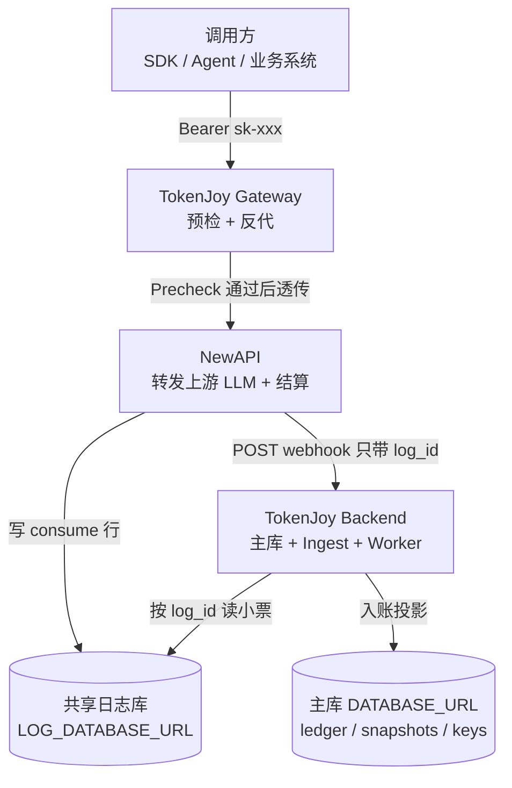
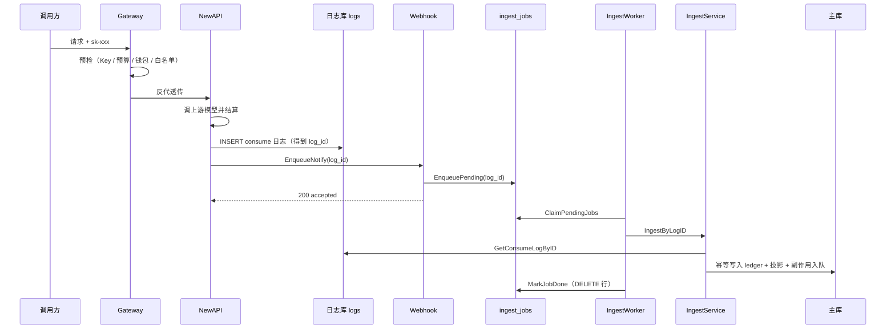
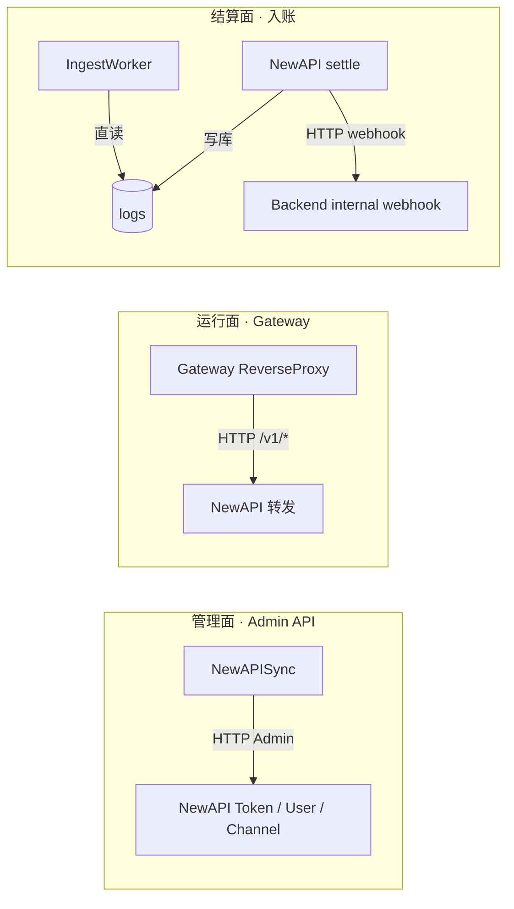
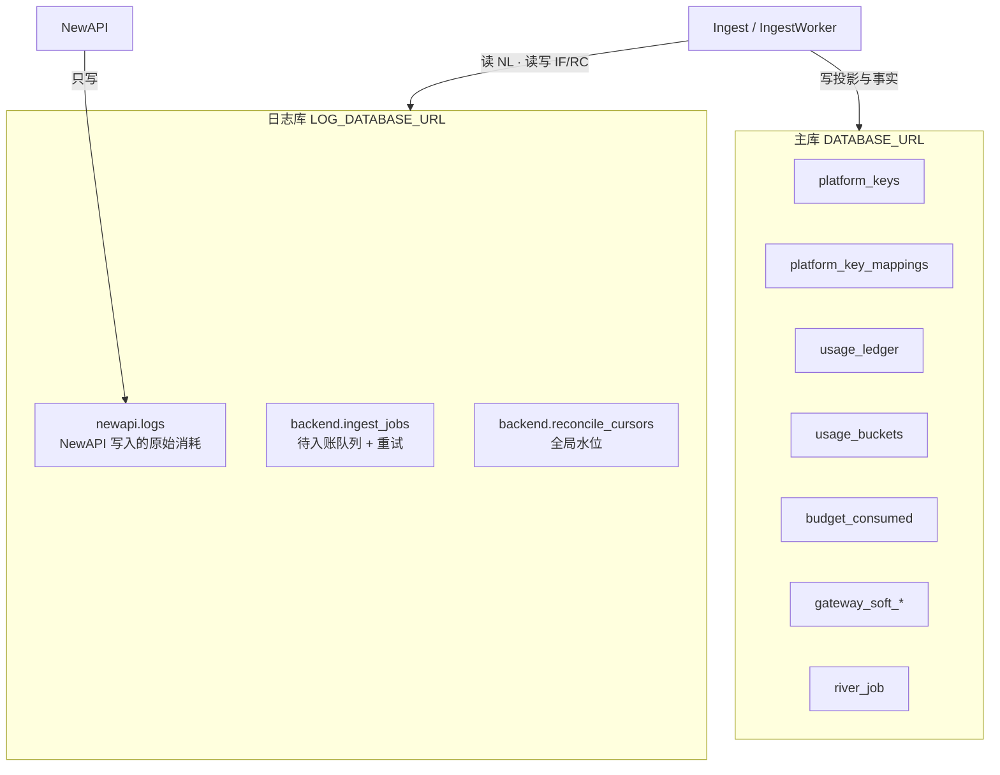
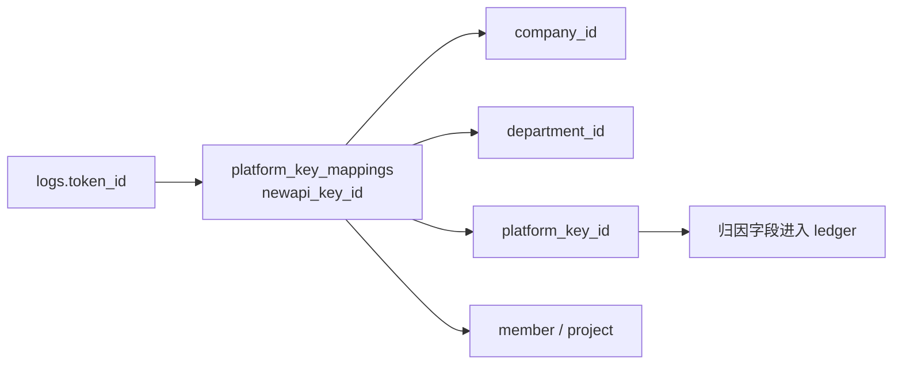
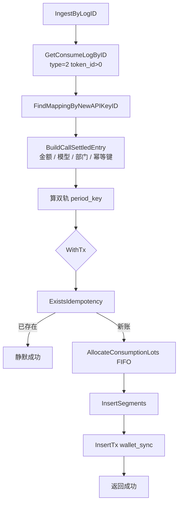
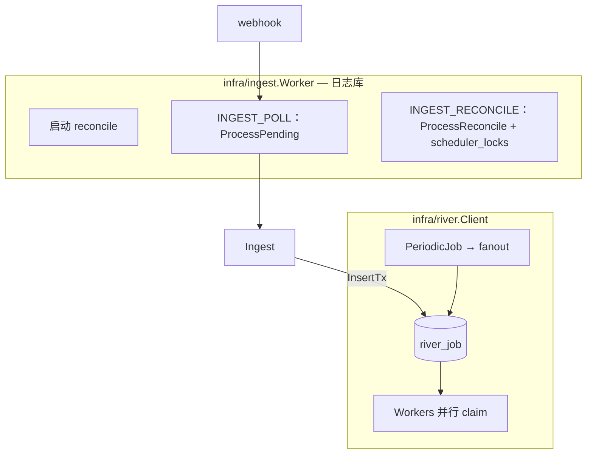
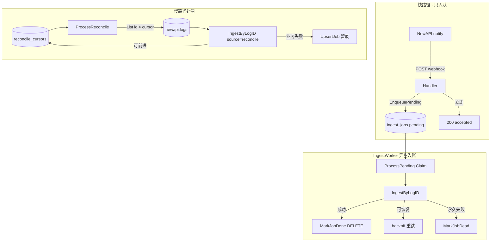

# Backend Ingest 架构：用量如何从 NewAPI 回到 TokenJoy

> **读者**：想搞清「一次 LLM 调用的钱，怎么记到企业账上」的研发 / 运维 / 联调同学。  
> **风格**：由浅入深、只讲机制与数据流；关键路径对应 `apps/backend/internal/domain/usage/` 与 `internal/infra/ingest/`。  
> **相关文档**：[Backend-预算.md](./Backend-预算.md) · [Backend-存储架构.md](./Backend-存储架构.md) · [Backend-计费模式.md](./Backend-计费模式.md) · [Backend-业务时钟与账期.md](./Backend-业务时钟与账期.md) · [Backend-架构.md](./Backend-架构.md) §7 · [Backend-结构优化.md](./Backend-结构优化.md) · [Backend-v1-Ingest链路优化.md](./Backend-v1-Ingest链路优化.md) · [工程收口.md](./工程收口.md)

---

## 0. 一句话先建立直觉

TokenJoy **不自己跑模型**。真正转发请求、结算配额的是 **NewAPI**。  
TokenJoy Backend 要做的是：在 NewAPI 记下一笔「消耗日志」之后，把这笔账 **可靠地、幂等地、可归因地** 写进自己的主库——这就是 **Ingest（入账）**。

| 角色 | 类比 |
| --- | --- |
| NewAPI | 收银台：收单、扣通道额度、写小票 |
| 共享日志库 `logs` | 小票存根柜（两边都能打开） |
| Webhook notify | 收银员喊一声「有新小票了」 |
| Backend Ingest | 会计：按小票入账、分摊到部门/Key、更新预算看板 |
| Worker reconcile | 夜间对账：漏喊的小票也要补上 |

---

## 1. 系统里有谁：三层角色



要点：

1. **调用路径**与 **入账路径**是两条线：调用走 Gateway → NewAPI；入账走日志库 + webhook / Worker。
2. Webhook **不传完整账单**，只传 `{ "log_id": N }`。真相在共享日志库里，Backend 自己去读。
3. 审计与看板最终读的是 **主库**（`usage_ledger` / `usage_buckets`），不是直接查 NewAPI。

---

## 2. 从一次调用看完整故事（浅层）

用户用一把 Platform Key 打 `/v1/chat/completions`：



若 webhook 丢了、队列满了、或 Backend 短暂不可用：

- NewAPI 侧最多重试几次 notify，失败就放弃喊话；
- Backend **IngestWorker** 会用 **水位游标** 扫日志库补洞，保证最终入账。

设计原则：**以共享日志为 SSOT 源**，webhook 只负责 **快速入队**，Worker 异步写账，reconcile 是慢路径兜底。

---

## 3. Backend 与 NewAPI 如何通信

通信不是「一种协议」，而是 **三条正交通道**：



### 3.1 管理面：PlatformKey / NewAPIKey 生命周期

| 方向 | 内容 |
| --- | --- |
| Backend → NewAPI | Create / Update / Toggle / Revoke / Rotate / Delete Token；TopUp 钱包；Upsert Channel |
| 对齐键 | `platform_key_mappings.newapi_key_id` ↔ NewAPI token 主键 |

**为什么 Rotate 不能 delete+create？**  
Ingest 靠 `logs.token_id` 反查 mapping。若 Rotate 换了 token 主键，旧日志对不上新 Key，入账归因断裂。因此 Rotate 走 regenerate，**保持 `newapi_key_id` 不变**。

### 3.2 运行面：Gateway

- 调用方只认识 TokenJoy 的 `/v1/*`。
- Gateway 先做 Precheck（`LoadPrecheckContext` + `Evaluate`：企业状态、组织预算、钱包 `wallet_remain`、模型白名单、Key 状态），通过后 **反代** 到 NewAPI。**不读** NewAPI quota，不因 `wallet_sync` 滞后拒单。
- Gateway **不负责入账**；入账发生在 NewAPI settle 之后。

### 3.3 结算面：Webhook + 直读日志库

| 通道 | 谁发起 | 载荷 | 作用 |
| --- | --- | --- | --- |
| Notify | NewAPI → Backend | `{ "log_id": N }` + `X-Webhook-Secret` | 入队 pending，立即 ACK（不写 ledger） |
| 直读 | Backend → 日志库 | SQL 按 id / 游标扫 | IngestWorker 读真相、入账、补洞、重试 |

两边共享同一套 secret（NewAPI 的 `MANAGEMENT_WEBHOOK_SECRET` ≈ Backend 的 `NEW_API_WEBHOOK_SECRET`）。

---

## 4. 日志如何共享：双库拓扑

TokenJoy 刻意拆成 **两个 Postgres 库**（或同一实例两个 database）：



| 表 | 谁写 | 谁读 | 职责 |
| --- | --- | --- | --- |
| `newapi.logs` | NewAPI | Backend | 消耗原始小票（`type=2` 且 `token_id > 0` 才入账） |
| `backend.ingest_jobs` | Backend | IngestWorker | **待入账队列**（webhook 入队）+ 入账失败重试 / dead 留存 |
| `backend.reconcile_cursors` | Backend | IngestWorker | `stream=newapi_consume` 的 `last_log_id` 水位 |

**为何不把 logs 放进主库？**

- NewAPI 是独立服务，有自己的写入节奏与 schema 习惯；
- 入账失败/游标是 Backend 运维状态，与 NewAPI 表同库但分 schema（`newapi.*` / `backend.*`），边界清晰；
- 主库故障与日志库故障可部分解耦（生产仍要一起监控）。

**Schema 模式**（`LogSchemaIsolated`，非 env，测试/程序内设置）：

| 模式 | 表名 | 场景 |
| --- | --- | --- |
| 生产 | `newapi.logs` / `backend.ingest_jobs` / `backend.reconcile_cursors` | 独立 `LOG_DATABASE_URL` |
| 隔离 | `logs` / `ingest_jobs` / `reconcile_cursors` | 单库测试（`WithIngestEnabled(true)`） |

---

## 5. 如何对齐：从 token_id 到企业账本

### 5.1 身份对齐：`token_id` → 租户归因



流程（`IngestService.IngestRaw`）：

1. 读到一条 consume 日志，取出 `token_id`；
2. `FindMappingByNewAPIKeyID` 找到映射；
3. 映射缺失 → 返回 `404 NotFound`（记 warn 日志）；pending 路径最终 **dead**，reconcile 路径 **推进游标** 并 UpsertJob 留痕；
4. 映射存在 → 注入 `company.Context`，继续建账本条目。

### 5.2 幂等对齐：同一张小票只入一次

| 层 | 机制 |
| --- | --- |
| 幂等键 | `newapi:{log_id}` |
| 事务前 | `ExistsIdempotency` → 已存在则 **静默成功** |
| 插入 | `InsertSegments` ON CONFLICT DO NOTHING |
| 队列 | `ingest_jobs.log_id` UNIQUE — 重复 webhook upsert 同一行 |

因此：**快路径 webhook 与慢路径 reconcile 可以同时跑**，不会把一笔钱记两次。

### 5.3 金额与量纲对齐：双扣 + wallet_sync

一次真实调用会在两边各扣一次，量纲不同：

| 侧 | 扣什么 | 单位 |
| --- | --- | --- |
| NewAPI | 通道 `quota` | NewAPI quota units |
| Backend Ingest | 企业钱包 / 组织预算 | TokenJoy **point** |

二者有取整差，靠 **wallet_sync**（debounce 入队 → River Worker TopUp / 校准）把 NewAPI 用户配额拉回与 Postgres `wallet_remain` 一致。Gateway **不**因漂移或 pending sync 拒单；漂移由异步 `wallet_sync` 与对账冷路径消化。

### 5.4 账期对齐：发生月 vs 开账月（双轨）

调用可能跨月才入库（例如 6/30 发生，7/1 才 Ingest）：

| 写入目标 | 用哪个月 | 含义 |
| --- | --- | --- |
| `usage_ledger.period_key` | **发生时间** `OccurredAt` | 审计「这笔调用发生在哪个月」 |
| `budget_consumed`（Ingest 同事务） | **当前开账月** `Clock` | 门禁与预算树「扣在哪本打开的账上」 |
| `usage_buckets` | 发生时间 | 看板趋势跟真实发生时刻 |

Ingest **同事务**写 ledger + lot + `budget_consumed` + `combined_key_remain`。`usage_buckets` 由 `dashboard.Projector` 异步维护（看门狗每小时检测 lag 触发）。开账轨与发生轨细节见 [Backend-业务时钟与账期.md](./Backend-业务时钟与账期.md)。副作用（overrun/rebalance）约定见 [Backend-离线任务.md](./Backend-离线任务.md)。

---

## 6. Ingest 内部在干什么（中层）

核心入口：`IngestService.IngestByLogID` → `IngestRaw`（`internal/domain/usage/ingest.go`）。



**Ingest 同事务只做：** ledger 幂等插入、FIFO 扣 lot、`budget_consumed` + `combined_key_remain` 原子写入、入队 `wallet_sync`。  
`usage_buckets` 由看门狗每小时触发 `dashboard.Projector` 异步维护（见 [Backend-离线任务.md](./Backend-离线任务.md)）。  
目标迁回 Ingest：[Backend-预算累计架构.md](./Backend-预算累计架构.md)。

### 6.1 预算累计（Ingest 同事务）

| 步骤 | 目标 | 作用 |
| --- | --- | --- |
| 1 | `budget_consumed` · platform_key | Key 已用 |
| 2 | `budget_consumed` · project | 若挂项目（`project` / `project_member` scope） |
| 3 | `budget_consumed` · member | 仅 `member` scope（`project` / `project_member` **不写**） |
| — | **无 org_node 轴** | 部门报表：`usage_ledger` 按 `department_id` 聚合 |
| 同事务 | `combined_key_remain` | Gateway 预检热读 |
| 提交后 | overrun **按需入队**；轻量告警可直做 | 见 [Backend-离线任务.md](./Backend-离线任务.md) |

入账按 Platform Key `scope` 选择性写轴，见 [Backend-预算.md](./Backend-预算.md) §2.2。

看板 `usage_buckets` 由 `dashboard.Projector` 独立维护（看门狗每小时检测 lag 后触发）。

**事实 SSOT** 是 `usage_ledger`；`budget_consumed` / buckets / combined_key 均为可重建投影。

### 6.2 读路径分离（入账后谁读什么）

| 场景 | 读哪里 |
| --- | --- |
| 审计调用列表 | `usage_ledger` |
| 分钟级趋势（≤3h） | `usage_ledger` 聚合 |
| 小时/天看板 | `usage_buckets` |
| Gateway 预检 | `combined_key_remain` + limit（开账月） |
| 预算树 consumed | `budget_consumed`（开账月）；部门节点 limit-only | 部门花费见 `usage_ledger` |

控制台 **不会** 为了展示再去扫 NewAPI logs。

### 6.3 入账后副作用

见 [Backend-离线任务.md](./Backend-离线任务.md)、[Backend-预算.md](./Backend-预算.md)。入队统一为 River `Insert` / `InsertInTx` → `river_job`。

| 副作用 | 条件 | River kind |
| --- | --- | --- |
| `wallet_sync` | **始终** | 同事务；Unique 5s |
| rebalance / overrun | **不在 Ingest 执行** | 按需入队；方向允许轻量预判后跳过 |
| `dashboard_project` | **不在 Ingest 入队** | 看门狗每小时检测 lag 后入队 |

`NEW_API_ENABLED=false` 时：ledger **照常**；rebalance / overrun **不入队**；`wallet_sync` 可入队但无 NewAPI 消费意义。

---

## 7. 后台运行时

**两条线、两个包**（详见 [Backend-离线任务.md](./Backend-离线任务.md) §1）：



**删除现网：** `runner.asyncLoop`、`asyncTick`、`*_processor.go` 顺序轮询。

### 7.1 HTTP 入口

| 路由 | 方法 | 鉴权 | 行为 |
| --- | --- | --- | --- |
| `/api/internal/webhooks/newapi-log` | POST | `X-Webhook-Secret` | 入队 → 200 `accepted` |
| `/api/internal/metrics/ingest` | GET | 同上 | 返回 metrics JSON；`!IngestEnabled()` 时 404 |

Handler **不检查** `IngestEnabled()`；若 log store 为 noop，入队失败返回 500。

Webhook 结果语义：

| 情况 | HTTP | 含义 |
| --- | --- | --- |
| 鉴权失败 | 401 | secret 不对 |
| `log_id` 非法 | 400 | 请求体错误 |
| 入队成功（含重复 notify） | 200 `accepted` | **不代表已写 ledger** |
| 入队失败（日志库不可用等） | 500 | 让 NewAPI notify 重试 |

### 7.2 快路径：pending 队列

`IngestWorker.ProcessPending`（`ingest_worker.go`）：

1. `ClaimPendingJobs(limit=INGEST_JOB_BATCH_SIZE)` — `FOR UPDATE SKIP LOCKED`，租约 5 分钟
2. 逐条 `IngestByLogID(source=webhook)`
3. `ApplyRetry` 按 outcome 处置：
   - 成功 → `MarkJobDone`（**DELETE 行**，非 status 更新）
   - 可恢复 → 指数退避重试（`min(300, 2^attempts)` 秒），最多 20 次 → dead
   - 永久业务错误 → dead
4. `refreshMetrics`

`EnqueuePending`：`ON CONFLICT (log_id)` 重置为 pending；**dead 行可被 webhook 复活**（attempts 清零）。

### 7.3 慢路径：reconcile 补洞

`IngestWorker.ProcessReconcile`：

1. 抢 `scheduler_locks`（`ingest_reconcile`，租约 = reconcile 间隔 + 1min，最小 2min）
2. 读游标 `newapi_consume`，按 `id` 递增扫 `type=2 AND token_id>0`
3. 每批最多 `INGEST_RECONCILE_BATCH_SIZE`（默认 500），最多 `INGEST_RECONCILE_MAX_ROUNDS`（默认 10）轮
4. 逐条 `IngestByLogID(source=reconcile)`，**每条成功后立即推进游标**

错误分类（`ingest_outcome.go`）：

| 分类 | 典型原因 | pending 路径 | reconcile 游标 |
| --- | --- | --- | --- |
| OK | 成功 / 幂等命中 | Done（删行） | 推进 |
| Business | mapping 缺失、预算超限 403、校验失败 | 永久 → dead；`NotFound` 可恢复 → 退避 | 推进 + UpsertJob 留痕 |
| LogNotFound | 日志尚未可见 | 退避 → dead | 推进 |
| LogDBTemp | Postgres 瞬时错误 | 退避 | **不推进** |
| TokenjoyTemp | 503 / 其它临时错误 | 退避 | **不推进** |

Reconcile 遇业务失败 **仍推进游标**（防卡死在坏数据上），并通过 `RecordFailure` 写入 `ingest_jobs` 供运维可见。

### 7.4 可靠性总图



---

## 8. 可观测性

`GET /api/internal/metrics/ingest` 返回（`ingestmetrics/collector.go`）：

| 字段 | 含义 |
| --- | --- |
| `ingest_webhook_accepted_total` | webhook 200 计数（**入队成功**，非 ledger 条数） |
| `ingest_reconcile_gaps` | 游标之后尚未 reconcile 的 consume 行数 |
| `ingest_jobs_pending` | status=pending 且 attempts<20 的 job 数 |
| `ingest_lag_seconds` | 游标后最老未处理 log 的 `created_at` 距今秒数 |

`Refresh` 在每次 `ProcessPending` / `ProcessReconcile` 结束后调用。

---

## 9. 配置与启用条件

### 9.1 启用逻辑

| 概念 | 条件 | 说明 |
| --- | --- | --- |
| `IngestEnabled()` | `LOG_DATABASE_URL != ""` | 创建 log pool、启动 ingestLoop、挂载真实 metrics |
| Webhook secret 校验 | `IngestEnabled()` 时 startup **必须** 配 `NEW_API_WEBHOOK_SECRET` | 不是 enable flag，是启动校验 |
| 生产契约 | `DEPLOY_ENV=production` | 还要求 `LOG_DATABASE_URL`、`NEW_API_WEBHOOK_SECRET`、`NEW_API_ENABLED`、Gateway |

### 9.2 环境变量

| 配置 | 默认 | 作用 |
| --- | --- | --- |
| `LOG_DATABASE_URL` | — | 共享日志库；**Ingest 总开关** |
| `NEW_API_WEBHOOK_SECRET` | — | Webhook + metrics 鉴权 |
| `NEW_API_ENABLED` | `false` | 副作用入队 + River Client（线 B）消费 rebalance/overrun/wallet |
| `NEW_API_GATEWAY_ENABLED` | `false` | 挂载 `/v1` Gateway |
| `WORKER_POLL_INTERVAL_SEC` | `1` | pending 消费间隔 |
| `INGEST_RECONCILE_INTERVAL_SEC` | `300` | reconcile 间隔 |
| `INGEST_RECONCILE_BATCH_SIZE` | `500` | 每批扫描 log 数 |
| `INGEST_RECONCILE_MAX_ROUNDS` | `10` | 单次 reconcile 最多批次数 |
| `INGEST_JOB_BATCH_SIZE` | `20` | 单次 claim pending 数 |
| `MANAGEMENT_WEBHOOK_URL` | — | NewAPI 侧喊话地址 |
| `MANAGEMENT_WEBHOOK_SECRET` | — | NewAPI 发出时带的 secret |

### 9.3 联调常见坑

- Docker 里 NewAPI 打宿主机 Backend：Linux 需 `extra_hosts: host.docker.internal:host-gateway`（见 `apps/newapi/docker-compose.yml`）。
- webhook `200 accepted` **不等于**已入账；看 `ingest_jobs_pending` / `ingest_lag_seconds` / ledger。
- `NEW_API_ENABLED=false` 时 ingest **仍工作**（写账），只是不同步 NewAPI remain / overrun。
- webhook 全关时系统仍可工作：只靠 reconcile，延迟变大。
- **本地模拟消耗 Popup**：`pnpm start` 为全栈（含 NewAPI + `dev-mock-llm`）；`pnpm docker:reset` 含 bootstrap。模型 `local-test-model` 仅 `DEPLOY_ENV=local` Gateway 放行。见 [本地模式-模拟消耗Popup.md](./manual-testing/本地模式-模拟消耗Popup.md)。

---

## 10. 端到端架构总图

```mermaid
flowchart TB
  subgraph callers [调用方]
    SDK[SDK / 业务]
  end

  subgraph tokenjoy [TokenJoy Backend]
    API[管理 API]
    GW[Gateway Precheck]
    ING[IngestService]
    IW[IngestWorker]
    RC[River Client 线 B]
    MAIN[(主库)]
  end

  subgraph newapi [NewAPI]
    ADM[Admin API]
    NA[/v1 上游]
    SETTLE[Settle 写 logs]
    NOTIFY[Notify Worker]
  end

  subgraph shared [共享]
    LOGS[(日志库)]
  end

  API <-->|Remote-first PlatformKey| ADM
  SDK --> GW --> NA --> SETTLE --> LOGS
  SETTLE --> NOTIFY -->|log_id| WH[Webhook]
  WH --> Q[(ingest_jobs)]
  IW --> Q
  IW --> ING
  ING --> LOGS
  ING --> MAIN
  RC -->|wallet_sync / rebalance| ADM
  API --> MAIN
```

**数据权威分层：**

| 问题 | 权威答案在哪 |
| --- | --- |
| 这次调用 Raw 发生了什么？ | `newapi.logs` |
| 企业账上记了多少、归因到谁？ | `usage_ledger` |
| 本月预算用了多少？ | `budget_consumed`（开账月） |
| 通道还能不能打？ | Gateway 预检（`wallet_remain` + snapshots）；NewAPI remain 为执行面派生 |
| 企业还剩多少预付？ | Postgres `wallet_remain` / lots（NewAPI user quota 是派生缓存） |

---

## 11. 代码模块索引

| 模块 | 路径 | 职责 |
| --- | --- | --- |
| IngestService | `internal/domain/usage/ingest.go` | 入账编排 |
| Entry / Projection | `internal/domain/usage/entry.go`, `projection.go` | 原始 log → ledger 条目 → 投影 |
| Outcome / Queue | `internal/domain/usage/ingest_outcome.go`, `ingest_queue.go` | 错误分类、重试、入队 |
| Side effects | `internal/domain/usage/side_effects.go` | rebalance / overrun 入队 |
| HTTP Handler | `internal/http/handler/ingest/handler.go` | webhook + metrics |
| IngestWorker | `internal/infra/ingest/worker.go` | pending + reconcile |
| Ingest Worker | `internal/infra/ingest/worker.go` | 日志库 pending / reconcile |
| River | `internal/infra/river/client.go` | 全部离线 job |
| Metrics | `internal/infra/ingestmetrics/collector.go` | 计数与 lag |
| LogStore | `internal/store/log_repo.go`, `postgres/log_repo.go` | 日志库 CRUD |
| Config | `internal/config/config.go`, `validate.go`, `worker.go` | 启用条件与间隔 |
| Wiring | `internal/app/assemble.go`、`compose_domain_wire.go`、`compose_worker.go`、`registry.go` | DI 与 Worker 启动 |

---

## 12. 测试覆盖

| 区域 | 测试文件 | 覆盖点 |
| --- | --- | --- |
| 入账核心 | `tests/domain/usage/ingest_test.go` | 幂等、rollup、period、mapping 缺失 |
| 队列 / 重试 | `tests/domain/usage/ingest_queue_test.go` | Enqueue、dead 复活、ApplyRetry |
| 错误分类 | `tests/domain/usage/ingest_outcome_test.go` | 游标推进、retry 规则 |
| NewAPI guard | `tests/domain/usage/ingest_enqueue_guard_test.go` | `NEW_API_ENABLED=false` 不入队 |
| 预算门禁 | `tests/domain/usage/ingest_budget_guard_test.go` | 403 budget exceeded |
| Worker | `tests/worker/ingest_worker_test.go` | reconcile 多 log、游标、zero-token 跳过 |
| HTTP E2E | `tests/handler/gateway/webhook_ingest_test.go` | webhook→worker 闭环、metrics |
| Store | `tests/store/postgres/log_repo_test.go` | 队列 dedup、claim、cursor |
| Metrics | `tests/infra/ingestmetrics/collector_test.go` | snapshot 字段 |

---

## 13. 已知边界与演进方向

### 13.1 明确不必改的设计

| 项 | 原因 |
| --- | --- |
| 以 `log_id` 为幂等源 | 跨 webhook/retry/reconcile 唯一自然键 |
| Rotate 保持 token_id | 保护 ingest 归因连续性 |
| 双轨 period（发生 vs 开账） | 跨月入库与预算门禁不能混用同一把尺子 |
| 控制台不直读 NewAPI logs | 归因、计价、权限都在 TokenJoy 域模型里 |
| webhook 不写 ledger | ACK 与入账解耦；入账统一走 Worker + 幂等 |
| failure 队列与 newapi_sync outbox 分离 | 入账失败与 Token 同步失败的重试语义不同 |
| 成功 job DELETE 而非 mark done | 队列只保留 pending / dead，减少表膨胀 |

### 13.2 仍可改进（见 [plan.md](./plan.md)）

| 方向 | 现状 | 建议 |
| --- | --- | --- |
| Notify 队列满 | NewAPI 内存队列有界，满则 drop | 可接受因有 reconcile；监控 drop |
| 入账延迟 | 取决于 `WORKER_POLL_INTERVAL_SEC` | 监控 `ingest_lag_seconds` / pending；调参见 [Backend-v1-Ingest链路优化.md](./Backend-v1-Ingest链路优化.md) **I1** |
| 投影 / 预检摘要 lag | `gateway_soft_*` 异步刷新 | 缩窗见 [Backend-v1-Ingest链路优化.md](./Backend-v1-Ingest链路优化.md) **§10**；SLA 见 [架构终态设计.md](./架构终态设计.md) §14 |
| Update Key 非严格 Remote-first | 先写 DB 再 sync | 与 Create 路径统一 |
| 预检 estimate | 固定最小值 | 按模型单价动态估价 |
| enqueue→ledger 延迟 | 无直方图 | 可增加延迟 metric |
| mapping 缺失自愈 | 拒绝入账 | 严格审计前提下评估自动重建 |

---

## 14. 阅读路径建议

1. 本文 §0–§2：建立故事线  
2. §3–§5：通信、共享库、对齐键  
3. §6–§7：入账步骤与 Worker 可靠性  
4. §8–§9：可观测性与配置  
5. §10：端到端总图  
6. 深入算法：[Backend-预算.md](./Backend-预算.md) · [Backend-计费模式.md](./Backend-计费模式.md)  
7. 账期细节：[Backend-业务时钟与账期.md](./Backend-业务时钟与账期.md)  
8. 表结构：[Backend-存储架构.md](./Backend-存储架构.md)  
9. 上线缺口：[工程收口.md](./工程收口.md)  
10. 性能与投影 lag：[Backend-v1-Ingest链路优化.md](./Backend-v1-Ingest链路优化.md)
11. 本地模拟消耗 Popup：[本地模式-模拟消耗Popup.md](./manual-testing/本地模式-模拟消耗Popup.md)

---

## 15. 小结

- **Ingest** = 把 NewAPI 的消耗小票，变成 TokenJoy 主库里可审计、可预算、可预检的账。  
- **通信** = 管理面 Admin API + 运行面 Gateway 反代 + 结算面 webhook/直读，三条线各司其职。  
- **日志共享** = 独立日志库；NewAPI 写 `newapi.logs`，Backend 写 pending/cursor，并读 logs 入账。  
- **对齐** = `token_id`↔mapping、`newapi:{log_id}` 幂等、point↔quota（`pkg/newapiunits`）的 wallet_sync、发生月↔开账月双轨。  
- **Worker** = **两条异步线**（详见 [Backend-离线任务.md](./Backend-离线任务.md)）：线 A `infra/ingest.Worker`（pending + reconcile）与线 B `infra/river.Client`（`wallet_sync` / rebalance / overrun / org sync 等 River job）并行。  
- **可靠** = webhook 求快 ACK，IngestWorker 求入账，reconcile 求不丢；入账都走同一条 `IngestByLogID`。

---

## 16. Ingest 事务内预算累计（同事务细节）

> 以下内容整合自原 `Backend-预算累计架构.md`，描述 Ingest 事务中 `budget_consumed` 和 `combined_key_remain` 的原子写入。

### 16.1 事务时序

```text
IngestRaw → BEGIN
  → SELECT ... FROM companies WHERE id=$1 FOR UPDATE（公司级串行）
  → ExistsIdempotency?（锁后检查，重复零副作用）
  → ConsumeLots（lot FIFO + wallet_remain）
  → INSERT usage_ledger（segments）
  → IncrementConsumedBatch（UNNEST 批量 UPSERT budget_consumed，最多 3 轴）
  → DecrementBatch（combined_key_remain -= amount；GREATEST(remain - delta, 0)）
  → NULL remain → 锁行重算 → UpdateBatch（仅初始化）
  → INSERT wallet_sync job（River in-tx）
  → 可选 INSERT overrun job（remain ≤ 0 时）
  → COMMIT
```

### 16.2 约束

| 约束 | 实现 |
|---|---|
| 公司级串行 | `companies FOR UPDATE` — Ingest 和 reconcile 共用 |
| 幂等在锁后 | 锁后检查 → 重复请求零副作用 |
| consumed 一次写 | `IncrementConsumedBatch` UNNEST 批量 UPSERT |
| combined 原子扣减 | `GREATEST(remain - delta, 0)` |
| 绝对重算仅初始化 | NULL remain → 锁行 → 重算 → UpdateBatch |
| job 失败 = 账务回滚 | River job 在同一事务中插入 |
| 无 advisory lock | Ingest 热路径不拿 budget advisory lock |

### 16.3 批量 consumed SQL

```sql
INSERT INTO budget_consumed (company_id, axis_kind, axis_id, period_key, consumed, updated_at)
SELECT $1, axis_kind, axis_id, period_key, amount, NOW()
FROM UNNEST($2::text[], $3::text[], $4::text[], $5::numeric[])
    AS input(axis_kind, axis_id, period_key, amount)
ON CONFLICT (company_id, axis_kind, axis_id, period_key)
DO UPDATE SET consumed = budget_consumed.consumed + EXCLUDED.consumed, updated_at = NOW();
```

### 16.4 Overrun Gate

Ingest 只做 gate，不执行 Disable/NewAPI：

- `platformKeyID` 为空 → 跳过
- `summaries == nil`（Unconstrained）→ 跳过
- key 不在 summaries 中（Unknown）→ InsertOverrun
- key 在 summaries 且 `remain ≤ 0` → InsertOverrun
- 否则 → 跳过

`OverrunService` worker 做多轴裁决（platform key → member → project → department），payload 含 `periodKey` 避免跨月误判。

### 16.5 告警（post-commit best-effort）

Ingest commit 后：
1. `CheckBudgetAlerts` — 仅 touched department
2. 收件人：`NotifyRoleIDs` → role name → active members
3. 去重键：`budget-alert:{companyID}:{ruleID}:{threshold}:{periodKey}:{memberID}`
4. 经 `notification.DispatchAsync`，失败只记日志不影响账务

### 16.6 Reconcile（冷路径 ~24h）

`ReconcileService.RunCompany`：
1. `AcquireBudgetLock`（advisory）+ `LockCompanyForUpdate`
2. `ListCallSettledSince`（~2 月窗口）→ 按 entry.OccurredAt 归属开账月
3. diff expected vs actual → `SetConsumed(expected)`；多余行 → `SetConsumed(0)`
4. 有修复 → `LockPlatformKeysForUpdate` → `ComputeGatewaySummaryUpdates` → `UpdateBatch`
5. 修复后 → `InsertRebalance(company)`

### 16.7 数据写入者总览

| 数据 | 写入者 | 时机 |
|---|---|---|
| `usage_ledger` | Ingest | 事务内 |
| `budget_consumed` | Ingest（IncrementConsumedBatch） | 事务内 |
| `budget_consumed` | Reconcile（SetConsumed） | 冷路径修复 |
| `combined_key_remain` | Ingest（DecrementBatch / absoluteRecompute） | 事务内 |
| `combined_key_remain` | Reconcile（UpdateBatch） | 冷路径修复 |
| `combined_key_remain` | Rebalance | 充值/月切后 |
| `usage_buckets` | dashboard projector | 异步投影（看门狗每小时触发） |
