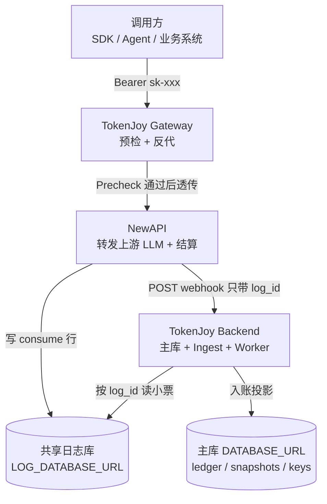
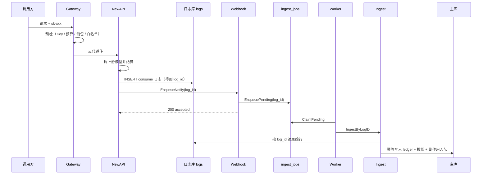
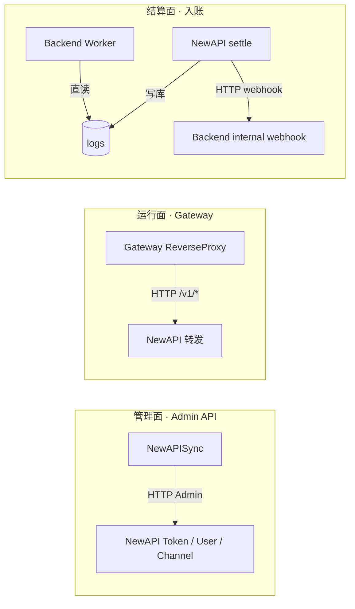
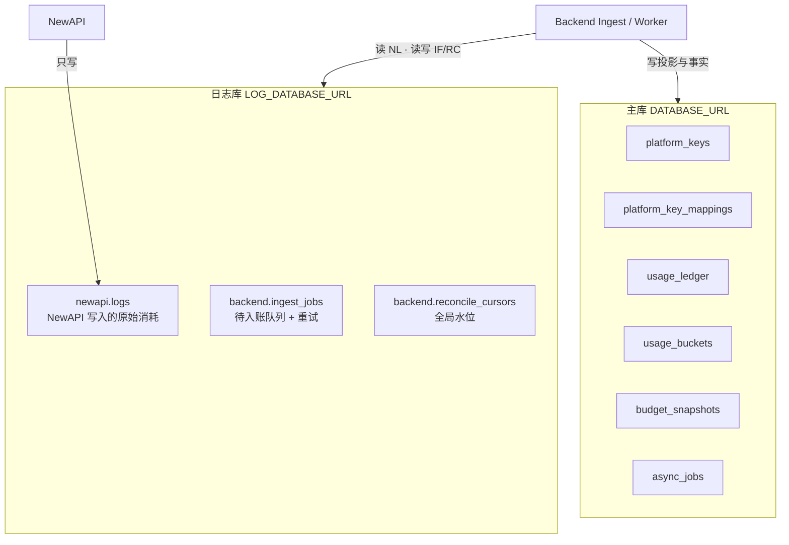
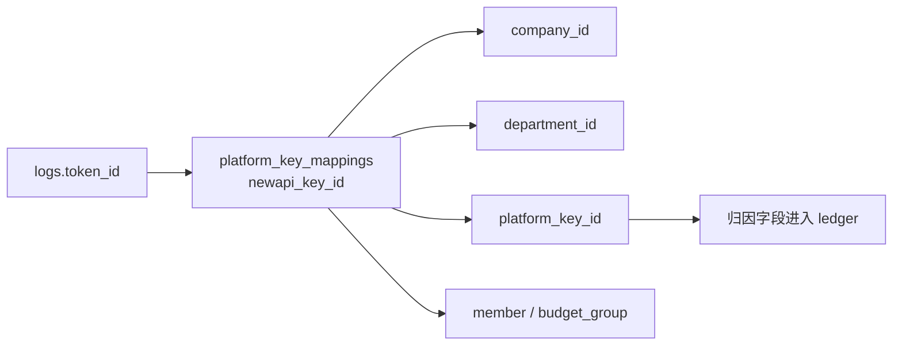
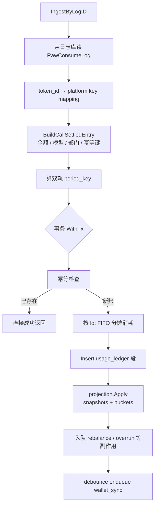
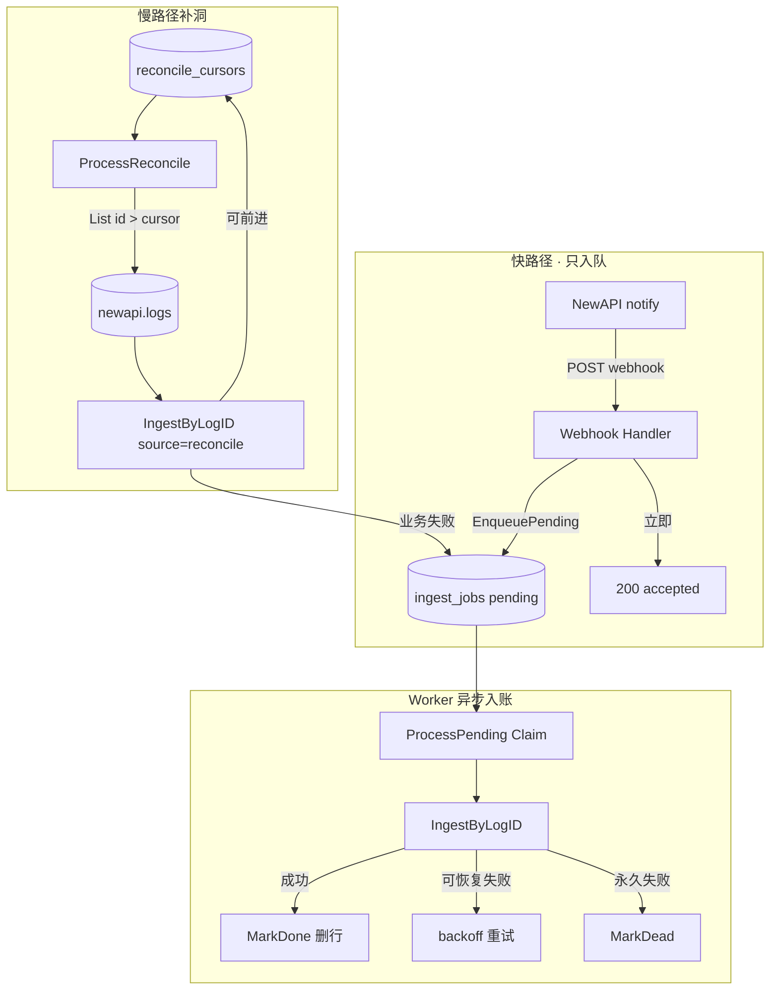

# Backend Ingest 架构：用量如何从 NewAPI 回到 TokenJoy

> **读者**：想搞清「一次 LLM 调用的钱，怎么记到企业账上」的研发 / 运维 / 联调同学。  
> **风格**：由浅入深、只讲机制与数据流，不贴实现代码。  
> **相关文档**：[Backend-预算.md](./Backend-预算.md) · [Backend-存储架构.md](./Backend-存储架构.md) · [Backend-计费模式.md](./Backend-计费模式.md) · [Backend-业务时钟与账期.md](./Backend-业务时钟与账期.md) · [NewAPI-集成状态与缺口.md](./NewAPI-集成状态与缺口.md)

---

## 0. 一句话先建立直觉

TokenJoy **不自己跑模型**。真正转发请求、结算配额的是 **NewAPI**。  
TokenJoy Backend 要做的是：在 NewAPI 记下一笔「消耗日志」之后，把这笔账 **可靠地、幂等地、可归因地** 写进自己的主库——这就是 **Ingest（入账）**。

可以把它想成：

| 角色 | 类比 |
| --- | --- |
| NewAPI | 收银台：收单、扣通道额度、写小票 |
| 共享日志库 `logs` | 小票存根柜（两边都能打开） |
| Webhook notify | 收银员喊一声「有新小票了」 |
| Backend Ingest | 会计：按小票入账、分摊到部门/Key、更新预算看板 |
| Worker reconcile | 夜间对账：漏喊的小票也要补上 |

---

## 1. 系统里有谁：三层角色



要点：

1. **调用路径**与 **入账路径**是两条线：调用走 Gateway → NewAPI；入账走日志库 + webhook / Worker。
2. Webhook **不传完整账单**，只传 `log_id`。真相在共享日志库里，Backend 自己去读。
3. 审计与看板最终读的是 **主库**（`usage_ledger` / `usage_buckets`），不是直接查 NewAPI。

---

## 2. 从一次调用看完整故事（浅层）

用户用一把 Platform Key 打 `/v1/chat/completions`：



若 webhook 丢了、队列满了、或 Backend 短暂不可用：

- NewAPI 侧最多重试几次 notify，失败就放弃喊话；
- Backend Worker 会用 **水位游标** 扫日志库补洞，保证最终入账。

这就是文档里说的 **方案 B**：以共享日志为 SSOT 源，webhook 只负责 **快速入队**，Worker 异步写账，reconcile 是慢路径兜底。

---

## 3. Backend 与 NewAPI 如何通信

通信不是「一种协议」，而是 **三条正交通道**：



### 3.1 管理面：PlatformKey / NewAPIKey 生命周期

| 方向 | 内容 |
| --- | --- |
| Backend → NewAPI | Create / Update / Toggle / Revoke / Rotate / Delete Token；TopUp 钱包；Upsert Channel |
| 对齐键 | `platform_key_mappings.newapi_key_id` ↔ NewAPI token 主键 |

**为什么 Rotate 不能 delete+create？**  
Ingest 靠 `logs.token_id` 反查 mapping。若 Rotate 换了 token 主键，旧日志对不上新 Key，入账归因断裂。因此 Rotate 走 regenerate，**保持 `newapi_key_id` 不变**。

### 3.2 运行面：Gateway

- 调用方只认识 TokenJoy 的 `/v1/*`。
- Gateway 先做 Precheck（企业状态、组织预算、钱包 point、模型白名单、NewAPI remain / 漂移等），通过后 **反代** 到 NewAPI。
- Gateway **不负责入账**；入账发生在 NewAPI settle 之后。

### 3.3 结算面：Webhook + 直读日志库

| 通道 | 谁发起 | 载荷 | 作用 |
| --- | --- | --- | --- |
| Notify | NewAPI → Backend | `{ "log_id": N }` + `X-Webhook-Secret` | 入队 pending，立即 ACK（不写 ledger） |
| 直读 | Backend → 日志库 | SQL 按 id / 游标扫 | Worker 读真相、入账、补洞、重试 |

两边共享同一套 secret（NewAPI 的 `MANAGEMENT_WEBHOOK_SECRET` ≈ Backend 的 `NEW_API_WEBHOOK_SECRET`）。

---

## 4. 日志如何共享：双库拓扑

TokenJoy 刻意拆成 **两个 Postgres 库**（或同一实例两个 database）：



| 表 | 谁写 | 谁读 | 职责 |
| --- | --- | --- | --- |
| `newapi.logs` | NewAPI | Backend | 消耗原始小票（`type=2` 且 `token_id > 0` 才入账） |
| `backend.ingest_jobs` | Backend | Backend Worker | **待入账队列**（webhook 入队）+ 入账失败重试 |
| `backend.reconcile_cursors` | Backend | Backend Worker | `stream=newapi_consume` 的 `last_log_id` 水位 |

**为何不把 logs 放进主库？**

- NewAPI 是独立服务，有自己的写入节奏与 schema 习惯；
- 入账失败/游标是 Backend 运维状态，与 NewAPI 表同库但分 schema（`newapi.*` / `backend.*`），边界清晰；
- 主库故障与日志库故障可部分解耦（当然生产仍要一起监控）。

启用条件：配置了 `LOG_DATABASE_URL` **且** `NEW_API_WEBHOOK_SECRET` → `IngestEnabled`。生产环境二者为硬依赖。

---

## 5. 如何对齐：从 token_id 到企业账本

「对齐」有多层含义，从身份对齐到金额对齐。

### 5.1 身份对齐：`token_id` → 租户归因



流程：

1. 读到一条 consume 日志，取出 `token_id`；
2. `FindMappingByNewAPIKeyID` 找到映射；
3. 映射缺失 → 拒绝入账（记失败 / 告警），因为无法知道属于哪家企业、哪个部门；
4. 映射存在 → 注入 company context，继续建账本条目。

### 5.2 幂等对齐：同一张小票只入一次

- 幂等键：`newapi:{log_id}`
- 事务内先查是否已存在；已存在则 **静默成功**（webhook 可重复、reconcile 可重复）
- ledger 插入也是冲突忽略语义，防止并发双写

因此：**快路径 webhook 与慢路径 reconcile 可以同时跑**，不会把一笔钱记两次。

### 5.3 金额与量纲对齐：双扣 + wallet_sync

一次真实调用会在两边各扣一次，量纲不同：

| 侧 | 扣什么 | 单位 |
| --- | --- | --- |
| NewAPI | 通道 `quota` | NewAPI quota units |
| Backend Ingest | 企业钱包 / 组织预算 | TokenJoy **point** |

二者有取整差，靠 **wallet_sync**（debounce 入队 → Worker TopUp / 校准）把 NewAPI 用户配额拉回与 Postgres `balance_point` 一致。Gateway 在漂移过大且 sync 未完成时会拒单，避免「主库以为还有钱、通道已经没了」。

### 5.4 账期对齐：发生月 vs 开账月（双轨）

调用可能跨月才入库（例如 6/30 发生，7/1 才 Ingest）：

| 写入目标 | 用哪个月 | 含义 |
| --- | --- | --- |
| `usage_ledger.period_key` | **发生时间** `OccurredAt` | 审计「这笔调用发生在哪个月」 |
| `budget_snapshots`（Apply） | **当前开账月** `Clock` | 门禁与预算树「扣在哪本打开的账上」 |
| `usage_buckets` | 发生时间 | 看板趋势跟真实发生时刻 |

这是 Ingest 作为 **唯一双写点** 的设计：只有入账路径同时碰发生轨与开账轨。细节见 [Backend-业务时钟与账期.md](./Backend-业务时钟与账期.md)。

---

## 6. Ingest 内部在干什么（中层）

把「会计入账」拆成固定步骤：



### 6.1 投影写什么

| 步骤 | 目标 | 作用 |
| --- | --- | --- |
| 1 | `budget_snapshots` · platform_key | Key 已用 |
| 2 | `budget_snapshots` · budget_group | 若挂组 |
| 3 | `budget_snapshots` · org_node 祖先 rollup | 部门树向上累加 |
| 4 | `usage_buckets` | 小时桶 × 部门 × 成员 × 模型 |

**事实 SSOT** 是 `usage_ledger`；snapshots / buckets 是同事务投影，供预检、预算树、看板快速读取。

### 6.2 读路径分离（入账后谁读什么）

| 场景 | 读哪里 |
| --- | --- |
| 审计调用列表 | `usage_ledger` |
| 分钟级趋势（≤3h） | `usage_ledger` 聚合 |
| 小时/天看板 | `usage_buckets` |
| 预算树 consumed / Gateway 预检 | `budget_snapshots`（开账月） |

控制台 **不会** 为了展示再去扫 NewAPI logs。

---

## 7. 可靠性：三条入账路径如何配合（深层）



### 7.1 Webhook 结果语义

| 情况 | HTTP | 含义 |
| --- | --- | --- |
| 鉴权失败 | 401 | secret 不对 |
| `log_id` 非法 | 400 | 请求体错误 |
| 入队成功（含重复 notify） | 200 `accepted` | **不代表已写 ledger**；Worker 稍后入账 |
| 入队失败（日志库不可用等） | 500 | 让 NewAPI notify 重试 |

Webhook **不再**区分「日志尚未可见 / mapping 缺失」——这些由 Worker 消费时分类重试或 dead。

### 7.2 Reconcile 水位规则

- 按 `id` 递增扫描 `type=consume` 且 `token_id > 0` 的行；
- 成功、业务失败、甚至「日志不存在」类结果，在设计上允许 **推进游标**（避免卡死在一条坏数据上）；
- 真正的瞬时系统错误则 **不推进**，下一轮重试同一批；
- 多实例用 `scheduler_locks`（`ingest_reconcile`）保证同时只有一个 reconcile 持有者。

### 7.3 与 Worker 其它任务的关系

Worker 一轮大致顺序：

```text
newapi_sync outbox → ingest_jobs 消费（webhook 队列 + 重试）→ reconcile 补洞 → rebalance → overrun → org sync …
```

Ingest 成功后可能入队 **rebalance**（把组织/Key 剩余同步成 NewAPI `remain_quota`）和 **overrun**（超限封禁）。它们消费的是主库 `async_jobs`，与日志库 pending 表分离。

---

## 8. 端到端架构总图

把「管理 / 调用 / 入账 / 校准」放在一张图里：

```mermaid
flowchart TB
  subgraph callers [调用方]
    SDK[SDK / 业务]
  end

  subgraph tokenjoy [TokenJoy Backend]
    API[管理 API<br/>Keys / Budget / Dashboard]
    GW[Gateway Precheck]
    ING[IngestService]
    WK[Worker]
    MAIN[(主库)]
  end

  subgraph newapi [NewAPI]
    ADM[Admin API]
    NA[/v1 上游]
    SETTLE[Settle 写 logs]
    NOTIFY[Notify Worker]
  end

  subgraph shared [共享]
    LOGS[(日志库)]
  end

  API <-->|Remote-first PlatformKey 生命周期| ADM
  SDK --> GW --> NA --> SETTLE --> LOGS
  SETTLE --> NOTIFY -->|log_id 入队| WH[Webhook Enqueue]
  WH --> Q[(ingest_jobs)]
  WK --> Q
  WK --> ING
  ING --> LOGS
  ING --> MAIN
  WK -->|wallet_sync / rebalance| ADM
  API --> MAIN
```

**数据权威分层：**

| 问题 | 权威答案在哪 |
| --- | --- |
| 这次调用 Raw 发生了什么？ | `newapi.logs` |
| 企业账上记了多少、归因到谁？ | `usage_ledger` |
| 本月预算用了多少？ | `budget_snapshots`（开账月） |
| 通道还能不能打？ | NewAPI remain + Gateway 预检（含钱包漂移） |
| 企业还剩多少预付？ | Postgres `balance_point` / lots（NewAPI user quota 是派生缓存） |

---

## 9. 配置与联调心智模型

| 配置 | 作用 |
| --- | --- |
| `NEW_API_ENABLED` | 打开 NewAPI 集成总开关 |
| `LOG_DATABASE_URL` | 指向共享日志库；Ingest 直读 |
| `NEW_API_WEBHOOK_SECRET` | Backend 校验 webhook / metrics |
| `MANAGEMENT_WEBHOOK_URL` | NewAPI 喊话地址（常指向 Backend internal webhook） |
| `MANAGEMENT_WEBHOOK_SECRET` | NewAPI 发出时带的 secret |
| `NEW_API_GATEWAY_ENABLED` | 挂载 `/v1`；须与 `NEW_API_ENABLED` 同开才有意义 |
| Worker 轮询间隔 | 控制 pending 消费 / reconcile 延迟上限 |

常见坑：

- Docker 里 NewAPI 用 `host.docker.internal` 打宿主机 Backend，Linux 常不通，需改 URL 或 `extra_hosts`；
- 只开 Gateway 不开 NewAPI → 路由可能不挂，进程仍能起来；
- webhook 全关时系统仍可工作：只靠 reconcile，延迟变大；
- webhook `200 accepted` **不等于**已入账，看 `ingest_jobs_pending` / ledger。

---

## 10. 可优化与改进点

下列按「收益 / 风险」整理，部分已在 [plan.md](./plan.md) 与 [NewAPI-集成状态与缺口.md](./NewAPI-集成状态与缺口.md) 登记。

### 10.1 可靠性与正确性

| 项 | 现状 | 建议 |
| --- | --- | --- |
| Notify 队列满直接丢 | NewAPI 内存队列有界，满则 drop | 可接受因有 reconcile；若要更低延迟，可落盘或加大队列并监控 drop 指标 |
| Webhook 只 ACK | 入账延迟取决于 Worker 轮询 | 监控 pending 积压与 lag；必要时缩短 `WORKER_POLL_INTERVAL_SEC` |
| Reconcile 遇业务失败仍推进水位 | 防卡死 | 正确；需配套 dead-letter 人工处理（缺 mapping、脏数据） |
| Update Key 非严格 Remote-first | 先写 DB 再 sync | 与 Create 路径统一 Remote-first，缩小崩溃窗口不一致 |
| 预检 estimate 固定 | 非按模型动态估价 | 按模型单价估，减少「预检过、结算爆」 |

### 10.2 可观测性

| 项 | 现状 | 建议 |
| --- | --- | --- |
| `ingest_notify_total` | webhook **入队成功**即 +1 | 与「ledger 首次插入」分开计数，避免混淆 |
| `GET /internal/metrics/ingest` | secret 鉴权 | 生产限制网段；暴露 gaps、pending failures |
| NewAPI notify 失败 | 打日志 | 导出 Prometheus 计数：成功 / 重试耗尽 / queue drop |
| 入账可见延迟 | webhook→worker 一轮 | 增加「enqueue→ledger」延迟直方图 |

### 10.3 运维与部署

| 项 | 现状 | 建议 |
| --- | --- | --- |
| `host.docker.internal` | macOS 友好，Linux 易挂 | compose 按 OS 文档化；或同网络 DNS 服务名 |
| `gate:verify` | 不覆盖 Backend Gateway | 增加一条真实 `/v1` + ingest 闭环冒烟 |
| 双库备份 | 两套连接 | 备份/恢复 runbook 写明：恢复主库后如何重置或追平 reconcile 水位 |
| 多实例 reconcile | 有分布式锁 | 压测锁租约与 `ReconcileMaxRounds`，避免长尾堆积 |

### 10.4 产品与架构演进（中长期）

| 方向 | 说明 |
| --- | --- |
| 推送完整事件 vs 只推 id | 当前「只推 id + 共享库」简单且一致；若未来 NewAPI 与 Backend 跨云，可评估带签名的事件载荷，减少跨库依赖 |
| 按企业分片游标 | 全球单一 `last_log_id` 简单；超大规模可按 wallet user / token 范围分片并行 |
| mapping 缺失自动修复 | 今日拒绝入账；可对「Token 仍存在于 NewAPI」做自愈重建 mapping（需严格审计） |
| overdraft 运营闭环 | lot 不足扩展 overdraft 已存在；缺统一告警与人工核销流 |
| 审计内容保留策略 | ledger 可存 snippet；与合规 retention 策略对齐，避免日志库 content 与主库双存失控 |

### 10.5 明确不必改的设计（避免「优化」成回退）

| 项 | 原因 |
| --- | --- |
| 以 `log_id` 为幂等源 | 跨 webhook/retry/reconcile 唯一自然键 |
| Rotate 保持 token_id | 保护 ingest 归因连续性 |
| 双轨 period（发生 vs 开账） | 跨月入库与预算门禁不能混用同一把尺子 |
| 控制台不直读 NewAPI logs | 归因、计价、权限都在 TokenJoy 域模型里 |
| webhook 不写 ledger | ACK 与入账解耦；入账统一走 Worker + 幂等 |
| failure 队列与 newapi_sync outbox 分离 | 入账失败与 Token 同步失败的重试语义不同 |

---

## 11. 阅读路径建议

1. 本文 §0–§2：建立故事线  
2. §3–§5：通信、共享库、对齐键  
3. §6–§7：入账步骤与可靠性  
4. 深入算法：[Backend-预算.md](./Backend-预算.md) · [Backend-计费模式.md](./Backend-计费模式.md)  
5. 账期细节：[Backend-业务时钟与账期.md](./Backend-业务时钟与账期.md)  
6. 表结构：[Backend-存储架构.md](./Backend-存储架构.md)  
7. 上线缺口：[NewAPI-集成状态与缺口.md](./NewAPI-集成状态与缺口.md) · [plan.md](./plan.md)

---

## 12. 小结

- **Ingest** = 把 NewAPI 的消耗小票，变成 TokenJoy 主库里可审计、可预算、可预检的账。  
- **通信** = 管理面 Admin API + 运行面 Gateway 反代 + 结算面 webhook/直读，三条线各司其职。  
- **日志共享** = 独立日志库；NewAPI 写 `newapi.logs`，Backend 写 pending/cursor，并读 logs 入账。  
- **对齐** = `token_id`↔mapping、`newapi:{log_id}` 幂等、point↔quota 的 wallet_sync、发生月↔开账月双轨。  
- **可靠** = webhook 求快 ACK，Worker 求入账，reconcile 求不丢；入账都走同一条 `IngestByLogID`。
