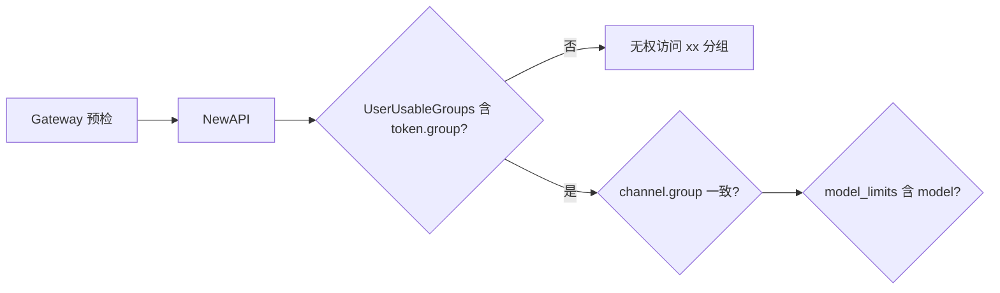

# NewAPI 集成 — 修复清单

> 范围：**私有化与 SaaS 共有**的 Backend ↔ NewAPI 契约。Demo seed 数据问题见 [apps/backend/seed/FIXES.md](../apps/backend/seed/FIXES.md)；本地联调编排见 [manual-testing/本地模式-修复索引.md](./manual-testing/本地模式-修复索引.md)。

---

## 分组约定（生产）

| 部署 | Platform Key `group` | Channel 来源 |
|------|----------------------|--------------|
| 私有化 | `dept-{departmentId}`（实现为 `dept-dept-3` 等） | 企业 `provider_keys` + 可选 dev channel |
| SaaS | `PLATFORM_SHARED_NEW_API_GROUP`（默认 `platform_shared`） | 平台全局 provider |

代码：`internal/domain/newapisync/channel_policy.go`、`internal/pkg/newapiunits/quota.go`。

---

## 请求链路（集成视角）



Gateway 403 且 `type: new_api_error` 时，按 `message` 区分 **分组** vs **模型**。

---

## FIX-INT-001 — 创建 Token 前未注册 NewAPI 分组（P0）

| | |
|--|--|
| **现象** | `无权访问 dept-dept-3 分组`（或任意 `dept-dept-*`） |
| **根因** | NewAPI 新建实例 `UserUsableGroups` 仅 `default`/`vip`；`TrySyncCreate` 写入 `token.group = dept-dept-*` 但**不**更新全局选项 |
| **与 seed 关系** | Seed 正确；Token group 与 dev-mock channel group 一致；缺 NewAPI 侧注册 |
| **临时修复** | NewAPI Admin 添加分组；或 `apps/newapi/scripts/setup-dev-mock-channel.sh`（仅注册脚本入参的一个 group） |
| **永久修复** | 在 `SyncCreatePlatformKey` / `TrySyncCreate` 前调用 `ensureNewAPIGroup(ctx, group)`（Admin API 合并 `UserUsableGroups` + `GroupRatio`） |
| **代码** | `lifecycle_create.go`；参考 `apps/newapi/scripts/_verify-lib.sh` → `verify_ensure_newapi_group` |

---

## FIX-INT-002 — 本地 bootstrap 只注册单个 group（P0，dev 脚本）

| | |
|--|--|
| **现象** | `dept-dept-3` 可用后，`plk-5` 仍 `无权访问 dept-dept-5 分组` |
| **根因** | `setup-dev-mock-channel.sh` 只 `verify_ensure_newapi_group dept-dept-3`；active seed keys 还含 `dept-dept-5` |
| **永久修复** | 脚本按 demo 用到的部门枚举注册；或合并到 FIX-INT-001 由 Backend 按 mapping 注册 |
| **文件** | `apps/newapi/scripts/setup-dev-mock-channel.sh`、`bootstrap-local-after-reset.sh` |

---

## FIX-INT-003 — 白名单变更后 `model_limits` 不刷新（P1）

| | |
|--|--|
| **现象** | `no access to model local-test-model`（分组已修好） |
| **根因** | `model_limits` 仅在 create/update sync 时写入；mapping 已 `synced` 则 bootstrap 跳过 |
| **临时修复** | Key Rotate / toggle |
| **永久修复** | 白名单变更出队 `OutboxKindUpdateModelLimits`；或 bootstrap 对比 catalog 与 mapping 版本后强制 update |

---

## FIX-INT-004 — Provider Channel 未设 `group`（P2，私有化生产模型）

| | |
|--|--|
| **现象** | Platform Key 在 `dept-dept-3`，真实模型走 provider channel 在 `default` 组，路由失败或行为不一致 |
| **根因** | `adminport.UpsertChannelInput` 无 `Group`；`lifecycle_provider.go` 不传 group |
| **永久修复** | 扩展 `UpsertChannelInput` + adapter；私有化下与 `channelPolicy.ResolveNewAPIGroup` 对齐（或文档明确 provider 仅 SaaS `platform_shared`） |
| **代码** | `lifecycle_provider.go`、`integration/newapi/` |

---

## FIX-INT-005 — Mapping 已 synced 但与 NewAPI 不一致（P2）

| | |
|--|--|
| **现象** | `Invalid token`；或 DB 显示 synced 但 NewAPI 无对应 token |
| **根因** | 只 reset NewAPI 卷或只 reset Postgres；或手改 NewAPI Admin |
| **修复** | `pnpm docker:reset`（双库）；或对 Key rotate |
| **可选工程** | 启动时对 `synced` mapping 做 `GetToken` 对账 |

---

## FIX-INT-006 — `key_hash` 仍为 `pending:plk-*`（已部分落地）

| | |
|--|--|
| **现象** | Gateway `platform key not found` |
| **修复** | Create 路径先 `persistPlatformKeySecret` 再标 synced；`repairStalePlatformKeyHashes` on bootstrap |
| **代码** | `lifecycle_create.go`、`repair_stale_hashes.go`、`bootstrap_local.go` |

---

## FIX-INT-007 — Gateway Bearer 要求 `sk-` 前缀（已修复）

| | |
|--|--|
| **现象** | 401 Unauthorized |
| **修复** | `gateway/auth.go` 接受任意非空 Bearer |
| **状态** | ✅ 已合并 |

---

## 诊断

```bash
# NewAPI 已注册分组？
curl -s -H "Authorization: Bearer $NEW_API_ADMIN_TOKEN" -H "New-Api-User: 1" \
  http://localhost:3000/api/option/ | python3 -c "
import json,sys
opts={i['key']:i['value'] for i in json.load(sys.stdin)['data']}
print(opts.get('UserUsableGroups'))
"

# Token group / limits
curl -s -H "Authorization: Bearer $NEW_API_ADMIN_TOKEN" -H "New-Api-User: 1" \
  "http://localhost:3000/api/token/?p=0&size=20"
```

| message 关键词 | 修复项 |
|----------------|--------|
| `无权访问 dept-dept-* 分组` | FIX-INT-001、002 |
| `no access to model` | FIX-INT-003；seed [FIX-SEED-003](../apps/backend/seed/FIXES.md#fix-seed-003) |
| `Invalid token` | FIX-INT-005 |

---

## 相关代码索引

| 主题 | 路径 |
|------|------|
| Token create + group | `internal/domain/newapisync/lifecycle_create.go` |
| Token update + limits | `internal/domain/newapisync/lifecycle_update.go` |
| Provider channel | `internal/domain/newapisync/lifecycle_provider.go` |
| Demo key bootstrap | `internal/domain/newapisync/bootstrap_local.go` |
| 架构 §2.3 | [Backend.md](./Backend.md) |
