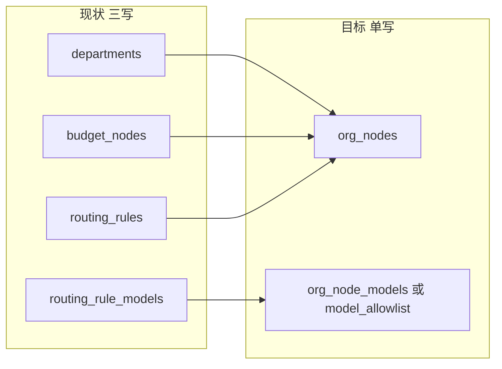
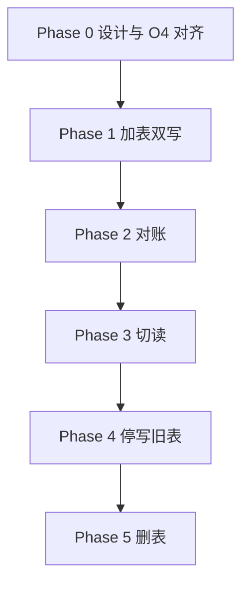

# Backend O2：组织节点合并实施方案

本文将 [Backend-存储实体优化.md](./Backend-存储实体优化.md) §4 的「部门 + 预算节点 + 路由 → `org_nodes`」提炼为**可执行实施方案**。

**范围：** 仅方案与迁移设计；**不在本文实施** DDL 或代码改动。

**相关文档：**

- 优化总览与优先级：[Backend-存储实体优化.md](./Backend-存储实体优化.md) §4
- 现状实体关系：[Backend-存储架构.md](./Backend-存储架构.md)
- 白名单合并（建议同批）：[Backend-存储实体优化.md](./Backend-存储实体优化.md) §6 O4

---

## 1. 决策摘要

| 项 | 决策 |
| -- | ---- |
| 目标 | `departments` + `budget_nodes` + `routing_rules`（+ `routing_rule_models`）→ 单表 **`org_nodes`** |
| ID 语义 | **节点 ID 不变**（`department_id` / `budget_node_id` / `routing node_id` 继续同值） |
| 白名单 | 与 **O4** 一并落地：`org_node_models` 或统一 `model_allowlist (owner_type='org_node')`，避免 `routing_rule_models` 迁两次 |
| 对外 API | HTTP 可保持「组织」「预算」「模型路由」三个资源面；底层读同一行的不同列组 |
| 优先级 | **P2**；前置 **O1 已完成** |
| 建议批次 | O2 + O4 同一迭代（2～3 个月量级，视改造面评估） |



---

## 2. 现状与痛点

### 2.1 物理表与领域含义

三张主表共享**同一套节点 ID**（非外键约束，而是刻意同 ID）：

| 表 | 主要字段 | 领域含义 |
| -- | -------- | -------- |
| `departments` | `name`, `parent_id`, `manager_id`, `external_id`, `source`, `member_count` | 组织架构 |
| `budget_nodes` | `name`, `parent_id`, `budget`, `consumed`, `reserved_pool`, `period` | 预算树 |
| `routing_rules` | `node_id`, `node_name`, `default_model`, `fallback_model`, `inherited` | 节点路由（每节点一条，`rr-{nodeId}`） |
| `routing_rule_models` | `rule_id`, `model_name` | 路由模型白名单 |

控制台展示为「组织树」「预算树」两棵 UI 树，底层却是**三份持久化状态**。

### 2.2 唯一写入入口（现状）

组织树增删改必须在**同一事务**内联动三处 Store：

| 步骤 | 表 | Store / 方法 |
| ---- | -- | ------------ |
| 1 | `departments` | `Org().SetDepartments` |
| 2 | `budget_nodes` | `Budget().SetTree` |
| 3 | `routing_rules` + `routing_rule_models` | `Models().SetRoutingRules` |

典型 Domain 入口：`internal/domain/org/provision.go` 中 `ProvisionDepartment` / `RenameDepartment` / `DeprovisionDepartment`。内存侧已用 `ProvisionState` 把三者绑成一个对象——**领域上就是一个实体**，只是库里拆成了三张表。

### 2.3 痛点归纳

| 痛点 | 后果 |
| ---- | ---- |
| 同步 bug 类 | 任一入口漏调 `SetTree` 或 `SetRoutingRules`，会出现「有部门无预算」「有预算无路由」 |
| 事务范围大 | 每次树变更读写的行数 ×3，全量 upsert + prune |
| 概念分裂 | API、文档、UI 各说「部门」「节点」「预算节点」 |
| 冗余列 | `name` / `node_name` 三处存同名 |

---

## 3. 目标 DDL

### 3.1 `org_nodes`

```sql
CREATE TABLE org_nodes (
    id                TEXT NOT NULL,
    company_id        BIGINT NOT NULL REFERENCES companies (id),
    parent_id         TEXT,
    sort_order        INT NOT NULL DEFAULT 0,
    -- org
    name              TEXT NOT NULL,
    manager_id        TEXT,
    external_id       TEXT,
    source            TEXT,
    member_count      INT NOT NULL DEFAULT 0,
    -- budget
    budget            NUMERIC(18, 6) NOT NULL DEFAULT 0,
    consumed          NUMERIC(18, 6) NOT NULL DEFAULT 0,
    reserved_pool     NUMERIC(18, 6),
    period            TEXT NOT NULL,
    -- routing
    default_model     TEXT,
    fallback_model    TEXT,
    routing_inherited BOOLEAN NOT NULL DEFAULT FALSE,
    created_at        TIMESTAMPTZ NOT NULL DEFAULT NOW(),
    updated_at        TIMESTAMPTZ NOT NULL DEFAULT NOW(),
    PRIMARY KEY (company_id, id)
);

CREATE INDEX idx_org_nodes_parent ON org_nodes (company_id, parent_id);
```

说明：

- `routing_rules.id`（如 `rr-dept-2`）**废弃**；路由语义以 `(company_id, id)` 即节点 ID 为主键。
- 飞书导入等仅改组织列时，budget / routing 列可用默认值，不必单独建部门行后再补预算行。

### 3.2 模型白名单（二选一，推荐与 O4 合并）

**方案 A（O2 独立）：** `org_node_models`

```sql
CREATE TABLE org_node_models (
    company_id  BIGINT NOT NULL,
    node_id     TEXT NOT NULL,
    model_name  TEXT NOT NULL,
    PRIMARY KEY (company_id, node_id, model_name)
);
```

**方案 B（推荐，与 O4 同批）：** 统一 `model_allowlist`

```sql
-- owner_type = 'org_node', owner_id = node_id
-- 见 Backend-存储实体优化.md §6.3
```

### 3.3 下线表

迁移完成后删除：

- `departments`
- `budget_nodes`
- `routing_rules`
- `routing_rule_models`（或先由 `model_allowlist` / `org_node_models` 替代再删）

---

## 4. 代码影响面

### 4.1 Store 层

| 现状 Repository | 改动方向 |
| --------------- | -------- |
| `OrgRepository`（`SetDepartments`, `Departments`） | 树读写迁至 `OrgNodeRepository` 或合并进单一 repo 的 org 列组 |
| `BudgetRepository`（`SetTree`, `Tree`, `RollupDepartmentConsumed`） | 预算列组读写同表；rollup 仍按 `id` / 祖先 `parent_id` 遍历 |
| `ModelsRepository`（`SetRoutingRules`, `RoutingRules`） | 路由列组 + 白名单关联表 |

Postgres / Memory 双实现需同步；`schema.sql` 为唯一 DDL 来源（本地 `docker compose down -v` 重建）。

### 4.2 Domain 层

| 模块 | 改动 |
| ---- | ---- |
| `domain/org/provision.go` | `ProvisionState` 收敛为 `[]OrgNode`；增删改只 mutate 一份切片 |
| `domain/org/department.go` | 调用链不变，底层单次 `SetOrgNodes` |
| `domain/budget/*` | 树 CRUD 迁入 org 包或共享 `pkg/org`；`consumed` rollup 读 `org_nodes.consumed` |
| `domain/models/*` | 路由规则列表由 `org_nodes` 投影；白名单走 `model_allowlist` |
| `domain/usage/projection.go` | `RollupDepartmentConsumed` 目标列仍为节点 `consumed`，**节点 ID 不变则 O1 投影逻辑可复用** |

### 4.3 HTTP 层

对外路由可不变：

- `GET/PUT /org/departments` → 读写的 `name`, `parent_id`, `manager_id` 等列
- `GET/PUT /budget/tree` → 读写的 `budget`, `consumed`, `period` 等列
- `GET/PUT /models/routing` → 读写的 `default_model`, `fallback_model`, 白名单

Handler 可继续注入三个 Service，底层共享 `OrgNodeStore`。

### 4.4 Seed 与测试

| 资产 | 动作 |
| ---- | ---- |
| `store/seed/org_insert.go`, `budget_insert.go`, `models_insert.go` | 合并为 `org_nodes` + 白名单 seed |
| `tests/handler/onboarding_test.go`, `contract_test.go` | provision 单事务单表断言 |
| `tests/domain/org/*`, `tests/domain/budget/*` | 更新夹具构造 |

### 4.5 不改动的引用方（ID 稳定）

以下字段继续存 **节点 ID**，无需数据重写：

- `members.department_id`
- `usage_ledger.department_id`、`usage_buckets.department_id`
- `platform_keys.department_id`、`relay_mappings.department_id`
- `alert_rules.department_id`（若有）

---

## 5. 迁移策略

分阶段执行，每阶段可独立回滚。



### Phase 0：准备

- 与 O4 方案定稿：`org_node_models` vs `model_allowlist`
- 补充集成测试：provision 三操作（增 / 删 / 改名）+ 路由继承

### Phase 1：加表 + 双写

1. `schema.sql` 增加 `org_nodes`（+ 白名单表）
2. 一次性 backfill：JOIN 三表按 `id` 合并 INSERT
3. 所有树变更路径（`provision.go`、飞书同步、`SetTree` 等）**同事务写旧表 + 新表**

### Phase 2：对账

- 定时任务或脚本：按 `company_id` 比对行数、`name`、`parent_id`、`budget`、`consumed`、`default_model`、白名单集合
- 不一致 → 告警，禁止切读

### Phase 3：切读

- `Org` / `Budget` / `Models` 读路径改 `org_nodes`（可 feature flag）
- 全量测试 + 灰度企业验证

### Phase 4：停写旧表

- 双写关闭，仅写 `org_nodes`
- 观察期（建议 ≥ 1 个发布周期）

### Phase 5：删表

- 从 `schema.sql` 移除四张旧表
- 清理 Store 死代码、`ProvisionState` 三分结构

### 回滚

| 阶段 | 回滚方式 |
| ---- | -------- |
| Phase 1～2 | 读仍走旧表；可 truncate `org_nodes` |
| Phase 3 | Flag 切回旧表读；双写保持 |
| Phase 4+ | 需从 `org_nodes` backfill 回旧表（成本高）；故 Phase 4 前必须对账稳定 |

---

## 6. 与 O1 / O4 的关系

### 6.1 与 O1（消耗 SSOT）

- O1 已完成：`usage_ledger` 为 SSOT，`projection.Apply` 更新 `budget_nodes.consumed`
- O2 **不改变** `department_id` 语义；rollup 目标列从 `budget_nodes.consumed` 改为 `org_nodes.consumed`，算法不变
- Ingest、看板 minute（ledger 聚合）、审计 calls **不依赖** 三表拆分，O2 可独立排期

### 6.2 与 O4（白名单合一）

- `routing_rule_models` 若先迁到 `org_node_models`，再迁 `model_allowlist` 会**重复施工**
- **建议：** O2 与 O4 同迭代，路由白名单直接 `owner_type = 'org_node'`
- `platform_key_models`、`key_approval_models` 可在同表用不同 `owner_type` 一并落地

---

## 7. 验收清单

| # | 验收项 | 标准 |
| - | ------ | ---- |
| 1 | 树变更单写 | `ProvisionDepartment` 一次事务只 upsert `org_nodes`（+ 白名单），无 `SetDepartments` + `SetTree` + `SetRoutingRules` 三调用 |
| 2 | ID 稳定 | 现有 seed / 测试中的 `dept-*` ID 不变；成员、ledger、bucket 外键语义不变 |
| 3 | 路由继承 | 子节点 `routing_inherited` 与父白名单解析与现网一致 |
| 4 | 预算 rollup | Ingest 后祖先 `consumed` 与 O1 基线一致 |
| 5 | 双树 UI | 组织树、预算树 API 响应字段与迁移前契约一致 |
| 6 | 飞书同步 | 仅组织列变更时不破坏 budget / routing 默认值 |
| 7 | 测试 | `go test ./apps/backend/...` 全绿；provision / onboarding 集成测试覆盖增删改 |
| 8 | 对账 | 双写阶段脚本零 diff 持续 N 天 |

---

## 8. 风险与触发条件

### 8.1 风险

| 风险 | 缓解 |
| ---- | ---- |
| 大范围 refactor 回归 | 分阶段双写 + 对账；Phase 3 前不删旧表 |
| 单行变宽、锁粒度变粗 | 树变更频率低，可接受；热路径（Relay、Ingest）不读整行树 |
| API 边界模糊 | 文档明确三 API 面读同表不同列；Handler 保持现有 DTO |
| 迁移回滚困难（Phase 4 后） | 拉长 Phase 3 观察期；对账自动化 |

### 8.2 触发条件（何时动刀）

与 [Backend-存储实体优化.md](./Backend-存储实体优化.md) §4.6 一致：

- 双树 / 三表联动类 bug 或改造工单明显增多
- O1、O3 已稳定；团队有 2～3 个月 refactor 窗口
- 已与 O4 评审合并批次，避免白名单迁两次

### 8.3 非目标（本文不做）

- Relay store 双实现精简
- `overrun_policy` / `alert_rules` 运行时接线
- 预算组（`budget_groups`）并入组织树
- 用量桶与 ledger 合并

---

## 9. 实施顺序建议


**本地开发约定：** 仅改 `schema.sql`；结构变更后 `docker compose down -v` 重建（见 [Backend-设计.md](./Backend-设计.md) §4）。
