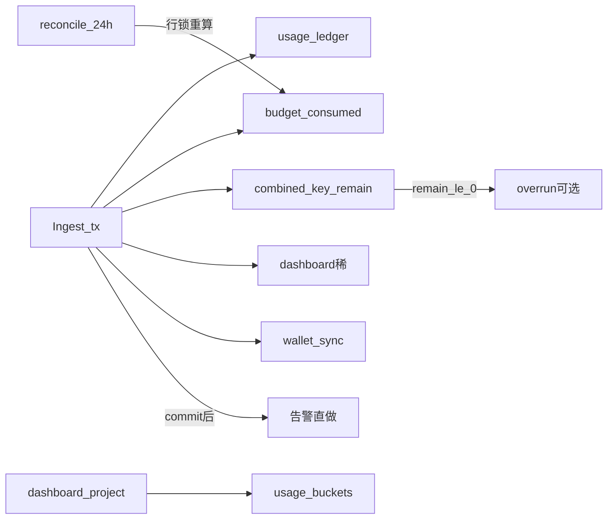

# Backend · 投影与入账副作用（终态）

> **定位**：最优终态——加减在 Ingest；无 budget 投影游标；温路径少 job；冷路径稀矫正。  
> **实现**：[Backend-budget_consumed迁回Ingest.md](./Backend-budget_consumed迁回Ingest.md) · [Backend-离线任务.md](./Backend-离线任务.md) · [Backend-预算.md](./Backend-预算.md)

---

## 1. 分工

| 类别 | 写什么 | 怎么走 |
| --- | --- | --- |
| **热** | ledger、lot、`budget_consumed`、`combined_key_remain` | Ingest 同事务原子加减；**不**拿 advisory 锁、不调 NewAPI |
| **温** | 告警、overrun、rebalance | 告警直做；overrun 先判再入队；rebalance 低频 |
| **冷** | 窗口漂移 | `budget_reconcile`（行锁重算 + ~24h） |
| **展示** | `usage_buckets` | 仅 `dashboard.Projector`（与预算无关） |

**已退役：** `budget_projection`、游标 `budget.Projector`、`budget_projection_progress`。

**检验：** 无高频 `budget_projection`；多数 Ingest 零 budget job；overrun/rebalance 是长尾。

---

## 2. Debounce（已有 River Unique）

不另起中间件：

| 模式 | 用途 |
| --- | --- |
| `ByArgs` + `ByPeriod` | wallet / dashboard / reconcile |
| `ByArgs` only | overrun、rebalance |
| progress 游标 | **仅** dashboard |
| 看门狗 | 长窗 due；**不**靠 budget 游标加减 |

---

## 3. 温路径

| 副作用 | 做法 |
| --- | --- |
| 百分比告警 | commit 后对 **touched 部门**直做；**不**绑 remain≤0 |
| overrun | `combined_key_remain > 0` → 不入队；≤0 / 缺数才 `InsertOverrun` |
| rebalance | 充值 / 月切 / reconcile 等；**不**跟每笔 Ingest |
| wallet / dashboard | 保持现有 Unique |

不建默认 `budget_effects` 服务。

---

## 4. 仍存在的 Projector

| | 状态 |
| --- | --- |
| `dashboard.Projector` | 活跃（写 buckets） |
| `budget.Projector` | **删除**（加减已在 Ingest） |

---

## 5. Reconcile（冷）

| | Budget |
| --- | --- |
| 节奏 | ~24h Unique + 看门狗 |
| 写 | 窗口内漂移 → `SetConsumed` + 刷新 combined |
| 互斥 | **行锁（FOR UPDATE）+ 锁内重拉 ledger**；Ingest 不拿 advisory，靠同行锁与增量 UPSERT 串行 |
| 批首 | `EnsureMonthRebalance`（company） |

细节与伪代码见实现文档 §5。

---

## 6. 运维速查

| 现象 | 排查 |
| --- | --- |
| consumed 不对 | Ingest 是否成功；再跑 `budget_reconcile` |
| 几乎无 overrun | 正常；触顶查 kind=`overrun` |
| 告警不来 | 是否误挂 overrun；应 commit 后直做 |
| NewAPI remain 偏高 | rebalance 触发源 / Worker 空跑 |
| 仍见 `budget_projection` | 未收敛到终态 |

锚点：`ingest.go` · `overrun.go` · `rebalance.go` · `budget_reconcile.go` · `infra/jobs/kinds_*.go`。
