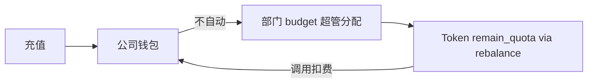
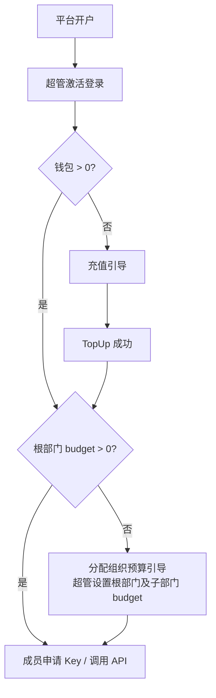
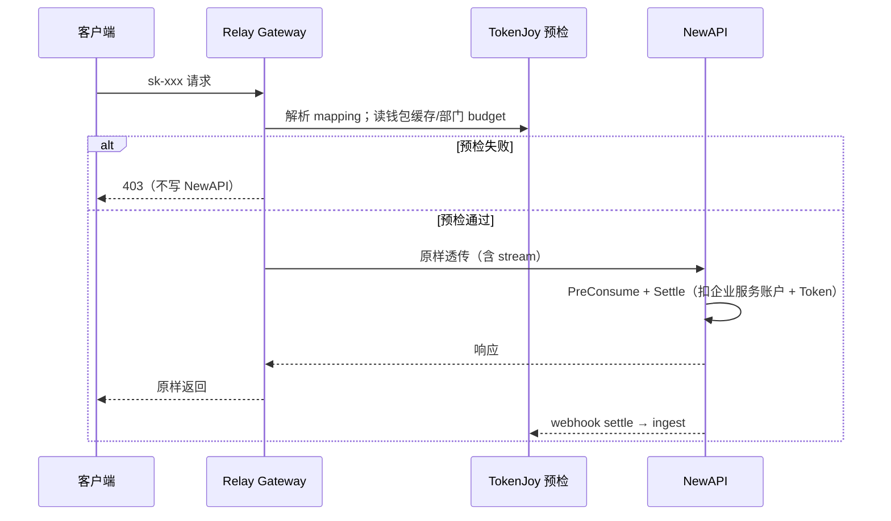

# Backend SaaS 多企业架构

> **定位**：`apps/backend/` 支持私有化单企业与 SaaS 多企业两种部署形态；私有化下 `company_id=1`，行为与性能与多企业模式下的单企业一致。  
> **关联文档**：[TokenJoy-PRD.md](./TokenJoy-PRD.md) · [NewAPI-SaaS多企业配置.md](./NewAPI-SaaS多企业配置.md) · [Backend-设计.md](./Backend-设计.md) · [Backend-存储架构.md](./Backend-存储架构.md)

### 术语对照

| 产品            | 技术（表/字段）                                             | 说明                         |
| --------------- | ----------------------------------------------------------- | ---------------------------- |
| 企业（Company） | `companies` / `company_id`                                  | 一家公司；表名 `companies`   |
| 成员（User）    | `members`                                                   | 企业内员工，登录控制台       |
| 公司钱包        | `companies.newapi_wallet_account_id` → NewAPI `users.quota` | 企业服务账户，**非**成员账号 |
| 平台运营        | `/api/platform/*`                                           | TokenJoy 官方运维            |

**已拍板 ADR**：

| 决策                 | 结论                                                                     |
| -------------------- | ------------------------------------------------------------------------ |
| NewAPI 企业隔离      | 单集群；**每企业一个企业服务账户**；Token 绑 `user_id`；扣费进该企业钱包 |
| 计费主账             | **公司钱包** `users.quota`；充值只进钱包                                 |
| Token `remain_quota` | **分配视图**；`rebalance` 保证 Σ ≤ 钱包                                  |
| Relay Gateway        | 预检后透传 NewAPI                                                        |
| 成员与钱包           | 成员**不**单独持有 NewAPI 账户；消费从 **公司钱包** 扣，按部门/Key 归因  |
| 钱包 vs 部门 budget  | **两条轴**：钱包=预付资金硬门禁；部门 budget=组织内花费配额（见 §4.1.1） |
| 充值与 budget        | 充值**只**涨钱包；部门 budget 由超管分配，**不**随充值自动变化           |

---

## 一、产品模型

### 1.1 真实需求摘要

- **平台**托管上游 Channel，服务多家企业。
- **企业**是付费与隔离边界：一个公司钱包、一套组织、多名成员。
- **成员**在企业内申请 Key、调 API；**资金**从公司钱包出；**花费配额**受部门 `budget` 约束（US-07 逐级分配）。
- **未充值**（钱包 `quota=0`）：全企业 API 停；控制台可登录，展示充值引导与账单空态。
- **已充值但未分配部门 budget**：钱包有钱，但子部门/Key 可分配额为 0 → API 仍不可用；控制台引导超管「分配组织预算」。

### 1.2 部署形态

| 形态       | 配置                 | 场景       | Channel                  | Token group           | NewAPI                   |
| ---------- | -------------------- | ---------- | ------------------------ | --------------------- | ------------------------ |
| **私有化** | `SUPPORT_SAAS=false` | 大企业自建 | 企业超管 `provider_keys` | `dept-{departmentId}` | 一企业服务账户           |
| **SaaS**   | `SUPPORT_SAAS=true`  | 平台多客户 | 仅平台运营               | `platform_shared`     | **每企业**一企业服务账户 |

### 1.3 企业状态与控制台行为

| `companies.status` | Relay API            | 控制台                              |
| ------------------ | -------------------- | ----------------------------------- |
| `active`           | 按 §4.4 预检放行     | 正常                                |
| `suspended`        | 一律 403（平台停用） | 可登录；只读账单/工单；展示停用说明 |

### 1.4 架构约束

1. 私有化低开销：`company_id=1`，不加载 SaaS 策略。
2. Relay 热路径不增业务 hop：Gateway 预检后原样转发。
3. **公司余额唯一来源**：NewAPI `users.quota`；TokenJoy 不双写余额。
4. **策略 + DI** 切换模式，业务层不散落 `if cfg.SupportSaas`。

---

## 二、总体架构

```mermaid
flowchart TB
    subgraph clients [客户端]
        C1[成员 / 公司超管]
        C2[平台运营]
        C3[sk-xxx 调用方]
    end

    subgraph gateway [TokenJoy apps/backend]
        MW[CompanyResolve]
        AUTH[Session member + company]
        API[/api 管理面]
        RELAY[/v1 Relay Gateway]
        STORE[(Postgres)]
    end

    subgraph newapi [NewAPI 单集群 按企业逻辑隔离]
        subgraph corpA [企业 A]
            WA[企业服务账户 A]
            TA[Tokens A]
            WA --> TA
        end
        subgraph corpB [企业 B]
            WB[企业服务账户 B]
            TB[Tokens B]
            WB --> TB
        end
        CH[platform_shared Channel 池]
        TA --> CH
        TB --> CH
    end

    C1 --> MW --> API
    C2 --> MW
    C3 --> RELAY
    API --> STORE
    RELAY --> STORE
    RELAY --> newapi
    API --> newapi
```

### 2.1 两个作用域

| 作用域     | 调用方         | 数据范围                          |
| ---------- | -------------- | --------------------------------- |
| **企业面** | 成员、公司超管 | 本企业 `company_id`               |
| **平台面** | 平台运营       | `companies`、全局 `provider_keys` |

### 2.2 分层职责

```
middleware     → CompanyResolve；PlatformAuth（平台面）
domain         → WalletService、ChannelPolicy、CompanyGate
store          → company-scoped 查询（ctx）
integration    → CreateUser、TopUp、GetUserQuota
app/wiring     → SUPPORT_SAAS 策略注册
```

---

## 三、企业（Company）与成员（User）

### 3.1 表 `companies`（企业）

| 字段                       | 说明                                                                  |
| -------------------------- | --------------------------------------------------------------------- |
| `id`                       | 企业 ID（`company_id`）                                               |
| `slug`                     | 子域名 / 登录标识；平台内唯一                                         |
| `name`                     | 公司名                                                                |
| `status`                   | `active` / `suspended`（见 §1.3）                                     |
| `root_dept_id`             | 根部门                                                                |
| `newapi_wallet_account_id` | NewAPI 企业服务账户 ID                                                |
| `package_id`               | 套餐 ID（可选）；MVP 仅展示与平台代充备注，**不**自动改配额或 Channel |

### 3.2 成员 `members`

- 增加 `company_id`；Session 同时含 `memberId` + `companyId`（API 字段 `companyId`）。
- MVP：**一个成员只属于一家企业**；邮箱在**平台内**唯一（离职后邮箱可释放给新邀请，需原账号 `disabled`）。
- 离职：`members` 停用 → 其 Platform Key 同步失效。

### 3.3 开户、邀请与补偿

```mermaid
sequenceDiagram
    participant PO as 平台运营
    participant TJ as TokenJoy
    participant PG as Postgres
    participant NA as NewAPI

    PO->>TJ: POST /api/platform/companies
    TJ->>PG: BEGIN; INSERT companies（status=active, quota 未就绪）
    TJ->>NA: CreateUser（quota=0）
    alt CreateUser 失败
        TJ->>PG: ROLLBACK companies
        TJ-->>PO: 4xx/5xx，可重试开户
    else 成功
        NA-->>TJ: newapi_wallet_account_id
        TJ->>PG: 根部门（budget=0）+ company_invites
        TJ->>PG: COMMIT
        TJ->>PO: 邀请链接（邮件/运维下发）
    end
    Note over TJ: 超管点链接激活 → 设密 → 登录
    Note over TJ: 首屏：充值引导；充值后 → 分配组织预算引导
```

**邀请 `company_invites`（企业域）**：

| 字段          | 说明                   |
| ------------- | ---------------------- |
| `company_id`  | 企业                   |
| `email`       | 受邀超管邮箱           |
| `role`        | MVP 固定 `super_admin` |
| `token`       | 一次性激活令牌         |
| `expires_at`  | 默认 7 天              |
| `accepted_at` | 激活时间               |

激活：`POST /api/auth/accept-invite` → 创建 `members`（`company_id` 绑定）→ 销毁 invite token。

### 3.4 充值流水 `company_recharge_orders`（企业域）

| 字段               | 说明                                |
| ------------------ | ----------------------------------- |
| `id`               | 订单 ID                             |
| `company_id`       | 企业                                |
| `amount`           | 金额（CNY）                         |
| `source`           | `self` / `platform` / 支付渠道标识  |
| `idempotency_key`  | 幂等键（自助充值必填）              |
| `newapi_topup_ref` | TopUp 回执                          |
| `status`           | 见下表                              |
| `created_by`       | 成员 ID 或 `platform:{operator_id}` |

**状态机**：

| 状态        | 含义                  | 下一步                                                  |
| ----------- | --------------------- | ------------------------------------------------------- |
| `pending`   | 已创建，待支付/待确认 | 支付成功 → `paid`；超时/取消 → `failed`                 |
| `paid`      | 已收款，待 TopUp      | TopUp 成功 → `topped_up`；失败 → `failed`（可人工重试） |
| `topped_up` | 钱包已入账            | 终态；触发企业 `rebalance`                              |
| `failed`    | 失败                  | 终态；可新建订单                                        |

平台代充（`POST /api/platform/companies/{id}/recharge`）跳过支付，直接 `paid` → TopUp。

---

## 四、计费：公司钱包为主，Token quota 为分配

### 4.1 职责

| 层级                 | 存储                               | 角色                                         |
| -------------------- | ---------------------------------- | -------------------------------------------- |
| **公司钱包（主账）** | NewAPI `users.quota`               | 充值；PreConsume/Settle **唯一扣费**         |
| **部门花费配额**     | `budget_nodes.budget` + `consumed` | 组织内「本月最多花多少」；Gateway 预检       |
| **Token 分配**       | `tokens.remain_quota`              | Key 可用上限；`TokenLifecycle` + `rebalance` |
| **部门已用（报表）** | `usage_buckets` / ingest           | 看板、预警                                   |



**规则**：

1. 充值 → `TopUp(companies.newapi_wallet_account_id)` only。
2. `remain_quota = min(ComputeRemainQuotaCNY(...), 钱包可分配额)`。
3. `Σ remain_quota ≤ users.quota`（企业级 rebalance 维护）。
4. 钱包 `quota=0`：Gateway 403；控制台可登录。

### 4.1.1 钱包与部门 budget（产品闭环）

两条独立轴线，解决「充值后谁能调 API」：

| 维度           | 公司钱包            | 部门 budget                                          |
| -------------- | ------------------- | ---------------------------------------------------- |
| 含义           | 预付资金余额        | 组织内花费配额（对齐 PRD US-07）                     |
| 来源           | 充值 / 平台代充     | 超管逐级分配                                         |
| 是否随充值变化 | **是**              | **否**                                               |
| 周期           | 累计，不按月清零    | `consumed` 自然月重置；`budget` 配置保留             |
| Gateway        | 硬门禁：余额 ≥ 预估 | 硬门禁：`consumed + estimate ≤ budget`（该部门链路） |
| UI 提示        | 账单页「公司余额」  | 预算页「可分配上限 ≤ min(父节点剩余, 钱包余额)」     |

**典型用户路径**：



| 场景                  | 钱包 | 部门 budget          | API                              |
| --------------------- | ---- | -------------------- | -------------------------------- |
| 未充值                | 0    | 任意                 | **403**（钱包拦）                |
| 已充值，未分配 budget | >0   | 根/子部门为 0        | **403**（budget/Token 分配为 0） |
| 已充值且已分配        | >0   | 链路部门有剩余       | 预检通过后可调                   |
| 钱包耗尽              | 0    | 可能仍有 budget 配置 | **403**（钱包拦）                |
| 部门配额用尽          | >0   | `consumed ≥ budget`  | **403**（budget 拦）             |

私有化（`SUPPORT_SAAS=false`）：行为不变；钱包与 budget 两条轴同样成立，仅无多企业隔离。

### 4.2 TokenLifecycle 要点

```go
walletRemain := walletService.AvailableQuota(ctx, company.NewAPIWalletAccountID)
allocated := relay.ComputeRemainQuotaCNY(...)
remainUnits := newapi.ToNewAPIUnits(min(allocated, walletRemain), models, effective)

req := newapi.CreateTokenRequest{
    UserID:      company.NewAPIWalletAccountID,
    RemainQuota: remainUnits,
    Group:       channelPolicy.ResolveRelayGroup(ctx, deptID),
}
```

充值成功（`topped_up`）→ 入队企业级 `rebalance`（`axis_kind=company`）。

### 4.3 Rebalance（企业级 + 双向）

预算收缩或 Key 停用时下调 `remain_quota`；充值成功或预算扩大时上调至 `min(分配额, 钱包可分配额)`；企业级 rebalance 遍历该企业所有 active `relay_mappings`，维护 `Σ ≤ 钱包`。

`钱包可分配额 = users.quota - Σ(其他 Token remain_quota 已占用)`（以 NewAPI 单位换算）。

### 4.4 NewAPI AdminClient

| 方法           | 用途                   |
| -------------- | ---------------------- |
| `CreateUser`   | 开户创建企业服务账户   |
| `TopUp`        | 公司充值               |
| `GetUserQuota` | 余额查询、Gateway 预检 |

配置详见 [NewAPI-SaaS多企业配置.md](./NewAPI-SaaS多企业配置.md)。

### 4.5 Gateway 放行条件与扣费时序

**放行条件**（全部满足）：

1. 企业 `status = active`
2. 公司钱包 ≥ 本次预估（见下「缓存策略」）
3. 调用链部门：`consumed + estimate ≤ budget`（`budget=0` 即不可用）
4. Token `remain_quota` 足够（NewAPI 侧硬扣）
5. 模型白名单、Key 状态通过

**扣费时序**（产品 + 技术约定）：



| 层级                     | 职责                                                                |
| ------------------------ | ------------------------------------------------------------------- |
| Gateway 预检             | **软门禁**：尽快拒绝明显超额；减少无效 NewAPI 流量                  |
| NewAPI PreConsume/Settle | **硬门禁**：真实扣费；以 `users.quota` 与 Token `remain_quota` 为准 |
| ingest                   | settle 后更新 `consumed`、Key `used`；驱动 rebalance                |

**`pending`（MVP）**：Gateway **不**维护全局 pending 账本；并发超额依赖 NewAPI 硬扣。缓存钱包仅用于预检，见 §九。

**流式**：Gateway 对 SSE/chunked **透明透传**，不缓冲完整 body。

### 4.6 余额与充值 API

| 方法 | 路径                                    | 说明                                                      |
| ---- | --------------------------------------- | --------------------------------------------------------- |
| GET  | `/api/billing/wallet`                   | 公司超管/财务；`GetUserQuota` + 展示「可分配上限」        |
| POST | `/api/billing/recharge`                 | 企业自助；创建 `pending` 订单 → 支付回调 → `paid` → TopUp |
| POST | `/api/platform/companies/{id}/recharge` | 平台代充；审计 `created_by=platform:*`                    |

支付渠道、回调 URL、签名验签由第三方支付对接；平台代充走 `POST /api/platform/companies/{id}/recharge`。

---

## 五、数据隔离（Postgres）

### 5.1 全局 vs 企业域

| 全局（无 `company_id`）         | 企业域（有 `company_id`）                    |
| ------------------------------- | -------------------------------------------- |
| `provider_keys`                 | 组织、预算、`platform_keys`                  |
| `companies`                     | `relay_mappings`、`usage_buckets`            |
| `permissions`（只读目录）       | `company_recharge_orders`、`company_invites` |
| `platform_operators`（见 §6.4） | 审计、通知、IM 凭证等                        |
|                                 | 单例配置改每企业一行                         |

**主键**：企业域表 `(company_id, id)` 或企业内 UUID，避免多企业 seed ID 冲突。

### 5.2 `relay_mappings` 扩展

| 字段              | 说明                                       |
| ----------------- | ------------------------------------------ |
| `company_id`      | 与 `platform_key` 同源                     |
| `platform_key_id` | 主键（或 `(company_id, platform_key_id)`） |
| `newapi_token_id` | NewAPI Token ID                            |
| 其余              | 保持现字段                                 |

**索引**：`(company_id, newapi_token_id)` UNIQUE；ingest / Gateway 按 `newapi_token_id` 反查时必须校验 `company_id` 一致。

### 5.3 CompanyContext

```go
type Context struct {
    CompanyID              int64
    Slug                  string
    NewAPIWalletAccountID int64
}
```

Store 按 company-scoped 读写；`relay_outbox` / `webhook_outbox` / `rebalance_queue` payload 带 `company_id`；Worker 按企业消费或 payload 内过滤。

---

## 六、请求链路与 Relay Gateway

### 6.1 管理面

`RequestID → Recover → CORS → CompanyResolve → Session → Authz → Handler`

**CompanyResolve 规则**（防跨企业越权）：

| 场景                        | 企业解析来源                                                               |
| --------------------------- | -------------------------------------------------------------------------- |
| 已登录成员（企业面）        | **仅** Session `companyId`；**忽略** `X-Company-Id` 等 Header              |
| 未登录（邀请激活等）        | 邀请 token 内嵌 `company_id`                                               |
| 平台面 `/api/platform/*`    | 不依赖 CompanyResolve；见 §6.4                                             |
| 私有化 `SUPPORT_SAAS=false` | 固定 `DEFAULT_COMPANY_ID`（默认 `1`）                                      |
| SaaS 子域名（可选）         | 未登录页：`{slug}.tokenjoy.com` → `company_id`；**不得**覆盖已登录 Session |

Store 层强制：`WHERE company_id = ctx.CompanyID`（平台面全局表除外）。

### 6.2 Relay Gateway

`internal/http/handler/relay/`：`sk-` → `relay_mappings`（含 `company_id`）→ §4.5 预检 → 透传 NewAPI。

- **不经** CompanyResolve / Session；企业由 mapping 决定。
- NewAPI 内网；公网仅 Gateway（`RELAY_GATEWAY_ENABLED=true`）。

### 6.3 平台面

`/api/platform/*`：仅 `SUPPORT_SAAS=true`；走 **PlatformAuth** middleware，与企业 Session 隔离。

### 6.4 平台运营鉴权

| 项        | 约定                                                                                           |
| --------- | ---------------------------------------------------------------------------------------------- |
| 身份存储  | 表 `platform_operators`（`id`, `email`, `password_hash`, `status`）                            |
| Bootstrap | 首次部署：环境变量 `PLATFORM_BOOTSTRAP_EMAIL` + `PLATFORM_BOOTSTRAP_PASSWORD` 创建首个运营账号 |
| Session   | Cookie `tokenjoy_platform_session`（与企业 `tokenjoy_session_member` **分离**）                |
| 登录      | `POST /api/platform/auth/login`                                                                |
| 权限      | MVP 单角色；所有 `/api/platform/*` 需平台 Session                                              |
| 审计      | 代充、开户、停用写入 `operation_logs`（`actor_type=platform`）                                 |

平台运营**不**绑定 `company_id`；调用企业域接口时路径显式带 `{id}`。

---

## 七、Channel 策略

| 实现                      | 条件   | `group`           | `provider_keys` |
| ------------------------- | ------ | ----------------- | --------------- |
| `LocalChannelPolicy`      | 私有化 | `dept-*`          | 企业超管        |
| `SaaSSharedChannelPolicy` | SaaS   | `platform_shared` | 仅平台          |

企业 Token 共用平台线路；**扣费仍进各自企业服务账户**。

**部署顺序**：平台须先配置 `platform_shared` Channel，再为企业创建 Token。

---

## 八、API 端点

前端契约（路径、类型、权限）：[Frontend-API契约.md](./Frontend-API契约.md) §10。

### 8.1 平台面

| 方法     | 路径                                    | 说明            |
| -------- | --------------------------------------- | --------------- |
| POST     | `/api/platform/auth/login`              | 平台运营登录    |
| GET/POST | `/api/platform/channels`                | 全局 Channel    |
| GET      | `/api/platform/companies`               | 企业列表        |
| POST     | `/api/platform/companies`               | 开户 + 邀请超管 |
| PATCH    | `/api/platform/companies/{id}`          | 状态、套餐      |
| POST     | `/api/platform/companies/{id}/recharge` | 代充            |

> 契约路径以 `companies` 为准。

### 8.2 企业面

| 端点                           | SaaS                   | 私有化        |
| ------------------------------ | ---------------------- | ------------- |
| `provider-keys` 写             | 403                    | 不变          |
| `/api/billing/*`               | 钱包、充值             | 可选          |
| `GET /api/session`             | `companyId` + `member` | `companyId=1` |
| `POST /api/auth/accept-invite` | 超管/成员邀请激活      | 可选          |
| 邀请成员                       | 新增                   | 可选          |

---

## 九、配置

| 变量                           | 默认              | 说明                                                      |
| ------------------------------ | ----------------- | --------------------------------------------------------- |
| `SUPPORT_SAAS`                 | `false`           | SaaS                                                      |
| `DEFAULT_COMPANY_ID`           | `1`               | 私有化企业 ID                                             |
| `PLATFORM_SHARED_RELAY_GROUP`  | `platform_shared` | SaaS Token 分组                                           |
| `RELAY_GATEWAY_ENABLED`        | `false`           | SaaS 建议 `true`                                          |
| `COMPANY_WALLET_CACHE_TTL_SEC` | `30`              | 钱包预检缓存；**仅优化读路径**，超额并发由 NewAPI 硬扣    |
| `PLATFORM_BOOTSTRAP_EMAIL`     | —                 | 首次创建平台运营（可选）                                  |
| `PLATFORM_BOOTSTRAP_PASSWORD`  | —                 | 与上配对                                                  |
| `NEW_API_*`                    | —                 | 见 [NewAPI-SaaS多企业配置.md](./NewAPI-SaaS多企业配置.md) |

---

## 十、模块清单

| 模块                                  | 职责                                                     |
| ------------------------------------- | -------------------------------------------------------- |
| `internal/store/`                     | company-scoped 持久化；`relay_mappings.company_id`       |
| `internal/domain/company/`            | Context、WalletService、开户与邀请                       |
| `internal/integration/newapi/`        | CreateUser、TopUp、GetUserQuota                          |
| `internal/domain/relay/`              | 钱包约束 quota；`user_id`；mapping `company_id`；Gateway |
| `internal/domain/budget/rebalance.go` | 企业级轴；双向调整；Σ ≤ 钱包                             |
| `internal/domain/budget/ingest.go`    | mapping `company_id`；按企业读写                         |
| `internal/infra/worker/runner.go`     | outbox/rebalance payload `company_id`；org sync 按企业   |
| `internal/http/handler/platform/`     | PlatformAuth、企业 CRUD、代充                            |
| `internal/domain/billing/`            | 充值订单状态机                                           |
| `internal/domain/org/`                | 成员与 `members.company_id`                              |
| `tests/`                              | 钱包、budget 双轴、隔离、Gateway、平台鉴权               |

---

## 十一、测试要点

| 类型     | 用例                                                       |
| -------- | ---------------------------------------------------------- |
| 双轴计费 | 有钱无 budget → 403；有 budget 无钱 → 403；两者皆有 → 200  |
| 公司钱包 | 充值进 `users.quota`；调用扣钱包                           |
| 分配约束 | Σ Token ≤ 钱包；充值后 rebalance 上调                      |
| 未充值   | API 403；控制台可登录                                      |
| 企业隔离 | A 成员 Session 不能读 B 数据；Header 不能换企业            |
| NewAPI   | A 的 Token `user_id` = A 企业服务账户                      |
| Channel  | SaaS：`platform_shared`；企业无 `provider-keys` 写         |
| Gateway  | 预检失败不写 NewAPI；stream 透传；缓存钱包下 NewAPI 仍硬扣 |
| 平台面   | 无平台 Session 调 `/api/platform/*` → 401；代充写审计      |
| 开户补偿 | CreateUser 失败不落库 companies                            |

### 11.1 测试分层原则

| 层级                           | 适用                                                                | 原则                                                                               |
| ------------------------------ | ------------------------------------------------------------------- | ---------------------------------------------------------------------------------- |
| **HTTP 集成**（首选）          | Onboarding、隔离、billing、platform、suspend                        | 经 `app.Router` + cookie；数据由前序 API 产生                                      |
| **Domain 单元**                | 纯状态机/事务（CreateCompany 回滚、invite 校验、recharge 状态迁移） | 可用 `mock.StubAdminClient`；不绕过 domain service                                 |
| **Gateway 单测**               | 预检链各分支（钱包/budget/quota/suspended）                         | 允许直连 `Gateway`；fixture 由 `testutil` 场景构建器生成，禁止测试内散落 `SetTree` |
| **Store roundtrip**（Phase 2） | `companies` / `company_invites` / `company_recharge_orders`         | 沿用 `tests/store/postgres/roundtrip_test.go` 模式                                 |

### 11.2 反模式（明确禁止）

- 测试中依赖 `X-Company-Id` 切换租户（未实现；隔离只靠 session member → company）
- 为造第二租户直接 `store.Company().Create` + `SetMembers`（应走 platform create + accept-invite）
- 断言 memory-only API（如 `MemberPasswordHash`）
- 硬编码 `company_id=2`；应使用 create 响应里的 `company.id`
- 单租户默认 `testutil.Ctx()` 测 SaaS 行为却不设 `SupportSaas=true`

### 11.3 业务场景覆盖矩阵

| 场景                                     | 推荐测试文件                                              | 优先级 |
| ---------------------------------------- | --------------------------------------------------------- | ------ |
| Onboarding E2E（开户→邀请→激活→session） | `tests/handler/onboarding_test.go`                        | P0     |
| 双轴 403/200（§4.1.1）                   | `tests/handler/gateway_test.go`                           | P0     |
| 租户隔离（org/budget/keys）              | `tests/handler/tenant_isolation_test.go`                  | P0     |
| CreateCompany 回滚 / invite 边界         | `tests/domain/company/*_test.go`                          | P0     |
| Billing 钱包 / 代充 / 自助充值 / 幂等    | `tests/domain/billing/` + `tests/handler/billing_test.go` | P1     |
| Platform suspend / 列表 / 登录失败       | `tests/handler/platform_test.go`                          | P1     |
| SupportSaas 路由契约                     | `tests/handler/contract_test.go`                          | P2     |
| Postgres SaaS 表 roundtrip               | `tests/store/postgres/company_roundtrip_test.go`          | P2     |

### 11.4 testutil 约定

SaaS 相关测试统一使用 `tests/testutil/saas.go`：

| Helper                      | 用途                                                   |
| --------------------------- | ------------------------------------------------------ |
| `ApplySaaSConfig(cfg)`      | 开启 `SupportSaas` + platform bootstrap                |
| `StartNewAPIMock(t)`        | 有状态 mock：`CreateUser` / `TopUp` / `GetUserQuota`   |
| `LoginPlatform(t, router)`  | 返回 `tokenjoy_platform_session` cookie                |
| `CreateCompanyHTTP(...)`    | 平台开户，返回 company + inviteToken                   |
| `AcceptInviteHTTP(...)`     | 激活邀请，返回 member session cookie                   |
| `ProvisionCompanyHTTP(...)` | 开户 + 激活一条龙                                      |
| `CtxForCompany(companyID)`  | 租户 store 操作上下文                                  |
| `BuildGatewayScenario(...)` | Gateway 预检 fixture（集中封装 mapping/wallet/budget） |

Handler 测试套件入口：`newTestApp(t, ApplySaaSConfig)` + `StartNewAPIMock` 注入 `NewAPIBaseURL`。

---

## 十二、风险与缓解

| 风险                     | 缓解                                               |
| ------------------------ | -------------------------------------------------- |
| 企业数据互串             | ctx 强制过滤 + Session 不可 Header 覆盖 + 集成测试 |
| 钱包与 Token 不一致      | 企业级 rebalance；Σ ≤ 钱包                         |
| Gateway 缓存导致预检偏松 | 硬扣在 NewAPI；缩短 TTL；对账                      |
| 绕过 Gateway             | NewAPI 内网                                        |
| 成员误登无企业           | 邀请激活；邮箱平台唯一                             |
| NewAPI 单点故障          | 运维多副本/健康检查；文档化全平台 Relay 不可用     |
| 平台 Channel 故障        | 影响所有企业；平台监控 + 快速切换 Channel          |
| 开户半失败               | 事务 + CreateUser 失败回滚 companies               |

---

## 十三、明确不做

- 企业自定义 Channel
- 成员个人充值到平台
- 一人多企业（MVP）
- TokenJoy 余额双写
- NewAPI 核心 Fork
- 充值自动涨部门 budget（子部门）

---

## 十四、FAQ

| 问题                      | 答案                                                   |
| ------------------------- | ------------------------------------------------------ |
| 余额在哪？                | 公司钱包：NewAPI 企业服务账户 `users.quota`            |
| 成员和 NewAPI user 区别？ | 成员登录 TokenJoy；企业服务账户仅扣费，不可登录        |
| 充值后会自动能调 API 吗？ | **不会**。须超管分配部门 budget 后，Key 才有可分配额度 |
| 充值会涨部门 budget 吗？  | **不会**；budget 仅超管在预算页分配                    |
| 钱包和部门 budget 区别？  | 钱包=有没有钱；budget=组织内允许花多少（见 §4.1.1）    |
| 月初 budget 重置吗？      | `consumed` 清零；`budget` 配置不变；钱包不重置         |
| NewAPI 怎么配？           | [NewAPI-SaaS多企业配置.md](./NewAPI-SaaS多企业配置.md) |
| `package_id` 干什么？     | MVP 仅展示/备注，不改配额                              |
