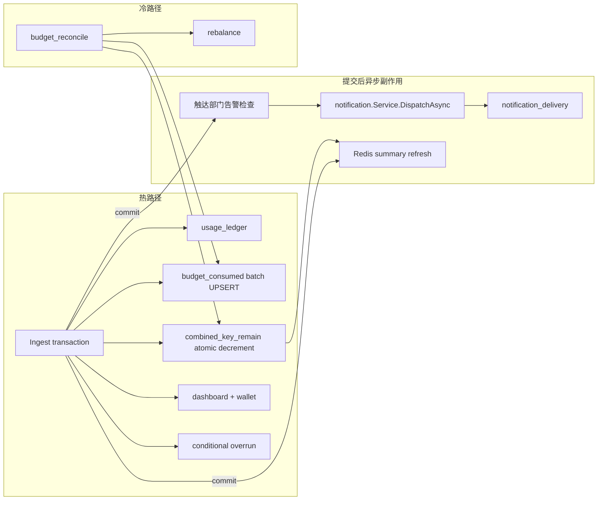

# Backend · `budget_consumed` / `combined_key_remain` 最终架构

> **定位**：项目未上线、无历史数据时直接采用的最终实现说明。本文不设计迁移、兼容层或旧框架共存方案。
>
> **核心原则**：预算累计属于入账事实的一部分，跟随 Ingest 同事务完成；通知和 NewAPI 控制属于异步副作用；reconcile 只负责冷路径纠偏。
>
> 相关文档：[Backend-预算.md](./Backend-预算.md) · [Backend-Projector.md](./Backend-Projector.md) · [Backend-离线任务.md](./Backend-离线任务.md)

---

## 0. 最终结论

### 0.1 最终形态

1. Ingest 同事务写入：
   - `usage_ledger`
   - `budget_consumed`：开账月的 `platform_key` / `member` / `project` 三轴
   - `platform_keys.combined_key_remain`
   - `dashboard_project`、`wallet_sync` job
   - 只有需要时才写 `overrun` job
2. 同公司并发一致性复用现有 `companies FOR UPDATE`：钱包扣减已经使用该锁，预算写入不再新增 advisory lock。
3. `budget_consumed` 使用一次批量 UPSERT，不逐轴发送多次 SQL。
4. `combined_key_remain` 正常路径只执行一次原子 `DecrementBatch`；`NULL`/缺行的绝对重算是初始化或异常分支，不属于正常热路径。
5. 百分比告警在事务提交后，通过现有 notification server 的 `DispatchAsync` 异步投递。
6. `overrun` 只在 remain 已知且 `<= 0`，或预算状态无法判定时入队；普通有余额入账不产生 budget job。
7. `rebalance` 不跟随每笔 Ingest，只由充值、月切、reconcile 修复和既有预算变更触发。
8. 只保留 `budget_reconcile` 冷任务，约 24 小时一次、检查约 2 个月窗口。
9. `budget_projector`、`budget_projection_progress`、预算 projection scheduler 和相关端口全部删除，不保留兼容实现。

### 0.2 一句话验收

有流量时没有 `budget_projection`；普通 `remain > 0` 的 Ingest 没有 budget job；预算告警通过 notification server 异步发送；`overrun` 和 `rebalance` 只在边界或低频事件出现。

### 0.3 性能原则

| 原则 | 做法 |
| --- | --- |
| 少一次网络往返 | consumed 三轴合并为一次批量 UPSERT |
| 少一种锁 | Ingest 复用已有公司行锁，不拿 budget advisory lock |
| 少一次热路径计算 | combined 正常只做 SQL 原子扣减 |
| 不阻塞入账 | 告警使用 `DispatchAsync`，不在事务内发送通知 |
| 不把副作用绑到账 | Ingest 不 Disable key、不调 NewAPI、不逐笔 rebalance |
| 冷任务可接受慢 | reconcile 允许短暂占用公司行锁，但必须窗口有界、可观测 |

---

## 1. 最终数据流



### 1.1 数据职责

| 数据 | 语义 | 写入者 |
| --- | --- | --- |
| `usage_ledger` | 发生事实，`period_key` 来自 `OccurredAt` | Ingest |
| `budget_consumed` | 开账月累计，period 来自业务 `Clock` | Ingest；reconcile 修复 |
| `combined_key_remain` | Gateway 预检使用的当前组合余额 | Ingest；reconcile；低频绝对刷新 |
| `usage_buckets` | 小时/天看板投影 | dashboard projector |
| `notification_log` | 通知 server 的投递记录 | notification server |

`ledger` 的发生月和 `budget_consumed` 的开账月必须保持双轨，不得用 `OccurredAt` 代替开账月。

---

## 2. Ingest 热路径

### 2.1 事务顺序

```text
构建 entry（事务外，沿用现有 snapshot 机制）

WithTx:
  LockCompanyForUpdate(companyID)       // 与 ConsumeLots 共用同一把公司行锁
  if ExistsIdempotency(key):
      return nil                         // 零钱包/ledger/预算副作用

  ConsumeLotsLocked                      // FIFO lot + wallet_remain
  InsertSegments(ledger)                 // period_key = OccurredAt 发生月
  if inserted == 0:
      return duplicate / error           // 不得继续写预算

  open = OpenDepartmentPeriod(..., Clock) // 开账月
  deltas = ConsumptionDeltas(entry, open)
  IncrementConsumedBatch(deltas)          // 一次 SQL，最多 3 个轴

  summaries = DecrementBatch({key: amount})
  if key 未被 DecrementBatch 更新:
      进入 §2.3 的绝对重算分支

  EnqueueAfterIngest:
      dashboard_project
      wallet_sync
      条件 overrun

commit

AfterCommit（失败只记录日志）：
  RefreshCombinedKeySummaries（可选 Redis）
  CheckBudgetAlerts(touchedDepartments)
```

### 2.2 幂等与锁

当前钱包扣减已经通过 `companies FOR UPDATE` 串行化同公司的 Ingest。最终实现将这把锁前移为 Ingest 事务的第一把业务锁：

1. 先锁公司行；
2. 再检查 `ExistsIdempotency`；
3. 已存在则立即成功返回；
4. 未存在才扣 lot、写 ledger 和预算。

`ConsumeLots` 应拆成“取得公司锁”和“锁已取得后的扣减”两个内部步骤，避免同一事务重复执行无意义的锁查询。

这样可以同时保证：

- 相同 idempotency 并发时只有一个事务产生副作用；
- reconcile 不能在 Ingest 中间用绝对值覆盖增量；
- 不需要 Ingest 获取 budget advisory lock；
- 不增加新的分布式锁或中间件。

### 2.3 `budget_consumed` 批量增量

保留 `ConsumptionDeltas` 纯函数，但新增批量 repository 操作，例如：

```go
type ConsumedDelta struct {
    AxisKind  string
    AxisID    string
    PeriodKey string
    Amount    float64
}

IncrementConsumedBatch(ctx context.Context, deltas []ConsumedDelta) error
```

SQL 语义：

```sql
INSERT INTO budget_consumed (
    company_id, axis_kind, axis_id, period_key, consumed, updated_at
)
SELECT $1, axis_kind, axis_id, period_key, amount, NOW()
FROM UNNEST($2::text[], $3::text[], $4::text[], $5::numeric[])
    AS input(axis_kind, axis_id, period_key, amount)
ON CONFLICT (company_id, axis_kind, axis_id, period_key)
DO UPDATE SET
    consumed = budget_consumed.consumed + EXCLUDED.consumed,
    updated_at = NOW();
```

要求：

- 一个 Ingest 最多一次 consumed batch 写入；
- 三轴增量必须来自同一个 `entry`；
- 所有数值使用数据库原子加法；
- 任一步失败，随整个 Ingest 事务回滚。

### 2.4 `combined_key_remain` 正常路径

`DecrementBatch` 保持单条批量 SQL：

```sql
SET combined_key_remain = GREATEST(
    platform_keys.combined_key_remain - input.delta,
    0
)
```

数据库更新返回实际更新的 key，用于：

- 提交后刷新 Redis summary；
- 判断 overrun gate；
- 避免再次查询 remain。

正常路径不重新加载完整预算上下文，不查询组织树，不计算项目/成员预算。

### 2.5 NULL / 缺行绝对重算

`DecrementBatch` 没有返回 key 时，不能简单等同于错误。必须区分：

| 状态 | 含义 | 行为 |
| --- | --- | --- |
| `Known(remain)` | 有约束且成功计算 | 写入 remain，按 remain 判断 overrun |
| `Unconstrained` | 没有任何预算约束，正常保持 NULL | 不写 remain，不发 overrun |
| `Unknown(error)` | 映射缺失、预算上下文读取失败等 | 不阻塞账务；安全地发一次 overrun job |

只有 `Known` 且 key 尚未初始化，才走绝对重算：

```text
Lock platform_keys row FOR UPDATE
重新读取预算上下文
重新计算该 key 的 combined remain
UpdateBatch
```

绝对重算前必须锁目标 `platform_keys` 行，且 key ID 按稳定顺序加锁。所有其它绝对刷新路径（reconcile、rebalance 后刷新、预算管理刷新）使用相同规则，避免绝对值覆盖刚刚发生的扣减。

该分支是初始化/异常分支，不得成为每笔 Ingest 的固定查询路径。

### 2.6 Ingest 入队

同一事务内只允许：

```text
dashboard_project
wallet_sync
conditional overrun
```

禁止：

```text
budget_projection
rebalance
NewAPI Disable / UpdateToken
同步 notification.Send
```

River job 插入失败必须使整个账务事务回滚，不能出现“ledger 已提交但 dashboard/wallet job 丢失”的半成功状态。

---

## 3. 温路径：overrun、告警与 rebalance

### 3.1 overrun gate

```text
if result == Known && remain <= 0:
    InsertOverrun(payload)
else if result == Unknown:
    InsertOverrun(payload)
else if department-only edge:
    按部门规则决定是否 InsertOverrun
else:
    skip
```

`Unconstrained` 不得进入 overrun，否则无预算限制的 key 会产生无意义 job。

`overrun` job 仍由现有 `OverrunService` 做完整多轴裁决：

- platform key；
- member；
- project/member；
- project；
- department ledger。

Ingest 只做便宜的 gate，不在事务内执行 Disable、通知或 NewAPI 调用。

建议 overrun job payload 显式包含 `periodKey`，避免 worker 运行时跨月后使用了错误账期。

### 3.2 百分比告警：复用 notification server

告警不得调用现有 `types.Notifier.Send` 的同步路径，因为它会在提交后仍执行通知分发、偏好读取和 channel 处理。最终使用：

```text
Ingest commit
  → CheckBudgetAlerts(touchedDepartments)
  → BudgetAlertPublisher
  → notification.Service.DispatchAsync
  → River notification_delivery
```

告警检查要求：

- 只检查本次触达的 department；
- 只加载该 department 对应的 enabled alert rules；
- 只在本次跨过阈值时发布；
- 不绑定 remain≤0，不复用 overrun gate；
- 不在 Ingest 事务内发送通知；
- 失败只记录日志，不回滚已经提交的账务。

### 3.3 notification server 最小补充

现有 notification server 已提供：

- `notification.Service.DispatchAsync`；
- River `notification_delivery`；
- in-app、email、SMS、webhook channel；
- 用户偏好、quiet hours、rate limit；
- `alert_rules.NotifyRoleIDs` 配置。

最终实现只补三点，不新增通知中间件：

1. **真实收件人**：不能使用 `department:<departmentID>` 作为用户收件人。根据 `NotifyRoleIDs` 解析出真实 member ID，再按 member ID 调用 `DispatchAsync`。
2. **去重键透传**：将 `EventMetadata.DeduplicationKey` 透传到 `NotificationDeliveryArgs`，并在 delivery job 上启用 River `Unique ByArgs`。
3. **告警 publisher port**：budget/usage domain 只依赖一个异步发布端口，由 app 层适配现有 `notification.Service`，不让 domain 依赖 infra notification 类型。

告警去重键格式：

```text
budget-alert:{companyID}:{ruleID}:{threshold}:{periodKey}:{memberID}
```

通知 payload 至少包含：

```json
{
  "departmentId": "...",
  "nodeName": "...",
  "ruleId": "...",
  "threshold": 90,
  "currentPct": 93,
  "consumed": 930,
  "budget": 1000,
  "periodKey": "..."
}
```

通知 server 继续负责偏好、quiet hours、channel 选择和最终投递；预算代码不自行读取 email/phone，也不自行写 `notification_log`。

### 3.4 rebalance

Ingest 不产生 rebalance job。

保留以下低频触发点：

- 充值完成后；
- 月切 scheduler；
- reconcile 实际修复 consumed/combined 后；
- 预算配置变更后；
- 既有轴级 worker。

reconcile 修复后的 rebalance 必须在修复事务提交后 enqueue，不能在修复前 enqueue。

---

## 4. 冷路径：`budget_reconcile`

### 4.1 目的

reconcile 不是预算主写路径，只用于：

- 修复代码异常或人工改库造成的 consumed 漂移；
- 修复 combined summary；
- 提供低频正确性兜底。

频率约 24 小时，窗口约 2 个月。项目未上线、无历史数据，不做窗口外 rebuild 设计。

### 4.2 锁和事务顺序

```text
WithTx:
  AcquireBudgetLock                  // 仅冷路径，协调预算管理写入
  LockCompanyForUpdate(companyID)    // 与 Ingest 共用同一把公司行锁

  在锁内重新读取窗口 ledger
  ExpectedConsumed = 按每条 entry 的 OccurredAt 归属开账月聚合
      （使用 OpenDepartmentPeriodAt(entry.OccurredAt)，而非统一用当前 Clock）

  读取窗口内 actual budget_consumed
  对 expected - actual 做完整 diff：
      缺行       → SetConsumed(expected)
      数值漂移   → SetConsumed(expected)
      多余行     → SetConsumed(0)

  对受影响 platform key 按稳定顺序锁 platform_keys 行
  锁内重新计算 combined summary
  UpdateBatch

commit

AfterCommit:
  刷新 Redis summary（失败只记录日志）
  如果发生修复，InsertRebalance(company)
```

公司行锁是解决“consumed 行不存在时无法锁住”的关键。因为 Ingest 也先拿同一把公司锁，所以：

- reconcile 不会覆盖一个正在提交的 Ingest 增量；
- Ingest 不会在 reconcile 的绝对 Set 中间插入；
- 不需要给每个可能不存在的 `budget_consumed` 行设计 sentinel；
- 不需要引入版本号 CAS 或新中间件。

`AcquireBudgetLock` 只属于冷路径和预算管理协调，不得加入 Ingest 热路径。

### 4.3 性能约束

- 窗口必须有界（~2 月）；
- 单公司 ledger 条数硬上限 50000 条，超过则 job 失败重试；
- ledger 读取按分页/分段实现，不能无界加载；
- 分页期间不能释放公司锁，否则会重新引入覆盖竞态；
- 记录 company lock wait、reconcile duration 和窗口 ledger count；
- 单公司 reconcile 超过配置上限时失败并重试，不阻塞整个 scheduler。

### 4.4 月切顺序

月切 scheduler 只负责判断 due 和 enqueue rebalance/reconcile，不在 reconcile 修复前调用 `EnsureMonthRebalance`。

如果 reconcile 实际修复了数据：

```text
先 commit consumed + combined 修复
再 enqueue company rebalance
```

没有修复时不额外 enqueue rebalance。

---

## 5. 删除项与代码锚点

项目未上线，直接删除旧框架，不保留兼容层。

### 5.1 删除

| 项 | 位置 |
| --- | --- |
| `KindBudgetProjection` / `BudgetProjectionArgs` | `internal/infra/jobs` |
| `InsertBudgetProjection` | `internal/infra/jobs`、`app/port_budget.go` |
| `BudgetProjectionWorker` | `internal/infra/river/workers` |
| `Projector` 的 ledger 主写逻辑 | `domain/budget/budget_projector.go` |
| `budget_projection_progress` repository/interface | `internal/store`、`internal/store/postgres` |
| `budget_projection_progress` table/index | `internal/store/postgres/schema.sql` |
| `NeedsBudgetProject` 与 projection lag | `internal/infra/scheduler` |
| `BudgetProjector` DI 和 River 注册 | `app/compose_worker.go`、`infra/river/client.go` |
| Projector 专属测试和 test fixture | `tests/domain/budget`、`tests/testutil` |

### 5.2 保留/重构

| 项 | 最终职责 |
| --- | --- |
| `consumed_attrib.go` | 保留纯函数 `ConsumptionDeltas`，增加批量写入配套 |
| `combined_key_summary.go` | 保留 remain 计算和绝对重算，补充锁约束 |
| `budget_reconcile.go` | 改为公司锁内重算，不再依赖 projection progress |
| `overrun.go` | 保留 worker 多轴裁决和 NewAPI 执行 |
| `rebalance.go` | 保留低频轴级 rebalance |
| `schedule/monthly.go` | 仅保留月切 due/rebalance 触发 |
| `app/port_usage.go` | dashboard/wallet/overrun enqueue，不再 projection |
| `infra/notification` | 复用 `DispatchAsync`，补 dedupe key 和角色收件人展开 |

### 5.3 关键接口调整

```text
BudgetConsumedRepository:
  IncrementConsumedBatch(...)
  SetConsumed(...)
  ListConsumedByPeriods(...)
  // reconcile 使用锁内 store 实现，不允许锁外计算后 Set

CombinedKeySummaryRepository:
  DecrementBatch(...)
  UpdateBatch(...)
  LockPlatformKeysForUpdate(...)

Usage/Budget alert port:
  PublishBudgetAlertAsync(...)
```

`usage` domain 依赖 domain port，不直接依赖 `infra/notification.Service`。

---

## 6. 测试与验收

### 6.1 Ingest 一致性

| 场景 | 期望 |
| --- | --- |
| 新账 Ingest | ledger + consumed 三轴 + combined 正确 |
| 相同 idempotency 并发 | 只扣一次钱包、只写一次 ledger、只增加一次 consumed |
| 开账月 ≠ 发生月 | ledger 使用 occurrence，consumed 使用 open period |
| 任意 budget SQL 失败 | ledger、wallet、consumed、combined、River job 全部回滚 |
| 多 lot ledger segment | consumed 按原始 entry 总额只增加一次 |
| 正常有 remain | 无 overrun、无 rebalance |
| remain = 0 | 产生一个 overrun job |
| 无预算约束 | combined 保持 NULL，不产生 overrun |
| 预算计算异常 | 账务提交不被通知/NewAPI 阻塞，安全产生 overrun |

### 6.2 并发一致性

| 场景 | 期望 |
| --- | --- |
| Ingest 与 reconcile 同公司并发 | 不丢增量、不被绝对 Set 覆盖 |
| consumed 行原本不存在 | reconcile 仍不能覆盖 Ingest |
| Ingest 与 combined 绝对重算并发 | platform key 行锁保证最终值正确 |
| 两个绝对重算并发 | 固定 key 顺序，无死锁/覆盖 |
| reconcile 多余 consumed 行 | 能清零 |

### 6.3 Notification server

| 场景 | 期望 |
| --- | --- |
| 阈值跨越 | 通过 `DispatchAsync` 入 `notification_delivery` |
| 阈值未跨越 | 不发通知 |
| NotifyRoleIDs | 展开真实 member ID，不使用 department pseudo recipient |
| 同一规则/阈值/账期重复 Ingest | 由 dedupe key 只投递一次 |
| 用户关闭 email/SMS | 由 notification server 偏好逻辑过滤 |
| 无外部 channel | in-app fallback 正常 |
| 通知队列失败 | 只记日志，不影响已提交账务 |

### 6.4 运行观察

- `river_job` 中不存在 `budget_projection`；
- 普通 Ingest 的 budget job 数量接近 0；
- `budget_ingest_write_ms` 不出现异常长尾；
- fallback absolute recompute 只在初始化/异常时出现；
- reconcile lock wait、duration、ledger count 可观测；
- 抽样企业：`budget_consumed` 与窗口 ledger 聚合一致；
- Gateway 预检直接读取正确的 `combined_key_remain`；
- notification delivery 只出现阈值跨越事件。

测试锚点：

```text
tests/domain/usage/ingest_*
tests/domain/budget/*
tests/domain/notification/*
tests/infra/notification/*
tests/store/postgres/combined_key_summary_test.go
Gateway precheck tests
make test-unit
```

---

## 7. 最终决议

| 议题 | 最终决议 |
| --- | --- |
| consumed 主写 | Ingest 同事务、一次批量 UPSERT |
| combined 主写 | Ingest 同事务、一次原子 DecrementBatch |
| 同公司并发 | 复用 `companies FOR UPDATE`，锁后做 idempotency |
| Ingest advisory lock | 不使用 |
| reconcile 锁 | advisory 管理锁 + company 行锁 + platform key 行锁 |
| 缺 consumed 行 | company 锁保证一致，不依赖不存在行的 FOR UPDATE |
| 缺/NULL combined | 区分 Known / Unconstrained / Unknown，只有必要时绝对重算 |
| budget projector | 直接删除 |
| projection progress | 直接删除 |
| overrun | remain 已知 `<= 0` 或 Unknown 才入队 |
| 告警 | commit 后经 notification server `DispatchAsync` |
| 告警收件人 | `NotifyRoleIDs` 展开真实 member ID |
| 告警去重 | dedupe key 透传到 notification delivery，River Unique ByArgs |
| rebalance | 不跟每笔 Ingest，低频触发 |
| 全历史 rebuild | 不需要，项目无历史数据 |
| 新中间件 | 不引入 |
| `budget_effects` | 不需要 |

代码锚点：

```text
domain/usage/ingest.go
domain/usage/ports.go
domain/budget/alert_publisher.go
domain/budget/consumed_attrib.go
domain/budget/combined_key_summary.go
domain/budget/budget_reconcile.go
domain/budget/overrun.go
domain/budget/rebalance.go
domain/billing/lot/consume.go
app/port_usage.go
app/port_budget.go
app/port_budget_alert.go
app/compose_worker.go
app/compose_domain_wire.go
infra/jobs/kinds_budget.go
infra/jobs/kinds_notification.go
infra/notification/dispatch.go
infra/notification/service.go
infra/river/client.go
infra/river/workers/budget_reconcile.go
infra/river/workers/notification_delivery.go
infra/scheduler/due.go
infra/scheduler/bulk_enqueue.go
pkg/budget/period.go
store/budget_consumed_repo.go
store/combined_key_summary.go
store/postgres/budget_consumed_repo.go
store/postgres/combined_key_summary_repo.go
store/store.go
```
