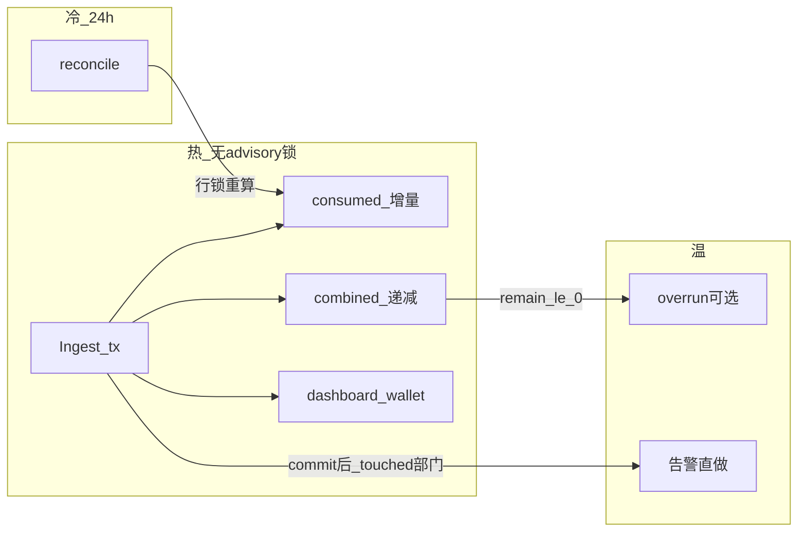

# Backend · `budget_consumed` 迁回 Ingest（实现说明）

> **定位**：最优终态的**实现文档**——性能优先、路径少、不引入新中间件。  
> **架构对齐**：[Backend-Projector.md](./Backend-Projector.md) · [Backend-预算.md](./Backend-预算.md) · [Backend-离线任务.md](./Backend-离线任务.md)。

---

## 0. 目标与非目标

### 目标

1. Ingest 同事务写 **`budget_consumed`**（开账月三轴）+ **`combined_key_remain`**。  
2. **退役** `budget_projection` / 游标 budget Projector / 投影看门狗 lag。  
3. 温路径：告警直做；overrun **先判再入队**；rebalance **不跟每笔**。  
4. 冷路径：仅 **`budget_reconcile`**（~2 月窗，~24h）矫正漂移。

### 非目标

- 不在 Ingest 同步执行 overrun / rebalance / NewAPI。  
- 不建 `budget_effects` 游标服务、不拆新 job 中间件。  
- 不做全历史 rebuild（窗口外靠运维）。  
- 无 DB migration；schema 跟 `schema.sql`，旧库孤儿表可忽略。

### 一句话验收

有流量时 **无高频 `budget_projection`**；普通花费且 remain>0 的 Ingest **无 budget job**；`overrun`/`rebalance` 为稀有长尾。

---

## 1. 现状 → 终态

| 项 | 现状 | 终态 |
| --- | --- | --- |
| `budget_consumed` | Projector `ApplyIncrement` | Ingest 同事务 `ApplyIncrement` |
| `combined_key_remain` | Projector `DecrementBatch` | Ingest 同事务 `DecrementBatch`（缺行→绝对重算） |
| Ingest 入队 | projection + dashboard + wallet | **仅** dashboard + wallet（+ 条件 overrun） |
| 百分比告警 | Projector 批末 | Ingest **提交后**对 touched 部门直做 |
| overrun / rebalance | 批末几乎总入队 | remain≤0 才 overrun；rebalance 低频触发源 |
| `EnsureMonthRebalance` | Projector 批首 | reconcile 批首 + scheduler month due |
| `budget_projection*` | kind + progress + worker + due | **全部删除** |
| `budget_reconcile` | 锁外算 expected（与无锁 Ingest 不兼容） | 冷路径内 **行锁 + 重算** 再 `SetConsumed` |



---

## 2. 热路径：Ingest 同事务

### 2.1 伪代码

```text
WithTx:
  if ExistsIdempotency(key) → return nil   // 零副作用
  ConsumeLots
  InsertSegments(ledger)                   // period_key = 发生月
  open = OpenDepartmentPeriodFromTree(...) // 开账月（Clock）
  ApplyIncrement(BudgetConsumed, entry, open)
  summaries = DecrementBatch({platformKeyId: amount})
  if platformKeyId != "" && key 未出现在 summaries:   // NULL/缺行
      UpdateBatch(ComputeGatewaySummaryUpdates(该 key))  // 与现 Projector 同语义
  EnqueueAfterIngest: dashboard + wallet   // 禁止 InsertBudgetProjection
  if remain_le_0 或 算不出 remain → InsertOverrun（§4.2）

AfterCommit（best-effort，失败只打日志）:
  checkAlertThresholds(touchedDept)        // §4.1；不进事务、不绑 overrun
```

### 2.2 约束（简单且快）

| 规则 | 说明 |
| --- | --- |
| 幂等 | 已有 idempotency → **零**副作用 |
| 双轨 | ledger=`OccurredAt`；consumed 开账月=`Clock` |
| **无 advisory 锁** | Ingest **不** `AcquireBudgetLock`（靠 SQL 原子加减；与 reconcile 的互斥见 §5） |
| 无 NewAPI | 不 Disable / 不 UpdateToken |
| 事务 | 任一步失败整段回滚（含同事务 `river_job`） |
| 缺行兜底 | **冻结**：绝对重算该 key（不跳过、不另发明路径） |

### 2.3 改动锚点

| 文件 | 动作 |
| --- | --- |
| `domain/usage/ingest.go` | 事务内 `ApplyIncrement` + `DecrementBatch` + 缺行兜底；条件 overrun |
| `domain/usage/ports.go` / `app/port_usage.go` | 去掉 projection；保留 dashboard + wallet；条件 overrun |
| `domain/budget/consumed_attrib.go` | 复用，勿复制 |
| `domain/budget/combined_key_summary.go` | 复用 Decrement / `ComputeGatewaySummaryUpdates` |
| 告警 | 从 Projector 挪出为可注入小函数/助手；Ingest 提交后调用 |

DI：usage 只依赖 budget **纯函数 / store / 告警助手**，不依赖 Projector 类型。

---

## 3. 退役清单

无兼容层，与 P0 同 PR 清干净：

| # | 项 | 位置（参考） |
| --- | --- | --- |
| 1 | `KindBudgetProjection` / Args / Insert | `infra/jobs/*` |
| 2 | `BudgetProjectionWorker` | `infra/river`、`workers/` |
| 3 | `Projector.RunBatch` 主写与批末入队 | `budget_projector.go`（纯函数可留别处） |
| 4 | `budget_projection_progress` | store + `schema.sql` |
| 5 | `NeedsBudgetProject` + projection lag | `infra/scheduler/*` |
| 6 | `InsertBudgetProjection` 端口 | `domain/budget/ports.go`、`app/port_budget.go` |
| 7 | compose / testhook / testutil 接线 | |
| 8 | 测例改为 ingest / reconcile 期望 | |

`EnsureMonthRebalance` → `ReconcileService.RunCompany` 批首；保留 `NeedsMonthRebalance`。

---

## 4. 温路径（少 job、少分支）

### 4.1 百分比告警 → 直做

- **触发**：Ingest **commit 成功后**，仅对本笔 `departmentId` 跑现有 `checkAlertThresholds` 逻辑（ledger `SumAmountByDepartment` + 该节点规则）。  
- **禁止**挂 `remain≤0` / overrun 路径（80%/90% 发生在触顶前）。  
- **不要**每笔扫全公司规则。  
- best-effort：失败只日志；去重可沿用进程内 map（重启可重报，不另建表）。

### 4.2 overrun → 先判再入队

```text
if platformKeyId != "" && ClampNonNegative(remain) == 0:
    InsertOverrun(payload)   // Unique ByArgs；Worker 内 evaluateOverrun
else if 无 Key 的部门-only 边缘:
    与现 overrun 部门分支对齐（可入队或仅 Worker 内 notify）
else if 无 summary / 算不出 remain:
    偏安全：入队一次
else:
    skip
```

- **禁止** Ingest 内 Disable / NewAPI。  
- 门闸只减无效 job，**不替代** Worker 多轴裁决。

### 4.3 rebalance → 不跟入账

保留：充值后、月切、reconcile 修复后、既有轴 Worker。  
入账默认**不** `InsertRebalance`（NewAPI lag 可接受）。

### 4.4 明确不做

- 不建公司级 `budget_effects` 游标批。  
- 不把 rebalance 绑回「每笔有 member/project 就入队」。

---

## 5. 冷路径：`budget_reconcile`（正确性底线）

热路径无 advisory 锁换吞吐；冷路径用**行锁串行**保证 `SetConsumed` 不打回 Ingest 增量——**不必**让 Ingest 拿预算锁。

### 5.1 正确写法（冻结）

```text
WithTx:
  AcquireBudgetLock                    // 与管理面预算写互斥（保持现状习惯）
  对窗口内将比对/写入的 consumed 行 SELECT FOR UPDATE
      （尚无行则稍后 Insert/Set 即可；有行必须先锁）
  锁内重拉窗口 ledger → ExpectedConsumed
  漂移则 SetConsumed
  受影响 key：ComputeGatewaySummaryUpdates → UpdateBatch
      （写 combined 前对对应 platform_keys 行 FOR UPDATE，避免与 DecrementBatch 交叉覆盖）
EnsureMonthRebalance（company 轴，批首或紧随修复后）
```

**为何够用**：Ingest 的 `IncrementConsumed` / `DecrementBatch` 会碰到同一行锁而等待；reconcile 提交后 Ingest 再叠加，不会被绝对 `Set` 回滚。  
**为何不复杂**：无版本号 CAS、无新中间件；只修现有 reconcile（现状是锁外算 expected，迁回后必须改）。

### 5.2 其它

| 项 | 要求 |
| --- | --- |
| Unique / due | ~24h |
| 窗口 | ~2 月（窗外不自动 rebuild） |
| 与投影 | 不依赖 progress；删 `NeedsBudgetProject` |

---

## 6. 实施切片

| 切片 | 内容 | 退出条件 |
| --- | --- | --- |
| **P0（同 PR）** | Ingest 写 consumed/combined + 缺行兜底；**删投影主路径**；reconcile 改为 §5 行锁重算；入队无 projection | ingest 后 consumed/remain 正确；幂等不双加；与并发 ingest 交错的 reconcile 不丢更新（测或注释级并发说明） |
| **P1** | overrun 条件入队；commit 后告警直做；入账去掉无脑 rebalance；月切挂 reconcile 批首 | 常态无 overrun/rebalance 刷屏；告警在 remain>0 仍可触发 |
| **P2** | 文档 as-built / 相关旧文过时句清理 | `make test-unit` 相关包绿 |

禁止「Ingest 已写 consumed、Projector 仍跑」的长期双写窗口。

---

## 7. 测试与验收

### 7.1 必测

| 场景 | 期望 |
| --- | --- |
| 新账 Ingest | ledger + 开账月三轴 += + combined 扣减 |
| 重复 idempotency | 不双加、不重复扣、不重复副作用 |
| 开账月 ≠ 发生月 | ledger period vs consumed open 分离正确 |
| 缺 combined / NULL remain | 同事务绝对重算后有 remain |
| 入队 | 有 dashboard/wallet；**无** `budget_projection` |
| remain>0 | 无 overrun；告警仍可按阈值触发 |
| remain≤0 | 有 overrun；Worker 仍按轴执法 |
| reconcile | 人为漂移拉回；与 Ingest 增量交错不丢更新 |

### 7.2 回归锚点

`tests/domain/usage/ingest_*` · `tests/domain/budget/*` · Gateway 预检可读 remain · `make test-unit`

### 7.3 运行观察

- `river_job` 无稳定高频 `budget_projection`  
- 抽样企业：consumed ≈ ledger 窗口聚合（或一轮 reconcile 后）

---

## 8. 风险与对策

| 风险 | 对策 |
| --- | --- |
| 双写 consumed | P0 同 PR 关投影 |
| Ingest 变重 | 仅 2～3 次 UPSERT + 一次 Decrement；禁止 advisory / NewAPI |
| reconcile 打回增量 | §5 行锁 + 锁内重拉（P0 必做） |
| NewAPI remain lag | 接受；充值/月切/reconcile 触发 rebalance |
| 告警挂 overrun | 禁止；commit 后直做 |
| 看门狗查已删 progress | P0 删 `NeedsBudgetProject` |
| Redis budgetcheck 陈旧 | PG 仍是预检主路径；可选 Ingest 后 `RefreshCombinedKeySummaries`（非必须） |

---

## 9. 决议冻结

| 议题 | 决议 |
| --- | --- |
| consumed / combined | Ingest 同事务原子加减 |
| Ingest 预算锁 | **不拿** advisory；性能优先 |
| 缺 combined 行 | **绝对重算**（与旧 Projector 一致） |
| budget Projector | 退役删除 |
| overrun | remain≤0 / 缺数才入队 |
| 告警 | commit 后 touched 部门直做；**不**绑 overrun |
| rebalance | 不跟每笔 Ingest |
| reconcile | 行锁 + 锁内重算；~24h |
| `budget_effects` | **不需要** |

代码锚点：`domain/usage/ingest.go` · `app/port_usage.go` · `consumed_attrib.go` · `combined_key_summary.go` · `overrun.go` · `rebalance.go` · `budget_reconcile.go` · `schedule/monthly.go` · `infra/jobs/kinds_budget.go` · `infra/scheduler/due.go`。
