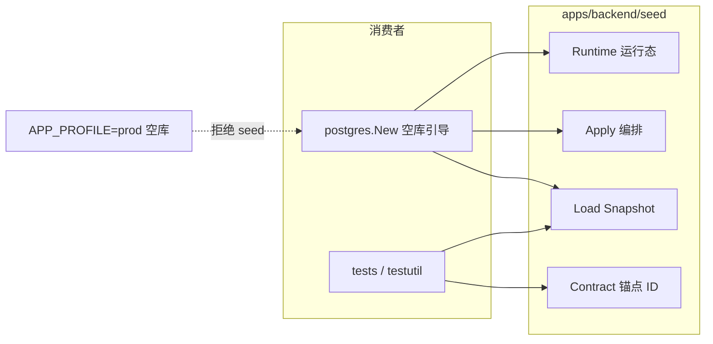

# Backend Seed 设计

Demo 引导数据与测试共享契约的模块化方案。路径：`apps/backend/seed/`。

**相关：** [Backend-存储.md](./Backend-存储.md) · [Backend-测试优化.md](./Backend-测试优化.md) · [Backend-架构.md](./Backend-架构.md) · [Backend.md](./Backend.md)

---

## 1. 定位

### 1.1 Seed 是什么

| 概念        | 定义                                                     | 本仓库                                     |
| ----------- | -------------------------------------------------------- | ------------------------------------------ |
| **Seed**    | 空库一次性引导的可重复数据集，供本地 demo / 集成测试基线 | `Load` + `Apply`                           |
| **Fixture** | 测试按需追加或覆盖的场景数据                             | `testutil/orgfix`、`relayfix`、`budgetfix` |
| **Schema**  | 表结构 DDL                                               | `postgres/schema.sql`                      |

Seed **不是** store 实现细节，也不是纯测试资产。它是 **dev/demo 与测试共享的开发用数据层**。

### 1.2 谁消费、谁不消费



| 环境                         | 行为                                                   |
| ---------------------------- | ------------------------------------------------------ |
| **Demo / 本地 `pnpm start`** | 空库 → 全量管理面 seed + demo 运行态（用量桶、充值单） |
| **测试 `NewTestStore`**      | 同上；测后 `TRUNCATE` 运行态表                         |
| **Prod**                     | 空库报错，**不执行 seed**                              |

依赖方向：

```
tests/*  ──┐
           ├──→  github.com/tokenjoy/backend/seed  ──→  internal/domain、internal/store、internal/config
postgres ──┘
```

**禁止：** `seed` import `tests/*`；**禁止：** `internal` import `tests/*` 取数据。

---

## 2. 目录结构

```
apps/backend/
├── seed/
│   ├── contract/          # 稳定契约：锚点 ID、展示名、demo 密码常量
│   ├── snapshot/          # 各域 Snapshot 片段构建（纯内存，无 SQL）
│   ├── data/              # 静态大块 JSON（go:embed）
│   ├── filler/            # 可删减的演示填充，不导出稳定 ID
│   ├── runtime/           # 管理面之后的运行态种子（用量桶、充值单）
│   └── loader.go          # Load(cfg) / LoadMinimal(cfg)
│
├── internal/store/postgres/
│   └── seed_apply.go      # ApplySeedTables：按依赖顺序 INSERT
│
└── tests/
    └── seed/              # loader / apply 一致性测试
```

### 2.1 子模块职责

| 模块                    | 职责                                                          | 依赖                                 |
| ----------------------- | ------------------------------------------------------------- | ------------------------------------ |
| **contract**            | 冻结 ID、名称、Demo 密码；测试 import 的**唯一**契约面        | 标准库或 `internal/infra/permission` |
| **snapshot**            | contract 锚点 + filler + JSON → `store.Snapshot`              | `contract`、`data`、domain types     |
| **filler**              | 批量生成成员等；规模可调，**不定义**新锚点 ID                 | `contract`                           |
| **data**                | embed JSON；审计日志、账本、平台密钥等                        | 无                                   |
| **runtime**             | `ApplyUsageBuckets`、`ApplyRechargeOrders`；依赖 `DEMO_TODAY` | `contract`、`store` 接口             |
| **loader**              | `Load` / `LoadMinimal` 入口                                   | `snapshot/*`                         |
| **postgres.seed_apply** | `ApplySeedTables(ctx, exec, snap)`                            | `store.Snapshot`                     |

### 2.2 公开 API

| 符号                                                | 包              | 用途                        |
| --------------------------------------------------- | --------------- | --------------------------- |
| `seed.Load(cfg)`                                    | `seed`          | 全量内存快照                |
| `seed.LoadMinimal(cfg)`                             | `seed`          | 最小锚点快照（测试 opt-in） |
| `postgres.ApplySeedTables(...)`                     | `postgres`      | 管理面落库                  |
| `runtime.ApplyUsageBuckets` / `ApplyRechargeOrders` | `seed/runtime`  | Demo 运行态                 |
| `contract.IDDept3` 等                               | `seed/contract` | 测试 / mock / filler 引用   |
| `contract.DemoPassword`                             | `seed/contract` | 登录测试                    |

测试 import 建议：

- 只需 ID → `seed/contract`
- 需内存快照 → `seed`（`Load`）
- 场景化造数 → `testutil/orgfix` 等，**不**膨胀 seed

---

## 3. 数据分层：Anchor / Filler / Static / Runtime

### 3.1 Anchor（契约，不可随意改）

`contract` 包导出的 ID 与关联展示名。改值 = 全库 grep + 测试 + Feishu mock + 文档同步。

| ID                                                        | 用途                                      |
| --------------------------------------------------------- | ----------------------------------------- |
| `DefaultCompanyID`                                        | 单租户 demo 企业                          |
| `IDMemberAdmin`                                           | 超管登录、`saas` session                  |
| `IDMember1`                                               | 主测试成员（张三 / zhangsan@example.com） |
| `IDMember3`                                               | pending 邀请场景                          |
| `IDMemberPure`                                            | 无平台密钥成员                            |
| `IDMemberAuditor`                                         | 审计角色                                  |
| `IDDept3`                                                 | 后端组；预算 / ingest / relay 默认部门    |
| `IDDept4`                                                 | 前端组                                    |
| `IDDept5`                                                 | 测试组                                    |
| `IDPlatformKey1`                                          | Gateway / worker / ingest 默认平台密钥    |
| `IDBudgetGroup1` / `IDBudgetGroup4`                       | 预算组 CRUD                               |
| `IDApproval1` / `IDApproval2`                             | 密钥审批流                                |
| `IDFeishuExtDept1` / `IDFeishuExtUser1` / `IDFeishuDept1` | Feishu mock 与 import 测试                |

非锚点但稳定的二级 ID（如 `m-2`、`dept-1`）在 snapshot 内文档化，**不**放入 `contract` 导出。

### 3.2 Filler（演示填充，可减量）

| 项                | 约定                                |
| ----------------- | ----------------------------------- |
| 叶子部门成员      | 每部门 5–8 人，合计 **~40**         |
| 预算组            | 保留与 `IDDept3`/`IDDept4` 相关的组 |
| 角色 member_count | 随 filler 重算                      |

规则：**filler 只引用 contract 锚点，不新增导出 ID。**

### 3.3 Static（JSON embed）

| 文件                  | 条数       |
| --------------------- | ---------- |
| `operation_logs.json` | 3–5 条     |
| `usage_ledger.json`   | 3–5 条     |
| `platform_keys.json`  | 与锚点一致 |

### 3.4 Runtime（运行态）

| 项                        | 说明                                               |
| ------------------------- | -------------------------------------------------- |
| `usage_buckets`           | 按 `DEMO_TODAY` 锚定；与预算树根 `Consumed` 同量级 |
| `company_recharge_orders` | 仅 demo profile；测试 `NewTestStore` 后 TRUNCATE   |

**不放**进 `Load` 的 `Snapshot`，由 `runtime` 在 `postgres.New` / `NewTestApp` 显式调用。

---

## 4. 与周边模块的边界

### 4.1 `internal/store/postgres`

- `loadOrSeedDomain` 空库检测、`IsProdProfile` 门禁
- `ApplySeedTables` 在 `seed_apply.go`
- `postgres.New` import `seed`；**不在 postgres 内定义 demo 行数据**

### 4.2 `tests/testutil`

| 组件                                | 与 seed 关系                                                         |
| ----------------------------------- | -------------------------------------------------------------------- |
| `NewTestStore`                      | 通过 `postgres.New` 全量管理面 seed；`clearDemoRuntimeSeed` 清运行态 |
| `WithMinimalSeed()`                 | opt-in 最小锚点闭包                                                  |
| `orgfix` / `relayfix` / `budgetfix` | 场景 fixture，**优先**于改 seed                                      |
| `feishu` mock                       | 对齐 `contract.IDFeishu*`                                            |

选用表见 [Backend-测试优化.md](./Backend-测试优化.md)。

### 4.3 前端

不读 seed 文件；依赖 API。demo 需保证组织树可展开、成员列表可分页、看板有数、审计列表非空。

---

## 5. 不做的事

| 项                              | 原因                                 |
| ------------------------------- | ------------------------------------ |
| 全部改为 JSON                   | 密码 hash、日期锚定、派生字段仍需 Go |
| 迁到 `tests/seed` 包定义数据    | demo 引导依赖 tests，反模式          |
| 锚点 ID 放 `testutil/fixture`   | demo 与测试分裂两套 ID               |
| 合并 `ApplySeedTables` 插入顺序 | FK 顺序是安全约束                    |
| Prod 自动 seed                  | 安全与行业惯例均不允许               |

---

## 6. 验收

```bash
pnpm start:postgres
cd apps/backend && make test-unit && make lint
pnpm start
```

- 空库 `pnpm start` 可登录种子账号，看板 / 组织 / 审计有数据
- `APP_PROFILE=prod` 空库启动失败
- `apps/backend/seed/` 为唯一数据定义来源；SQL 落库仅在 `postgres/seed_apply.go`
