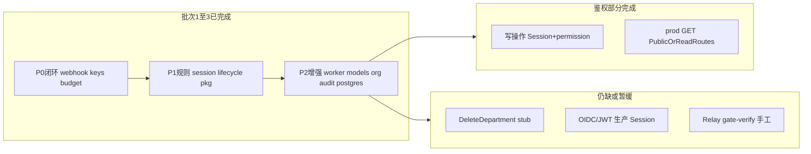

# TokenJoy Backend 测试指南

`apps/backend` 测试规范、覆盖现状与待补清单。与 [Backend-设计.md](./Backend-设计.md) §11、[tokenjoy-architecture.md](./tokenjoy-architecture.md) §5 预算闭环对齐。

---

## 0. 相关文档

| 文档     | 路径                                                      | 用途                                                    |
| -------- | --------------------------------------------------------- | ------------------------------------------------------- |
| 后端设计 | [Backend-设计.md](./Backend-设计.md)                      | 分层、Store、§11 策略                                   |
| API 契约 | [Frontend-API契约.md](./Frontend-API契约.md)              | 81 端点、状态码、JSON                                   |
| 系统架构 | [tokenjoy-architecture.md](./tokenjoy-architecture.md)    | 双平面、预算闭环、Relay                                 |
| CI       | [`.github/workflows/ci.yml`](../.github/workflows/ci.yml) | `verify`（含 backend 单测）+ `backend-integration` jobs |

---

## 1. 目录与分层

### 1.1 目录约定

**所有测试在 `apps/backend/tests/`，`internal/` 禁止 `*_test.go`。** 子路径镜像 `internal/`：

```
tests/
├── testutil/          # 共享 bootstrap、assert、mock
├── handler/           # HTTP 契约 + 行为
├── domain/{audit,budget,keys,models,org,session}/
├── pkg/{budgetutil,newapi,...}/
├── permission/
├── seed/
├── store/postgres/    # integration tag
└── worker/
```

| 规则    | 说明                                                                                                                                                                                                                                  |
| ------- | ------------------------------------------------------------------------------------------------------------------------------------------------------------------------------------------------------------------------------------- |
| 包名    | `package <name>_test`，黑盒 import `internal/...`                                                                                                                                                                                     |
| Fixture | `testutil.TestConfig()` + `testutil.NewMemoryStore(t, cfg)`；Handler 集成测试优先 `testutil.NewTestApp(t)`（内部 `app.New(..., app.WithoutWorker())`，避免 worker goroutine 干扰）；禁止裸 `config.Load()`（`seed/loader_test` 除外） |
| Seed ID | 使用 `internal/seed` 导出常量（如 `seed.IDDept3`）                                                                                                                                                                                    |
| Mock    | `testutil/mock.StubAdminClient` 实现 `newapi.AdminClient`                                                                                                                                                                             |
| 确定性  | `testutil.TestConfig()` 固定 `SimulateDelay=false`；unit 不设 `DATABASE_URL`                                                                                                                                                          |

### 1.2 分层

| 层         | 目录                                 | 测什么                      | CI                                                      |
| ---------- | ------------------------------------ | --------------------------- | ------------------------------------------------------- |
| L1 纯函数  | `tests/pkg/*`                        | 校验、过滤、换算            | `verify`（`pnpm test`）                                 |
| L2 Domain  | `tests/domain/*`                     | Service 规则 + Store 副作用 | `verify`（`pnpm test`）                                 |
| L3 Handler | `tests/handler/*`                    | 路由、状态码、JSON          | `verify`（`pnpm test`）                                 |
| L4 闭环    | `tests/domain/budget` 等             | 多 Service 协作             | `verify`（`pnpm test`）                                 |
| L5 外部    | `tests/store/postgres`               | DB 持久化                   | `backend-integration`（`-tags=integration` + Postgres） |
| L6 门禁    | `apps/newapi/scripts/gate-verify.sh` | 真实 Relay                  | 手工                                                    |



---

## 2. 运行

```bash
cd apps/backend
make test                          # 等同 make test-unit
make test-unit                     # go test ./tests/...
make test-integration              # -tags=integration ./tests/store/postgres/...（需 DATABASE_URL）
go test ./tests/domain/keys/... -v # 单包
go test ./tests/... -coverprofile=coverage.out && go tool cover -html=coverage.out
```

根目录 `pnpm test` 含 frontend（Vitest）与 backend 单测（`make test-unit`）。集成测另跑 `pnpm test:backend:integration` 或 CI `backend-integration` job。

---

## 3. 当前覆盖快照

### 3.1 已有（34 文件）

| 路径                                                                                                                     | 覆盖点                                                               |
| ------------------------------------------------------------------------------------------------------------------------ | -------------------------------------------------------------------- |
| `tests/handler/contract_test.go`                                                                                         | demo profile：GET 带 admin cookie → 200 + JSON                       |
| `tests/handler/contract_prod_test.go`                                                                                    | prod profile：无 cookie GET → 401；admin cookie → 200                |
| `tests/handler/authz_test.go`                                                                                            | 写操作 401/403/200；`TestProdGetReadForbiddenForMember` prod GET 403 |
| `tests/handler/handler_test.go`                                                                                          | Session 双轨、healthz、域 smoke、预算超卖 422                        |
| `tests/handler/webhook_test.go`                                                                                          | Webhook 401/400/200                                                  |
| `tests/handler/keys_test.go`                                                                                             | 审批 approve/reject HTTP                                             |
| `tests/handler/budget_test.go`                                                                                           | PUT 节点 200                                                         |
| `tests/handler/session_test.go`                                                                                          | cookie 只读、`?memberId=` 优先级                                     |
| `tests/handler/models_test.go`                                                                                           | PUT routing → 200                                                    |
| `tests/handler/org_test.go`                                                                                              | POST member、batch-import                                            |
| `tests/handler/audit_test.go`                                                                                            | PUT settings → 200                                                   |
| `tests/domain/budget/service_test.go`                                                                                    | 节点/成员额度、组 CRUD                                               |
| `tests/domain/budget/ingest_test.go`                                                                                     | 入账幂等、rollup、outbox、EnqueueFailed                              |
| `tests/domain/budget/ingest_overrun_test.go`                                                                             | 超支 disable                                                         |
| `tests/domain/budget/rebalance_test.go`                                                                                  | RemainQuota 仅下调                                                   |
| `tests/domain/keys/service_test.go`                                                                                      | 审批闭环、Platform/Group Key 校验                                    |
| `tests/domain/keys/token_lifecycle_test.go`                                                                              | outbox、CreateToken、rollback                                        |
| `tests/domain/session/service_test.go`                                                                                   | admin/404/只读                                                       |
| `tests/domain/models/service_test.go`                                                                                    | 路由继承/收缩、模型 CRUD                                             |
| `tests/domain/org/service_test.go`                                                                                       | 角色、分页、导入、Add/RemoveRoleMember                               |
| `tests/domain/audit/service_test.go`                                                                                     | 操作/通话日志过滤                                                    |
| `tests/domain/dashboard/service_test.go`                                                                                 | 周期成本汇总                                                         |
| `tests/worker/runner_test.go`                                                                                            | relay/webhook outbox、log 补偿                                       |
| `tests/store/postgres/persist_test.go`                                                                                   | domain seed、relay mapping（integration）                            |
| `tests/pkg/{budgetutil,budgetlookup,memberquota,budgetgroupquota,memberbudgetquota,routingutil,auditfilter,sessionutil}` | 纯函数                                                               |
| `tests/permission/resolve_test.go`                                                                                       | 角色权限、只读 Session                                               |
| `tests/seed/loader_test.go`                                                                                              | 种子数据完整性                                                       |
| `tests/pkg/newapi/quota_test.go`                                                                                         | 配额单位 / CNY 换算                                                  |

### 3.2 仍缺或暂缓

| 模块              | 用例                               | 状态    | 原因                                 |
| ----------------- | ---------------------------------- | ------- | ------------------------------------ |
| `handler/session` | `TestProtectedRouteWithoutCookie`  | 暂缓    | router 无全局鉴权中间件              |
| `domain/org`      | `TestDeleteDepartmentWithChildren` | 暂缓    | `DeleteDepartment` 为 stub           |
| `domain/org`      | `TestUpdateMemberRoles`            | 暂缓    | Service 未实现该 API                 |
| 外部              | Relay 全栈                         | P3 手工 | `apps/newapi/scripts/gate-verify.sh` |

---

## 4. 主路径与待补测试

以下按 **业务主路径** 排列。批次 1–3 已落地项标记 ✅；仍缺或暂缓标记 ⏸。

### 路径 A — Session 与鉴权

| 优先级 | 文件                                   | 用例                                               | 状态           |
| ------ | -------------------------------------- | -------------------------------------------------- | -------------- |
| P1     | `tests/domain/session/service_test.go` | `TestGetByMemberIDSuccess/NotFound/ReadOnlyMember` | ✅             |
| P1     | `tests/handler/session_test.go`        | `TestProtectedRouteWithoutCookie`                  | ⏸ 需鉴权中间件 |
| P2     | 同上                                   | `TestDemoMemberQueryParam`                         | ✅             |

---

### 路径 B — 预算树与成员额度

| 优先级 | 文件                                    | 用例                           | 状态 |
| ------ | --------------------------------------- | ------------------------------ | ---- |
| P0/P1  | `tests/domain/budget/service_test.go`   | 节点/成员额度、组 CRUD         | ✅   |
| P1     | `tests/pkg/budgetlookup/lookup_test.go` | `TestGetReservedPoolForMember` | ✅   |
| P1     | `tests/handler/budget_test.go`          | `TestUpdateNodeHTTPSuccess`    | ✅   |

---

### 路径 C — Key 审批闭环

| 优先级 | 文件                                | 用例                                | 状态 |
| ------ | ----------------------------------- | ----------------------------------- | ---- |
| P0     | `tests/domain/keys/service_test.go` | 审批 quota-check / approve / reject | ✅   |
| P1     | 同上                                | `TestCreateApprovalInvalidModels`   | ✅   |
| P1     | `tests/handler/keys_test.go`        | approve/reject HTTP                 | ✅   |

---

### 路径 D — Platform / Provider Key 签发

| 优先级 | 文件                                        | 用例                                                             | 状态 |
| ------ | ------------------------------------------- | ---------------------------------------------------------------- | ---- |
| P0     | `tests/domain/keys/service_test.go`         | CreatePlatformKey success/quota/whitelist                        | ✅   |
| P1     | 同上                                        | `TestCreateGroupKeyQuotaExceeded` / `TestUpdatePlatformKeyQuota` | ✅   |
| P1     | `tests/pkg/{budgetgroupquota,memberquota}`  | 组/成员额度边界                                                  | ✅   |
| P2     | `tests/domain/keys/token_lifecycle_test.go` | outbox / CreateToken / rollback                                  | ✅   |

---

### 路径 E — 预算消耗闭环（Relay 冷路径）

| 优先级 | 文件                                         | 用例                                         | 状态 |
| ------ | -------------------------------------------- | -------------------------------------------- | ---- |
| P0     | `tests/handler/webhook_test.go`              | 401/400/200                                  | ✅   |
| P0     | `tests/domain/budget/ingest_overrun_test.go` | 超支 disable                                 | ✅   |
| P1     | `tests/domain/budget/ingest_test.go`         | `TestIngestFromOutbox` / `TestEnqueueFailed` | ✅   |
| P1/P2  | `tests/worker/runner_test.go`                | relay/webhook outbox、log 补偿               | ✅   |

---

### 路径 F — 模型路由

| 优先级 | 文件                                  | 用例                                  | 状态 |
| ------ | ------------------------------------- | ------------------------------------- | ---- |
| P1     | `tests/domain/models/service_test.go` | 路由收缩、继承解析                    | ✅   |
| P1     | `tests/handler/models_test.go`        | `TestRoutingUpdateHTTP`               | ✅   |
| P2     | `tests/domain/models/service_test.go` | `TestCreateModel` / `TestToggleModel` | ✅   |

---

### 路径 G — 组织管理

| 优先级 | 文件                               | 用例                                                | 状态                    |
| ------ | ---------------------------------- | --------------------------------------------------- | ----------------------- |
| P1     | `tests/domain/org/service_test.go` | 预设角色、分页、建角色                              | ✅                      |
| P1     | 同上                               | `TestAddRoleMember` / `TestRemoveRoleMemberSuccess` | ✅                      |
| P1     | 同上                               | `TestDeleteDepartmentWithChildren`                  | ⏸ DeleteDepartment stub |
| P1     | 同上                               | `TestUpdateMemberRoles`                             | ⏸ API 未实现            |
| P2     | `tests/handler/org_test.go`        | POST member / batch-import                          | ✅                      |

---

### 路径 H — Dashboard / Audit（只读）

| 优先级 | 文件                                     | 用例                      | 状态 |
| ------ | ---------------------------------------- | ------------------------- | ---- |
| P2     | `tests/domain/dashboard/service_test.go` | `TestCostSummaryByPeriod` | ✅   |
| P2     | `tests/domain/audit/service_test.go`     | `TestListCallsDateFilter` | ✅   |
| P2     | `tests/handler/audit_test.go`            | `TestSettingsUpdateHTTP`  | ✅   |

---

### 路径 I — 外部集成（非默认 CI）

| 优先级 | 文件                                   | 用例                      | 状态                            |
| ------ | -------------------------------------- | ------------------------- | ------------------------------- |
| P2     | `tests/store/postgres/persist_test.go` | LoadOrSeed / RelayMapping | ✅（`backend-integration` job） |
| P3     | —                                      | Relay 全栈                | ⏸ `gate-verify.sh` 手工         |

---

## 5. 推荐实施顺序

批次 1–3 **已完成**。CI：`verify` job 含 `pnpm test`（frontend + backend 单测）与 `go build`；`backend-integration` job 跑 Postgres 集成测。

```
批次 1（P0 闭环）✅
  tests/handler/webhook_test.go
  tests/domain/keys/service_test.go
  tests/domain/budget/service_test.go

批次 2（P1 规则补全）✅
  tests/pkg/{budgetlookup,memberquota,budgetgroupquota}/
  tests/domain/keys/token_lifecycle_test.go
  tests/domain/session/service_test.go
  tests/handler/{keys,budget,session}_test.go

批次 3（P2 增强）✅
  tests/worker/runner_test.go
  tests/domain/models/service_test.go 扩展
  tests/handler/{org,audit,models}_test.go
  tests/store/postgres/（integration tag）

后续（按需）
  鉴权中间件 → TestProtectedRouteWithoutCookie
  DeleteDepartment 实现 → TestDeleteDepartmentWithChildren
  UpdateMemberRoles API → domain 用例
  gate-verify.sh 手工门禁
```

---

## 6. 编写模板

### 6.1 Domain Service helper

同包 `helpers_test.go` 封装 domain 专用 bootstrap；共享部分用 `tests/testutil`：

```go
func newKeysService(t *testing.T) (keys.Service, store.Store) {
    t.Helper()
    cfg, st := testutil.NewMemoryStoreFromConfig(t)
    lifecycle := relay.NewTokenLifecycle(cfg, st, nil)
    return keys.NewService(cfg, st, lifecycle), st
}
```

### 6.2 Handler

```go
router := testutil.NewTestRouter(t)

req := httptest.NewRequest(http.MethodPost, path, bytes.NewReader(body))
req.Header.Set("Content-Type", "application/json")
req.Header.Set("Cookie", testutil.SessionCookie(seed.IDMemberAdmin))
```

### 6.3 Mock AdminClient

使用 `testutil/mock.StubAdminClient`，按需配置 `Token`、`*Fn` 回调及 `CreateTokenCalls` 等计数器。

### 6.4 新 GET 端点

在 `tests/handler/contract_test.go` 的 `getContractCases()` 追加 `{name, path}`。prod profile 行为用 `testutil.WithProfile(config.ProfileProd)` 配置 `NewTestApp`（见 `contract_prod_test.go`）。

---

## 7. 与前端边界

|      | Backend                                            | Frontend     |
| ---- | -------------------------------------------------- | ------------ |
| 目录 | `tests/`                                           | `tests/`     |
| 工具 | Go testing                                         | Vitest + MSW |
| 契约 | 同源 [Frontend-API契约.md](./Frontend-API契约.md)  | 同源         |
| CI   | `verify`（含 backend 单测）+ `backend-integration` | `verify` job |

默认 CI **不**启动 backend 进程；E2E 若做则独立 job。

---

## 8. PR 自检

- [ ] 测试在 `tests/`，未在 `internal/` 新增 `*_test.go`
- [ ] `make test-unit` 通过
- [ ] 使用 `testutil.TestConfig()`，未裸调 `config.Load()`（`seed/loader_test` 除外）
- [ ] unit 未依赖 `DATABASE_URL` / Relay（integration 见 `make test-integration`）
- [ ] 新 GET → `contract_test.go`；新写操作 → handler 或 domain 用例
- [ ] 跨域逻辑（审批、入账）在 domain 层断言 Store 副作用
