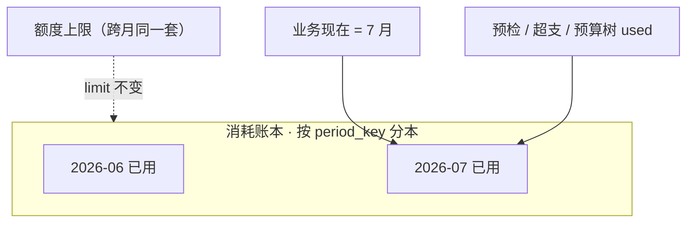
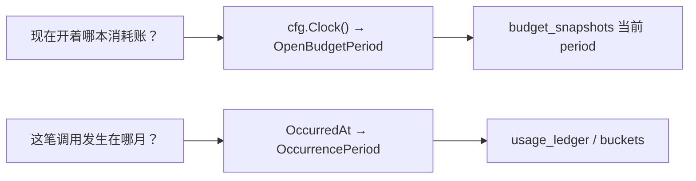
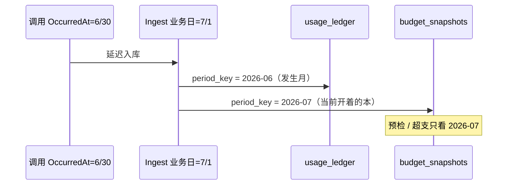
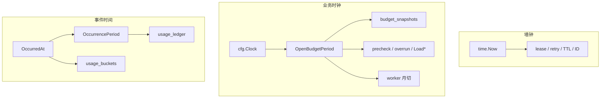
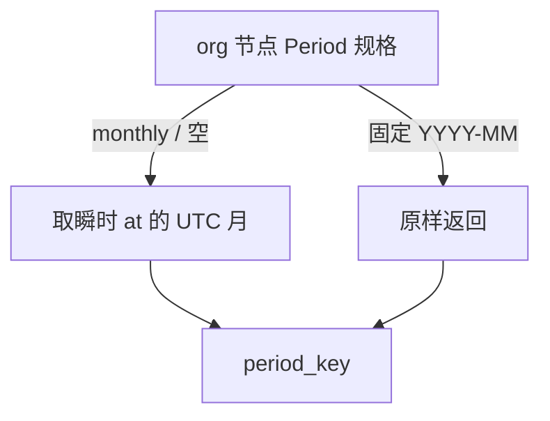
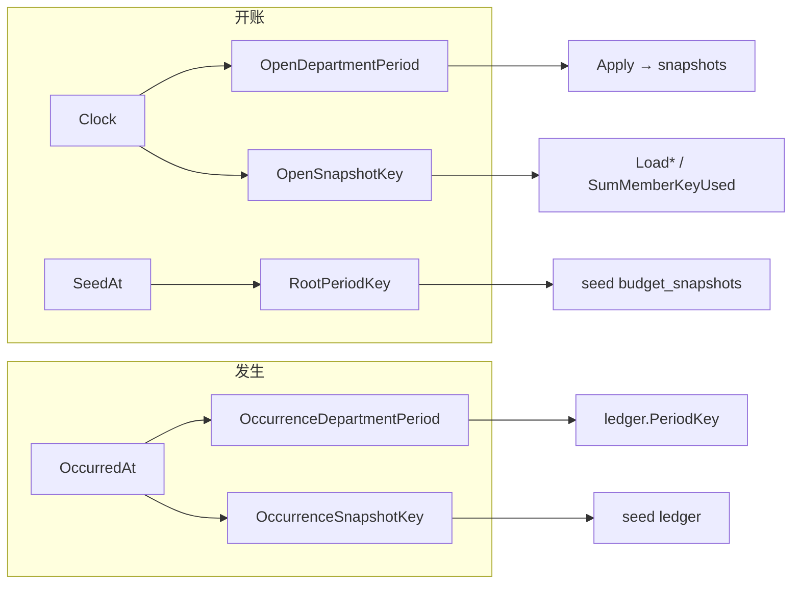
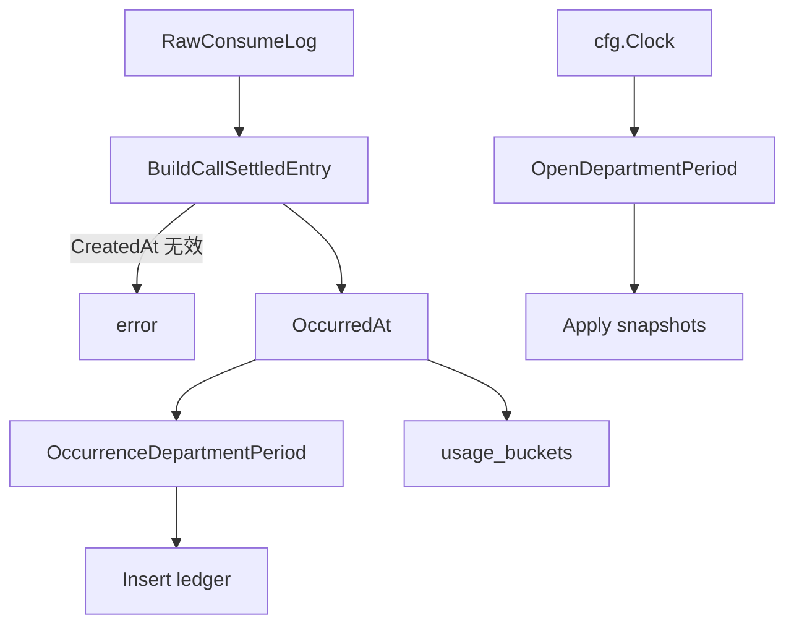
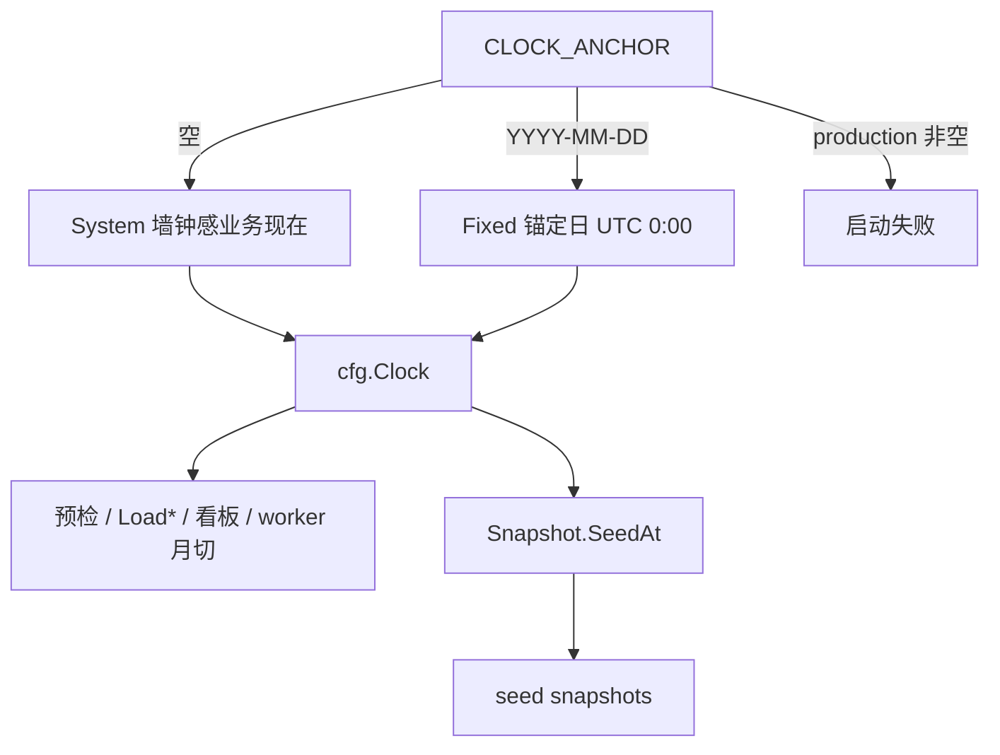
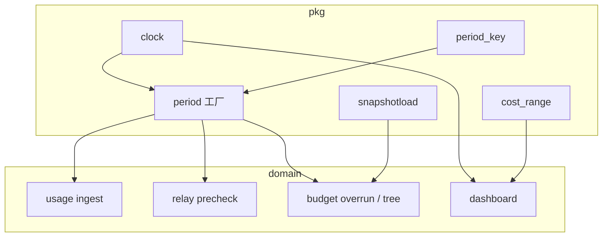

# Backend · 业务时钟与账期

> 现行说明。配置细节见 [Backend-配置架构.md](./Backend-配置架构.md)；预算业务见 [Backend-预算.md](./Backend-预算.md)。  
> 本篇不谈：outbox / lease / session TTL（墙钟）、NewAPI `remain_quota` 算法。

---

## 1. 「哪本预算」是什么意思

这里的「本」**不是**多套预算配置，而是 **按月切开的消耗账本**。

| 跨月保留（同一套） | 按月切开（多本） |
| --- | --- |
| 部门 `budget`、成员 `personal_quota`、Key `quota` 等 **额度上限** | `budget_snapshots` 里按 `period_key`（通常 `YYYY-MM`）累计的 **已消耗** |

每月一张消耗账：6 月的已用记在 `period_key=2026-06`，7 月从 `2026-07` **重新累计**，不用手工清零。预检问的「还能不能花」= 看 **当前这本** 的已用是否触顶。



所以口语里的 **「现在开着哪本预算」** = **当前业务时钟落在哪个月的 `period_key`，门禁与快照读写的是哪一本消耗账**。  
答：只看 `cfg.Clock()`（生产即真实「今天」所在月；本地可用 `CLOCK_ANCHOR` 钉死）。

另一句 **「这笔调用发生在哪个月」** = 这条用量记在审计账本的哪个月，只看 `OccurredAt`，可以和「当前开着的那本」不同（跨月延迟入库时就会不同）。



只有 **Ingest** 会同时写这两条轨；其它路径要么只读开账，要么只记发生。

---

## 2. 为什么开账月和发生月要分开

调用可能跨月才入库：6/30 发生，7/1 才 Ingest。此时：

- **发生月**仍是 6 月 → 审计 / 财务要记在 6 月账本  
- **开着的消耗账**已是 7 月 → 门禁必须扣 / 读 7 月快照，否则「本月还能不能用」会看错本

| 若混用 | 后果 |
| --- | --- |
| 用发生月去扣「现在」的消耗账 | 7 月门禁读到 6 月已用，额度错位 |
| 用入库墙钟去写发生月 | 审计按发生月对不上 |



---

## 3. 三种时间（现状）

| 名称 | 来源 | 干什么 | 不干什么 |
| --- | --- | --- | --- |
| **墙钟** | `time.Now()` | lease、outbox retry、TTL、生成 ID | 不算开账 period、不写账本发生月 |
| **业务时钟** | `cfg.Clock()` | 开账键、预检、超支、预算树 / Key used、看板「今天」、worker 月切触发、seed 开账快照 | 不驱动 lease |
| **事件时间** | `OccurredAt`（来自上游 `CreatedAt`） | ledger `period_key`、`usage_buckets`、审计归因 | 不写开账快照 |



缺 `CreatedAt` / `OccurredAt`：**直接失败**，禁止回退墙钟。

---

## 4. 账期双轨

两套类型，禁止互换：

| 类型 | 时间源 | 写入 | 读取场景 |
| --- | --- | --- | --- |
| `OpenBudgetPeriod` | Clock | `budget_snapshots.period_key` | 预检、超支、预算树、Key 配额 |
| `OccurrencePeriod` | OccurredAt | `usage_ledger.period_key` | 审计、发生月统计 |

DB 列仍是 `string`；域边界用 `.String()` 进出。

### 4.1 键怎么算

组织节点上有 period 规格：

- `"monthly"`（或空）→ 用「那个瞬间」的 UTC 月，得到 `YYYY-MM`
- 固定串（如 `"2026-06"`）→ 原样作为 `period_key`



字符串原语：`SnapshotKey(orgPeriod, at)`（`period_key.go`）。  
域内开账 / 发生路径 **不直调** 它，走工厂（见下）。

### 4.2 工厂（唯一入口）

```go
// 开账 ← Clock
OpenDepartmentPeriod(ctx, nodes, departmentID, clk) (OpenBudgetPeriod, error)
OpenSnapshotKey(orgPeriod, clk) OpenBudgetPeriod
RootPeriodKey(nodes, at) string                    // seed：已有 SeedAt

// 发生 ← OccurredAt
OccurrenceDepartmentPeriod(ctx, nodes, departmentID, occurredAt) (OccurrencePeriod, error)
OccurrenceSnapshotKey(orgPeriod, occurredAt) OccurrencePeriod
```



看板日期区间在 `cost_range.go`（`Resolve` / `PreviousRange`），**不是** snapshot `period_key`。

---

## 5. Ingest：唯一双写点

```text
IngestRaw
  ├─ OccurrenceDepartmentPeriod(OccurredAt) → entry.PeriodKey → ledger
  ├─ OpenDepartmentPeriod(Clock)            → Apply → budget_snapshots
  └─ usage_buckets                          ← OccurredAt
```



读路径（预检、预算树、Key used、超支）只拿 `Open*` / `Load*(..., Clock)`，不读发生轨来做门禁。

---

## 6. 配置与本地锚点

| 项 | 现状 |
| --- | --- |
| `CLOCK_ANCHOR` | 可选 `YYYY-MM-DD`；空 = 系统时钟；**生产禁止** |
| `cfg.Clock()` | 空锚点 → `System()`；有锚点 → `Fixed(UTC 零点)` |
| 域代码 | 只调 `cfg.Clock()` / 注入的 `clock.Clock`，不读 env |
| demo | 建议 `BOOTSTRAP_MODE=demo` + `CLOCK_ANCHOR`，让种子与门禁同月 |
| `Snapshot.SeedAt` | `clock.NowUTC(cfg.Clock())`；缺则 seed 开账快照 fail-fast |
| seed 开账快照 | `RootPeriodKey(nodes, SeedAt)` |
| seed ledger | `OccurrenceSnapshotKey(PeriodMonthly, OccurredAt)`（可与开账月不同） |



瞬时取值统一：`clock.NowUTC(clk)`。

---

## 7. 代码放哪

```text
internal/pkg/clock/          Clock 接口、System / Fixed / NowUTC
internal/config/             Clock()、SeedReferenceDate、生产禁锚点

internal/pkg/budget/
  period_key.go              PeriodMonthly、SnapshotKey
  period.go                  Open* / Occurrence*、RootPeriodKey
  cost_range.go              看板 Resolve / PreviousRange
  snapshotload.go            Load* 读消耗

domain/usage/ingest.go       双轨写入
domain/usage/projection.go   Apply(..., OpenBudgetPeriod)
domain/relay/precheck.go     开账门禁
domain/budget/overrun.go     开账超支
infra/worker/runner.go       月切：OpenSnapshotKey(PeriodMonthly, Clock)

seed/snapshot/*.go           SeedAt、ledger OccurrenceSnapshotKey
seed/apply/tables.go         RootPeriodKey → snapshots
scripts/lint-clock.sh        符号护栏
```



---

## 8. 护栏（怎么防写漂）

| 手段 | 作用 |
| --- | --- |
| `OpenBudgetPeriod` / `OccurrencePeriod` | 类型上区分开账 vs 发生 |
| Ingest 单写入口 | 快照只经 `Apply(..., OpenBudgetPeriod)` |
| `OccurredAtFromPayload` | 缺事件时间 fail |
| `make lint-clock` | 禁 `SnapshotKey(...time.Now)`；`domain/{budget,relay,usage}` 禁直调 `SnapshotKey` |

钉行为的测试（改时钟语义时先跑这些）：

| 场景 | 测试 |
| --- | --- |
| 账本跟 OccurredAt | `TestIngestStoresLedgerPeriodKey` |
| 跨月：快照跟 Clock | `TestIngestSnapshotUsesNowPeriodForMonthlyOrg` |
| 缺 OccurredAt | `TestOccurredAtFromPayloadRejectsMissing` |
| 锚点预检 | `TestPrecheckUsesClockAnchorForPeriodKey` |
| 树与工厂同月 | `TestOpenBudgetPeriodAlignsTreeAndDepartmentFactory` |
| seed 快照跟 Clock、ledger 跟 OccurredAt | `TestSeedBudgetSnapshotsAlignWithClockAnchor` |
| 生产禁锚点 | `TestProductionRejectsClockAnchor` |

---

## 9. 改代码时三问

1. 这段要的是墙钟、**当前开着哪本消耗账**，还是 **事件发生在哪月**？  
2. 开账 `period_key` 是否只来自 `Open*` / `RootPeriodKey`（seed）？  
3. 有 `CLOCK_ANCHOR` 时：开账路径（seed 快照 / 看板 / 预检 / ingest Apply）是否落在同一本？ledger 是否仍跟 `OccurredAt`？
