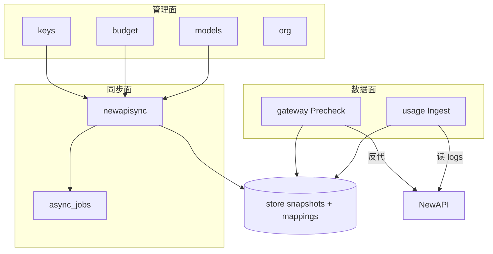

# Backend 优化、简化、模块化与收口

> 基于 `apps/backend/` 全量代码审阅（约 **25k LOC** / **284** 个 internal Go 文件）。  
> 架构基线见 [Backend-架构.md](./Backend-架构.md)；历史收口清单见 [Backend-重构建议.md](./Backend-重构建议.md)。  
> 本文在现有分层单体之上，给出**可执行的优化路线图**——不为架构而架构。

---

## 1. 结论（TL;DR）

Backend 已是**合格的分层单体**，整体方向正确，**不需要换范式**（不拆微服务、不上 wire/fx、不改包名）。

当前最大收益来自三处**收口**：

| 收口点 | 问题 | 目标 |
|--------|------|------|
| **预算语义** | `pkg/budget` 快照加载、`newapisync/remain_budget`、`gateway/precheck` 三处各写一套 min-cap / 超限逻辑 | 单一算法 + 单一加载入口 |
| **域边界泄漏** | domain 直接 import `integration/newapi`、`infra/permission`、`identity/httpx` | 集成类型留在 integration；domain 只依赖 port |
| **大文件职责** | `budget/service.go`（531 行）聚合树/组/预警/审批；store 层 keys/budget repo 超 400 行 | 按 concern 拆文件，接口不变 |

**一句话：** 保持 `Handler → Domain → Store` 单体；在 **budget/gateway/newapisync** 三角和 **store 大 repo** 上模块化；Transport 零业务、装配层去重复、集成层加 facade。

---

## 2. 现状快照

### 2.1 规模

| 区域 | 文件 | 约 LOC | 职责 |
|------|------|--------|------|
| `internal/domain/` | 105 | 10,120 | 业务规则、编排 |
| `internal/store/` | 57 | 6,336 | 接口 + Postgres（`postgres/` 占 5,308） |
| `internal/pkg/` | 30 | 2,261 | 纯计算：`budget/`、`org/`、`clock/` |
| `internal/http/` | 40 | 2,468 | chi、middleware、handler |
| `internal/app/` | 9 | 453 | DI 组合根 |
| `tests/` | ~187 | ~18,144 | 外部 test package + 真实 PG |

### 2.2 分层（现状良好）

```
HTTP middleware → handler（decode / authz / encode）
              → domain.Service（业务规则）
              → store.Store（持久化）
              → postgres
```

**已做到：**

- 无 `domain → http` 反向依赖
- `domain/types/` 作为 API DTO 单一来源，与前端 contract 对齐
- `internal/app/` 手工构造函数注入，按域 `wire*` 拆分，可读
- `wire_helpers.go` 已收口 `EnqueueWalletSync` / `EnqueueRebalanceCompany`
- `domain/keys/` 的 `platform_key_*.go` 是按 concern 拆文件的范例
- `domain/newapisync/interface.go` 已定义 `KeysNewAPISync`、`OutboxHandler` 等窄端口

### 2.3 域地图



| 子域 | 约 LOC | 核心职责 |
|------|--------|----------|
| `org/` | ~2,257 | 成员/角色/部门 + 远程导入同步 |
| `usage/` | ~1,078 | Ingest、projection、ReadModel |
| `keys/` | ~1,080 | PlatformKey / ProviderKey、审批 |
| `newapisync/` | ~820 | NewAPI Admin 同步、outbox、remain 缓存 |
| `budget/` | ~889 | 预算树、组、预警、rebalance/overrun 策略 |
| `gateway/` | ~447 | `/v1` Precheck + 反代 |
| `billing/` | ~580 | 钱包、充值 lot、wallet sync |
| 其余 | <600 各 | company、dashboard、audit、models、memberanalytics |

---

## 3. 痛点分析

### 3.1 预算三角：重复逻辑（高优先级）

quota → budget 命名统一进行中（`groupquota` → `groupbudget`、`remain_budget.go` 新增），但**算法仍未完全收口**：

| 位置 | 做什么 | 问题 |
|------|--------|------|
| `pkg/budget/snapshotload.go` | `LoadBudgetTreeWithConsumed`、`LoadPlatformKeysWithUsed` 等 | 16+ 调用点各自组 snapshot，无统一「预算上下文」 |
| `domain/newapisync/remain_budget.go` | `ComputeRemainBudget()` — key/group/member/dept 取 min | NewAPI `remain_quota` 缓存 |
| `domain/gateway/precheck.go` | `checkDepartmentBudget` / `checkMemberBudget` / … 逐轴校验 | 运行时拦截，逻辑与 remain 类似但实现分离 |

**风险：** 改 min-cap 规则时三处漂移；Precheck 用 snapshot 点值，remain 用内存 DTO，边界条件不一致。

**收口目标：**

```text
pkg/budget/
├── snapshotload.go      # 已有：加载 tree / keys / groups + consumed
├── remain.go            # 新增：ComputeEffectiveRemain(key, ctx) 纯函数
└── context.go           # 新增：BudgetContext { Tree, Members, Keys, Groups, PeriodKey }

domain/gateway/precheck.go     → 调用 remain.go + BudgetContext
domain/newapisync/remain_budget.go → 薄包装，委托 remain.go
domain/keys/*, budget/*, newapisync/lifecycle_* → 用 LoadBudgetContext 替代多次 Load*
```

### 3.2 域 → 集成层泄漏（中优先级）

约 **20** 个 domain 文件直接 import `integration/newapi`：

```
gateway/precheck.go, billing/wallet_sync.go, budget/rebalance.go,
newapisync/lifecycle_*.go, models/service.go, company/service*.go, usage/entry.go ...
```

另有 domain → `infra/permission`（`usage/scope.go`、`org/structure/role.go`）、domain → `identity/httpx`（`org/structure/member.go`）。

**问题：** 厂商 Admin API 类型（`newapi.FromNewAPIUnits` 等）渗入业务层；permission manifest 变更牵动 domain。

**收口目标：**

| 泄漏 | 做法 |
|------|------|
| NewAPI 单位换算 | 在 `integration/newapi` 或 `domain/company.WalletService` 提供 `PointFromNewAPIQuota(...)`，domain 不 import client 包 |
| Precheck 钱包漂移 | 已有 `WalletService`；precheck 只调 port |
| usage scope | 注入 `ScopeResolver` 接口，manifest 解析留在 `infra/permission` |
| member 自删 | handler 传 `currentMemberID`，domain 不 import `httpx` |

### 3.3 大文件 / 上帝 Service（中优先级）

| 文件 | 行数 | 建议 |
|------|------|------|
| `domain/budget/service.go` | 531 | 拆为 `tree.go`、`groups.go`、`alerts.go`、`approvals.go`；`Service` 接口保留在 `service.go` |
| `domain/org/structure/member.go` | 421 | 拆 `member_delete.go`（级联 disable keys） |
| `store/postgres/keys_repo.go` | 451 | 拆 `keys_repo_crud.go` + `keys_repo_query.go` |
| `store/postgres/budget_repo.go` | 406 | 同上，按 CRUD / 聚合查询 |
| `seed/apply/tables.go` | 528 | 按域拆 seed 表填充 |

`budget/service.go` 是唯一超过 500 行的 domain 文件；`keys/` 已证明拆文件不破坏 API。

### 3.4 HTTP / 装配层（低–中优先级）

| 项 | 现状 | 目标 |
|----|------|------|
| `httpdeps.Deps` | 22 字段扁平 struct | **保持**——组合根聚合合理 |
| `store.Store` 暴露给 HTTP | `router.go` 把全 Store 传给 authz revision middleware | 只注入 `CompanyRepository` |
| dashboard 参数校验 | handler 与 service 部分重复 | 校验全部在 `domain/dashboard` |
| rebalance enqueue | `usage/side_effects.go`、`budget/service.go` 仍有 inline enqueue | 统一走 `app.EnqueueRebalanceCompany` |
| worker 测试 wiring | `tests/testutil/worker/runner.go` 手工拼 service | 复用 `app.NewWithStore` 或导出 `buildDomainServices` 测试入口 |

### 3.5 测试 helper 膨胀（低优先级）

`tests/testutil/` ~2,762 LOC，子包 `pg/`、`gateway/`、`saas/`、`org/` 持续增长。

**原则：** 新场景优先复用 `testutil.NewTestApp`；只有跨 3+ 测试文件重复的 fixture 才提取子包。

---

## 4. 模块化原则

### 4.1 什么放哪里

| 放 `pkg/` | 放 `domain/` | 放 `integration/` |
|-----------|--------------|-------------------|
| 纯函数、无 I/O | 业务流程、状态机、编排 | HTTP client、厂商 DTO |
| 2+ 域共用的预算/组织计算 | Service 接口 + 单域 CRUD | NewAPI Admin API 封装 |
| `clock`、`common` 原语 | `WithTx` 跨表事务 | Feishu datasource |

### 4.2 Store 注入策略（维持 §2.3 渐进收窄）

| 场景 | 注入 |
|------|------|
| 多 repo + `WithTx` | `store.Store`（budget、keys、billing、ingest） |
| 跨域编排、需明确边界 | 组合 port（范例：`usage.EntryBuildReader`） |
| 单 service、1–2 repo、无跨表事务 | 具体 `XxxRepository`（新代码优先） |
| Gateway Precheck | 已收窄为 9 个 repo——**最佳实践**，新 port 参照此模式 |

### 4.3 NewAPISync 模块化（保持现有拆分）

```
internal/domain/newapisync/
├── interface.go           # KeysNewAPISync / OutboxHandler / OverrunKeyControl
├── lifecycle.go           # 门面
├── lifecycle_create.go    # 按操作拆文件 ✓
├── lifecycle_update.go
├── lifecycle_revoke.go
├── lifecycle_rotate.go
├── lifecycle_provider.go
├── lifecycle_rebalance.go
├── lifecycle_model_limits.go
├── lifecycle_helpers.go
├── remain_budget.go       # → 委托 pkg/budget/remain.go
├── channel_policy.go
└── outbox_*.go
```

**不做：** 5 个独立 queue repository（底层一张 `async_jobs` 表）；按 channel 建子包。

### 4.4 keys 域范例（推广到其他域）

```
internal/domain/keys/
├── service.go              # Service 接口 + 构造
├── platform_key_create.go
├── platform_key_update.go
├── platform_key_list.go
├── platform_key_actions.go
├── platform_key_enrich.go
├── platform_key_newapi.go  # 同步编排，调 newapisync port
├── provider_key.go
└── approval.go
```

**budget 应对齐：**

```
internal/domain/budget/
├── service.go      # Service 接口
├── tree.go           # GetTree / UpdateNode / member budgets
├── groups.go         # CRUD groups
├── alerts.go         # alert rules
├── approvals.go      # budget approvals
├── overrun.go        # 已有
├── rebalance.go      # 已有
└── interfaces.go     # OverrunProcessor / Rebalancer ports
```

---

## 5. 分阶段路线图

### Phase 0 — 命名收口（进行中）

与 [Backend-命名统一.md](./Backend-命名统一.md) 对齐，完成 quota → budget 全链路：

- [x] `groupquota` → `groupbudget`、`memberquota` → `memberbudget`
- [x] `newapisync/remain_budget.go` 替代 `quota.go`
- [ ] 前端 / API JSON / 测试 fixture 与后端命名一致
- [ ] 文档 [Backend-预算.md](./Backend-预算.md) 同步术语

**验收：** 代码库无 `Quota` 业务命名残留（NewAPI 厂商字面量除外）。

### Phase 1 — 低风险 dedup（1–2 周）

| # | 任务 | 文件 |
|---|------|------|
| 1 | 提取 `pkg/budget/remain.go`，`ComputeRemainBudget` 单一实现 | `remain_budget.go`、`precheck.go` |
| 2 | 提取 `LoadBudgetContext(ctx, st, clk)` 减少重复 snapshot 加载 | `pkg/budget/context.go` |
| 3 | rebalance enqueue 统一走 `app.EnqueueRebalanceCompany` | `usage/side_effects.go`、`budget/service.go` |
| 4 | authz revision middleware 只注入 `CompanyRepository` | `http/router.go`、`http/deps/` |
| 5 | dashboard `UsageSeries` 参数校验下沉 service | `handler/dashboard/`、`domain/dashboard/series.go` |

**验收：** Precheck 与 remain_budget 测试共享同一 golden case；grep `EnqueueRebalance` 无 inline 字面量。

### Phase 2 — 文件级模块化（2–3 周）

| # | 任务 | 文件 |
|---|------|------|
| 6 | 拆分 `budget/service.go` | → `tree.go`、`groups.go`、`alerts.go`、`approvals.go` |
| 7 | 拆分 `org/structure/member.go` | → `member_delete.go` |
| 8 | 拆分 `postgres/keys_repo.go` | → crud + query |
| 9 | 拆分 `postgres/budget_repo.go` | → crud + query |
| 10 | `seed/apply/tables.go` 按域拆 | `seed/apply/budget.go` 等 |

**验收：** 无 domain 文件 > 400 行；public `Service` 接口签名不变；`make test-unit` 全绿。

### Phase 3 — 边界收紧（按需）

| # | 任务 | 说明 |
|---|------|------|
| 11 | NewAPI 单位换算 facade | domain 零 import `integration/newapi`（gateway/billing 先行） |
| 12 | `usage/scope` 注入 `ScopeResolver` | 去 `infra/permission` 依赖 |
| 13 | Precheck 改用 `BudgetContext` port | 参照 `wire_gateway.go` 窄注入 |
| 14 | `IsNewAPIUnavailable` 移到 `pkg/errors` 或 `domain/errors` | 断 `newapisync → usage` 边 |
| 15 | worker 测试复用 app wiring | 减 `testutil/worker` 重复 |

**验收：** `grep 'integration/newapi' internal/domain/` 文件数下降 50%+；domain 不 import `infra/`。

---

## 6. 域级收口清单

### 6.1 budget + gateway + newapisync

```text
         ┌─────────────────────────────────────┐
         │         pkg/budget (纯计算)          │
         │  snapshotload · remain · context    │
         └──────────────┬──────────────────────┘
                        │
        ┌───────────────┼───────────────┐
        ▼               ▼               ▼
   budget/         gateway/       newapisync/
   策略编排         运行时拦截       Admin 同步 + remain 缓存
        │               │               │
        └───────────────┴───────────────┘
                        │
                   store snapshots
                   + platform_key_mappings
                   + async_jobs (rebalance/overrun)
```

**规则：**

- **pkg/budget** 拥有 min-cap 算法与 snapshot 加载
- **gateway** 只做请求时校验 + 反代，不调 keys/budget domain service（读 store snapshot）
- **newapisync** 写 NewAPI Admin + 更新 mapping remain 缓存
- **budget** 拥有 rebalance/overrun **策略**，执行通过 async_jobs 委托 worker

### 6.2 keys

- 保持 `platform_key_*.go` 拆分
- NewAPI 同步只通过 `newapisync.KeysNewAPISync` port，不在 keys 内直接调 client
- 创建/更新时的 budget 校验统一 `LoadBudgetContext`

### 6.3 org

- 对外仍是一个 `org.Service` 门面
- `structure/` vs `remote/` 内部分层已够，不建 `org/platform/` 子包
- member 删除级联（disable keys）独立文件，便于测试

### 6.4 usage + billing

- Ingest 事务边界：`ConsumptionWriter`（`store.Store`）——新贡献者必读 [Backend-Ingest架构.md](./Backend-Ingest架构.md)
- `EntryBuildReader` 作为跨域窄接口范例
- wallet sync 单位换算收口到 integration facade

---

## 7. 验收指标

| 指标 | 当前 | 目标 |
|------|------|------|
| domain 文件最大行数 | 531 (`budget/service.go`) | ≤ 400 |
| postgres repo 最大行数 | 451 (`keys_repo.go`) | ≤ 350 |
| domain import `integration/newapi` | ~20 文件 | ≤ 10（Phase 3） |
| domain import `infra/*` | ~10 文件 | 0 |
| `LoadBudgetTreeWithConsumed` 直接调用 | 16+ | 收敛到 `LoadBudgetContext` |
| handler 内业务 if/校验 | 少量残留 | 0 |

CI 可加脚本（可选）：

```bash
# 示例：domain 文件行数告警
find apps/backend/internal/domain -name '*.go' -exec wc -l {} + | awk '$1 > 400 { print; exit 1 }'
```

---

## 8. 明确不做

与 [Backend-重构建议.md](./Backend-重构建议.md) §6 一致：

| 不做 | 原因 |
|------|------|
| 微服务 / 模块单体拆分 | 团队规模与部署形态不需要 |
| wire、fx 等 DI 框架 | 构造函数注入已够用 |
| `domain` → `bounded` / `http` → `transport` | 纯改名 |
| `domain/types` 回迁各域 | 单一 DTO 层更实用 |
| 全量 service 改窄 repo 注入 | 按场景渐进 |
| 内存 store mock | PG per-schema 已是标准 |
| scaffold 代码生成 | 域新增频率低 |
| audit/platform handler 大规模重构 | 顺手对齐即可 |

---

## 9. 与现有文档关系

| 文档 | 本文关系 |
|------|----------|
| [Backend-架构.md](./Backend-架构.md) | 分层与命名基线，不变 |
| [Backend-重构建议.md](./Backend-重构建议.md) | 历史收口项；`wire_helpers` 已完成，本文 supersede 待做清单 |
| [Backend-预算.md](./Backend-预算.md) | Phase 0 命名需同步 |
| [Backend-存储架构.md](./Backend-存储架构.md) | Store 拆分参照 org_repo 多文件模式 |
| [plan.md](./plan.md) | 工程 backlog 可摘 Phase 1–2 条目 |

---

## 10. 推荐下一步

若只选 **三件事** 立刻做：

1. **`pkg/budget/remain.go`** — 统一 Precheck 与 NewAPI remain 算法（防 drift）
2. **拆分 `budget/service.go`** — 唯一 >500 行 domain 文件，照抄 keys 模式
3. **Phase 0 命名收尾** — quota → budget 全链路一致后再动 Phase 2 store 拆分

完成后更新 [Backend-重构建议.md](./Backend-重构建议.md) §3 待做差距，避免双文档漂移。
