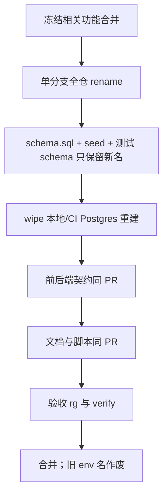

# Backend 命名统一（去 Relay / 去领域 Token）

> **目标：** 一次改完后，本仓库（代码、文件名、库表/列、环境变量、脚本、文档）**不再出现 `Relay` / `relay` 作为我方域名**；领域语言**不用 Token 指 Key**。  
> **范围：** 文件名、类型/接口/函数名、包名、DB 表名与列名、`async_jobs.channel` 取值、env、pnpm 脚本、前后端契约、文档。  
> **策略：** **一次性重命名**（单 PR / 同发布窗口），不留兼容别名、不留双词并存。本仓库 schema 以 wipe 重建为主，不做增量 migration 双写。  
> **相关：** [Backend-架构.md](./Backend-架构.md) · [Backend-存储架构.md](./Backend-存储架构.md) · [Backend-重构建议.md](./Backend-重构建议.md)（其中「不重命名顶层包 / 保留 Relay*」被本文 **覆盖**，仅针对本重命名项）

---

## 0. 对旧稿的架构问题（为何重写）

上一版「Relay 命名拆分」有几处和「以后零歧义」冲突，必须纠正：

| 问题 | 为何不行 |
| ---- | -------- |
| 写「包名 `relay` 暂留」「不重命名顶层包」 | 与「Relay 再也不出现」直接矛盾 |
| P0→P3 分阶段、长期双词 | 过渡期文档/代码两套说法，比现在更乱 |
| 只改 Mapping，Lifecycle 仍叫 `TokenLifecycle` | 违反「领域不用 Token」 |
| 未把前端 / JSON 契约 / seed / 文档文件名算进同一刀 | 库表改了、API 仍 `platformKey`，歧义仍在 |
| 文档自身仍叫 `Backend-Relay命名拆分` | 终态还带着 Relay |
| 与 [Backend-重构建议.md](./Backend-重构建议.md)「拆接口、不改名」未声明优先级 | 执行时会打架 |

本文以**终态零 Relay、零领域 Token（指 Key）**为准；重构建议里与此冲突的条目作废。

---

## 1. 终态词汇表（唯一合法说法）

| 终态名 | 含义 | 现状（一次性删掉） |
| ------ | ---- | ------------------ |
| **NewAPI** | 上游服务 | 口语「Relay」、`start:relay` |
| **Gateway** | `/v1` 预检 + 反代 | Relay Gateway、`RELAY_GATEWAY_*`、`deps.RelayGateway` |
| **TokenJoyKey** | 租户 LLM 调用钥匙 | `PlatformKey`、`platform_keys`、`platformKey*` API |
| **NewAPIKey** | TokenJoyKey 在 NewAPI 的对应实体 | 领域口语 token；列 `newapi_token_id` |
| **ProviderKey** | 供应商凭证 | 可保留实体名 |
| **NewAPIChannel** | ProviderKey 远端对应 | `relay_channel_id` |
| **TokenJoyKeyMapping** | TokenJoyKey ↔ NewAPIKey | `relay_mappings`、`RelayMapping` |
| **KeySync** | 同步生命周期服务 | `TokenLifecycle`、`domain/relay` 中 lifecycle |
| **KeySyncOutbox** | Key/Channel 异步同步队列 | `channel=relay`、`RelayOutbox*` |
| **AsyncJobs** | 四通道任务门面 | `RelayJobRepository`（名大于实） |

```text
TokenJoyKey  ←── TokenJoyKeyMapping ──►  NewAPIKey
ProviderKey  ←── newapi_channel_id  ──►  NewAPIChannel
```

**硬规则：**

1. 我方标识符、注释、文档标题、脚本名：**禁止** `Relay` / `relay` / `RELAY_`。  
2. 我方领域名：**禁止**用 `Token` 指 Key 或 Mapping / Lifecycle（JWT/session 须写全称 SessionJWT 等）。  
3. **NewAPIKey** 只用于 TokenJoyKey 的远端对应；Channel / KeySync **不得**叫 NewAPIKey。  
4. **不做**旧名别名、`type PlatformKey = TokenJoyKey`、双表共存。

---

## 2. 边界：什么叫「再也不出现」

| 层 | 要求 |
| -- | ---- |
| `apps/backend`、`apps/frontend`、`packages/*`、根脚本、`docs/*` | `rg -i relay` **零命中**（验收见 §6） |
| `apps/newapi` 我方脚本/compose/env 注释 | 同样清零（如 `start:relay`、`.env.example` 标题） |
| NewAPI **上游产品** HTTP/SDK（CreateToken 等） | **不改厂商 API**；仅在 `integration/newapi` 边界翻译成 NewAPIKey |
| 历史 git 提交 / 已发布外部文章 | 不回溯；以主干现状为准 |

「零 Relay」= **本 monorepo 受控文本零命中**，不是改 NewAPI 开源项目的领域词。

---

## 3. 一次性重命名总表

### 3.1 包 / 目录 / 文件

| 现状 | 终态 |
| ---- | ---- |
| `internal/domain/relay/` | 拆为 `internal/domain/keysync/` + `internal/domain/gateway/`（或单包 `keysync` 且 gateway 子文件，**目录名不得含 relay**） |
| `internal/store/relay.go` | `keysync.go` / `tokenjoy_key_mapping.go` + `async_jobs.go`（按类型拆文件，无 relay） |
| `store/postgres/relay_mapping.go` | `tokenjoy_key_mapping.go` |
| `store/postgres/relay_jobs.go` | `async_jobs.go` |
| `store/postgres/relay_repo.go` | 删除或并入上述；无 relay 文件名 |
| `infra/worker/relay_processor.go` | `key_sync_outbox_processor.go` |
| `app/wire_relay.go` | `wire_gateway.go` + `wire_keysync.go` |
| `domain/keys/platform_key_*.go` | `tokenjoy_key_*.go` |
| `tests/testutil/relay/` | `tests/testutil/gateway/` 与/或 `keysync/` |
| `tests/domain/relay/` | `tests/domain/keysync/`、`tests/domain/gateway/` |
| 文档 `Backend-Relay命名拆分.md` | **本文** `Backend-命名统一.md` |

### 3.2 类型 / 接口 / 函数（示例，须全仓替换）

| 现状 | 终态 |
| ---- | ---- |
| `RelayMapping` | `TokenJoyKeyMapping` |
| `RelayMappingRepository` | `TokenJoyKeyMappingRepository` |
| `RelayJobRepository` | 删除该伞名；调用方直接用 `AsyncJobRepository` + 各 channel 小接口 |
| `RelayOutbox*` / `EnqueueRelayOutbox` | `KeySyncOutbox*` / `EnqueueKeySyncOutbox` |
| `RelayGate` / `requireRelay` | `NewAPIGate` / `requireNewAPI` |
| `KeysRelaySync` / `OverrunRelayControl` | `KeySync` 端口 / `OverrunKeyControl` |
| `TokenLifecycle` / `NewTokenLifecycle` | `KeySync` / `NewKeySync` |
| `RelayGateway` / `RelayGatewayEnabled` | `Gateway` / `GatewayEnabled` |
| `IsRelayBlocked` | `IsGatewayBlocked` |
| `PlatformKey` / `HashPlatformKey` | `TokenJoyKey` / `HashTokenJoyKey` |
| `RelayGroup` / `RelayGroupForDepartment` | `NewAPIGroup` / `NewAPIGroupForDepartment` |
| `RelayChannelID` | `NewAPIChannelID` |
| `JobChannelRelay` / 字面量 `"relay"` | `JobChannelKeySync` / `"key_sync"` |
| `st.Relay()` | 拆成 `st.TokenJoyKeyMapping()` + `st.AsyncJobs()`（或等价窄接口，**无 Relay()**） |

### 3.3 数据库（表 / 列 / 取值）

| 现状 | 终态 |
| ---- | ---- |
| `platform_keys` | `tokenjoy_keys` |
| `relay_mappings` | `tokenjoy_key_mappings` |
| `relay_mappings.platform_key_id` | `tokenjoy_key_id` |
| `relay_mappings.newapi_token_id` | `newapi_key_id` |
| `relay_mappings.relay_group` | `newapi_group` |
| `provider_keys.relay_channel_id` | `newapi_channel_id` |
| 凡 FK/索引名含 `relay_` / `platform_key` | 同步改名 |
| `async_jobs.channel = 'relay'` | `'key_sync'`（wipe 后无旧行；若有环境残留则发布前清空 jobs） |
| seed / snapshot / 测试 schema | 与上表一致，禁止旧名 |

### 3.4 配置 / 脚本

| 现状 | 终态 |
| ---- | ---- |
| `RELAY_GATEWAY_ENABLED` | `GATEWAY_ENABLED` |
| `PLATFORM_SHARED_RELAY_GROUP` | `PLATFORM_SHARED_NEWAPI_GROUP` |
| `pnpm start:relay` | `pnpm start:newapi`（**删除** `start:relay`，不留别名） |
| `.env.example` 中 Relay 文案 | NewAPI / Gateway 文案 |
| 生产/本地 env 清单、部署文档 | 同发，禁止旧变量名 |

### 3.5 前端与契约

前端现状无 `relay`，但有 **PlatformKey** 全链路，必须同刀改掉，否则「库表 TokenJoyKey、API 仍 platformKey」继续混乱：

| 现状 | 终态 |
| ---- | ---- |
| `platformKeyApi` / `PlatformKey` 类型 | `tokenJoyKeyApi` / `TokenJoyKey` |
| 路径/查询若含 `platform-key`、`platformKeyId` | `tokenjoy-key` / `tokenJoyKeyId`（与 Backend JSON 一致） |
| `callerType: 'platform_key'` | `'tokenjoy_key'` |
| 文档 Frontend.md / 权限文档中的 Platform Key 表述 | TokenJoyKey（产品文案同步） |

### 3.6 文档

所有 `docs/**`、`CLAUDE.md` 中的 Relay / Platform Key（指该实体）/ 领域 Token（指 Key）一次性改为终态词；索引链到本文，删除旧「Relay 命名拆分」文件名。

---

## 4. 执行方式（一次性）



1. **一个变更集**完成 §3，不拆「先文档后代码」「先 Backend 后 Frontend」。  
2. **无兼容层**：不读旧列、不认旧 channel、不认旧 env。  
3. **DB：** 依赖现有 wipe 重建；有持久化环境则发布窗口清空/重建，不写双写 migration。  
4. **集成边界：** `integration/newapi` 内可出现厂商字段名的字符串映射注释（如「Admin CreateToken → 我方 NewAPIKey」）；**不得**把厂商词泄漏到 domain/store/HTTP JSON。  
5. **与重构建议关系：** 本项是命名统一，可顺手按职责拆 `keysync` / `gateway` 文件；不借机做无关大重构。

---

## 5. 风险与非目标

| 项 | 说明 |
| -- | ---- |
| 波及面 | Backend + Frontend + 契约 + 全文档；属高成本，但符合「一次清零」 |
| API 破坏性 | `platformKey*` → `tokenJoyKey*` 为破坏性变更；无外部公网承诺则同版本切；有外部客户端须在发布说明写明 |
| NewAPI 厂商词 | 对端仍可能叫 token；只在 integration 翻译 |
| 非目标 | 不改 NewAPI 上游产品源码领域模型；不改 rebalance/overrun/wallet_sync 等已清晰 channel 名 |
| 非目标 | 不引入 Bridge/Integration 新伞名替代 Relay |

---

## 6. 验收标准

合并前全部满足：

```bash
# 我方受控树（按需排除 vendor/node_modules/.git）
rg -i 'relay' apps/backend apps/frontend packages docs CLAUDE.md package.json \
  apps/newapi/scripts apps/newapi/.env.example apps/newapi/docker-compose.yml
# 期望：无输出

rg -n 'PlatformKey|platform_keys|platformKey|TokenLifecycle|newapi_token_id|relay_mappings' \
  apps/backend apps/frontend packages docs
# 期望：无输出（历史归档目录若保留须移出或改写）
```

- `pnpm verify` 通过（含 Backend 测试，Postgres wipe 后新 schema）。  
- 本地：`pnpm start:newapi` 可起；无 `start:relay`。  
- 运行配置仅 `GATEWAY_ENABLED` + `NEW_API_*` + `PLATFORM_SHARED_NEWAPI_GROUP`。

---

## 7. 一句话

**Relay 不是「拆开叫」就够，而是从标识符到库表到契约一次性消灭；TokenJoyKey / NewAPIKey / TokenJoyKeyMapping / KeySync / Gateway / AsyncJobs 成为唯一说法，不留别名、不留第二阶段。**
