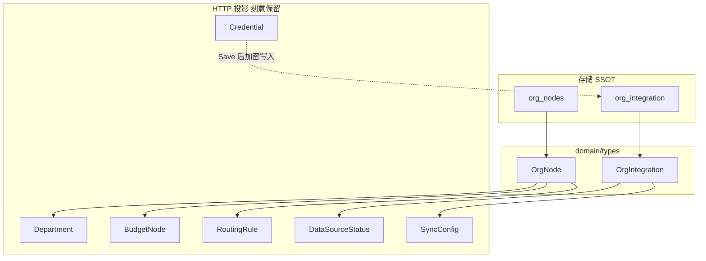

# Backend 命名规范

**文档性质：** 跨系统术语权威  
**受众：** 全员（前后端、产品、运维）  
**关联：** [Backend-存储实体优化.md](./Backend-存储实体优化.md) · [Frontend-API契约.md](./Frontend-API契约.md) · [Backend-存储架构.md](./Backend-存储架构.md)

本文定义 TokenJoy 各层**该用什么词**，以及**刻意保留旧名**的边界。实现以 `schema.sql`、`domain/types/`、`Frontend-API契约.md` 为准。

---

## 1. 决策总表

| 场景                         | 用词                                                      | 不用                                          |
| ---------------------------- | --------------------------------------------------------- | --------------------------------------------- |
| 租户边界                     | **Company** / `company_id`                                | `tenant` 作业务实体                           |
| 存储/内部读写组织树          | **OrgNode** / `org_nodes`                                 | —                                             |
| 外键列语义                   | `department_id` ≡ **`org_node_id`**                       | 物理列名保持 `department_id`                  |
| HTTP JSON / 路径（稳定契约） | `departmentId`, `Department`, `BudgetNode`, `RoutingRule` | 短期不改为 `nodeId`                           |
| 外部 HR 配置行               | **OrgIntegration** / `org_integration`                    | `DataSourceCredential` 表、`OrgSyncConfig` 表 |
| 请求体明文密钥               | **Credential**                                            | `Integration`（避免与配置行混淆）             |
| 落库加密密钥                 | `encrypted_credential` / **StoredCredential**             | 独立凭证表                                    |
| 控制台可登录用户             | **Member** / `members`                                    | PRD 中的 User（与 Member 同指）               |
| NewAPI 钱包用户              | **WalletUser** / `newapi_wallet_user_id`                  | 与 `types.Member` 混称 User                   |
| 外部系统客户端包             | `internal/integration/{vendor}`                           | 与 `types.OrgIntegration` 同名混读            |
| Path / Query 参数            | `deptId`                                                  | 与 Body 的 `departmentId` 区分（见 §5）       |
| Request / Response Body      | `departmentId`                                            | `deptId`                                      |

---

## 2. 三层模型：存储 · 领域 · API



**规则：**

1. **禁止**为 Department / BudgetNode / RoutingRule 单独建表或独立持久化；一律从 `OrgNode` + `model_allowlist` 投影。
2. **禁止**为 Credential 单独建表；明文仅存在于请求体，落库为 `org_integration.encrypted_credential`。
3. 改组织树（增删移节点、预算、路由、白名单）走 **单事务** `Org().Nodes().SetTree` + `Models().Allowlist().Replace`。

---

## 3. `org` 一词三义（必读）

| 含义               | 示例                                      | 指什么                                                  |
| ------------------ | ----------------------------------------- | ------------------------------------------------------- |
| **组织管理域**     | `/api/org/*`、`domain/org`、`handler/org` | 成员、角色、数据源、部门 API 等业务边界                 |
| **仓储聚合**       | `OrgRepository`                           | 成员 + 角色 + 权限 + `Integration()` + `Nodes()` 子接口 |
| **组织树节点实体** | `OrgNode`、`org_nodes`、`Org().Nodes()`   | 部门 + 预算 + 路由列合一的行                            |

**读法：** 看到 `org` 先判断是「域名 / 仓储」还是「OrgNode 实体」；只有后者等于存储上的组织树节点。

---

## 4. 核心实体命名

### 4.1 Company（租户）

- 表：`companies`；隔离列：`company_id`。
- 私有化默认 `company_id = 1`。
- `Company` 结构体目前仅在 `store` 层；HTTP 仅暴露 `companyId`（Session / Member）。
- **不用** `tenant` 表示 TokenJoy 租户（Feishu API 的 `tenant_access_token` 除外）。

### 4.2 OrgNode（组织节点）

- 表：`org_nodes`；类型：`types.OrgNode`。
- 一行包含：组织字段 + 预算字段 + 路由列。
- 以下列名**物理不改**，语义均为 `org_node_id`：

  `members.department_id`、`usage_ledger.department_id`、`budget_group_departments.department_id`、`relay_mappings.department_id`、`usage_buckets.department_id`、`alert_rules.node_id`（挂载节点）

### 4.3 Department / BudgetNode / RoutingRule（API 投影）

| 投影类型      | HTTP 用途                   | 组装方式                           |
| ------------- | --------------------------- | ---------------------------------- |
| `Department`  | `GET /org/departments/tree` | `OrgNodeToDepartment`              |
| `BudgetNode`  | `GET /api/budget/tree`      | `OrgNodeToBudgetNode`              |
| `RoutingRule` | `GET /api/models/routing`   | `OrgNodeToRoutingRule` + allowlist |

- `RoutingRule.id` **恒等于** `nodeId`（`org_nodes.id`）。
- JSON 路由继承字段：`inherited`；存储列：`routing_inherited`。

### 4.4 Member（成员）

- 表：`members`；类型：`types.Member`。
- 产品文档中的「用户」在技术上统一称 **Member**。
- `integration/datasource/feishu.Member` 为飞书 API 形状，**不是** `types.Member`。

### 4.5 OrgIntegration（组织集成）

- 表：`org_integration`（每企业一行）。
- 合并：连接状态、定时同步策略、加密凭证。
- HTTP 仍投影为 `DataSourceStatus` + `SyncConfig`；路径 `/org/data-source/*`。
- `connected`（探测/导入连通）与 `enabled`（定时任务开关）**语义独立**。

### 4.6 Credential（凭证 DTO）

| 层          | 名称                                                                                    |
| ----------- | --------------------------------------------------------------------------------------- |
| HTTP 请求体 | `types.Credential`（如 `FeishuCredential`）                                             |
| 加密落库    | `org_integration.encrypted_credential`                                                  |
| 读取投影    | `types.StoredCredential`                                                                |
| Store 方法  | `GetIntegrationCredential` / `SaveIntegrationCredential` / `ClearIntegrationCredential` |

明文凭证**永不**写入除加密列以外的字段。

### 4.7 model_allowlist

- `owner_type`：`platform_key` | `org_node` | `key_approval`
- 常量：`AllowlistOwnerOrgNode` 等与 DB CHECK 一致。
- 路由白名单：`owner_type = 'org_node'`, `owner_id = node_id`。

---

## 5. HTTP 参数命名约定

### 5.1 `deptId` vs `departmentId`

| 位置                 | 命名           | 示例                                                          |
| -------------------- | -------------- | ------------------------------------------------------------- |
| URL path segment     | `deptId`       | dashboard `/cost/departments/{deptId}/...`、models `?deptId=` |
| Budget path segment  | `departmentId` | `/budget/departments/{departmentId}`、`.../member-quotas`     |
| Query string         | `deptId`       | `/models/routing/resolve?deptId=`                             |
| JSON body / response | `departmentId` | `Member.departmentId`                                         |

二者值相同，均为 `org_nodes.id`。前端 API 客户端参数名统一用 **`departmentId`**，发请求时按上表映射到 path/query。

### 5.2 Budget 路径（部门树预算）

预算域中**沿组织树逐级分配**的额度，对外路径统一用 **`departments`**（产品语义）；底层仍为 `org_nodes` 同一 ID。

| 端点                                                  | 说明                 |
| ----------------------------------------------------- | -------------------- |
| `PUT /budget/departments/:departmentId`               | 更新部门节点预算     |
| `GET /budget/departments/:departmentId/member-quotas` | 该部门下成员配额列表 |

个人额度、预算组仍分别为 `/budget/members/*`、`/budget/groups/*`。

### 5.3 Dashboard：`teams` vs `departments`

- 端点：`GET /dashboard/usage/teams`（产品「团队用量」）
- 响应字段：`TeamUsage.departmentId` / `departmentName`（存储语义为 org_node）

文档与 UI 统一：**API 路径保留 `teams`**；字段名保留 `departmentId`；不在存储层引入 Team 实体。

### 5.4 RoutingRule：`id` 与 `nodeId`

- 两者在响应中**同值**；新代码优先读 `nodeId`。
- 更新路由：`PUT /models/routing/:id` 中 `:id` = `nodeId`。

---

## 6. 包与 Repository 命名

### 6.1 Store 访问形态

```
Store.Org().Nodes()          → OrgNodeRepository
Store.Org().Integration()    → OrgIntegration 行
Store.Models().Allowlist()   → ModelAllowlistRepository
```

不在 `Store` 顶层新增 `OrgNode()` 或 `Credential()`。

### 6.2 `integration` 包（外部系统）

- 路径：`apps/backend/internal/integration/`
- 职责：Feishu、NewAPI 等 **vendor 客户端**
- import 建议 alias：`vendorint "github.com/tokenjoy/backend/internal/integration/datasource"`，避免与变量 `integration types.OrgIntegration` 混淆。

### 6.3 三个 `package org`

| 路径               | 职责                                                  |
| ------------------ | ----------------------------------------------------- |
| `domain/org`       | 领域服务                                              |
| `pkg/org`          | 树工具（`OrgNode` 为唯一实现，`Department` 为薄包装） |
| `http/handler/org` | `/api/org` HTTP                                       |

---

## 7. 字段速查

| 字段                                 | 含义                                      |
| ------------------------------------ | ----------------------------------------- |
| `company_id` / `companyId`           | 租户                                      |
| `department_id` / `departmentId`     | org_node ID（语义）                       |
| `department_name` / `departmentName` | org_node 名称（反范式或 join）            |
| `node_id` / `nodeId`                 | 预警 / 路由挂载的 org_node ID             |
| `newapi_wallet_user_id`              | 企业钱包用户（NewAPI `users.id`），非成员 |
| `routing_inherited` / `inherited`    | 路由是否继承父节点 allowlist              |

---

## 8. 明确不改

| 项                                                         | 原因                                                                   |
| ---------------------------------------------------------- | ---------------------------------------------------------------------- |
| DB 列 `department_id` → `org_node_id`                      | 牵涉面过大，见 [Backend-存储实体优化.md](./Backend-存储实体优化.md) §7 |
| HTTP JSON `Department` / `departmentId`                    | API 版本稳定                                                           |
| `/org/data-source/*` 路径                                  | 产品「数据源」语义                                                     |
| `RelayOutboxRepository` / `WebhookOutboxRepository` 方法名 | 底层已统一 `outbox` 表，接口名保留                                     |

---

## 9. 权威来源优先级

1. API 路径与 JSON → [Frontend-API契约.md](./Frontend-API契约.md)
2. 表结构 → `apps/backend/internal/store/postgres/schema.sql`
3. 后端类型 → `apps/backend/internal/domain/types/`
4. 前端类型 → `apps/frontend/src/api/types/`
5. 术语边界 → **本文**
