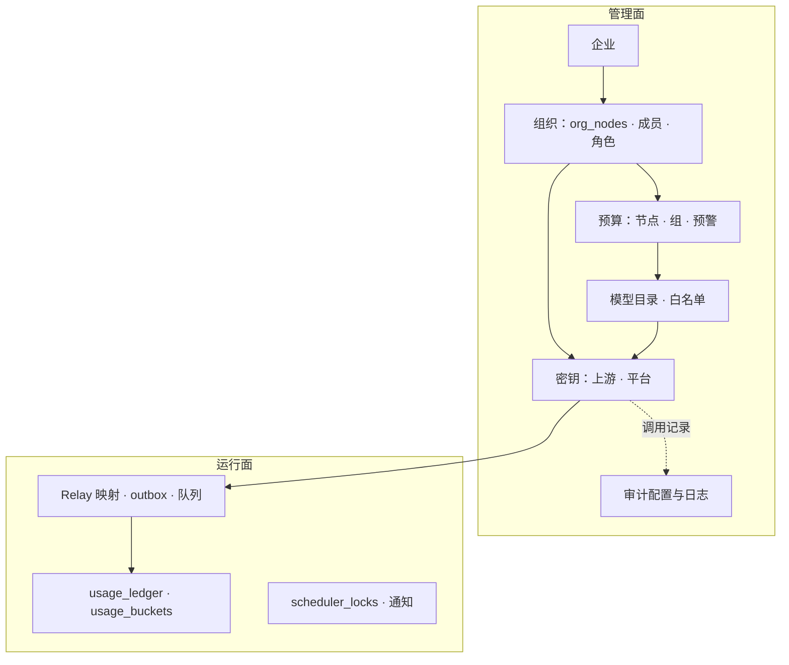
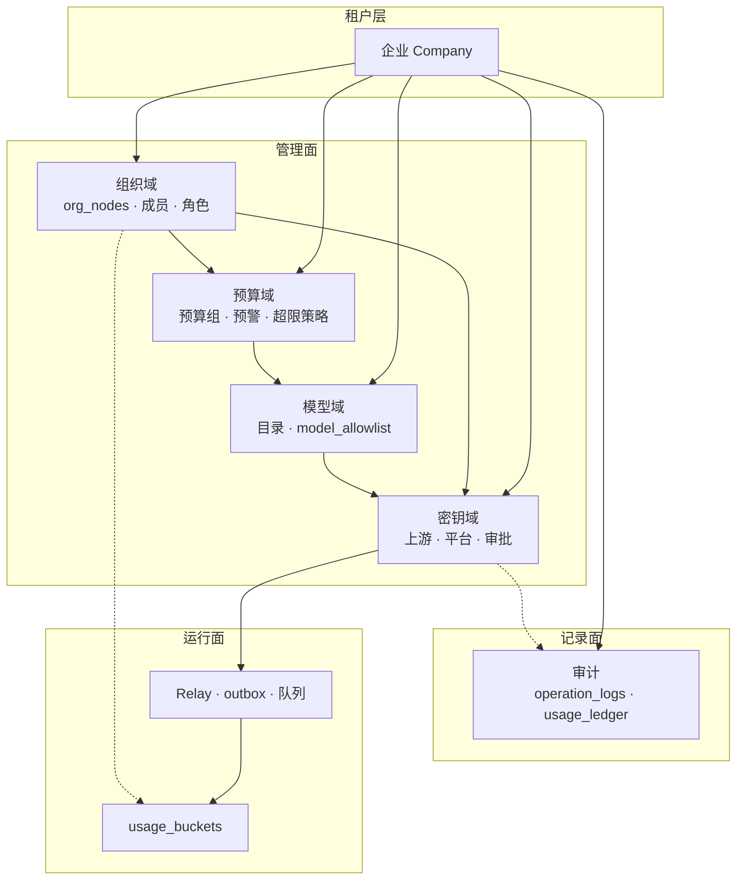
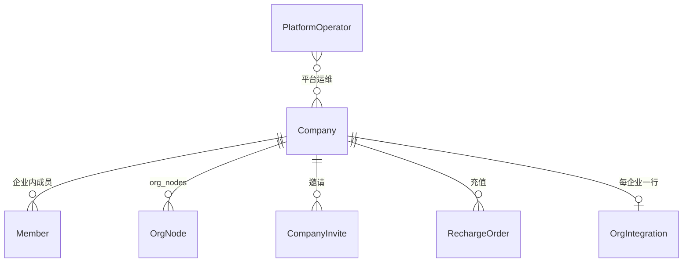
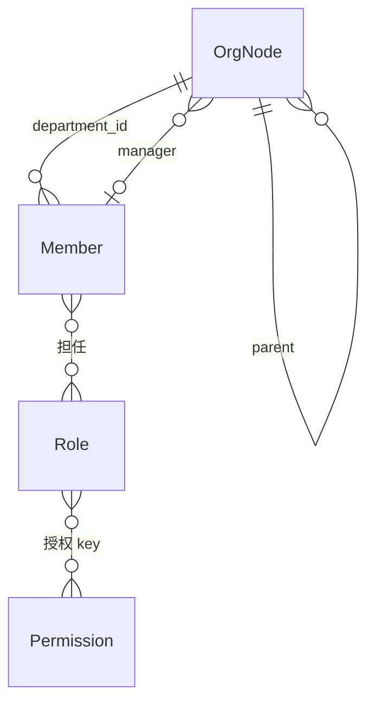
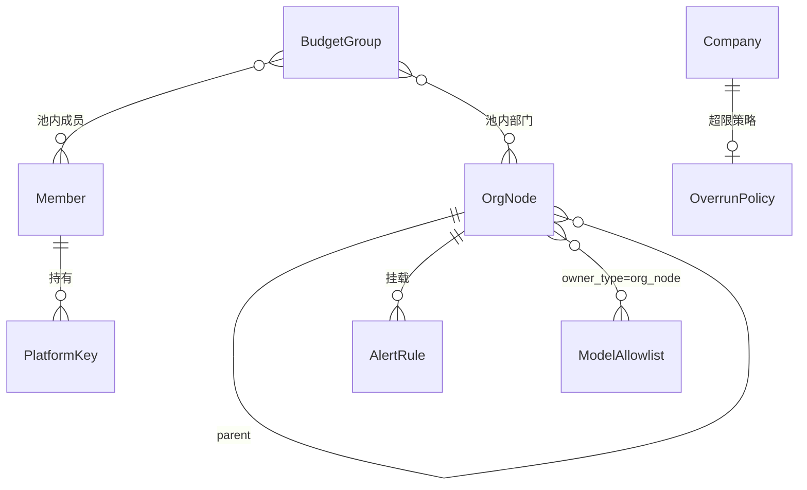
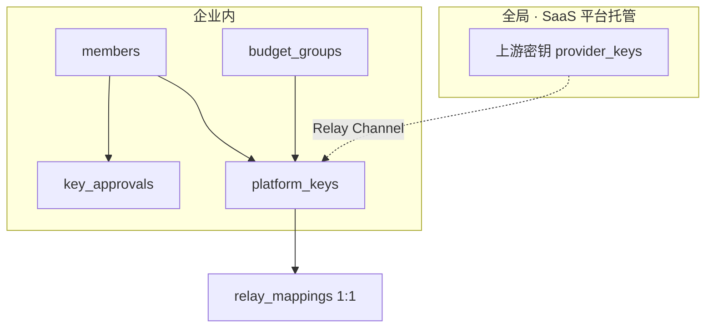
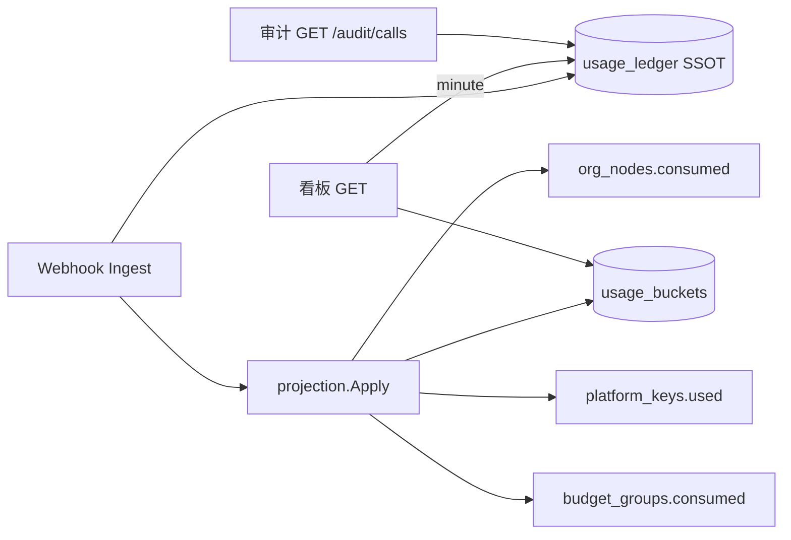
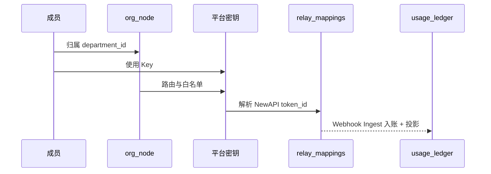

# Backend 存储

Postgres **36** 张表：管理面 / 运行面划分、域级 ER、四张合并表、关键 ID 约定。

**权威 DDL：** `apps/backend/internal/store/postgres/schema.sql`（`go:embed`；启动全量 apply）。

**相关：** [Backend.md](./Backend.md) · [Backend-架构.md](./Backend-架构.md) · [Backend-预算.md](./Backend-预算.md)

---

## 1. 总览

| 项       | 说明                                                                       |
| -------- | -------------------------------------------------------------------------- |
| 表数量   | **36**                                                                     |
| 租户隔离 | 绝大多数表含 `company_id`；平台全局：`provider_keys`、`platform_operators` |
| 种子     | `internal/store/seed/`；demo 用量 `ApplyUsageBuckets`                      |
| 改表流程 | 只改 `schema.sql` → 本地 `docker compose down -v` 重建                     |

---

## 2. 管理面 vs 运行面

| 层次       | 存什么                                     | 读写特点             |
| ---------- | ------------------------------------------ | -------------------- |
| **管理面** | 企业、组织、预算、密钥、模型目录、审计配置 | 控制台改；变更频率低 |
| **运行面** | 用量汇总、Relay 映射、异步队列、分布式锁   | 程序自动写；追加型多 |

管理面决定「谁、在哪个部门、有多少额度、能用哪些模型」；运行面记录「实际调用了多少、Relay 同步到哪一步」。

---

## 3. 域级总图

**读法：**

1. **企业**是顶层租户盒子。
2. **组织节点**（`org_nodes`）同时承载部门、预算、路由；HTTP 仍分 `Department` / `BudgetNode` / `RoutingRule` 投影。
3. **平台密钥**连组织、预算组、模型白名单，再经 **Relay** 连 NewAPI。
4. **`usage_ledger`** 是消耗 SSOT；**`usage_buckets`** 是看板投影。
5. **上游密钥** SaaS 下由平台全局托管（`provider_keys` 无 `company_id`）。

---

## 4. 租户与组织

| 要点     | 说明                                                                          |
| -------- | ----------------------------------------------------------------------------- |
| 成员归属 | 只属于一个组织节点；`members.department_id` 语义为 `org_node_id`              |
| 组织同步 | `org_integration`（配置）+ `org_sync_logs` / `org_import_failures`（追加）    |
| 企业钱包 | `companies.newapi_wallet_user_id`；余额在 NewAPI `users.quota`，不在 Postgres |
| 邀请     | `company_invites`；激活后成员绑定 `company_id`                                |

---

## 5. 预算、密钥与模型

### 5.1 组织节点 vs 预算组

| 对比     | 组织节点（`org_nodes`）        | 预算组（`budget_groups`） |
| -------- | ------------------------------ | ------------------------- |
| 结构     | 树形，跟组织架构走             | 扁平池                    |
| 用途     | 逐级分配组织预算               | 多人/多部门共用额度       |
| 与密钥   | 间接（经部门归因）             | Key 可直接挂组计费        |
| 消耗字段 | `org_nodes.consumed`（rollup） | `budget_groups.consumed`  |

### 5.2 密钥与 Relay

- 路由列在 `org_nodes`（`default_model`、`fallback_model`、`routing_inherited`）。
- 白名单在 **`model_allowlist`**；`RoutingRule.id` = `nodeId`。
- `relay_mappings`：`platform_key_id` ↔ NewAPI `token_id`；含 `company_id`（SaaS）。

---

## 6. 审计与用量

| 数据                | 用途                        | 写入方                | 读方                           |
| ------------------- | --------------------------- | --------------------- | ------------------------------ |
| `usage_ledger`      | 事实账本、对账、minute 趋势 | `usage.IngestService` | 审计、minute 看板              |
| `usage_buckets`     | hour/day 聚合               | Ingest 投影           | 看板 cost/consumed             |
| `consumed` / `used` | 超限、Rebalance             | Ingest 投影           | Overrun、Rebalance、预算树展示 |

入账细节见 [Backend-预算.md](./Backend-预算.md) §2。

---

## 7. 四张合并表

将多个产品概念收敛到单行/单表，减少 JOIN 与事务跨度。

### 7.1 `org_nodes` — 部门 + 预算 + 路由

| 列组 | 字段                                                               | 说明                       |
| ---- | ------------------------------------------------------------------ | -------------------------- |
| 树   | `id`, `parent_id`, `name`, `member_count`, `external_id`, `source` | 邻接表；读出组装嵌套树     |
| 预算 | `budget`, `consumed`, `reserved_pool`, `period`                    | 与 PRD US-07 对齐          |
| 路由 | `default_model`, `fallback_model`, `routing_inherited`             | 白名单在 `model_allowlist` |

**Repository 分工：**

| 操作                          | 入口                        |
| ----------------------------- | --------------------------- |
| 树 CRUD / `RollupConsumed`    | `Org().Nodes()`             |
| 改 `budget` / `reserved_pool` | `budget.Service.UpdateNode` |
| 改路由列                      | `models.Service`            |
| 白名单                        | `Models().Allowlist()`      |

### 7.2 `model_allowlist` — Key / 节点 / 审批模型

| 列           | 说明                                           |
| ------------ | ---------------------------------------------- |
| `owner_type` | `platform_key` \| `org_node` \| `key_approval` |
| `owner_id`   | 对应实体 ID                                    |
| `model_name` | 与 `models.name` 匹配，**非 FK**               |

### 7.3 `org_integration` — 数据源 + 同步 + 凭证

- 每企业 **PRIMARY KEY (`company_id`)** 一行。
- 同步日志仍追加在 `org_sync_logs`；失败行在 `org_import_failures`。

### 7.4 `outbox` — Relay + Webhook 重试

| 列        | 说明                           |
| --------- | ------------------------------ |
| `channel` | `relay` \| `webhook`           |
| `payload` | JSONB；含 `company_id`（SaaS） |

与 `rebalance_queue` / `overrun_queue` 分离；Worker `runner.go` 按 channel 消费。

---

## 8. 各域表清单

| 域     | 表                                                                                                                                                     |
| ------ | ------------------------------------------------------------------------------------------------------------------------------------------------------ |
| 租户   | `companies`, `company_invites`, `company_recharge_orders`, `platform_operators`                                                                        |
| 组织   | `org_nodes`, `members`, `roles`, `permissions`, `role_permission_grants`, `member_roles`, `org_integration`, `org_sync_logs`, `org_import_failures`    |
| 预算   | `org_nodes`（预算列）, `budget_groups`, `budget_group_members`, `budget_group_departments`, `overrun_policy`, `alert_rules`, `alert_rule_notify_roles` |
| 密钥   | `provider_keys`, `platform_keys`, `key_approvals`, `relay_mappings`                                                                                    |
| 模型   | `models`, `model_capabilities`, `model_allowlist`                                                                                                      |
| 审计   | `audit_settings`, `operation_logs`, `usage_ledger`                                                                                                     |
| 运行面 | `usage_buckets`, `outbox`, `rebalance_queue`, `overrun_queue`, `scheduler_locks`, `ingest_failures`, `reconcile_cursors` |

---

## 9. 一次 API 调用涉及的实体

---

## 10. 关键 ID 与命名

| 产品概念 | 代码 / 表                                      |
| -------- | ---------------------------------------------- |
| 企业     | `companies` / `company_id`                     |
| 成员     | `members`（**非** NewAPI user）                |
| 组织节点 | `org_nodes`；HTTP `departmentId`               |
| 企业钱包 | `newapi_wallet_user_id` → NewAPI `users.quota` |
| 平台 Key | `platform_keys` → `relay_mappings`             |
| 消耗账本 | `usage_ledger`（SSOT）                         |
| 用量桶   | `usage_buckets`（看板）                        |

| 易混 ID          | 说明                                                  |
| ---------------- | ----------------------------------------------------- |
| `departmentId`   | = `org_nodes.id`；列名 `members.department_id` 同语义 |
| `RoutingRule.id` | = `nodeId`                                            |
| `deptId`         | dashboard 钻取专用 query/path                         |
| 幂等键           | `newapi:{log_id}`                                     |

HTTP `Member` JSON **不暴露** `personalQuota`；经 `MemberBudgetQuota` API 返回。

| Cookie                      | 面                           |
| --------------------------- | ---------------------------- |
| `tokenjoy_session_member`   | 企业面 Session JWT（目标态） |
| `tokenjoy_platform_session` | 平台面 Session JWT（目标态） |

---

## 11. 运行面实体速查

| 表                   | 职责                                                               |
| -------------------- | ------------------------------------------------------------------ |
| `relay_mappings`     | `platform_key_id` ↔ NewAPI token；SaaS 含 `company_id`             |
| `ingest_failures`    | 入账失败重试队列                                                   |
| `reconcile_cursors`  | 全局 logs 库 reconcile 水位                                        |
| `rebalance_queue`    | `(company_id, axis_kind, axis_id)` 去重                            |
| `overrun_queue`      | 超限评估任务                                                       |
| `scheduler_locks`    | Worker 单实例锁                                                    |
| `usage_buckets`      | `(company_id, bucket_start, department_id, member_id, model_name)` |

---

## 12. 常见问题

| 问题                     | 答案                                          |
| ------------------------ | --------------------------------------------- |
| 部门预算和成员额度在哪？ | `org_nodes.budget`；`members.personal_quota`  |
| 路由规则存在哪？         | `org_nodes` 路由列 + `model_allowlist`        |
| 调用记录 SSOT？          | `usage_ledger`；看板趋势读 `usage_buckets`    |
| 企业钱包余额？           | NewAPI；Postgres 只存 `newapi_wallet_user_id` |
| 改表后本地怎么刷？       | `docker compose down -v` 后 `pnpm start`      |
