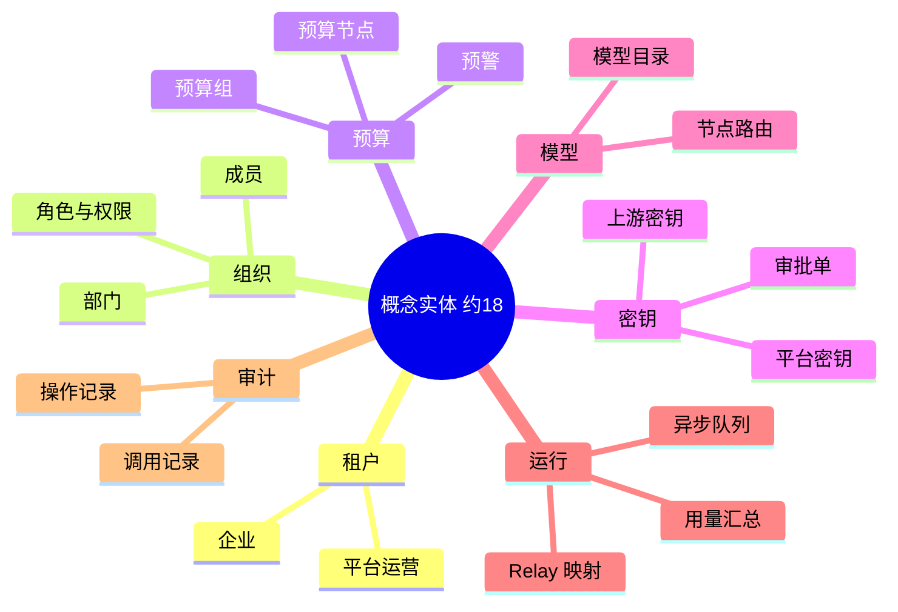
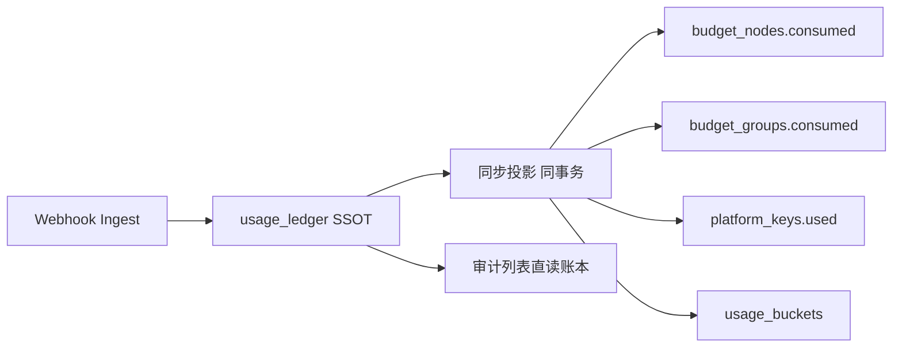
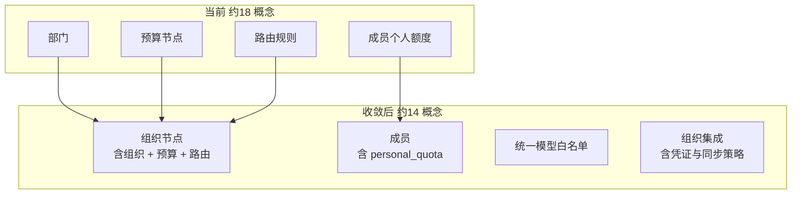
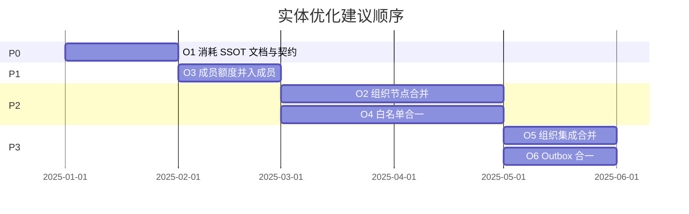

# Backend 存储实体优化方案

本文从**实体 / 数据模型**角度，说明 TokenJoy 后端 Postgres 里哪些结构值得优化、为什么值得优化、目标形态是什么、改动风险如何排序。

**范围：** 概念实体与物理表设计；不涉及 HTTP 接口、Repository 实现细节。

**相关文档：**

- 现状全貌：[Backend-存储架构.md](./Backend-存储架构.md)
- 分层与 Store：[Backend-设计.md](./Backend-设计.md)
- 命名规范：[Backend-命名规范.md](./Backend-命名规范.md)

---

## 1. 现状总览

### 1.1 规模

| 指标                 | 数量           | 说明                                                    |
| -------------------- | -------------- | ------------------------------------------------------- |
| 物理表               | **44**         | `schema.sql` 中 `CREATE TABLE` 计数                     |
| 概念实体（产品语言） | **约 18**      | 人脑需要记住的业务对象                                  |
| 差额                 | **约 26 张表** | 多对多关联、单行配置、日志、队列、Outbox 等存储形态拆分 |

44 张表**不等于**领域模型混乱；多数是工程上的合理拆分。真正需要关注的是：**同 ID 多表联动**、**同一业务事件多处写消耗**、**结构相同却重复建表** 这三类问题。

### 1.2 当前概念实体地图



### 1.3 树变更的唯一入口（现状）

组织树增删改时，代码必须在**同一事务**内联动三张主表：

| 步骤 | 表                                      | 代码入口                   |
| ---- | --------------------------------------- | -------------------------- |
| 1    | `departments`                           | `Org().SetDepartments`     |
| 2    | `budget_nodes`                          | `Budget().SetTree`         |
| 3    | `routing_rules` + `routing_rule_models` | `Models().SetRoutingRules` |

典型调用链：`internal/domain/org/department.go` → `ProvisionDepartment` / `RenameDepartment` / `DeprovisionDepartment`（`internal/domain/org/provision.go`）。

路由规则与节点是 **1:1** 关系：新建部门时自动创建 `rr-{nodeId}` 规则（见 `provision.go` 中 `fmt.Sprintf("rr-%s", input.ID)`）。

---

## 2. 优化项总表

| ID  | 优化项                            | 优先级 | 建议                           | 预期少表    |
| --- | --------------------------------- | ------ | ------------------------------ | ----------- |
| O1  | 消耗数据 SSOT 对齐                | **P0** | 先统一语义与写入策略，可不改表 | 0           |
| O2  | 部门 + 预算节点 + 路由 → 组织节点 | **P2** | 中长期，收益最大               | 2～3        |
| O3  | 成员个人额度并入成员              | **P1** | 低风险，可早做                 | 1           |
| O4  | 三处模型白名单合一                | **P2** | 与 O2 同批做最划算             | 2           |
| O5  | 组织集成配置合并                  | **P3** | 控制台心智统一                 | 2（配置类） |
| O6  | Relay / Webhook Outbox 合一       | **P3** | 基础设施向                     | 1           |
| —   | 用量桶与调用日志合并              | 不做   | 性能或产品倒退                 | —           |
| —   | 平台密钥与 Relay 映射合并         | 不做   | 热路径与 CRUD 耦合             | —           |
| —   | 砍掉预算组                        | 不做   | 产品能力丢失                   | 3           |

若采纳 O2 + O3 + O4 + O5（配置部分）+ O6，物理表大约可从 **44 → 35～38**；概念实体从 **约 18 → 约 14**。

---

## 3. O1：消耗数据的单一事实来源（SSOT）

### 3.1 现状

一次 API 调用经 Webhook Ingest 入账时，`applyIngestTx`（`internal/domain/budget/ingest_apply.go`）会在**同一次事务**里更新多处「已消耗」：

| #   | 存储位置    | 字段 / 表                                     | 写入方式                                       |
| --- | ----------- | --------------------------------------------- | ---------------------------------------------- |
| 1   | 平台密钥    | `platform_keys.used`                          | `Used += costCNY`                              |
| 2   | 预算树      | `budget_nodes.consumed`                       | `rollupDepartmentConsumed` 沿部门祖先累加      |
| 3   | 预算组      | `budget_groups.consumed`                      | 若 Key 挂组则 `Consumed += costCNY`            |
| 4   | 用量桶      | `usage_buckets`                               | `UpsertBucket` 按小时 × 部门 × 成员 × 模型聚合 |
| 5   | Relay 侧    | `relay_mappings.newapi_token_remain_quota`    | Rebalance 流程与 NewAPI 同步（间接）           |
| 6   | NewAPI 外部 | 企业钱包 `users.quota` / Token `remain_quota` | 不在 Postgres                                  |

此外，`call_logs` 由**独立审计链路**写入，记录逐条调用明细。

[Backend-存储架构.md](./Backend-存储架构.md) 中写有「Ingest **只写用量桶**，不会回写预算 `consumed`」——与**当前代码不一致**。文档需要修正；实体设计更需要明确「谁是权威」。

### 3.2 为什么要优化

| 问题          | 后果                                                                                |
| ------------- | ----------------------------------------------------------------------------------- |
| 多处独立 `+=` | 任一路径漏写、重复写或回滚不完整，看板 / 预算树 / Key 配额数字对不上                |
| 语义重叠      | `budget_nodes.consumed` 与 `usage_buckets` 都表达「花了多少」，但粒度、更新时机不同 |
| 对账成本高    | 运维、客服、财务问「为什么两个数不一样」时，需要查 4～5 个存储                      |
| 扩展难        | 若加退款、调账、离线补账，每处都要改                                                |

这不是「表太多」，而是**缺少写入契约**。

### 3.3 目标形态

**已决策：** 见 **[Backend-消耗数据SSOT对齐方案.md](./Backend-消耗数据SSOT对齐方案.md)** — 账本 SSOT + 全同步投影；审计直读账本；仅存 `previewSnippet`（§3.4）。



### 3.4 代价与建议

| 项 | 说明 |
| -- | ---- |
| 实现代价 | 中；账本 + 同步投影 + Ingest 重构 |
| 切换代价 | 破坏性替换；删除 `ingested_log_ids`、`call_logs` |
| **建议** | 按 SSOT 方案一次性切换；异步投影留作规模触发的后续扩展 |

---

## 4. O2：部门 + 预算节点 + 路由 → 组织节点（`org_nodes`）

### 4.1 现状

三张表共享**同一套节点 ID**（非外键，而是刻意同 ID）：

| 表                    | 主要字段                                                                   | 领域含义       |
| --------------------- | -------------------------------------------------------------------------- | -------------- |
| `departments`         | `name`, `parent_id`, `manager_id`, `external_id`, `source`, `member_count` | 组织架构       |
| `budget_nodes`        | `name`, `parent_id`, `budget`, `consumed`, `reserved_pool`, `period`       | 预算树         |
| `routing_rules`       | `node_id`, `node_name`, `default_model`, `fallback_model`, `inherited`     | 节点路由       |
| `routing_rule_models` | `rule_id`, `model_name`                                                    | 路由模型白名单 |

关系特点：

- 部门 ID = 预算节点 ID = 路由 `node_id`；
- 每个节点恰好一条路由（`rr-{id}`）；
- 增删改部门时，`provision.go` 必须同时改预算树和路由列表。

控制台展示为「组织树」「预算树」两棵 UI 树，底层却是**三份持久化状态**。

### 4.2 为什么要优化

| 痛点            | 说明                                                                                      |
| --------------- | ----------------------------------------------------------------------------------------- |
| **同步 bug 类** | 任一入口漏调 `SetTree` 或 `SetRoutingRules`，会出现「有部门无预算」「有预算无路由」       |
| **事务范围大**  | 每次树变更读写的行数 ×3，全量 upsert + prune（见 `budget_tree.go`、`org_departments.go`） |
| **概念分裂**    | 新人理解成本高；API、文档、UI 各说各的「部门」「节点」「预算节点」                        |
| **冗余列**      | `budget_nodes.name` 与 `departments.name`、`routing_rules.node_name` 三处存同名           |

代码已用 `ProvisionState` 把三者绑成一个内存对象——说明**领域上就是一个实体**，只是库里拆成了三张表。

### 4.3 目标形态

合并为 **`org_nodes`**（名称可讨论，下文用此名）：

```sql
-- 示意，非最终 migration
CREATE TABLE org_nodes (
    id              TEXT NOT NULL,
    company_id      BIGINT NOT NULL REFERENCES companies (id),
    parent_id       TEXT,
    sort_order      INT NOT NULL DEFAULT 0,
    -- org
    name            TEXT NOT NULL,
    manager_id      TEXT,
    external_id     TEXT,
    source          TEXT,
    member_count    INT NOT NULL DEFAULT 0,
    -- budget
    budget          NUMERIC(18, 6) NOT NULL DEFAULT 0,
    consumed        NUMERIC(18, 6) NOT NULL DEFAULT 0,
    reserved_pool   NUMERIC(18, 6),
    period          TEXT NOT NULL,
    -- routing
    default_model   TEXT,
    fallback_model  TEXT,
    routing_inherited BOOLEAN NOT NULL DEFAULT FALSE,
    created_at      TIMESTAMPTZ NOT NULL DEFAULT NOW(),
    updated_at      TIMESTAMPTZ NOT NULL DEFAULT NOW(),
    PRIMARY KEY (company_id, id)
);
```

模型白名单可：

- **方案 1**：继续独立 `org_node_models (company_id, node_id, model_name)`，替代 `routing_rule_models`；
- **方案 2**：`allowed_models TEXT[]`（简单但查询/索引弱于关联表）。

`routing_rules.id`（如 `rr-dept-2`）可废弃，以 `node_id` 为主键语义。

### 4.4 影响面

| 层       | 需改动                                                                                                |
| -------- | ----------------------------------------------------------------------------------------------------- |
| Schema   | 删 `departments`、`budget_nodes`、`routing_rules`、`routing_rule_models`；增 `org_nodes` (+ 白名单表) |
| Store    | `OrgRepository`、`BudgetRepository`、`ModelsRepository` 中树相关读写合并                              |
| Domain   | `provision.go` 简化为只操作一种节点；`budget` 包中树操作迁入 org 或共享 pkg                           |
| API      | 对外可保持「组织 API」「预算 API」两个面，底层读同一张表的不同列组                                    |
| 组织同步 | 飞书导入只写 org 列组时不必碰 budget 列（仍同行，但可 NULL 默认）                                     |

### 4.5 收益与代价

| 收益                                   | 代价                                   |
| -------------------------------------- | -------------------------------------- |
| 树变更从三写变一写，消灭整类一致性 bug | 单行变宽；备份/行级锁粒度变粗          |
| 概念层「组织节点」与代码一致           | 大范围 refactor，牵涉所有树变更路径    |
| 可删掉 `node_name` 等冗余              | 纯预算 / 纯组织 API 的边界要重新文档化 |

### 4.6 建议

| 项       | 内容                                                                                                       |
| -------- | ---------------------------------------------------------------------------------------------------------- |
| 优先级   | **P2**（高价值，但改动面大）                                                                               |
| 前置     | 完成 **O1**；在设计与评审中已统一「组织节点」叙事（[Backend-存储架构.md](./Backend-存储架构.md) §12.6 P0） |
| 触发条件 | 双树 / 三表联动 bug 或改造工单明显增多时再动刀                                                             |

---

## 5. O3：成员个人额度并入成员表（已完成）

### 5.1 原状（已废弃）

| 表                       | 关系           | 字段                                 |
| ------------------------ | -------------- | ------------------------------------ |
| `members`                | 成员主表       | `id`, `name`, `department_id`, …     |
| ~~`member_quota_pools`~~ | ~~与成员 1:1~~ | ~~`member_id` PK, `personal_quota`~~ |

曾需二次查询或 `Snapshot.MemberQuotaPools` 单独携带。

### 5.2 为什么要优化

| 原因           | 说明                                            |
| -------------- | ----------------------------------------------- |
| 无独立生命周期 | 额度不是可单独创建/删除的业务对象，只是成员属性 |
| 纯存储开销     | 多一张表、一套 `Set`/`Get`、seed 与测试夹具     |
| 收益明确       | 合并后成员查询一次拿全量                        |

### 5.3 当前形态（已实现）

`members` 列：

```sql
personal_quota NUMERIC(18, 6) NOT NULL DEFAULT 5000
```

- Go：`types.Member.PersonalQuota`（`json:"-"`，HTTP 成员列表不暴露）
- 写额度：`OrgRepository.UpdateMemberPersonalQuota` / `SetMembers`
- 已删除 `member_quota_pools` 表与 `BudgetRepository.MemberQuotaPools`

若未来需要「额度变更历史」，应加 **append-only 日志表**，而不是恢复 1:1 主表。

### 5.4 收益与代价

| 收益                | 代价                             |
| ------------------- | -------------------------------- |
| 少 1 表、少 JOIN    | `members` 略胖（可忽略）         |
| Domain / Store 简化 | 已完成 seed、Budget/Org 读写收敛 |

### 5.5 状态

**已完成（P1）。**

---

## 6. O4：三处模型白名单 → 统一 `model_allowlist`

### 6.1 现状

三张结构相同的关联表：

| 表                    | 归属方     | 主键                                        |
| --------------------- | ---------- | ------------------------------------------- |
| `platform_key_models` | 平台密钥   | `(company_id, platform_key_id, model_name)` |
| `routing_rule_models` | 路由规则   | `(company_id, rule_id, model_name)`         |
| `key_approval_models` | 密钥审批单 | `(company_id, approval_id, model_name)`     |

共同特征：

- 均用 **模型名** 关联，不用 `models.id`（与目录解耦，见 [Backend-存储架构.md](./Backend-存储架构.md) FAQ）；
- 写入模式均为「先 DELETE 再 INSERT 全量列表」；
- 校验逻辑分散在 `internal/pkg/common`（如 `ValidateModelsForMember`）。

### 6.2 为什么要优化

| 原因       | 说明                                                            |
| ---------- | --------------------------------------------------------------- |
| 重复 CRUD  | 三个 repo 各维护一套 prune / upsert                             |
| 规则易漂移 | 改一处校验忘了另两处                                            |
| 与 O2 叠加 | 路由白名单合并进 `org_nodes` 后，`routing_rule_models` 更应消失 |

### 6.3 目标形态

```sql
CREATE TABLE model_allowlist (
    company_id   BIGINT NOT NULL,
    owner_type   TEXT NOT NULL,  -- 'platform_key' | 'org_node' | 'key_approval'
    owner_id     TEXT NOT NULL,
    model_name   TEXT NOT NULL,
    PRIMARY KEY (company_id, owner_type, owner_id, model_name)
);

CREATE INDEX idx_model_allowlist_owner
    ON model_allowlist (company_id, owner_type, owner_id);
```

`owner_type` 用常量枚举，禁止魔法字符串散落。

若已完成 **O2**，路由侧 `owner_type = 'org_node'`，`owner_id = node_id`。

### 6.4 收益与代价

| 收益                        | 代价                                          |
| --------------------------- | --------------------------------------------- |
| 3 表变 1 表                 | 查询必须带 `owner_type`                       |
| 统一校验与展示              | Keys / Models / Approval 三个 domain 包都要改 |
| 无法对 `owner_id` 建统一 FK | 现状亦然（本就用模型名）                      |

### 6.5 建议

**P2**；与 **O2** 同一迭代做，避免 `routing_rule_models` 迁两次。

---

## 7. O5：组织集成配置合并

### 7.1 现状

飞书等组织同步相关数据分散在 5 张表：

| 表                       | 形态       | 内容                         |
| ------------------------ | ---------- | ---------------------------- |
| `org_data_source_status` | 每企业一行 | 连通状态、最近导入统计       |
| `org_sync_config`        | 每企业一行 | 定时同步策略、阈值、通知开关 |
| `datasource_credentials` | 每企业一行 | 加密后的第三方凭证           |
| `org_sync_logs`          | 只追加     | 每次同步结果                 |
| `org_import_failures`    | 只追加     | 导入失败明细                 |

前 3 张都是「配置 / 状态」；后 2 张是「日志」。

### 7.2 为什么要优化

| 原因                                     | 说明                                                    |
| ---------------------------------------- | ------------------------------------------------------- |
| 控制台一个「组织集成」页面对应 3 个 Repo | 心智分裂                                                |
| 凭证与同步策略强相关                     | 分开存没有独立生命周期收益                              |
| `Snapshot` 里三个字段分散                | `DataSourceStatus`、`SyncConfig`、`EncryptedCredential` |

### 7.3 目标形态

**配置与状态合并**（日志保持独立）：

```sql
CREATE TABLE org_integration (
    company_id                   BIGINT PRIMARY KEY REFERENCES companies (id),
    platform                     TEXT,
    connected                    BOOLEAN NOT NULL DEFAULT FALSE,
    last_import                  TIMESTAMPTZ,
    last_import_ok               INT,
    last_import_fail             INT,
    sync_enabled                 BOOLEAN NOT NULL DEFAULT FALSE,
    start_time                   TEXT NOT NULL DEFAULT '',
    frequency_hours              INT NOT NULL DEFAULT 24,
    delete_member_threshold      INT NOT NULL DEFAULT 0,
    delete_department_threshold  INT NOT NULL DEFAULT 0,
    notify_phone                 BOOLEAN NOT NULL DEFAULT FALSE,
    notify_email                 BOOLEAN NOT NULL DEFAULT FALSE,
    notify_im                    BOOLEAN NOT NULL DEFAULT FALSE,
    encrypted_credential         BYTEA,
    updated_at                   TIMESTAMPTZ NOT NULL DEFAULT NOW()
);
```

保留：

- `org_sync_logs`
- `org_import_failures`

### 7.4 收益与代价

| 收益                                             | 代价                                 |
| ------------------------------------------------ | ------------------------------------ |
| 少 2 张配置表；设置页单一实体                    | 单行较宽                             |
| `CredentialRepository` 可与 Org 合并或保留薄封装 | 需处理「仅有凭证未配置同步」的边界态 |

### 7.5 建议

**P3**；不影响核心调用链，适合独立 PR。

---

## 8. O6：Relay Outbox 与 Webhook Outbox 合一

### 8.1 现状

| 表               | 用途                            | 结构                                                                 |
| ---------------- | ------------------------------- | -------------------------------------------------------------------- |
| `relay_outbox`   | NewAPI Token / Channel 异步任务 | `id`, `kind`, `payload` JSONB, `status`, `attempts`, `next_retry`, … |
| `webhook_outbox` | 外发通知失败重试                | 同上，无 `kind`                                                      |

索引均为 `(status, next_retry)`。

### 8.2 为什么要优化

| 原因         | 说明                        |
| ------------ | --------------------------- |
| 结构几乎相同 | Worker 可统一轮询、统一监控 |
| 运维两套队列 | 告警、死信、重试策略重复    |

### 8.3 目标形态

```sql
CREATE TABLE outbox (
    id           TEXT PRIMARY KEY,
    channel      TEXT NOT NULL,  -- 'relay' | 'webhook'
    kind         TEXT,           -- relay 专用，webhook 可 NULL
    payload      JSONB NOT NULL,
    status       TEXT NOT NULL DEFAULT 'pending',
    attempts     INT NOT NULL DEFAULT 0,
    next_retry   TIMESTAMPTZ NOT NULL DEFAULT NOW(),
    last_error   TEXT,
    created_at   TIMESTAMPTZ NOT NULL DEFAULT NOW(),
    updated_at   TIMESTAMPTZ NOT NULL DEFAULT NOW()
);

CREATE INDEX idx_outbox_pending ON outbox (channel, status, next_retry);
```

### 8.4 建议

**P3**；偏基础设施，与产品实体无关，随时可做。

---

## 9. 明确不建议合并的实体

以下拆分**是在减复杂度**，不宜为「少几张表」并回去。

### 9.1 用量桶 vs 审计（O1 后）

|      | `usage_buckets`             | `usage_ledger`               |
| ---- | --------------------------- | ------------------------------ |
| 粒度 | 时间桶 × 部门 × 成员 × 模型 | 逐笔元数据 + 可选 snippet      |
| 读者 | 看板、趋势                  | 审计列表、财务                 |
| 增长 | 有界（桶数）                | 账本线性；snippet ≤ ~200 字/行 |

合并后：看板要么扫全表明细，要么审计与 Ingest 强耦合——**性能与职责双输**（仍不做合并）。

### 9.2 平台密钥 vs Relay 映射

|        | `platform_keys`   | `relay_mappings`                                     |
| ------ | ----------------- | ---------------------------------------------------- |
| 写入方 | 控制台 CRUD、审批 | Worker、Ingest、Relay 同步                           |
| 读取方 | 管理列表          | Relay 预检热路径（按 token / 部门查）                |
| 关系   | 1:0..1            | 冗余 `member_id`, `department_id`, `budget_group_id` |

合并会导致管理面更新与高频 Relay 写**争同一行锁**。

### 9.3 上游密钥 vs 平台密钥

|          | `provider_keys`            | `platform_keys`      |
| -------- | -------------------------- | -------------------- |
| 范围     | SaaS 全局 / 私有化可企业管 | 每企业               |
| 敏感字段 | `secret_key`               | `full_key`           |
| 生命周期 | 轮换、Channel 池           | 成员持有、配额、审批 |

混一张表会使权限模型与轮换策略极难维护。

### 9.4 预算组 vs 组织树节点

预算组（`budget_groups` + 两个关联表）表达**跨部门 / 跨成员的扁平额度池**，且平台密钥可直接 `budget_group_id` 计费。

组织树只能表达层级，无法替代「多部门共池且 Key 直挂池」——除非产品砍掉预算组能力。

### 9.5 密钥 vs 审批单

`key_approvals` 是流程态（pending / approved）；`platform_keys` 是资源态。合并会把状态机塞进资源表。

### 9.6 操作日志 vs 调用日志

前者记**人在控制台的操作**；后者记 **API 调用**。审计问题不同，查询索引也不同。

---

## 10. 次要设计点（可选优化，非必须）

### 10.1 展示用冗余列

| 冗余列                             | 所在表                         | 目的            |
| ---------------------------------- | ------------------------------ | --------------- |
| `department_name`                  | `members`                      | 成员列表少 JOIN |
| `member_name`, `budget_group_name` | `platform_keys`                | 密钥列表展示    |
| `node_name`                        | `alert_rules`, `routing_rules` | 规则列表展示    |

**O2** 完成后 `routing_rules.node_name` 可删；其余可保留（读多写少）或改为 DB 视图。

### 10.2 成员仅属一个部门

`members.department_id` 为单值。矩阵组织（一人多部门）不支持；若产品需要，改动大于 O2，单独立项。

### 10.3 `models` 按企业隔离

`models.company_id` 表明模型目录是**租户级**，非全局共享；与「全局目录」口语略有出入，但多租户下合理。

### 10.4 `ingested_log_ids` 无 `company_id`

主键仅 `log_id BIGINT`。多租户规模下需规划 TTL / 分区 / 归档，属运维演进而非概念冗余。

---

## 11. 目标概念模型（收敛后）

采纳 O2 + O3 + O4 + O5（配置）后的概念层：



**不动：** 预算组、双密钥、用量桶 / 调用日志双轨、Relay 映射、充值订单、角色权限、各类 Outbox 日志（除 O6 合并外）。

---

## 12. 实施路线图



| 阶段 | 动作                                                                                              | 验收标准                           |
| ---- | ------------------------------------------------------------------------------------------------- | ---------------------------------- |
| P0   | 修正 [Backend-存储架构.md](./Backend-存储架构.md) 中 Ingest 与 `consumed` 描述；团队书面约定 SSOT | 文档与 `ingest_apply.go` 一致      |
| P1   | `member_quota_pools` → `members.personal_quota`                                                   | **已完成**                         |
| P2   | 引入 `org_nodes` + `model_allowlist`；下线旧四表                                                  | 树变更单写；集成测试覆盖 provision |
| P3   | `org_integration`、统一 `outbox`                                                                  | 控制台集成页单 Repo                |

**迁移注意：** 项目当前策略为全量 `schema.sql`、**不做增量 migration**（见 [Backend-设计.md](./Backend-设计.md) §4）。实体合并后开发环境需 `docker compose down -v` 重建；若未来要上生产，需另立 migration 策略，不在本文展开。

---

## 13. 与 [Backend-存储架构.md](./Backend-存储架构.md) 的关系

| 文档                         | 职责                                 |
| ---------------------------- | ------------------------------------ |
| Backend-存储架构             | **是什么**：现状实体、关系、读图顺序 |
| Backend-存储实体优化（本文） | **为什么改、改成什么、先改哪**       |

建议：

1. 存储架构 §12 保留精简版「可收敛方向」，详细论证链到本文；
2. 存储架构 §8 / §9 中关于 Ingest 与 `consumed` 的表述按 **O1** 修正；
3. 评审新功能时，用本文 §9「不建议合并」作 checklist，避免回退。

---

## 14. 常见问题

| 问题                                | 答案                                                                           |
| ----------------------------------- | ------------------------------------------------------------------------------ |
| 44 张表算多吗？                     | 概念约 18 个；表多是关联表 / 日志 / 队列拆分，本身合理                         |
| 最先该做什么？                      | **O1** 统一消耗语义；**O3** 若顺手可做                                         |
| 收益最大但最难的是什么？            | **O2** 组织节点三表合一                                                        |
| Ingest 到底写不写 budget consumed？ | **写**（见 `ingest_apply.go`）；与旧版存储架构文档不符，以代码为准直至文档修正 |
| 能不能把表删到 18 张？              | 不建议；会牺牲性能或产品能力                                                   |
| 私有化要单独一套实体吗？            | 否；`company_id=1` 默认企业，表结构一致                                        |
