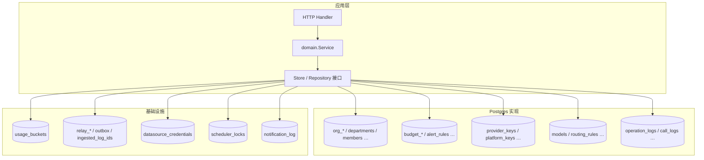
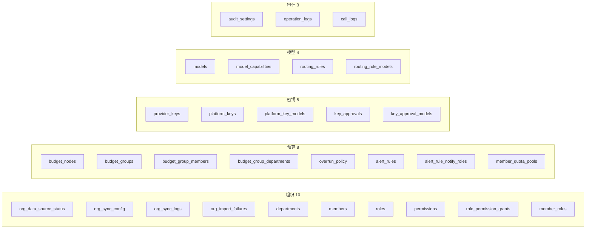
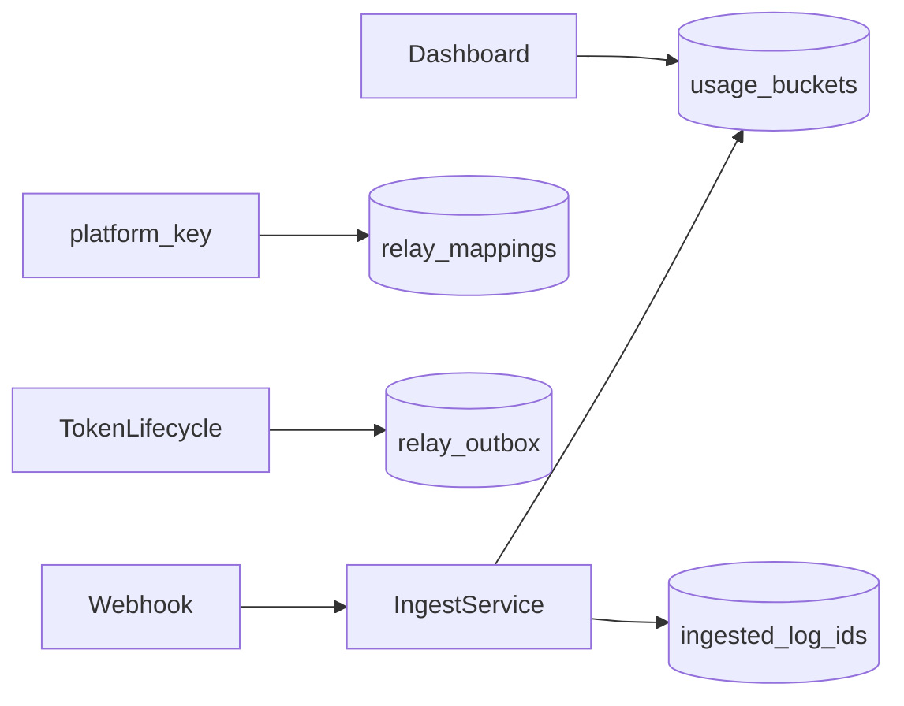
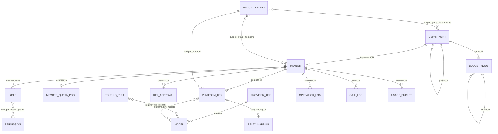
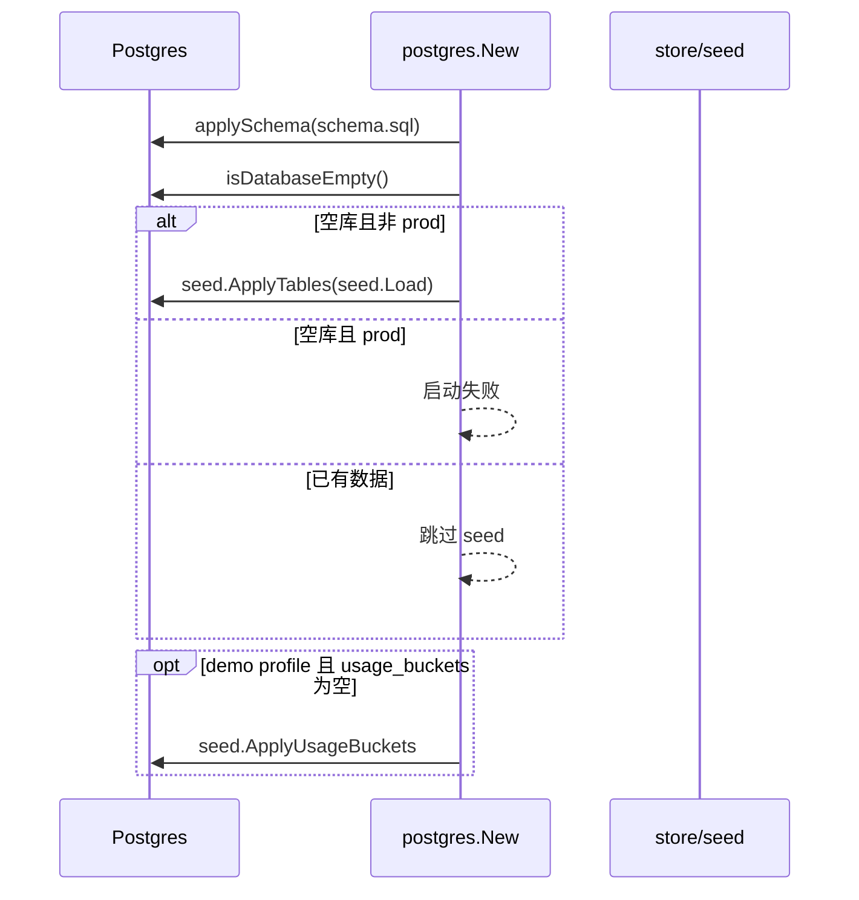

# Backend 存储架构

本文说明 TokenJoy Go 后端 **Postgres 表结构**、Repository 分层、实体关系与运维约定。

**约定：**

- **Schema 变更**：直接改 [`schema.sql`](../apps/backend/internal/store/postgres/schema.sql)（`go:embed`），启动时 `applySchema` 执行；**无版本表、无增量 migration**。改表后须清库重建（`docker compose down -v`）。
- **接口契约**：[`Store` / 各 `Repository` 接口](../apps/backend/internal/store/store.go)、[`domain/types`](../apps/backend/internal/domain/types/)、[Frontend API 契约](./Frontend-API契约.md) 为权威；Postgres 按表 CRUD，读路径组装与 API 同构的嵌套 JSON。
- **基础设施表**：`usage_buckets`、`relay_*`、outbox、凭证、锁、通知等 10 张表独立维护。

相关文档：[Backend-设计.md](./Backend-设计.md) · [Backend-test.md](./Backend-test.md) · [Frontend-API契约.md](./Frontend-API契约.md)

---

## 1. 架构总览



| 层级                               | 说明                                                 |
| ---------------------------------- | ---------------------------------------------------- |
| Handler / domain Service           | HTTP → 业务规则                                      |
| `store.Store` 与各 Repository 接口 | 持久化抽象                                           |
| `memory.Store`                     | 单元/Handler 测试；`store.Snapshot` 为 seed 内存结构 |
| `postgres/*_repos.go`              | 按表 CRUD / JOIN；树形结构邻接表读写                 |
| `schema.sql`                       | 40 张表                                              |

---

## 2. 表清单

共 **30 张管理面表** + **10 张基础设施表** = **40 张**。



---

## 3. 组织域（Org）

### 3.1 表结构

```sql
-- 单行配置
CREATE TABLE org_data_source_status (
    id               INT PRIMARY KEY DEFAULT 1 CHECK (id = 1),
    platform         TEXT,
    connected        BOOLEAN NOT NULL DEFAULT FALSE,
    last_import      TIMESTAMPTZ,
    last_import_ok   INT,
    last_import_fail INT,
    updated_at       TIMESTAMPTZ NOT NULL DEFAULT NOW()
);

CREATE TABLE org_sync_config (
    id                          INT PRIMARY KEY DEFAULT 1 CHECK (id = 1),
    enabled                     BOOLEAN NOT NULL DEFAULT FALSE,
    start_time                  TEXT NOT NULL DEFAULT '',
    frequency_hours             INT NOT NULL DEFAULT 24,
    delete_member_threshold     INT NOT NULL DEFAULT 0,
    delete_department_threshold INT NOT NULL DEFAULT 0,
    notify_phone                BOOLEAN NOT NULL DEFAULT FALSE,
    notify_email                BOOLEAN NOT NULL DEFAULT FALSE,
    notify_im                   BOOLEAN NOT NULL DEFAULT FALSE,
    updated_at                  TIMESTAMPTZ NOT NULL DEFAULT NOW()
);

CREATE TABLE org_sync_logs (
    id         TEXT PRIMARY KEY,
    time       TIMESTAMPTZ NOT NULL,
    type       TEXT NOT NULL,
    result     TEXT NOT NULL,
    detail     TEXT NOT NULL DEFAULT ''
);

CREATE INDEX idx_org_sync_logs_time ON org_sync_logs (time DESC);

CREATE TABLE org_import_failures (
    id          TEXT PRIMARY KEY,
    name        TEXT NOT NULL,
    employee_id TEXT NOT NULL DEFAULT '',
    reason      TEXT NOT NULL
);

-- 邻接表；API 仍返回嵌套 children，由 Repository 组装
CREATE TABLE departments (
    id            TEXT PRIMARY KEY,
    name          TEXT NOT NULL,
    parent_id     TEXT REFERENCES departments (id) ON DELETE SET NULL,
    member_count  INT NOT NULL DEFAULT 0,
    external_id   TEXT,
    source        TEXT,
    manager_id    TEXT,
    sort_order    INT NOT NULL DEFAULT 0,
    created_at    TIMESTAMPTZ NOT NULL DEFAULT NOW(),
    updated_at    TIMESTAMPTZ NOT NULL DEFAULT NOW()
);

CREATE INDEX idx_departments_parent ON departments (parent_id);

CREATE TABLE members (
    id              TEXT PRIMARY KEY,
    name            TEXT NOT NULL,
    phone           TEXT NOT NULL DEFAULT '',
    email           TEXT NOT NULL DEFAULT '',
    department_id   TEXT NOT NULL REFERENCES departments (id),
    department_name TEXT NOT NULL DEFAULT '',
    status          TEXT NOT NULL,
    source          TEXT NOT NULL DEFAULT '',
    external_id     TEXT,
    created_at      TIMESTAMPTZ NOT NULL DEFAULT NOW(),
    updated_at      TIMESTAMPTZ NOT NULL DEFAULT NOW()
);

CREATE INDEX idx_members_department ON members (department_id);
CREATE INDEX idx_members_status ON members (status);

CREATE TABLE roles (
    id           TEXT PRIMARY KEY,
    name         TEXT NOT NULL,
    type         TEXT NOT NULL,
    member_count INT NOT NULL DEFAULT 0
);

CREATE TABLE permissions (
    id    TEXT PRIMARY KEY,
    name  TEXT NOT NULL,
    grp   TEXT NOT NULL
);

CREATE TABLE role_permission_grants (
    role_id        TEXT NOT NULL REFERENCES roles (id) ON DELETE CASCADE,
    permission_ref TEXT NOT NULL,
    PRIMARY KEY (role_id, permission_ref)
);

CREATE TABLE member_roles (
    member_id TEXT NOT NULL REFERENCES members (id) ON DELETE CASCADE,
    role_id   TEXT NOT NULL REFERENCES roles (id) ON DELETE CASCADE,
    PRIMARY KEY (member_id, role_id)
);

CREATE INDEX idx_member_roles_role ON member_roles (role_id);
```

**说明：**

- `departments.manager_id` 引用 `members` 存在循环 FK；建表时先建 `departments`（`manager_id` 无 FK），再建 `members`，最后 `ALTER TABLE` 补 `manager_id` FK，或 seed 分两阶段写入。
- `members.department_name` 为 **反范式冗余**，与当前 API JSON 一致，部门改名时同事务更新。
- `role_permission_grants.permission_ref` 存 `*`、`org:*`、`p-6` 等字符串（与 API `Role.permissions` 一致），**不** FK 到 `permissions` 目录表。

### 3.2 Repository 映射

| `OrgRepository` 方法       | 读写表                                              |
| -------------------------- | --------------------------------------------------- |
| `DataSourceStatus` / `Set` | `org_data_source_status`                            |
| `SyncConfig` / `Set`       | `org_sync_config`                                   |
| `SyncLogs` / `Append`      | `org_sync_logs`                                     |
| `ImportFailures` / `Set`   | `org_import_failures`                               |
| `Departments` / `Set`      | `departments`（读：平铺 → 嵌套树；写：展平 UPSERT） |
| `Members` / `Set`          | `members` + `member_roles`                          |
| `Roles` / `Set`            | `roles` + `role_permission_grants`                  |
| `Permissions`              | `permissions`（seed 灌入，运行时只读）              |

---

## 4. 预算域（Budget）

### 4.1 表结构

```sql
CREATE TABLE budget_nodes (
    id             TEXT PRIMARY KEY,
    name           TEXT NOT NULL,
    parent_id      TEXT REFERENCES budget_nodes (id) ON DELETE SET NULL,
    budget         NUMERIC(18, 6) NOT NULL DEFAULT 0,
    consumed       NUMERIC(18, 6) NOT NULL DEFAULT 0,
    reserved_pool  NUMERIC(18, 6),
    period         TEXT NOT NULL,
    sort_order     INT NOT NULL DEFAULT 0,
    updated_at     TIMESTAMPTZ NOT NULL DEFAULT NOW()
);

CREATE INDEX idx_budget_nodes_parent ON budget_nodes (parent_id);

CREATE TABLE budget_groups (
    id        TEXT PRIMARY KEY,
    name      TEXT NOT NULL,
    budget    NUMERIC(18, 6) NOT NULL DEFAULT 0,
    consumed  NUMERIC(18, 6) NOT NULL DEFAULT 0,
    updated_at TIMESTAMPTZ NOT NULL DEFAULT NOW()
);

CREATE TABLE budget_group_members (
    group_id  TEXT NOT NULL REFERENCES budget_groups (id) ON DELETE CASCADE,
    member_id TEXT NOT NULL REFERENCES members (id) ON DELETE CASCADE,
    PRIMARY KEY (group_id, member_id)
);

CREATE TABLE budget_group_departments (
    group_id      TEXT NOT NULL REFERENCES budget_groups (id) ON DELETE CASCADE,
    department_id TEXT NOT NULL REFERENCES departments (id) ON DELETE CASCADE,
    PRIMARY KEY (group_id, department_id)
);

CREATE TABLE overrun_policy (
    id            INT PRIMARY KEY DEFAULT 1 CHECK (id = 1),
    thresholds    INT[] NOT NULL DEFAULT '{}',
    notify_email  BOOLEAN NOT NULL DEFAULT FALSE,
    notify_phone  BOOLEAN NOT NULL DEFAULT FALSE,
    notify_im     BOOLEAN NOT NULL DEFAULT FALSE,
    block_message TEXT NOT NULL DEFAULT '',
    updated_at    TIMESTAMPTZ NOT NULL DEFAULT NOW()
);

CREATE TABLE alert_rules (
    id        TEXT PRIMARY KEY,
    node_id   TEXT NOT NULL REFERENCES budget_nodes (id) ON DELETE CASCADE,
    node_name TEXT NOT NULL,
    thresholds INT[] NOT NULL DEFAULT '{}',
    enabled   BOOLEAN NOT NULL DEFAULT TRUE,
    updated_at TIMESTAMPTZ NOT NULL DEFAULT NOW()
);

CREATE TABLE alert_rule_notify_roles (
    rule_id TEXT NOT NULL REFERENCES alert_rules (id) ON DELETE CASCADE,
    role_id TEXT NOT NULL REFERENCES roles (id) ON DELETE CASCADE,
    PRIMARY KEY (rule_id, role_id)
);

CREATE TABLE member_quota_pools (
    member_id      TEXT PRIMARY KEY REFERENCES members (id) ON DELETE CASCADE,
    personal_quota NUMERIC(18, 6) NOT NULL DEFAULT 0,
    updated_at     TIMESTAMPTZ NOT NULL DEFAULT NOW()
);
```

### 4.2 Repository 映射

| `BudgetRepository` 方法    | 读写表                                                                |
| -------------------------- | --------------------------------------------------------------------- |
| `Tree` / `SetTree`         | `budget_nodes`（邻接表 ↔ 嵌套 JSON 树）                               |
| `Groups` / `SetGroups`     | `budget_groups` + `budget_group_members` + `budget_group_departments` |
| `OverrunPolicy` / `Set`    | `overrun_policy`                                                      |
| `AlertRules` / `Set`       | `alert_rules` + `alert_rule_notify_roles`                             |
| `MemberQuotaPools` / `Set` | `member_quota_pools`                                                  |

**约束：** 部门 ID 与预算树根节点 ID 一一对应；[`provision.go`](../apps/backend/internal/domain/org/provision.go) 在同一 `WithTx` 内跨 Org + Budget 联动。

---

## 5. 密钥域（Keys）

### 5.1 表结构

```sql
CREATE TABLE provider_keys (
    id               TEXT PRIMARY KEY,
    provider         TEXT NOT NULL,
    name             TEXT NOT NULL,
    key_prefix       TEXT NOT NULL,
    secret_key       TEXT NOT NULL,
    relay_channel_id INT NOT NULL DEFAULT 0,
    status           TEXT NOT NULL,
    balance          NUMERIC(18, 6),
    last_used        TIMESTAMPTZ,
    rotate_enabled   BOOLEAN NOT NULL DEFAULT FALSE,
    created_at       TIMESTAMPTZ NOT NULL DEFAULT NOW(),
    updated_at       TIMESTAMPTZ NOT NULL DEFAULT NOW()
);

CREATE TABLE platform_keys (
    id                TEXT PRIMARY KEY,
    name              TEXT NOT NULL,
    key_prefix        TEXT NOT NULL,
    full_key          TEXT,
    member_id         TEXT REFERENCES members (id) ON DELETE SET NULL,
    member_name       TEXT,
    app_name          TEXT,
    budget_group_id   TEXT REFERENCES budget_groups (id) ON DELETE SET NULL,
    budget_group_name TEXT,
    status            TEXT NOT NULL,
    quota             NUMERIC(18, 6) NOT NULL DEFAULT 0,
    used              NUMERIC(18, 6) NOT NULL DEFAULT 0,
    created_at        TIMESTAMPTZ NOT NULL DEFAULT NOW(),
    expires_at        TIMESTAMPTZ,
    updated_at        TIMESTAMPTZ NOT NULL DEFAULT NOW()
);

CREATE INDEX idx_platform_keys_member ON platform_keys (member_id);
CREATE INDEX idx_platform_keys_budget_group ON platform_keys (budget_group_id);

CREATE TABLE platform_key_models (
    platform_key_id TEXT NOT NULL REFERENCES platform_keys (id) ON DELETE CASCADE,
    model_name      TEXT NOT NULL,
    PRIMARY KEY (platform_key_id, model_name)
);

CREATE TABLE key_approvals (
    id              TEXT PRIMARY KEY,
    type            TEXT NOT NULL,
    applicant       TEXT NOT NULL,
    applicant_id    TEXT NOT NULL REFERENCES members (id),
    department      TEXT NOT NULL,
    reason          TEXT NOT NULL,
    requested_quota NUMERIC(18, 6) NOT NULL DEFAULT 0,
    status          TEXT NOT NULL,
    approver        TEXT,
    reject_reason   TEXT,
    created_at      TIMESTAMPTZ NOT NULL DEFAULT NOW(),
    resolved_at     TIMESTAMPTZ
);

CREATE INDEX idx_key_approvals_status ON key_approvals (status, created_at DESC);

CREATE TABLE key_approval_models (
    approval_id TEXT NOT NULL REFERENCES key_approvals (id) ON DELETE CASCADE,
    model_name  TEXT NOT NULL,
    PRIMARY KEY (approval_id, model_name)
);
```

**说明：** 白名单与审批请求的模型标识使用 **模型名**（如 `gpt-4o`），与 API JSON 一致，非 `models.id`。

### 5.2 Repository 映射

| `KeysRepository` 方法  | 读写表                                  |
| ---------------------- | --------------------------------------- |
| `ProviderKeys` / `Set` | `provider_keys`                         |
| `PlatformKeys` / `Set` | `platform_keys` + `platform_key_models` |
| `Approvals` / `Set`    | `key_approvals` + `key_approval_models` |

**关联：** `relay_mappings` 由 `RelayRepository` 管理，与 `platform_keys` 通过 `platform_key_id` 关联。

---

## 6. 模型域（Models）

### 6.1 表结构

```sql
CREATE TABLE models (
    id           TEXT PRIMARY KEY,
    provider     TEXT NOT NULL,
    name         TEXT NOT NULL,
    display_name TEXT NOT NULL,
    input_price  NUMERIC(18, 8) NOT NULL DEFAULT 0,
    output_price NUMERIC(18, 8) NOT NULL DEFAULT 0,
    max_context  INT NOT NULL DEFAULT 0,
    enabled      BOOLEAN NOT NULL DEFAULT TRUE,
    updated_at   TIMESTAMPTZ NOT NULL DEFAULT NOW()
);

CREATE TABLE model_capabilities (
    model_id   TEXT NOT NULL REFERENCES models (id) ON DELETE CASCADE,
    capability TEXT NOT NULL,
    PRIMARY KEY (model_id, capability)
);

CREATE TABLE routing_rules (
    id             TEXT PRIMARY KEY,
    node_id        TEXT NOT NULL,
    node_name      TEXT NOT NULL,
    default_model  TEXT,
    fallback_model TEXT,
    inherited      BOOLEAN NOT NULL DEFAULT FALSE,
    updated_at     TIMESTAMPTZ NOT NULL DEFAULT NOW()
);

CREATE INDEX idx_routing_rules_node ON routing_rules (node_id);

CREATE TABLE routing_rule_models (
    rule_id    TEXT NOT NULL REFERENCES routing_rules (id) ON DELETE CASCADE,
    model_name TEXT NOT NULL,
    PRIMARY KEY (rule_id, model_name)
);
```

**说明：** `routing_rules.node_id` 指向预算/部门节点，不强制 FK（provision 可能跨域写入顺序复杂），由应用层保证一致性。

### 6.2 Repository 映射

| `ModelsRepository` 方法 | 读写表                                  |
| ----------------------- | --------------------------------------- |
| `Models` / `Set`        | `models` + `model_capabilities`         |
| `RoutingRules` / `Set`  | `routing_rules` + `routing_rule_models` |

---

## 7. 审计域（Audit）

### 7.1 表结构

```sql
CREATE TABLE audit_settings (
    id                        INT PRIMARY KEY DEFAULT 1 CHECK (id = 1),
    content_retention_enabled BOOLEAN NOT NULL DEFAULT FALSE,
    updated_at                TIMESTAMPTZ NOT NULL DEFAULT NOW()
);

CREATE TABLE operation_logs (
    id          TEXT PRIMARY KEY,
    action      TEXT NOT NULL,
    operator    TEXT NOT NULL,
    operator_id TEXT NOT NULL,
    target      TEXT NOT NULL DEFAULT '',
    detail      TEXT NOT NULL DEFAULT '',
    ip          TEXT NOT NULL DEFAULT '',
    created_at  TIMESTAMPTZ NOT NULL
);

CREATE INDEX idx_operation_logs_created ON operation_logs (created_at DESC);
CREATE INDEX idx_operation_logs_operator ON operation_logs (operator_id, created_at DESC);
CREATE INDEX idx_operation_logs_action ON operation_logs (action, created_at DESC);

CREATE TABLE call_logs (
    id             TEXT PRIMARY KEY,
    caller         TEXT NOT NULL,
    caller_id      TEXT NOT NULL,
    caller_type    TEXT NOT NULL,
    model          TEXT NOT NULL,
    provider       TEXT NOT NULL,
    input_tokens   NUMERIC(18, 2) NOT NULL DEFAULT 0,
    output_tokens  NUMERIC(18, 2) NOT NULL DEFAULT 0,
    latency_ms     NUMERIC(18, 2) NOT NULL DEFAULT 0,
    status         TEXT NOT NULL,
    cost           NUMERIC(18, 6) NOT NULL DEFAULT 0,
    input_preview  TEXT NOT NULL DEFAULT '',
    output_preview TEXT NOT NULL DEFAULT '',
    created_at     TIMESTAMPTZ NOT NULL
);

CREATE INDEX idx_call_logs_created ON call_logs (created_at DESC);
CREATE INDEX idx_call_logs_caller ON call_logs (caller_id, created_at DESC);
CREATE INDEX idx_call_logs_model ON call_logs (model, created_at DESC);
```

### 7.2 Repository 映射

| `AuditRepository` 方法 | 读写表                                                                             |
| ---------------------- | ---------------------------------------------------------------------------------- |
| `Settings` / `Set`     | `audit_settings`                                                                   |
| `OperationLogs`        | `operation_logs`（**append-only**；列表查询走索引 + 应用层分页过滤，与现契约一致） |
| `CallLogs`             | `call_logs`（同上）                                                                |

**分工：** 看板聚合读 `usage_buckets`；审计列表读 `call_logs`（展示摘要）。两者数据源不同，不合并。

---

## 8. 基础设施表

以下表定义在 `schema.sql` 中，由对应 Repository 独立读写：

| 表                       | 职责                        |
| ------------------------ | --------------------------- |
| `usage_buckets`          | 看板费用/用量时间桶         |
| `relay_mappings`         | 平台密钥 ↔ NewAPI Token     |
| `relay_outbox`           | Relay 异步任务              |
| `webhook_outbox`         | Webhook 失败重试            |
| `ingested_log_ids`       | ingest 幂等去重             |
| `relay_sync_cursors`     | 补偿轮询游标                |
| `rebalance_queue`        | 预算 rebalance 待办         |
| `datasource_credentials` | 飞书等凭证（AES-GCM BYTEA） |
| `scheduler_locks`        | 定时任务租约                |
| `notification_log`       | 通知发送记录                |



---

## 9. 实体关系



---

## 10. 事务与启动

### 10.1 `WithTx` 边界

| 纳入 PG 事务                              | 不纳入（parent pool） |
| ----------------------------------------- | --------------------- |
| Org / Budget / Keys / Models / Audit 域表 | `Credential()`        |
| Relay / Usage / Notification              | `SchedulerLock()`     |

`txStore` 在同一 `pgx.Tx` 上执行各域 SQL；跨域联动（如 `provision`）在单次 `WithTx` 内完成。

### 10.2 启动 bootstrap



- **空库判定：** `SELECT COUNT(*) FROM members = 0`。
- **Seed 路径：** `seed.Load(cfg)` → `seed.ApplyTables` 写入各管理面表（单事务）。
- **Schema 变更：** 清库重建。

---

## 11. 后续增强（非阻塞）

| 任务                       | 说明                                                  |
| -------------------------- | ----------------------------------------------------- |
| 审计列表 SQL 分页          | `LIMIT/OFFSET` + `WHERE` 下推，替代全表加载后 Go 过滤 |
| `usage_buckets` SQL 预聚合 | 大数据量看板 `GROUP BY` 路径                          |
| `member_invites` 表        | 见 [Backend-待实现.md](./Backend-待实现.md) US-04     |

---

## 12. 测试与 Memory Store

单测与 Handler 测试使用 `memory.Store`（`store.Snapshot` + `sync.RWMutex`），不镜像 40 张表结构。Postgres 集成测试（`-tags=integration`）覆盖真实 SQL 与 `seed.ApplyTables`（见 `tests/store/seed/tables_test.go`、`tests/store/postgres/`）。

---

## 13. 代码包结构

```
internal/store/
├── store.go
├── clone.go
├── relay.go
├── treeutil/          # 预算树 flatten（postgres + seed 共用）
├── timeparse/         # 时间解析（postgres + seed 共用）
├── usagequery/
├── seed/
│   ├── loader.go
│   ├── tables.go
│   └── *.go / data/*.json
├── postgres/
│   ├── schema.sql
│   ├── schema.go
│   ├── postgres.go
│   ├── repos.go           # 域 repo 工厂
│   ├── sqlutil.go         # upsert + prune 辅助
│   ├── org_repo.go
│   ├── org_datasource.go
│   ├── org_sync.go
│   ├── org_departments.go
│   ├── org_members.go
│   ├── org_roles.go
│   ├── budget_repo.go
│   ├── budget_tree.go
│   ├── budget_groups.go
│   ├── budget_alerts.go
│   ├── keys_repo.go
│   ├── keys_provider.go
│   ├── keys_platform.go
│   ├── keys_approvals.go
│   ├── models_repos.go
│   ├── audit_repos.go
│   ├── trees.go
│   ├── timeutil.go
│   ├── tx.go
│   ├── relay.go
│   ├── usage_repo.go
│   ├── notification_repo.go
│   ├── credential_repo.go
│   └── scheduler_lock_repo.go
└── memory/
    ├── store.go
    ├── repos.go              # 域 repo interface 断言
    ├── org_repo.go
    ├── budget_repo.go
    ├── keys_repo.go
    ├── models_repo.go
    ├── audit_repo.go
    ├── credential_repo.go
    ├── scheduler_lock_repo.go
    ├── usage_repo.go
    ├── notification_repo.go
    ├── relay.go
    └── tx.go
```

---

## 14. 小结

| 问题                | 答案                                                    |
| ------------------- | ------------------------------------------------------- |
| 管理面怎么存？      | 30 张关系表 + Repository 按表读写                       |
| 需要 migration 吗？ | **不需要**；改 schema + 清库                            |
| 总共多少张表？      | **40**（30 管理 + 10 基础设施）                         |
| 树形结构？          | 邻接表 `parent_id`；读时组装嵌套 `children`             |
| 测试用什么 Store？  | 单测 `memory.Store`；集成测 Postgres                    |
| 角色权限关联？      | `role_permission_grants(permission_ref)`                |
| 模型白名单？        | `*_models.model_name`（模型名，非 id）                  |
| `WithTx` 边界？     | 域表 + relay/usage/notification 同事务；凭证/锁在事务外 |
