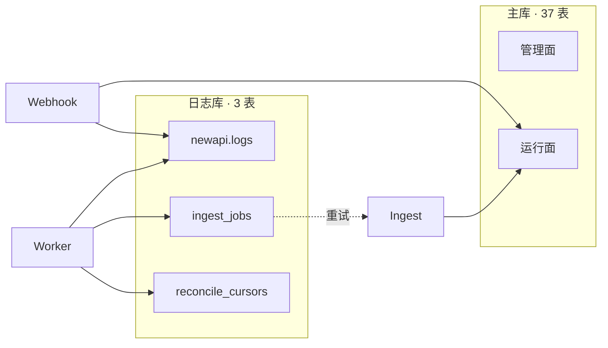
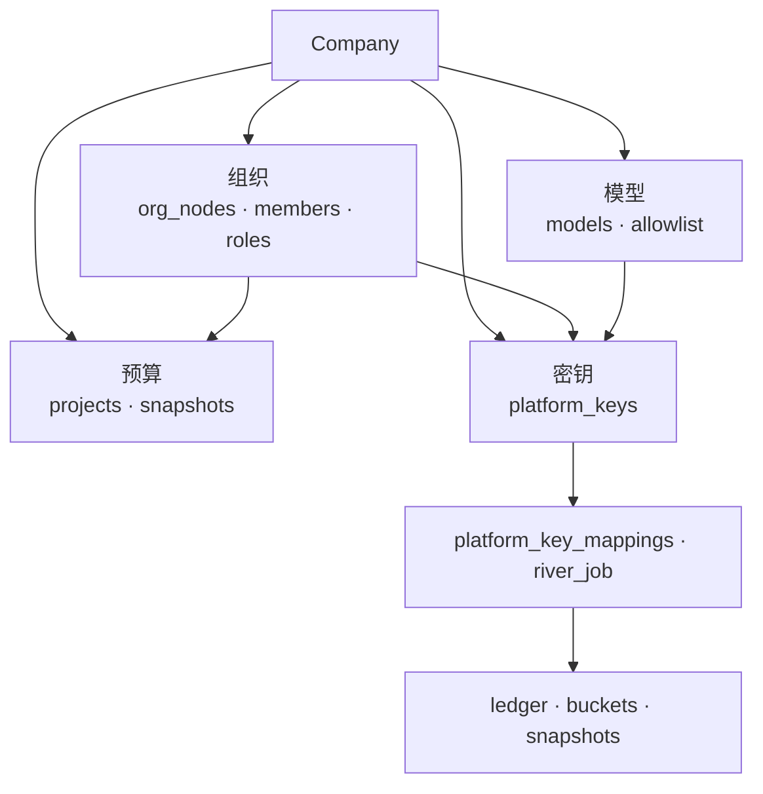
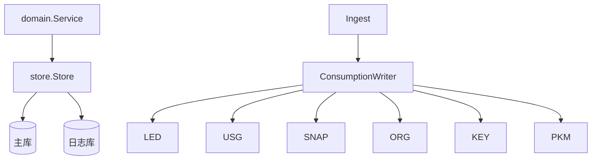
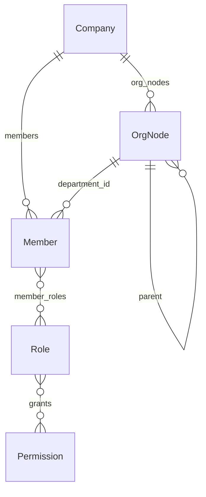
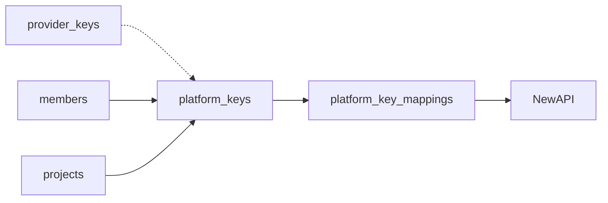
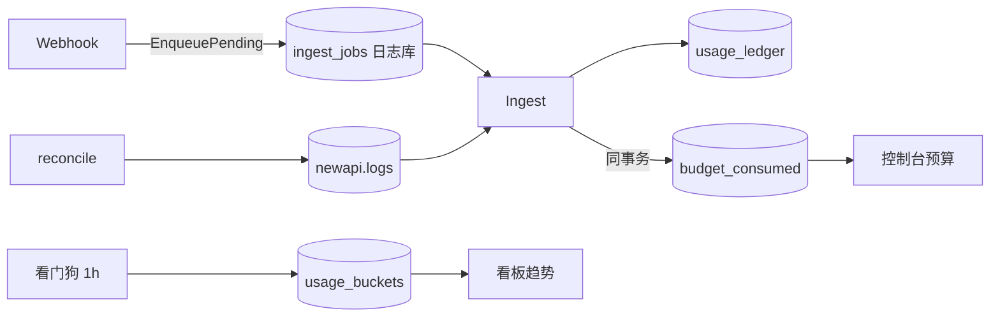
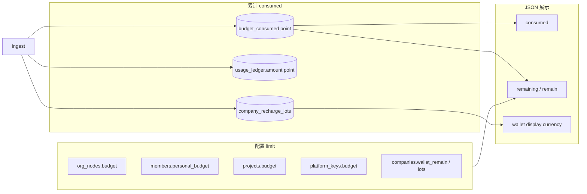

# Backend 存储架构

Postgres 双库：**37** 张主库表 + **3** 张日志库表。`company_id` 租户隔离，管理面配置 + 运行面入账投影。

**本文定位：** 表结构、域关系、Store 映射与 ID 约定。请求链路见 [Backend-架构.md](./Backend-架构.md)；Ingest / Rebalance / Overrun 算法见 [Backend-预算.md](./Backend-预算.md)；计费模式见 [Backend-计费模式.md](./Backend-计费模式.md)。

| 库     | DDL                                               | 连接                       |
| ------ | ------------------------------------------------- | -------------------------- |
| 主库   | `apps/backend/internal/store/postgres/schema.sql` | `DATABASE_URL`             |
| 日志库 | `logs_schema.sql`                                 | `LOG_DATABASE_URL`（可选） |

启动时 `go:embed` 全量 apply，再由 `schema_partitions.go` 创建月分区（2024-01 .. 2032-12）。改表后本地 `docker compose down -v` 重建。

---

## 1. 双库拓扑

| 配置                                          | 行为                       |
| --------------------------------------------- | -------------------------- |
| `LOG_DATABASE_URL` + `NEW_API_WEBHOOK_SECRET` | Ingest 启用                |
| 未配置日志库                                  | `Logs()` 为 `NoopLogStore` |
| `LogSchemaIsolated=true`                      | 测试专用；生产禁止         |

---

## 2. 域级关系

| 概念                        | 落点                                                                 |
| --------------------------- | -------------------------------------------------------------------- |
| 部门 + 节点预算 + 路由      | `org_nodes`（HTTP 投影 `Department` / `BudgetNode` / `RoutingRule`） |
| 平台 Key 归因               | `platform_keys`；`platform_key_mappings` 仅同步状态                         |
| 消耗 SSOT / 看板 / Gateway 软缓存 | `usage_ledger` / `usage_buckets` / `budget_consumed` + `gateway_soft_*` |
| 企业钱包余额                | SSOT：`company_recharge_lots` / `wallet_remain`；NewAPI `users.quota` 为派生通道配额（`newapi_wallet_user_id`） |
| SaaS 上游 Key               | 全局 `provider_keys`（无 `company_id`）                              |

---

## 3. Store 与租户隔离

| 接口                                                  | 主表                                                                      |
| ----------------------------------------------------- | ------------------------------------------------------------------------- |
| `Org()` / `Nodes()`                                   | `org_nodes`, `members`, `roles`, `permissions`, `org_integration`, …      |
| `Budget()`                                            | `projects`, `budget_consumed`, `alert_rules`, `budget_approvals`, … |
| `Keys()`                                              | `provider_keys`, `platform_keys`, `key_approvals`                         |
| `Models()` / `Allowlist()`                            | `models`, `model_capabilities`, `model_allowlist`                         |
| `Ledger()` / `Usage()` / `BudgetConsumed()`           | `usage_ledger`, `usage_buckets`, `budget_consumed`                       |
| `PlatformKeyMappings()`               | `platform_key_mappings`                                                     |
| River `Insert` / `InsertTx`（经 `river.Client`） | `river_job` 等 River 表；见 [Backend-离线任务.md](./Backend-离线任务.md) |
| `Audit()`                                             | `audit_settings`, `operation_logs`                                        |
| `Company()` / `Invite()` / `Billing()` / `Platform()` | 租户与充值                                                                |
| `Notification()` / `SchedulerLock()` / `Logs()`       | `notification_log`, `scheduler_locks`, 日志库三表                         |

`PlatformKeyMappings()` → `PlatformKeyMappingRepository`（NewAPIKey 映射读写）。离线任务入队 / 消费统一经 `river.Client`（`internal/infra/river/`），不再使用 `AsyncJobsRepository`。

**租户：** 复合 PK `(company_id, …)`；全局表 `permissions` · `provider_keys` · `platform_operators` · `scheduler_locks`。

**分区：** `operation_logs` · `usage_ledger` · `usage_buckets` → 月子表 `{table}_YYYY_MM`。

---

## 4. 核心实体

### 组织与 RBAC

`members.department_id` = `org_nodes.id` = HTTP `departmentId`。组织同步：`org_integration` + `org_sync_logs` / `org_import_failures`。

### 组织节点 vs 项目

|          | `org_nodes`          | `projects`          |
| -------- | -------------------- | ------------------------ |
| 结构     | 树形逐级分配         | 扁平共享池               |
| 与 Key   | 经部门归因           | 挂 `project_id`     |
| consumed | `usage_ledger` 部门聚合（报表） | `axis_kind=project` |

### `org_nodes` 列组

| 列组 | 字段                                                         | 读写入口                                        |
| ---- | ------------------------------------------------------------ | ----------------------------------------------- |
| 树   | `id`, `parent_id`, `path`, `name`, `manager_id`              | `Org().Nodes()`                                 |
| 预算 | `budget`, `reserved_pool`, `period`                          | `budget.Service`；consumed → `budget_consumed` |
| 路由 | `default_model_id`, `fallback_model_id`, `routing_inherited` | `models.Service`；白名单 → `model_allowlist`（`model_id`）；管理 API 读写 `modelId[]`，读路径 enrich `ModelRef` |

### 密钥与 NewAPI 映射

`key_hash` 用于 Gateway 鉴权；明文 Key 不落库。`model_allowlist.owner_type`：`platform_key` · `org_node` · `key_approval`。

映射表列：`newapi_key_id` / `newapi_key_remain_quota` / `newapi_group`；`provider_keys.newapi_channel_id`。outbox kind：`create_key` / `update_key` / `rebalance_key`（River kind `newapi_sync`）。

### `river_job`（离线任务）

业务见 [Backend-离线任务.md](./Backend-离线任务.md)；Schema / Unique 见 `internal/infra/jobs/args.go`。

| kind（`JobArgs.Kind()`） | Worker | 队列 |
| --- | --- | --- |
| `newapi_sync` | `NewAPISyncWorker` | `critical` |
| `rebalance` | `RebalanceWorker` | `default`（`UniqueOpts ByArgs` per axis） |
| `overrun` | `OverrunWorker` | `default`（`ByArgs` per company） |
| `wallet_sync` | `WalletSyncWorker` | `default`（`InsertTx`；Unique **5s**） |
| `org_sync` | `OrgSyncWorker` | `default`（Periodic 单 job → `SyncService.RunScheduledSyncAll`） |
| `budget_reconcile` | `BudgetReconcileWorker` | `low`（看门狗检测 staleWindow 后入队） |
| `dashboard_project` / `dashboard_reconcile` | Dashboard Workers | `low`（看门狗每小时检测 lag 后入队） |

配套表：`river_leader`（Periodic leader）、`river_queue`；**保留** `scheduler_locks`（仅 Ingest reconcile）。

---

## 5. 用量与入账

Ingest 同事务写 ledger + lot + `budget_consumed` + `combined_key_remain`；看板 `usage_buckets` 由 `dashboard.Projector` 异步维护（看门狗每小时触发）。见 [Backend-离线任务.md](./Backend-离线任务.md)、[Backend-预算.md](./Backend-预算.md)。

| 表 | 角色 |
| --- | --- |
| `usage_ledger` | 消耗 SSOT |
| `usage_buckets` | 看板 hour/day（Dashboard Projector 写，看门狗触发） |
| `budget_consumed` | 三轴 consumed（Ingest 同事务 `ApplyIncrement`；部门报表改 ledger 聚合） |
| `river_job` | 离线执行意图 |
| `ingest_jobs` | 入账失败重试（**日志库**） |

入账与投影见 [Backend-预算.md](./Backend-预算.md) §7。

---

## 6. 表清单

### 主库

主库约 37 张表；预算 consumed 在 `budget_consumed`；Dashboard 投影游标在 `dashboard_projection_progress`；离线队列为 River 表（`river_job` 等）。

| 域     | 表                                                                                                                                                                      |
| ------ | ----------------------------------------------------------------------------------------------------------------------------------------------------------------------- |
| 租户   | `companies`, `company_invites`, `company_recharge_orders`, `company_recharge_lots`, `currencies`, `platform_operators`                                                   |
| 组织   | `org_nodes`, `members`, `roles`, `permissions`, `role_permission_grants`, `member_roles`, `org_integration`, `org_sync_logs`, `org_import_failures`                     |
| 预算   | `projects`, `project_members`, `budget_consumed`, `budget_projection_progress`, `dashboard_projection_progress`, `overrun_policy`, `alert_rules`, `alert_rule_notify_roles`, `budget_approvals` |
| 密钥   | `provider_keys`, `platform_keys`, `key_approvals`, `platform_key_mappings`                                                                                                     |
| 模型   | `models`, `model_capabilities`, `model_allowlist`（`models` 同表承载平台源与租户自有模型，读取并集）                                                                 |
| 审计   | `audit_settings`, `operation_logs`, `usage_ledger`                                                                                                                      |
| 运行面 | `usage_buckets`, `river_job`, `river_leader`, `river_queue`, `scheduler_locks`, `notification_log` |

### 日志库（3 张）

| 表                          | 职责                       |
| --------------------------- | -------------------------- |
| `newapi.logs`               | consume 原始行（`type=2`） |
| `backend.ingest_jobs`   | 入账失败重试               |
| `backend.reconcile_cursors` | reconcile 水位             |

---

## 7. 关键 ID

| 易混项                  | 说明                                                          |
| ----------------------- | ------------------------------------------------------------- |
| `departmentId`          | = `org_nodes.id` = `members.department_id`                    |
| `RoutingRule.id`        | = `nodeId`                                                    |
| `sk-xxx`                | → `platform_keys.key_hash` → `platform_key_mappings.newapi_key_id` |
| `newapi_wallet_user_id` | → NewAPI `users.quota`（派生缓存；SSOT 为 lot / `wallet_remain`） |
| `TOKENJOY_COMPANY_ID`   | 平台模型源公司 UUID（默认 `00000000-0000-7000-8000-000000000001`）|
| `LOCAL_COMPANY_ID`      | 本地化部署业务公司 UUID（默认 `00000000-0000-7000-8000-000000000002`）|
| SaaS 公司 ID            | 创建时由 `uuid.NewV7()` 生成                                    |
| 幂等键                  | `newapi:{log_id}`                                             |
| `members`               | TokenJoy 成员，非 NewAPI user                                 |
| `personalQuota`         | 走 `MemberBudget` API，不在 Member JSON                  |

---

## 8. 消耗与额度术语

代码里 `consumed` / `quota` / `budget` 并存，**语义可统一为三个概念**；下列为文档与评审的**标准读法**。

### 8.1 三个统一概念

| 统一词                 | 含义                       | 典型计算                                    |
| ---------------------- | -------------------------- | ------------------------------------------- |
| **limit**（上限）      | 管理员配置的本周期可花额度 | 控制台写入                                  |
| **consumed**（已消耗） | 本周期已累计花费（point）  | Ingest 累加                                 |
| **remaining**（剩余）  | 还能花多少                 | `limit - consumed`（多为 API 计算，少落库） |

### 8.2 两条轴（limit 归属不同）

| 轴           | limit 权威源                                                                           | consumed 权威源                         | 交汇点                               |
| ------------ | -------------------------------------------------------------------------------------- | --------------------------------------- | ------------------------------------ |
| **企业钱包** | `Σ lot.quota_remaining` / `companies.wallet_remain`                                   | FIFO 扣 lot；ledger 事实                | NewAPI token unlimited，无需同步 remain |
| **组织预算** | `org_nodes.budget` · `personal_budget` · `projects.budget` · `project_members.member_budget`† · `platform_keys.budget`（均为 int64 quota） | **`budget_consumed`**（三轴‡，int64 quota） | Gateway 预检（`combined_key_remain`）、预算树、Overrun        |

† `member_budget`，见 [Backend-存储架构.md](./Backend-存储架构.md) · [Backend-预算.md](./Backend-预算.md) §3。‡ **三轴** `platform_key` · `member` · `project`；部门花费读 `usage_ledger` 聚合。

组织轴 **consumed 不以列形式存在**于 `org_nodes` / `platform_keys`；`budget_consumed` 是 consumed 的存储 SSOT。Gateway 热路径读 `platform_keys.gateway_soft_remain`（Reconcile 刷新）。单笔事实在 `usage_ledger.amount`（point）+ 锁定的 `display_amount`（展示币）。计费模式见 [Backend-计费模式.md](./Backend-计费模式.md)。

### 8.3 字段对照（代码名 → 统一词）

| 统一词        | 代码 / 表字段                                                      | 实体                                | 说明                                          |
| ------------- | ------------------------------------------------------------------ | ----------------------------------- | --------------------------------------------- |
| **limit**     | `org_nodes.budget`                                                 | 部门节点                            | 组织树分配额                                  |
| **limit**     | `members.personal_budget`                                           | 成员                                | 个人可分配上限                                |
| **limit**     | `projects.budget`                                             | 项目                              | 池额度                                        |
| **limit**     | `project_members.member_budget`                               | 项目成员                            | 项目内子额度                            |
| **limit**     | `platform_keys.budget`                                              | 平台 Key                            | Key 分配额                                    |
| **limit**     | `companies.wallet_remain` / lot 剩余                               | 企业钱包                            | 预付资金硬顶（point）；NewAPI quota 为派生    |
| **limit**     | NewAPI `remain_quota` / `platform_key_mappings.newapi_key_remain_quota` | NewAPIKey                           | NewAPIKey 侧剩余额度（分配视图，非组织 consumed） |
| **consumed**  | `budget_consumed.consumed`                                        | 三轴                    | **组织轴 consumed SSOT**；部门报表改 `usage_ledger` 聚合 |
| **consumed**  | `usage_ledger.amount`                                              | 单笔调用                            | 事实账本（point）；含 `platform_key_scope` 供投影 |
| **consumed**  | `usage_buckets.cost`                                               | 看板聚合                            | 展示投影（point）                             |
| **consumed**  | JSON `consumed`                                                    | `BudgetNode` · `PlatformKey` · `MemberBudget` · 看板  | 读自 `budget_consumed`                                 |
| **remaining** | JSON `remaining` / `remain`                                        | `MemberBudgetSummary` 等             | 计算字段                                      |
| **remaining** | NewAPI `remain_quota`                                              | NewAPIKey                           | NewAPIKey remain 配额，受钱包 rebalance 封顶             |

### 8.4 读代码速查

| 看到                       | 统一读作                  | 备注                                            |
| -------------------------- | ------------------------- | ----------------------------------------------- |
| `quota`（`platform_keys`） | **limit**                 | Key 分配上限                                    |
| `quota`（NewAPI user）     | **limit 派生缓存**（钱包轴） | 不以对外 SSOT；校准以 Postgres 为准          |
| `remain_quota`             | **remaining**（Token）    | 不是 Postgres consumed                          |
| `budget`                   | **limit**（point）        | 部门/项目语境                                 |
| `personalQuota`            | **limit**（成员，point）  | 不在 `Member` JSON，走专用 API                  |
| `amount` / `cost` / `display_amount` | **consumed**     | point 事实 / 看板；展示币仅 `display_amount`    |

### 8.5 不在此表内的词

| 字段                                               | 原因                             |
| -------------------------------------------------- | -------------------------------- |
| `provider_keys.balance`                            | 上游供应商余额，与组织预算轴无关 |
| `usage_ledger` 的 `input_tokens` / `output_tokens` | 用量计数，不是金额额度           |
| `reserved_pool`                                    | 预留池配置，不是 consumed        |

双轴与入账见 [Backend-预算.md](./Backend-预算.md) §2–§7。point / 展示币 / NewAPI quota 的区别见 [Backend-计费模式.md](./Backend-计费模式.md)。
