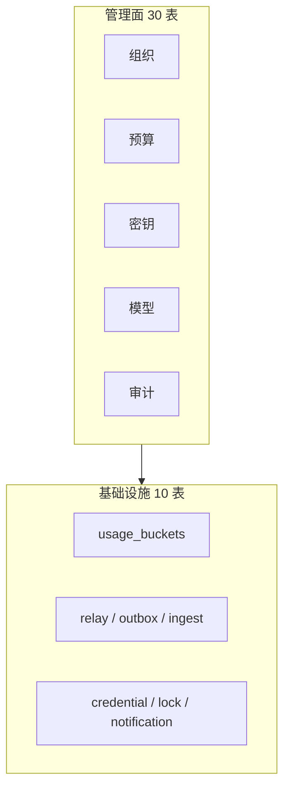
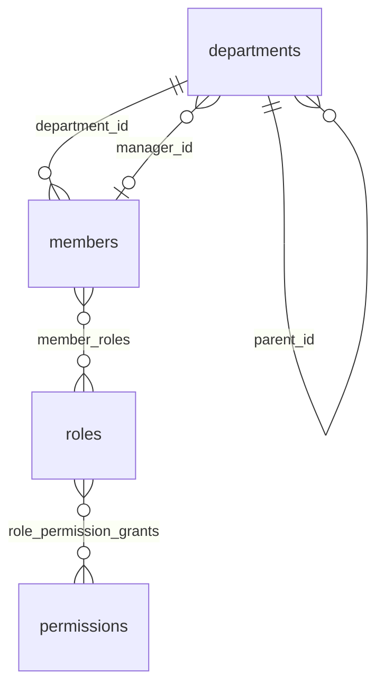
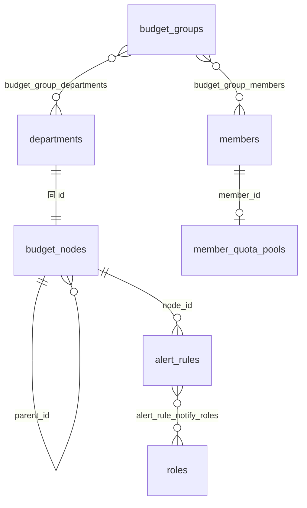
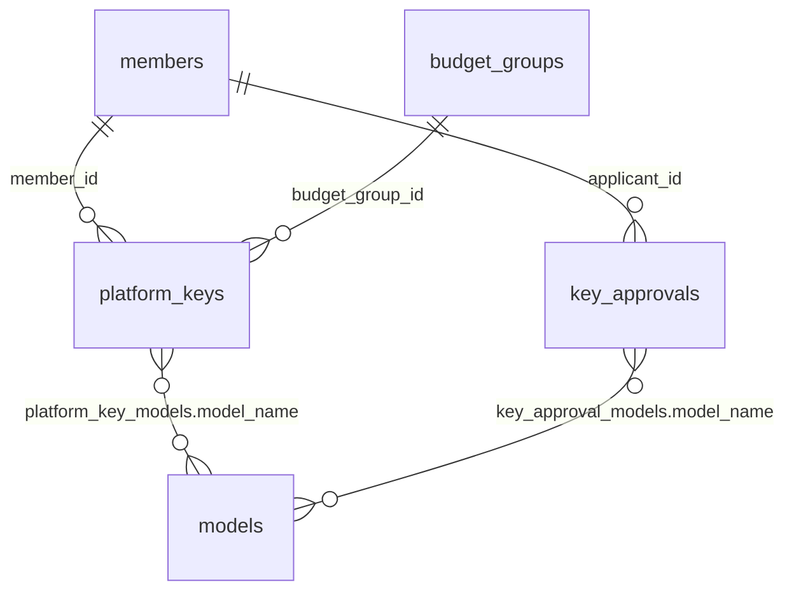
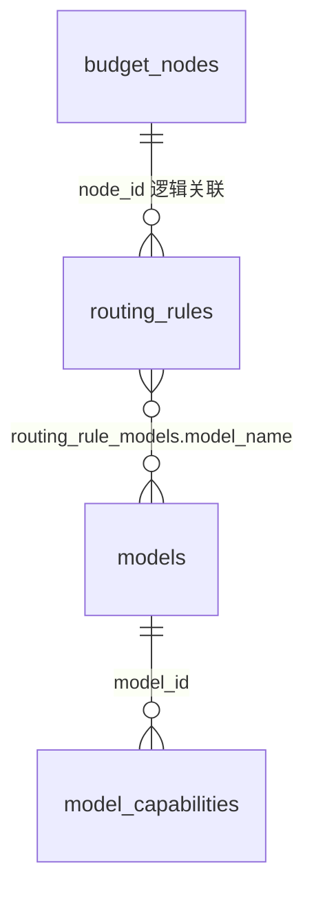
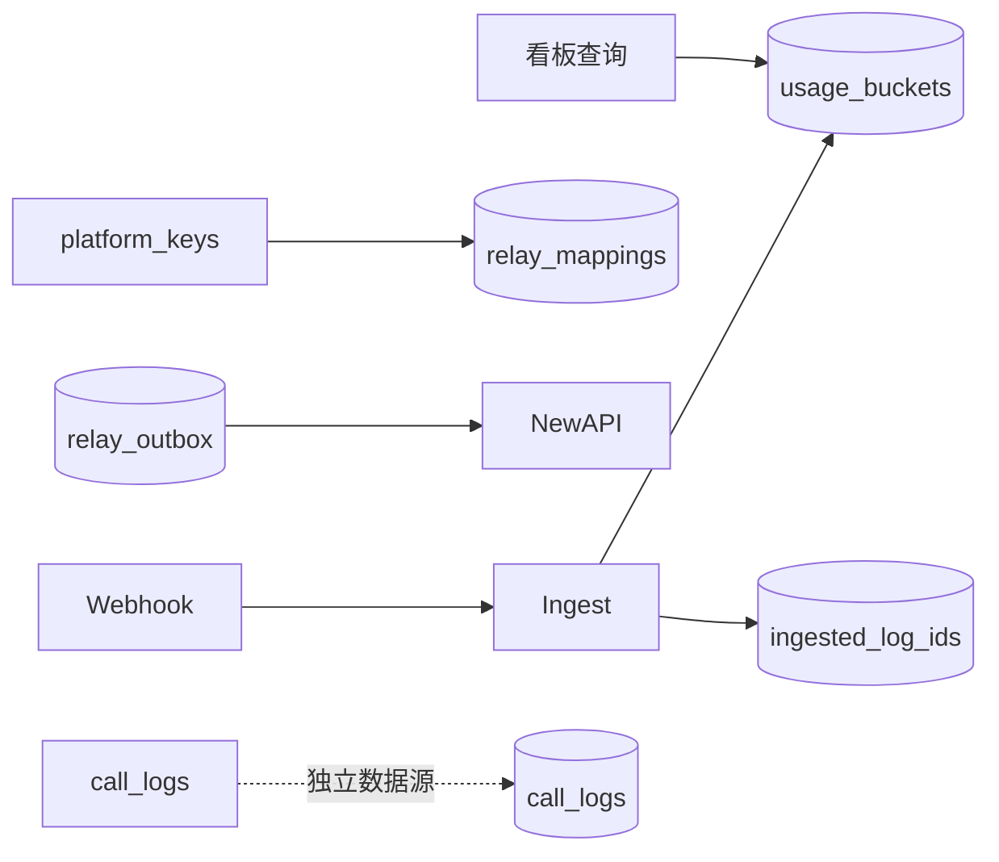
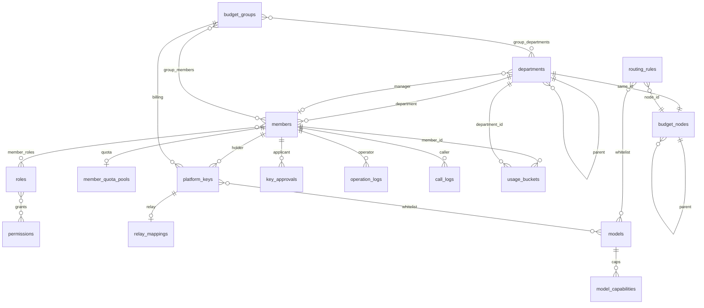

# Backend 存储架构

本文描述 TokenJoy 后端 **Postgres 中的实体与关系**。表定义唯一来源：`apps/backend/internal/store/postgres/schema.sql`（共 **44** 张表）。

不涉及 SQL 字段明细、Repository 或 HTTP 层。

相关文档：[Backend-设计.md](./Backend-设计.md) · [Backend-SaaS多租户架构.md](./Backend-SaaS多租户架构.md)

---

## 1. 概览

Postgres 承担两类数据：

| 分层         | 内容                                 | 特征                                        |
| ------------ | ------------------------------------ | ------------------------------------------- |
| **管理面**   | 组织、预算、密钥、模型、审计         | 低频读写；树形结构用 `parent_id` 邻接表存储 |
| **基础设施** | 用量桶、Relay 映射、Outbox、凭证、锁 | 高频追加或异步消费；与管理配置解耦          |

**运维约定：** 改表直接改 `schema.sql`，启动时全量 apply；无增量 migration。改结构后须清库重建（`docker compose down -v`）。

---

## 2. 表的四种形态

读下文前先理解：44 张表并非 44 个独立业务概念，而是按存储形态拆分。

| 形态            | 张数 | 含义                       | 示例                                  |
| --------------- | ---- | -------------------------- | ------------------------------------- |
| **主表**        | ~14  | 一行一个业务对象           | `members`、`platform_keys`            |
| **关联表**      | 10   | 多对多拆表；读写时并入父行 | `member_roles`、`platform_key_models` |
| **单行配置**    | 6    | 全库仅一行，`id = 1`       | `org_sync_config`、`audit_settings`   |
| **日志 / 队列** | ~10  | 只追加或异步消费           | `call_logs`、`relay_outbox`           |

树形主表（`departments`、`budget_nodes`）无 `children` 子表；嵌套结构读出时在应用层组装。

---

## 3. 组织域（10 表）

组织是其他域的锚点：成员、角色、部门树，以及飞书等数据源同步状态。

### 3.1 主表

| 表            | 说明                                                          |
| ------------- | ------------------------------------------------------------- |
| `departments` | 部门；`parent_id` 自引用成树；`manager_id` → `members`        |
| `members`     | 成员；`department_id` → `departments`；冗余 `department_name` |
| `roles`       | 角色定义                                                      |
| `permissions` | 权限目录（seed 灌入，运行时只读）                             |

### 3.2 关联表

| 表                       | 关系                                                          |
| ------------------------ | ------------------------------------------------------------- |
| `member_roles`           | 成员 ↔ 角色                                                   |
| `role_permission_grants` | 角色 ↔ 权限引用（存字符串如 `org:*`，不 FK 到 `permissions`） |

### 3.3 配置与日志

| 表                       | 说明                   |
| ------------------------ | ---------------------- |
| `org_data_source_status` | 数据源连接状态（单行） |
| `org_sync_config`        | 定时同步策略（单行）   |
| `org_sync_logs`          | 同步执行记录（追加）   |
| `org_import_failures`    | 导入失败明细           |

### 3.4 关系

**注意：** `departments.manager_id` 与 `members.department_id` 形成循环引用，建表时分步加 FK。

---

## 4. 预算域（8 表）

预算与组织通过 **同 ID** 对齐：每个部门对应一个预算树节点。

### 4.1 主表

| 表                   | 说明                                                          |
| -------------------- | ------------------------------------------------------------- |
| `budget_nodes`       | 预算树；`parent_id` 自引用；含 `budget`、`consumed`、`period` |
| `budget_groups`      | 跨部门/成员的共享额度池                                       |
| `overrun_policy`     | 全局超限策略（单行）                                          |
| `alert_rules`        | 挂载在预算节点上的预警规则                                    |
| `member_quota_pools` | 成员个人额度（1:1，`member_id` 为主键）                       |

### 4.2 关联表

| 表                         | 关系                |
| -------------------------- | ------------------- |
| `budget_group_members`     | 预算组 ↔ 成员       |
| `budget_group_departments` | 预算组 ↔ 部门       |
| `alert_rule_notify_roles`  | 预警规则 ↔ 通知角色 |

### 4.3 关系

**联动：** 部门树变更时，须同事务更新 `departments`、`budget_nodes`、`routing_rules`。

---

## 5. 密钥域（5 表）

两类密钥：上游 **Provider** 密钥（连 OpenAI 等）与平台发放的 **Platform** 密钥（给成员/应用）。

| 表                    | 说明                                                           |
| --------------------- | -------------------------------------------------------------- |
| `provider_keys`       | 上游密钥；含 `secret_key`、`relay_channel_id`                  |
| `platform_keys`       | 平台 Key；`member_id`、`budget_group_id` 可选；冗余成员名/组名 |
| `platform_key_models` | Platform Key 允许的模型白名单（存 `model_name`）               |
| `key_approvals`       | 额度/密钥审批单                                                |
| `key_approval_models` | 审批单申请的模型列表                                           |

白名单引用 **模型名**（`model_name`），不是 `models.id`。

---

## 6. 模型域（4 表）

模型目录与按组织节点的路由策略。

| 表                    | 说明                                               |
| --------------------- | -------------------------------------------------- |
| `models`              | 模型目录（供应商、定价、上下文长度等）             |
| `model_capabilities`  | 模型能力标签                                       |
| `routing_rules`       | 按节点的路由；`node_id` 指向预算/部门节点（无 FK） |
| `routing_rule_models` | 路由允许的模型白名单                               |

---

## 7. 审计域（3 表）

| 表               | 说明                          |
| ---------------- | ----------------------------- |
| `audit_settings` | 是否保留请求/响应摘要（单行） |
| `operation_logs` | 管理操作日志（只追加）        |
| `call_logs`      | API 调用日志（只追加）        |

`operation_logs`、`call_logs` 通过 `operator_id` / `caller_id` 逻辑关联 `members`，无强制 FK。

---

## 8. 基础设施（10 表）

不参与管理面 CRUD，由 Worker / Ingest 读写。

| 表                       | 职责                                                             |
| ------------------------ | ---------------------------------------------------------------- |
| `usage_buckets`          | 看板用量；主键 `(bucket_start, department_id, member_id, model)` |
| `relay_mappings`         | Platform Key ↔ NewAPI Token（1:1，`platform_key_id` 为主键）     |
| `relay_outbox`           | Relay 异步任务                                                   |
| `webhook_outbox`         | Webhook 失败重试                                                 |
| `ingested_log_ids`       | Ingest 幂等去重                                                  |
| `relay_sync_cursors`     | 补偿轮询游标（单行）                                             |
| `rebalance_queue`        | 预算 rebalance 待办                                              |
| `datasource_credentials` | 第三方凭证（AES-GCM 加密，单行）                                 |
| `scheduler_locks`        | 定时任务分布式租约                                               |
| `notification_log`       | 通知发送记录                                                     |

**分工：** 看板聚合读 `usage_buckets`；审计列表读 `call_logs`。Ingest 只写 buckets，不回写 `budget_nodes.consumed`。

---

## 9. 跨域关系总图

### 9.1 ID 对齐约定

| 锚点                                 | 规则                                                                    |
| ------------------------------------ | ----------------------------------------------------------------------- |
| `departments.id` = `budget_nodes.id` | 一一对应                                                                |
| `routing_rules.node_id`              | 指向部门/预算节点                                                       |
| `relay_mappings`                     | 冗余 `platform_key_id`、`member_id`、`department_id`、`budget_group_id` |
| `usage_buckets`                      | 按 `department_id` + `member_id` + `model` + 时间桶聚合                 |

---

## 10. SaaS 多企业

产品 **企业（Company）** 对应表 `companies`、列 `company_id`。详见 [Backend-SaaS多租户架构.md](./Backend-SaaS多租户架构.md) §五。

| 项         | 说明                                                                                |
| ---------- | ----------------------------------------------------------------------------------- |
| 企业表     | `companies`、`company_invites`、`platform_operators`、`company_recharge_orders`     |
| 企业域     | 组织、预算、密钥、审计、Relay、用量等表含 `company_id`；主键多为 `(company_id, id)` |
| 全局表     | `provider_keys`、`permissions` 不加 `company_id`                                    |
| 单例改多行 | `overrun_policy`、`org_sync_config`、`datasource_credentials` 等按企业一行          |

NewAPI 侧每企业一个 **企业服务账户**（公司钱包），不新增 Postgres 表；见 [NewAPI-SaaS多企业配置.md](./NewAPI-SaaS多企业配置.md)。

---

## 11. 小结

| 问题                | 答案                                         |
| ------------------- | -------------------------------------------- |
| 一共多少张表？      | **44**                                       |
| 管理面 / 基础设施？ | **30** / **10**                              |
| 树怎么存？          | `parent_id` 邻接表；嵌套 `children` 读出组装 |
| 部门与预算？        | `departments.id` = `budget_nodes.id`         |
| 模型白名单？        | 关联表存 `model_name`，非 `models.id`        |
| 用量 vs 审计？      | `usage_buckets` 供看板；`call_logs` 供审计   |
