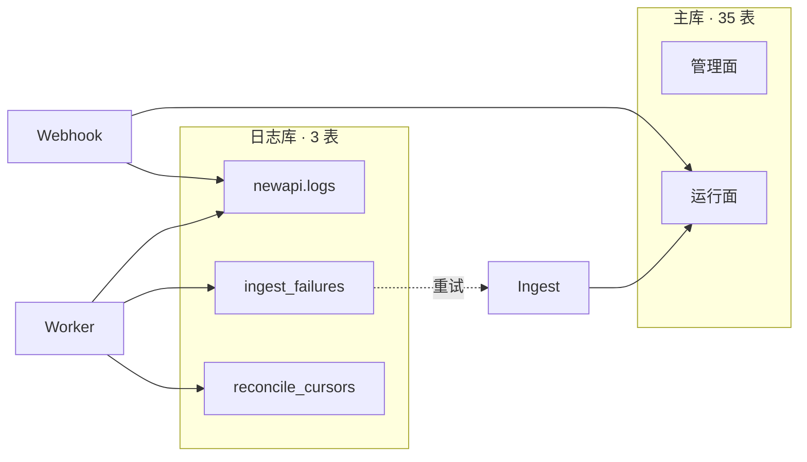
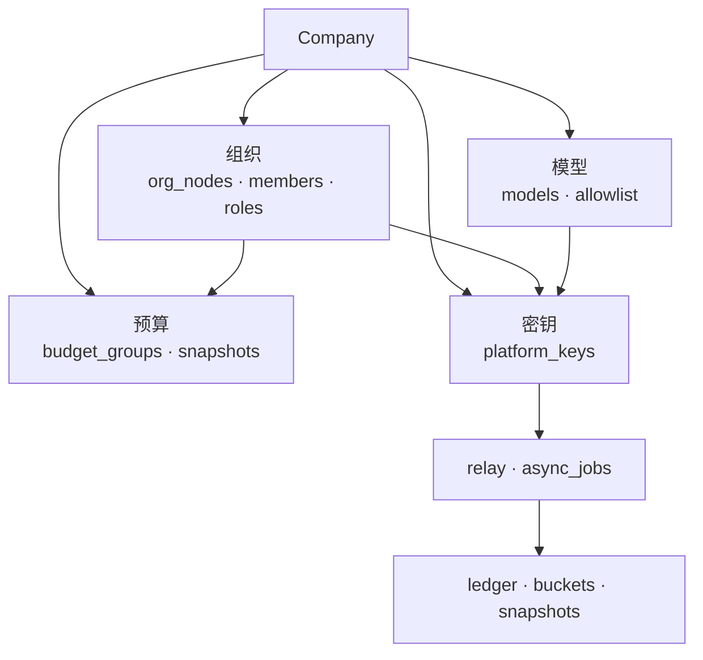
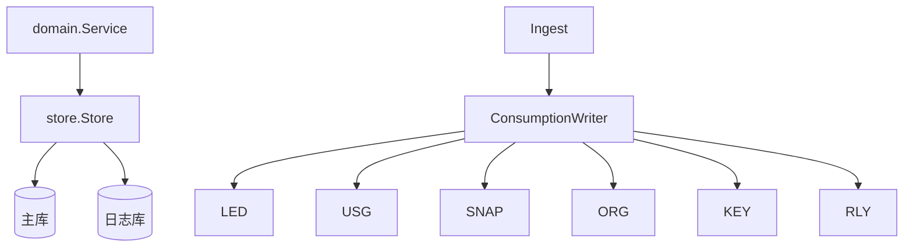
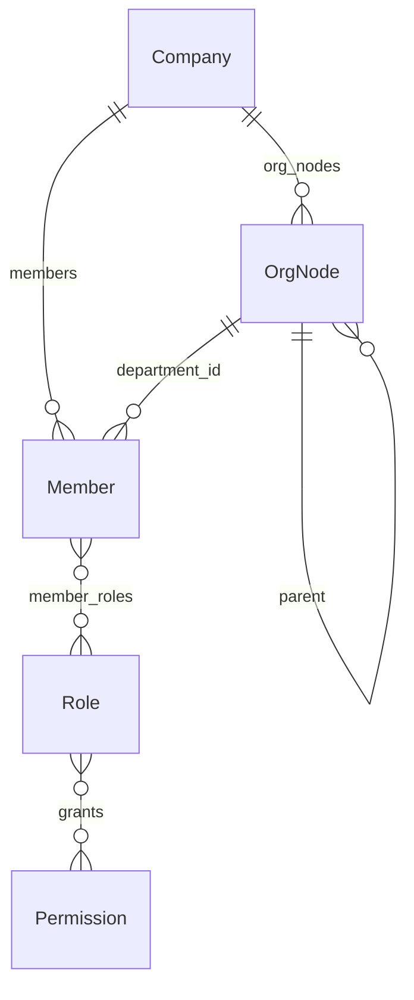
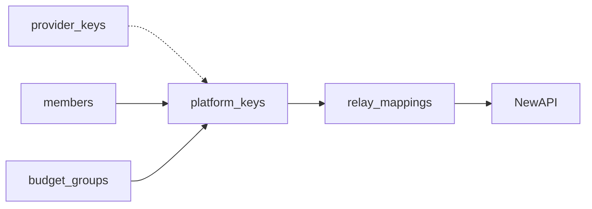
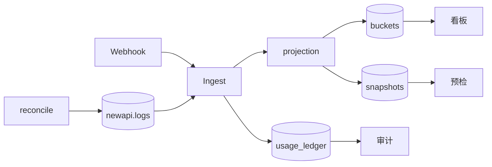

# Backend 存储架构

Postgres 双库：**35** 张主库表 + **3** 张日志库表。`company_id` 租户隔离，管理面配置 + 运行面入账投影。

**本文定位：** 表结构、域关系、Store 映射与 ID 约定。请求链路见 [Backend-架构.md](./Backend-架构.md)；Ingest / Rebalance / Overrun 算法见 [Backend-预算.md](./Backend-预算.md)。

| 库 | DDL | 连接 |
| --- | --- | --- |
| 主库 | `apps/backend/internal/store/postgres/schema.sql` | `DATABASE_URL` |
| 日志库 | `logs_schema.sql` | `LOG_DATABASE_URL`（可选） |

启动时 `go:embed` 全量 apply，再由 `schema_partitions.go` 创建月分区（2024-01 .. 2032-12）。改表后本地 `docker compose down -v` 重建。

---

## 1. 双库拓扑

| 配置 | 行为 |
| --- | --- |
| `LOG_DATABASE_URL` + `NEW_API_WEBHOOK_SECRET` | Ingest 启用 |
| 未配置日志库 | `Logs()` 为 `NoopLogStore` |
| `LogSchemaIsolated=true` | 测试专用；生产禁止 |

---

## 2. 域级关系

| 概念 | 落点 |
| --- | --- |
| 部门 + 节点预算 + 路由 | `org_nodes`（HTTP 投影 `Department` / `BudgetNode` / `RoutingRule`） |
| 平台 Key 归因 | `platform_keys`；`relay_mappings` 仅同步状态 |
| 消耗 SSOT / 看板 / 预检缓存 | `usage_ledger` / `usage_buckets` / `budget_snapshots` |
| 企业钱包余额 | NewAPI `users.quota`；Postgres 存 `newapi_wallet_user_id` |
| SaaS 上游 Key | 全局 `provider_keys`（无 `company_id`） |

---

## 3. Store 与租户隔离

| 接口 | 主表 |
| --- | --- |
| `Org()` / `Nodes()` | `org_nodes`, `members`, `roles`, `permissions`, `org_integration`, … |
| `Budget()` | `budget_groups`, `budget_snapshots`, `alert_rules`, `budget_approvals`, … |
| `Keys()` | `provider_keys`, `platform_keys`, `key_approvals` |
| `Models()` / `Allowlist()` | `models`, `model_capabilities`, `model_allowlist` |
| `Ledger()` / `Usage()` / `BudgetSnapshots()` | `usage_ledger`, `usage_buckets`, `budget_snapshots` |
| `Relay()` | `relay_mappings`, `async_jobs` |
| `Audit()` | `audit_settings`, `operation_logs` |
| `Company()` / `Invite()` / `Billing()` / `Platform()` | 租户与充值 |
| `Notification()` / `SchedulerLock()` / `Logs()` | `notification_log`, `scheduler_locks`, 日志库三表 |

**租户：** 复合 PK `(company_id, …)`；全局表 `permissions` · `provider_keys` · `platform_operators` · `scheduler_locks`。

**分区：** `operation_logs` · `usage_ledger` · `usage_buckets` → 月子表 `{table}_YYYY_MM`。

---

## 4. 核心实体

### 组织与 RBAC

`members.department_id` = `org_nodes.id` = HTTP `departmentId`。组织同步：`org_integration` + `org_sync_logs` / `org_import_failures`。

### 组织节点 vs 预算组

| | `org_nodes` | `budget_groups` |
| --- | --- | --- |
| 结构 | 树形逐级分配 | 扁平共享池 |
| 与 Key | 经部门归因 | 挂 `budget_group_id` |
| consumed | `axis_kind=org_node` | `axis_kind=budget_group` |

### `org_nodes` 列组

| 列组 | 字段 | 读写入口 |
| --- | --- | --- |
| 树 | `id`, `parent_id`, `path`, `name`, `manager_id` | `Org().Nodes()` |
| 预算 | `budget`, `reserved_pool`, `period` | `budget.Service`；consumed → `budget_snapshots` |
| 路由 | `default_model_id`, `fallback_model_id`, `routing_inherited` | `models.Service`；白名单 → `model_allowlist` |

### 密钥与 Relay

`key_hash` 用于 Gateway 鉴权；明文 Key 不落库。`model_allowlist.owner_type`：`platform_key` · `org_node` · `key_approval`。

### `async_jobs`

| channel | 消费方 |
| --- | --- |
| `relay` | `relay_processor` |
| `rebalance` | `rebalance_processor`（`dedupe_key` = `axis_kind:axis_id`） |
| `overrun` | `overrun_processor` |

---

## 5. 用量与入账

| 表 | 角色 |
| --- | --- |
| `usage_ledger` | 消耗 SSOT |
| `usage_buckets` | 看板 hour/day 聚合 |
| `budget_snapshots` | 四轴 consumed：`org_node` · `budget_group` · `platform_key` · `member` |
| `ingest_failures` | 入账失败重试（日志库） |

入账算法见 [Backend-预算.md](./Backend-预算.md) §2。

---

## 6. 表清单

### 主库（35 张）

| 域 | 表 |
| --- | --- |
| 租户 | `companies`, `company_invites`, `company_recharge_orders`, `platform_operators` |
| 组织 | `org_nodes`, `members`, `roles`, `permissions`, `role_permission_grants`, `member_roles`, `org_integration`, `org_sync_logs`, `org_import_failures` |
| 预算 | `budget_groups`, `budget_snapshots`, `budget_group_members`, `budget_group_departments`, `overrun_policy`, `alert_rules`, `alert_rule_notify_roles`, `budget_approvals` |
| 密钥 | `provider_keys`, `platform_keys`, `key_approvals`, `relay_mappings` |
| 模型 | `models`, `model_capabilities`, `model_allowlist` |
| 审计 | `audit_settings`, `operation_logs`, `usage_ledger` |
| 运行面 | `usage_buckets`, `async_jobs`, `scheduler_locks`, `notification_log` |

### 日志库（3 张）

| 表 | 职责 |
| --- | --- |
| `newapi.logs` | consume 原始行（`type=2`） |
| `backend.ingest_failures` | 入账失败重试 |
| `backend.reconcile_cursors` | reconcile 水位 |

---

## 7. 关键 ID

| 易混项 | 说明 |
| --- | --- |
| `departmentId` | = `org_nodes.id` = `members.department_id` |
| `RoutingRule.id` | = `nodeId` |
| `sk-xxx` | → `platform_keys.key_hash` → `relay_mappings.newapi_token_id` |
| `newapi_wallet_user_id` | → NewAPI `users.quota` |
| 幂等键 | `newapi:{log_id}` |
| `members` | TokenJoy 成员，非 NewAPI user |
| `personalQuota` | 走 `MemberBudgetQuota` API，不在 Member JSON |
