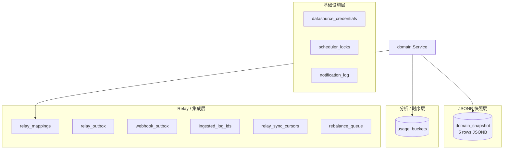
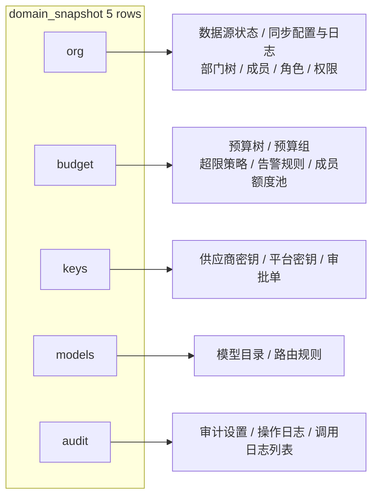
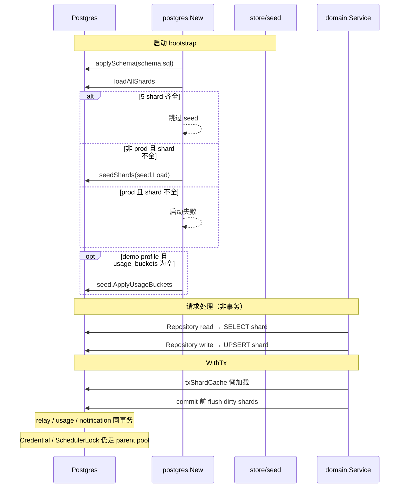
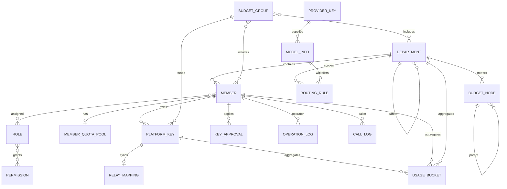
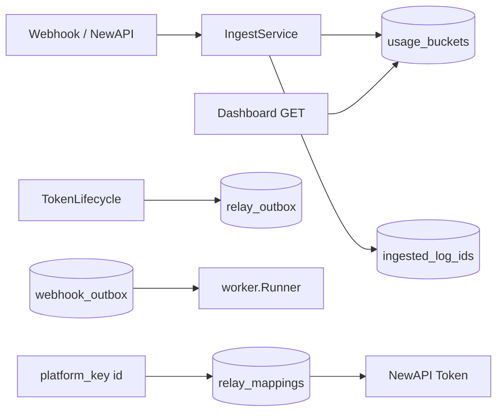
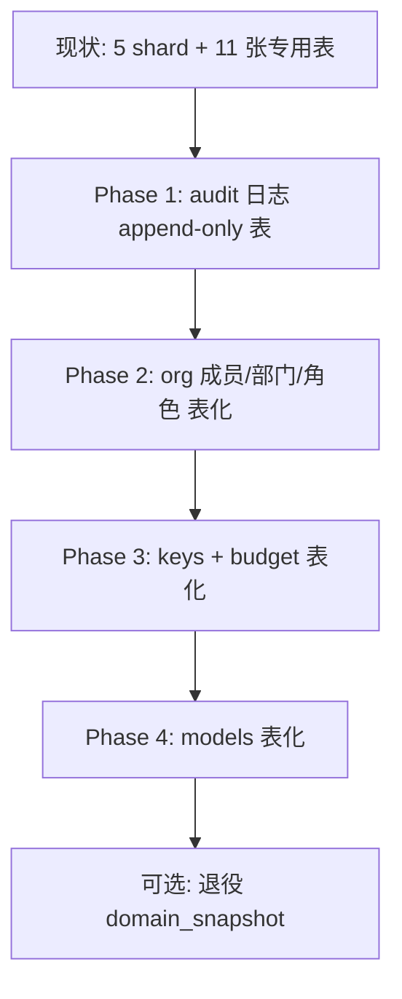

# Backend 存储架构

本文说明 TokenJoy Go 后端当前 Postgres 表结构、`domain_snapshot` 的设计取舍、Repository 分层、实体间关系，以及未来拆分为规范化表时的演进建议。

相关文档：[Backend-设计.md](./Backend-设计.md) · [Backend-test.md](./Backend-test.md) · [Frontend-API契约.md](./Frontend-API契约.md)

---

## 1. 设计背景：为什么不是「每张实体一张表」？

早期后端用 **Memory Store**：所有组织、预算、密钥等数据放在进程内存里的 `store.Snapshot` 结构体中，重启即丢失。

接入 Postgres 后需要**持久化**，但管理面 API 的 JSON 形状已经稳定（与 [`apps/frontend/src/api/types/`](../apps/frontend/src/api/types/) 对齐）。若立刻做全量关系型建模，需要：

- 为每个实体建表、外键、迁移脚本
- 重写 Repository 层（从 `[]Member` 改为 JOIN 查询）
- 处理树形结构（部门、预算节点）的存储与查询

因此采用 **混合存储**：

| 策略 | 适用数据 | 原因 |
| --- | --- | --- |
| **JSONB 快照（`domain_snapshot`）** | 组织、预算、密钥、模型、审计列表等「管理面整块状态」 | 与 API JSON 同构，迁移成本低；运行时直读写 PG |
| **规范化表** | 用量聚合、Relay 队列、凭证、去重 ID 等 | 需要索引、并发消费、幂等、加密 BYTEA |

这不是「没用数据库」，而是 **有选择地规范化**：该查表的地方已经是表；该整块读写的仍用快照。

---

## 2. 代码包结构

```
internal/store/
├── store.go              # Store 接口、Snapshot、各域 Repository 接口
├── snapshot_shard.go     # 5 个 shard 的 JSON 类型与编解码
├── clone.go              # 深拷贝辅助（Repository 返回副本）
├── relay.go              # Relay 相关接口与常量
├── usagequery/           # 用量过滤/聚合（Postgres 与 Memory 共用）
├── seed/                 # Demo 种子数据与启动灌库
├── postgres/             # 运行时实现（cmd/server 唯一链接）
│   ├── postgres.go       # 连接、schema、loadOrSeedDomain
│   ├── schema.sql        # DDL 唯一来源（go:embed）
│   ├── schema.go
│   ├── shards.go         # shard SELECT/UPSERT、poolShardBackend、txShardCache
│   ├── domain_repos.go   # Org/Budget/Keys/Models/Audit → shard read-modify-write
│   ├── tx.go             # WithTx 事务视图
│   ├── relay.go
│   ├── usage_notification.go
│   └── credential_lock.go
└── memory/               # 单测 / Handler 测试（-tags=testhook）
    ├── store.go
    ├── repos.go
    ├── relay.go
    ├── tx.go             # WithTx 为同实例直通，无真实事务
    ├── credential_lock.go
    └── usage_notification.go
```

**依赖注入：** `internal/app/app.go` 通过 `postgres.New` 构造 `store.Store`，经 `wiring.go` 注入各 `domain.Service`。测试包使用 `app.NewWithStore`（`//go:build testhook`）注入 `memory.New(seed.Load(cfg))`。

---

## 3. `Store` 接口与 Repository 边界

```go
type Store interface {
    Org() OrgRepository
    Budget() BudgetRepository
    Keys() KeysRepository
    Models() ModelsRepository
    Audit() AuditRepository
    Relay() RelayRepository
    Credential() CredentialRepository
    SchedulerLock() SchedulerLockRepository
    Usage() UsageRepository
    Notification() NotificationRepository
    WithTx(ctx context.Context, fn func(Store) error) error
}
```

| Repository | 持久化载体 | 典型调用方 |
| --- | --- | --- |
| `Org` / `Budget` / `Keys` / `Models` / `Audit` | `domain_snapshot` 对应 shard | 各 domain Service |
| `Credential` | `datasource_credentials` | `domain/org` 飞书凭证 |
| `Relay` | `relay_*`、`ingested_log_ids`、`rebalance_queue` | `domain/relay`、`domain/budget` ingest/rebalance |
| `Usage` | `usage_buckets` | `domain/dashboard`、`domain/budget` ingest |
| `Notification` | `notification_log` | `infra/notification` |
| `SchedulerLock` | `scheduler_locks` | `infra/worker` |

`store.Snapshot` 仍作为**种子与测试**用的逻辑全集；其中 `CredentialPlatform` / `EncryptedCredential` 字段**不**写入 `domain_snapshot`，运行时凭证只走 `Credential()`。

Postgres 域 Repository 统一模式：`read()` 加载 shard JSON → 修改字段 → `write()` 整包回写。非事务路径每次 `read` 都 `SELECT`；`WithTx` 内通过 `txShardCache` 懒加载并在 commit 前 `flush`。

---

## 4. 当前 Postgres 表一览

Schema 唯一来源：[`apps/backend/internal/store/postgres/schema.sql`](../apps/backend/internal/store/postgres/schema.sql)（`go:embed`，启动时 `applySchema` 直接执行，**无版本表、无增量迁移**）。表结构变更请清空库后重建（`docker compose down -v`）。



### 4.1 表清单（共 12 张业务表）

| 表名 | 类型 | 行量级 | 职责 |
| --- | --- | --- | --- |
| **`domain_snapshot`** | JSONB 快照 | 固定 **5** 行 | 管理面域数据整包持久化 |
| **`usage_buckets`** | 规范化 | 持续增长 | 看板费用/用量时间桶 |
| **`relay_mappings`** | 规范化 | 与平台密钥同量级 | 平台密钥 ↔ NewAPI Token |
| **`relay_outbox`** | 队列 | 动态 | Relay 异步任务 |
| **`webhook_outbox`** | 队列 | 动态 | Webhook 失败重试 |
| **`ingested_log_ids`** | 去重 | 动态 | 防止 log 重复入账 |
| **`relay_sync_cursors`** | 单行状态 | **1** | 补偿轮询游标 |
| **`rebalance_queue`** | 队列 | 动态 | 预算 rebalance 待办 |
| **`datasource_credentials`** | 单行加密 | **0~1** | 飞书等凭证（AES-GCM BYTEA） |
| **`scheduler_locks`** | 锁 | 少量 | 定时任务租约 |
| **`notification_log`** | 日志 | 增长 | 通知发送记录 |

---

## 5. `domain_snapshot` 详解

### 5.1 表结构

```sql
domain_snapshot (
  id         TEXT PRIMARY KEY,   -- shard 名
  data       JSONB NOT NULL,     -- 该域全部 JSON
  updated_at TIMESTAMPTZ
)
```

### 5.2 五个 Shard 与内容

常量与编解码见 [`internal/store/snapshot_shard.go`](../apps/backend/internal/store/snapshot_shard.go)。



| Shard ID | JSON 顶层字段（摘要） |
| --- | --- |
| `org` | `dataSourceStatus`, `syncConfig`, `syncLogs`, `importFailures`, `departments`, `members`, `roles`, `permissions` |
| `budget` | `budgetTree`, `budgetGroups`, `overrunPolicy`, `alertRules`, `memberQuotaPools` |
| `keys` | `providerKeys`, `platformKeys`, `approvals` |
| `models` | `models`, `routingRules` |
| `audit` | `auditSettings`, `operationLogs`, `callLogs` |

### 5.3 运行时生命周期



要点：

- **Seed**（[`internal/store/seed/`](../apps/backend/internal/store/seed/)）：`seed.Load(cfg)` 生成 `Snapshot`；`postgres.loadOrSeedDomain` 仅在 shard 不完整且非 prod 时写入 5 行。`seed.ApplyUsageBuckets` 在 demo profile 下、用量表为空时灌入看板数据。
- **读路径（Postgres）**：非事务下每次 `read()` 直接 `SELECT`；无进程级 domain 缓存。
- **写路径**：read-modify-write 后整包 UPSERT；`WithTx` 内 dirty shard 在 commit 前批量落库。
- **`WithTx` 边界**：事务内包含 domain shard、relay、usage、notification；`Credential()` 与 `SchedulerLock()` 委托 parent `Store`，**不在同一 PG 事务**。
- **Memory Store**：实现相同 `Store` 接口；数据在 `sync.RWMutex` 保护的 `Snapshot` + 内存 map；`WithTx` 为同实例直通。仅测试通过 `-tags=testhook` 链接（`Makefile`：`go test -tags=testhook ./tests/...`）。

---

## 6. 用量查询：`usagequery` 共享层

`usage_buckets` 写入使用 SQL `ON CONFLICT ... DO UPDATE` 累加（[`usage_notification.go`](../apps/backend/internal/store/postgres/usage_notification.go)）。

读路径（Series / Aggregates / Summary）：

1. SQL 按时间范围与部门/成员过滤拉取原始行
2. Go 侧 [`usagequery`](../apps/backend/internal/store/usagequery/query.go) 做粒度截断、`groupBy` 聚合、排序与 limit

Postgres 与 Memory 实现共用 `usagequery`，保证测试与运行时聚合逻辑一致。当前**未**在 SQL 层做 `GROUP BY` 预聚合。

---

## 7. 实体关系（逻辑模型）

以下描述**业务关系**，与当前「嵌 JSON / 数组 ID」的物理存储方式无关。



### 7.1 当前物理存储 vs 逻辑关系

| 逻辑关系 | 当前怎么存 |
| --- | --- |
| 成员 → 部门 | `members[].departmentId`（JSON 数组项） |
| 成员 → 角色 | `members[].roles[]` 字符串数组（**非**独立关联表） |
| 角色 → 权限 | `roles[].permissions[]` 嵌在 JSON |
| 部门树 | `departments[].children[]` **嵌套 JSON 树** |
| 预算树 | `budgetTree[].children[]` 嵌套 JSON |
| 预算组 → 成员/部门 | `budgetGroups[].memberIds[]` / `departmentIds[]` |
| 平台密钥 → 成员/预算组 | `platformKeys[].memberId` / `budgetGroupId` |
| 平台密钥 → NewAPI | **`relay_mappings` 表**（已规范化） |
| 看板用量 | **`usage_buckets` 表**（已规范化） |
| 路由规则 → 部门节点 | `routingRules[].nodeId` 指向 budget/org 节点 ID |
| 飞书凭证 | **`datasource_credentials` 表**（与 shard 隔离） |

---

## 8. 已规范化部分（保持不变）

以下表设计合理，**不建议**塞回 `domain_snapshot`：



| 能力 | 为何必须独立表 |
| --- | --- |
| `usage_buckets` | 时间范围过滤、Webhook 累加、看板聚合 |
| `relay_*` / outbox | 异步队列、状态机、重试 |
| `ingested_log_ids` | 幂等去重 |
| `datasource_credentials` | 加密 BYTEA、与域 JSON 隔离 |
| `scheduler_locks` | 多实例租约 |
| `notification_log` | 通知审计、与业务 shard 解耦 |

Relay 接口与 outbox kind 常量定义在 [`internal/store/relay.go`](../apps/backend/internal/store/relay.go)。

---

## 9. 当前方案的优缺点

### 9.1 优点

- 与前端 API JSON **同构**，前后端类型对齐成本低
- 5 shard 分域，比单一大 JSON 写放大更小
- Postgres 直读写，多副本读一致；域数据无进程级缓存
- Memory 与 Postgres 共享 Repository 接口与 `usagequery`，测试覆盖真实业务路径
- 12 张表 schema 总数可控；demo 空库自动 seed

### 9.2 缺点与风险

| 问题 | 说明 |
| --- | --- |
| **整 shard 写回** | 改一个成员可能重写整个 `org` JSON（写放大） |
| **无 SQL 级约束** | 成员 `departmentId` 指向不存在部门，DB 不会拦 |
| **并发写同一 shard** | read-modify-write 可能丢更新 |
| **大列表性能** | `operationLogs` / `callLogs` 在 JSON 内增长，分页在应用层过滤 |
| **用量查询** | 先拉行再 Go 聚合，数据量大时需 SQL 预聚合或物化视图 |
| **审计调用日志 vs 用量** | `audit.callLogs`（展示用）与 `usage_buckets`（聚合用）数据源部分重叠 |

---

## 10. 未来拆分：需要多少张表？

若逐步改为**全关系型**，可按域估算。数字为 **建议表数区间**（含必要的关联表），不是一次性全部上线。

### 10.1 分阶段表数量估算

| 阶段 | 范围 | 新增表（约） | 累计业务表（约） |
| --- | --- | --- | --- |
| **现状** | 已上线 | — | **12** |
| **Phase A — 组织** | 成员/部门/角色可 SQL 查询 | 8~10 | 20~22 |
| **Phase B — 密钥与预算** | 密钥、预算组、额度 | 8~12 | 28~34 |
| **Phase C — 模型与路由** | 模型目录、路由白名单 | 4~6 | 32~40 |
| **Phase D — 审计与配置** | 日志 append-only、系统配置 | 4~6 | 36~46 |

已存在的 **11 张基础设施/分析表**（`usage_buckets`、`relay_*` 等）在拆分后 **保留**，无需重复建设。

### 10.2 推荐演进路线



触发拆分的信号：

- 单 shard JSON **> 几 MB** 或写延迟明显
- 需要 **复杂 SQL 报表**（跨成员/部门筛选）
- **多 backend 副本** 写冲突频繁
- 审计/调用日志 **> 万级** 行

### 10.3 可做的轻量优化（不必立刻全表拆分）

| 优化 | 做法 | 收益 |
| --- | --- | --- |
| 审计日志移出 snapshot | `operation_logs` / `call_logs` 改为 append-only 表 | 减小 `audit` shard；支持索引分页 |
| 调用日志与用量分工 | 看板只读 `usage_buckets`；audit 列表保留摘要 | 减少 duplicate 数据感 |
| settings 单行表 | `org_settings`, `audit_settings` 从 shard 抽出 | 减小 org/audit shard churn |
| 用量 SQL 预聚合 | 对 `usage_buckets` 增加 `GROUP BY` 查询路径 | 大数据量看板性能 |
| 按写频率拆 shard | 高频写的 `members` 先独立表，其余仍 JSON | 渐进式，风险低 |

### 10.4 不建议的「简化」

| 做法 | 为何不做 |
| --- | --- |
| 全部塞进 1 个 JSONB | 写放大更严重；无法部分更新 |
| 去掉 `memory/` 测试实现 | 单测与 Handler 测试依赖同接口的内存后端 |
| 用 `call_logs` 替代 `usage_buckets` | 看板需要预聚合桶；实时扫日志无法满足契约 |

---

## 11. 与代码入口对照

| Concern | 代码位置 |
| --- | --- |
| Store 接口与 Snapshot | [`internal/store/store.go`](../apps/backend/internal/store/store.go) |
| Shard 编解码 | [`internal/store/snapshot_shard.go`](../apps/backend/internal/store/snapshot_shard.go) |
| 深拷贝 | [`internal/store/clone.go`](../apps/backend/internal/store/clone.go) |
| Relay 接口 | [`internal/store/relay.go`](../apps/backend/internal/store/relay.go) |
| 用量聚合逻辑 | [`internal/store/usagequery/query.go`](../apps/backend/internal/store/usagequery/query.go) |
| PG 连接与 bootstrap | [`internal/store/postgres/postgres.go`](../apps/backend/internal/store/postgres/postgres.go) |
| Schema embed | [`internal/store/postgres/schema.go`](../apps/backend/internal/store/postgres/schema.go) |
| Shard 读写与事务缓存 | [`internal/store/postgres/shards.go`](../apps/backend/internal/store/postgres/shards.go) |
| 域 Repository（PG） | [`internal/store/postgres/domain_repos.go`](../apps/backend/internal/store/postgres/domain_repos.go) |
| 事务 | [`internal/store/postgres/tx.go`](../apps/backend/internal/store/postgres/tx.go) |
| 凭证与调度锁 | [`internal/store/postgres/credential_lock.go`](../apps/backend/internal/store/postgres/credential_lock.go) |
| 用量 / 通知 SQL | [`internal/store/postgres/usage_notification.go`](../apps/backend/internal/store/postgres/usage_notification.go) |
| Relay SQL | [`internal/store/postgres/relay.go`](../apps/backend/internal/store/postgres/relay.go) |
| Memory 实现 | [`internal/store/memory/`](../apps/backend/internal/store/memory/) |
| Demo 种子 | [`internal/store/seed/`](../apps/backend/internal/store/seed/) |
| 测试注入 App | [`internal/app/testhook.go`](../apps/backend/internal/app/testhook.go)、[`tests/testutil/app.go`](../apps/backend/tests/testutil/app.go) |
| Schema DDL | [`internal/store/postgres/schema.sql`](../apps/backend/internal/store/postgres/schema.sql) |
| DI 组合根 | [`internal/app/app.go`](../apps/backend/internal/app/app.go)、[`internal/app/wiring.go`](../apps/backend/internal/app/wiring.go) |

---

## 12. 小结

| 问题 | 答案 |
| --- | --- |
| `domain_snapshot` 干什么？ | 把管理面 5 大域的数据 **整包 JSON** 持久化；运行时 SELECT / UPSERT |
| 现在有多少张表？ | **12** 张业务表 |
| 成员/部门有独立表吗？ | **没有**，在 `org` shard 的 JSON 里 |
| 凭证存在哪？ | **`datasource_credentials`**，不在 snapshot |
| Seed 还用吗？ | 仅 **空库初始化**（非 prod）；demo 另可灌 `usage_buckets` |
| 测试用什么 Store？ | **`memory.Store`**，`-tags=testhook` + `app.NewWithStore` |
| 全拆分大概多少表？ | 在现有 **~11** 张专用表基础上，再增 **~20~30** 张，总量 **~30~42** |
| 现在要不要拆？ | 演示/单机开发 **不必**；日志膨胀、多实例、复杂查询时再渐进拆 |
| 什么一定不要动？ | `usage_buckets`、`relay_*`、outbox、凭证、锁 — 已是正确规范化边界 |
