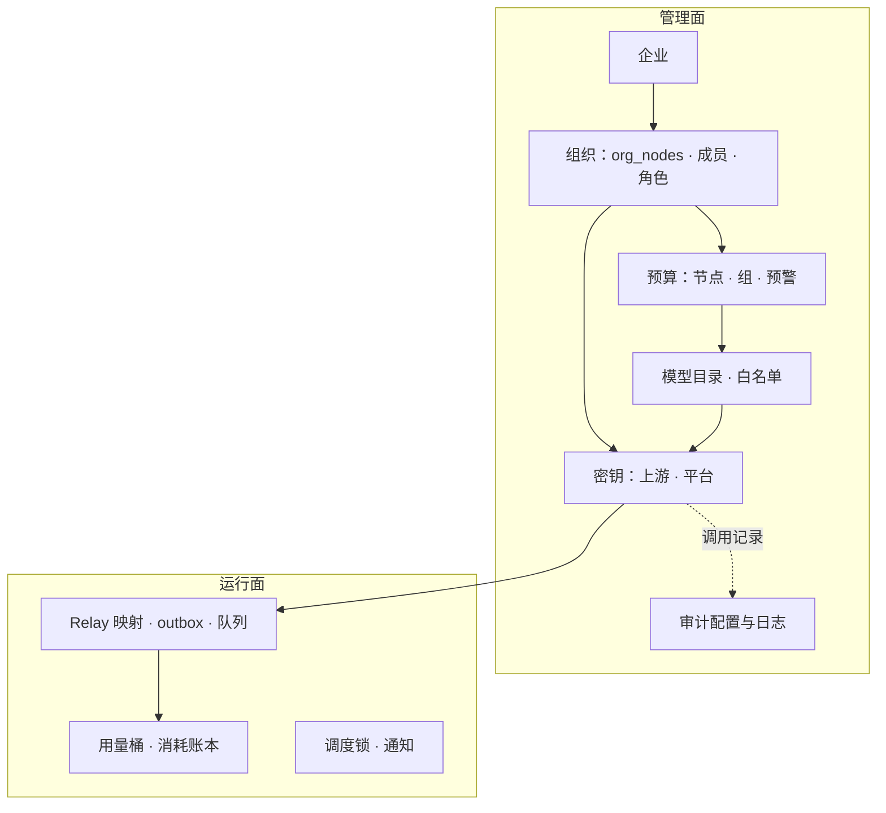
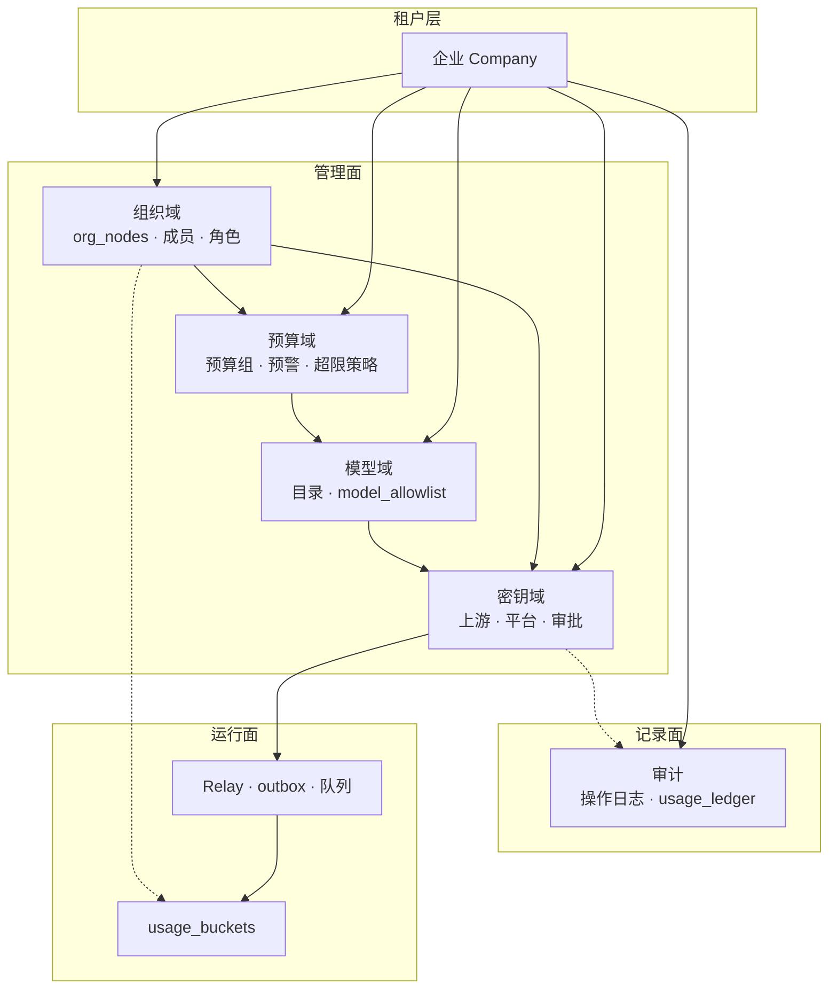
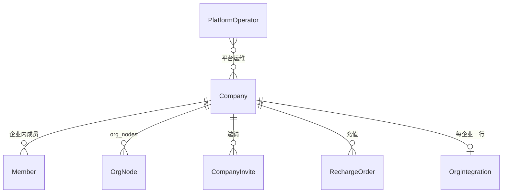
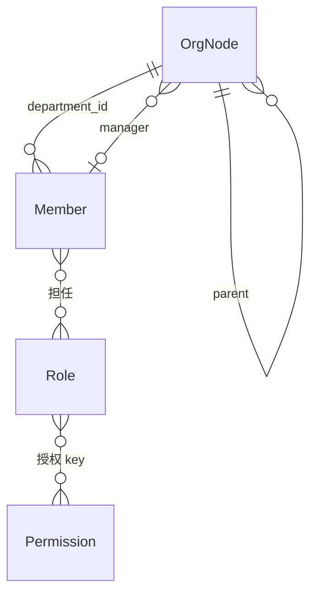
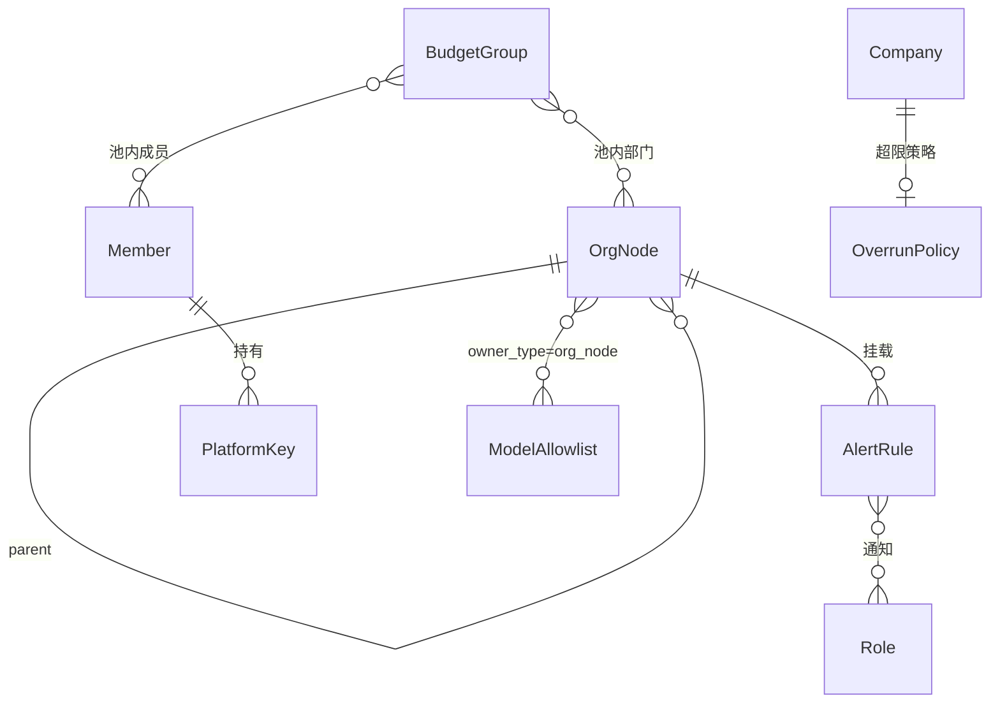
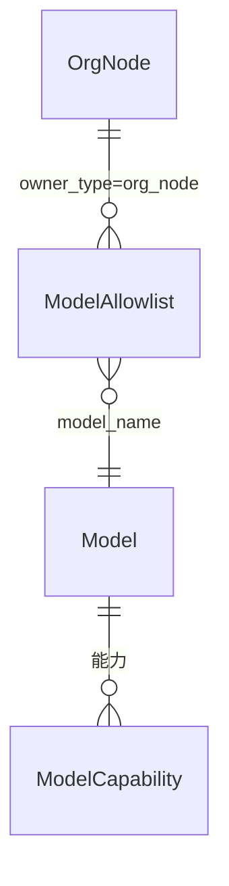
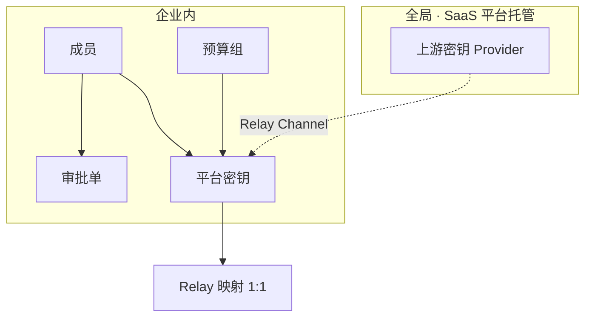
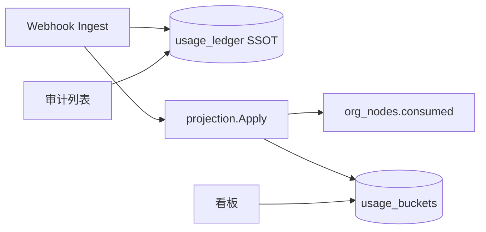
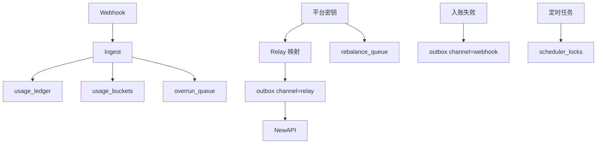
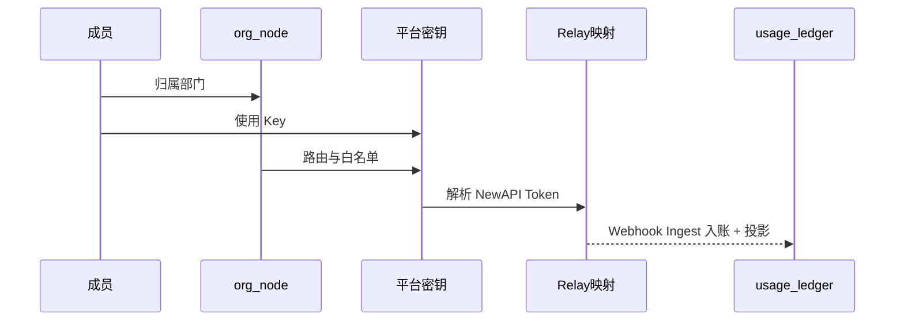

# Backend 存储架构

本文说明 TokenJoy 后端在 **Postgres** 里持久化了哪些**业务实体**，以及它们之间如何关联。字段级定义以 `apps/backend/internal/store/postgres/schema.sql` 为准（共 **36** 张表）。

**相关文档：** [Backend-设计.md](./Backend-设计.md) · [Backend-存储实体优化.md](./Backend-存储实体优化.md) · [Backend-命名规范.md](./Backend-命名规范.md) · [Backend-SaaS多租户架构.md](./Backend-SaaS多租户架构.md)

**运维约定：** 表结构只改 `schema.sql`，服务启动时全量应用；本地改结构后 `docker compose down -v` 重建。

---

## 1. 整体图景

| 层次       | 存什么                                             | 读写特点             |
| ---------- | -------------------------------------------------- | -------------------- |
| **管理面** | 企业、组织、预算、密钥、模型目录、审计配置         | 控制台改；变更频率低 |
| **运行面** | 用量汇总、Relay 映射、异步队列、分布式锁、通知记录 | 程序自动写；追加型多 |

管理面决定「谁、在哪个部门、有多少额度、能用哪些模型」；运行面记录「实际调用了多少、Relay 同步到哪一步」。

---

## 2. 核心实体关系

图例：`1 ── N` 一对多 · `N ── M` 多对多（经关联表）· `…` 虚线逻辑关联无强制 FK · **同 ID** 主键相同非外键指向

### 2.1 域级总图

**读法（5 句）：**

1. **企业**是顶层租户盒子。
2. **组织节点**（`org_nodes`）同时承载部门、预算、路由；HTTP 仍分 `Department` / `BudgetNode` / `RoutingRule` 投影。
3. **平台密钥**连组织、预算组、模型白名单，再经 **Relay** 连 NewAPI。
4. **usage_ledger** 是消耗 SSOT；**usage_buckets** 是看板投影；Ingest 同步更新 `consumed` / `used`。
5. **上游密钥** SaaS 下由平台全局托管（见 §2.6）。

### 2.2 租户与企业

企业行记 **`newapi_wallet_user_id`**（NewAPI 企业钱包 `users.id`）；钱包余额不在 Postgres。

### 2.3 组织与权限

- 成员只属于一个组织节点；`members.department_id` 语义为 `org_node_id`。
- 组织同步：`org_integration`（配置）+ `org_sync_logs` / `org_import_failures`（追加日志）。

### 2.4 预算

| 对比   | 组织节点（`org_nodes`） | 预算组（`budget_groups`） |
| ------ | ----------------------- | ------------------------- |
| 结构   | 树形，跟组织架构走      | 扁平池                    |
| 用途   | 逐级分配组织预算        | 多人/多部门共用额度       |
| 与密钥 | 间接（经部门归因）      | Key 可直接挂组计费        |

组织树变更：`Org().Nodes().SetTree` + `Models().Allowlist().Replace`（单事务）。  
成员个人额度：`members.personal_quota` 列（与成员 1:1）。

### 2.5 模型与路由

路由列在 `org_nodes`；白名单在 **`model_allowlist`**。`RoutingRule.id` = `nodeId`。

成员所在部门 → 对应节点 → 查该节点（及继承）的路由与白名单。

### 2.6 密钥

模型白名单统一在 **`model_allowlist`**（`platform_key` / `org_node` / `key_approval`）。

### 2.7 审计与用量

| 数据                | 用途               | 写入方          |
| ------------------- | ------------------ | --------------- |
| `usage_ledger`      | 审计、对账、minute | Ingest          |
| `usage_buckets`     | 看板 hour/day 趋势 | Ingest 同步投影 |
| `consumed` / `used` | 超限、Rebalance    | Ingest 同步投影 |

### 2.8 运行面

| 实体              | 作用                                     |
| ----------------- | ---------------------------------------- |
| `relay_mappings`  | 平台密钥 ↔ NewAPI Token；冗余归因字段    |
| `outbox`          | Relay / Webhook 异步重试（按 `channel`） |
| `usage_ledger`    | 消耗事实 SSOT；幂等 `ON CONFLICT`        |
| `usage_buckets`   | 看板预聚合                               |
| `rebalance_queue` | 配额再平衡待办                           |
| `overrun_queue`   | 超限封禁待办                             |
| `scheduler_locks` | 多实例定时任务互斥                       |

---

## 3. 表的四种形态

36 张表按**存储形态**拆分，不等于 36 个独立业务概念：

| 形态            | 举例                           |
| --------------- | ------------------------------ |
| **主表**        | 成员、平台密钥、`org_nodes`    |
| **关联表**      | 成员↔角色、`model_allowlist`   |
| **单行配置**    | 超限策略、`org_integration`    |
| **日志 / 队列** | 调用日志、`outbox`、各类 queue |

树形结构用**父节点引用**（邻接表），读出时在应用层组装嵌套树。

---

## 4. 各域实体清单

### 4.1 组织域

| 实体 / 表                  | 说明                                           |
| -------------------------- | ---------------------------------------------- |
| 组织节点 `org_nodes`       | 部门 + 预算 + 路由列                           |
| 成员 `members`             | 可登录用户；`department_id` = org_node ID      |
| 角色 / 权限                | `roles`、`permissions`、关联表                 |
| 组织集成 `org_integration` | 连接、同步策略、加密凭证（每企业一行）         |
| 同步日志 / 导入失败        | `org_sync_logs`、`org_import_failures`（追加） |

### 4.2 预算域

| 实体 / 表                         | 说明                                            |
| --------------------------------- | ----------------------------------------------- |
| 组织节点 `org_nodes`              | `budget`、`consumed`、`reserved_pool`、`period` |
| 预算组 + 关联表                   | 跨部门/成员共享池                               |
| 成员个人额度                      | `members.personal_quota`                        |
| 超限策略 `overrun_policy`         | 每企业一行                                      |
| 预警 `alert_rules` + 通知角色关联 | 挂在 org_node 上                                |

### 4.3 密钥域

| 实体 / 表                | 说明                                 |
| ------------------------ | ------------------------------------ |
| 上游密钥 `provider_keys` | SaaS 平台托管；私有化企业超管可维护  |
| 平台密钥 `platform_keys` | `quota` / `used`；可选持有人、预算组 |
| 审批单 `key_approvals`   | 流程态；模型列表在 `model_allowlist` |
| Relay 映射               | 1:1 平台密钥；冗余成员/部门/组 ID    |

### 4.4 模型域

| 实体 / 表                     | 说明                       |
| ----------------------------- | -------------------------- |
| 模型目录 `models`             | 供应商、定价、上下文长度   |
| 能力标签 `model_capabilities` | 如 vision、function_call   |
| 白名单 `model_allowlist`      | 密钥 / 节点路由 / 审批共用 |

### 4.5 审计域

| 实体 / 表                 | 说明                        |
| ------------------------- | --------------------------- |
| 审计设置 `audit_settings` | `contentRetentionEnabled`   |
| 操作日志 `operation_logs` | 控制台管理操作（追加）      |
| 消耗账本 `usage_ledger`   | 调用 SSOT；审计列表只读此表 |

### 4.6 运行面

见 §2.8；不参与控制台常规 CRUD。

---

## 5. SaaS 多企业

产品里的**企业（Company）**对应 `companies` 及 `company_id` 列。详见 [Backend-SaaS多租户架构.md](./Backend-SaaS多租户架构.md)。

| 范围           | 说明                                      |
| -------------- | ----------------------------------------- |
| **按企业隔离** | 组织、预算、平台密钥、审计、Relay、用量等 |
| **全局共享**   | 上游密钥池（SaaS）、权限目录              |
| **每企业一行** | 超限策略、`org_integration` 等            |

NewAPI 企业钱包存在 `users.quota`；TokenJoy 在 `companies.newapi_wallet_user_id` 记映射 ID。

---

## 6. 一次 API 调用涉及的实体

1. 成员登录企业，持角色与权限，归属某 **org_node**。
2. 节点决定路由、预警；成员持有 **platform_key**（可挂预算组）。
3. 请求经 **relay_mappings** 找到 NewAPI Token。
4. 调用后 Ingest 写 **usage_ledger** + 投影 **usage_buckets** / **consumed** / **used**。
5. 必要时 **rebalance_queue**、**overrun_queue** 异步处理。

### 关键 ID 约定

| 约定               | 含义                            |
| ------------------ | ------------------------------- |
| `department_id`    | org_node ID（物理列名保留）     |
| `RoutingRule.id`   | = `nodeId` = `org_nodes.id`     |
| Relay 映射冗余字段 | 平台密钥、成员、部门、预算组 ID |
| 用量桶维度         | 时间桶 + 部门 + 成员 + 模型     |

---

## 7. 概念实体 vs 物理表

| 层次         | 大约数量 | 说明                       |
| ------------ | -------- | -------------------------- |
| **概念实体** | ~14 个   | 产品语言中的业务对象       |
| **物理表**   | 36 张    | 关联表、配置行、队列等拆分 |

**组织节点** = 部门 + 预算 + 路由（一棵树、一个 ID）；**成员** = 登录用户 + 个人额度。预算组、两类密钥、用量/审计双轨、Relay 映射等**保持独立**——拆分是为读写路径与生命周期，不是领域设计冗余。

四张合并型核心表（`org_nodes`、`model_allowlist`、`org_integration`、`outbox`）详见 [Backend-存储实体优化.md](./Backend-存储实体优化.md)。

---

## 8. 常见问题

| 问题                   | 答案                                     |
| ---------------------- | ---------------------------------------- |
| 一共多少张表？         | **36**                                   |
| 部门树怎么存？         | `org_nodes.parent_id`；读出时组装嵌套树  |
| 部门和预算什么关系？   | 同一 `org_nodes` 行；HTTP 分 API 投影    |
| 白名单为什么用模型名？ | 与模型目录解耦，按名称匹配               |
| 看板用量从哪来？       | **usage_buckets**                        |
| 审计列表从哪来？       | **usage_ledger**                         |
| 私有化要关心企业吗？   | 逻辑上仍有一家默认企业（`company_id=1`） |

---

## 9. 下一步阅读

- 接口与分层：[Backend-设计.md](./Backend-设计.md)
- 入账与投影：[Backend-消耗数据SSOT对齐方案.md](./Backend-消耗数据SSOT对齐方案.md)
- 预算运作：[Backend-预算运作.md](./Backend-预算运作.md)
- 表字段明细：`apps/backend/internal/store/postgres/schema.sql`
