# Backend 存储架构

本文说明 TokenJoy 后端在 **Postgres** 里持久化了哪些**业务实体**，以及它们之间如何关联。面向「先建立心智模型、再查表结构」的阅读顺序；字段级定义以 `apps/backend/internal/store/postgres/schema.sql` 为准（共 **44** 张表）。

不涉及 SQL 明细、Repository 实现或 HTTP 接口。

**相关文档：** [Backend-设计.md](./Backend-设计.md) · [Backend-SaaS多租户架构.md](./Backend-SaaS多租户架构.md) · [Backend-命名规范.md](./Backend-命名规范.md)

---

## 1. 先建立整体图景

可以把数据库里的东西分成两层：

| 层次       | 存什么                                             | 读写特点                           |
| ---------- | -------------------------------------------------- | ---------------------------------- |
| **管理面** | 企业、组织、预算、密钥、模型目录、审计配置         | 人在控制台改；变更频率低           |
| **运行面** | 用量汇总、Relay 映射、异步队列、分布式锁、通知记录 | 程序自动写；追加多、查询按场景分流 |

管理面决定「谁、在哪个部门、有多少额度、能用哪些模型」；运行面记录「实际调用了多少、Relay 同步到哪一步」。

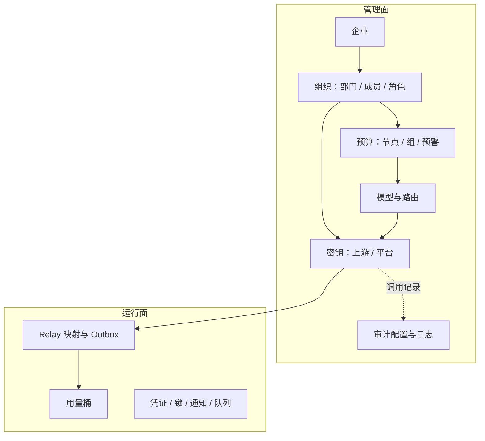
```mermaid
flowchart TB
  subgraph mgmt [管理面]
    CO[企业]
    ORG[组织：部门 / 成员 / 角色]
    BUD[预算：节点 / 组 / 预警]
    KEY[密钥：上游 / 平台]
    MOD[模型与路由]
    AUD[审计配置与日志]
  end

  subgraph runtime [运行面]
    USG[用量桶]
    RLY[Relay 映射与 Outbox]
    OPS[凭证 / 锁 / 通知 / 队列]
  end

  CO --> ORG
  ORG --> BUD
  ORG --> KEY
  MOD --> KEY
  BUD --> MOD
  KEY --> RLY
  RLY --> USG
  KEY -.->|调用记录| AUD
```

**运维约定：** 表结构只改 `schema.sql`，服务启动时全量应用；本地改结构后 `docker compose down -v` 重建。

---

## 2. 核心实体与关系

本章分两层看图：**§2.1 高纬度总图**只看域与域之间怎么连；**§2.2～§2.8 细分图**每个域单独展开，每张图控制在 5～8 个实体以内。

图例（下文所有细分图通用）：

| 符号      | 含义                           |
| --------- | ------------------------------ |
| `1 ── 1`  | 一一对应                       |
| `1 ── N`  | 一对多                         |
| `N ── M`  | 多对多（经关联表）             |
| `…` 虚线  | 逻辑关联，库内无强制外键       |
| **同 ID** | 两行记录主键相同，不是外键指向 |

---

### 2.1 高纬度总图（域与域）

先建立「谁包住谁、谁依赖谁」的全局骨架；细节留给后面的细分图。

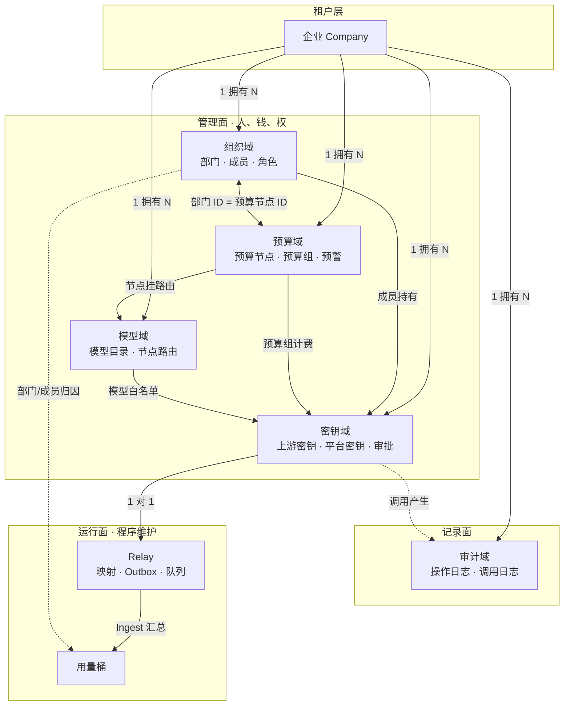
```mermaid
flowchart TB
  subgraph L0 [租户层]
    CO[企业 Company]
  end

  subgraph L1 [管理面 · 人、钱、权]
    direction TB
    ORG[组织域<br/>部门 · 成员 · 角色]
    BUD[预算域<br/>预算节点 · 预算组 · 预警]
    KEY[密钥域<br/>上游密钥 · 平台密钥 · 审批]
    MOD[模型域<br/>模型目录 · 节点路由]
  end

  subgraph L2 [记录面]
  AUD[审计域<br/>操作日志 · 调用日志]
  end

  subgraph L3 [运行面 · 程序维护]
    RLY[Relay<br/>映射 · Outbox · 队列]
    USG[用量桶]
  end

  CO -->|1 拥有 N| ORG
  CO -->|1 拥有 N| BUD
  CO -->|1 拥有 N| KEY
  CO -->|1 拥有 N| MOD
  CO -->|1 拥有 N| AUD

  ORG <-->|部门 ID = 预算节点 ID| BUD
  ORG -->|成员持有| KEY
  BUD -->|预算组计费| KEY
  BUD -->|节点挂路由| MOD
  MOD -->|模型白名单| KEY

  KEY -->|1 对 1| RLY
  RLY -->|Ingest 汇总| USG
  KEY -.->|调用产生| AUD
  ORG -.->|部门/成员归因| USG
```

**高纬度读法（5 句话）：**

1. **企业**是顶层盒子；私有化可视为始终只有一家企业。
2. **组织域**与**预算域**共享同一套节点 ID（部门树 = 预算树）。
3. **平台密钥**连组织（持有人）、预算（计费组）、模型（白名单），再经 **Relay** 连外部 NewAPI。
4. **用量桶**给看板；**usage_ledger** 给审计——均经 Ingest 写入，列表只读账本。
5. **上游密钥**在 SaaS 下由平台全局托管，不画进企业盒子里（见 §2.6）。

---

### 2.2 租户与企业

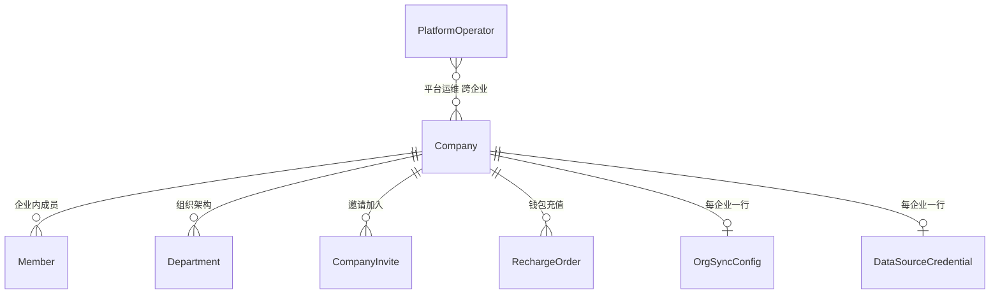
```mermaid
erDiagram
  Company ||--o{ Member : "企业内成员"
  Company ||--o{ Department : "组织架构"
  Company ||--o{ CompanyInvite : "邀请加入"
  Company ||--o{ RechargeOrder : "钱包充值"
  Company ||--o| OrgSyncConfig : "每企业一行"
  Company ||--o| DataSourceCredential : "每企业一行"
  PlatformOperator }o--o{ Company : "平台运维 跨企业"
```

| 关系                         | 基数          | 说明                                    |
| ---------------------------- | ------------- | --------------------------------------- |
| 企业 → 成员 / 部门           | 1 : N         | 成员、部门均带 `company_id`             |
| 企业 → 邀请 / 充值单         | 1 : N         | 流程类实体，独立生命周期                |
| 企业 → 同步策略 / 数据源凭证 | 1 : 1         | 每企业一行配置                          |
| 平台运营 → 企业              | N : M（逻辑） | 平台面 API 可管所有企业，无「归属」外键 |

企业行上记 **`newapi_wallet_user_id`**（企业钱包用户 ID，对应 NewAPI `users.id`），钱包余额本身不在 Postgres。

---

### 2.3 组织与权限

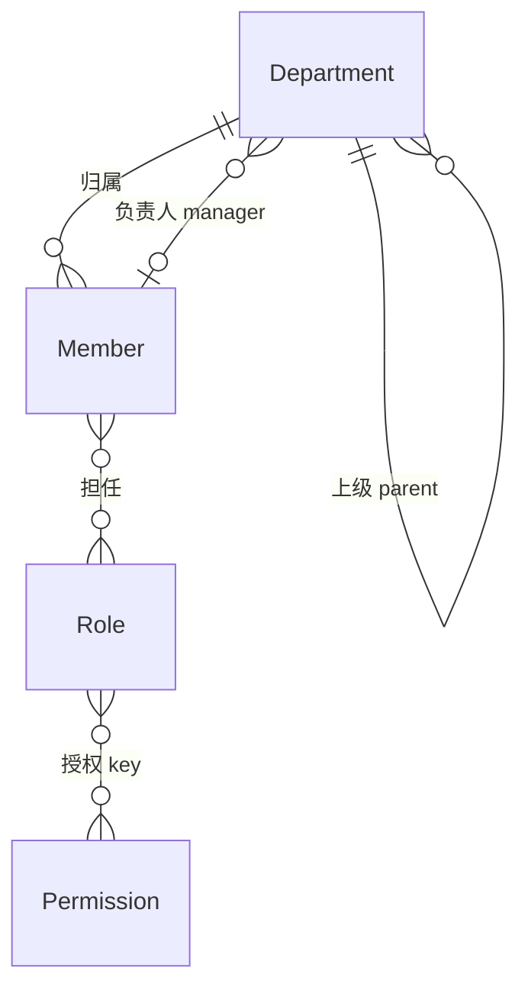
```mermaid
erDiagram
  Department ||--o{ Department : "上级 parent"
  Department ||--o{ Member : "归属"
  Department }o--o| Member : "负责人 manager"
  Member }o--o{ Role : "担任"
  Role }o--o{ Permission : "授权 key"
```

| 关系          | 基数     | 说明                                     |
| ------------- | -------- | ---------------------------------------- |
| 部门 → 子部门 | 1 : N    | 树形；`parent_id` 自引用                 |
| 部门 → 成员   | 1 : N    | 当前模型：成员只属于一个部门             |
| 部门 → 负责人 | N : 0..1 | 负责人是某个成员；与「成员归属部门」交叉 |
| 成员 ↔ 角色   | N : M    | 经「成员-角色」关联表                    |
| 角色 ↔ 权限   | N : M    | 存权限字符串 key；不强制 FK 到权限目录   |

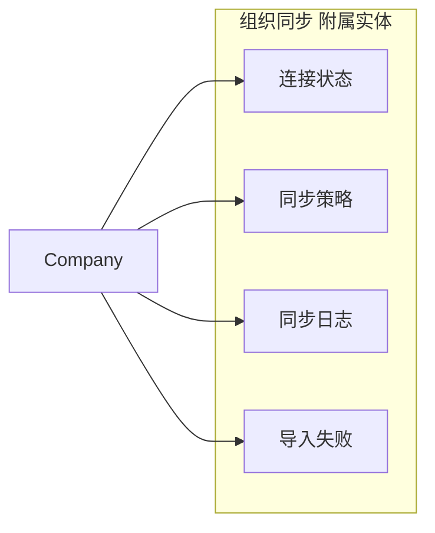
```mermaid
flowchart LR
  subgraph sync [组织同步 附属实体]
    ST[连接状态]
    CFG[同步策略]
    LOG[同步日志]
    FAIL[导入失败]
  end
  Company --> ST
  Company --> CFG
  Company --> LOG
  Company --> FAIL
```

同步四类实体都挂在企业下：前两个是配置/状态，后两个是只追加记录。

---

### 2.4 预算与组织对齐

这是最容易绕晕的一处：**部门**与**预算节点**是同一棵树的两个名字。

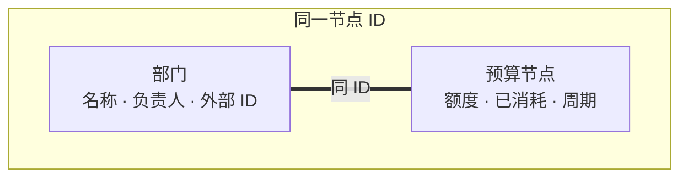
```mermaid
flowchart TB
  subgraph same [同一节点 ID]
    D[部门<br/>名称 · 负责人 · 外部 ID]
    B[预算节点<br/>额度 · 已消耗 · 周期]
  end
  D ===|同 ID| B
```

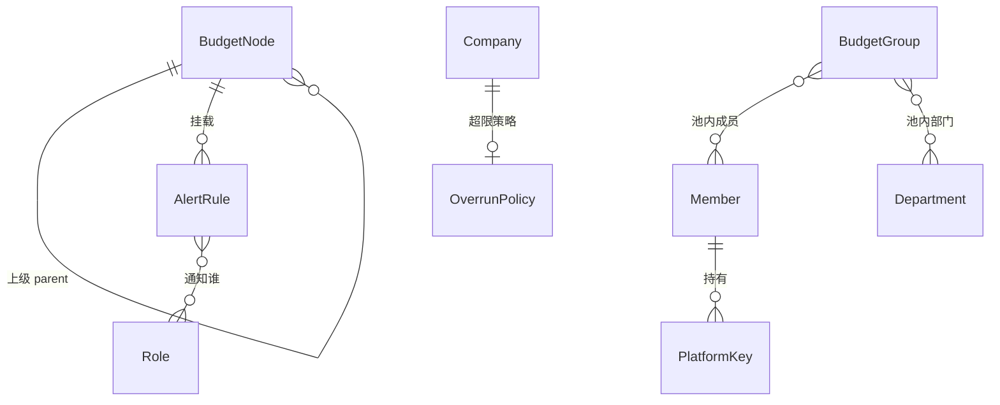
```mermaid
erDiagram
  BudgetNode ||--o{ BudgetNode : "上级 parent"
  BudgetNode ||--o{ AlertRule : "挂载"
  AlertRule }o--o{ Role : "通知谁"
  BudgetGroup }o--o{ Member : "池内成员"
  BudgetGroup }o--o{ Department : "池内部门"
  Member ||--o{ PlatformKey : "持有"
  Company ||--o| OverrunPolicy : "超限策略"
```

| 关系                 | 基数               | 说明                     |
| -------------------- | ------------------ | ------------------------ |
| 部门 ↔ 预算节点      | **1 : 1（同 ID）** | 改部门树须同事务改预算树 |
| 预算节点 → 子节点    | 1 : N              | 与部门树结构一致         |
| 预算节点 → 预警规则  | 1 : N              | 规则上冗余节点名便于展示 |
| 预警规则 ↔ 角色      | N : M              | 触发时通知哪些角色       |
| 预算组 ↔ 成员 / 部门 | N : M              | 跨组织共享额度池         |
| 成员 → 个人额度      | 1 : 0..1           | 与成员 1:1 的独立行      |
| 企业 → 超限策略      | 1 : 1              | 花超后的全局行为         |

**预算组 vs 预算节点：** 节点跟部门树走（逐级分配）；组是扁平「池子」，平台密钥可直接挂到组上计费。

---

### 2.5 模型与路由

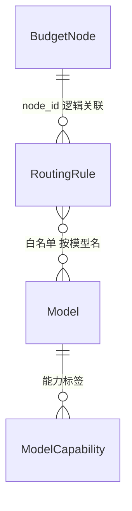
```mermaid
erDiagram
  Model ||--o{ ModelCapability : "能力标签"
  BudgetNode ||--o{ RoutingRule : "node_id 逻辑关联"
  RoutingRule }o--o{ Model : "白名单 按模型名"
```

| 关系                     | 基数  | 说明                           |
| ------------------------ | ----- | ------------------------------ |
| 模型 → 能力              | 1 : N | 如 vision、function_call       |
| 预算/部门节点 → 路由规则 | 1 : N | `node_id` = 组织节点 ID        |
| 路由规则 ↔ 模型          | N : M | 白名单存**模型名**，非模型主键 |

路由挂在**组织节点**上：成员所在部门 → 对应节点 → 查该节点（及继承）的路由与模型白名单。

---

### 2.6 密钥与审批

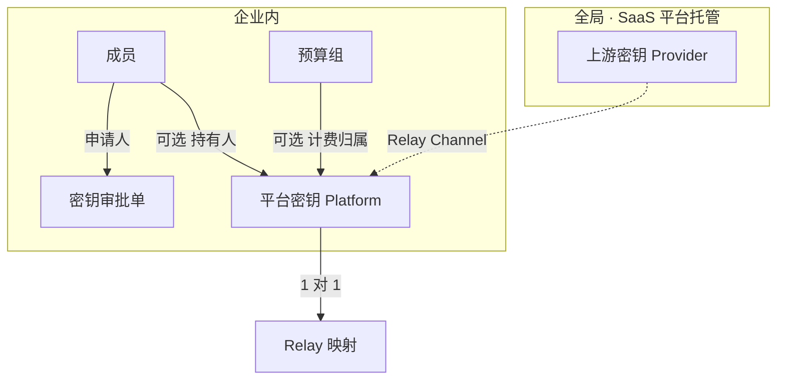
```mermaid
flowchart TB
  subgraph global [全局 · SaaS 平台托管]
    PK[上游密钥 Provider]
  end

  subgraph corp [企业内]
    PLK[平台密钥 Platform]
    APP[密钥审批单]
    M[成员]
    BG[预算组]
  end

  PK -.->|Relay Channel| PLK
  M -->|可选 持有人| PLK
  BG -->|可选 计费归属| PLK
  M -->|申请人| APP
  PLK -->|1 对 1| RM[Relay 映射]
```

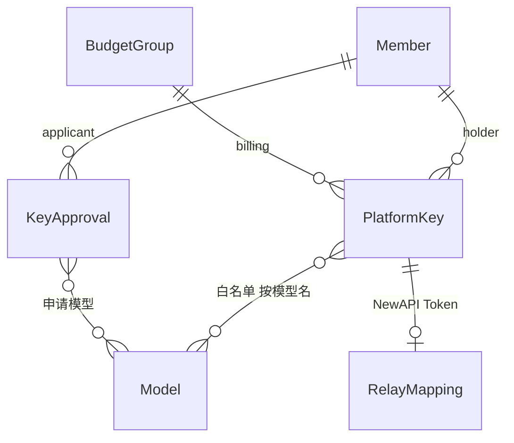
```mermaid
erDiagram
  Member ||--o{ PlatformKey : "holder"
  BudgetGroup ||--o{ PlatformKey : "billing"
  PlatformKey }o--o{ Model : "白名单 按模型名"
  Member ||--o{ KeyApproval : "applicant"
  KeyApproval }o--o{ Model : "申请模型"
  PlatformKey ||--o| RelayMapping : "NewAPI Token"
```

| 关系                  | 基数     | 说明                                        |
| --------------------- | -------- | ------------------------------------------- |
| 上游密钥              | 全局表   | 私有化可由企业超管维护；SaaS 由平台运营维护 |
| 成员 → 平台密钥       | 1 : N    | 持有人可选；也可纯应用 Key                  |
| 预算组 → 平台密钥     | 1 : N    | 计费归属可选                                |
| 平台密钥 ↔ 模型       | N : M    | 白名单按模型名                              |
| 成员 → 审批单         | 1 : N    | 流程态，通过后生成或调整密钥                |
| 平台密钥 → Relay 映射 | 1 : 0..1 | 映射行冗余成员/部门/组 ID，供热路径查询     |

---

### 2.7 审计与用量

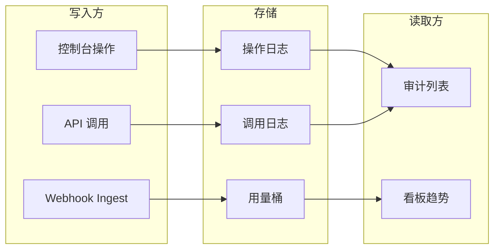
```mermaid
flowchart LR
  subgraph write [写入方]
    CON[控制台操作]
    API[API 调用]
    WH[Webhook Ingest]
  end

  subgraph store [存储]
    OL[操作日志]
    CL[调用日志]
    UB[用量桶]
  end

  subgraph read [读取方]
    AUD[审计列表]
    DASH[看板趋势]
  end

  CON --> OL --> AUD
  API --> CL --> AUD
  WH --> UB --> DASH
```

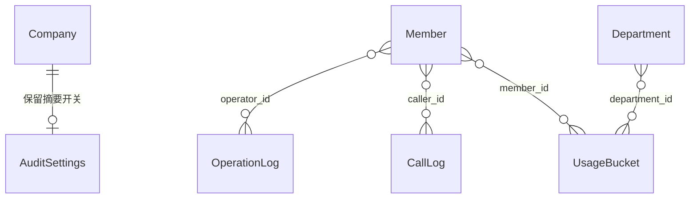
```mermaid
erDiagram
  Company ||--o| AuditSettings : "保留摘要开关"
  Member }o--o{ OperationLog : "operator_id"
  Member }o--o{ CallLog : "caller_id"
  Department }o--o{ UsageBucket : "department_id"
  Member }o--o{ UsageBucket : "member_id"
```

| 关系                                 | 基数          | 说明                                       |
| ------------------------------------ | ------------- | ------------------------------------------ |
| 企业 → 审计设置                      | 1 : 1         | 是否保留请求/响应摘要                      |
| 成员 → 操作/调用日志                 | 1 : N（逻辑） | 无强制 FK，成员删后日志仍可查              |
| 部门 + 成员 + 模型 + 时间桶 → 用量桶 | 复合主键      | 聚合事实；Ingest **不回写**预算 `consumed` |

---

### 2.8 运行面（Relay 与队列）

不参与控制台 CRUD；由 Worker / Ingest 读写。

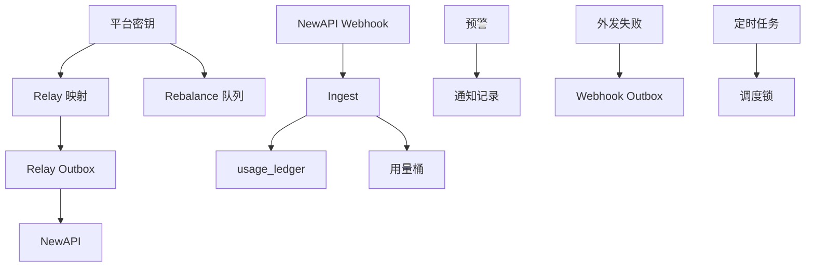
```mermaid
flowchart TB
  PLK[平台密钥] --> RM[Relay 映射]
  RM --> RO[Relay Outbox]
  RO --> NA[NewAPI]

  WH[NewAPI Webhook] --> ING[Ingest]
  ING --> UL[usage_ledger]
  ING --> UB[用量桶]

  PLK --> RQ[Rebalance 队列]
  AR[预警] --> NL[通知记录]
  FAIL[外发失败] --> WO[Webhook Outbox]

  SCH[定时任务] --> LOCK[调度锁]
```

| 实体           | 与谁相关                 | 作用                                    |
| -------------- | ------------------------ | --------------------------------------- |
| Relay 映射     | 平台密钥 1:1             | 记 NewAPI Token、同步状态、冗余归因字段 |
| Relay Outbox   | 密钥生命周期             | 创建/更新 Token 等异步任务              |
| 消耗账本       | Ingest                   | `usage_ledger`；`ON CONFLICT` 幂等      |
| 用量桶         | 部门 + 成员 + 模型       | 看板聚合（投影）                        |
| Rebalance 队列 | 企业 + 轴（钱包/组/Key） | 配额再平衡待办                          |
| Overrun 队列   | Ingest 副作用            | 超限封禁待办                            |
| 调度锁         | 全局                     | 多实例定时任务互斥                      |

---

### 2.9 跨域一眼串起来

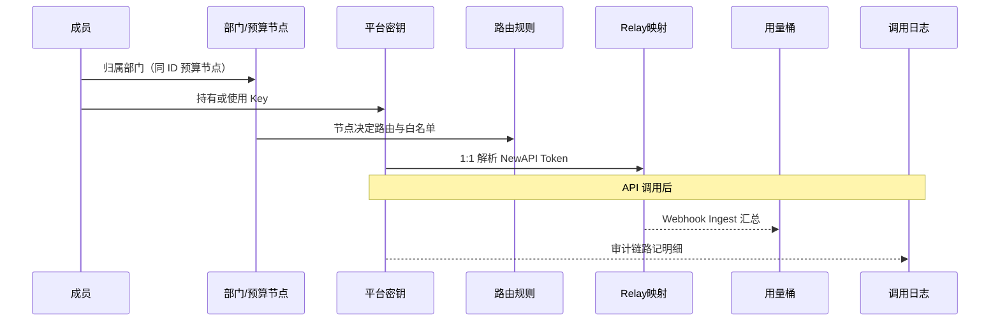
```mermaid
sequenceDiagram
  participant M as 成员
  participant D as 部门/预算节点
  participant PK as 平台密钥
  participant RR as 路由规则
  participant RM as Relay映射
  participant UB as 用量桶
  participant CL as 调用日志

  M->>D: 归属部门（同 ID 预算节点）
  M->>PK: 持有或使用 Key
  D->>RR: 节点决定路由与白名单
  PK->>RM: 1:1 解析 NewAPI Token
  Note over PK,CL: API 调用后
  RM-->>UB: Webhook Ingest 汇总
  PK-->>CL: 审计链路记明细
```

**读图顺序建议：** §2.1 总图 → §2.3 组织 → §2.4 预算对齐 → §2.5 模型 → §2.6 密钥 → §2.7 审计/用量 → §2.8 运行面。各域实体清单与字段说明见 §4～§9。

---

## 3. 表的四种形态（为何有 44 张表）

44 张表不等于 44 个独立业务概念，而是按**存储形态**拆分：

| 形态            | 含义               | 举例                     |
| --------------- | ------------------ | ------------------------ |
| **主表**        | 一行一个业务对象   | 成员、平台密钥、预算节点 |
| **关联表**      | 多对多关系拆出去   | 成员↔角色、密钥↔模型     |
| **单行配置**    | 全库或每企业仅一行 | 超限策略、组织同步策略   |
| **日志 / 队列** | 只追加或异步消费   | 调用日志、Relay 待发任务 |

树形结构（部门树、预算树）用**父节点引用**存成邻接表，读出时在应用层组装成嵌套树，没有单独的「子节点表」。

---

## 4. 组织域：谁属于哪个部门、能做什么

### 4.1 实体清单

| 实体     | 说明                                                   |
| -------- | ------------------------------------------------------ |
| **部门** | 公司组织架构；可多级；有上级部门、可选负责人           |
| **成员** | 企业内可登录控制台的人；归属某个部门                   |
| **角色** | 如超管、部门管理员；可挂多个权限                       |
| **权限** | 系统预置目录（只读）；角色通过「授权记录」引用权限标识 |

此外还有：**数据源连接状态**、**定时同步策略**、**同步执行记录**、**导入失败明细**——服务于从飞书等外部系统拉组织数据。

### 4.2 关系说明

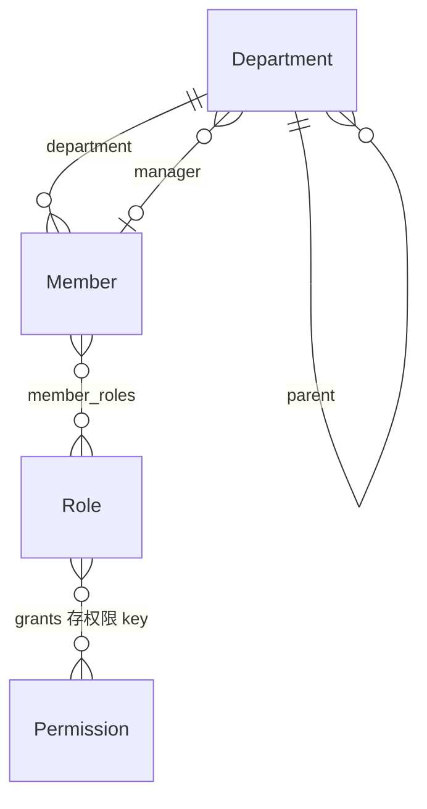
```mermaid
erDiagram
  Department ||--o{ Department : "parent"
  Department ||--o{ Member : "department"
  Department }o--o| Member : "manager"
  Member }o--o{ Role : "member_roles"
  Role }o--o{ Permission : "grants 存权限 key"
```

- 一个**部门**下有多个**成员**；一个**成员**只属于一个部门（当前模型）。
- **部门负责人**指向某个成员，与「成员归属部门」形成交叉引用，建库时分步加外键。
- **成员 ↔ 角色**、**角色 ↔ 权限**均为多对多；权限侧存的是字符串 key（如 `org:*`），不强制外键到权限目录表。

### 4.3 组织同步在存什么

| 类型     | 作用                   |
| -------- | ---------------------- |
| 连接状态 | 飞书等数据源是否连通   |
| 同步策略 | 多久自动同步一次       |
| 同步日志 | 每次执行的结果（追加） |
| 导入失败 | 某条记录为何没进来     |

---

## 5. 预算域：钱花在哪、怎么控

### 5.1 实体清单

| 实体             | 说明                                               |
| ---------------- | -------------------------------------------------- |
| **预算节点**     | 与部门一一对应的预算树节点；含额度、已消耗、周期等 |
| **预算组**       | 跨部门/成员的共享额度池                            |
| **成员个人额度** | 某成员独享的上限（与成员 1:1）                     |
| **超限策略**     | 全企业（或全局）花超了怎么办                       |
| **预警规则**     | 挂在某个预算节点上；可指定通知哪些角色             |

### 5.2 部门与预算：最重要的对齐关系

**每个部门的 ID 等于对应预算节点的 ID。** 不是外键关联，而是刻意设计成「同 ID」：

- 改部门树（增删移节点）时，必须在**同一事务**里同步改预算树和路由规则。
- 控制台里「组织树」和「预算树」看起来是两棵树，底层是同一套节点 ID。

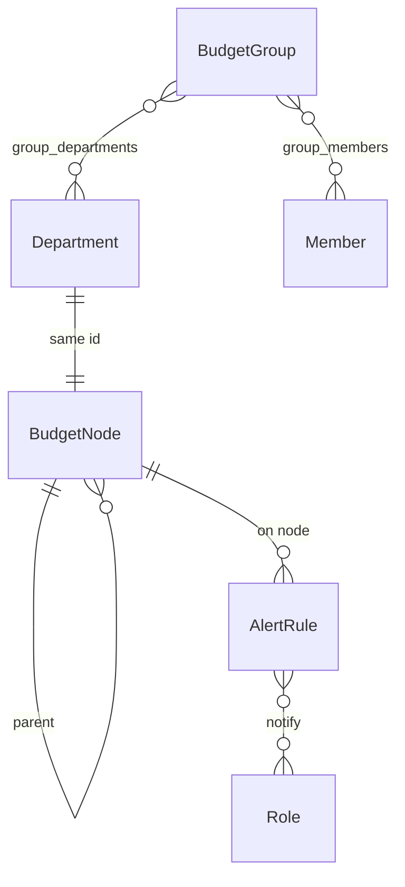
```mermaid
erDiagram
  Department ||--|| BudgetNode : "same id"
  BudgetNode ||--o{ BudgetNode : "parent"
  BudgetGroup }o--o{ Member : "group_members"
  BudgetGroup }o--o{ Department : "group_departments"
  BudgetNode ||--o{ AlertRule : "on node"
  AlertRule }o--o{ Role : "notify"
```

成员个人额度为 `members.personal_quota` 列（已与成员 1:1 合并，无独立 `member_quota_pools` 表）。

### 5.3 预算组 vs 预算节点

|        | 预算节点         | 预算组                       |
| ------ | ---------------- | ---------------------------- |
| 结构   | 跟部门树对齐     | 扁平的「池子」               |
| 用途   | 逐级分配组织预算 | 多人/多部门共用一块额度      |
| 与密钥 | 间接（经部门）   | 平台密钥可直接挂到预算组计费 |

**企业钱包**（NewAPI 侧预付余额）与**部门 budget**是两条轴：充值进钱包；部门额度由超管分配——详见 [Backend-SaaS多租户架构.md](./Backend-SaaS多租户架构.md)。

---

## 6. 密钥域：谁拿 Key、连哪个上游

### 6.1 两类密钥

| 实体                         | 谁管                                 | 用途                                 |
| ---------------------------- | ------------------------------------ | ------------------------------------ |
| **上游密钥（Provider Key）** | 平台运营（SaaS）或企业超管（私有化） | 连接 OpenAI 等真实供应商             |
| **平台密钥（Platform Key）** | 成员或应用持有                       | 调用 TokenJoy / Relay 时使用的 `sk-` |

### 6.2 关系说明

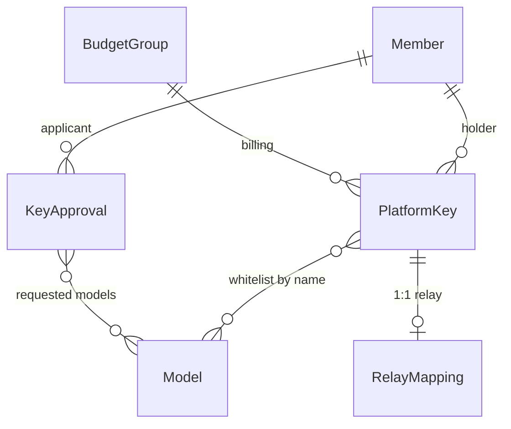
```mermaid
erDiagram
  Member ||--o{ PlatformKey : "holder"
  BudgetGroup ||--o{ PlatformKey : "billing"
  PlatformKey }o--o{ Model : "whitelist by name"
  Member ||--o{ KeyApproval : "applicant"
  KeyApproval }o--o{ Model : "requested models"
  PlatformKey ||--o| RelayMapping : "1:1 relay"
```

- **平台密钥**可选绑定：持有人（成员）、计费归属（预算组）；并冗余保存成员名、组名便于列表展示。
- **模型白名单**存的是**模型名称**，不是模型表的主键 ID——模型目录变更时白名单仍按名称匹配。
- **密钥审批单**：成员申请额度/密钥时产生；附带申请的模型列表。

### 6.3 与 Relay 的衔接

每个平台密钥最多对应一条 **Relay 映射**（1:1），记录其在 NewAPI 里的 Token 身份；映射里会冗余企业、成员、部门、预算组等信息，方便运行态查询，无需每次回表拼装。

---

## 7. 模型域：目录、能力与按节点路由

| 实体               | 说明                                            |
| ------------------ | ----------------------------------------------- |
| **模型**           | 全局目录：供应商、定价、上下文长度等            |
| **模型能力**       | 标签化能力（如是否支持视觉）                    |
| **路由规则**       | 挂在某个组织/预算节点上：该节点下默认走哪条策略 |
| **路由模型白名单** | 该路由允许哪些模型（按名称）                    |

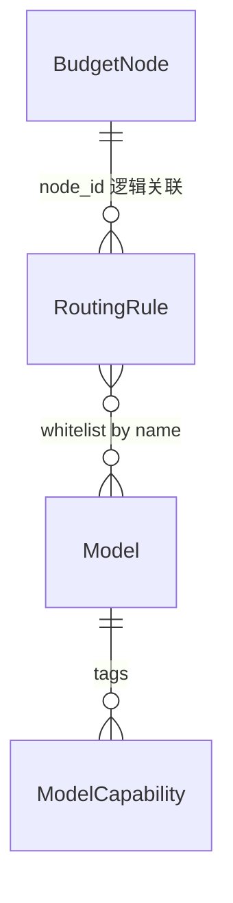
```mermaid
erDiagram
  Model ||--o{ ModelCapability : "tags"
  BudgetNode ||--o{ RoutingRule : "node_id 逻辑关联"
  RoutingRule }o--o{ Model : "whitelist by name"
```

**路由规则的节点 ID** 指向部门/预算节点，与组织树变更联动更新。模型与路由、密钥之间的白名单统一用**模型名**关联，降低目录表 ID 变更的影响。

---

## 8. 审计域：管什么、记什么

| 实体         | 说明                                              |
| ------------ | ------------------------------------------------- |
| **审计设置** | 是否保留 `previewSnippet`（`contentRetentionEnabled`） |
| **操作日志** | 人在控制台做的管理操作（只追加）                  |
| **消耗账本** | `usage_ledger`：调用元数据 SSOT |

操作人、调用人通过成员 ID **逻辑关联**，不强制数据库外键。

**与用量桶的分工：**

| 数据             | 给谁用               | 谁写入          |
| ---------------- | -------------------- | --------------- |
| **用量桶**       | 看板、趋势           | Ingest 同步投影 |
| **usage_ledger** | 审计列表、财务、对账 | Ingest          |

Ingest 同事务更新预算 `consumed` 与用量桶；审计列表只读账本（含可选 `previewSnippet`）。详见 [Backend-消耗数据SSOT对齐方案.md](./Backend-消耗数据SSOT对齐方案.md)。

---

## 9. 运行面：程序在后台维护什么

这些表不参与控制台里的常规 CRUD，由 Worker、Ingest、定时任务读写。

| 实体                    | 职责                                         |
| ----------------------- | -------------------------------------------- |
| **用量桶**              | 按时间桶 × 部门 × 成员 × 模型 聚合的用量事实 |
| **消耗账本**            | `usage_ledger`：调用元数据 SSOT              |
| **Relay 映射**          | 平台密钥 ↔ NewAPI Token                      |
| **Relay 待发队列**      | 创建/更新 Token 等异步任务                   |
| **Webhook 重试队列**    | 外发通知失败后的重试                         |
| **Relay 同步游标**      | 补偿轮询读到哪了                             |
| **预算 Rebalance 队列** | 钱包与 Token 配额再平衡的待办                |
| **Overrun 队列**        | 超限封禁待办（Worker 消费）                  |
| **数据源凭证**          | 飞书等第三方密钥（加密存，每企业一行）       |
| **调度锁**              | 多实例下定时任务互斥                         |
| **通知记录**            | 预警等通知是否已发                           |

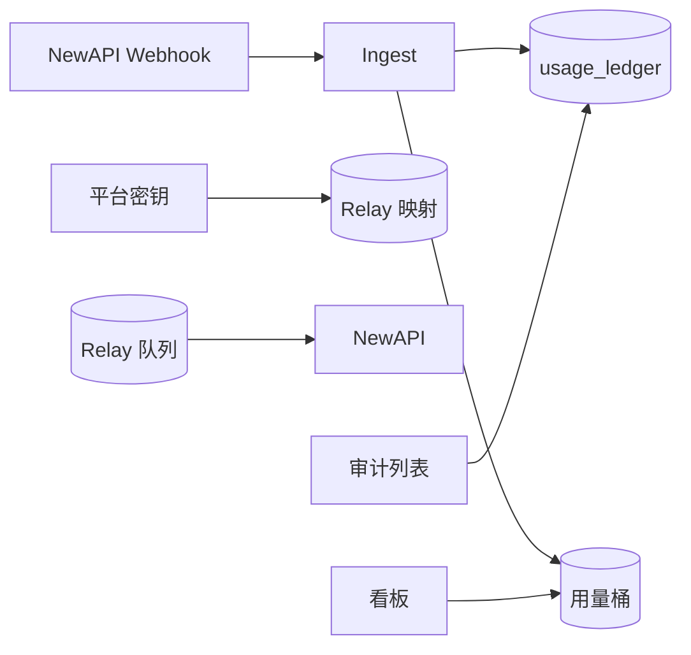
```mermaid
flowchart LR
  WH[NewAPI Webhook] --> ING[Ingest]
  ING --> UL[(usage_ledger)]
  ING --> UB[(用量桶)]
  PK[平台密钥] --> RM[(Relay 映射)]
  OUTBOX[(Relay 队列)] --> NA[NewAPI]
  DASH[看板] --> UB
  AUDIT[审计列表] --> UL
```

---

## 10. SaaS 多企业：实体如何多一层「企业」

产品里的**企业（Company）**在库里对应 `companies` 及 `company_id` 列。详见 [Backend-SaaS多租户架构.md](./Backend-SaaS多租户架构.md)。

### 10.1 多出来的实体

| 实体             | 说明                                                            |
| ---------------- | --------------------------------------------------------------- |
| **企业**         | 付费与隔离边界；关联 `newapi_wallet_user_id`（企业钱包用户 ID） |
| **企业邀请**     | 邀请成员加入                                                    |
| **平台运营账号** | TokenJoy 官方运维登录                                           |
| **充值订单**     | 企业钱包充值记录                                                |

### 10.2 数据归属规则

| 范围                 | 说明                                                                     |
| -------------------- | ------------------------------------------------------------------------ |
| **按企业隔离**       | 组织、预算、平台密钥、审计、Relay、用量等；主键多为「企业 ID + 业务 ID」 |
| **全局共享**         | 上游密钥池（SaaS 由平台托管）、权限目录                                  |
| **原单行配置变多行** | 超限策略、组织同步策略、数据源凭证等——**每个企业一行**                   |

NewAPI 侧「企业钱包」不单独占 Postgres 表，存在 NewAPI `users.quota` 里；TokenJoy 只在 `companies` 上记 **`newapi_wallet_user_id`**（企业钱包用户 ID，非成员）。

---

## 11. 跨域串联：一次 API 调用涉及哪些实体

关系图见 **§2.9**；此处用文字串一遍调用链：

1. **成员**登录某**企业**，持有**角色**与**权限**，归属某**部门**。
2. 该**部门**与**预算节点**同 ID；节点上有**路由规则**和**预警规则**。
3. 成员持有或使用某**平台密钥**；密钥挂了**模型白名单**，计费可能挂在**预算组**。
4. 请求经 Relay：**Relay 映射**找到 NewAPI Token；上游由**上游密钥**或平台 Channel 池承担。
5. 调用结束后：Webhook **Ingest** 写 **usage_ledger**（含可选 `previewSnippet`）+ 同步投影 **用量桶**。
6. 若额度需调整：**Rebalance 队列**、**密钥审批单**参与后续流程。

### 11.1 关键 ID 约定（速查）

| 约定                  | 含义                                           |
| --------------------- | ---------------------------------------------- |
| 部门 ID = 预算节点 ID | 组织树与预算树同一套节点                       |
| 路由节点 ID           | 指向部门/预算节点                              |
| Relay 映射冗余字段    | 平台密钥、成员、部门、预算组 ID 便于热路径查询 |
| 用量桶维度            | 时间桶 + 部门 + 成员 + 模型                    |

---

## 12. 实体能否简化？

44 张表容易让人觉得「实体太多」。这一章回答两件事：**产品里真正有几个概念**，以及**哪些拆分值得保留、哪些可以收敛**。

### 12.1 两层计数：概念实体 vs 物理表

| 层次                     | 大约数量     | 说明                               |
| ------------------------ | ------------ | ---------------------------------- |
| **概念实体**（产品语言） | **约 18 个** | 人脑里要记住的业务对象             |
| **物理表**               | **44 张**    | 为实现关系、配置、日志、队列而拆开 |

概念实体清单（读文档时只需盯住这些）：

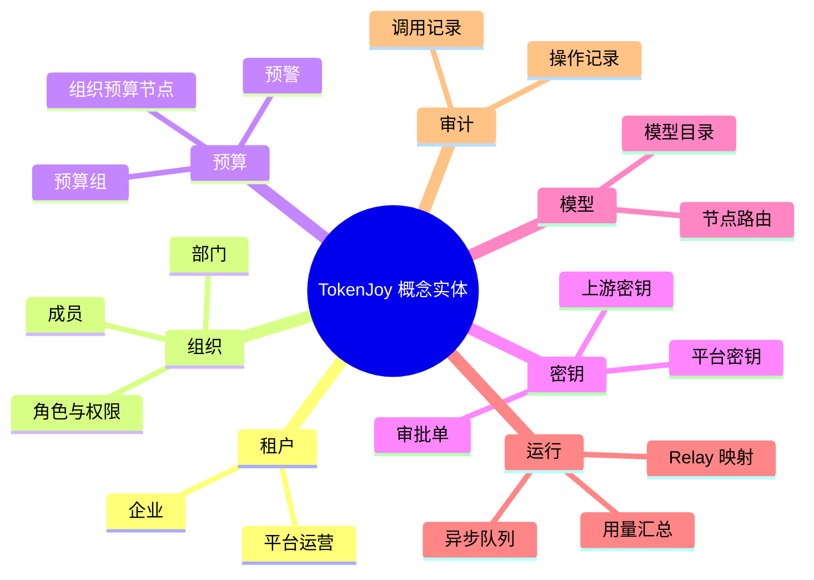
```mermaid
mindmap
  root((TokenJoy 概念实体))
    租户
      企业
      平台运营
    组织
      部门
      成员
      角色与权限
    预算
      组织预算节点
      预算组
      预警
    密钥
      上游密钥
      平台密钥
      审批单
    模型
      模型目录
      节点路由
    运行
      用量汇总
      Relay 映射
      异步队列
    审计
      操作记录
      调用记录
```

其余 26 张表大多是：**多对多关联**、**每企业一行配置**、**只追加日志**、**Outbox / 锁 / 去重**——属于存储形态，不是新概念。

### 12.2 为何不能简单「删到 18 张表」

| 拆分原因     | 典型表现                 | 若强行合并会失去什么                       |
| ------------ | ------------------------ | ------------------------------------------ |
| 多对多       | 成员↔角色、密钥↔模型     | 无法表达「一人多角色、一 Key 多模型」      |
| 读写路径不同 | 用量桶 vs 调用日志       | 看板聚合与审计逐条查询互相拖累             |
| 热路径冗余   | Relay 映射独立于平台密钥 | Relay 预检要多表 JOIN                      |
| 生命周期不同 | 上游密钥 vs 平台密钥     | 混在一张表权限与轮换策略难管               |
| 异步与幂等   | Outbox、去重、调度锁     | 与业务主表耦在一起难运维                   |
| 产品两条轴   | 企业钱包 vs 部门 budget  | 已在架构层区分，不宜硬合成一个「余额」字段 |

结论：**表多 ≠ 模型乱**；多数是工程上的合理拆分，而非领域设计失败。

### 12.3 可以收敛的方向（含利弊）

下面按「能减少多少心智负担」排序，并标明**是否建议现在做**。

#### A. 部门 + 预算节点 → 合并为「组织节点」

| 项         | 说明                                                                       |
| ---------- | -------------------------------------------------------------------------- |
| **现状**   | 两棵树同 ID，改组织要同事务改预算、路由                                    |
| **合并后** | 一张「组织节点」表：组织字段 + 预算字段共存                                |
| **收益**   | 少一棵树的同步逻辑；概念上从 2 个实体变 1 个                               |
| **代价**   | 组织同步只关心架构字段时仍要碰预算列；纯预算 API 与纯组织 API 读写边界变糊 |
| **建议**   | **中长期可考虑**；若团队已被「双写联动」困扰，优先级高                     |

#### B. 路由规则 → 挂回组织节点

| 项         | 说明                                                   |
| ---------- | ------------------------------------------------------ |
| **现状**   | 每个节点一条路由主记录 + 模型白名单关联表              |
| **合并后** | 路由字段（默认模型、回退模型、白名单）作为节点上的配置 |
| **收益**   | 少 2 张表；节点 ID 即路由 ID，不再单独维护             |
| **代价**   | 节点行变宽；若未来「一节点多路由策略」则又要拆回       |
| **建议**   | **与 A 一起做**；当前产品是一节点一路由，合并自然      |

#### C. 成员个人额度 → 成员表上的字段

| 项         | 说明                                   |
| ---------- | -------------------------------------- |
| **现状**   | 与成员 1:1 的独立表                    |
| **合并后** | 成员实体多一个「个人额度」属性         |
| **收益**   | 少 1 张表、少一次 JOIN                 |
| **代价**   | 成员表略胖；若额度历史要追溯则仍要日志 |
| **建议**   | **低风险，可早做**                     |

#### D. 三处「模型白名单」→ 统一「归属方 + 模型名」

| 项         | 说明                                                             |
| ---------- | ---------------------------------------------------------------- |
| **现状**   | 平台密钥、路由规则、审批单各有一张白名单关联表                   |
| **合并后** | 一张通用白名单：归属类型（密钥 / 路由 / 审批）+ 归属 ID + 模型名 |
| **收益**   | 3 张表变 1 张；校验与展示逻辑可复用                              |
| **代价**   | 查询要带类型过滤；外键无法统一（本就用模型名）                   |
| **建议**   | **可选**；表数量收益明显，但 refactor 面较广                     |

#### E. 组织同步相关配置 → 合并为「组织集成」

| 项         | 说明                                                         |
| ---------- | ------------------------------------------------------------ |
| **现状**   | 连接状态、同步策略、加密凭证、同步日志、导入失败 — 分散 5 处 |
| **合并后** | 配置与状态进「每企业一行」；日志类仍独立追加                 |
| **收益**   | 控制台「飞书设置」只对一个概念实体                           |
| **代价**   | 单行变宽；日志与配置混查时要分清                             |
| **建议**   | **配置类可合并，日志类保持追加表**                           |

#### F. Relay / Webhook 两个 Outbox → 通用发件箱

| 项         | 说明                                     |
| ---------- | ---------------------------------------- |
| **现状**   | 结构几乎相同的两个队列                   |
| **合并后** | 一张 outbox + 通道类型字段               |
| **收益**   | 少 1 张表；Worker 可统一轮询             |
| **代价**   | 索引与监控要按类型区分                   |
| **建议**   | **运行面优化，与产品实体无关**；随时可做 |

#### G. 用量桶 + 调用日志 → 合并

| 项         | 说明                                      |
| ---------- | ----------------------------------------- |
| **现状**   | 看板读桶、审计读明细                      |
| **合并后** | 只保留明细，看板实时聚合                  |
| **收益**   | 少 1 张事实表                             |
| **代价**   | 看板查询变慢、存储暴涨；Ingest 与审计耦合 |
| **建议**   | **不建议**；这是刻意的读写分离            |

#### H. 平台密钥 + Relay 映射 → 合并

| 项         | 说明                                                      |
| ---------- | --------------------------------------------------------- |
| **现状**   | 1:1，映射侧冗余成员/部门等                                |
| **合并后** | 密钥行带上 NewAPI Token ID 与同步状态                     |
| **收益**   | 少 1 张表                                                 |
| **代价**   | 管理面 CRUD 与 Relay 热路径写同一行，锁竞争与字段职责混杂 |
| **建议**   | **不建议**；冗余是为 Relay 预检服务的                     |

#### I. 预算组 → 取消，只用组织树

| 项         | 说明                                              |
| ---------- | ------------------------------------------------- |
| **现状**   | 跨部门/成员共享额度池                             |
| **合并后** | 全部挂在部门节点或成员额度上                      |
| **收益**   | 少 3 张表（组 + 两个关联表）                      |
| **代价**   | 无法实现「多部门共用一个池子且 Key 直接挂池计费」 |
| **建议**   | **不建议**，除非产品砍掉 US 里「预算组」能力      |

### 12.4 建议保留拆分的部分

这些拆分**是在减复杂度**，不宜为「表少」而并回去：

| 实体对                     | 保留理由                                   |
| -------------------------- | ------------------------------------------ |
| **上游密钥 / 平台密钥**    | 归属、轮换、SaaS 全局 vs 企业持有完全不同  |
| **企业 / 成员**            | 租户边界；成员不能吞并企业配置             |
| **角色 / 权限目录**        | 权限全局 seed；角色按企业定制              |
| **密钥 / 审批单**          | 审批是流程态，密钥是资源态                 |
| **操作日志 / 调用日志**    | 管人与管 API 两种审计问题                  |
| **充值订单 / 企业**        | 订单要独立生命周期与幂等                   |
| **用量桶 / 预算 consumed** | 看板事实 vs 预算展示；Ingest 不回写 budget |

### 12.5 简化后的目标形态（概念层）

若采纳 **A + B + C + E（配置部分）+ D（可选）**，概念实体可从约 18 个收到 **约 14 个**，物理表大约可从 44 收到 **35～38 张**（日志与运行面基本不动）：

```mermaid
flowchart TB
  subgraph before [当前概念层 约 18 个]
    D1[部门]
    BN[预算节点]
    RR[路由规则]
    MQP[成员个人额度]
  end

  subgraph after [收敛后 约 14 个]
    ON[组织节点 含预算与路由]
    M[成员 含个人额度]
  end

  D1 --> ON
  BN --> ON
  RR --> ON
  MQP --> M
```

读法：**组织节点** = 现在的部门 + 预算节点 + 路由（一棵树、一个 ID）；**成员** = 现在的人 + 个人额度。预算组、两类密钥、用量/审计双轨、Relay 映射等**不动**。

### 12.6 若真要动刀：建议优先级

| 优先级 | 动作                                                | 预期收益                | 风险                   |
| ------ | --------------------------------------------------- | ----------------------- | ---------------------- |
| P0     | 文档与 API 统一用「组织节点」叙事，表结构暂不改     | 立刻降低理解成本        | 无                     |
| P1     | 成员个人额度并入成员                                | 少 1 表，改动面小       | 低                     |
| P2     | 组织集成配置合并（状态 + 策略 + 凭证）              | 控制台心智统一          | 中                     |
| P3     | 部门 / 预算 / 路由三表合一                          | 消灭双树联动 bug 类问题 | 高，牵涉所有树变更路径 |
| P4     | 模型白名单三合一                                    | 少 2 表，统一校验       | 中高                   |
| P5     | 双 Outbox 合一                                      | 运维简化                | 低，偏基础设施         |
| 不做   | 用量桶与调用日志合并、密钥与 Relay 合并、砍掉预算组 | —                       | 产品或性能倒退         |

**当前阶段建议：** 以 **P0** 为主——在设计与评审里把「部门 = 预算节点 = 路由锚点」当作**一个概念实体**讲，不必等改库才简化认知。是否执行 P1～P3，取决于双树同步是否已成为真实痛点；运行面与审计拆分维持现状即可。

---

## 13. 常见问题

| 问题                   | 答案                                                    |
| ---------------------- | ------------------------------------------------------- |
| 一共多少张表？         | **44**                                                  |
| 管理面 / 运行面？      | 约 **34** 张管理配置与业务对象，**10** 张运行与基础设施 |
| 部门树怎么存？         | 父节点引用；读出时组装嵌套树                            |
| 部门和预算什么关系？   | **同 ID 一一对应**，改树要同事务联动                    |
| 白名单为什么用模型名？ | 与模型目录解耦，改名/同步时仍按名称匹配                 |
| 看板用量从哪来？       | **用量桶**（Ingest 汇总）                               |
| 审计列表从哪来？       | **usage_ledger**（含 `previewSnippet`）                 |
| 私有化要关心企业吗？   | 逻辑上仍有一家默认企业（`company_id=1`），表结构一致    |
| 实体能否再少一点？     | 概念层约 **18** 个；可收敛方向见 **§12**                |

---

## 14. 下一步阅读

- 接口与分层：[Backend-设计.md](./Backend-设计.md)
- 钱包、Relay、多企业计费：[Backend-SaaS多租户架构.md](./Backend-SaaS多租户架构.md)
- NewAPI 侧企业账户与 Channel：[NewAPI-SaaS多企业配置.md](./NewAPI-SaaS多企业配置.md)
- 表字段明细：`apps/backend/internal/store/postgres/schema.sql`
