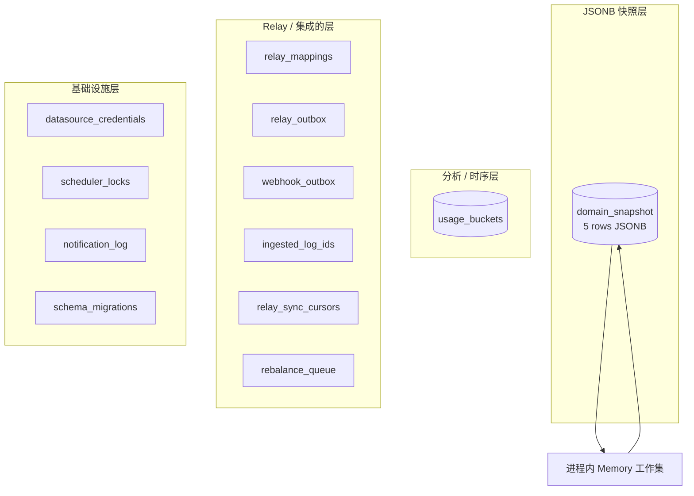
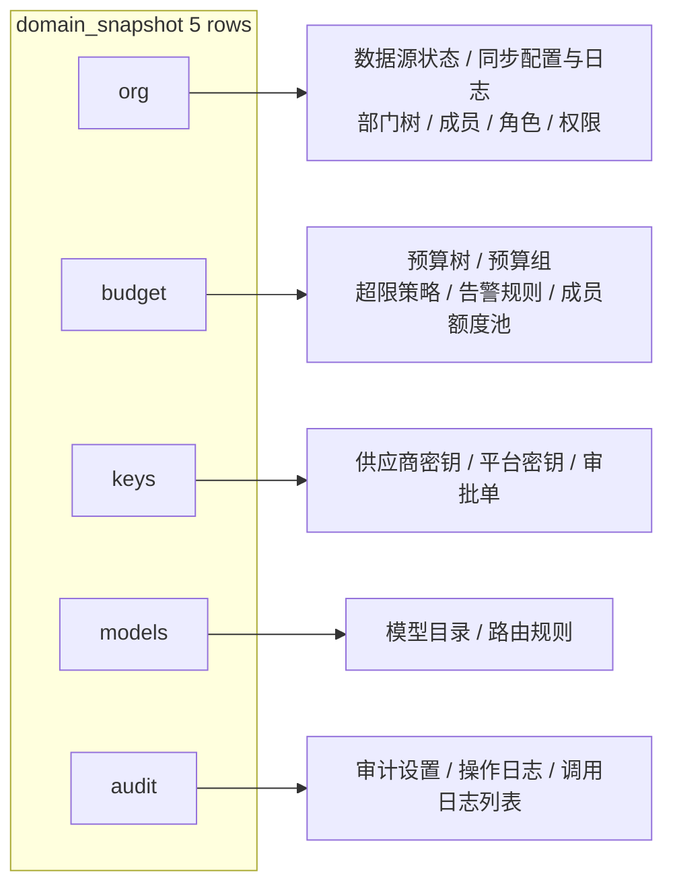
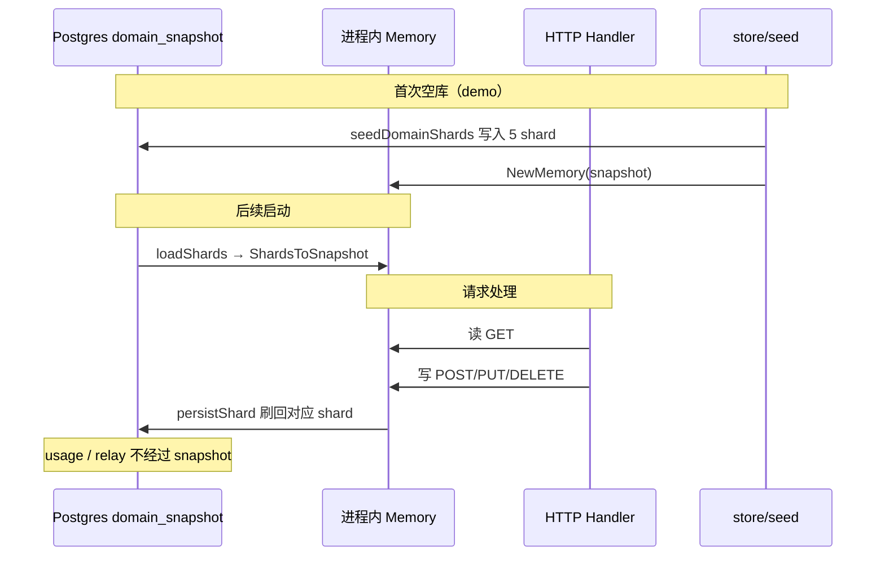
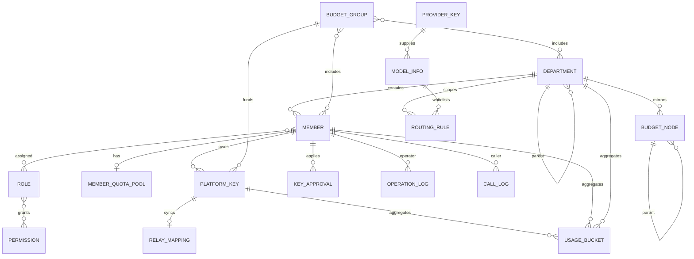
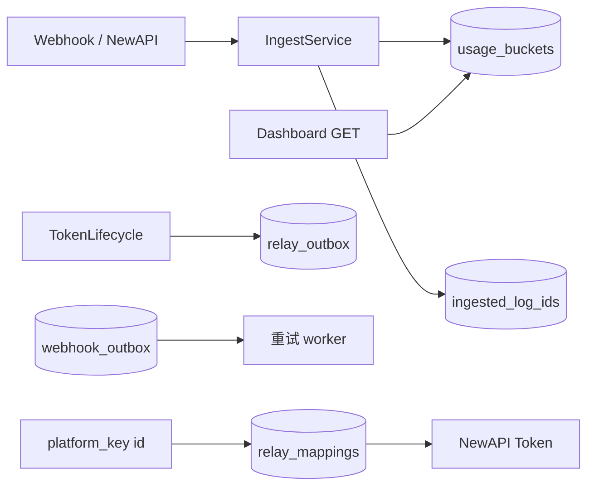
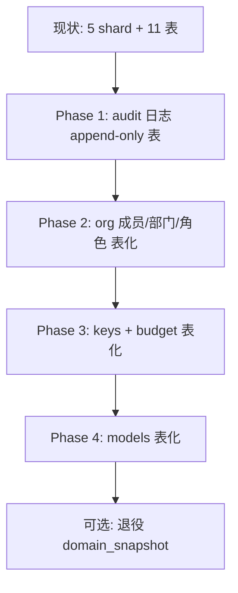

# Backend 存储架构

本文说明 TokenJoy Go 后端当前 Postgres 表结构、`domain_snapshot` 的设计取舍、实体间关系，以及未来拆分为规范化表时的规模与演进建议。

相关文档：[Backend-设计.md](./Backend-设计.md) · [Backend-test.md](./Backend-test.md) · [Frontend-API契约.md](./Frontend-API契约.md)

---

## 1. 设计背景：为什么不是「每张实体一张表」？

早期后端用 **Memory Store**：所有组织、预算、密钥等数据放在进程内存里的 `store.Snapshot` 结构体中，重启即丢失。

接入 Postgres 后需要**持久化**，但管理面 API 的 JSON 形状已经稳定（与 [`apps/frontend/src/api/types/`](../apps/frontend/src/api/types/) 对齐）。若立刻做全量关系型建模，需要：

- 为每个实体建表、外键、迁移脚本
- 重写 Repository 层（从 `[]Member` 改为 JOIN 查询）
- 处理树形结构（部门、预算节点）的存储与查询

因此采用 **混合存储**：

| 策略                                | 适用数据                                             | 原因                                                     |
| ----------------------------------- | ---------------------------------------------------- | -------------------------------------------------------- |
| **JSONB 快照（`domain_snapshot`）** | 组织、预算、密钥、模型、审计列表等「管理面整块状态」 | 与 API JSON 同构，迁移成本低；读写路径与 Memory 时代一致 |
| **规范化表**                        | 用量聚合、Relay 队列、凭证、去重 ID 等               | 需要 SQL 聚合、索引、并发消费、幂等                      |

这不是「没用数据库」，而是 **有选择地规范化**：该查表的地方已经是表；该整块读写的仍用快照。

---

## 2. 当前 Postgres 表一览

迁移来源：[`apps/backend/internal/store/postgres/migrations/`](../apps/backend/internal/store/postgres/migrations/)（当前 1 个 migration 文件）。



### 2.1 表清单（共 12 张业务表 + 1 张迁移表）

| 表名                         | 类型       | 行量级           | 职责                    |
| ---------------------------- | ---------- | ---------------- | ----------------------- |
| **`domain_snapshot`**        | JSONB 快照 | 固定 **5** 行    | 管理面域数据整包持久化  |
| **`usage_buckets`**          | 规范化     | 持续增长         | 看板费用/用量时间桶     |
| **`relay_mappings`**         | 规范化     | 与平台密钥同量级 | 平台密钥 ↔ NewAPI Token |
| **`relay_outbox`**           | 队列       | 动态             | Relay 异步任务          |
| **`webhook_outbox`**         | 队列       | 动态             | Webhook 失败重试        |
| **`ingested_log_ids`**       | 去重       | 动态             | 防止 log 重复入账       |
| **`relay_sync_cursors`**     | 单行状态   | **1**            | 补偿轮询游标            |
| **`rebalance_queue`**        | 队列       | 动态             | 预算 rebalance 待办     |
| **`datasource_credentials`** | 单行加密   | **0~1**          | 飞书等凭证              |
| **`scheduler_locks`**        | 锁         | 少量             | 定时任务租约            |
| **`notification_log`**       | 日志       | 增长             | 通知发送记录            |
| **`schema_migrations`**      | 元数据     | 按 migration 数  | 迁移版本                |

---

## 3. `domain_snapshot` 详解

### 3.1 表结构

```sql
domain_snapshot (
  id         TEXT PRIMARY KEY,   -- shard 名
  data       JSONB NOT NULL,     -- 该域全部 JSON
  updated_at TIMESTAMPTZ
)
```

### 3.2 五个 Shard 与内容

定义见 [`internal/store/snapshot_shard.go`](../apps/backend/internal/store/snapshot_shard.go)。



| Shard ID | JSON 顶层字段（摘要）                                                                                            |
| -------- | ---------------------------------------------------------------------------------------------------------------- |
| `org`    | `dataSourceStatus`, `syncConfig`, `syncLogs`, `importFailures`, `departments`, `members`, `roles`, `permissions` |
| `budget` | `budgetTree`, `budgetGroups`, `overrunPolicy`, `alertRules`, `memberQuotaPools`                                  |
| `keys`   | `providerKeys`, `platformKeys`, `approvals`                                                                      |
| `models` | `models`, `routingRules`                                                                                         |
| `audit`  | `auditSettings`, `operationLogs`, `callLogs`                                                                     |

### 3.3 运行时生命周期



要点：

- **Seed**（[`internal/store/seed/`](../apps/backend/internal/store/seed/)）仅在空库初始化时执行一次，之后不再参与读路径。
- **读 API** 多数从 **内存** 取 snapshot 数据，不是每次 SQL 查 `domain_snapshot`。
- **写 API** 更新内存后，将变更的 shard **整包** UPSERT 回 Postgres。

---

## 4. 实体关系（逻辑模型）

以下描述**业务关系**，与当前「嵌 JSON / 数组 ID」的物理存储方式无关。



### 4.1 当前物理存储 vs 逻辑关系

| 逻辑关系               | 当前怎么存                                         |
| ---------------------- | -------------------------------------------------- |
| 成员 → 部门            | `members[].departmentId`（JSON 数组项）            |
| 成员 → 角色            | `members[].roles[]` 字符串数组（**非**独立关联表） |
| 角色 → 权限            | `roles[].permissions[]` 嵌在 JSON                  |
| 部门树                 | `departments[].children[]` **嵌套 JSON 树**        |
| 预算树                 | `budgetTree[].children[]` 嵌套 JSON                |
| 预算组 → 成员/部门     | `budgetGroups[].memberIds[]` / `departmentIds[]`   |
| 平台密钥 → 成员/预算组 | `platformKeys[].memberId` / `budgetGroupId`        |
| 平台密钥 → NewAPI      | **`relay_mappings` 表**（已规范化）                |
| 看板用量               | **`usage_buckets` 表**（已规范化）                 |
| 路由规则 → 部门节点    | `routingRules[].nodeId` 指向 budget/org 节点 ID    |

---

## 5. 已规范化部分（保持不变）

以下表设计合理，**不建议**塞回 `domain_snapshot`：



| 能力                     | 为何必须独立表                                  |
| ------------------------ | ----------------------------------------------- |
| `usage_buckets`          | `SUM/GROUP BY` 聚合、时间范围查询、Webhook 累加 |
| `relay_*` / outbox       | 异步队列、状态机、重试                          |
| `ingested_log_ids`       | 幂等去重                                        |
| `datasource_credentials` | 加密 BYTEA、与域 JSON 隔离                      |
| `scheduler_locks`        | 多实例租约                                      |

---

## 6. 当前方案的优缺点

### 6.1 优点

- 与前端 API JSON **同构**，前后端类型对齐成本低
- 从 Memory 迁 Postgres **改动面小**（shard 持久化 + 内存工作集）
- 5 行 snapshot + 11 张专用表，**schema 总数可控**
- 演示/开发：空库自动 seed，体验完整

### 6.2 缺点与风险

| 问题                     | 说明                                                                 |
| ------------------------ | -------------------------------------------------------------------- |
| **整 shard 写回**        | 改一个成员可能重写整个 `org` JSON（写放大）                          |
| **无 SQL 级约束**        | 成员 `departmentId` 指向不存在部门，DB 不会拦                        |
| **多实例内存不一致**     | 多副本时各进程内存可能短暂不一致（需靠单写或将来 row 级锁）          |
| **大列表性能**           | `operationLogs` / `callLogs` 在 JSON 内无限增长，分页仍在内存过滤    |
| **审计调用日志 vs 用量** | `audit.callLogs`（展示用）与 `usage_buckets`（聚合用）数据源部分重叠 |

---

## 7. 未来拆分：需要多少张表？

若逐步改为**全关系型**，可按域估算。数字为 **建议表数区间**（含必要的关联表），不是一次性全部上线。

### 7.1 分阶段表数量估算

| 阶段                     | 范围                       | 新增表（约） | 累计业务表（约）    |
| ------------------------ | -------------------------- | ------------ | ------------------- |
| **现状**                 | 已上线                     | —            | **12** + migrations |
| **Phase A — 组织**       | 成员/部门/角色可 SQL 查询  | 8~10         | 20~22               |
| **Phase B — 密钥与预算** | 密钥、预算组、额度         | 8~12         | 28~34               |
| **Phase C — 模型与路由** | 模型目录、路由白名单       | 4~6          | 32~40               |
| **Phase D — 审计与配置** | 日志 append-only、系统配置 | 4~6          | 36~46               |

已存在的 **11 张基础设施/分析表**（`usage_buckets`、`relay_*` 等）在拆分后 **保留**，无需重复建设。

### 7.2 Phase A — 组织域（优先）

| 建议表             | 说明                                                     |
| ------------------ | -------------------------------------------------------- |
| `departments`      | 邻接表：`id`, `parent_id`, `name`, `external_id`, …      |
| `members`          | `id`, `department_id` FK, `status`, …                    |
| `roles`            | `id`, `name`, `type`                                     |
| `permissions`      | 可静态种子表                                             |
| `member_roles`     | M:N                                                      |
| `role_permissions` | M:N（若不再嵌在 role JSON）                              |
| `sync_logs`        | append-only                                              |
| `import_failures`  | 可选，或作 sync 子表                                     |
| `org_settings`     | 单行：`data_source_status` + `sync_config` JSON 或列展开 |

约 **8~9** 张（含 settings 单行表）。

### 7.3 Phase B — 预算与密钥

| 建议表                      | 说明                     |
| --------------------------- | ------------------------ |
| `budget_nodes`              | 预算树节点               |
| `budget_groups`             | 预算组                   |
| `budget_group_members`      | M:N                      |
| `budget_group_departments`  | M:N                      |
| `member_quota_pools`        | `member_id` PK           |
| `alert_rules`               | 告警                     |
| `alert_rule_notify_roles`   | M:N                      |
| `overrun_policy`            | 单行 settings 或 JSON 列 |
| `provider_keys`             | 供应商密钥               |
| `platform_keys`             | 平台密钥                 |
| `platform_key_models`       | 模型白名单 M:N           |
| `key_approvals`             | 审批                     |
| `approval_requested_models` | M:N                      |

约 **12~13** 张（可与 Phase A 合并迁移）。

### 7.4 Phase C — 模型

| 建议表                | 说明                           |
| --------------------- | ------------------------------ |
| `models`              | 模型目录                       |
| `model_capabilities`  | M:N                            |
| `routing_rules`       | 按 `node_id` 关联部门/预算节点 |
| `routing_rule_models` | allowed_models M:N             |

约 **4~5** 张。

### 7.5 Phase D — 审计

| 建议表           | 说明                                                                         |
| ---------------- | ---------------------------------------------------------------------------- |
| `audit_settings` | 单行                                                                         |
| `operation_logs` | append-only，索引 `operator_id`, `created_at`                                |
| `call_logs`      | append-only（**或**仅保留 UI 近期样本，历史从 `usage_buckets` + 外部日志查） |

约 **2~3** 张。

### 7.6 全量规范化上限

```text
基础设施/分析（已有）     ~11 表
组织域                   ~9 表
预算 + 密钥              ~13 表
模型                     ~5 表
审计                     ~3 表
迁移/元数据              ~1 表
─────────────────────────────
合计上限                 ~42 表
```

实际 **30~35 张** 往往够用（合并 settings、减少冗余 M:N 表）。

---

## 8. 能否优化 / 简化？

### 8.1 建议保留现状的部分

- **`usage_buckets` + relay 系列**：已是正确边界，勿并入 snapshot
- **5 shard 分域**：比单一大 JSON 写放大更小；比 40 表更易维护
- **内存工作集**：对管理面 QPS 不高时，延迟可接受

### 8.2 可做的轻量优化（不必立刻全表拆分）

| 优化                  | 做法                                               | 收益                             |
| --------------------- | -------------------------------------------------- | -------------------------------- |
| 审计日志移出 snapshot | `operation_logs` / `call_logs` 改为 append-only 表 | 减小 `audit` shard；支持索引分页 |
| 调用日志与用量分工    | 看板只读 `usage_buckets`；audit 列表保留摘要       | 减少 duplicate 数据感            |
| settings 单行表       | `org_settings`, `audit_settings` 从 shard 抽出     | 减小 org/audit shard churn       |
| 按写频率拆 shard      | 高频写的 `members` 先独立表，其余仍 JSON           | 渐进式，风险低                   |

### 8.3 不建议的「简化」

| 做法                                | 为何不做                                          |
| ----------------------------------- | ------------------------------------------------- |
| 全部塞进 1 个 JSONB                 | 写放大更严重；无法部分更新                        |
| 去掉内存层、每次读 PG               | 管理面 GET 暴增 DB 负载；与现 Repository 设计冲突 |
| 用 `call_logs` 替代 `usage_buckets` | 看板需要预聚合桶；实时扫日志无法满足契约          |

### 8.4 推荐演进路线



触发拆分的信号：

- 单 shard JSON **> 几 MB** 或写延迟明显
- 需要 **复杂 SQL 报表**（跨成员/部门筛选）
- **多 backend 副本** 写冲突
- 审计/调用日志 **> 万级** 行

---

## 9. 与代码入口对照

| Concern       | 代码位置                                                                                                         |
| ------------- | ---------------------------------------------------------------------------------------------------------------- |
| Snapshot 结构 | [`internal/store/store.go`](../apps/backend/internal/store/store.go)                                             |
| Shard 编解码  | [`internal/store/snapshot_shard.go`](../apps/backend/internal/store/snapshot_shard.go)                           |
| PG 启动/seed  | [`internal/store/postgres/postgres.go`](../apps/backend/internal/store/postgres/postgres.go)                     |
| Shard 持久化  | [`internal/store/postgres/shard_persist.go`](../apps/backend/internal/store/postgres/shard_persist.go)           |
| 写穿透 repos  | [`internal/store/postgres/persist.go`](../apps/backend/internal/store/postgres/persist.go)                       |
| 用量 SQL      | [`internal/store/postgres/usage_notification.go`](../apps/backend/internal/store/postgres/usage_notification.go) |
| Relay SQL     | [`internal/store/postgres/relay.go`](../apps/backend/internal/store/postgres/relay.go)                           |
| Demo 种子     | [`internal/store/seed/`](../apps/backend/internal/store/seed/)                                                   |
| SQL 迁移      | [`internal/store/postgres/migrations/`](../apps/backend/internal/store/postgres/migrations/)                     |

---

## 10. 小结

| 问题                       | 答案                                                                      |
| -------------------------- | ------------------------------------------------------------------------- |
| `domain_snapshot` 干什么？ | 把管理面 5 大域的数据 **整包 JSON** 持久化，启动加载到内存，写回时 UPSERT |
| 现在有多少张表？           | **12** 张业务表 + `schema_migrations`                                     |
| 成员/部门有独立表吗？      | **没有**，在 `org` shard 的 JSON 里                                       |
| Seed 还用吗？              | 仅 **空库初始化**；之后读 DB，不读 seed                                   |
| 全拆分大概多少表？         | 在现有 **~11** 张基础上，再增 **~20~30** 张，总量 **~30~42**              |
| 现在要不要拆？             | 演示/单机开发 **不必**；日志膨胀、多实例、复杂查询时再按 Phase 渐进拆     |
| 什么一定不要动？           | `usage_buckets`、`relay_*`、outbox、凭证、锁 — 已是正确规范化边界         |
