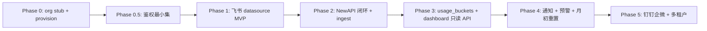
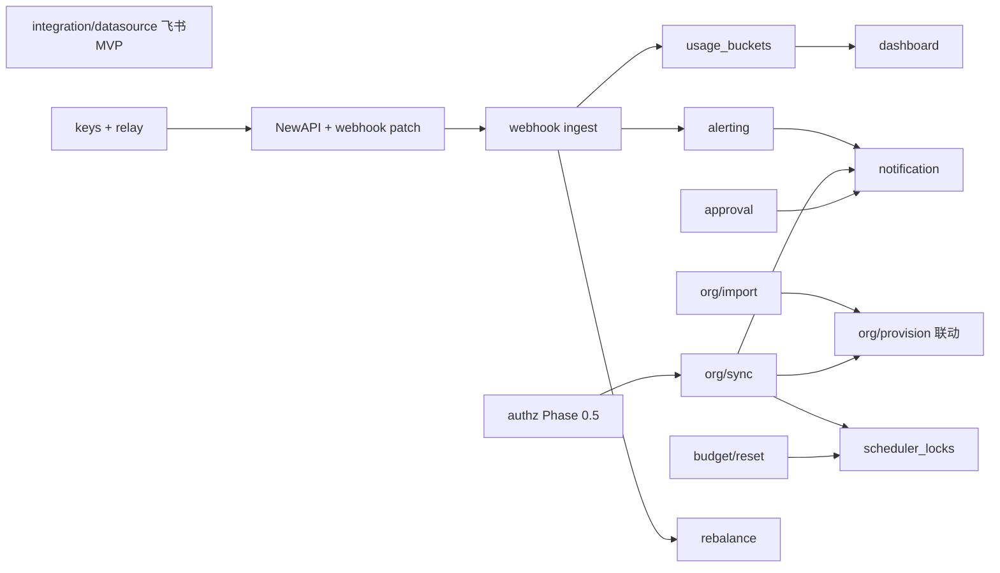

# Backend 待实现清单

本文档基于 [TokenJoy-PRD.md](./TokenJoy-PRD.md)（US-01～US-13，**不含 US-14 审计追踪**）与当前 `apps/backend/` 实现对照，列出剩余工作及推荐实现方式。

**基准：** 管理面 REST API 已对齐 [Frontend-API契约.md](./Frontend-API契约.md)；核心业务规则（预算、白名单、Key、审批）在 Service 层已有等价 Mock 逻辑；可选 NewAPI Relay 负责运行时 Token 同步与 webhook 入账。

**架构评审结论：** 方向正确、可实现；开工前须补齐本文 §2（契约变更）、§3（存储原则）、§4（组织—预算—路由联动）及 US-08 预警模型、调度多实例、NewAPI 硬依赖等约定。

---

## 1. 现状基线

| 层级      | 已完成                                                                                                                                       | 缺口                                       |
| --------- | -------------------------------------------------------------------------------------------------------------------------------------------- | ------------------------------------------ |
| HTTP 端点 | 契约 §5 全部管理面端点                                                                                                                       | 无 LLM 代理端点（属 NewAPI，非本服务）     |
| 业务规则  | 预算超卖、成员额度、 BG、白名单继承、Key/审批校验                                                                                            | 组织部分 CRUD 为 stub；数据源/同步为 Mock  |
| 持久化    | Memory 默认；Postgres 可选（`domain_snapshot` JSONB + relay 关系表）                                                                         | 凭证、用量事实、调度锁等需扩展 schema      |
| 运行时    | NewAPI webhook ingest、outbox worker、超限禁用 Key                                                                                           | 预警通知、定时同步、月初重置、看板真实数据 |
| 鉴权      | `APP_PROFILE` demo/prod；写操作 Session + permission；prod GET `PublicOrReadRoutes`；Demo `memberId`/cookie；前端读权限与 Auditor 路由已对齐 | 生产 OIDC/JWT（§11.2）未做                 |

---

## 2. 契约变更清单（开工前必对齐）

实现 US-01～US-03 前须**同一 PR** 同步更新以下位置，避免前后端 / Mock 字段分叉：

| 位置                    | 路径                                                            |
| ----------------------- | --------------------------------------------------------------- |
| 契约文档                | [Frontend-API契约.md](./Frontend-API契约.md)                    |
| 前端类型                | `apps/frontend/src/api/types/`                                  |
| 后端类型                | `apps/backend/internal/domain/types/`（`org.go`、`session.go`） |
| MSW                     | `apps/frontend/src/mocks/handlers/`                             |
| Seed（若字段影响 demo） | `apps/backend/internal/seed/`                                   |

| 项                                        | 现状                                                     | 变更                                                                                 |
| ----------------------------------------- | -------------------------------------------------------- | ------------------------------------------------------------------------------------ |
| `POST /org/data-source/test` body         | Handler 未解析；Service 固定成功                         | 解析契约 **Credential** discriminated union（`platform` 分支），失败 422 + `message` |
| `PUT /org/data-source` body               | Handler 解码空 struct；硬编码飞书                        | 同上；Test 通过后才持久化                                                            |
| `POST /org/data-source/import/retry` body | 契约 `{ ids: string[] }`；Handler/Service 均未按 ID 重试 | 实现按 `ImportFailure.id` 单条/批量重试                                              |
| `Member.externalId`                       | 无                                                       | 新增可选字段；第三方导入成员的唯一键                                                 |
| `Department.externalId`                   | 无                                                       | 新增可选字段；第三方导入部门的唯一键                                                 |
| `Department.source`                       | 无（仅 `Member.source`）                                 | 新增 `imported` \| `manual`；US-03「手动部门不删」依赖此字段                         |
| `Department.managerId`                    | 无                                                       | 新增可选字段；US-10 直属 TL 审批路由（见 §8 US-10）                                  |
| 邀请激活                                  | 契约无独立端点                                           | **功能 defer 至 Phase 5**；若做须新增 `POST /org/members/activate` + 契约补充        |

**Handler 待改：** `internal/http/handler/org.go` — `DataSourceTest`、`DataSourceUpdate`、`DataSourceImportRetry` 须解析并传递 body。

---

## 3. 存储扩展原则

当前域数据在 **`domain_snapshot` 单 JSONB**；relay / ingest 已用关系表。扩展时遵循：

| 数据类型                            | 存储                                                                                                                    | 理由                         |
| ----------------------------------- | ----------------------------------------------------------------------------------------------------------------------- | ---------------------------- |
| 管理配置（组织、预算树、Key、模型） | 继续 `domain_snapshot` 或 snapshot + 加密凭证独立表                                                                     | 读多写少、与现有 Store 一致  |
| 第三方凭证                          | 独立表 `datasource_credentials`（加密 JSONB）                                                                           | 安全隔离、不进 snapshot 明文 |
| 高频写入 / 聚合查询                 | 关系表：`usage_buckets`（hour 桶，day 查询聚合）、`alert_fired`、`budget_period`、`scheduler_locks`、`notification_log` | ingest、看板、调度幂等       |
| 邀请 token                          | `member_invites`（Phase 5 defer）                                                                                       | 有过期与激活状态             |

**Store 接口待扩展（US-02 / US-03）：** 当前 `OrgRepository` 仅有 `SyncLogs()`、`ImportFailures()` 只读；须新增 `AppendSyncLog` / `SetImportFailures`（或等价写入方法），否则同步日志与导入失败记录无法持久化。

避免将 ingest 聚合数据再塞回 snapshot JSONB，否则 Postgres 写放大与 dashboard 查询性能都会变差。

---

## 4. 组织—预算—路由联动（横切约束）

部门 ID 与预算树节点 ID **一一对应**（`budgetutil.FindBudgetNode(tree, departmentID)`）；ingest 按部门 rollup `Consumed`；路由白名单按部门节点配置。

**凡变更部门树的操作，均须在同一事务内联动：**

| 操作                  | departments | budget tree                  | routing rules                    | relay / NewAPI            |
| --------------------- | ----------- | ---------------------------- | -------------------------------- | ------------------------- |
| 手动 CreateDepartment | 插入节点    | 插入同 ID 子节点（budget=0） | 插入继承父级规则或默认 inherited | —                         |
| 手动 DeleteDepartment | 删除        | 删除同 ID 节点               | 删除对应 rule                    | —                         |
| 导入/同步新增部门     | 插入        | 同上                         | 同上                             | 可选 enqueue model limits |
| 导入/同步改名         | 更新 name   | 更新 node name               | 更新 rule nodeName               | —                         |
| 成员 Transfer         | 更新 member | —                            | —                                | 更新 mapping.departmentId |

抽取 **`domain/org/provision.go`**（或 `orgutil.ProvisionDepartment`）统一「建部门 = 建预算节点 + 建 routing」，供 US-02、US-03、US-04 复用，避免三处逻辑分叉。

---

## 5. 待办总览

| US    | 主题              | 优先级 | 状态                                    |
| ----- | ----------------- | ------ | --------------------------------------- |
| US-01 | 第三方平台凭证    | P0     | Mock                                    |
| US-02 | 全量导入组织架构  | P0     | Mock                                    |
| US-03 | 定时同步策略      | P0     | 配置有，调度与 diff 无                  |
| US-04 | 手动组织管理      | P0     | 部分 stub                               |
| US-05 | 角色与权限        | P1     | 规则已有，鉴权未强制                    |
| US-07 | 逐级预算分配      | P1     | 规则完整，月初重置无                    |
| US-08 | 用量预警与超限    | P1     | 配置有，运行时预警无                    |
| US-09 | 模型白名单        | P2     | 管理面完整                              |
| US-10 | 审批流            | P1     | 流程完整，IM 通知无                     |
| US-11 | Platform Key 管理 | P2     | 完整（含 NewAPI relay）                 |
| US-12 | API 调用          | P0     | 依赖 NewAPI + ingest                    |
| US-13 | 成本看板          | P1     | Backend 完成；Frontend MSW/页面接入待做 |

横切：鉴权（§11）、通知（§10）、多租户 SaaS（§12 实施 Phase 5 defer）。

**编号说明：** 上表「优先级」列 P0/P1/P2 与 §6～§9 标题「PRD Epic P1～P4」、§12「实施 Phase 0～5」是**三套不同编号**，勿混用。

---

## 6. P1 平台初始化

### US-01：配置第三方平台凭证

**缺口**

- `TestDataSource` 固定返回成功，不校验凭证。
- `UpdateDataSource` 硬编码飞书；**Handler 忽略 `Credential` body**（见 §2）。
- 无飞书 / 钉钉 / 企微 SDK 调用。

**实现方式**

1. **抽象集成层** `internal/integration/datasource/`
   - `Provider` 接口：`TestConnection`、`SearchMember`、`ListDepartments`、`ListMembers`（后两者供 US-02）。
   - **MVP：先飞书**；钉钉、企微 Phase 5 分平台交付（API 差异与联调量大）。
2. **凭证**：独立表 + AES-GCM（`DATA_SOURCE_CREDENTIAL_KEY`）；Memory Store 同步扩展 `OrgRepository`。
3. **改造** `domain/org/datasource.go` + `handler/org.go`：解析 `Credential` → Provider；失败 422；切换平台需 `force` 或拒绝并清空旧凭证。
4. **SearchDataSource**：调第三方 API，不再搜本地成员表。

**关键文件：** `internal/domain/org/datasource.go`、`internal/http/handler/org.go`、`internal/store/postgres/migrations/`

---

### US-02：全量导入组织架构

**缺口**

- `ImportDataSource` 返回固定 `{120, 5}`，不写入 store。
- 无增量合并；`RetryImport` 未解析 `{ ids }`（§2）。

**实现方式**

1. **导入编排** `domain/org/import.go`
   - 拉取部门树 + 成员（分页、限流、重试）。
   - 映射：`externalId`（§2）；合并策略：
     - 新增：`source=imported`，默认普通成员。
     - 已存在（externalId）：更新基础字段。
     - `source=manual` 成员/部门：不覆盖、不删除。
2. **联动（§4）**：每个新部门调用 `ProvisionDepartment`（budget 节点 + routing rule）。
3. **失败**：`ImportFailure` 逐条记录（`SetImportFailures`，§3）；`RetryImport(ids)` 按 ID 重试。
4. **事务边界**：单次 import 一个 `WithTx` — departments + budget tree + routing + members + `DataSourceStatus.lastImport`；失败整体回滚或标记 partial（与 PRD「部分成功」一致时可用 savepoint）。
5. **副作用**：`recalcRoleMemberCounts`；NewAPI 开启时对变更部门 enqueue `UpdateModelLimits`。

**关键文件：** `internal/domain/org/import.go`、`internal/domain/org/provision.go`

---

### US-03：定时同步策略

**缺口**

- 仅有配置 CRUD 与 `TriggerSync` Mock。
- 无 cron、diff、软删除、删除保护阈值；手动同步不写 sync log。

**实现方式**

1. **同步核心** `domain/org/sync.go`（复用 import diff + §4 联动）

```text
拉取第三方全量 → Diff(local, remote)
  新增 → ProvisionDepartment + 成员（同 US-02）
  改名 → 更新 name（部门 + 预算节点 + routing nodeName）
  移除 → 计数；超 deleteMemberThreshold / deleteDepartmentThreshold → 终止 + failure log + 通知
  未超阈值 → 成员/部门 status=inactive（软删除）
  source=manual 的部门/成员 → 跳过删除
```

2. **调度器与多实例**
   - **生产推荐**：独立 **`cmd/worker`** 单实例，或 K8s Deployment `replicas: 1`。
   - **进程内**：扩展 `worker.Runner` 读 `SyncConfig`；**必须**加分布式锁（PG `scheduler_locks` advisory lock 或 lease 行），避免多副本重复 sync / 月初重置。
   - **禁止**：GitHub Actions 调 `sync/trigger` 作为生产调度（仅 demo/联调）。
   - K8s CronJob 可调已鉴权的 trigger 端点，作为 worker 的备选。
3. **日志**：append `SyncLog`（`AppendSyncLog`，§3；`scheduled` \| `manual`，result，detail JSON）。
4. **通知**：超阈值 → §10 Notifier。

**关键文件：** `internal/domain/org/sync.go`、`internal/worker/runner.go` 或 `cmd/worker`

---

### US-04：手动管理组织架构

**缺口（stub 清单）**

| 方法               | 文件            | 现状                                                                          |
| ------------------ | --------------- | ----------------------------------------------------------------------------- |
| `CreateDepartment` | `department.go` | 返回对象，**未 SetDepartments**                                               |
| `UpdateDepartment` | `department.go` | 返回对象且 **未 SetDepartments**；stub 还将 `parentId` 置为 `nil`，破坏树结构 |
| `DeleteDepartment` | `department.go` | 空实现                                                                        |
| `CreateMember`     | `member.go`     | 返回对象，**未 SetMembers**                                                   |
| `DeleteMembers`    | `member.go`     | 空实现                                                                        |
| `TransferMembers`  | `member.go`     | 空实现                                                                        |
| `InviteMember`     | `member.go`     | 空实现                                                                        |

**已实现可参考：** `UpdateMemberStatus`（停用同步禁用 Key）、`BatchImport`（持久化成员）。

**实现方式**

1. **部门 CRUD**：Create/Delete 走 §4 `ProvisionDepartment` / 逆操作；Delete 校验无子部门、无成员 → 422。
2. **成员**：Create 持久化；Delete 建议软删 `inactive` + 释放 Key 额度；Transfer 更新部门并改 relay mapping。
3. **Invite**：完整链路（token 表 + 激活 API + 通知 + SSO）**defer 至 Phase 5**（§2）；**Phase 0** 可继续返回 501 或保留 Mock `sent` 计数，与前端对齐「暂无真实邀请」预期。

**关键文件：** `internal/domain/org/department.go`、`internal/domain/org/member.go`、`internal/domain/org/provision.go`

---

### US-05：角色与权限管理

**缺口**

- 角色 CRUD、成员绑定、保底角色保护 **已实现**。
- 写操作 **无权限中间件**。

**实现方式**

1. **中间件** `http/middleware/authz.go`：Session → `permissions[]` → 路由表（对齐 `apps/frontend/src/lib/permission-keys.ts`）。
2. **与 Phase 0.5 鉴权一并上线**（§11），不宜拖到 Phase 3。
3. 角色变更即时生效：已有，无需改。

---

## 7. P2 资源管控配置

### US-07：逐级预算分配

**缺口**

- 分配、超卖、预留池、BG、审批扣池 **已实现**。
- **自然月月初重置**未实现。

**实现方式**

1. **`domain/budget/reset.go`**：预算树 `Consumed=0`；PlatformKey `Used=0`；BG `Consumed=0`；personalQuota 保留。
2. **NewAPI**：reset 后 bulk enqueue rebalance（或按 member/department 轴）。
3. **调度**：每月 1 日 00:00；**同 US-03 分布式锁 + `budget_period.last_reset_at` 幂等**。
4. 多实例下无锁会导致重复 reset 与 rebalance 风暴。

**关键文件：** `internal/domain/budget/reset.go`、`internal/worker/runner.go`

---

### US-08：用量预警与超限策略

**缺口**

- `OverrunPolicy` / `AlertRule` CRUD 已有。
- ingest 在 100% 时 **`disableMemberKeys` / `disableDepartmentKeys`**（比 PRD Key 级独立更激进，见下）。
- 80%/90% 预警通知未实现；`blockMessage` 未传到 NewAPI。

**预警模型（须先定权威来源）**

| 配置                  | 契约/PRD                                   | 运行时职责（推荐）                                                |
| --------------------- | ------------------------------------------ | ----------------------------------------------------------------- |
| `OverrunPolicyConfig` | PRD US-08 **全局**阈值、通知渠道、阻断文案 | **预警通知**（80%/90%）+ **通知渠道** + **blockMessage**          |
| `AlertRule`           | 契约按 **节点** + `notifyRoleIds`          | **可选覆盖**：节点级阈值与通知对象；无规则时 fallback 全局 Policy |

合并规则：`effectiveThresholds = AlertRule(enabled && node match) ?? OverrunPolicy.thresholds`；渠道始终来自 `OverrunPolicy`。

**阻断分层（与 PRD 对齐）**

| 层级               | PRD 期望               | 当前实现                                       | 目标                                                                    |
| ------------------ | ---------------------- | ---------------------------------------------- | ----------------------------------------------------------------------- |
| 单 Key 额度用尽    | 429，其他 Key 不受影响 | NewAPI `remain_quota` + rebalance              | **保持**（网关侧）                                                      |
| 成员个人总额度用尽 | 可申请追加             | ingest `disableMemberKeys` 禁用全部 Key        | **改为**仅 rebalance 压低 quota，不批量 disable；或产品确认保留 disable |
| 部门 / BG 预算用尽 | 阻断                   | disableDepartmentKeys / disableBudgetGroupKeys | 与 NewAPI remain 联动；disable 作兜底                                   |

**实现方式**

1. **`domain/budget/alerting.go`**：ingest 后算 `used/capacity` → 匹配 effective thresholds → `alert_fired` 去重（member/dept + threshold + period）→ §10 Notifier。
2. **阻断文案**：`OverrunPolicy.blockMessage` → **NewAPI 硬依赖**（自定义错误响应或 Token 禁用原因）；`apps/newapi/patches/webhook/` 当前为 placeholder，Phase 2 须实装 settle webhook。
3. 通知失败写 `notification_log`，不阻断 ingest。

**关键文件：** `internal/domain/budget/ingest.go`、`internal/domain/budget/alerting.go`

---

### US-09：模型白名单管理

管理面已基本完成。运行时「未指定 model」由 **NewAPI** 配置。优先级 P2。

---

## 8. P3 成员接入与调用

### US-10：审批流（Key 申请 & 额度追加）

**缺口**

- 审批 CRUD 与业务规则 **已实现**。
- IM 通知未实现。
- **审批人模型与 PRD 不符**：PRD 要求 **直属 TL**；组织管理员为全局角色 ≠ 直属 TL。

**实现方式**

1. **审批人解析（推荐）**
   - 扩展 `Department.managerId`（§2）；导入时从第三方写入部门负责人。
   - 无 managerId 时 **fallback**：该部门拥有「组织管理员」角色的成员（与 PRD 差异，须在发布说明中标注）。
2. 创建/resolve 后 `Notifier.NotifyApproval`；事件：`approval_submitted` \| `approved` \| `rejected`。

**关键文件：** `internal/domain/keys/approval.go`、`internal/domain/types/org.go`（`Department`）、`internal/domain/types/session.go`（`Member`）

---

### US-11：Platform Key 管理

已基本完整。维护现有 `relay.TokenLifecycle` 即可。优先级 P2。

---

### US-12：API 调用

**缺口**

- Backend 不提供 LLM 代理；闭环依赖 NewAPI + ingest。

**闭环清单**

| 步骤 | 组件                                     | 说明                                                              |
| ---- | ---------------------------------------- | ----------------------------------------------------------------- |
| 1    | `apps/newapi`                            | 部署；Channel + Token                                             |
| 2    | **`apps/newapi/patches/webhook`**        | **硬依赖**：settle 后 POST management webhook（当前 placeholder） |
| 3    | `relay.TokenLifecycle`                   | Token / model limits 同步                                         |
| 4    | `POST /api/internal/webhooks/newapi-log` | `X-Webhook-Secret` 签名校验 → ingest                              |
| 5    | `worker.Runner`                          | outbox、webhook 重试、rebalance、日志补偿                         |
| 6    | NewAPI                                   | 401/403/429；`remain_quota` 请求前校验                            |

**Backend 待补**

- ingest 同事务写入 **`usage_buckets`**（hour 桶，Phase 3 自 `usage_daily` 演进）；见 [Backend-看板用量架构.md](./Backend-看板用量架构.md)。
- Phase 2 工期 **须包含 NewAPI 改造**，不能只估 backend。

**环境变量：** `NEW_API_ENABLED`、`NEW_API_BASE_URL`、`NEW_API_ADMIN_TOKEN`、`NEW_API_WEBHOOK_SECRET`、`NEW_API_PUBLIC_URL`（NewAPI 对外访问地址，relay / 文档场景）

---

## 9. P4 运营（不含 US-14）

### US-13：成本看板

**缺口**

- **Backend Phase 3 已完成**：`usage_buckets` 写入、只读 `GET /dashboard/usage/series`（day/hour/minute 双路径）、`cost/*` / `usage/*` buckets 聚合、Session 鉴权。
- **Frontend 待接**：`dashboardApi.getUsageSeries`、MSW handler、看板页透传 `CostQueryParams.granularity` 与 minute 近似提示。
- **defer**：租户 `timezone` 配置 UI、`input_tokens`/`output_tokens` 非零写入、cutover 元数据 API。

**Backend 补漏（已完成）**

- minute 路径 NewAPI 不可用 → **503**，error body 含 `retryAfter`（秒，默认 30）。
- `GET /dashboard/cost/daily` 等 cost 端点支持 `granularity=day|hour|week|month` 服务端 `date_trunc`；`minute` 仅 `usage/series`。

**架构（已定稿）** — [Backend-看板用量架构.md](./Backend-看板用量架构.md)

| 粒度             | 存储 / 数据源                                                  | API      |
| ---------------- | -------------------------------------------------------------- | -------- |
| `day` / `hour`   | `usage_buckets`（只存 hour，按租户时区 `date_trunc` 聚合 day） | 只读 GET |
| `week` / `month` | 同上（`cost/*`、`usage/*` 服务端 `date_trunc`）                | 只读 GET |
| `minute`         | NewAPI `ListLogs` 按需聚合（不落库、不 ingest、`approximate`） | 只读 GET |

**横切约定**

| 项             | 规则                                                                         |
| -------------- | ---------------------------------------------------------------------------- |
| 时区           | UTC 存桶；聚合/展示默认 **`Asia/Shanghai`**，租户可配置 IANA 覆盖            |
| 看板 consumed  | **周期内 `usage_buckets` SUM**；不读 snapshot `budget tree.Consumed`         |
| minute mapping | 查询时刻 mapping；响应 `mappingAsOf: "query_time"`；禁止与 hour/day 混合环比 |
| 历史 migration | 旧 `usage_daily` → 北京时间日初 pseudo-hour 桶；cutover 前 hour 视图不可用   |
| token 指标     | Phase 3 defer（`inputTokens`/`outputTokens` 恒 0，待 webhook 扩展）          |
| 成本精度       | `cost_cny NUMERIC(18,6)`；ingest 时点单价不可回溯                            |

**实现方式**

1. migration：`usage_daily` → **`usage_buckets`**（§架构 5.1 历史规则 + `NUMERIC`）。**已完成**
2. ingest：`usageHourFromPayload` + `UpsertBucket` + 共享 `cost_from_log`；仍在 `WithTx` 内。**已完成**
3. `UsageRepository.QuerySeries`（day/hour，含时区 `date_trunc`）；Memory Store parity。**已完成**
4. `log_aggregator` + minute 窗口 / 分页 / `unmappedCount` / 503 + `retryAfter`；**禁止**注入 `IngestService`。**已完成**
5. 新增 **`GET /dashboard/usage/series`**；响应扩展 `approximate`、`mappingAsOf`、`unmappedCount`、`truncated`。**已完成**
6. `GET /dashboard/cost/*`、`GET /dashboard/usage/*` 改 **buckets 周期聚合**；`teams` quota ← snapshot、consumed ← buckets；`cost/daily` 透传 `granularity`。**已完成**
7. 废弃 `dashboardcalc` 生产路径；契约 §5.6 同步 `UsageSeries*`。**Backend 已完成；Frontend 类型已有**
8. **NewAPI 零改造**；minute 复用 Admin `/api/log/`。**已完成**

**查询窗口与上限**

| `granularity` | 最大窗口 | 备注                                                                 |
| ------------- | -------- | -------------------------------------------------------------------- |
| `day`         | 365 天   | `groupBy=none` 每桶单点；`points ≤ 10000`                            |
| `hour`        | 90 天    | cutover 前无真实 hour 数据                                           |
| `minute`      | 3 小时   | 最多 50 页 / 5000 log；超时 10s；缓存 TTL 60s（key 含 session 范围） |

---

## 10. 横切：通知服务

US-03、US-08、US-10 依赖统一通知。

**包结构** `internal/notification/`

```text
Notifier interface { Send(ctx, Notification) error }
```

| 渠道              | 实现                                   | 阶段                       |
| ----------------- | -------------------------------------- | -------------------------- |
| Log / Webhook URL | 写 `notification_log` + 可选 HTTP POST | Phase 2 MVP（不阻塞 sync） |
| IM                | 复用 datasource 同平台机器人           | Phase 4                    |
| Email / SMS       | SMTP / 云厂商 adapter                  | Phase 4                    |

失败可 worker 重试；不阻断 ingest / sync 主流程。

---

## 11. 横切：鉴权

### 11.1 Phase 0.5 最小集（Phase 2 上线前必做）

| 项                       | 做法                                 |
| ------------------------ | ------------------------------------ |
| Webhook                  | 已有 `X-Webhook-Secret`              |
| `POST /org/sync/trigger` | 内网 + API Key 或 admin permission   |
| 管理写接口               | Session 必填 + §6 US-05 authz 中间件 |
| Demo 模式                | 保留 `memberId` cookie 供本地开发    |

### 11.2 生产 Session（Phase 3）

OIDC / 企业 SSO → JWT（`memberId`）；替换 Demo Cookie；与 authz 串联。

### 11.3 多租户（Phase 5 — SaaS defer）

PRD SaaS 行隔离与当前 **单 JSONB snapshot** 架构冲突大。

| 部署形态         | 策略                                                                                                               |
| ---------------- | ------------------------------------------------------------------------------------------------------------------ |
| **私有化单租户** | 暂不实现 tenant_id；文档与代码保持单租户                                                                           |
| **SaaS**         | 独立 Phase 5：每租户独立 snapshot 行或独立 DB；Session 带 `tenantId`；**勿**在 Phase 1～3 给所有 repo 加 tenant_id |

租户创建属运营/部署层，非管理面 API（与 PRD 附录一致）。

---

## 12. 推荐实施阶段

**编号约定：** 本节 **Phase 0～5** 为实施路线图；§6～§9 的 **P1～P4** 对应 PRD Epic 章节；§5 的 **P0/P1/P2** 为 US 优先级。实施排期以本节为准；[Backend-设计.md](./Backend-设计.md) §12 为早期脚手架里程碑，**已过时**，勿与本节混读。



| 阶段          | 目标                        | 交付物                                                                              | 工期（小团队，参考）     |
| ------------- | --------------------------- | ----------------------------------------------------------------------------------- | ------------------------ |
| **Phase 0**   | 前端联调不被 stub 阻断      | org CRUD 持久化；§4 provision 联动；删除校验                                        | **3～5 天**              |
| **Phase 0.5** | 生产最小安全                | webhook 已有 + sync trigger 保护 + authz 中间件                                     | **2～3 天**              |
| **Phase 1**   | PRD Epic P1：可演示真实组织 | **飞书** credential/import/sync；sync log；契约 §2                                  | **4～6 周**              |
| **Phase 2**   | 真实 API 调用与扣费         | NewAPI webhook 实装 + ingest + usage 写入 + rebalance；notification log MVP（可选） | **3～5 周**（含 NewAPI） |
| **Phase 3**   | 真实成本看板                | `usage_buckets` + 只读 `usage/series`（day/hour/minute）；OIDC 可选                 | **2～3 周**              |
| **Phase 4**   | 运营策略完整                | 通知 MVP→全渠道；US-08 alerting；US-07 月初重置 + 调度锁                            | **2～3 周**              |
| **Phase 5**   | SaaS / 全平台               | 钉钉、企微；多租户；邀请激活全链路                                                  | 独立立项                 |

**Phase 1 MVP 策略：** 三平台 **分平台交付**，先飞书跑通 import/sync + §4 联动，再复制 adapter。

**原 Phase 合并说明：**

- US-13 从原 Phase 3 **提前到 Phase 2 之后（Phase 3）**，依赖 ingest 数据。
- US-05 鉴权 **从 Phase 3 提前到 Phase 0.5**。
- 通知全渠道 **从 Phase 2 拆到 Phase 4**；Phase 2 交付物可含 log/webhook MVP（§10），全渠道 IM 留 Phase 4。

---

## 13. 依赖关系



---

## 14. 验收对照（不含 US-14）

| US    | 关键验收点                                                                                                                                                                               |
| ----- | ---------------------------------------------------------------------------------------------------------------------------------------------------------------------------------------- |
| US-01 | 错误凭证 422；正确保存；切换平台清空凭证；body 为 `Credential`                                                                                                                           |
| US-02 | 二次导入仅新增；新部门同步预算树+routing；retry 按 ids                                                                                                                                   |
| US-03 | 定时执行写 log；超阈值终止不删；manual 部门保留；多副本不重复 sync                                                                                                                       |
| US-04 | 子部门/成员存在不可删部门；停用 Key 失效；转移更新 mapping                                                                                                                               |
| US-05 | 不可移除普通成员；无权限 403                                                                                                                                                             |
| US-07 | 超卖 422；月初 consumed/used 清零；reset 幂等                                                                                                                                            |
| US-08 | 80%/90% 通知（Policy+Rule 合并）；100% 阻断；Key 级 429 不拖垮其他 Key                                                                                                                   |
| US-09 | 子级 ⊆ 父级；父级缩小子级联动                                                                                                                                                            |
| US-10 | 预留池不足拒绝；通知发往 managerId（或 documented fallback）                                                                                                                             |
| US-11 | Key 额度独立；删除释放未用额度                                                                                                                                                           |
| US-12 | 401/403/429；webhook 入账后 used 增加                                                                                                                                                    |
| US-13 | `day`/`hour`/`week`/`month` 来自 buckets 周期 SUM；`minute` 只读日志聚合（`approximate`）；consumed 不读 snapshot；默认时区 `Asia/Shanghai`；**全部看板 API 为 GET 只读**；下钻部门→成员 |

---

## 15. 参考

- [Backend-看板用量架构.md](./Backend-看板用量架构.md) — US-13 用量事实表、`usage/series` 只读 API、minute 双路径
- [Backend-设计.md](./Backend-设计.md) — 分层、Store、NewAPI 集成（**实施阶段以本文 §12 为准**，该文档 §12 Phase 定义已过时）
- [Frontend-API契约.md](./Frontend-API契约.md) — 端点与类型权威来源
- `apps/backend/internal/http/handler/webhook.go` — webhook 路由 `/api/internal/webhooks/newapi-log`
- `apps/backend/internal/domain/org/datasource.go` — 当前 Mock 入口
- `apps/backend/internal/domain/org/department.go` / `member.go` — org stub
- `apps/backend/internal/domain/budget/ingest.go` — 入账与超限（含 disable 策略待调整）
- `apps/newapi/patches/webhook/` — **Phase 2 硬依赖**，当前 placeholder
