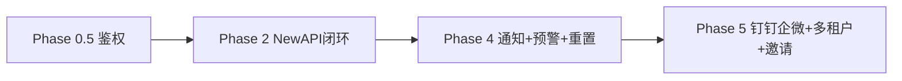

# Backend 待实现清单

对照 [TokenJoy-PRD.md](./TokenJoy-PRD.md)（US-01～US-13，不含 US-14）与当前 `apps/backend/` 实现。**API 契约已对齐**；下文仅列剩余工作与推荐顺序。

**相关：** [Frontend-API契约.md](./Frontend-API契约.md) · [Backend-设计.md](./Backend-设计.md)

---

## 1. 现状摘要

| 层级 | 已完成 | 主要缺口 |
| ---- | ------ | -------- |
| HTTP | 契约 §5 全部管理面端点 | 无 LLM 代理（属 NewAPI） |
| 组织 | 飞书凭证/import/sync；部门 CRUD + provision 联动；成员 CRUD/转移/停用 | 邀请激活 defer |
| 预算/Key | 树、额度、审批、白名单、ingest、超限 disable | 月初重置、80%/90% 预警通知 |
| 看板 | `usage_buckets`、cost/usage API、`usage/series`（day/hour/minute） | token 指标、租户时区 UI |
| 鉴权 | demo/prod profile；写操作 Session+permission | 生产 OIDC/JWT |
| 运行时 | webhook ingest、outbox worker、定时 org sync | 通知全渠道、独立 `cmd/worker` 部署文档 |

---

## 2. 待办总览

| US | 主题 | 优先级 | 状态 |
| -- | ---- | ------ | ---- |
| US-01 | 第三方凭证 | P0 | 飞书 MVP ✅；钉钉/企微 defer |
| US-02 | 全量导入 | P0 | ✅ |
| US-03 | 定时同步 | P0 | ✅（IM 超阈值通知 defer） |
| US-04 | 手动组织 | P0 | 部门/成员 CRUD ✅；Invite defer |
| US-05 | 角色权限 | P1 | 规则 ✅；prod 读鉴权待补全 |
| US-07 | 逐级预算 | P1 | 规则 ✅；月初重置未做 |
| US-08 | 预警超限 | P1 | Policy/Rule CRUD ✅；运行时通知未做 |
| US-09 | 模型白名单 | P2 | 管理面 ✅ |
| US-10 | 审批流 | P1 | 流程 ✅；IM 通知、`managerId` 审批人 defer |
| US-11 | Platform Key | P2 | ✅（含 relay） |
| US-12 | API 调用 | P0 | 依赖 NewAPI + webhook patch + ingest |
| US-13 | 成本看板 | P1 | 前后端 ✅；`groupBy` 多系列 UI defer |

**编号说明：** 上表 P0/P1/P2 为 US 优先级；§4 的 Phase 0～5 为实施路线图；PRD 章节 P1～P4 为产品 Epic，勿混用。

---

## 3. 横切约束

### 组织—预算—路由联动

部门 ID 与预算树节点 ID 一一对应。凡变更部门树须在同一事务内联动 departments、budget tree、routing rules（`domain/org/provision.go`）。

### 存储原则

| 数据 | 存储 |
| ---- | ---- |
| 管理配置 | `domain_snapshot` JSONB |
| 第三方凭证 | `datasource_credentials`（加密） |
| 高频写入 | `usage_buckets`、`scheduler_locks`、`alert_fired`（规划）等关系表 |

避免将 ingest 聚合塞回 snapshot JSONB。

### 契约变更

改 org/session 字段时同一 PR 同步：契约、`api/types/`、`domain/types/`、seed（若影响 demo）。

---

## 4. 分项缺口

### US-04 — 邀请

`InviteMember` / 激活链路 defer 至 Phase 5（需 `member_invites` 表 + 契约端点）。

### US-05 — 鉴权

prod profile 下部分 GET 仍开放；目标：各域 GET 挂 `org:read` / `budget:read` 等（对齐 dashboard 模式）。

### US-07 — 月初重置

`budget/reset.go`：树 `Consumed=0`、PlatformKey `Used=0`、BG `Consumed=0`；每月 1 日 + `scheduler_locks` 幂等；触发 rebalance outbox。

### US-08 — 预警

ingest 后算 `used/capacity` → `AlertRule` 覆盖 ?? `OverrunPolicy` → `alert_fired` 去重 → Notifier。100% 阻断与 `disableMemberKeys` 策略需与 PRD 对齐。

### US-10 — 审批通知

扩展 `Department.managerId`；`Notifier.NotifyApproval`（submit/approve/reject）。

### US-12 — NewAPI 闭环

| 步骤 | 组件 |
| ---- | ---- |
| 1 | 部署 `apps/newapi` |
| 2 | `apps/newapi/patches/webhook` 实装 settle webhook |
| 3 | `relay.TokenLifecycle` 同步 |
| 4 | `POST /api/internal/webhooks/newapi-log` ingest |
| 5 | `worker.Runner` outbox / rebalance / 补偿 |

### US-13 — 看板 defer

`input_tokens`/`output_tokens` 非零写入；`groupBy` 多系列 UI；租户 `timezone` 配置 UI。架构见 [Backend-设计.md](./Backend-设计.md) §10。

---

## 5. 通知服务（横切）

`internal/notification/`：`Notifier` 接口。Phase 2 MVP：log/webhook URL；Phase 4：IM（复用 datasource 机器人）、Email/SMS。失败不阻断 ingest/sync。

---

## 6. 推荐实施阶段

| 阶段 | 目标 | 交付物 |
| ---- | ---- | ------ |
| **Phase 0.5** | 生产最小安全 | prod GET 读鉴权；sync trigger 保护 |
| **Phase 2** | 真实 API 调用 | NewAPI webhook + ingest 闭环 |
| **Phase 4** | 运营策略 | 预警通知；月初重置；通知渠道 |
| **Phase 5** | SaaS / 全平台 | 钉钉/企微；多租户；邀请全链路 |

US-01～03、US-13 主体已完成，不再列入排期表。

---

## 7. 验收要点（不含 US-14）

| US | 关键验收 |
| -- | -------- |
| US-04 | 子部门/成员存在不可删部门；转移更新 mapping |
| US-05 | 无权限 403 |
| US-07 | 月初 consumed/used 清零；reset 幂等 |
| US-08 | 80%/90% 通知；100% 阻断 |
| US-10 | 通知发往 managerId（或 documented fallback） |
| US-12 | webhook 入账后 used 增加；401/403/429 |
| US-13 | buckets 驱动 consumed；minute `approximate`；全部看板 GET 只读 |

---

## 8. 参考

- `internal/http/handler/webhook.go` — webhook 路由
- `internal/domain/budget/ingest.go` — 入账与超限
- `apps/newapi/patches/webhook/` — Phase 2 硬依赖
