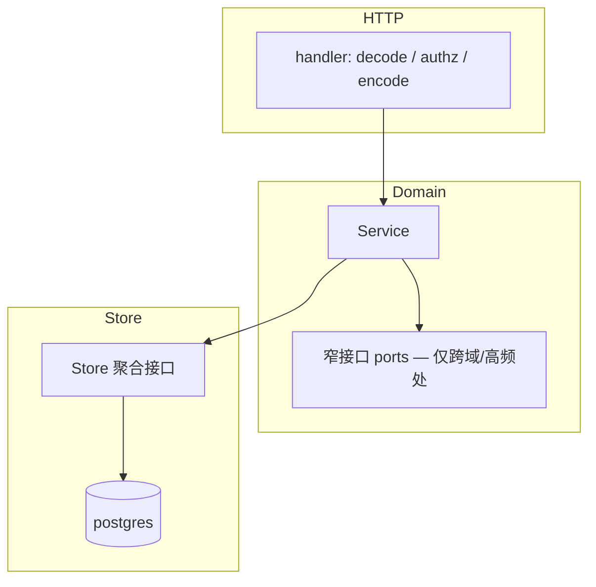

# Backend 收口与下一步

> **定位**：合并 [Backend-重构建议.md](./Backend-重构建议.md)、[Backend-命名统一.md](./Backend-命名统一.md)、[Backend-优化与收口.md](./Backend-优化与收口.md) 的**唯一收口文档**。  
> 架构基线见 [Backend-架构.md](./Backend-架构.md)；上线 fix 与联调门禁见 [plan.md](./plan.md) §1。  
> 对照 `apps/backend/` 代码审阅于 **2026-07**。

---

## 1. 结论（架构师视角）

Backend 是**合格的分层单体**，**架构收口可以停手了**。

Phase 0–2 已落地：预算算法统一、wiring 去重、大文件拆分、命名一致。对当前团队规模与 ~25k LOC 体量，**继续搞「域边界纯化」「import 计数达标」是 over-engineering**——投入大、运行时零收益、测试还要跟着改 wiring。

**真正该做的只有一类：会在线上出错的配置组合与可观测性缺口**（见 [plan.md](./plan.md) §1）。其余按「改到相关代码时顺手修」处理，**不单独立项**。

---

## 2. 目标形态（保持）



**预算三角（算法已收口，维持即可）：**

```text
pkg/budget/          snapshotload · remain · context · mapping_remain
       ↑                    ↑                ↑
  budget/              gateway/         newapisync/
  策略编排              Precheck          remain 缓存 + Admin 同步
```

- **pkg/budget** 拥有 min-cap 算法（`ComputeRemainBudget`）与 snapshot 加载（`LoadBudgetContext`）
- **gateway** 运行时拦截，经 `RemainForMapping` 委托 pkg
- **newapisync** 写 NewAPI Admin，`BudgetContext.ComputeRemain` 更新 mapping 缓存
- **budget** 拥有 rebalance/overrun **策略**，执行经 async_jobs 委托 worker

---

## 3. 命名约定

与 [Backend-架构.md](./Backend-架构.md) §0 一致。

| 项 | 取值 |
| -- | ---- |
| Gateway 开关 | `NEW_API_GATEWAY_ENABLED` → `GatewayEnabled` |
| SaaS 共享 group | `PLATFORM_SHARED_NEW_API_GROUP` |
| Deps | `Gateway`（类型 `GatewayService`） |
| 平台创建 ProviderKey | `CreateProviderKeyForPlatform` |
| org 本地结构 | `structure.LocalService` |
| Go 缩写 | `ID` / `API` |
| Store 接口 / 实现文件 | `*_repo.go` |

**领域词汇：** `Gateway` / `NewAPISync` / `PlatformKey` / `ProviderKey` / `NewAPIKey` / `PlatformKeyMapping` / `AsyncJobs`。不用 Relay；领域不用 Token 指 Key（JWT/session 写全称；LLM `inputTokens` 与厂商 Admin API 字面量除外）。

**接受的双名：**

| Domain | HTTP / 其它 |
| ------ | ----------- |
| `memberanalytics` | `handler/me`、`/api/me` |
| — | `LogStore`；`OverrunProcessor` / `Rebalancer` |

**明确不改：** JSON tag / DB 列 / HTTP path（对外契约）；`PlatformKey` → TokenJoyKey；`LogStore` → `LogRepository`。

---

## 4. 已完成（代码核实）

| 项 | 状态 | 证据 |
| -- | ---- | ---- |
| `pkg/budget/remain.go` + golden test | ✓ | Precheck / newapisync / rebalance 均经 `ComputeRemain` |
| `pkg/budget/context.go` + `mapping_remain.go` | ✓ | Gateway `RemainForMapping`；newapisync lifecycle |
| `app/wire_helpers.go` | ✓ | `EnqueueWalletSync` / `EnqueueRebalanceCompany` / `EnqueueRebalanceAxis` |
| authz revision 窄注入 | ✓ | `router.go` → `AuthzRevisionHeader(deps.Store.Company())` |
| dashboard 校验下沉 | ✓ | handler 无业务校验残留 |
| audit `ListCalls` | ✓ | `audit.Service` 委托 `usage.ReadModel` |
| member 自删保护下沉 domain | ✓ | `org/structure/member_delete.go`（`httpx` 依赖可接受，见 §5） |
| 拆分 `budget/service.go` | ✓ | `tree/groups/alerts/approvals/policy`；`service.go` 55 行 |
| 拆分 `member.go` | ✓ | `member_delete.go` 独立 |
| 拆分 `keys_repo` / `budget_repo` | ✓ | crud/query、groups/alerts/approvals |
| seed `tables.go` 按域拆 | ✓ | `seed_core/org/budget_apply/keys_apply`；`tables.go` 为编排入口 |
| Go 层 quota→budget 包名 | ✓ | 无 `groupquota`/`memberquota` |
| domain 最大文件 | ✓ | ≤ 366 行（`org/structure/member.go`） |
| postgres repo 最大文件 | ✓ | ≤ 322 行（`billing_repo.go`） |

---

## 5. 下一步（架构师重排）

判断标准：**会不会在线上踩坑？** 会 → 做。纯分层洁癖、import 计数、结构对齐 → 不做或随改动顺手。

---

### 必做 — 上线前（来自 plan.md §1）

这些是**运行时正确性**，不是架构美化。完整清单与联调签字仍以 [plan.md](./plan.md) 为准。

| 优先级 | 任务 | 为什么必做 |
| ------ | ---- | ---------- |
| **1** | **Gateway + NewAPI 组合校验** | 只开 Gateway、不开 NewAPI 是非法部署态，现在行为未定义 |
| **2** | **`noopWalletService` / Precheck 误拒** | 钱包校验恒 0 会直接 403 合法流量；与 #1 同批修 |
| **3** | **Rebalance / Overrun 在 NewAPI 关闭时勿静默 noop** | 运维无法区分「故意跳过」与「失败被吞」 |
| **4** | **`gate-verify` 覆盖 Backend Gateway** | 缺端到端签字，上线后才发现 502/路由/鉴权问题 |
| **5** | **真实栈联调签字** | Toggle / Revoke / Rotate / ingest ledger — 见 plan.md「联调签字」 |

**验收：** `pnpm gate:verify` 含 `/v1`；非法 env 组合启动失败或有测试；联调清单逐项可勾选。

---

### 值得做 — 小改、有 ROI，但不单独立项

改到相关文件时**顺带做**，不要排 sprint、不要开 Phase 3。

| 时机 | 任务 | 说明 |
| ---- | ---- | ---- |
| 修 #2 钱包/Precheck 时 | Precheck 钱包换算走现有 `WalletService` | 仅 `precheck.go` + `wallet_sync.go` 两处；**不要**追求 domain 零 import `newapi` |
| 改 org 删除逻辑时 | handler 传 `currentMemberID`，domain 去掉 `httpx` | ~10 行改动；当前 `httpx` 依赖无害，不必专门排期 |
| 新写 domain 代码时 | 用 `domain.BadRequest` 等统一错误 | 约定即可，不扫旧代码 |
| repo 单文件 > 400 行时 | 按 keys 模式拆 CRUD / query | 现在最大 322 行，**没有文件需要拆** |

---

### 不做 — 对本项目 over-engineering

原「Phase 3 域边界收紧」整体**建议取消立项**。理由如下：

| 原建议 | 为什么不做 |
| ------ | ---------- |
| domain 零 import `integration/newapi` | **`newapisync/` 本来就要调 NewAPI Admin**；15 文件里大半是生命周期同步，import 合理。grep 计数当 KPI 无意义 |
| `ScopeResolver` 去 `infra/permission` | 权限 manifest 就是产品 RBAC 的一部分；抽 port 多一层 indirection，manifest 变还是要改两处 |
| org/company 去 `infra/permission` | 同上；role 创建、邀请、导入本来就要校验 permission key |
| `IsNewAPIUnavailable` 上移 | 一个函数、一条依赖边；搬家不改行为，纯 churn |
| keys 统一 `LoadBudgetContext` | 底层已是同一套 `pkg/budget`；3 处直调 `LoadBudgetTreeWithConsumed` 只多加载了用不到的 groups/keys，**无算法 drift 风险**（算法在 `ComputeRemainBudget`） |
| worker 测试复用 `app` wiring | `testutil/worker/runner.go` 单文件、已用 `app.Enqueue*`；wiring 变更频率低，抽 `buildDomainServices` 收益 < 维护成本 |
| platform handler 对齐 `ProtectedHandlerBase` | Platform 是另一套 auth；强行统一 base 是 cosmetic |
| 前端 `quota` → `budget` 变量重命名 | 无用户价值；API path/tag  intentionally 保留 `member-quotas` |
| CI domain 行数 / import 计数脚本 | 治理 metrics 对小团队是 process tax；文件已 ≤ 400 行 |
| 预拆 `billing_repo.go` | 322 行，可读；等真的改不动再拆 |

---

## 6. Store 与注入策略（维持）

| 场景 | 注入 |
| ---- | ---- |
| 多 repo + `WithTx` | `store.Store`（budget、keys、billing、ingest） |
| 跨域编排 | 组合 port（范例：`usage.EntryBuildReader`） |
| 单 service、1–2 repo | 具体 `XxxRepository`（新代码优先） |
| Gateway Precheck | 9 个 repo 窄注入 — **参照范例** |

不做全量 service 改窄 repo；不做 5 个独立 queue repository（底层一张 `async_jobs` 表）。

---

## 7. 保持不动

| 层级 | 理由 |
| ---- | ---- |
| `cmd/` + `internal/app/` 手工 DI | 无需 wire/fx |
| `internal/http/` 包名 | 改 `transport` 零收益 |
| `domain/types/` 集中 DTO | 与前端 contract 对齐 |
| `httpdeps.Deps` 扁平 struct | 组合根合理 |
| `org.Service` 门面 | structure / remote 内部分层已够 |
| `tests/` + PostgreSQL per-schema | 不做内存 store mock |
| `pkg/budget`、`pkg/org` | 跨域纯计算内核 |

---

## 8. 明确不做

**范式级（永远不做）：**

| 不做 | 原因 |
| ---- | ---- |
| 微服务 / 模块单体拆分 | 团队规模与部署不需要 |
| wire、fx 等 DI 框架 | 构造函数注入已够用 |
| `domain` → `bounded` / `http` → `transport` | 纯改名 |
| `domain/types` 回迁各域 | 单一 DTO 层更实用 |
| 全量 service 改窄 repo 注入 | 投入大；Gateway Precheck 已是范例，新代码按需跟 |
| Phase 3「域边界纯化」整体立项 | 见 §5「不做」表 |
| 内存 store mock | PG per-schema 已是标准 |

---

## 9. 验收指标（只保留有意义的）

| 指标 | 现状 | 说明 |
| ---- | ---- | ---- |
| `make test-unit` | 全绿 | 改动的唯一硬门禁 |
| `pnpm gate:verify` 含 Gateway | 未覆盖 | **必做 #4** |
| 非法 env 组合（Gateway on / NewAPI off） | 未 fail-fast | **必做 #1** |
| domain 文件最大行数 | 366 | ≤ 400，**已达标，无需再治理** |
| handler 业务规则 | 极少 | 新代码遵守即可 |

~~domain import 计数~~、~~LoadBudgetContext 覆盖率~~ — 删除，不当作目标。

---

## 10. 文档关系

| 文档 | 关系 |
| ---- | ---- |
| [Backend-架构.md](./Backend-架构.md) | 分层与命名基线 |
| [Backend-预算.md](./Backend-预算.md) | 预算业务语义 |
| [Backend-存储架构.md](./Backend-存储架构.md) | Store / PlatformKeyMapping / AsyncJobs |
| [plan.md](./plan.md) | 上线 fix、联调签字（P0 来源） |
| Backend-重构建议 / 命名统一 / 优化与收口 | **由本文 supersede**；勿再双维护待办 |

---

## 11. 一句话

**架构收口已完成；别再加抽象层。** 全力做 [plan.md](./plan.md) §1 的 Gateway/NewAPI 上线 fix 与联调签字；其余「分层更纯」类工作一律不做立项。
