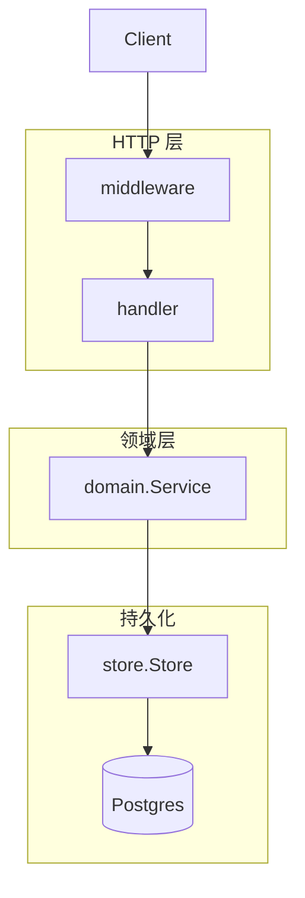
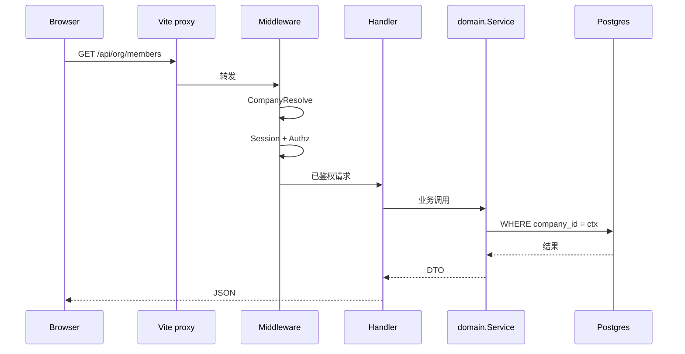
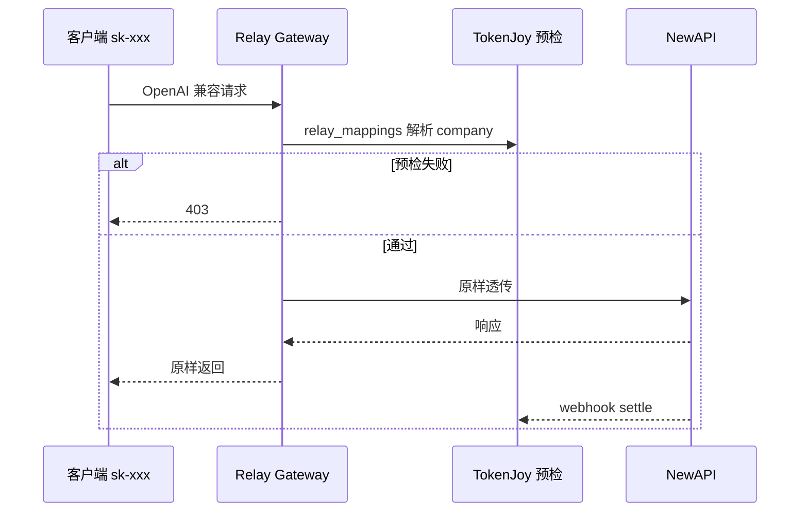
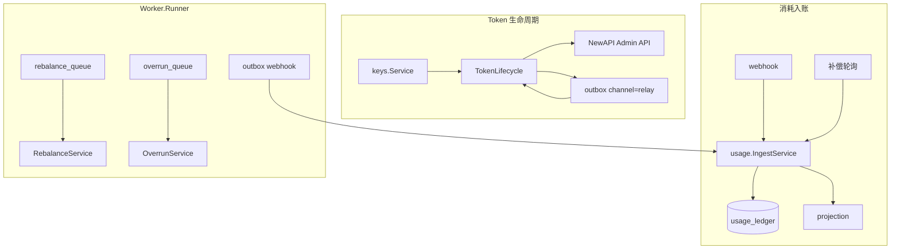
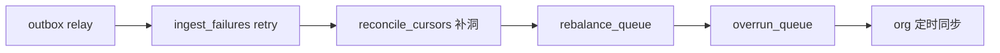
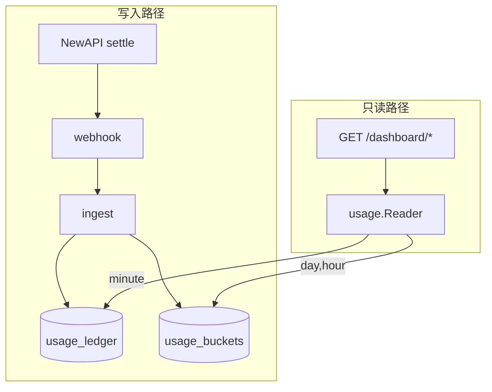

# Backend 架构

`apps/backend/` 分层、请求链路、域划分、Store 抽象、NewAPI/Relay 集成与看板读路径。

**相关：** [Backend.md](./Backend.md)（索引）· [Backend-存储架构.md](./Backend-存储架构.md) · [Backend-预算.md](./Backend-预算.md) · [Frontend.md](./Frontend.md)

---

## 1. 技术选型

| 类别 | 选型                                    |
| ---- | --------------------------------------- |
| 语言 | Go 1.24                                 |
| HTTP | chi v5 + `net/http`                     |
| 配置 | `caarlos0/env` 环境变量                 |
| 日志 | `log/slog` JSON                         |
| JSON | `encoding/json`，camelCase 对齐前端     |
| 测试 | `testing` + `httptest`，用例在 `tests/` |
| DI   | 构造函数注入，组合根 `internal/app/`    |

---

## 2. 分层



```
HTTP → middleware (CORS, CompanyResolve, Session, Authz, Recover)
     → handler（解析请求、写状态码）
     → domain.Service（业务规则）
     → store.Store（持久化）
```

- 域 DTO 统一定义在 `internal/domain/types/`。
- 各 domain 包保留 Service 接口与业务逻辑；跨域编排放在调用方或 `app/wiring_*.go`。
- HTTP 错误收敛到 `httputil`；Service 返回 `domain.DomainError`，Handler 映射 400/401/403/404/422/500。

---

## 3. 项目结构

```
apps/backend/
├── cmd/server/main.go
├── internal/
│   ├── app/                 # DI 组合根（wire_identity + wire_domain_services + wire_relay + registry）
│   ├── config/
│   ├── identity/            # sessiontoken、credentials、authz、httpx
│   ├── domain/
│   │   ├── org/             # 组织域（见下）；对外仍 domain/org.Service
│   │   │   ├── core/        # Deps、provision、authz bump
│   │   │   ├── structure/   # 本地成员/角色/部门
│   │   │   └── remote/      # 数据源凭证、导入、同步（消费 datasource.Provider）
│   │   ├── budget/          # 预算树、组、预警、rebalance、overrun
│   │   ├── keys/            # 平台/上游 Key、审批
│   │   ├── models/          # 模型目录、路由白名单
│   │   ├── dashboard/       # 看板只读聚合
│   │   ├── audit/           # 操作审计、调用审计读模型
│   │   ├── usage/           # Ingest、projection、Reader
│   │   ├── relay/           # TokenLifecycle、Gateway 预检、quota 合成
│   │   ├── company/         # 企业、开户、邀请
│   │   └── billing/         # 充值、钱包
│   ├── http/
│   │   ├── router.go
│   │   ├── deps/            # Deps、Public、Protected、Platform
│   │   ├── handler/         # register.go + 子包
│   │   ├── middleware/
│   │   └── httputil/、response/
│   ├── infra/
│   │   ├── permission/
│   │   ├── worker/          # outbox、rebalance、overrun、org sync
│   │   └── notification/
│   ├── integration/
│   │   ├── newapi/
│   │   └── datasource/feishu/
│   ├── pkg/                 # budget/、org/（含 sync_diff、remote_ids）、common/、ctxcompany/
│   └── store/               # postgres/
├── seed/                    # demo 引导与契约（见 Backend-seed.md）
├── tests/
│   ├── testutil/            # 根 + org/saas/http/relay/worker 子包
│   ├── pkg/
│   ├── domain/<域>/         # helpers_test.go + 主题测试文件
│   ├── handler/<域>/        # 按 API 域分子包（core/authz/org/...）
│   └── store/postgres/
└── Makefile
```

---

## 4. 管理面请求链



### 4.1 中间件

| 中间件           | 作用域                  | 行为                                                                   |
| ---------------- | ----------------------- | ---------------------------------------------------------------------- |
| `Recover`        | 全局                    | panic 恢复                                                             |
| `CORS`           | 全局                    | 允许前端源                                                             |
| `CompanyResolve` | `/api/*`（非 platform） | 从 Session 注入 `company_id`；私有化 `DEFAULT_COMPANY_ID`              |
| `Session`        | 全部 `/api/*` 业务路由  | **PEP**：解析签名 Session JWT → `SessionContext`（含 `authzRevision`） |
| `PlatformAuth`   | `/api/platform/*`       | 平台签名 JWT；`SUPPORT_SAAS=false` 时路由 404                          |
| `Authz`          | 需权限的路由            | **PEP**：`RequireAnyPermission` 对照 PDP 展开的 capability             |

**目标架构**（破坏性替换、无 demo 鉴权分叉）：[权限管理.md](./权限管理.md)。

**CompanyResolve 规则：**

| 场景                 | 企业来源                                        |
| -------------------- | ----------------------------------------------- |
| 已登录成员（企业面） | **仅** Session `companyId`；忽略 `X-Company-Id` |
| 邀请激活             | token 内嵌 `company_id`                         |
| 平台面               | 不经 CompanyResolve；路径显式 `{id}`            |
| 私有化               | 固定 `DEFAULT_COMPANY_ID`（默认 `1`）           |

### 4.2 鉴权（目标态）

| 范围                               | 要求                                                                                                 |
| ---------------------------------- | ---------------------------------------------------------------------------------------------------- |
| 全部业务 GET / POST / PUT / DELETE | Session JWT + 读/写 capability                                                                       |
| 公开                               | `POST /auth/login`、`POST /auth/logout`、`POST /auth/accept-invite`、`GET /healthz`、Webhook（密钥） |

**删除**：`APP_PROFILE` 鉴权分叉（demo GET 免 Session）。

`GET /api/session`：返回 `member`、`permissions[]`、`authzRevision`、`companyId`。详见 [权限管理.md](./权限管理.md) §4.5。

Webhook：`POST /api/internal/webhooks/newapi-log`，Header `X-Webhook-Secret`。

---

## 5. Store 抽象

```go
type Store interface {
    Company() CompanyRepository
    Org() OrgRepository
    Budget() BudgetRepository
    Keys() KeysRepository
    Models() ModelsRepository
    Audit() AuditRepository
    Ledger() LedgerRepository
    Relay() RelayRepository
    Usage() UsageRepository
    WithTx(ctx context.Context, fn func(Store) error) error
}
```

| 模式     | 条件                               | 说明                                                                          |
| -------- | ---------------------------------- | ----------------------------------------------------------------------------- |
| Postgres | `DATABASE_URL` 必填                | 主库 35 表 + 可选日志库 3 表，见 [Backend-存储架构.md](./Backend-存储架构.md) |
| 测试隔离 | `testhook` + per-schema PostgreSQL | 见 [Backend-测试优化.md](./Backend-测试优化.md)                               |

- Schema：`internal/store/postgres/schema.sql`（`go:embed`）；启动全量 apply。
- Bootstrap：`postgres.New` → applySchema → 空库非 prod → `seed.Load` + `seed.ApplyTables`；demo 下 `seed/runtime.ApplyUsageBuckets`（见 [Backend-seed.md](./Backend-seed.md)）。
- 企业域读写经 `pkg/ctxcompany` 注入 `company_id`；平台面全局表（`provider_keys`、`companies`）例外。
- `OrgRepository` 实现按职责拆为多文件（`org_repo.go` + `org_repo_members.go` / `org_repo_roles.go` / `org_repo_integration.go`），接口不变。

### 5.1 组织域（`domain/org`）

| 子包            | 职责                                                                               |
| --------------- | ---------------------------------------------------------------------------------- |
| `org`（根）     | `Service` 接口、`NewService`；嵌入 `structure.Local` + `remote.Service`            |
| `org/core`      | 共享 `Deps`、部门树 provision、authz revision bump                                 |
| `org/structure` | 成员/角色/部门 CRUD、CSV 批量导入                                                  |
| `org/remote`    | 凭证加解密、数据源连接、飞书式全量导入与增量同步（消费 `pkg/org` 的 diff/ID 工具） |

**`pkg/org`（组织纯函数，供 domain 与测试复用）**

| 文件                                                          | 职责                                               |
| ------------------------------------------------------------- | -------------------------------------------------- |
| `remote_ids.go`                                               | 第三方 `external_id` ↔ 本地 `org_nodes` / 成员映射 |
| `sync_diff.go`                                                | `BuildSyncDiff`：远程与本地部门/成员 diff          |
| `departments.go` / `members.go` / `roles.go` / `org_nodes.go` | 树组装、成员筛选等共享逻辑                         |

**扩展钉钉/企微**：在 `integration/datasource` 实现 `Provider` 并扩展 `factory.ForPlatform`；`org/remote` 保持平台无关，通常无需修改。

---

## 6. Relay Gateway 请求链

`RELAY_GATEWAY_ENABLED=true` 时挂载 `/v1/*`；**不经** Session。



预检依赖 `relay.PrecheckService`（`OrgNodeRepository` + `KeysRepository`）；放行条件见 [Backend-预算.md](./Backend-预算.md) §1 与 [Backend.md](./Backend.md) SaaS 章节。

---

## 7. NewAPI 集成（可选）

`NEW_API_ENABLED=true` 时启用 Relay 同步、Worker、Ingest。



| 组件               | 包              | 职责                                      |
| ------------------ | --------------- | ----------------------------------------- |
| `TokenLifecycle`   | `domain/relay`  | Create/Update/Disable Token；同步 Channel |
| `IngestService`    | `domain/usage`  | Webhook 入账（不依赖 Lifecycle）          |
| `RebalanceService` | `domain/budget` | CNY → `remain_quota`                      |
| `OverrunService`   | `domain/budget` | 超限封禁 Key                              |
| `PrecheckService`  | `domain/relay`  | Gateway 预检                              |

**Relay 子接口（DI 收窄）：**

| 消费者              | 接口                  |
| ------------------- | --------------------- |
| `keys`              | `KeysRelaySync`       |
| `models` / `org`    | `ModelLimitsEnqueuer` |
| `overrun`           | `OverrunRelayControl` |
| Worker relay outbox | `RelayOutboxSync`     |

`TokenLifecycle` 实现上述子接口及完整 `Lifecycle`。

### 7.1 Worker 一轮



入账主路径：NewAPI notify → `POST /api/internal/webhooks/newapi-log` → `IngestByLogID`；Worker 负责 `ingest_failures` 重试与 `reconcile_cursors` 全局水位补洞（方案 B，见 [NewAPI-集成状态与缺口.md](./NewAPI-集成状态与缺口.md)）。**已删除** `compensateLogs`、`relay_sync_cursors`。

`WORKER_POLL_INTERVAL_SEC` 控制轮询；`WORKER_ORG_SYNC_INTERVAL_SEC` 控制组织同步。

---

## 8. 看板读路径

Dashboard 域**全部 GET、无副作用**；端点见 [Frontend.md](./Frontend.md) §5.4。



| 决策           | 说明                                                   |
| -------------- | ------------------------------------------------------ |
| `usage.Reader` | 统一 buckets/ledger 聚合；`NewReader` 不依赖完整 Store |
| hour 桶        | 只持久化 hour；day/week/month 用 `date_trunc`          |
| minute         | 读 `usage_ledger`，窗口 ≤3h，`source: ledger`          |
| cost consumed  | 读 **buckets 周期 SUM**，不读 `org_nodes.consumed`     |
| 时区           | UTC 存储；展示默认 `Asia/Shanghai`                     |

组织元数据（部门树、模型目录）仍直读 store；`common.LoadDepartments` / `LoadBudgetTree` / `LoadRoutingRules` 签名收窄为 `OrgNodeRepository`（+ `ModelAllowlistRepository`）。

---

## 9. 命名与权限（HTTP 边界）

HTTP JSON **camelCase**；DB **snake_case**。

| 约定             | 说明                           |
| ---------------- | ------------------------------ |
| `departmentId`   | org/budget 域 = `org_nodes.id` |
| `deptId`         | dashboard 钻取 query/path      |
| `RoutingRule.id` | = `nodeId`                     |

权限 key 以 [`manifest.json`](../packages/contracts/permission/manifest.json) 为唯一真相；生成物对齐 `keys.go` ↔ `permission-keys.ts`。详见 [权限管理.md](./权限管理.md) §6。

存储侧字段语义见 [Backend-存储架构.md](./Backend-存储架构.md) §6。

---

## 10. 维护要点

| 项          | 说明                                                         |
| ----------- | ------------------------------------------------------------ |
| Context     | domain 内避免滥用 `context.Background()`                     |
| 读鉴权      | 全部 GET 挂 Session + 读 capability（无 demo 例外）          |
| Worker 测试 | `app.WithoutWorker()`                                        |
| 新 GET      | `tests/handler/core/contract_test.go` 追加用例               |
| Handler 测  | 按域分子目录；fixture 用 `testutil/http`、`testutil/saas`    |
| Domain 测   | 共享 helper 收拢至 `tests/domain/<域>/helpers_test.go`       |
| pkg 测      | `tests/pkg/org/` 等；组织 diff/ID 与 `internal/pkg/org` 对称 |

变更检查清单见 [Backend.md](./Backend.md)。
