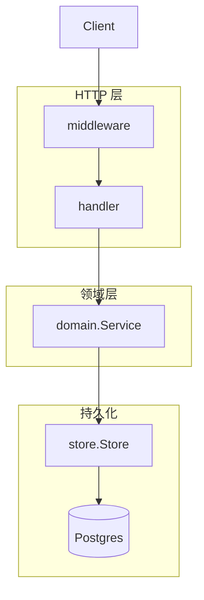
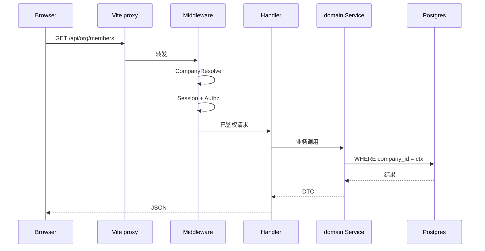
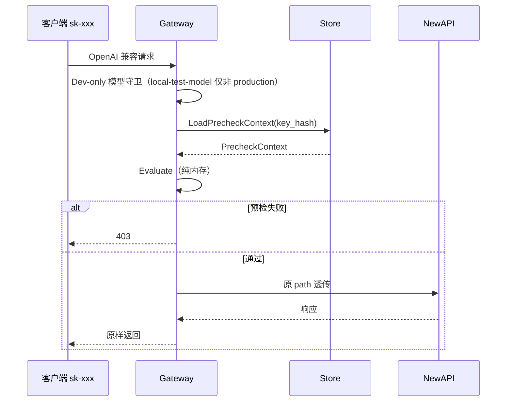
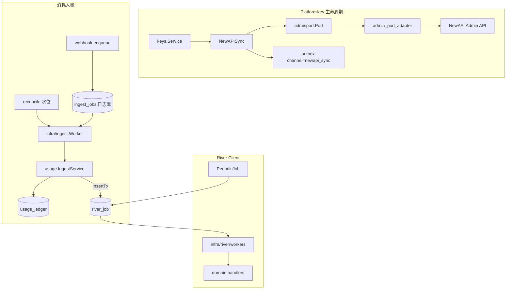
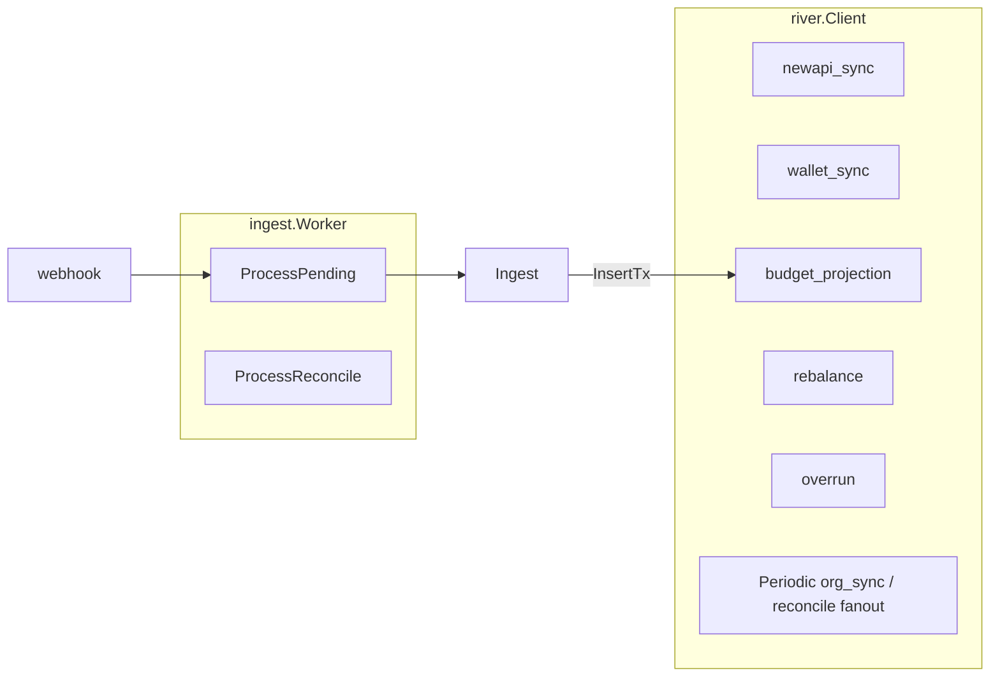
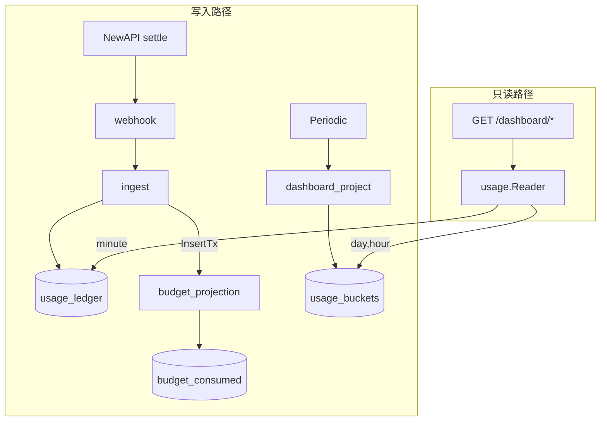

# Backend 架构

`apps/backend/` 分层、请求链路、域划分、Store 抽象、NewAPI/Gateway 集成与看板读路径。

**相关：** [Backend.md](./Backend.md)（索引）· [Backend-结构优化.md](./Backend-结构优化.md)（当前结构基线与剩余债务）· [Backend-存储架构.md](./Backend-存储架构.md) · [Backend-预算.md](./Backend-预算.md) · [Backend-业务时钟与账期.md](./Backend-业务时钟与账期.md) · [工程收口.md](./工程收口.md) · [Frontend.md](./Frontend.md)

---

## 0. 命名约定

领域词汇用 **Gateway** / **NewAPISync** / **PlatformKey**；不用 Relay；不用 Token 指 Key（JWT/session 写全称；LLM 计量 `inputTokens` 与厂商 Admin API 字面量除外）。`PlatformKey` 全链路保留，不改成 TokenJoyKey。

| 词 | 职责 |
| -- | ---- |
| **NewAPI** | 上游服务（转发 LLM、扣额度、写 logs） |
| **Gateway** | `/v1` 数据面：Precheck + 反代 NewAPI（包 `domain/gateway`） |
| **NewAPISync** | 管理面：把 PlatformKey/ProviderKey/model limits 同步到 NewAPI Admin（包 `domain/newapisync`） |
| **PlatformKey** | 租户调用钥匙 `sk-xxx`（表 `platform_keys`；API `/api/keys/platform`） |
| **NewAPIKey** | PlatformKey 在 NewAPI 上的对应（列 `newapi_key_id`） |
| **ProviderKey** / **NewAPIChannel** | 上游凭证 ↔ NewAPI Channel（列 `newapi_channel_id`） |
| **PlatformKeyMapping** | PlatformKey ↔ NewAPIKey 同步状态与 remain 缓存（表 `platform_key_mappings`） |
| **River Jobs** | `river_job`：离线任务统一队列；见 [Backend-离线任务.md](./Backend-离线任务.md)、[Backend-预算.md](./Backend-预算.md) |

```text
调用：sk-xxx → Gateway → key_hash → PlatformKeyMapping → Precheck → 反代 NewAPI
入账：NewAPI logs → newapi_key_id → PlatformKeyMapping → 归因 PlatformKey
变更：管理面 → NewAPISync（同步或 newapi_sync outbox）→ NewAPI Admin
```

| 配置 / 脚本 | 取值 |
| ----------- | ---- |
| Gateway 开关 | `NEW_API_GATEWAY_ENABLED` |
| SaaS 共享 group | `PLATFORM_SHARED_NEW_API_GROUP` |
| 本地 NewAPI 栈 | `pnpm start`（含 `start:infra`）；调试 attach 用 `pnpm start:newapi` |

**NewAPI Admin 边界**（domain 零 `integration/newapi` import）：

| 层 | 路径 | 职责 |
| -- | ---- | ---- |
| **Domain port** | `domain/adminport/` | `Port` 接口：`CreateToken` / `UpdateToken` / `TopUp` / `GetUserQuota` / `RebuildAbilities` 等 |
| **Adapter** | `integration/newapi/admin_port_adapter.go` | 唯一 HTTP 实现，映射厂商 Admin API |
| **纯换算** | `pkg/newapiunits/` | point ↔ quota；domain 可直接引用 |
| **Wallet 读** | `company.WalletService` | 依赖最小 `NewAPIWalletReader`；`adminport.Port` 满足接口；组合根注入 `adminPort` |

装配：`compose_infra.go` → `newapi.NewAdminPortAdapter(client)` → `buildDomainServices` 注入 `NewAPISync`、`billing`、`budget.Rebalance`、`models`、`company`。

---

## 1. 技术选型

| 类别 | 选型                                    |
| ---- | --------------------------------------- |
| 语言 | Go 1.24                                 |
| HTTP | chi v5 + `net/http`                     |
| 配置 | `caarlos0/env` 环境变量                 |
| 日志 | `log/slog` JSON                         |
| JSON | `encoding/json`，camelCase 对齐前端     |
| 测试 | `testing` + `httptest`，用例在 `tests/` |
| DI   | 构造函数注入，组合根 `internal/app/`    |

### 1.1 配置与环境（`internal/config`）

配置由 `caarlos0/env` 从环境变量加载，`Load()` 归一化后 `validate()` fail-fast。详见 [Backend-配置架构.md](./Backend-配置架构.md)。

| 变量 | 默认 | 说明 |
| --- | --- | --- |
| `DEPLOY_ENV` | `local` | `local` / `staging` / `production`；`production` 触发生产契约校验 |
| `BOOTSTRAP_MODE` | `none` | `none` / `prod` / `minimal` / `demo`；空库引导策略 |
| `SECURE_COOKIE` | `false` | Set-Cookie Secure；`production` 下必须为 `true` |
| `CLOCK_ANCHOR` | 空 | 可选 `YYYY-MM-DD`；固定看板「今天」与种子参考日期；账期语义见 [Backend-业务时钟与账期.md](./Backend-业务时钟与账期.md) |
| `DATA_SOURCE_CREDENTIAL_KEY` | 必填 | 数据源凭证加密密钥（32 字节 hex 或 base64） |
| `SIMULATE_DELAY` | `false` | 模拟外部 API 延迟（测试/演示） |

完整 env 表见 [Backend.md](./Backend.md) §3 与 `apps/backend/.env.example`。

---

## 2. 分层



```
HTTP → middleware (CORS, CompanyResolve, Session, Authz, Recover)
     → handler（解析请求、写状态码）
     → domain.Service（业务规则）
     → store.Store（持久化）
```

- 域 DTO 统一定义在 `internal/domain/types/`。
- 各 domain 包保留 Service 接口与业务逻辑；跨域编排放在调用方或 `app/compose_*.go`。
- HTTP 错误收敛到 `httputil`；Service 返回 `domain.DomainError`，Handler 映射 400/401/403/404/422/500。
- **Handler 零业务规则**：鉴权、编解码、调 `domain.Service`；业务校验与规则在 domain（如成员自删保护、`UsageSeries` 参数校验、`audit.ListCalls` 委托 reader）。

### 2.1 领域错误

- 结构化错误：`domain.DomainError`（`errors.go`）+ 哨兵辅助（`errsentinel.go`：`BadRequest`、`Forbidden`、`ServiceUnavailable` 等）。
- NewAPI 不可用：统一 `domain.ServiceUnavailable()` + `domain.IsServiceUnavailable()`（原 `usage/newapi_unavailable.go` 已移除）；`newapisync/outbox_errors.go` 用于 outbox 永久错误分类。
- Handler 经 `httputil` 映射 HTTP 状态码。

---

## 3. 项目结构

```
apps/backend/
├── cmd/server/main.go
├── internal/
│   ├── app/                 # DI 组合根（compose_* + port_* + registry）
│   ├── config/
│   ├── identity/            # sessiontoken、credentials、authz、httpx
│   ├── domain/
│   │   ├── org/             # 组织域（见下）；对外仍 domain/org.Service
│   │   │   ├── core/        # Deps、provision、authz bump
│   │   │   ├── structure/   # 本地成员/角色/部门
│   │   │   └── remote/      # 数据源凭证、导入、同步（消费 datasource.Provider）
│   │   ├── budget/          # 预算树、组、预警、rebalance、overrun
│   │   ├── keys/            # 平台/上游 Key、审批
│   │   ├── models/          # 模型目录、路由白名单
│   │   ├── dashboard/       # 看板只读聚合
│   │   ├── audit/           # 操作审计、调用审计读模型
│   │   ├── usage/           # Ingest、projection、Reader
│   │   ├── newapisync/      # NewAPISync（platformkey/、provision/、policy/、outbox/ 子包）
│   │   ├── adminport/       # NewAPI Admin 领域端口（Port 接口 + 输入类型）
│   │   ├── grants/          # 预设角色常量 + Normalizer 接口
│   │   ├── gateway/         # GatewayService + Precheck（/v1 数据面）
│   │   ├── company/         # 企业、开户、邀请
│   │   ├── billing/         # 充值、lot 钱包、wallet_sync
│   │   │   └── lot/         # lot 写 SSOT（consume / ledger）
│   │   └── memberanalytics/ # 成员工作台只读聚合（GET /me/*）
│   ├── http/
│   │   ├── router.go
│   │   ├── deps/            # Deps、Public、Protected、Platform
│   │   ├── handler/         # register.go + 子包
│   │   ├── middleware/
│   │   └── httputil/、response/
│   ├── infra/
│   │   ├── jobs/            # Job 参数 + Enqueuer
│   │   ├── river/           # River client + workers（薄壳调 domain）
│   │   ├── ingest/          # 入账 worker
│   │   ├── budgetcheck/     # Gateway Precheck 预算校验
│   │   ├── permission/
│   │   └── notification/
│   ├── integration/
│   │   ├── newapi/
│   │   └── datasource/feishu/
│   ├── pkg/                 # budget/、org/、newapiunits/、common/、ctxcompany/
│   └── store/               # postgres/（usage_aggregate.go；*_repo_<主题>.go）
├── seed/                    # demo 引导与契约（见 [Backend.md](./Backend.md) §5.3）
├── tests/
│   ├── testutil/            # 根 + org/saas/http/gateway/budget/worker 子包（budget/ = budgetfix）
│   ├── http/middleware/     # middleware 单元（chi + stub）
│   ├── pkg/
│   ├── domain/<域>/         # helpers_test.go + 主题测试文件
│   ├── handler/<域>/        # core/ 含 contract + mutating_contract
│   └── store/postgres/
└── Makefile
```

**结构基线：** 分层不变；domain 并行访问 Store 与端口（Job 类：六域 `ports.go` + `app/port_*.go`；其它端口定义位置见 [Backend-结构优化.md §1.3](./Backend-结构优化.md#13-领域端口)）；lot 写 SSOT 在 `domain/billing/lot/`；middleware 经 `identity/authz.RevisionReader`；详见 [Backend-结构优化.md §1](./Backend-结构优化.md#1-当前架构)（**结构变化先改该文档，再同步本段**）。

### 3.1 文件命名与拆分

| 场景 | 命名 |
| --- | --- |
| 领域服务 | `service.go`；按流程拆分 `service_<动词>.go` |
| 领域端口 | `ports.go`（Job enqueuer）；其它端口见 [Backend-结构优化.md §1.3](./Backend-结构优化.md#13-领域端口) |
| PlatformKey | `platform_key_<动作>.go` |
| NewAPISync | 子包 `platformkey/`、`provision/`、`provider/`、`outbox/`、`policy/`；根包 `sync.go` + `lifecycle_iface.go` |
| 投影 / 对账 | `*_projector.go`、`*_reconcile.go` |
| org | 子包 `core/`、`structure/`、`remote/` + 动词文件 |
| Store 大 Repo | `<域>_repo_<主题>.go` |

**子包：** 仅 org 采用三层子包（已验证）；**`billing/lot/`** 为 lot 写 SSOT 子包（避免 `billing ↔ usage` 循环依赖）；其余域保持扁平，直到出现稳定正交子域。  
**Handler 拆分：** org 按 REST 资源多文件；其它域在单文件职责明显超过一个资源时再拆。  
**Store 拆分：** 单 Repo 职责超过一个聚合主题时，按 `<域>_repo_<主题>.go` 拆。

---

## 4. 管理面请求链



### 4.1 中间件

| 中间件           | 作用域                  | 行为                                                                   |
| ---------------- | ----------------------- | ---------------------------------------------------------------------- |
| `Recover`        | 全局                    | panic 恢复                                                             |
| `CORS`           | 全局                    | 允许前端源                                                             |
| `CompanyResolve` | `/api/*`（非 platform） | 从 Session 注入 `company_id`；私有化固定 `LOCAL_COMPANY_ID`            |
| `Session`        | 全部 `/api/*` 业务路由  | **PEP**：解析签名 Session JWT → `SessionContext`（含 `authzRevision`） |
| `PlatformAuth`   | `/api/platform/*`       | 平台签名 JWT；`SUPPORT_SAAS=false` 时路由 404                          |
| `Authz`          | 需权限的路由            | **PEP**：`RequireAnyPermission` 对照 PDP 展开的 capability             |

鉴权与 RBAC：[权限管理.md](./权限管理.md)。

**CompanyResolve 规则：**

| 场景                 | 企业来源                                        |
| -------------------- | ----------------------------------------------- |
| 已登录成员（企业面） | **仅** Session `companyId`；忽略 `X-Company-Id` |
| 邀请激活             | token 内嵌 `company_id`                         |
| 平台面               | 不经 CompanyResolve；路径显式 `{id}`            |
| 私有化               | 固定 `LOCAL_COMPANY_ID`                          |

部署模式约束：

- `SUPPORT_SAAS=false`：单租户本地化部署，仅 `LOCAL_COMPANY_ID` 作为业务租户
- `SUPPORT_SAAS=true`：SaaS 多租户，业务租户 ID 从 `1000000` 起分配
- 单租户与 SaaS 模式不可切换

### 4.2 鉴权

| 范围                               | 要求                                                                                                 |
| ---------------------------------- | ---------------------------------------------------------------------------------------------------- |
| 全部业务 GET / POST / PUT / DELETE | Session JWT + 读/写 capability                                                                       |
| 公开                               | `POST /auth/login`、`POST /auth/logout`、`POST /auth/accept-invite`、`GET /healthz`、Webhook（密钥） |

鉴权不依赖 profile：无 demo GET 免 Session 分叉；统一 Session JWT + capability。

`GET /api/session`：返回 `member`、`permissions[]`、`authzRevision`、`companyId`。详见 [权限管理.md](./权限管理.md) §4.5。

Webhook：`POST /api/internal/webhooks/newapi-log`，Header `X-Webhook-Secret`。

---

## 5. Store 抽象

```go
type Store interface {
    Company() CompanyRepository
    Org() OrgRepository
    Budget() BudgetRepository
    Keys() KeysRepository
    Models() ModelsRepository
    Audit() AuditRepository
    Ledger() LedgerRepository
    PlatformKeyMappings() PlatformKeyMappingRepository
    Usage() UsageRepository
    WithTx(ctx context.Context, fn func(Store) error) error
}
```

离线任务 **不在 Store**：由 `internal/infra/river.Client` 负责 `Insert` / `InsertTx`（见 [Backend-离线任务.md](./Backend-离线任务.md)）。

| 模式     | 条件                               | 说明                                                                          |
| -------- | ---------------------------------- | ----------------------------------------------------------------------------- |
| Postgres | `DATABASE_URL` 必填                | 主库 37 表 + 可选日志库 3 表，见 [Backend-存储架构.md](./Backend-存储架构.md) |
| 测试隔离 | `testhook` + per-schema PostgreSQL | 见 [Backend.md](./Backend.md) §5；`testhook_registry.go` 提供 `BuildRegistry()` / `MustNewAPISync()` 等无 HTTP 装配 |

- Schema：`internal/store/postgres/schema.sql`（`go:embed`）；启动全量 apply。
- Bootstrap：`postgres.New` → applySchema → `seed.Init`（`none` 空库失败；`prod` 写 bootstrap 数据 + reconcile grants；`minimal`/`demo` 额外写入 snapshot；`demo` 追加 `runtime.ApplyDemo`）；每次启动 bootstrap 幂等执行 + reconcile 补齐 preset role grants。见 [Backend-配置架构.md](./Backend-配置架构.md) §5。
- 企业域读写经 `pkg/ctxcompany` 注入 `company_id`；平台面全局表（`provider_keys`、`companies`）例外。
- `OrgRepository` 实现按职责拆为多文件（`org_repo.go` + `org_repo_members.go` / `org_repo_roles.go` / `org_repo_integration.go`），接口不变。

### 5.1 组织域（`domain/org`）

| 子包            | 职责                                                                               |
| --------------- | ---------------------------------------------------------------------------------- |
| `org`（根）     | `Service` 接口、`NewService`；嵌入 `structure.LocalService` + `remote.Service`            |
| `org/core`      | 共享 `Deps`（含 `grants.Normalizer`）、部门树 provision、authz revision bump        |
| `org/structure` | 成员/角色/部门 CRUD、CSV 批量导入                                                  |
| `org/remote`    | 凭证加解密、数据源连接、飞书式全量导入与增量同步（消费 `pkg/org` 的 diff/ID 工具） |

**`pkg/org`（组织纯函数，供 domain 与测试复用）**

| 文件                                                          | 职责                                               |
| ------------------------------------------------------------- | -------------------------------------------------- |
| `remote_ids.go`                                               | 第三方 `external_id` ↔ 本地 `org_nodes` / 成员映射 |
| `sync_diff.go`                                                | `BuildSyncDiff`：远程与本地部门/成员 diff          |
| `departments.go` / `members.go` / `roles.go` / `org_nodes.go` | 树组装、成员筛选等共享逻辑                         |

**扩展钉钉/企微**：在 `integration/datasource` 实现 `Provider` 并扩展 `factory.ForPlatform`；`org/remote` 保持平台无关，通常无需修改。

### 5.2 `pkg/` 与 `domain/` 放置准则

| 放 `internal/pkg/` | 放 `internal/domain/` |
| ------------------ | ----------------------- |
| 纯函数、无 I/O（预算树计算、sync diff） | 业务流程、状态机、编排 |
| 2+ 域共用的数据结构变换 | 单域 CRUD + 规则 |
| `ctxcompany` 等 context 原语 | Service 接口与实现 |

`domain/types/` 继续作为 API DTO 单一来源（与前端 contract 对齐）。

---

## 6. Gateway 请求链

`NEW_API_GATEWAY_ENABLED=true` 时挂载 `/v1/*`；**不经** Session。代理时 **逐字节保留** 客户端 path（如 `/v1/chat/completions`），`NEW_API_BASE_URL` 仅含 scheme + host + port。



预检：`PrecheckService` = `GatewayPrecheck.LoadPrecheckContext` + `Evaluate()`（**1× Postgres round-trip**，0 NewAPI HTTP）。放行条件见 [Backend-预算.md](./Backend-预算.md) §5。

**Dev-only 模型：** `gateway.DevOnlyModel`（`local-test-model`）在 `DEPLOY_ENV=production` 时于 precheck 前直接 403，用于本地 ingest 测试，见 [本地模式-模拟消耗Popup.md](./manual-testing/本地模式-模拟消耗Popup.md)。

### 6.1 Platform Key 写路径

用户触发的 Create、Approve→Create、Toggle、Revoke、Rotate、Delete：**先** NewAPI Admin API 成功，**再** 写 Postgres（Remote-first）。NewAPI 未启用 → `503`，DB 不变。

| 操作 | 模式 |
| --- | --- |
| Create / Approve / Toggle / Revoke / Rotate / Delete | 同步 Remote-first |
| Update 配额/白名单 | 同步：先写 DB → `SyncUpdatePlatformKey`(status+group)，失败回滚 |
| Provider Channel | async outbox → Worker |

Rotate 使用 NewAPI `POST /api/token/{id}/regenerate`，保持 `newapi_key_id` 不变以利 ingest 入账。细节与未完成项见 [工程收口.md](./工程收口.md)。

---

## 7. NewAPI 集成（可选）

`NEW_API_ENABLED=true` 时启用 NewAPI 同步、Worker、Ingest。



| 组件               | 包              | 职责                                      |
| ------------------ | --------------- | ----------------------------------------- |
| `adminport.Port`   | `domain/adminport` + `integration/newapi` | NewAPI Admin 写操作边界 |
| `NewAPISync`       | `domain/newapisync` | Create/Update/Disable NewAPIKey；同步 Channel；注入 `adminport.Port` |
| `IngestService`    | `domain/usage`      | Webhook 入账（不依赖 NewAPISync）             |
| `RebalanceService` | `domain/budget`     | point → `remain_quota`（封顶 Postgres 钱包）  |
| `OverrunService`   | `domain/budget`     | 超限封禁 Key                                  |
| `PrecheckService`  | `domain/gateway`    | `LoadPrecheckContext` + `Evaluate()`（纯内存预检，含模型白名单检查） |
| `GatewayService`   | `domain/gateway`    | `/v1` 鉴权 + Precheck + 反代 NewAPI           |

**`adminport.Port` 消费者：** `newapisync`、`models.Service`（RebuildAbilities + ListModelPricing）、`company.Service`（CreateUser）。

**NewAPISync 子接口（嵌入组合，DI 收窄）：**

| 子接口 | 职责 |
| ------ | ---- |
| `PlatformKeyLifecycle` | Create / Update / Revoke / Rotate / Disable |
| `ProviderKeyLifecycle` | Upsert channel |
| `RebalanceEnqueuer` | Rebalance outbox 入队 |

| 消费者 | 接口 |
| ------ | ---- |
| `keys` | `KeysNewAPISync`（`NewAPIGate` + Platform + Provider） |
| `overrun` | `OverrunKeyControl`（`NewAPIGate` + `DisablePlatformKey`） |
| Worker newapi_sync outbox | `OutboxHandler`（Platform + Provider） |
| `app` 装配 | `Lifecycle`（上述全部 + `NewAPIGate`） |

实现位于 `domain/newapisync/` 子包（`platformkey/`、`provider/`、`outbox/`、`policy/`）；`NewAPISync` 注入 `PlatformKeyMappingRepository`；outbox 入队经 `river.Client`（kind `newapi_sync`）。详见 [Backend-离线任务.md](./Backend-离线任务.md) 与 [Backend-NewAPI-Provision架构.md](./Backend-NewAPI-Provision架构.md)。

### 7.1 后台运行时（简化后）

**仅两个组件**（详见 [Backend-离线任务.md](./Backend-离线任务.md)）：

| 组件 | 职责 |
| --- | --- |
| `infra/ingest.Worker` | 日志库 pending + reconcile 水位（`scheduler_locks`） |
| `infra/river.Client` | 全部 `river_job`：claim、retry、Periodic 扇出 |



入账主路径：webhook → pending → `IngestByLogID`；reconcile 补洞见 [工程收口.md](./工程收口.md)。

---

## 8. 看板读路径

Dashboard 域**全部 GET、无副作用**；端点见 [Frontend.md](./Frontend.md) §5.4。



| 决策           | 说明                                                   |
| -------------- | ------------------------------------------------------ |
| `usage.Reader` | 统一 buckets/ledger 聚合；`NewReader` 不依赖完整 Store |
| hour 桶        | 只持久化 hour；day/week/month 用 `date_trunc`          |
| minute         | 读 `usage_ledger`，窗口 ≤3h，`source: ledger`          |
| cost consumed  | 读 **buckets 周期 SUM**，不读 `org_nodes.consumed`     |
| 时区           | UTC 存储；展示默认 `Asia/Shanghai`                     |

组织元数据（部门树、模型目录）仍直读 store；`common.LoadDepartments` / `LoadBudgetTree` / `LoadRoutingRules` 签名收窄为 `OrgNodeRepository`（+ `ModelAllowlistRepository`）。

---

## 9. 命名与权限（HTTP 边界）

HTTP JSON **camelCase**；DB **snake_case**。

| 约定             | 说明                           |
| ---------------- | ------------------------------ |
| `departmentId`   | org/budget 域 = `org_nodes.id` |
| `deptId`         | dashboard 钻取 query/path      |
| `RoutingRule.id` | = `nodeId`                     |

权限 key 以 [`manifest.json`](../packages/contracts/permission/manifest.json) 为唯一真相；生成物对齐 `keys.go` ↔ `permission-keys.ts`。详见 [权限管理.md](./权限管理.md) §6。

存储侧字段语义见 [Backend-存储架构.md](./Backend-存储架构.md) §6。

---

## 10. 维护要点

| 项          | 说明                                                         |
| ----------- | ------------------------------------------------------------ |
| Context     | domain 内避免滥用 `context.Background()`                     |
| 读鉴权      | 全部 GET 挂 Session + 读 capability（无 demo 例外）          |
| Worker 测试 | `app.WithoutWorker()`                                        |
| 新 GET      | `tests/handler/core/contract_test.go` 追加用例               |
| 写 smoke    | `tests/handler/core/mutating_contract_test.go`               |
| Middleware  | `tests/http/middleware/middleware_test.go`（非 `NewApp`）   |
| Gateway 拒绝矩阵 | 见 [Backend-测试优化.md §12](./Backend-测试优化.md)（PR3） |
| 测试优化 backlog | [Backend-测试优化.md §10/§12](./Backend-测试优化.md)     |
| Handler 测  | 按域分子目录；fixture 用 `testutil/http`、`testutil/saas`    |
| Domain 测   | 共享 helper 收拢至 `tests/domain/<域>/helpers_test.go`       |
| pkg 测      | `tests/pkg/org/` 等；组织 diff/ID 与 `internal/pkg/org` 对称 |

变更检查清单见 [Backend.md](./Backend.md)。
