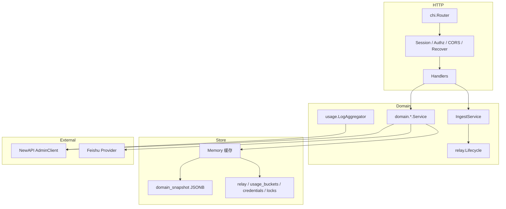
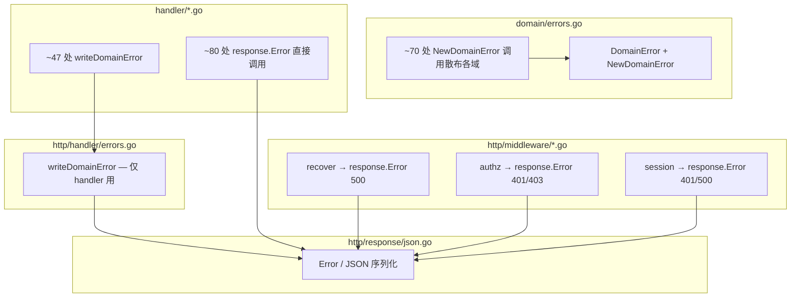
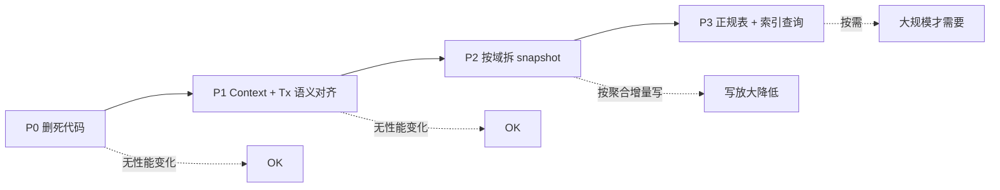

# Backend 架构优化建议

**状态：审查稿（2026-06）**

本文档以架构师视角审视 `apps/backend/`，在**不牺牲运行时性能**的前提下，提出可维护性、结构清晰度与错误防控方面的优化方向。与 [Backend-设计.md](./Backend-设计.md)、[Backend-看板用量架构.md](./Backend-看板用量架构.md) 互补：后者描述「做什么」，本文描述「怎么组织得更好」。

---

## 1. 执行摘要

| 维度       | 现状评价                                     | 核心建议                              |
| ---------- | -------------------------------------------- | ------------------------------------- |
| 分层与分包 | 良好，bounded context 清晰                   | 收敛横切不一致，补全接口边界          |
| 依赖注入   | `app.go` 组合根清晰                          | 统一 Logger / Context / 错误契约      |
| 存储       | 混合模式（JSON snapshot + 关系表）处于过渡期 | 渐进正规化，先清死代码                |
| 鉴权       | Dashboard 严格，其余 GET 开放                | 统一读策略，区分 demo / prod profile  |
| 可测试性   | `tests/` 覆盖广                              | 减少测试构造副作用（Worker 自动启动） |
| 性能       | 无明显热点债务                               | 避免为「整洁」引入额外分配或 N+1      |

**结论**：当前 backend 已具备清晰的三层 + 六边形雏形，适合 MVP 与功能迭代。最大维护风险来自**横切模式分裂**（鉴权、错误、Context、Service 抽象）和**存储双轨过渡期残留**，而非单点算法问题。建议分三阶段推进，每阶段可独立合并、可回滚。

---

## 2. 现状架构

### 2.1 完整目录树（203 个 .go 文件）

```
apps/backend/
├── cmd/server/main.go                 # 入口
├── Makefile
├── go.mod / go.sum
│
├── internal/                          # 生产代码（~120 .go）
│   ├── app/app.go                     # 组合根（DI）
│   ├── config/config.go
│   │
│   ├── domain/                        # 业务域
│   │   ├── errors.go                  # ★ 域错误类型（唯一语义源）
│   │   ├── types/                     # 跨域 DTO（11 文件）
│   │   ├── org/                       # 11 文件（最大域）
│   │   ├── budget/                    # service + ingest + rebalance
│   │   ├── keys/                      # 4 文件
│   │   ├── models/                    # service
│   │   ├── dashboard/                 # service
│   │   ├── audit/                     # service
│   │   ├── session/                   # service
│   │   ├── usage/                     # 5 文件（聚合/粒度/scope）
│   │   └── relay/                     # lifecycle + outbox + quota
│   │
│   ├── store/                         # 持久化抽象
│   │   ├── store.go                   # Store + Repository interfaces
│   │   ├── memory.go, repos.go, clone.go, tx.go, relay.go
│   │   ├── usage_notification.go, credential_lock.go
│   │   └── postgres/                  # 实现 + 4 组 migration
│   │       ├── postgres.go, persist.go, tx.go
│   │       ├── relay.go, usage_notification.go, credential_lock.go
│   │       └── migrations/000001–000004
│   │
│   ├── http/                          # 入站 HTTP 适配
│   │   ├── router.go
│   │   ├── handler/                   # 9 文件（按域拆分）
│   │   │   ├── errors.go              # ★ 仅 writeDomainError（不完整）
│   │   │   ├── org.go, budget.go, keys.go, models.go
│   │   │   ├── dashboard.go, audit.go, session.go, webhook.go
│   │   │   └── health.go
│   │   ├── middleware/                # 6 文件（各自直接 response.Error）
│   │   └── response/                  # JSON 序列化（json.go, paginate.go）
│   │
│   ├── integration/
│   │   ├── newapi/                    # 6 文件（client + token/channel/logs）
│   │   └── datasource/              # factory + feishu adapter
│   │
│   ├── worker/runner.go
│   ├── notification/service.go
│   ├── permission/                    # 4 文件（keys, roles, resolve, check）
│   ├── pkg/                           # 18 个纯函数子包
│   └── seed/                          # 种子数据加载（~12 文件 + JSON fixtures）
│
└── tests/                             # 测试（~83 .go，镜像 internal）
    ├── domain/, handler/, worker/, store/
    ├── integration/, notification/, permission/, pkg/
    └── testutil/                      # 集中 fixture + mock
```

**按层统计**

| 层                        | 包数    | 职责       | 评价                               |
| ------------------------- | ------- | ---------- | ---------------------------------- |
| `cmd` + `app`             | 2       | 启动与装配 | 精简，保持                         |
| `domain`                  | 10 子包 | 业务规则   | 结构合理；`org` 偏大               |
| `store`                   | 2       | 持久化     | 接口清晰；`repos`+`persist` 样板多 |
| `http`                    | 3 子包  | 传输适配   | **错误出口分散（见 §3.7）**        |
| `integration`             | 2       | 外部系统   | 良好                               |
| `worker` + `notification` | 2       | 异步副作用 | 单文件可接受                       |
| `permission` + `pkg`      | 19      | 横切工具   | `pkg` 子包多但无副作用             |
| `seed`                    | 1       | 演示数据   | 与 `domain` 解耦正确               |
| `tests`                   | 镜像    | 测试       | 独立树，testutil 成熟              |

### 2.2 运行时数据流



### 2.3 已做得好的地方（应保留）

1. **组合根单一**：`internal/app/app.go` 集中装配，无全局单例（除少量 `slog.Default()` fallback）。
2. **Store 按聚合根拆分**：`Org / Budget / Keys / Models / Audit / Relay / Usage / Credential / Notification`，接口粒度合理。
3. **Integration 可替换**：`newapi.AdminClient`、`datasource.Provider`、`relay.Lifecycle`、`notification.Notifier` 均有 interface，测试 mock 成熟。
4. **Outbox + Worker**：Webhook / Relay 异步化，HTTP 路径短、失败可重试，是正确的事件驱动雏形。
5. **权限模型完整**：`permission` 包 + capability 常量 + `RequireAnyPermission` 中间件，dashboard 已示范用法。
6. **用量架构演进清晰**：`usage_buckets` + `LogAggregator` 双路径只读看板，与 ingest 写路径解耦（见 [Backend-看板用量架构.md](./Backend-看板用量架构.md)）。

---

## 3. 问题诊断

### 3.1 横切关注点分裂（维护成本最高）

| 关注点       | 一致做法                          | 分裂做法                                                             | 影响                                        |
| ------------ | --------------------------------- | -------------------------------------------------------------------- | ------------------------------------------- |
| 读接口鉴权   | `dashboard`：Session + Permission | `org/budget/keys/audit` GET 无鉴权                                   | 安全模型难推理；新端点易抄错模板            |
| Service 抽象 | `org.Service` interface           | `IngestService` / `RebalanceService` / `LogAggregator` 为具体 struct | Worker、Router 与实现强耦合，mock 成本高    |
| Context      | ingest / sync 传递 `ctx`          | `org/department.go`、`member.go` 部分 `WithTx(context.Background())` | 取消、超时、trace 断裂；测试难注入 deadline |
| 错误类型     | `domain.DomainError`              | ingest 等返回裸 `fmt.Errorf`                                         | Handler 统一映射失败 → 意外 500             |
| Logger       | `app.New` 注入                    | `org.NewService`、`LogAggregator` 用 `slog.Default()`                | 日志字段不一致，排障困难                    |

### 3.2 存储过渡期残留

当前 Postgres 实现 = **Memory 作写缓存** + **整包 JSON snapshot 持久化** + **部分关系表**（relay、usage、credential、notification、lock）。

| 现象                                 | 位置                                  | 维护/错误风险                                      |
| ------------------------------------ | ------------------------------------- | -------------------------------------------------- |
| 每次 `Set*` 可能触发全量 snapshot 写 | `store/postgres/persist.go`           | 写放大；与 `WithTx` 延迟写语义并存，新人难理解     |
| persist 用 `context.Background()`    | `persist.go` 多处                     | 脱离请求生命周期，无法传递 deadline                |
| `DashboardRepository` 已无业务调用   | `store/store.go`、`seed/dashboard.go` | 死代码误导；Snapshot 仍含 `ModelUsage`/`TeamUsage` |
| Memory `WithTx` 为 no-op             | `store/tx.go`                         | 单测通过、集成环境事务行为不同                     |

> **性能说明**：JSON snapshot 在全量较小、写频率低时性能可接受；**不建议为「表结构美观」一次性大迁移**。应随域演进逐表拆出，保持读写路径不变。

### 3.3 HTTP Handler 层重复

每个 handler 重复以下模式 20+ 次：

```go
if err != nil {
    if writeDomainError(w, err) { return }
    response.Error(w, http.StatusInternalServerError, "Internal server error")
    return
}
```

`RegisterRoutes` 中写路由与读路由的 middleware 组装也高度相似，仅 permission 常量不同。

### 3.7 错误处理分散（可集中，但需分层）

当前错误相关代码分布在 **至少 5 处**，且职责重叠：



| 位置                                 | 调用量（约） | 问题                                         |
| ------------------------------------ | ------------ | -------------------------------------------- |
| `handler/*.go` → `response.Error`    | ~80          | 与 `writeDomainError` 并存，400 校验各写各的 |
| `handler/*.go` → `writeDomainError`  | ~47          | 未覆盖 middleware 与部分 handler             |
| `middleware/*.go` → `response.Error` | ~6           | 重复 401/403/500 文案，绕过统一映射          |
| `domain/*.go` → `NewDomainError`     | ~70          | 无分类 helper，status 偶发硬编码数字         |
| `worker/runner.go`                   | 吞掉 / slog  | 正确不走 HTTP，但缺少统一 `LogError`         |

**结论**：可以把 **HTTP 边界** 的错误写出收敛到 **一个地方**；域内语义错误仍保留在 `domain`，worker 走 logger，不应强行合并为一个全局 `errors` 包。

### 3.4 应用生命周期与测试

| 问题                               | 位置               | 影响                                                               |
| ---------------------------------- | ------------------ | ------------------------------------------------------------------ |
| `openStore` 失败 `panic`           | `app/app.go:47-49` | `main` 无法优雅退出；库式复用困难                                  |
| Worker 在 `app.New` 内自动 `Start` | `app/app.go:87-88` | `testutil.NewTestApp` 每次起 goroutine；handler 测试与 worker 耦合 |
| `SimulateDelay` 默认 `true`        | `config/config.go` | 易误以为性能问题；生产误开则人为延迟                               |

### 3.5 Worker 可观测性不足

`worker/runner.go` 中 `tick` 对多个 `process*` 使用 `_ =`，失败仅部分打 warn。长期运行下 outbox 堆积、补偿遗漏难以从指标发现。

### 3.6 域包体量不均

`org` 包已拆 `department.go`、`member.go`、`sync.go` 等文件，但共享一个巨大的 `Service` interface（50+ 方法）。新增功能时易继续膨胀同一 interface，违反接口隔离原则。

---

## 4. 优化原则（性能约束）

以下原则确保「更清晰」不等于「更慢」：

1. **编译期抽象**：用 interface 与构造函数注入，避免反射或 runtime 插件。
2. **中间件一次付费**：统一读鉴权仅在 chi 链增加 O(1) 检查，不引入 per-handler 重复查询。
3. **存储读写路径不变**：结构优化优先代码组织；表结构迁移单独立项，带基准测试。
4. **避免热路径额外分配**：Handler DRY 用小型包装函数，不用 `interface{}` 或过多闭包堆叠。
5. **Context 正确传递**：修正 `Background()` 滥用属于正确性修复，不增加 CPU 开销。
6. **死代码删除**：减少误用与 cognitive load，对性能中性或略好。

---

## 5. 推荐目标结构

### 5.1 目录结构：保持 vs 微调 vs 大改

**架构师结论**：当前目录 **不需要大改**；性价比最高的是 **「加一个小包、删一点死代码」**，而非全面 rename 到 hexagonal。

#### 方案 A — 推荐（最小变动）

仅做 additive 调整，不移动现有包路径：

```
internal/
├── app/
├── config/
├── domain/              # 不变；org 过大时拆子 interface（Phase 3）
├── store/               # 不变；删 DashboardRepository
├── http/
│   ├── httputil/        # ★ 新增：WriteError / WriteJSON / DecodeJSON
│   ├── handler/         # 不变路径；内部改用 httputil
│   ├── middleware/
│   ├── response/        # 降为 httputil 内部依赖
│   └── router.go
├── integration/         # 不变
├── worker/
├── notification/
├── permission/          # 保持独立（域服务也引用权限常量）
├── pkg/                 # 不变；18 子包可接受
└── seed/
```

| 动作                     | 收益                            | 成本           |
| ------------------------ | ------------------------------- | -------------- |
| 新增 `http/httputil`     | 错误单出口、handler 减 30% 样板 | 1–2 天机械替换 |
| 删 `DashboardRepository` | 减误导                          | 半天           |
| `permission` 保持独立    | 域与 HTTP 共用 capability       | 无             |

#### 方案 B — 可选（语义更清晰，非必须）

将 `http` 重命名为 `transport/http`，`store`/`integration` 归入 `adapter/`。收益：六边形语义更清晰；成本：**全量 import 变更**（~200 文件）。**建议仅在 major version 或模块拆分时做。**

#### 方案 C — 不建议

| 改动                                | 原因              |
| ----------------------------------- | ----------------- |
| `domain/org` 拆成多个 top-level 包  | import 爆炸       |
| 每个 handler 独立 package           | 导航成本上升      |
| `tests/` 迁回 co-located `_test.go` | testutil 投资浪费 |
| 合并 `pkg/*` 到 `domain/*`          | 循环依赖风险      |

#### `pkg/` 与 `org/` 说明

- `pkg/` 18 个子包均为无状态纯函数，数量可接受；仅 HTTP 用的 `sessionutil` 可迁入 `httputil`。
- `domain/org/` 已按功能拆文件，合理；待解决的是 Service interface 过大（见 §5.2），而非拆包。

### 5.2 域服务接口隔离（以 org 为例）

将巨型 `org.Service` 拆为组合门面，对外 HTTP 仍注入一个 `OrgFacade`，内部委托：

```go
type Service interface {
    DataSource() DataSourceService
    Structure() StructureService   // department + member
    Role() RoleService
    Sync() SyncService
}

// 或保持扁平 Service，但按文件定义小 interface，service struct 实现多个 interface
type DepartmentService interface {
    GetTree() []Department
    CreateDepartment(name, parentID string) (Department, error)
    // ...
}
```

**收益**：单测只 mock 子接口；新功能不会迫使 50 方法 interface 变更。**性能**：零开销（Go interface 仅在边界）。

### 5.3 统一 HTTP 横切

#### 5.3.1 路由注册辅助

```go
// middleware/routes.go
func ReadRoutes(r chi.Router, sess session.Service, perms ...string) chi.Router {
    chain := []func(http.Handler) http.Handler{
        RequireSession(sess),
    }
    if len(perms) > 0 {
        chain = append(chain, RequireAnyPermission(perms...))
    }
    return r.With(chain...)
}

func WriteRoutes(r chi.Router, sess session.Service, perms ...string) chi.Router {
    return ReadRoutes(r, sess, perms...)
}
```

各 handler `RegisterRoutes` 从 15 行 middleware 组装降为 3 行，降低漏挂 Session 概率。

#### 5.3.2 错误处理：单一 HTTP 出口（推荐）

**原则**：三层分离，两个「一个地方」

| 层        | 唯一职责                        | 包路径                                                                |
| --------- | ------------------------------- | --------------------------------------------------------------------- |
| 域语义    | 定义「什么算业务失败」          | `domain/errors.go` + `domain/errsentinel.go`（新增）                  |
| HTTP 映射 | 把 `error` → status + JSON body | `http/httputil/write.go`（新增，合并 handler/errors + 部分 response） |
| 非 HTTP   | worker / notification 只打日志  | `pkg/logutil` 或各组件注入 logger                                     |

**目标结构**

```
internal/http/
├── httputil/
│   ├── write.go      # WriteError(w, err) — 全项目 HTTP 错误唯一出口
│   ├── respond.go    # WriteJSON, WriteOK, WriteVoid
│   └── decode.go     # DecodeJSON + 400 映射（可选）
├── handler/          # 业务 handler，禁止直接 response.Error
├── middleware/       # 改为 httputil.WriteError
└── response/         # 仅保留底层 JSON 编码（httputil 内部调用）
```

**核心 API（示意）**

```go
// internal/http/httputil/write.go
package httputil

func WriteError(w http.ResponseWriter, err error) {
    if err == nil { return }
    var de *domain.DomainError
    if errors.As(err, &de) {
        writeDomainBody(w, de)
        return
    }
  // 未来可扩展：validation、json.SyntaxError → 400
    response.Error(w, http.StatusInternalServerError, "Internal server error")
}

func WriteJSON[T any](w http.ResponseWriter, status int, v T, err error) {
    if err != nil { WriteError(w, err); return }
    response.JSON(w, status, v)
}

// 包级常量，消灭魔法字符串
const MsgUnauthorized = "Unauthorized"
const MsgForbidden    = "Forbidden"
const MsgInternal     = "Internal server error"
const MsgBadBody      = "Invalid request body"
```

**域内 sentinel（与 HTTP 出口配合，仍属 domain）**

```go
// internal/domain/errsentinel.go
func NotFound(msg string) error    { return NewDomainError(StatusNotFound, msg) }
func Validation(msg string) error  { return NewDomainError(StatusUnprocessable, msg) }
func Forbidden(msg string) error   { return NewDomainError(StatusForbidden, msg) }
func BadRequest(msg string) error  { return NewDomainError(StatusBadRequest, msg) }
```

**Handler 终态写法**

```go
func (h *BudgetHandler) UpdateNode(w http.ResponseWriter, r *http.Request) {
    var body updateNodeBody
    if err := httputil.DecodeJSON(r, &body); err != nil {
        httputil.WriteError(w, err); return
    }
    node, err := h.service.UpdateNode(r.Context(), chi.URLParam(r, "id"), body.Budget, body.ReservedPool)
    httputil.WriteJSON(w, http.StatusOK, node, err)
}
```

**Middleware 同步改造**

```go
// session.go — 替换 3 处 response.Error
httputil.WriteError(w, domain.Unauthorized(""))  // 或 httputil.WriteStatus(w, 401, httputil.MsgUnauthorized)
```

**不建议的做法**

| 做法                            | 原因                                              |
| ------------------------------- | ------------------------------------------------- |
| 全 backend 只有一个 `errors` 包 | worker/store/integration 语义不同，强合并增加耦合 |
| 用 panic + recover 做业务错误   | 破坏 Go 惯例，性能与栈追踪差                      |
| 在 domain 引用 `net/http`       | 污染域层，无法复用于 worker CLI                   |
| 每个 handler 继续 copy-paste    | 现状；漏写 `writeDomainError` 即 500 误报         |

**迁移顺序**（零性能影响，纯重构）

1. 新增 `httputil.WriteError`，`writeDomainError` 改为薄包装转发（兼容）
2. middleware 三文件改用 `httputil`
3. handler 逐文件替换 `response.Error` + `writeDomainError` → `httputil`
4. 删除 `handler/errors.go`
5. 域内新增 sentinel，新代码禁止裸 `NewDomainError(404, ...)` 数字字面量

#### 5.3.3 鉴权策略矩阵（建议终态）

| 资源          | GET                                       | 写                       |
| ------------- | ----------------------------------------- | ------------------------ |
| Session       | 公开（或仅 cookie）                       | —                        |
| Org 结构/成员 | `org:read` 或更细 capability              | 现有 write permission    |
| Budget        | `budget:read`                             | 现有 write permission    |
| Keys          | `keys:read`（敏感字段脱敏）               | 现有 write permission    |
| Models        | `model:read`                              | 现有 write permission    |
| Dashboard     | 现有 `dashboard:cost` / `dashboard:usage` | —                        |
| Audit         | `audit:read`                              | `audit:read`（settings） |
| Webhook       | —                                         | `X-Webhook-Secret`       |

**Demo 模式**：通过 `config.Profile == "demo"` 跳过读鉴权，与生产显式分离，替代当前隐式「全部 GET 200」契约（`tests/handler/contract_test.go` 需同步）。

### 5.4 错误模型强化

1. **域内约定**：凡预期客户端可处理的失败，必须返回 `*domain.DomainError`；仅 truly unexpected 用 wrapped error。
2. **分类辅助**（可选，仍零运行时成本若用构造函数）：

```go
var (
    ErrNotFound     = func(msg string) error { return domain.NewDomainError(404, msg) }
    ErrValidation   = func(msg string) error { return domain.NewDomainError(422, msg) }
    ErrForbidden    = func(msg string) error { return domain.NewDomainError(403, msg) }
)
```

3. **ingest / relay**：`mapping not found` 等改为 404/422 DomainError，避免 handler 层 500。

### 5.5 存储演进路线（性能友好）



| 阶段 | 动作                                                                         | 性能影响                         |
| ---- | ---------------------------------------------------------------------------- | -------------------------------- |
| P0   | 删除 `DashboardRepository`、`Snapshot` 中废弃字段；文档标明 snapshot 边界    | 略减序列化体积                   |
| P1   | persist 接受 `ctx`；`WithTx` 内统一延迟写；org 去掉 `context.Background()`   | 无                               |
| P2   | snapshot 按 `org` / `budget` / `keys` 分 JSON 列或分表，persist 只写变更聚合 | 降低写放大                       |
| P3   | 高频查询字段（成员列表、预算树）迁正规表 + 索引                              | 读性能提升；迁移期双写需基准测试 |

**当前不必做 P3**，除非：成员 > 1 万、或 snapshot 序列化 > 1MB、或写 QPS 成为瓶颈。

### 5.6 应用与 Worker 构造

```go
type Option func(*App)

func WithoutWorker() Option { ... }
func WithLogger(l *slog.Logger) Option { ... }

func New(cfg config.Config, logger *slog.Logger, opts ...Option) (*App, error) {
    st, err := openStore(ctx, cfg)
    if err != nil { return nil, fmt.Errorf("open store: %w", err) }
    // ...
}
```

- Handler 测试：`New(cfg, logger, WithoutWorker())`
- 集成测试：显式 `worker.RunOnce(ctx)`
- `main`：`app, err := app.New(...); if err != nil { log.Fatal(err) }`

### 5.7 Worker 可观测性（不增加热路径开销）

1. `tick` 内记录 **结构化错误**：`logger.Warn("worker tick", "step", "relay_outbox", "error", err)`，替代 `_ =`。
2. 可选：每 step 累加 `success/failure` counter（ Prometheus 或 slog 周期汇总），**不在每条 outbox 打 info**。
3. `interval` / `syncEvery` 迁入 `config`，默认值保持 5s / 60s，**行为与现网一致**。

### 5.8 测试结构建议

| 现状                                   | 建议                                              | 理由                                  |
| -------------------------------------- | ------------------------------------------------- | ------------------------------------- |
| 测试全在 `tests/`                      | 保持；domain 纯逻辑可逐步 co-locate `_test.go`    | 项目已建立 testutil；大规模搬迁收益低 |
| `NewTestApp` 启 Worker                 | 默认 `WithoutWorker`                              | 减少 flaky 与 goroutine 泄漏          |
| `contract_test` 断言 GET 无 cookie 200 | 拆为 `demo_contract_test` + `authz_contract_test` | 与 prod profile 对齐                  |

---

## 6. 分阶段实施计划

### Phase 1 — 低风险、立即收益（1–2 周）

| #    | 任务                                                 | 涉及文件                          | 风险             |
| ---- | ---------------------------------------------------- | --------------------------------- | ---------------- |
| 1.0  | 新增 `http/httputil`，`WriteError` 单出口            | `http/httputil/`，middleware 先改 | 低               |
| 1.1  | Handler 全面改用 `httputil`；删 `handler/errors.go`  | `http/handler/*.go`               | 低               |
| 1.1b | 新增 `domain/errsentinel.go`                         | `domain/`                         | 低               |
| 1.2  | `ReadRoutes` / `WriteRoutes` 中间件辅助              | `http/middleware/`                | 低               |
| 1.3  | 删除 `DashboardRepository` 及 seed 残留              | `store/`, `seed/`                 | 低；需确认无引用 |
| 1.4  | ingest 等裸 error 改 `DomainError`                   | `domain/budget/ingest.go` 等      | 低；改测试断言   |
| 1.5  | `app.New` 返回 `error`；`WithoutWorker` Option       | `app/app.go`, `tests/testutil/`   | 低               |
| 1.6  | 统一 Logger 注入到 `org.NewService`、`LogAggregator` | `domain/org/`, `domain/usage/`    | 低               |
| 1.7  | Worker tick 错误日志化                               | `worker/runner.go`                | 低               |

### Phase 2 — 一致性与安全（2–4 周）

| #   | 任务                                                | 说明                                                       |
| --- | --------------------------------------------------- | ---------------------------------------------------------- |
| 2.1 | 引入 `config.Profile`（`demo` / `prod`）            | `SimulateDelay`、读鉴权、session query 开关                |
| 2.2 | 统一 GET 鉴权（prod profile）                       | 复用 dashboard 模式；补全 `BudgetRead` 等未使用 permission |
| 2.3 | `IngestService` / `RebalanceService` 提取 interface | `worker`、`router` 依赖 interface                          |
| 2.4 | org 域 `WithTx` 全部改用方法 `ctx`                  | `department.go`, `member.go`                               |
| 2.5 | persist 装饰器传递 `ctx`                            | `store/postgres/persist.go`                                |

### Phase 3 — 结构演进（按需，1–3 月）

| #   | 任务                                             | 触发条件                                |
| --- | ------------------------------------------------ | --------------------------------------- |
| 3.1 | 拆分 `org.Service` 为子 interface + 门面         | org 继续膨胀时                          |
| 3.2 | snapshot 按聚合分片 persist                      | snapshot 体积或写延迟可观测上升         |
| 3.3 | 高频读路径迁正规表                               | 需要 SQL 级过滤/分页时                  |
| 3.4 | 考虑 `go generate` 生成 memory/persist repo 样板 | `repos.go` + `persist.go` 重复超 500 行 |

---

## 7. 不建议做的「优化」

以下做法看似整洁，但与本项目阶段不符或可能伤害性能/稳定性：

| 做法                                                  | 原因                                      |
| ----------------------------------------------------- | ----------------------------------------- |
| 引入重型 DI 框架（wire 除外的一次性 generate 可接受） | 增加魔法与编译复杂度，现 manual DI 已足够 |
| 全面改为 CQRS + 事件总线                              | Outbox 已覆盖异步需求；过度抽象增加故障面 |
| 为每个 handler 单独建 package                         | 81 端点规模下过度拆分，导航成本上升       |
| 读路径加 Redis 缓存                                   | 用户要求不影响性能架构；当前无读热点证据  |
| 一次性拆掉 JSON snapshot 全迁 PG                      | 高风险大爆炸迁移；应随域渐进              |
| 将所有 `pkg/` 并入 `domain/`                          | 纯函数工具独立合理，合并反而循环依赖      |

---

## 8. 模块级速查表

| 模块             | 保持                | 调整                             | 避免                        |
| ---------------- | ------------------- | -------------------------------- | --------------------------- |
| `app`            | 组合根单一          | `New` 返回 error、Options        | 在 app 内塞业务逻辑         |
| `domain/types`   | 共享 DTO 单一来源   | 过大文件按域拆                   | handler 直接改 types        |
| `domain/org`     | 按文件拆功能        | 接口隔离、ctx 统一               | 继续膨胀 50+ 方法 interface |
| `domain/budget`  | Ingest 独立         | Ingest/Rebalance interface       | 与 dashboard 读路径耦合     |
| `domain/usage`   | 粒度/scope 纯函数   | LogAggregator interface          | minute 路径写库             |
| `store`          | Repository 拆分     | 删 Dashboard 死代码、ctx persist | 过早全 SQL 化               |
| `http/handler`   | 每域一 handler      | Respond 辅助、路由辅助           | 每端点一个 package          |
| `worker`         | Outbox 模式         | 错误日志、可配置 interval        | 同步进 HTTP 请求            |
| `integration`    | interface + factory | 补 dingtalk/wecom 占位文档       | handler 直连 HTTP           |
| `permission`     | capability 常量     | 读权限补全并使用                 | 在 domain 内硬编码角色      |
| `tests/testutil` | 集中 fixture        | 默认 WithoutWorker               | 与生产装配两套逻辑          |

---

## 9. 验收标准

每阶段合并前建议满足：

1. **`go test ./tests/...` 全绿**；postgres integration 在 CI 可选 job 运行。
2. **契约测试**：demo profile 下前端 16 页可浏览；prod profile 下未授权 GET 返回 401/403。
3. **无新增 linter / staticcheck 警告**（尤其 error 未检查）。
4. **基准（可选）**：对 `persist` 全量写与 `GET /api/org/departments` 做 `benchcmp`，Phase 1–2 波动 < 5%。
5. **文档同步**：安全相关变更更新 [Frontend-API契约.md](./Frontend-API契约.md) 鉴权说明。

---

## 10. 与现有文档关系

| 文档                                                 | 关系                                              |
| ---------------------------------------------------- | ------------------------------------------------- |
| [Backend-设计.md](./Backend-设计.md)                 | 首版 MSW 迁移设计；本文不修改其端点范围           |
| [Backend-待实现.md](./Backend-待实现.md)             | 功能 backlog；架构优化项可摘录为独立 US           |
| [Backend-看板用量架构.md](./Backend-看板用量架构.md) | 用量读路径已定稿；存储 P2/P3 须与其一致           |
| [Backend-test.md](./Backend-test.md)                 | 测试目录规范；Phase 1.5 后需补 WithoutWorker 说明 |

---

## 11. 专题答疑

### 11.1 错误处理能否放在一个地方？

**能，但要分清「一个地方」指什么：**

| 问题类型                       | 集中位置                                  | 不应合并到      |
| ------------------------------ | ----------------------------------------- | --------------- |
| 业务失败语义（404/422/403）    | `domain/errors.go` + `errsentinel.go`     | HTTP 层         |
| HTTP 响应写出（status + JSON） | `http/httputil/write.go` **唯一出口**     | domain / worker |
| panic 恢复                     | `middleware/recover.go` → 调用 `httputil` | handler 内      |
| 后台任务失败                   | `worker` 结构化 slog                      | httputil        |

实施后：新增端点只需 `httputil.WriteJSON(w, 200, result, err)`，**不可能**再出现「忘了 writeDomainError 导致 500」的分裂。

### 11.2 整个 backend 文件结构是否合理？

**合理，属于「按层 + 按域」的标准 Go 布局**，无需推倒重来：

- 顶层：`cmd` → `internal/app` → 各层，清晰
- 域：`domain/{org,budget,keys,...}` 对齐前端 API 域，对齐 MSW 迁移历史
- 存储：`store` 接口 + `postgres` 实现，正确
- 测试：独立 `tests/` 树 + `testutil`，适合当前规模

**仅需 3 处微调**：① 新增 `httputil`；② 清理 store 死代码；③ `org.Service` 接口隔离（按需）。

### 11.3 结构优化优先级（架构师排序）

1. **httputil 单出口** — 错误最少、改动最安全
2. **ReadRoutes 中间件辅助** — 鉴权遗漏最少
3. **app WithoutWorker** — 测试最稳
4. **删 DashboardRepository** — 认知负担最低
5. **config.Profile** — demo/prod 行为可预测
6. 目录 rename（transport/adapter）— **暂缓**

---

## 12. 总结

Backend 的骨架**已经正确**：分层清晰、DI 显式、Outbox/Integration 抽象到位。下一步优化应聚焦**消除分裂**——让鉴权、错误、Context、Service 边界在同一套规则下运行——而不是推倒重来。

**错误处理**应落实为：`domain` 定义语义 + `httputil` 统一写出，而非 5 处各自 `response.Error`。

**目录结构**保持现名，只加 `httputil`、清理死代码；`transport/adapter` 重命名等非紧急。

建议优先开工：**httputil（1.0–1.1）+ ReadRoutes（1.2）+ WithoutWorker（1.5）**，三项独立、可并行、回归成本低。
