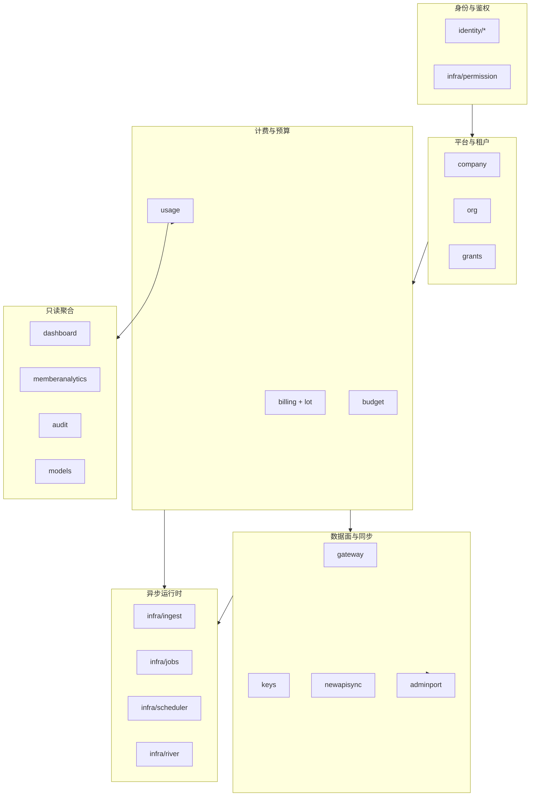

# Backend 模块化设计

> **目的：** 在**不改变分层不变量**的前提下，给出 backend 目录简化、模块边界清晰化与分阶段重构路线。  
> **读者：** 后端 / 架构；PR 评审时对照 §5 切片与 §6 自检。  
> **相关：** [Backend-架构.md](./Backend-架构.md)（分层与请求链）· [Backend-结构优化.md](./Backend-结构优化.md)（现状基线与债务清单）· [Backend-离线任务.md](./Backend-离线任务.md)（as-built 异步线）· [Backend.md](./Backend.md)（索引）

**文档定位：** 本文是**目标态设计**（how we want it organized），`Backend-结构优化.md` 记录**现状 + 剩余债务**。结构落地后先改结构优化文档，再回写本文 §2 现状对照。

---

## 1. 设计目标

| 目标 | 说明 |
| --- | --- |
| **可读** | 新人 15 分钟内能回答：请求从哪进、业务在哪、持久化在哪、异步从哪触发 |
| **可导航** | 同一概念只在一个目录「当家」；文件名即职责，不靠记忆魔法常量 |
| **可演进** | 单域改动不牵动全局；组合根（`app/`）与业务（`domain/`）变更隔离 |
| **可验证** | 分层约束可用 `rg` / CI 脚本机械检查（见 §4.3） |

**非目标（本轮不做）：**

- 改 API 契约、表结构、River kind 语义
- 引入新 DI 框架或 code-gen wiring
- 把 `tests/` 挪回 `internal/`（外挂测试包已是既定模式）

---

## 2. 现状对照

### 2.1 已做好的部分（保持）

```text
HTTP handler/middleware
  → domain.Service（业务规则）
  → store.Repository（持久化）
  → Port（adminport / JobEnqueuer / Notifier / datasource.Provider）
       ↑ app/*_enqueuer.go 适配 infra/jobs
```

| 区域 | 现状 | 评价 |
| --- | --- | --- |
| **domain 分层** | 零 `infra/*` import；NewAPI 经 `adminport.Port` | ✅ 保持 |
| **Job 端口** | 六域 `ports.go` + `app/*_enqueuer.go` | ✅ 模式正确；文件可收敛 |
| **lot 写 SSOT** | `domain/billing/lot/` | ✅ 保持 |
| **离线任务** | `jobs/kinds_*.go` + `scheduler/` + 唯一 `tenant_watchdog` | ✅ 近期已模块化；见 [Backend-离线任务.md](./Backend-离线任务.md) |
| **config** | 按主题拆 `deploy.go` / `river.go` / `watchdog.go` 等 | ✅ 保持 |
| **Store** | 接口在 `store/`，实现 `postgres/<域>_repo_<主题>.go` | ✅ 保持 |
| **org 子包** | `core/` · `structure/` · `remote/` | ✅ 已验证模式 |
| **newapisync 子包** | `platformkey/` · `outbox/` · `policy/` 等 | ✅ 保持 |

### 2.2 主要痛点

| # | 痛点 | 表现 | 影响 |
| ---: | --- | --- | --- |
| 1 | **组合根命名不一致** | `wire_*` 与 `wiring_*` 混用；`wire_domain_services.go` 实际是每个域的 `wireXxx` | 找装配入口成本高 |
| 2 | **`app/` 扁平过载** | 21 个文件同级：registry、6 enqueuer、river、gateway、identity、watchdog | DI 改动易冲突 |
| 3 | **域边界文档化不足** | 15+ domain 包平铺，缺少「业务能力地图」 | 跨域改动不知放哪 |
| 4 | **大文件机械债** | `budget/tree.go`(~350)、`feishu/client.go`(~390)、`keys_repo_crud.go`(~330) 等 | 评审 diff 噪声大 |
| 5 | **worker 与 domain 投影重复构造** | `wire_river.go` 内再 `NewProjector` / `NewReconcileService`，与 `buildDomainServices` 部分重叠 | 理解「谁拥有实例」费劲 |
| 6 | **端口定义分散** | `ports.go` / `adminport/` / `integration/datasource` / 域内具名文件 | 新端口不知落点 |

---

## 3. 模块地图（业务能力视图）

在物理目录仍用 `internal/domain/<包>` 的前提下，用**逻辑模块**组织心智模型：



| 逻辑模块 | 包路径 | 职责一句话 |
| --- | --- | --- |
| **平台与租户** | `company`、`org`、`grants` | 开户、邀请、组织树、数据源同步 |
| **身份与鉴权** | `identity/*`、`infra/permission` | Session JWT、RBAC、权限 manifest |
| **计费与预算** | `billing`、`billing/lot`、`budget`、`usage` | 充值 lot、双轴预算、入账与投影 |
| **数据面与同步** | `gateway`、`keys`、`newapisync`、`adminport` | `/v1` 预检、PlatformKey 生命周期、NewAPI Admin |
| **只读聚合** | `dashboard`、`memberanalytics`、`audit`、`models` | 看板、工作台、审计、模型目录 |
| **异步运行时** | `infra/ingest`、`infra/jobs`、`infra/scheduler`、`infra/river` | 两条异步线 + 看门狗调度 |
| **横切** | `config`、`store`、`pkg/*`、`integration/*` | 配置、持久化、纯函数、外部适配 |

**依赖规则（模块级）：**

- 只读聚合 → 可读 计费与预算、平台与租户；**不可**写 keys / newapisync
- 数据面 → 可读 计费与预算（预检）、平台与租户；**不可** import `infra/river`
- 异步运行时 → 可调 domain 公开 Service/Processor；domain **不可**反向 import
- `integration/*` 只实现 port，不被 domain 直接 import（`datasource.Provider` 接口包除外）

---

## 4. 目标目录结构

### 4.1 顶层（不变）

```text
apps/backend/
├── cmd/server/main.go          # 仅启动：config.Load → app.New → Listen
├── internal/
│   ├── app/                    # 组合根（见 §4.2 重组）
│   ├── config/
│   ├── identity/
│   ├── domain/                 # 业务（见 §4.3）
│   ├── http/
│   ├── infra/
│   ├── integration/
│   ├── pkg/
│   └── store/
├── seed/
└── tests/                      # 外挂测试，镜像 internal 结构
```

### 4.2 `app/` 组合根重组

**原则：** 按「装配阶段」分子目录；**仍保持单包 `package app`**（避免循环 import），用文件名前缀表达阶段。

```text
internal/app/
├── app.go                      # New / Close / Option / openStore
├── assemble.go                 # assembleRegistry（从 app.go 抽出）
├── registry.go                 # ServiceRegistry + buildServiceRegistry
│
├── compose_infra.go            # infra struct + buildInfraWithStore（原 wiring_infra.go）
├── compose_domain.go           # domainServices + buildDomainServices（原 wiring_domain.go）
├── compose_domain_wire.go      # wireOrg / wireBudget / …（原 wire_domain_services.go）
├── compose_http.go             # wireIdentity + wireGateway（合并原 wire_identity / wire_gateway）
├── compose_worker.go           # backgroundWorkers + buildBackgroundWorkers（原 wire_river.go）
├── compose_watchdog.go         # startDeferredWatchdog（原 watchdog_bootstrap.go）
│
├── port_billing.go               # 域 Job 端口适配器（原 billing_enqueuer.go）
├── port_budget.go
├── port_usage.go
├── port_dashboard.go
├── port_newapisync.go
├── port_org.go
├── port_util.go                  # 原 enqueuer_util.go
├── holder_org_river.go         # OrgRiverAdminHolder（原 org_admin_holder.go）
├── dev_bootstrap.go
└── testhook*.go                # 测试钩子，build tag 隔离
```

**命名约定：**

| 前缀 | 含义 |
| --- | --- |
| `compose_*` | 装配函数（替代混用的 `wire_*` / `wiring_*`） |
| `port_*` | domain 端口 → `infra/jobs.Enqueuer` 的薄适配（同包 `app`，不用子目录以避免新 package） |
| `holder_*` | 延迟绑定（River Client 就绪前占位） |

**实例所有权（消除 §2.2 #5）：**

| 实例 | 唯一构造点 | 注入去向 |
| --- | --- | --- |
| `budget.Projector` / `Reconcile` | `compose_worker.go`（worker 专用） | `river.Client` deps |
| `dashboard.Projector` / `Reconcile` | 同上 | 同上 |
| `domainbudget.Service` 等 HTTP 域服务 | `compose_domain_wire.go` | `httpdeps.Deps` |
| `jobs.Holder` | `app.New` | 先 Noop → River 启动后 `Set` |

HTTP 域服务**不**持有 Projector；投影只存在于 worker 链。文档与代码注释在 `compose_worker.go` 顶部写明此表。

### 4.3 `domain/` 约定（增量）

保持扁平包为主；**仅在出现稳定子域时**建子包（与 org、newapisync、billing/lot 同级策略）。

| 包 | 目标文件形态 | 备注 |
| --- | --- | --- |
| `budget` | `service.go`、`tree_*.go`、`projector.go`、`reconcile.go`、`overrun.go`、`ports.go` | 拆 `tree.go` → `tree_query.go` + `tree_mutate.go` |
| `usage` | `ingest.go`、`reader.go`、`entry_*.go`、`ports.go` | `entry.go` 按写入/读取拆 |
| `keys` | `service.go`、`platform_key_*.go`、`provider_key.go`、`approval.go` | 已较好 |
| `org/remote` | `sync.go` → `sync_run.go` + `sync_schedule.go`；`import.go` 保持 | 见 §5 PR-B |
| `integration/datasource/feishu` | `client.go`（连接）+ `auth.go` + `departments.go` + `members.go` | 见 §5 PR-C |

**端口落点规则：**

1. **Job 类异步** → `domain/<域>/ports.go`
2. **外部 Admin API** → `domain/adminport/`
3. **第三方 HR 数据源** → `integration/datasource/` 接口 + factory
4. **单域只读依赖** → 域内小接口文件（如 `gateway_soft_cache.go`），不建全局 `ports/`

### 4.4 `infra/` 异步栈（终态，大部分已达成）

```text
infra/
├── jobs/
│   ├── catalog.go              # kind 常量 SSOT
│   ├── kinds_*.go                # 按域：billing / budget / dashboard / org / newapi / watchdog
│   ├── enqueue.go                # Insert / InsertInTx helper
│   ├── enqueuer.go               # Enqueuer 接口
│   └── holder.go                 # bootstrap Noop 占位
├── scheduler/
│   ├── due.go                    # L2 due 查询（只读 store）
│   ├── bulk_enqueue.go           # 分批入队
│   └── watchdog_run.go           # RunOnce（启动补漏）
├── river/
│   ├── client.go
│   ├── periodic/watchdog.go
│   └── workers/                  # 薄壳：一文件一 kind 或一处理器
├── ingest/                       # 线 A
└── budgetcheck/                  # Gateway 软缓存
```

**禁止回退：** 不再新增 `*_fanout` Periodic；调度 SSOT 为 `tenant_background_state` + `tenant_watchdog`（见 [Backend-离线任务.md](./Backend-离线任务.md)）。

### 4.5 `http/` 边界（保持）

```text
http/
├── router.go
├── deps/deps.go                  # HTTP 依赖 struct；无 store.Store
├── handler/<域>/                 # 一域一包；org 按资源拆文件
├── middleware/
└── httputil/、response/
```

Handler 继续**零业务规则**；新路由只注册在 `handler/register.go`。

### 4.6 `store/` 与 `tests/` 对称

| 生产 | 测试 |
| --- | --- |
| `store/<域>_repo.go` 接口 | `tests/domain/<域>/` |
| `store/postgres/<域>_repo_<主题>.go` | `tests/store/postgres/` |
| `store/tx.go`（`Tx` 事务面） | `tests/testutil/` 子包按域 |

新 Repository 方法：**先**改 `store/` 接口，**再** `postgres/` 实现，**最后** domain 消费。

---

## 5. 分阶段重构（PR 切片）

每 PR 独立可合并、`make test-unit` 全绿；**禁止**「大 bang」目录搬家。

### PR-A · 组合根命名收敛（低风险）

| 动作 | 说明 |
| --- | --- |
| 重命名 | ✅ `compose_*` / `port_*` / `holder_*` / `assemble.go`（见本文 §4.2） |
| 合并 | `wire_identity.go` + `wire_gateway.go` → `compose_http.go` |
| 子目录 | `*_enqueuer.go` → `port_*.go`（同包 `app`；Go 子目录即新 package，故不用 `port/` 目录） |
| 文档 | 更新 [Backend-架构.md §3](./Backend-架构.md#3-项目结构)、[Backend-结构优化.md §1.3](./Backend-结构优化.md#13-领域端口) 注入路径 |

**验收：** 仅 `app/` 路径变更；零业务逻辑 diff；`rg 'wiring_|wire_domain_services|wire_river' apps/backend` 无命中。

### PR-B · domain 大文件机械拆分（中风险）

按 §4.3 表拆分 `budget/tree.go`、`org/remote/sync.go`、`usage/entry.go`；**行为不变**，仅移动符号。

**验收：** `go test -tags=testhook ./tests/domain/budget/... ./tests/domain/org/...` 绿。

### PR-C · integration 拆分（低风险）

`feishu/client.go` → `auth.go`、`departments.go`、`members.go` + 瘦 `client.go`。

**验收：** `go test ./tests/domain/org/... -run Datasource` 绿。

### PR-D · worker 实例注释与轻微去重（低风险）

在 `compose_worker.go` 顶部加「实例所有权」表；若 `registry` 与 worker 存在重复 `NewXxx`，抽 `compose_worker_deps.go`  package-private 构造函数，避免两处传参不一致。

### PR-E · 结构守卫脚本（低风险）

在 `apps/backend/Makefile` 或 `scripts/verify.sh` 增加：

```bash
# domain 不 import infra
rg 'internal/infra/' internal/domain/ && exit 1 || true
# handler 不直访 store
rg '\.Store\b' internal/http/handler/ && exit 1 || true
# 禁止回退 fanout periodic
rg 'fanout' internal/infra/river/periodic/ && exit 1 || true
```

---

## 6. PR 自检清单

与 [Backend-结构优化.md §3](./Backend-结构优化.md#3-pr-自检) 合并使用：

- [ ] 新代码落在 §3 模块地图的正确逻辑模块内
- [ ] 组合根变更只在 `app/compose_*` 或 `app/port_*`
- [ ] 新 Job：`domain/*/ports.go` + `app/port_<域>.go`；domain 不 import `infra/jobs`
- [ ] 新外部系统：先 `adminport` 或 `integration/`，再在 `compose_infra.go` 注入
- [ ] Store 新能力：接口 → postgres 实现 → domain
- [ ] 单文件超过 ~250 行且含 2+ 正交主题 → 按 §4.3 拆分
- [ ] `make test-unit` 全绿

---

## 7. 与现有文档分工

| 文档 | 写什么 |
| --- | --- |
| **本文** | 模块地图、目标目录、`app/` 重组、PR 切片 |
| [Backend-架构.md](./Backend-架构.md) | 分层、请求链、Gateway/Ingest 行为（as-built） |
| [Backend-结构优化.md](./Backend-结构优化.md) | 现状基线、剩余债务、端口表 |
| [Backend-离线任务.md](./Backend-离线任务.md) | 异步线 as-built |
| [架构终态设计.md](./架构终态设计.md) | 产品/性能目标态（Gateway 延迟、投影 Lag） |

**维护顺序：** 代码合并 → 更新 `Backend-结构优化.md` §1 → 更新 `Backend-架构.md` §3 树 → 勾选本文 §5 对应 PR。

---

## 8. 附录：关键入口速查

| 问题 | 入口 |
| --- | --- |
| 进程如何启动？ | `cmd/server/main.go` → `app.New` |
| HTTP 路由在哪？ | `http/router.go` → `handler/register.go` |
| 域服务如何装配？ | `app/compose_domain_wire.go` |
| 后台任务如何启动？ | `app/compose_worker.go` → `ingest` + `river` |
| Job 如何入队？ | `domain` 端口 → `app/port_*` → `infra/jobs` |
| 看门狗调度？ | `infra/scheduler/due.go` + `tenant_watchdog` worker |
| 测试如何建 app？ | `tests/testutil` + `app/testhook_registry.go` |

---

*初版：2026-07 · 随 PR-A～E 落地迭代 §2 现状对照与 §5 勾选状态。*
