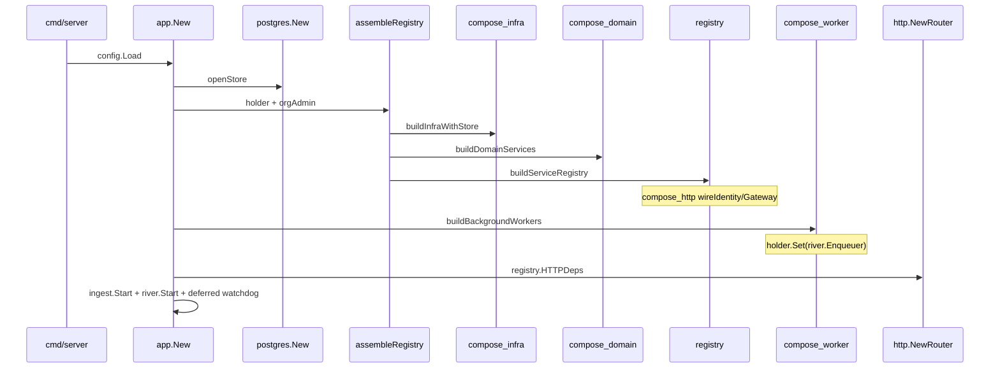
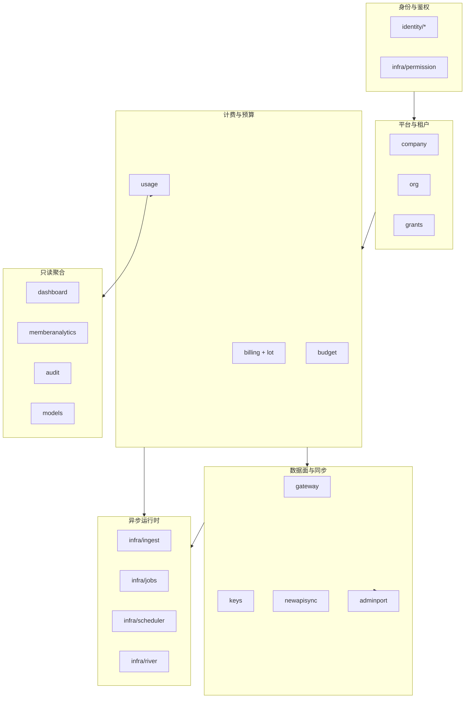

# Backend 模块化设计

> **目的：** 记录 `apps/backend/` **模块边界**、**as-built 目录约定**与**剩余重构切片**。  
> **读者：** 后端 / 架构；PR 评审对照 §5 进度与 §6 自检。  
> **相关：** [Backend-架构.md](./Backend-架构.md) · [Backend-结构优化.md](./Backend-结构优化.md) · [Backend-离线任务.md](./Backend-离线任务.md) · [Backend.md](./Backend.md)

**文档定位：** `Backend-结构优化.md` 记分层不变量与端口表；**本文**记模块地图、`app/` 组合根 as-built、装配链路与待办 PR。结构变更：**代码 → 本文 §2/§4 → `Backend-结构优化.md` → `Backend-架构.md` §3**。

---

## 1. 设计目标

| 目标 | 说明 |
| --- | --- |
| **可读** | 新人 15 分钟内能回答：请求从哪进、业务在哪、持久化在哪、异步从哪触发 |
| **可导航** | 同一概念只在一个目录「当家」；文件名即职责 |
| **可演进** | 单域改动不牵动全局；`app/` 装配与 `domain/` 业务隔离 |
| **可验证** | 分层约束可用 `rg` 机械检查（§2.1） |

**非目标：** 改 API 契约 / 表结构 / River kind 语义；引入 DI 框架；`tests/` 回迁 `internal/`。

---

## 2. 现状（as-built）

### 2.1 分层不变量（已验证）

```text
HTTP handler/middleware
  → domain.Service（业务规则）
  → store.Repository（持久化）
  → Port（adminport / JobEnqueuer / Notifier / datasource.Provider）
       ↑ app/port_*.go 适配 infra/jobs
```

**机械检查（2026-07，本地 `rg` 零命中）：**

```bash
rg 'internal/infra/'           apps/backend/internal/domain/
rg 'integration/newapi|integration/datasource/feishu' apps/backend/internal/domain/
rg '\.Store\b'                 apps/backend/internal/http/handler/
rg 'fanout'                    apps/backend/internal/infra/river/periodic/
```

| 约束 | 状态 |
| --- | --- |
| domain 零 `infra/*` import | ✅ |
| domain 零具体 `integration/newapi`、`feishu` import | ✅ |
| handler 不直访 `store.Store` | ✅ |
| Periodic 仅 `tenant_watchdog`（无 fanout） | ✅ |
| lot 写 SSOT：`domain/billing/lot/` | ✅ |
| DTO SSOT：`domain/types/` | ✅ |

### 2.2 组合根 `app/`（已重组）

21 个文件、单包 `package app`，按**装配阶段**命名：

```text
internal/app/
├── app.go                  # New / Close / Option；openStore → assembleRegistry → workers → router
├── assemble.go             # assembleRegistry：infra → domain → registry
├── registry.go             # ServiceRegistry、buildServiceRegistry、IngestWorker
│
├── compose_infra.go        # infra struct；buildInfraWithStore（adminPort / newAPISync / notifier …）
├── compose_domain.go       # domainServices struct；buildDomainServices
├── compose_domain_wire.go  # wireOrg / wireBudget / wireKeys / …（每域构造函数）
├── compose_http.go         # wireIdentity、wireGateway、wirePrecheckService
├── compose_worker.go       # backgroundWorkers；River + Ingest；**仅此处**构造 Projector/Reconcile
├── compose_watchdog.go     # startDeferredWatchdog（启动后 L2 补漏入队）
│
├── port_billing.go           # billing.JobEnqueuer 适配
├── port_budget.go
├── port_usage.go
├── port_dashboard.go
├── port_newapisync.go
├── port_org.go
├── port_util.go
├── holder_org_river.go     # OrgRiverAdminHolder（River 就绪前 Cancel/Reschedule 占位）
│
├── dev_bootstrap.go
└── testhook*.go            # -tags=testhook
```

| 前缀 | 含义 |
| --- | --- |
| `compose_*` | 装配阶段（infra → domain → http → worker） |
| `port_*` | 域 `JobEnqueuer` → `infra/jobs.Enqueuer` 薄适配 |
| `holder_*` | 延迟绑定（River Client 启动后 `Set`） |

**实例所有权（`compose_worker.go` 顶部注释 + 代码一致）：**

| 实例 | 构造点 | 消费方 |
| --- | --- | --- |
| `budget.Async`（Reconcile） | `compose_worker.go` | `river.Client` |
| `dashboard.Projector` / `ReconcileService` | `compose_worker.go` | `river.Client` |
| HTTP 域 `Service`（含 `budget.Service`） | `compose_domain_wire.go` | `httpdeps.Deps` |
| `jobs.Holder` | `app.New` | Noop → River 启动后 `holder.Set` |
| `scheduler.Service` / `BulkEnqueuer` | `compose_worker.go` | `tenant_watchdog` worker |

HTTP 域服务**不**持有 Projector；入账快路径经 `usage.IngestJobEnqueuer` 在事务内 `InsertInTx`（仅 `wallet_sync`）。

### 2.3 装配链路



**注入 SSOT（查找改 DI 时从这里开始）：**

| 阶段 | 文件 |
| --- | --- |
| 外部适配 / 横切 infra | `compose_infra.go` |
| 域服务构造 | `compose_domain_wire.go` |
| HTTP + Gateway + Identity | `compose_http.go`、`registry.go` |
| 后台 worker | `compose_worker.go` |
| Job 端口适配 | `port_*.go` |

### 2.4 其它层 as-built

| 层 | 规模 / 形态 | 说明 |
| --- | --- | --- |
| **domain** | 15 顶域包 + `types/`；子包：`org/{core,structure,remote}`、`billing/lot`、`newapisync/*` | `org/structure` 已按 member/role/department 拆文件 |
| **infra 异步** | `jobs/kinds_{billing,budget,dashboard,org,newapi,watchdog}.go` + `scheduler/` + `river/workers/` | 10 kind；见 [Backend-离线任务.md](./Backend-离线任务.md) |
| **integration** | `newapi/`（Admin 适配）、`datasource/feishu` + `factory` | `feishu/client.go` 仍 ~390 行 |
| **store** | 接口 28 文件 + `postgres/<域>_repo_<主题>.go` | 含 `tenant_background_state`、`projection_progress` |
| **identity** | `authz/`、`credentials/`、`sessiontoken/`、`httpx/` | 4 子包 |
| **http** | `handler/` 14 域包；`org/` 按 REST 资源拆 7 文件 | `deps/deps.go` 无 `store.Store` |
| **config** | 10 文件：`deploy` / `river` / `watchdog` / `worker` / … | `Load()` + `validate()` fail-fast |

### 2.5 剩余痛点

| # | 项 | 表现 | 切片 |
| ---: | --- | --- | --- |
| 1 | **结构守卫** | §2.1 四条 `rg` 已入 `make lint`（`scripts/layer-guard.sh`） | ✅ |
| 2 | **端口定义分散** | Job 在 `ports.go`；`newapisync` 在 `ports/ports.go`；`adminport` 独立包 | 低优 |

**已收口：** `compose_*` / `port_*` 组合根命名；`app/` 按装配阶段分文件；worker 与 HTTP 投影实例归属；存量文档命名统一；大文件机械拆分（`budget/tree`、`org/remote/sync`、`usage/entry`、`feishu/client`）。

---

## 3. 模块地图（业务能力视图）

物理目录仍为 `internal/domain/<包>`；下列为**逻辑模块**心智模型：



| 逻辑模块 | 包路径 | 职责 |
| --- | --- | --- |
| **平台与租户** | `company`、`org`、`grants` | 开户、邀请、组织树、数据源同步 |
| **身份与鉴权** | `identity/*`、`infra/permission` | Session JWT、RBAC、权限 manifest |
| **计费与预算** | `billing`、`billing/lot`、`budget`、`usage` | 充值 lot、双轴预算、入账与投影 |
| **数据面与同步** | `gateway`、`keys`、`newapisync`、`adminport` | `/v1` 预检、PlatformKey、NewAPI Admin |
| **只读聚合** | `dashboard`、`memberanalytics`、`audit`、`models` | 看板、工作台、审计、模型目录 |
| **异步运行时** | `infra/ingest`、`infra/jobs`、`infra/scheduler`、`infra/river` | 两条异步线 + 看门狗 |
| **横切** | `config`、`store`、`pkg/*`、`integration/*` | 配置、持久化、纯函数、外部适配 |

**模块级依赖：**

- 只读聚合 → 可读计费/租户；**不写** keys / newapisync
- 数据面 → 可读计费（预检）、租户；**不** import `infra/river`
- 异步 → 调 domain 公开 Processor；domain **不**反向 import
- `integration/*` 实现 port；domain 不 import 具体 HTTP 客户端（`datasource.Provider` 接口包除外）

---

## 4. 目录约定

### 4.1 顶层

```text
apps/backend/
├── cmd/server/main.go
├── internal/
│   ├── app/           # 组合根（§2.2 as-built）
│   ├── config/
│   ├── identity/
│   ├── domain/
│   ├── http/
│   ├── infra/
│   ├── integration/
│   ├── pkg/
│   └── store/
├── seed/
└── tests/             # 外挂测试，镜像 domain/handler/store
```

### 4.2 `domain/` 文件约定

扁平包为主；**稳定子域**才建子包（`org`、`newapisync`、`billing/lot` 已验证）。

| 包 | 现状 | 备注 |
| --- | --- | --- |
| `budget` | `tree_query.go` + `tree_mutate.go` | ✅ 已拆 |
| `usage` | `entry_build.go` + `entry_load.go` | ✅ 已拆 |
| `org/remote` | `sync_run.go` + `sync_schedule.go` + `sync.go` | ✅ 已拆 |
| `org/structure` | 已拆 `member_*` / `role_*` / `department` | — |
| `keys` | `platform_key_*.go` + `approval.go` | — |
| `integration/feishu` | `client.go` + `auth.go` + `departments.go` + `members.go` | ✅ 已拆 |

**端口落点：**

1. Job 异步 → `domain/<域>/ports.go`（`newapisync` 例外：`ports/ports.go`）
2. NewAPI Admin → `domain/adminport/`
3. HR 数据源 → `integration/datasource/`
4. 单域只读依赖 → 域内具名文件（如 `gateway_soft_cache.go`）

### 4.3 `infra/` 异步栈（as-built）

```text
infra/
├── jobs/
│   ├── catalog.go           # 10 kind 常量 SSOT
│   ├── kinds_*.go             # billing / budget / dashboard / org / newapi / watchdog
│   ├── enqueue.go、enqueuer.go、holder.go
├── scheduler/
│   ├── due.go               # L2 due（读 tenant_background_state）
│   ├── bulk_enqueue.go
│   └── watchdog_run.go      # 启动补漏 RunOnce
├── river/
│   ├── client.go
│   ├── periodic/watchdog.go
│   └── workers/             # 9 worker 文件 + watchdog
├── ingest/                  # 线 A
└── budgetcheck/             # Gateway 软缓存
```

**禁止回退：** 不新增 `*_fanout` Periodic；调度 SSOT = `tenant_background_state` + `tenant_watchdog`。

### 4.4 `http/` · `store/` · `tests/`

| 层 | 约定 |
| --- | --- |
| **http** | Handler 零业务规则；路由 `handler/register.go`；`deps` 无 `Store` |
| **store** | 接口 `store/<域>_repo.go` → 实现 `postgres/<域>_repo_<主题>.go`；事务 `store/tx.go` |
| **tests** | `tests/domain/<域>/`、`tests/handler/<域>/`、`tests/testutil/` 子包 |

新 Repository：**接口 → postgres → domain**。

---

## 5. 重构切片与进度

每 PR 独立可合并、`make test-unit` 全绿。

| PR | 内容 | 状态 |
| --- | --- | --- |
| **A** | `app/` 命名收敛：`compose_*` / `port_*` / `assemble.go` / `holder_org_river.go` | ✅ 已落地 |
| **D** | `compose_worker.go` 实例所有权注释 | ✅ 已落地 |
| **B** | domain 大文件：`budget/tree`、`org/remote/sync`、`usage/entry` | ✅ 已落地 |
| **C** | `feishu/client.go` 拆分 | ✅ 已落地 |
| **E** | §2.1 四条 `rg` 写入 `make lint`（`scripts/layer-guard.sh`） | ✅ 已落地 |
| **doc** | 文档与 scaffold 统一 `compose_*` / `port_*` 命名 | ✅ 已落地 |

### PR-B 验收

```bash
go test -tags=testhook ./tests/domain/budget/... ./tests/domain/org/...
```

### PR-C 验收

```bash
go test -tags=testhook ./tests/domain/org/... -run Datasource
```

### PR-E 建议脚本

```bash
# apps/backend/scripts/layer-guard.sh 或并入 Makefile lint
set -e
rg 'internal/infra/' apps/backend/internal/domain/ && exit 1
rg 'integration/newapi|integration/datasource/feishu' apps/backend/internal/domain/ && exit 1
rg '\.Store\b' apps/backend/internal/http/handler/ && exit 1
rg 'fanout' apps/backend/internal/infra/river/periodic/ && exit 1
```

---

## 6. PR 自检清单

与 [Backend-结构优化.md §3](./Backend-结构优化.md#3-pr-自检) 合并：

- [ ] 改动落在 §3 正确逻辑模块
- [ ] 组合根只在 `app/compose_*` 或 `app/port_*`
- [ ] 新 Job：`domain/*/ports.go` + `app/port_<域>.go`；domain 不 import `infra/jobs`
- [ ] 新外部系统：`adminport` 或 `integration/` → `compose_infra.go`
- [ ] Store：接口 → postgres → domain
- [ ] 单文件 >~250 行且 2+ 正交主题 → 按 §4.2 拆
- [ ] `make test-unit` 全绿

---

## 7. 文档分工

| 文档 | 内容 |
| --- | --- |
| **本文** | 模块地图、`app/` as-built、装配链路、PR 进度 |
| [Backend-结构优化.md](./Backend-结构优化.md) | 分层不变量、端口表、剩余债务 |
| [Backend-架构.md](./Backend-架构.md) | 请求链、Gateway/Ingest、Store 行为 |
| [Backend-离线任务.md](./Backend-离线任务.md) | 异步线 kind / 入队 / Worker |
| [架构终态设计.md](./架构终态设计.md) | 性能与 Lag 目标态 |

---

## 8. 入口速查

| 问题 | 入口 |
| --- | --- |
| 进程启动 | `cmd/server/main.go` → `app.New` |
| 装配总线 | `assemble.go` → `compose_infra` → `compose_domain` → `registry` |
| HTTP 路由 | `http/router.go` → `handler/register.go` |
| 域服务 DI | `compose_domain_wire.go` |
| 后台任务 | `compose_worker.go`（ingest + river） |
| Job 入队 | domain 端口 → `port_*` → `infra/jobs` |
| 看门狗 | `compose_watchdog.go` → `scheduler.RunOnce`；周期 `river/periodic/watchdog.go` |
| 测试装配 | `testhook_registry.go` + `tests/testutil` |

---

*更新：2026-07 · PR-A～E 全部落地。*
