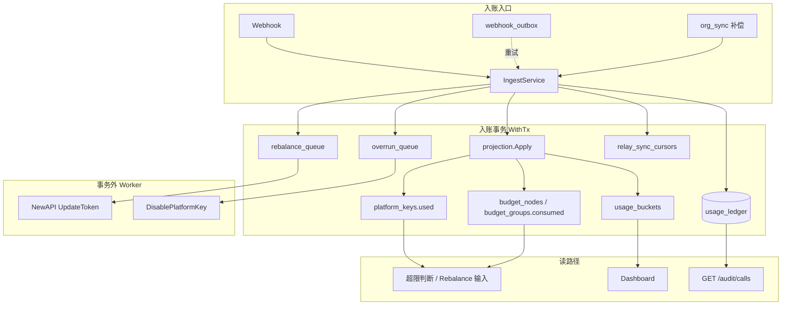

# Backend 消耗数据 SSOT 对齐方案

**文档性质：** 架构决策（O1 权威来源）  
**状态：** 已决策（终态）  
**受众：** 后端、产品、运维

**姊妹文档（分工）：**

| 文档 | 本文覆盖 | 姊妹文档覆盖 |
| ---- | -------- | ------------ |
| 入账/Rebalance/超限运作细节 | 写入契约、表结构、切换 | [Backend-预算运作.md](./Backend-预算运作.md) §7～§9 |
| 实体全景与域关系 | `usage_ledger` 定位 | [Backend-存储架构.md](./Backend-存储架构.md) §8、§9 |
| O1 在优化路线图中的位置 | 全文 | [Backend-存储实体优化.md](./Backend-存储实体优化.md) §3 |
| 审计 API 与 `CallLog` 类型 | §4.3 字段映射 | [Frontend-API契约.md](./Frontend-API契约.md) §5 审计、`CallLog` |

字段级 DDL 以 `apps/backend/internal/store/postgres/schema.sql` 为准；落地后同步更新上表姊妹文档。

---

## 0. 决策摘要

| 项 | 决策 |
| -- | ---- |
| **事实 SSOT** | `usage_ledger` — 追加式消耗账本 |
| **投影策略** | **全部同步**（单事务 `projection.Apply`）；无投影 Outbox、无投影 Worker |
| **审计读路径** | `usage_ledger`（`event_type = call_settled`）；**禁止** join NewAPI `logs` |
| **审计文本** | 仅 `call_detail.previewSnippet`（input 截断 ~200 字）；`audit_settings.content_retention_enabled=true` 时写入；**永不**存 output 正文 |
| **计量** | `input_tokens` / `output_tokens` 为顶层列数字，与是否保留 snippet 无关 |
| **幂等** | 事务内 `INSERT … ON CONFLICT DO NOTHING`；冲突则跳过投影与副作用 |
| **副作用** | 同事务入队 `rebalance_queue` / **`overrun_queue`（新增）**；**禁止**事务内外部 RPC |
| **Schema 瘦身** | 账本无 `newapi_log_id`、`bucket_start`；分别从 `idempotency_key`、`occurred_at` 派生 |
| **代码** | `ingest.go` 编排 + `projection.Apply`；calls 查询在 `domain/usage.CallLogQuerier` + `ledger_repo`；`domain/audit` 仅管 settings 与 operations |
| **落地** | Schema 见 `schema.sql`；服务启动全量应用 |

**一句话：** 瘦账本 SSOT + 同步投影；审计只查账本；超限由 Worker 异步消费 `overrun_queue`。

### 0.1 架构边界（不可再砍）

| 保留 | 原因 |
| ---- | ---- |
| `usage_ledger` | 事实、幂等门闩、重放、对账 |
| `used` / `consumed` / `usage_buckets` | 管控毫秒级、看板预聚合；不能每次扫账本 |
| `rebalance_queue` + `overrun_queue` | 语义不同（配额同步 vs 超限封禁），**不合并** |

详见 [Backend-存储实体优化.md](./Backend-存储实体优化.md) §9.1（用量桶 vs 账本不合并）。

### 0.2 入账设计要点

| 要点 | 实现 |
| ---- | ---- |
| 幂等 | 事务内 `INSERT … ON CONFLICT DO NOTHING`；冲突跳过投影与副作用 |
| 热路径 IO | `projection.Apply` 定点 `UPDATE`，不读全量 `Tree()` / `PlatformKeys` |
| 超限 | 事务内入队 `overrun_queue`；Worker 调用 `evaluateOverrun` |
| 审计 | `GET /audit/calls` 直读 `usage_ledger`；仅存 `previewSnippet` |

**入账入口（不变）：**

```text
POST /internal/webhooks/newapi-log  →  IngestService.Ingest
失败  →  webhook_outbox 重试（at-least-once 投递，非幂等门闩）
补偿  →  org_sync_processor 轮询 ListLogs  →  同一 Ingest 路径
```

金额：`domain/usage.CostCNYFromLog(quota, model, models)`（与现网一致）。

---

## 1. 问题与约束

一次结算若缺少可重放的事实层，则 `platform_keys.used`、`budget_nodes.consumed`、`budget_groups.consumed`、`usage_buckets` 等多处投影难以对账与重放（§0.2）。

| 约束 | 要求 |
| ---- | ---- |
| 管控 SLA | 超限、Rebalance 读投影表，毫秒级 |
| 分析 SLA | Dashboard 单次桶 UPSERT（与现 `applyIngestTx` 等价） |
| 审计 SLA | 账本分页，索引 `(company_id, occurred_at)` |
| 交付 | Webhook at-least-once + 账本幂等 |
| 部署 | Postgres 单体，多租户 `company_id` |

### 1.1 为何不做异步投影

桶投影仅 PK Upsert；审计与账本 1:1。**不为未出现的规模预建** `projection_outbox`（见 §11）。首版瓶颈更可能在祖先 `budget_nodes` 行锁（§11），而非桶 Upsert。

---

## 2. 目标架构

### 2.1 两层模型



| 层 | 存储 | 写入 | 读取方 |
| -- | ---- | ---- | ------ |
| **事实** | `usage_ledger` | INSERT | 审计、财务、重放 |
| **投影** | `used` / `consumed` / `usage_buckets` | `projection.Apply` | 管控、看板 |

### 2.2 入账顺序

```text
1. INSERT usage_ledger              -- ON CONFLICT → 整笔跳过（幂等）
2. projection.Apply(entry)          -- §2.4
3. enqueueSideEffects(entry)        -- rebalance + overrun + cursor
```

任一步失败整事务回滚。

**`rebalance_queue` 入队轴**（与 [Backend-预算运作.md](./Backend-预算运作.md) §8.2 一致）：

| 条件 | `axis_kind` | `axis_id` |
| ---- | ----------- | --------- |
| 有 `member_id` | `member` | 成员 ID |
| 每次入账 | `department` | `department_id`（mapping） |
| 有 `budget_group_id` | `budget_group` | 组 ID |

**`relay_sync_cursors`：** `idempotency_key` 为 `newapi:{log_id}` 时，若 log id 大于当前 `last_log_id` 则推进。

### 2.3 幂等契约

| 规则 | 说明 |
| ---- | ---- |
| 唯一约束 | `UNIQUE (company_id, idempotency_key)` |
| 门闩 | 事务内 `INSERT … ON CONFLICT DO NOTHING` |
| 冲突 | 跳过投影与副作用 |
| 键格式 | Webhook/补偿：`newapi:{log_id}`；Gateway（预留）：`gateway:{request_id}` |

`webhook_outbox` 仅负责**失败重投**，幂等由账本承担。NewAPI `log_id` 从 `idempotency_key` 解析，**不单独存列**。

### 2.4 `projection.Apply` 内部顺序

| 步骤 | 目标 | 要求 |
| ---- | ---- | ---- |
| a | `platform_keys.used` | `+= amount_cny`；按 `platform_key_id` 单行 UPDATE |
| b | `budget_groups.consumed` | 有 `budget_group_id` 时 `+= amount_cny` |
| c | `budget_nodes.consumed` | 以 **`department_id`（mapping）** 为叶子向上祖先 rollup（§2.5） |
| d | `usage_buckets` | UPSERT；`bucket_start = date_trunc('hour', occurred_at)`；`member_id` 空 → `''`（§2.6） |

### 2.5 祖先 rollup

语义同现 `rollupDepartmentConsumed`：叶子 `department_id` 及所有祖先 `+= amount_cny`。**禁止** `Tree()` / `SetTree()`。

```sql
WITH RECURSIVE ancestors AS (
  SELECT id, parent_id FROM budget_nodes
  WHERE company_id = $1 AND id = $department_id
  UNION ALL
  SELECT n.id, n.parent_id FROM budget_nodes n
  INNER JOIN ancestors a ON n.id = a.parent_id
  WHERE n.company_id = $1 AND a.parent_id IS NOT NULL
)
UPDATE budget_nodes SET consumed = consumed + $amount
WHERE company_id = $1 AND id IN (SELECT id FROM ancestors);
```

> **与现网差异：** 现 `applyIngestTx` 仅在 `member_id != nil` 时 rollup；O1 统一以 mapping.`department_id` 为叶子（应用 Key / 非成员 Key 同样计入部门树）。

### 2.6 `member_id` 与桶维度

| 场景 | `usage_ledger.member_id` | `usage_buckets.member_id` |
| ---- | ------------------------ | ------------------------- |
| 成员 Key | 成员 ID | 同左 |
| 非成员 / 应用 Key | `NULL` | `''`（现网 PK） |

### 2.7 派生字段（不入账）

| 用途 | 派生 |
| ---- | ---- |
| NewAPI log 对账 | `idempotency_key` 去前缀 `newapi:` |
| 桶 `bucket_start` | `date_trunc('hour', occurred_at)` |

---

## 3. 账本内容与写入契约

### 3.1 读路径 SSOT

| 场景 | 读什么 |
| ---- | ------ |
| 预算超限、Rebalance | `consumed`、`used`（投影） |
| Dashboard | `usage_buckets` |
| `GET /audit/calls` | `usage_ledger` |
| 财务导出 | `usage_ledger` |
| Token `remain_quota` | `relay_mappings` + NewAPI（非组织消耗 SSOT） |

### 3.2 规则

1. 唯一写入入口：`IngestService`、调账 API（后续）；
2. 先账本、后投影；投影失败则回滚；
3. 投影仅 `domain/usage/projection.go` → `Apply`；
4. 副作用仅入队；事务内无 RPC、无 `DisablePlatformKey`；
5. 文本边界见 §3.3。

### 3.3 `call_detail`、Webhook 与审计 API

**文本边界：**

| 类型 | 入账本？ |
| ---- | -------- |
| input 原文 | ✗ → 仅 `previewSnippet` ≤ ~200 字 |
| output 原文 | ✗ 永不 |
| token 计数 | ✓ 顶层 `input_tokens` / `output_tokens` |

**`content_retention_enabled`（`audit_settings`）：** `true` 时从 Webhook `input` 截断写 `previewSnippet`；`false` 不写。变更**不追溯**删历史 snippet。

**字段来源：**

| 目标 | 位置 | 来源 |
| ---- | ---- | ---- |
| `amount_cny`, `model`, `occurred_at` | 顶层 | Webhook `quota`→CostCNY、`model`、`created_at` |
| `department_id`, `member_id`, `platform_key_id`, `budget_group_id` | 顶层 | `relay_mappings` |
| `idempotency_key`, `source` | 顶层 | `newapi:{id}`；`webhook` / `compensate` |
| `caller*`, `provider`, `status` | `call_detail` | TokenJoy enrich |
| `latencyMs` | `call_detail` | Webhook `use_time`；缺省 `0` |
| `previewSnippet` | `call_detail` | Webhook `input` 截断 |

**Webhook 扩展 payload**（在现有 `id/token_id/quota/model/created_at` 上追加可选字段）：

```json
{
  "prompt_tokens": 1200,
  "completion_tokens": 340,
  "use_time": 320,
  "input": "..."
}
```

不解析、不存储 `output`。`id` → `idempotency_key = newapi:{id}`。

**补偿（`ListLogs`）：** 与 Webhook 共用 Ingest 与幂等键；字段缺口降级（token/latency→0，无 `input`→空 snippet）。**禁止**以补偿路径 join NewAPI 补全审计列表。

**审计 API 映射** → `CallLog`（契约见 [Frontend-API契约.md](./Frontend-API契约.md)）：

| CallLog | 账本来源 |
| ------- | -------- |
| `id` | `usage_ledger.id` |
| `cost`, `model`, `createdAt` | `amount_cny`, `model`, `occurred_at` |
| `inputTokens`, `outputTokens` | 顶层计数列 |
| `caller*`, `provider`, `status`, `latencyMs`, `previewSnippet` | `call_detail` |

首版无 output 全文 content 接口。

### 3.4 事件类型（首版范围）

| `event_type` | 首版 | 入口 |
| ------------ | ---- | ---- |
| `call_settled` | ✓ | Webhook / 补偿 |
| `manual_adjust` / `call_refund` / `period_reset` | 后续 | 控制台 |

`source=gateway`、`gateway:{request_id}` 枚举预留，首版不实现。

---

## 4. 存储变更

### 4.1 一览

| 动作 | 对象 |
| ---- | ---- |
| **事实层** | `usage_ledger` |
| **异步队列** | `overrun_queue` |
| **投影** | `platform_keys.used`、`budget_nodes.consumed`、`budget_groups.consumed`、`usage_buckets` |
| **保留** | `rebalance_queue`、`webhook_outbox`、`relay_sync_cursors` |

### 4.2 `usage_ledger`

| 字段 | 类型 | 说明 |
| ---- | ---- | ---- |
| `id` | `TEXT` | `ul-{ulid}` |
| `company_id` | `BIGINT` | 租户 |
| `event_type` | `TEXT` | 首版 `call_settled` |
| `idempotency_key` | `TEXT` | 幂等键 |
| `amount_cny` | `NUMERIC(18,6)` | |
| `department_id` | `TEXT` | mapping |
| `member_id` | `TEXT` | 可空 |
| `budget_group_id` | `TEXT` | 可空 |
| `platform_key_id` | `TEXT` | |
| `source` | `TEXT` | `webhook` \| `compensate` |
| `occurred_at` | `TIMESTAMPTZ` | 业务时间 |
| `model` | `TEXT` | |
| `input_tokens` / `output_tokens` | `BIGINT` | 计数 |
| `call_detail` | `JSONB` | 轻审计字段 |
| `created_at` | `TIMESTAMPTZ` | 入账时间 |

```sql
UNIQUE (company_id, idempotency_key)
INDEX (company_id, occurred_at DESC) WHERE event_type = 'call_settled'
INDEX (company_id, department_id, occurred_at DESC)
```

### 4.3 `overrun_queue`（新增）

事务内入队；Worker 执行原 `evaluateOverrun` 逻辑（[Backend-预算运作.md](./Backend-预算运作.md) §9.1）：

| 范围 | 条件（投影已更新后） | 动作 |
| ---- | -------------------- | ---- |
| 成员 | Key 未挂组 && 已用 ≥ 个人额度 | `DisablePlatformKey` |
| 部门 | `consumed >= budget` | 禁用该部门 mapping 对应 Key |
| 预算组 | `consumed >= budget` | 禁用该组 Key |

```sql
-- 建议形态（与 rebalance_queue 对齐）
CREATE TABLE overrun_queue (
    id           TEXT PRIMARY KEY,
    company_id   BIGINT NOT NULL,
    payload      JSONB NOT NULL,  -- department_id, member_id, budget_group_id, platform_key_id
    status       TEXT NOT NULL DEFAULT 'pending',
    created_at   TIMESTAMPTZ NOT NULL DEFAULT NOW()
);
CREATE INDEX idx_overrun_queue_pending ON overrun_queue (status, created_at);
```

不入队时仍读**最新投影**再判断；**不读** `overrun_policy` 百分比阈值（与现网一致）。

---

## 5. Schema 与本地部署

| 项 | 说明 |
| -- | ---- |
| Schema 来源 | `apps/backend/internal/store/postgres/schema.sql`（`go:embed`） |
| 应用时机 | 服务启动 `applySchema` 全量执行 |
| 本地改表 | `docker compose down -v` 清空 volume 后重启 |
| Seed | `usage_ledger.json` 与投影表一致灌入 |

---

## 6. 代码结构

| 模块 | 职责 |
| ---- | ---- |
| `domain/budget/ingest.go` | 编排、`WithTx`、副作用入队 |
| `domain/budget/overrun.go` | `OverrunService` 消费 `overrun_queue` |
| `domain/usage/entry.go` | 分录构造、幂等键、`call_detail` |
| `domain/usage/projection.go` | `Apply(ctx, tx, entry)` |
| `domain/usage/call_log_query.go` | `CallLogQuerier.ListCalls` |
| `store/postgres/ledger_repo.go` | `InsertOnConflict`、`ListCallSettledPage`、`QueryMinuteSeries` |
| `infra/worker/` | 消费 `overrun_queue` |

```go
return store.WithTx(ctx, func(tx Store) error {
    inserted, err := ledgerRepo.InsertOnConflict(ctx, tx, entry)
    if err != nil || !inserted {
        return err // !inserted → 幂等已处理
    }
    if err := projection.Apply(ctx, tx, entry); err != nil {
        return err
    }
    return enqueueSideEffects(ctx, tx, entry)
})
```

---

## 7. 运维

### 7.1 对账

| 投影 | 校验 SQL 思路 |
| ---- | ------------- |
| `platform_keys.used` | 账本 `SUM(amount_cny) GROUP BY platform_key_id` |
| `budget_groups.consumed` | `GROUP BY budget_group_id` |
| `budget_nodes.consumed` | 叶子 `department_id` SUM + rollup 比对 |
| `usage_buckets` | `GROUP BY date_trunc('hour', occurred_at), department_id, COALESCE(member_id,''), model` |

### 7.2 投影重放

1. 清空投影表（或按租户）；
2. 按 `occurred_at` 顺序重放 `call_settled`，仅 `projection.Apply`；
3. **跳过**队列与 `relay_sync_cursors`；
4. 跑 §7.1。

### 7.3 故障域

| 症状 | 排查 |
| ---- | ---- |
| 超限/Rebalance 不准 | 账本与投影是否同事务；`rebalance_queue` / `overrun_queue` 积压 |
| 看板不准 | §7.2 桶重放 |
| 审计缺失 | 账本是否有行；`content_retention_enabled`；Webhook 是否带 `input` |
| 重复入账 | `idempotency_key` 冲突是否跳过投影；`webhook_outbox` 是否重复投递 |

---

## 8. 与 NewAPI 边界

| 职责 | 归属 |
| ---- | ---- |
| 企业钱包、`remain_quota` | NewAPI |
| 组织消耗 SSOT | TokenJoy `usage_ledger` + 投影 |
| Relay 原始流水 | NewAPI `logs`（非 TokenJoy 审计 SSOT） |
| snippet / token 计数 | Webhook → Ingest → 账本 |

---

## 9. 验收

- [x] 幂等仅账本 `ON CONFLICT`；冲突跳过投影与入队
- [x] 单事务：账本 + 投影；失败整笔回滚
- [x] 投影增量 SQL；无 `Tree()` / `SetTree()` / 全量 `PlatformKeys`
- [x] rollup 以 mapping.`department_id` 为叶子（含非成员 Key）
- [x] 事务内无 `DisablePlatformKey`；`overrun_queue` Worker 消费
- [x] `rebalance_queue` 三轴入队语义与 §2.2 一致
- [x] `GET /audit/calls` 只读 `usage_ledger`
- [x] `previewSnippet` 受 `content_retention_enabled` 控制；无 output 正文
- [x] 账本无 `newapi_log_id`、`bucket_start`；桶 `member_id` `NULL`→`''`
- [x] 投影重放跳过副作用（§7.2，手工流程）
- [x] 前端 `CallLog` 契约见 Frontend-API契约.md

---

## 10. 与其他优化项

| 项 | 关系 |
| -- | ---- |
| O1 | 本文 |
| O2 组织节点 | 正交；rollup SQL 可随 `org_nodes` 演进 |
| O3 成员额度 | 正交 |
| O6 Outbox 合一 | 首版不动 `webhook_outbox` / `relay_outbox` |

---

## 11. 后续扩展（非首版）

| 触发 | 动作 |
| ---- | ---- |
| 祖先 `budget_nodes` 行锁 | rollup 策略拆分或异步投影 |
| 桶 Upsert 瓶颈 | `usage_buckets` 异步 Outbox |
| input 全文 | MinIO + `inputContentRef`（§11.1） |
| 审计 keyword 慢 | GIN / 物化视图 |
| 调账 | `manual_adjust` 等事件类型 |
| Gateway 入账 | `source=gateway` |

### 11.1 全文 input（预留）

对象存储 + `GET /audit/calls/:id/content`；output 全文不在规划内。

---

*已同步 [Backend-预算运作.md](./Backend-预算运作.md) §7.3、[Backend-存储架构.md](./Backend-存储架构.md) §9、[Frontend-API契约.md](./Frontend-API契约.md)。*
