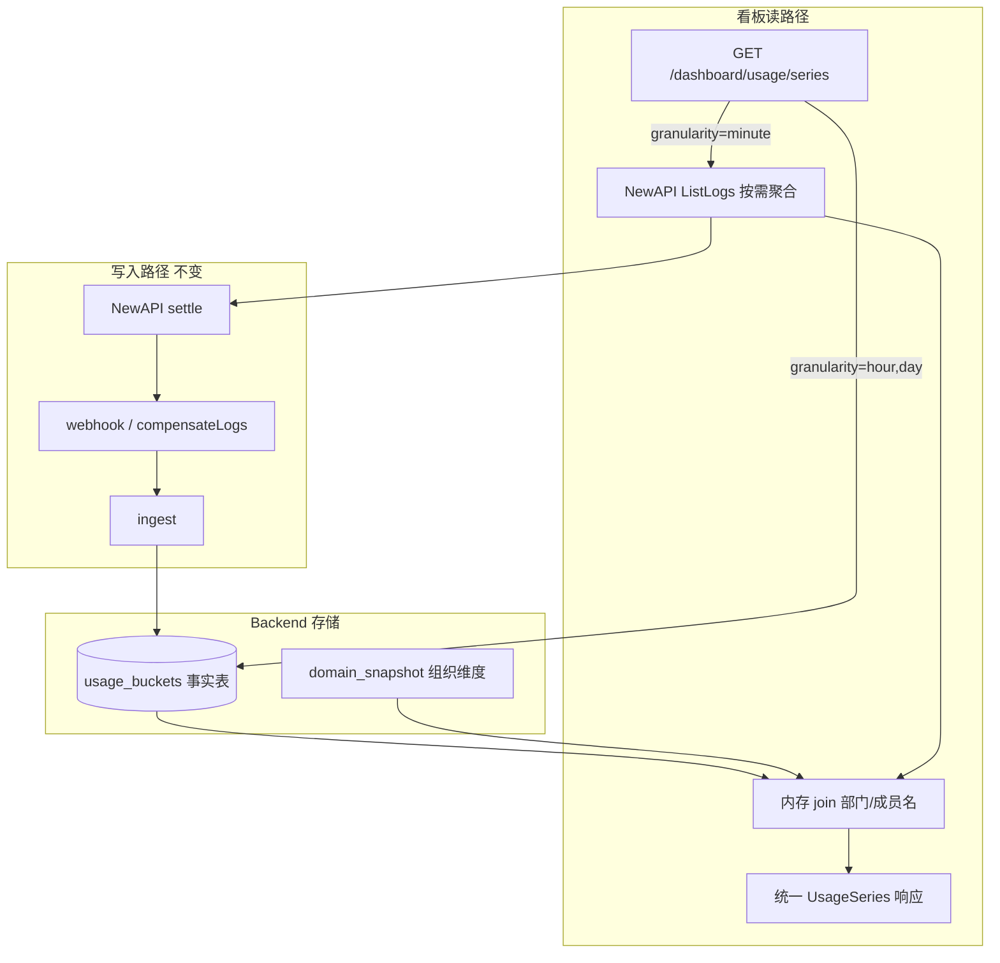

# Backend 看板用量架构：Daily / Hourly / Minute 双路径

**状态：已定稿（Phase 3 实施基线）**

本文档定义 US-13 成本/用量看板的数据与 API 架构：**同一张 Backend 事实表承载 daily/hourly（只存 hour 桶）** + **minute 走 NewAPI 原始日志按需聚合**；**所有看板 HTTP 接口均为只读 GET**，不写库、不触发 ingest。

**核心决策：(1) 事实表只持久化到 hour，daily 查询时聚合；(2) minute 不落库，Backend 内代理 `ListLogs` 只读聚合；(3) 对外统一 `usage/series` 形状，响应带 `source` 与窗口限制；(4) NewAPI 零改造；(5) 时区默认北京时间，可配置覆盖。**

详见 [Backend-待实现.md](./Backend-待实现.md) §9 US-13、[Frontend-API契约.md](./Frontend-API契约.md) §5.6。

---

## 1. 背景与目标

| 现状                                                                                          | 缺口                             |
| --------------------------------------------------------------------------------------------- | -------------------------------- |
| Phase 2 已有 `usage_daily`，ingest 按 **日** upsert（Phase 3 演进为 `usage_buckets` hour 桶） | 无 hour / minute 看板            |
| Dashboard 仍读 `dashboardcalc` demo                                                           | 需接真实用量                     |
| NewAPI `ListLogs` 已支持 `start_timestamp` / `end_timestamp`                                  | 仅 worker 补偿在用，未暴露给看板 |
| Webhook → ingest 有 `created_at`（秒级）                                                      | 时间精度在入账前未保留到小时     |

**目标**

1. 看板支持 **day / hour / minute** 三种时间粒度（`week` / `month` 由 cost 端点经 buckets 聚合，见 §7.2）。
2. **daily 与 hourly 共用 Backend 一张关系表**（不拆库、不让前端读 NewAPI）。
3. **minute 通过查 NewAPI 原始日志再聚合**，与上者 **API 形状相似**。
4. **NewAPI 零改造**（复用现有 Admin `/api/log/` 与 webhook）。

**Phase 3 MVP 范围外：** `input_tokens` / `output_tokens` 指标（webhook 未带 token 字段前恒为 0）；独立对账 API；物化日汇总表。

---

## 2. 方案总览



**原则**

- Dashboard **只调 Backend**；minute 路径由 Backend 代理拉 NewAPI，前端无感知。
- NewAPI 仍是 **推送写 + 可选拉取补偿**，不承担看板主存储。
- **看板 consumed 读 `usage_buckets` 周期聚合**；snapshot 内 `budget tree.Consumed` 仅服务预算管控 / 超限，不作为看板主数据源。

---

## 3. 只读 API 约束（横切）

**Dashboard 域下所有对外端点均为 `GET`、无副作用（read-only）。** 包括但不限于：

| 路径                                              | 只读说明                                                                       |
| ------------------------------------------------- | ------------------------------------------------------------------------------ |
| `GET /dashboard/usage/series`                     | 查 `usage_buckets` 或代理 NewAPI 日志聚合；**禁止**写库、**禁止**调用 `ingest` |
| `GET /dashboard/cost/summary`                     | 对 **buckets 周期聚合** 汇总 + 环比                                            |
| `GET /dashboard/cost/departments`                 | 部门维度 buckets 聚合读                                                        |
| `GET /dashboard/cost/departments/:deptId/members` | 成员维度 buckets 聚合读                                                        |
| `GET /dashboard/cost/daily`                       | 等价 `series?granularity=day` 的薄封装                                         |
| `GET /dashboard/cost/top`                         | Top N buckets 聚合读                                                           |
| `GET /dashboard/usage/models`                     | 按 model buckets 聚合读                                                        |
| `GET /dashboard/usage/teams`                      | quota 读 snapshot；**consumed 读 buckets 周期聚合**                            |

**实现约束**

- Handler / Service 不得注入 `IngestService` 写路径；minute 聚合器仅持 `newapi.AdminClient`（`ListLogs`）。
- `compensateLogs`（worker 写路径）与看板读路径 **代码分离**，禁止复用同一函数触发 ingest。
- 权限：`dashboard:cost` / `dashboard:usage`；`departmentId` 须过 session 数据范围校验。

---

## 4. 架构评审摘要

### 4.1 合适之处

| 点               | 说明                                                                        |
| ---------------- | --------------------------------------------------------------------------- |
| 读写分离清晰     | 写：ingest 单路径；读：按粒度路由，符合 §3 存储原则                         |
| 少改 NewAPI      | `ListLogs` + webhook 已够用                                                 |
| API 统一         | 前端一套 `granularity` + `period`，降低契约分叉                             |
| 与多租户模型一致 | 聚合维度仍是 `department_id` / `member_id` / `model`，经 relay mapping 对齐 |
| 成本可控         | day/hour 预聚合；minute 限制时间窗，避免全表扫描 NewAPI                     |

### 4.2 已收敛的风险

| 风险                | 决策                                                                                    |
| ------------------- | --------------------------------------------------------------------------------------- |
| day + hour 双写     | 只存 **hour 桶**；day 查询时 SQL 按租户时区 `date_trunc('day', …)` 汇总                 |
| minute 落库膨胀     | 不落库；短窗 ListLogs 按需聚合                                                          |
| 两路径数值不一致    | 响应 `source` + `approximate`；禁止 minute 与 hour/day **混合环比**                     |
| minute mapping 时点 | minute 用 **查询时刻** mapping；响应 `mappingAsOf: "query_time"`；仅作实时监控          |
| 时区                | **UTC 存桶**；聚合/展示默认 **Asia/Shanghai**，租户可配置覆盖（§5.4）                   |
| 历史 migration      | 旧 `usage_daily` 行映射为日初 pseudo-hour 桶；cutover 日前 **无真实 hour 粒度**（§5.1） |
| 预算 vs 看板        | 看板 consumed = buckets 周期 SUM；snapshot `Consumed` 不参与看板读路径（§9）            |
| minute 性能         | 3h 窗口、`maxPages`/`maxLogs` 上限、60s 缓存（key 含 session 范围）                     |
| 响应体过大          | `groupBy` 规则 + `maxPoints` 上限，超限 422（§8）                                       |

### 4.3 总体判定

**已采纳**，作为 Phase 3 US-13 实施基线。

---

## 5. 事实表设计（daily + hourly 共享）

### 5.1 表名与迁移

将现有 `usage_daily` **演进**为 `usage_buckets`（推荐改名以免「daily」误导）。

```sql
CREATE TABLE usage_buckets (
    bucket_start   TIMESTAMPTZ NOT NULL,  -- UTC 小时起点
    department_id  TEXT NOT NULL,
    member_id      TEXT NOT NULL DEFAULT '',
    model          TEXT NOT NULL,
    cost_cny       NUMERIC(18, 6) NOT NULL DEFAULT 0,
    call_count     INT NOT NULL DEFAULT 0,
    input_tokens   BIGINT NOT NULL DEFAULT 0,
    output_tokens  BIGINT NOT NULL DEFAULT 0,
    updated_at     TIMESTAMPTZ NOT NULL DEFAULT NOW(),
    PRIMARY KEY (bucket_start, department_id, member_id, model)
);

CREATE INDEX idx_usage_buckets_dept_time ON usage_buckets (department_id, bucket_start);
CREATE INDEX idx_usage_buckets_time ON usage_buckets (bucket_start);
```

**历史数据 migration（`usage_daily` → `usage_buckets`）**

Phase 2 日级数据无法还原 hour 明细，按以下规则一次性迁移：

```sql
INSERT INTO usage_buckets (
    bucket_start, department_id, member_id, model,
    cost_cny, call_count, input_tokens, output_tokens
)
SELECT
    (date::timestamp AT TIME ZONE 'Asia/Shanghai') AS bucket_start,
    department_id, member_id, model,
    cost_cny, call_count, input_tokens, output_tokens
FROM usage_daily;
```

- 每条旧日行 → `bucket_start` = 该日 **北京时间 00:00**（存为 TIMESTAMPTZ）。
- **cutover 日之前的 hour 视图不可用**（仅 day 及以上粒度有效）；前端 hour 图表起始不得早于 migration 完成后的首个真实 hour 桶。
- migration 完成后 DROP `usage_daily`。

**为何只存 hour？**

- ingest 每条 log 用 `created_at` 截断到 **UTC hour** upsert，`ON CONFLICT DO UPDATE` 累加。
- **daily** = 对 `bucket_start` 按租户时区 `date_trunc('day', …)` 汇总，无需第二次写入。
- 满足「同一张表共享 daily/hourly」，且避免 day/hour 双写不一致。

### 5.2 ingest 变更（仅 Backend）

```text
usageDateFromPayload()  →  usageHourFromPayload()  // UTC: time.Unix(created_at,0).UTC().Truncate(hour)
st.Usage().UpsertBucket(ctx, row)                   // 替代 UpsertDaily
```

- **成本以 ingest 时点模型单价为准**，写入桶后不再回溯改价。
- Phase 3 ingest **仍不写** `input_tokens` / `output_tokens`（字段保留，恒 0，待 webhook 扩展后再写）。
- 仍在 `WithTx` 内与 `ingested_log_id`、snapshot 预算更新同事务。

**共享逻辑：** 抽取 `internal/domain/usage/cost_from_log.go`（或等价包），供 ingest 与 `log_aggregator` 共用 `CostCNYFromQuota` + mapping 解析，避免双路径算法分叉。

### 5.3 Store 接口

```go
type UsageRepository interface {
    UpsertBucket(ctx context.Context, row types.UsageBucketRow) error
    QuerySeries(ctx context.Context, q types.UsageSeriesQuery) ([]types.UsageSeriesPoint, error)
}
```

`QuerySeries` 内根据 `GranularityDay | GranularityHour` 生成带时区的 `date_trunc`（§5.4）。

Memory Store 须同步实现 `UpsertBucket` + `QuerySeries`，与 Postgres 语义一致。

### 5.4 时区

| 环节                            | 规则                                                                             |
| ------------------------------- | -------------------------------------------------------------------------------- |
| **写入（ingest）**              | `created_at` → UTC hour 桶边界，存入 `bucket_start`                              |
| **读取（day/week/month 聚合）** | `date_trunc(unit, bucket_start AT TIME ZONE :tz)`，`tz` 默认 **`Asia/Shanghai`** |
| **读取（hour 展示）**           | my 边界按 `tz` 格式化返回；底层仍为 UTC 存储                                     |
| **minute 聚合**                 | log `created_at` 按 `tz` 截断到 minute                                           |
| **API 响应**                    | 固定返回 `"timezone": "Asia/Shanghai"`（或租户配置值）                           |
| **租户覆盖**                    | 组织配置 `timezone`（IANA，如 `Asia/Shanghai`）；未配置则用默认北京时间          |

---

## 6. Minute 路径：NewAPI 日志按需聚合（只读）

### 6.1 为何不落库

| 粒度   | 单行/天/维度 | 适用       |
| ------ | ------------ | ---------- |
| hour   | 24           | 持久化     |
| minute | 1,440        | 仅短窗查询 |

Minute 适合「最近 1～3 小时」实时监控，不适合 30 天趋势。

### 6.2 实现（Backend only，只读）

新增 **`internal/domain/usage/log_aggregator.go`**（依赖 `newapi.AdminClient`，**禁止**注入 `IngestService`）：

1. 校验 `end - start ≤ MaxMinuteWindow`（**3h**）。
2. 循环 `ListLogs`（`start_timestamp` / `end_timestamp` + 分页），`page_size=100`，**最多 50 页 / 5000 条 log**，超限截断并在响应 `truncated: true`。
3. `token_id` → **当前** `relay mapping` → `department_id` / `member_id`；无 mapping 的 log **跳过**，计数写入响应 `unmappedCount`。
4. `quota` + **当前**模型单价 → `cost_cny`（复用 §5.2 共享包；成本为近似值，可能与已 ingest 桶不一致）。
5. 按租户时区 `date_trunc('minute', created_at)` + 维度 `GROUP BY`。
6. 返回与事实表路径相同的 `UsageSeriesPoint` 切片。

**语义约束（mapping 时点）**

|          | buckets（ingest）       | minute（ListLogs）   |
| -------- | ----------------------- | -------------------- |
| 部门归属 | ingest **时刻** mapping | **查询时刻** mapping |
| 成本     | ingest 时点单价         | 查询时点单价         |
| 用途     | 报表 / 环比 / 预算对齐  | **实时监控 only**    |

- 成员 Transfer 部门后，同一历史 log 在 minute 与 hour/day **可能不一致**——属预期行为。
- 响应必填：`source: "logs"`、`approximate: true`、`mappingAsOf: "query_time"`。
- **禁止** minute 与 hour/day 数据做混合粒度环比；前端切换粒度时须整页重查同源。

**与 compensateLogs 的区别**

|         | compensateLogs       | minute 看板   |
| ------- | -------------------- | ------------- |
| 目的    | 补入账 + 写桶        | 只读展示      |
| 副作用  | 调用 `ingest.Ingest` | **不 ingest** |
| 窗口    | `StartID` 增量       | 时间窗 + 分页 |
| mapping | ingest 时刻          | 查询时刻      |

**故障与缓存**

- NewAPI 超时（10s）或不可用 → **503**，body 含 `retryAfter`；若有未过期缓存则 **stale-while-revalidate**（仍标 `approximate: true`）。
- 缓存 key = `hash(granularity, start, end, filters, sessionScope)`，TTL **60s**；多实例部署须用共享缓存或关闭进程内缓存。

### 6.3 NewAPI 侧

**零改造**。复用现有 Admin `/api/log/` 与 webhook；Phase 3 不 patch NewAPI。

---

## 7. 统一 API 设计（全部 GET / 只读）

### 7.1 核心端点

```http
GET /api/dashboard/usage/series
```

**Query**

| 参数           | 说明                                                      |
| -------------- | --------------------------------------------------------- |
| `granularity`  | `day` \| `hour` \| `minute`（必填）                       |
| `start`        | ISO8601 或 `YYYY-MM-DD`（day 时，按响应 `timezone` 解释） |
| `end`          | 同上                                                      |
| `groupBy`      | `none` \| `department` \| `member` \| `model`（见 §8）    |
| `departmentId` | 可选过滤                                                  |
| `memberId`     | 可选过滤                                                  |

**响应（统一）**

```json
{
  "granularity": "hour",
  "source": "buckets",
  "timezone": "Asia/Shanghai",
  "approximate": false,
  "mappingAsOf": "ingest_time",
  "unmappedCount": 0,
  "truncated": false,
  "points": [
    {
      "bucket": "2026-06-28T16:00:00+08:00",
      "departmentId": "dept-3",
      "memberId": "m-1",
      "model": "gpt-4o",
      "costCny": 12.5,
      "callCount": 42,
      "inputTokens": 0,
      "outputTokens": 0
    }
  ]
}
```

| 字段            | buckets 路径    | minute 路径       |
| --------------- | --------------- | ----------------- |
| `source`        | `"buckets"`     | `"logs"`          |
| `approximate`   | `false`         | `true`            |
| `mappingAsOf`   | `"ingest_time"` | `"query_time"`    |
| `unmappedCount` | 省略或 0        | ≥0                |
| `truncated`     | 省略或 false    | 分页触顶时为 true |

### 7.2 与现有端点的关系

| 现有                                 | Phase 3 策略                                                                                                                          |
| ------------------------------------ | ------------------------------------------------------------------------------------------------------------------------------------- |
| `GET /dashboard/cost/daily`          | 内部转 `series?granularity=day`                                                                                                       |
| `GET /dashboard/cost/summary`        | **周期内 buckets SUM** + 等长上一周期环比（同源 buckets）                                                                             |
| `GET /dashboard/cost/departments` 等 | buckets 聚合；`CostQueryParams.granularity` 为 `week`/`month` 时在 SQL 对 buckets 做 `date_trunc('week'\|'month', … AT TIME ZONE tz)` |
| `GET /dashboard/usage/teams`         | quota ← snapshot；consumed ← **周期 buckets SUM**                                                                                     |
| `dashboardcalc`                      | 生产路径废弃，仅单测 / 无 PG 时 fallback                                                                                              |

**粒度分工**

| API                                     | 支持粒度                                                                          |
| --------------------------------------- | --------------------------------------------------------------------------------- |
| `usage/series`                          | `day` \| `hour` \| `minute`                                                       |
| `cost/*`、`usage/models`、`usage/teams` | `day` \| `hour` \| `week` \| `month`（均走 buckets，`week`/`month` 仅服务端聚合） |

**前端感知**：参数增加 `granularity`；响应结构对齐；minute 视图展示「实时近似」提示。

### 7.3 路由规则（Service 内，只读）

```text
switch granularity {
case day, hour:
    return usageRepo.QuerySeries(ctx, q)
case minute:
    return logAggregator.Series(ctx, q)
default:
    return 400
}
```

---

## 8. 限制与 SLO

| 粒度     | 最大查询窗口 | 数据源            | 备注                                 |
| -------- | ------------ | ----------------- | ------------------------------------ |
| `day`    | 365 天       | `usage_buckets`   | 索引 `(department_id, bucket_start)` |
| `hour`   | 90 天        | `usage_buckets`   | cutover 前无真实 hour 数据           |
| `minute` | **3 小时**   | NewAPI `ListLogs` | 超时 10s；超限 429；失败 503         |

**`groupBy` 与响应上限**

| `groupBy`                         | 行为                                                                          |
| --------------------------------- | ----------------------------------------------------------------------------- |
| `none`                            | 每个 time bucket 聚合成 **单点**（跨 department/member/model 求和）           |
| `department` / `member` / `model` | 按选定维度展开；**禁止**多维度组合（契约单选）                                |
| 任意                              | `len(points) ≤ 10000`，超限 **422**；客户端应缩小窗口或加 `departmentId` 过滤 |

**权限**：复用 `dashboard:cost`；`departmentId` 须过 session 数据范围校验。

**缓存**：minute 路径，key = `hash(granularity, start, end, filters, sessionScope)`，TTL 60s。

---

## 9. 数据一致性说明

```text
                webhook 实时          compensateLogs 滞后
                      \                    /
                       v                  v
                 usage_buckets (hour)  ←── 看板 consumed / series 主数据源
                       ^
                       |  minute 只读，不 ingest
                 ListLogs 聚合（近似、query_time mapping）

  budget tree.Consumed (snapshot)  ←── 仅预算管控 / 超限 / rebalance，不看板读取
```

| 场景                           | 规则                                                                               |
| ------------------------------ | ---------------------------------------------------------------------------------- |
| hour/day 看板                  | 以 **buckets** 为准                                                                |
| cost/summary/teams consumed    | **周期内 buckets SUM**，与 period 边界对齐（按 §5.4 时区切日/月）                  |
| 月初 budget 重置               | snapshot `Consumed` 归零；buckets **保留全量历史**；看板按查询 period 过滤 buckets |
| minute vs buckets 尾部 lag     | webhook 先入桶，补偿略滞后；minute 可能多含 **未 ingest** 的尾部 log，可接受       |
| minute vs buckets mapping 差异 | 成员换部门 / 改价后不一致，**预期**；minute 禁止参与环比                           |
| ingest 失败（无 mapping）      | buckets 无记录；minute 跳过并计 `unmappedCount`                                    |
| 成本回溯                       | 已 ingest 成本 **不可变**；改价仅影响后续 ingest 与新 minute 查询                  |

**禁止**：看板 / minute 查询触发 `Ingest`。

---

## 10. 实施顺序

| 步骤 | 内容                                                                  | 触及 NewAPI |
| ---- | --------------------------------------------------------------------- | ----------- |
| 1    | migration：`usage_daily` → `usage_buckets`（§5.1 历史规则 + NUMERIC） | 无          |
| 2    | `usageHourFromPayload` + `UpsertBucket` + 共享 `cost_from_log`        | 无          |
| 3    | `UsageRepository.QuerySeries`（day/hour，含时区 `date_trunc`）        | 无          |
| 4    | `log_aggregator` + minute 窗口 / 分页 / `unmappedCount`               | 无          |
| 5    | `GET /dashboard/usage/series` + dashboard service 改读 buckets        | 无          |
| 6    | cost/_ / usage/_ 改 buckets 聚合；废弃 `dashboardcalc` 生产路径       | 无          |
| 7    | 契约 §5.6 同步 `UsageSeries*` 扩展字段                                | 无          |

---

## 11. 与 OpenRouter 精度的关系

OpenRouter Analytics 可到 minute/hour，但是 **Channel 账号维度**，无法替代 TokenJoy 的 department/member。

- **组织看板**：Backend buckets + mapping（主路径）。
- **OpenRouter 对账**：运维工具 / 未来独立 admin 页，**不并入** `usage/series`。

---

## 12. 决策摘要

| 问题                   | 决策                                                      |
| ---------------------- | --------------------------------------------------------- |
| 看板 API 是否只读？    | ✅ **全部 GET**，无副作用，不触发 ingest                  |
| daily/hourly 同表？    | ✅ 是；**只存 hour 桶**，day 查询按时区聚合               |
| minute 同表？          | ❌ 否；NewAPI 日志按需只读聚合                            |
| 时区？                 | UTC 存桶；默认 **Asia/Shanghai** 聚合/展示；租户可配置    |
| 看板 consumed 数据源？ | ✅ **`usage_buckets` 周期 SUM**；不读 snapshot `Consumed` |
| minute mapping？       | 查询时刻 mapping；`approximate: true`；禁止跨粒度环比     |
| 历史 migration？       | 旧 daily → 日初 pseudo-hour；cutover 前无真实 hour        |
| token 指标？           | Phase 3 **defer**（响应字段存在，值恒 0）                 |
| 两套 API？             | ❌ 一个 `usage/series` + cost 端点薄封装 / buckets 聚合   |
| 改 NewAPI？            | **零改造**                                                |
| Dashboard 读几个库？   | **只读 Backend**；minute 内部调 NewAPI Admin              |
