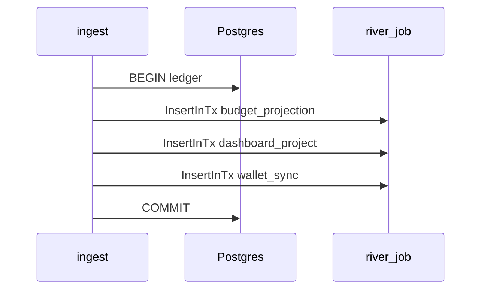
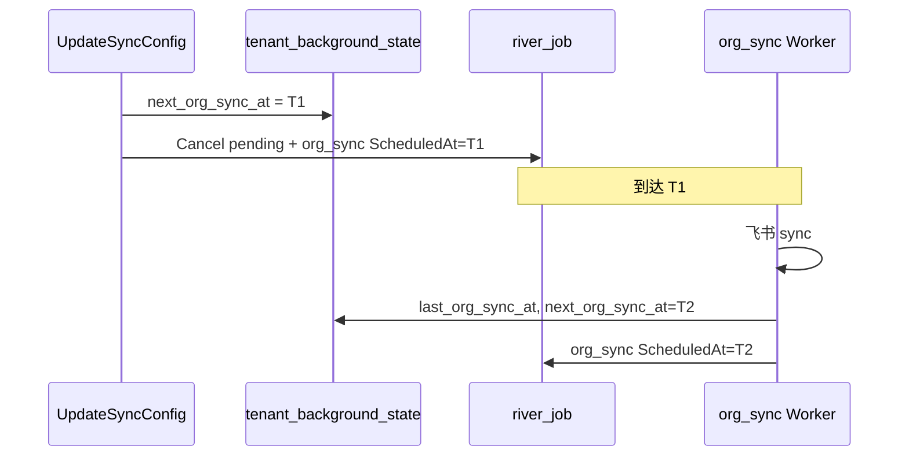
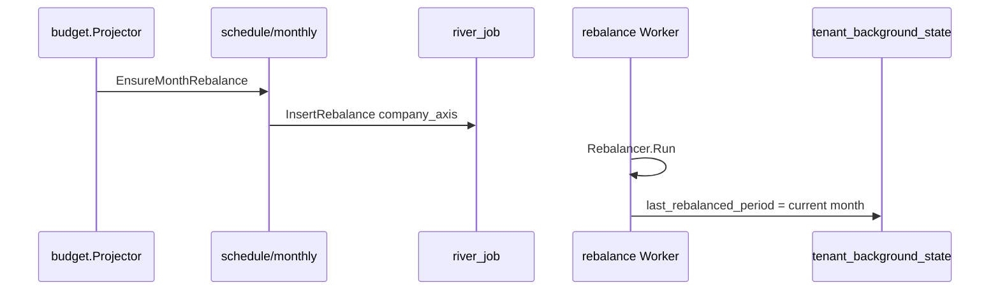

# Backend · 离线任务架构（目标态）

> **定位**：离线副作用的 **最终架构**——事件驱动热路径 + 租户调度层 + 低频看门狗；模块化目录与性能约束一并定稿。  
> **前提**：项目未上线，**不保留旧 Periodic / fanout 行为，不做 migration、不做向后兼容**。  
> **替代**：实施后 [Backend-离线任务.md](./Backend-离线任务.md) 按本文重写为 as-built。  
> **约束**：[Backend-结构优化.md](./Backend-结构优化.md) §1（domain 不 import `infra/*`）· [Backend-v1-Ingest链路优化.md](./Backend-v1-Ingest链路优化.md)（热路径性能）  
> **现状**：as-built 见 [Backend-离线任务.md](./Backend-离线任务.md)（5 个 Periodic + fanout）；实施前可有间隔调参 interim，不以 interim 为终态。

---

## 1. 设计目标

| 目标 | 手段 |
| --- | --- |
| **零空转** | 删除所有高频 Periodic；仅 **1 个** L2 `tenant_watchdog`（默认 7d） |
| **该触发就触发** | ingest / 配置变更 / 月界 / 运维 → 直接入队 per-tenant job |
| **看门狗可 skip** | 租户调度状态在 Postgres；L0/L1 做完 → 更新状态 → L2 查状态跳过 |
| **job Args 极薄** | 只带 `company_id`、axis、payload；**可选** `trigger` 仅作日志 |
| **fanout 收敛** | 无 `*_fanout` kind；看门狗 Worker 内 SQL 筛 due → 分批 `Insert` |
| **模块清晰** | 5 业务模块 + `infra/scheduler` + `infra/jobs` 域拆分 |
| **失败可恢复** | 「已完成」状态仅在 Worker **成功**后写入；失败不入 skip 集合 |

---

## 2. 三层运行时

```text
┌────────────────────────────────────────────────────────────────────────┐
│ L0 · 热路径（事件，毫秒～秒级）                                          │
│   ingest 成功（同事务）→ budget_projection + dashboard_project + wallet_sync │
│   budget_projection 批末 → rebalance(member/project) + overrun + 自续    │
│   充值 / Key 变更 → rebalance / newapi_sync                             │
├────────────────────────────────────────────────────────────────────────┤
│ L1 · 调度层（租户日历，分钟～天级）                                      │
│   org：next_org_sync_at → org_sync（River ScheduledAt）                │
│   月切：投影批检测 period → 入队 company rebalance（成功后写 period）     │
│   运维 / 告警 → 单租户 budget_reconcile / dashboard_reconcile           │
├────────────────────────────────────────────────────────────────────────┤
│ L2 · 看门狗（唯一 Periodic：tenant_watchdog，默认 7d）                  │
│   SQL 筛「仍欠账」租户 → 分批入队；L0/L1 已更新状态的租户自动 skip        │
└────────────────────────────────────────────────────────────────────────┘
```

| 层 | 谁更新「做过了」 | 谁读状态决定 skip |
| --- | --- | --- |
| L0 | 投影 progress 游标；批末副作用入队 | 看门狗查 progress lag |
| L1 | `tenant_background_state` 各字段（**成功**后） | 看门狗 `still_due()` |
| L2 | **不**批量改状态；只补入队，执行成功后由 Worker 写回 | — |

**不变量**

- Ingest 事务：写 ledger + 入队 job；**不**调 NewAPI、**不**跑 reconcile 全量扫描。
- Gateway 请求：**不**触发任何 River job。
- 调度时间、上次执行：**只在 DB**，不塞进 job Args 做业务判断。
- `trigger` 字段仅日志/指标，**不参与** Unique 与 skip 逻辑。

### 2.1 兜底 SLA（最坏延迟）

主路径由 L0/L1 保证；L2 仅补漏。默认 `WATCHDOG_INTERVAL_SEC=604800`（7d）。

| 域 | 主路径 | L2 兜底最坏延迟 | 说明 |
| --- | --- | --- | --- |
| budget / dashboard 投影 | ingest 同事务入队 | 7d（仅 lag 租户） | 活跃租户毫秒～秒级；无 ledger 的休眠租户无 lag |
| 月切 company rebalance | 新账期首笔投影 | 7d（休眠租户） | 活跃租户在首笔 ingest 投影批触发 |
| org 同步 | `ScheduledAt` per-tenant | 7d | 正常不依赖看门狗；见 §5.1 自愈 |
| budget / dashboard 对账 | 运维 API / 告警 | 7d | 漂移修复非热路径；活跃租户靠投影 |

staging / 本地验证可将 `WATCHDOG_INTERVAL_SEC` 缩短（如 `86400`），生产默认 7d。

---

## 3. 租户后台状态（SSOT）

单表收敛调度与看门狗判据（写入 `schema.sql`，无历史包袱）。

```sql
CREATE TABLE tenant_background_state (
    company_id                  BIGINT PRIMARY KEY REFERENCES companies(id),
    -- org 调度（M5）
    next_org_sync_at            TIMESTAMPTZ,
    last_org_sync_at            TIMESTAMPTZ,
    -- 预算月切（M2）：仅 rebalance **成功**后写入
    last_rebalanced_period      VARCHAR(7) NOT NULL DEFAULT '',
    -- 对账看门狗（M2/M4）
    last_budget_reconcile_at    TIMESTAMPTZ,
    last_dashboard_reconcile_at TIMESTAMPTZ,
    updated_at                  TIMESTAMPTZ NOT NULL DEFAULT NOW()
);

CREATE INDEX idx_tbs_org_sync_due
    ON tenant_background_state (next_org_sync_at)
    WHERE next_org_sync_at IS NOT NULL;

CREATE INDEX idx_tbs_rebalance_period
    ON tenant_background_state (last_rebalanced_period);
```

| 字段 | 写入时机 | 看门狗 skip 条件 |
| --- | --- | --- |
| `next_org_sync_at` | 同步成功 / 改 `SyncConfig` 后重算 | `next_org_sync_at > now()` |
| `last_org_sync_at` | 同步成功 | 仅审计展示 |
| `last_rebalanced_period` | **company 轴 `rebalance` Worker 成功**（月切上下文） | `== OpenSnapshotKey(monthly)` |
| `last_budget_reconcile_at` | `budget_reconcile` 成功 | 7d 内 **且** projection 无 lag |
| `last_dashboard_reconcile_at` | `dashboard_reconcile` 成功 | 7d 内 **且** dashboard projection 无 lag |

**投影 lag** 仍用现有游标表（不重复）：

- `budget_projection_progress` — M1 是否追到 ledger 头
- `dashboard_projection_progress` — M3 是否追到 ledger 头

### 3.1 行生命周期（必须有行）

每个 `companies.id` **对应一行** `tenant_background_state`。无行视为 due（看门狗会补），但 L1 调度依赖字段，**禁止**长期缺失。

| 时机 | 动作 |
| --- | --- |
| `CreateCompany` | 同事务 `INSERT` 默认行（`last_rebalanced_period=''` 等） |
| 首次启用 org 同步 | `ComputeNextOrgSync` → 写 `next_org_sync_at` + 入队 `org_sync` |
| `UpdateSyncConfig` | 重算 `next_org_sync_at`；取消 pending `org_sync`；入队新 `ScheduledAt` |
| demo / bootstrap seed | 为已有 company 批量 `INSERT … ON CONFLICT DO NOTHING`；org 启用租户从 `SyncConfig` 初始化 `next_org_sync_at` |
| 月切 rebalance 成功 | `rebalance` Worker（company 轴）更新 `last_rebalanced_period` |

实现：`store.TenantBackgroundState` + `EnsureRow(companyID)`；`CreateCompany` 与 seed 必须调用。

---

## 4. Job 目录（最终 10 kind）

删除：`monthly_rebalance`、`budget_reconcile_fanout`、`dashboard_project_fanout`、`dashboard_reconcile_fanout`、`org_sync{company_id:0}` fanout 语义。

| kind | 层 | 触发 | Args（业务字段） |
| --- | --- | --- | --- |
| `budget_projection` | L0 | ingest tx、批末自续 | `company_id` |
| `dashboard_project` | L0 | ingest tx、批末自续 | `company_id` |
| `wallet_sync` | L0 | ingest tx、充值、漂移 | `company_id` |
| `rebalance` | L0/L1 | 投影批末、充值、Key、月切、reconcile 修复 | `company_id`, `axis_kind`, `axis_id` |
| `overrun` | L0 | 投影批末 | `company_id`, `payload` |
| `newapi_sync` | L0 | Key 生命周期 | `sub_kind`, ids… |
| `org_sync` | L1 | `ScheduledAt`、手动 API、看门狗补漏 | `company_id` |
| `budget_reconcile` | L1/L2 | 运维、告警、看门狗 | `company_id` |
| `dashboard_reconcile` | L1/L2 | 运维、看门狗 | `company_id` |
| `tenant_watchdog` | L2 | **唯一 Periodic** | `{}`（全局单例） |

**可选观测字段**（不参与 Unique / 业务逻辑）：

```go
type Trigger string // ingest | schedule | manual | watchdog | admin
```

**去重**：月切 company `rebalance` 靠 `RebalanceArgs` Unique（`company_id` + `axis_kind` + `axis_id`）；**不在入队前 CAS 写 `last_rebalanced_period`**。

---

## 5. 调度层（L1）详设

### 5.1 org 同步（M5）

租户 `frequencyHours` + `startTime` = **per-tenant cron**，禁止全局轮询 fanout。

```text
UpdateSyncConfig / 首次启用
  → EnsureRow(company_id)
  → ComputeNextOrgSync(cfg, last_org_sync_at) → next_org_sync_at
  → CancelPendingOrgSync(company_id)     # 见下
  → Upsert TBS.next_org_sync_at
  → Insert org_sync{company_id}, ScheduledAt = next_org_sync_at

同步成功（RunScheduledSync / TriggerSync）
  → last_org_sync_at = now
  → next_org_sync_at = ComputeNextOrgSync(...)
  → Upsert TBS
  → RescheduleOrgSync(company_id, next_org_sync_at)   # Insert 下一条 ScheduledAt

手动 TriggerSync
  → 立即执行（可不入 ScheduledAt 队列，或 Insert 无 ScheduledAt）；
    成功后同上更新 TBS + Reschedule
```

**CancelPendingOrgSync**：查 `river_job` 中 `kind=org_sync`、同 `company_id`、状态 ∈ `{available,pending,scheduled,retryable}` → `JobCancel`。封装在 `domain/org/remote/schedule.go`，经 `jobs.Enqueuer` / River client 适配，domain 不 import `river` 包类型。

**崩溃自愈**：`org_sync` Worker 入口若 `next_org_sync_at <= now()` 且不存在 pending/running 同租户 job → 立即 `RescheduleOrgSync`（覆盖「sync 成功但 reschedule 前崩溃」窗口）。

**删除**：`FanoutScheduledSyncJobs`、`dueForScheduledSync` 内扫 `SyncLogs` 推断上次时间、`OrgSyncFanoutCompanyID`、`WORKER_ORG_SYNC_INTERVAL_SEC`。

### 5.2 月切 rebalance（M2）

逻辑 SSOT：`domain/budget/schedule/monthly.go` → `EnsureMonthRebalance`（投影与看门狗共用判据，**只读** TBS）。

```text
EnsureMonthRebalance(ctx, company_id):
  current := OpenSnapshotKey(monthly).String()
  if last_rebalanced_period == current → return（已在本账期成功 rebalance）
  InsertRebalance(company, company_axis)   # Unique 去重，可多次调用

budget.Projector.RunBatch 开头（持锁前，O(1)）:
  EnsureMonthRebalance(ctx, company_id)

rebalance Worker（company 轴）成功且当前 open month > last_rebalanced_period:
  UPDATE tenant_background_state SET last_rebalanced_period = current
```

**不变量**

- **禁止**在入队前写 `last_rebalanced_period`；失败时必须可被 L1/L2 再次入队。
- 同月多批投影可重复 `InsertRebalance`；River Unique 折叠为一条 pending。
- 多实例：无额外 CAS；依赖 Unique + 幂等 `Rebalancer.Run`。

**删除**：`MonthlyRebalanceScheduler`、`monthly_rebalance` kind、`WORKER_MONTHLY_REBALANCE_INTERVAL_SEC`、进程内 `lastMonth`。

### 5.3 对账（M2 / M4）

- **主路径**：L0 投影保证 `budget_consumed` / `usage_buckets` 正确；对账非热路径。
- **L1**：管理 API `POST .../reconcile` 单租户入队。
- **L2**：看门狗按 §6 判据入队；成功后写 `last_*_reconcile_at`。

Reconcile 实现可保留全窗口扫描（7d 一次、仅 due 租户），上线后若需优化再做 SQL 聚合版（非阻塞项）。

---

## 6. 看门狗（L2）详设

### 6.1 唯一 Periodic

```go
// infra/river/periodic/watchdog.go
river.NewPeriodicJob(
    river.PeriodicInterval(cfg.WatchdogInterval()), // 默认 7d
    func() (river.JobArgs, *river.InsertOpts) {
        return jobs.TenantWatchdogArgs{}, nil
    },
    nil,
)
```

```text
env: WATCHDOG_INTERVAL_SEC=604800   # 默认 7 天，仅此一个离线 Periodic 间隔
```

### 6.2 Worker 流程（无 fanout 子 kind）

```text
tenant_watchdog Worker
  1. orgDue      := TBS.next_org_sync_at <= now()
                    AND NOT EXISTS (pending/running org_sync for company)
  2. monthDue    := last_rebalanced_period <> current_open_month
  3. budgetLag   := budget_projection_progress 落后 ledger 头
                    OR last_budget_reconcile_at 超过 7d
  4. dashboardLag:= dashboard_projection_progress 落后
                    OR last_dashboard_reconcile_at 超过 7d
  5. 按 company 分批 BulkInsert（默认每批 200，可配置）
     org_sync | rebalance | budget_reconcile | dashboard_project | dashboard_reconcile
     每条带 trigger=watchdog
```

**Skip 规则（L0/L1 已处理则不入队）**

| 检查项 | Skip 条件 |
| --- | --- |
| org | `next_org_sync_at > now()` 或已有 pending/running `org_sync` |
| 月切 | `last_rebalanced_period == 当前开账月` |
| budget 投影 | cursor 距 ledger 头 < 阈值（如 0 条） |
| budget 对账 | 投影无 lag **且** `last_budget_reconcile_at` 在 7d 内 |
| dashboard 投影 | 同 budget，用 dashboard progress |
| dashboard 对账 | 投影无 lag **且** `last_dashboard_reconcile_at` 在 7d 内 |

看门狗 **只读** 状态表 + progress；**不改** TBS（除通过下游 Worker 间接写回）。`infra/scheduler/due.go` 与 `domain/budget/schedule/monthly.go` 共用月切判据，避免双份 SQL。

**队列尖峰**：due 租户很多时，`bulk_enqueue.go` 分批 Insert + 依赖 Unique；不在单 tick 内扫全表写状态。

### 6.3 多实例

- 月切：重复 `InsertRebalance` 由 Unique 折叠；`last_rebalanced_period` 仅成功 Worker 写入。
- org：`ScheduledAt` + `org_sync` Unique ByArgs；`CancelPendingOrgSync` 在改配置时串行化。
- 看门狗：Periodic leader 单实例入队 `tenant_watchdog`；Worker 内 bulk insert 幂等。

---

## 7. 模块与目录（最终）

```text
internal/
  infra/
    jobs/
      catalog.go                 # Kind 常量（10 个）
      trigger/catalog.go         # kind → 层、模块、默认 Queue
      kinds/{billing,budget,dashboard,org,watchdog,newapi}.go
      enqueue/{billing,budget,dashboard,org,watchdog,newapi}.go
      enqueuer.go · holder.go

    scheduler/                   # L2 due 查询 + 看门狗批量入队（只读 store）
      due.go                     # OrgDue, MonthDue, ProjectionLag, ReconcileDue
      bulk_enqueue.go            # 分批 BulkInsert

    river/
      client.go
      periodic/watchdog.go       # 仅 tenant_watchdog
      workers/
        budget/{projection,reconcile}.go
        dashboard/{projection,reconcile}.go
        org/sync.go
        sideeffect/{wallet_sync,rebalance,overrun,newapi_sync}.go
        watchdog.go              # → scheduler due + bulk_enqueue

    ingest/worker.go             # 线 A；仅 pending + log reconcile，无 River Periodic

  domain/
    budget/
      budget_projector.go        # M1 + 调用 schedule/monthly
      budget_reconcile.go        # M2
      schedule/monthly.go        # EnsureMonthRebalance（判据 SSOT）
    dashboard/
      dashboard_projector.go     # M3
      dashboard_reconcile.go     # M4
    org/remote/
      sync.go                    # 执行同步
      schedule.go                # ComputeNextOrgSync, Reschedule, CancelPending
    usage/ingest.go              # 同事务：budget_projection + dashboard_project + wallet_sync

  store/
    tenant_background_state.go   # 接口 + EnsureRow
    postgres/tenant_background_state_repo.go

  app/
    wire_river.go
    usage_enqueuer.go            # EnqueueAfterIngest：3 job InsertInTx
    *_enqueuer.go
```

**分层**：`domain/*/schedule*.go` 含业务日历；`infra/scheduler` 仅 L2 批量 due + 入队，**不** import domain。

**删除文件（整文件移除，不保留别名）**

| 路径 |
| --- |
| `infra/river/periodic.go`（由 `periodic/watchdog.go` 替代） |
| `infra/river/workers/monthly_rebalance.go` |
| `domain/budget/monthly_rebalance.go` |
| `jobs` 中 fanout Args / `Insert*Fanout` / `InsertMonthlyRebalance` |
| `config` 中 `WORKER_ORG_SYNC_INTERVAL_SEC`、`WORKER_MONTHLY_REBALANCE_INTERVAL_SEC`、`WORKER_BUDGET_RECONCILE_INTERVAL_SEC`、`WorkerDashboardProjectInterval` 等 Periodic 常量 |

---

## 8. 端到端流

### 8.1 入账（L0）



任一 `InsertInTx` 失败 → 整笔事务回滚（含 ledger）。

### 8.2 组织周同步（L1）



### 8.3 月切 rebalance（L1）



### 8.4 看门狗（L2）


---

## 9. 性能模型

| 项 | 现状（as-built） | 目标态 |
| --- | --- | --- |
| Periodic 次数 | 5 个 job，interval 已调为 h～d 级 interim | **1 个**，7d |
| 空转 fanout | 每 tick 扫全租户 × N 域 | 7d 一次 SQL due + skip |
| org 到期检测 | fanout + 每租户 SyncLogs | 0 轮询；River `ScheduledAt` |
| 月切检测 | 6h poll + 进程 `lastMonth`（多实例不一致） | 投影首批 O(1)；看门狗补休眠租户 |
| dashboard lag | 仅 Periodic fanout | ingest 与 budget 对称入队 |
| River 队列深度 | 多 fanout 子 job 爆炸 | 仅 due 租户入队 + 分批 |
| ingest 锁竞争 | 投影批过大 | 保持 batch 500；月切检测 O(1) 不增批耗时 |

**热路径门禁**（与 [Backend-v1-Ingest链路优化.md](./Backend-v1-Ingest链路优化.md) 一致）

- Gateway 预检仍 1× PG；不 JOIN `budget_consumed`。
- ingest 事务不新增同步 NewAPI / 全量 reconcile。
- `dashboard_project` 入队在同事务，仅多一行 `river_job` insert，不拉长事务逻辑。

---

## 10. Rebalance 触发（最终）

| 场景 | 入队 | axis | 写 `last_rebalanced_period` |
| --- | --- | --- | --- |
| budget_projection 批末 | `rebalance` | member / project | 否 |
| 充值 / 调账 | `rebalance` | company | 否 |
| 月切（L1 投影检测） | `rebalance` | company | **成功**后 |
| 月切（L2 看门狗，休眠租户） | `rebalance` | company | **成功**后 |
| budget_reconcile 修漂移 | `rebalance` | company | 否 |
| Key / 预算树变更 | `rebalance` | 对应 axis | 否 |
| Ingest 直接 | **否** | — | — |
| Gateway | **否** | — | — |

远期 `platform_sync`（wallet + rebalance 合并）见 [架构终态设计.md](./架构终态设计.md)，本文不阻塞。

---

## 11. 配置（最终）

| 变量 | 默认 | 说明 |
| --- | --- | --- |
| `WORKER_POLL_INTERVAL_SEC` | `1` | **仅** ingest 线 A pending |
| `WATCHDOG_INTERVAL_SEC` | `604800` | **唯一** River Periodic（7d）；staging 可缩短 |
| `WATCHDOG_BULK_BATCH_SIZE` | `200` | 看门狗每批 Insert 租户数上限 |
| `RIVER_MAX_WORKERS` | `20` | 队列 2:2:1；看门狗在 default/low |
| `INGEST_RECONCILE_*` | 见 Ingest 文档 | 线 A 日志补洞，非 River |

**删除的配置项**：`WORKER_ORG_SYNC_INTERVAL_SEC`、`WORKER_MONTHLY_REBALANCE_INTERVAL_SEC`、`WORKER_BUDGET_RECONCILE_INTERVAL_SEC`、`WorkerDashboardProjectInterval` 等 Periodic 常量。

租户 org 业务频率：UI **`frequencyHours`** → 写入 `ComputeNextOrgSync`，与 `WATCHDOG_INTERVAL_SEC` 无关。

---

## 12. 实施清单（建议 PR 顺序）

项目未上线，可按模块一次到位，无需分阶段兼容。

| # | PR | 内容 |
| ---: | --- | --- |
| 1 | schema | `tenant_background_state` + repo + `EnsureRow`；`CreateCompany` / seed 写行 |
| 2 | jobs | 删 fanout kinds；加 `tenant_watchdog`；目录拆分 `kinds/`、`enqueue/` |
| 3 | scheduler | `due.go` + `bulk_enqueue.go`（分批） |
| 4 | M5 | `org/schedule.go`；`UpdateSyncConfig` 闭环；Cancel + ScheduledAt + 自愈 |
| 5 | M2 | `schedule/monthly.go`；投影钩子；`rebalance` Worker 写 period；删 `monthly_rebalance` |
| 6 | M3 | `usage_enqueuer` + ingest 同事务 `dashboard_project` |
| 7 | river | `periodic/watchdog.go` 唯一 Periodic；workers 子目录；删旧 periodic |
| 8 | docs/tests | 重写 `Backend-离线任务.md`；测 due/skip/月切失败重试/org/TBS 生命周期 |

---

## 13. 测试要点

| 场景 | 断言 |
| --- | --- |
| TBS 生命周期 | `CreateCompany` 有行；无行时 `EnsureRow` 可补 |
| ingest | 同事务 3 job；任一 insert 失败整笔回滚 |
| 月切 L1 | 新账期首笔投影 → 一次 company rebalance 入队 |
| 月切成功 | rebalance 成功后 `last_rebalanced_period` 更新 |
| 月切失败重试 | rebalance 失败 → period 不变 → L1/L2 可再次入队 |
| 月切 skip | 同月已成功 rebalance → `EnsureMonthRebalance` 不入队 |
| org L1 | 改 frequency → cancel pending + `next_org_sync_at` 变；到点执行；reschedule |
| org 自愈 | sync 成功但未 reschedule → 下次 worker 入口补入队 |
| 看门狗 skip | L1 已更新状态 → 该租户不入队 |
| 看门狗补漏 | 休眠租户月切 + 无 ingest → 看门狗入队 rebalance |
| 多实例 | 并发 `EnsureMonthRebalance` → Unique 仅一条 pending rebalance |
| 热路径 | ingest / Gateway 基准不退化 |

---

## 14. 关联文档

| 文档 | 关系 |
| --- | --- |
| [Backend-离线任务.md](./Backend-离线任务.md) | 现状 as-built；实施后按本文重写 |
| [Backend-结构优化.md](./Backend-结构优化.md) §2.4 | 目录与 scheduler 债务 → 本文 §7 为终态 |
| [Backend-预算.md](./Backend-预算.md) | M1/M2 投影与 consumed 语义 |
| [Backend-Ingest架构.md](./Backend-Ingest架构.md) | 线 A + ingest 入队 |
| [Backend-v1-Ingest链路优化.md](./Backend-v1-Ingest链路优化.md) | 热路径性能门禁 |
| [架构终态设计.md](./架构终态设计.md) | platform_sync、Redis 摘要等后续项 |
| [plan.md](./plan.md) §8 | backlog |

---

## 15. 非目标

- Gateway / ingest 内同步 NewAPI 或全量 reconcile。
- 完全去掉 L2（休眠租户与调度丢失仍需看门狗）。
- 本文实现监控大盘与告警规则（可引用架构终态 §14）。
- `platform_sync` 合并 job（独立后续 PR）。
