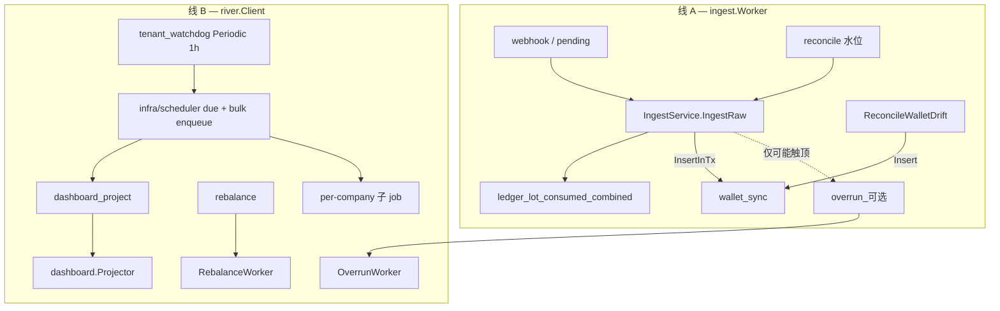

# Backend · 离线任务（终态）

> **定位**：离线任务 **最优终态**（consumed 在 Ingest；无 `budget_projection`）。  
> **预算副作用**：[Backend-预算累计架构.md](./Backend-预算累计架构.md)  
> **入账**：[Backend-Ingest架构.md](./Backend-Ingest架构.md) · [Backend-预算.md](./Backend-预算.md)  
> Schema / Unique：`internal/infra/jobs/`

---

## 1. 运行时概览

进程内 **两条异步线**，队列为 `river_job`：

```text
cmd/server
  ├─ HTTP / Gateway
  ├─ infra/ingest.Worker.Start()     ← 线 A：日志库 pending + reconcile
  └─ infra/river.Client.Start()      ← 线 B：river_job claim + Workers + Periodic
```

| 线 | 包 | 存储 | 职责 |
| --- | --- | --- | --- |
| **A — Ingest** | `internal/infra/ingest` | 日志库 `ingest_jobs`；主库 `scheduler_locks` | webhook/reconcile → `IngestByLogID`；钱包漂移扫描 |
| **B — River** | `internal/infra/river` | 主库 `river_job` 等 | 温/冷副作用；**唯一 Periodic** = 看门狗 |

装配：`internal/app/compose_worker.go` → `buildBackgroundWorkers`。



**终态：** 多数 Ingest 不入队任何 budget 投影 job。

---

## 2. 分层与依赖方向

| 层 | 路径 | 职责 |
| --- | --- | --- |
| **domain** | `domain/*` | 业务逻辑；**不** import `river` / `pgx` |
| **jobs** | `internal/infra/jobs` | `Enqueuer` 接口、Job Args、`Insert*` helper |
| **scheduler** | `internal/infra/scheduler` | L2 只读 due 查询 + 看门狗批量入队 |
| **river workers** | `internal/infra/river/workers` | 薄壳：`Work()` → 调 domain 一个方法 |
| **river client** | `internal/infra/river` | Client 装配、Periodic、队列权重 |

Domain 入队经各域 `JobEnqueuer` 端口（`domain/*/ports.go` + `app/port_*.go`）；底层统一 `jobs.Enqueuer`（`Insert` / `InsertInTx`）。事务内入队通过 `store.Tx`（`postgres.txStore` 实现），domain 不 import `pgx`。

### 2.1 Holder 与域端口

`jobs.Holder` **仅用于 bootstrap**：River Client 未就绪前占位 `NoopEnqueuer`，避免 nil。Client 启动后 `holder.Set(client.Enqueuer)`。

**业务入队走域端口**，不直接依赖 Holder：

| 域 | 端口 | 适配器 |
| --- | --- | --- |
| billing | `billing.JobEnqueuer` | `app/port_billing.go` |
| budget | `budget.JobEnqueuer` | `app/port_budget.go` |
| usage | `usage.IngestJobEnqueuer` | `app/port_usage.go` |
| dashboard | `dashboard.JobEnqueuer` | `app/port_dashboard.go` |
| newapisync | `newapisync.SyncJobEnqueuer` | `app/port_newapisync.go` |
| org-remote | `remote.JobEnqueuer` | `app/port_org.go`（含 `CancelPendingOrgSync`） |

`RIVER_ENABLED=false` 时 Holder 保持 `NoopEnqueuer`（`Insert` 返回 `nil`，**不入队**）。

---

## 3. Job kind（终态）

| kind | 队列 | Unique | 触发层级 | Worker | Domain 入口 |
| --- | --- | --- | --- | --- | --- |
| `newapi_sync` | critical | 无 | L1 业务 | `workers/newapi_sync.go` | `newapisync.OutboxHandler` |
| `wallet_sync` | default | args，~5s | L0 ingest / L1 充值漂移 | `workers/wallet_sync.go` | `billing.SyncCompanyWallet` |
| `rebalance` | default | per axis | L1 按需 / 充值月切 / reconcile / L2 | `workers/rebalance.go` | `budget.Rebalancer.ProcessAxis` |
| `overrun` | default | per payload | L1 **仅可能触顶时** | `workers/overrun.go` | `budget.OverrunProcessor` |
| `org_sync` | default | per company | L1 ScheduledAt；L2 看门狗 | `workers/org_sync.go` | `org.RunScheduledSync` |
| `budget_reconcile` | low | args，~24h | L1 手动；L2 看门狗 | `workers/budget_reconcile.go` | `budget.ReconcileService.RunCompany` |
| `dashboard_project` | low | args，~1h | L1 自续；L2 看门狗（每小时检测 lag） | `workers/dashboard_project.go` | `dashboard.Projector.RunBatch` |
| `dashboard_reconcile` | low | args，~24h | L1 手动；L2 看门狗 | `workers/dashboard_project.go` | `dashboard.ReconcileService.RunCompany` |
| `tenant_watchdog` | low | ByPeriod = 间隔 | L2 Periodic | `workers/watchdog.go` | `scheduler.CollectDue` + `BulkEnqueue` |

**终态删除：** `budget_projection`（及 progress / 看门狗 NeedsBudgetProject）。

Args：`internal/infra/jobs/kinds_*.go`。入队：`enqueue.go`。Worker：`infra/river/client.go`。

---

## 4. `tenant_background_state`（租户后台 SSOT）

表：`tenant_background_state`（`schema.sql`）。每 active company 一行，由 `CreateCompany` / seed `EnsureRow` 初始化。

| 字段 | 写入时机 | 读取方 |
| --- | --- | --- |
| `next_org_sync_at` | `UpdateSyncConfig` / 同步成功后 reschedule | L1 org、`scheduler.orgDue` |
| `last_org_sync_at` | 同步成功 | `ComputeNextOrgSync` |
| `last_rebalanced_period` | **仅** company 轴 `rebalance` worker 成功 | `EnsureMonthRebalance`、`scheduler.monthDue` |
| `last_budget_reconcile_at` | `budget_reconcile` worker 成功 | `scheduler.budgetReconcileDue` |
| `last_dashboard_reconcile_at` | `dashboard_reconcile` worker 成功 | `scheduler.dashboardReconcileDue` |

Store：`store/tenant_background_state.go` + `postgres/tenant_background_state_repo.go`。

---

## 5. 入队点（谁写入 `river_job`）

### 5.1 事务内（`InsertInTx`，与 ledger 同事务）

**Ingest 成功路径**（终态）：

1. `ledger` + lot + **`budget_consumed` + `combined_key_remain`**
2. `InsertWalletSync`
3. **可选** `InsertOverrun`（仅轻量预判认为可能触顶时）

**不**入队 `budget_projection`、`dashboard_project`（由看门狗小时级驱动）。rebalance 默认不在每笔 Ingest 入队（充值 / 月切 / reconcile / 按需）。

### 5.2 L1 — 业务路径（`Insert`）

| 来源 | kind | 说明 |
| --- | --- | --- |
| Ingest 预判触顶 | `overrun` | 可先判跳过 |
| 按需 / Key 变更 | `rebalance` | 按轴 Unique |
| `schedule.EnsureMonthRebalance` | `rebalance`（company） | 月切；reconcile 批首或看门狗 |
| `billing.afterRecharge` | `wallet_sync` | 充值后仅同步钱包；不触发 rebalance |
| `billing.ReconcileWalletDrift` | `wallet_sync` | |
| `budget.ReconcileService` 修复后 | `rebalance`（company） | |
| `newapisync/*` | `newapi_sync` | |
| `org.UpdateSyncConfig` / 同步成功 | `org_sync` | |
| `dashboard.Projector` 批满 | `dashboard_project` | 自续（追赶积压） |
| 手动 reconcile API | `budget_reconcile` / `dashboard_reconcile` | |

### 5.3 L2 — 看门狗（`tenant_watchdog`）

唯一 Periodic：`infra/river/periodic/watchdog.go` → 入队 `tenant_watchdog`。  
Worker：`workers/watchdog.go` → `scheduler.Service.CollectDue` + `BulkEnqueuer.EnqueueDue`（默认每批 200 tenant）。

Due 判据（只读 store，见 `infra/scheduler/due.go`）：

- **org**：`next_org_sync_at <= now` 且无 active `org_sync` job；或 org 已启用但 `next_org_sync_at` 缺失（无 TBS 行或列为 NULL）且无 active job
- **月切 rebalance**：`last_rebalanced_period != 当前开账月`
- **budget / dashboard 投影滞后**：ledger 游标之后仍有 settled 记录
- **reconcile**：投影不滞后且 `last_*_reconcile_at` 超过 7 天

---

## 6. Worker 行为摘要

### 6.1 `wallet_sync`

- 读权威 `users.quota`（`FreshNewAPIUnits`）与 `wallet_quota_remain` → `ToNewAPIUnits` → `QuotaDelta` → `TopUp`
- 公司无 `NewAPIWalletCompanyID` → `billing.ErrWalletNotConfigured` → `river.JobCancel`
- NewAPI / PG `bigint out of range`（SQLSTATE 22003）、缺 `newapi_wallet_company_id` 等配置错误 → `IsNonRetryableNewAPIError` → `JobCancel`（rebalance / newapi_sync / overrun 同策略）

### 6.2 `rebalance` / `overrun`

- Args 带 `company_id` + axis / payload
- rebalance 纯粹按月度预算限额计算 `RemainQuota`（`ComputeRemainForMapping` → `ToNewAPIUnits`），不再与 wallet 做 min
- Gateway 独立检查 `wallet_quota_remain`（硬约束），与 per-key `RemainQuota` 解耦
- company 轴成功 → 写 `tenant_background_state.last_rebalanced_period`（`EnsureRow` 后 `SetLastRebalancedPeriod`）
- 充值不再触发 rebalance（只触发 `wallet_sync`）；触发场景：月切、reconcile、approval、project 删除、newapisync 完成

### 6.3 `org_sync`

- per-tenant job，`ScheduledAt` 由 L1 reschedule 设置
- `RunScheduledSync`：锁 `org_sync:{company_id}`；成功后更新 TBS 并 reschedule 下一条
- Worker 入口 `ensureScheduledOrgSync` 自愈：到期且无 pending job → reschedule

### 6.4 `dashboard_project`

- 看门狗每小时检测 `projection_lag`（游标后有未处理 ledger）→ 入队
- Worker 调 `dashboard.Projector.RunBatch`：按游标批量读 ledger，写 `usage_buckets`
- 批满自续（re-enqueue 追赶）

### 6.5 `budget_reconcile` / `dashboard_reconcile`

- per-company 对比 ledger 与投影表，修复 drift
- 成功 → 写 `last_budget_reconcile_at` / `last_dashboard_reconcile_at`

### 6.6 `tenant_watchdog`

- 扫描全 active company，批量入队 L2 补课 job（见 §5.3）
- **每小时一轮**，是 `dashboard_project` 的唯一触发源（Ingest 不再入队）
- reconcile 由各自 `staleWindow`（7 天）控制频率

---

## 7. Periodic 与启动时看门狗

| 机制 | 何时跑 | 是否挡启动 |
| --- | --- | --- |
| **`tenant_watchdog` Periodic** | `RIVER_PERIODIC_ENABLED=true`（默认）时每 `WATCHDOG_INTERVAL_SEC`（1h） | 否（River 后台 goroutine） |
| **Deferred 首次扫描** | 进程启动 `WATCHDOG_STARTUP_DELAY_SEC`（默认 5s）后 `scheduler.RunOnce` | **否**——只入队，Worker 后台消费 |
| **`/healthz`** | 立即可用 | — |
| **`/api/dev/readiness`** | L1b：platform key 已 sync（`pnpm docker:reset` → `dev-bootstrap`）；**不**挡 `pnpm start` | 与 River / 看门狗无关 |

注册 Periodic：`internal/infra/river/periodic/watchdog.go`（需 `RIVER_ENABLED` + `RIVER_PERIODIC_ENABLED`）。

Deferred 入队：`compose_watchdog.go` → `startDeferredWatchdog`（`app.go` 在 Worker 启动后调用）。

`dev-bootstrap`（`pnpm docker:reset` 末步）负责 L1a seed + L1b platform key 同步；`pnpm start` 只等 `/healthz`。契约见 [本地开发-启动优化.md](./本地开发-启动优化.md)。

| env | 默认 | 含义 |
| --- | --- | --- |
| `WATCHDOG_INTERVAL_SEC` | `3600` | Periodic 间隔（1h，驱动 dashboard projection） |
| `WATCHDOG_STARTUP_DELAY_SEC` | `5` | 启动后首次 due 扫描延迟 |
| `WATCHDOG_BULK_BATCH_SIZE` | `200` | 每批 tenant 数 |

---

## 8. 配置

| 变量 | 默认 | 含义 |
| --- | --- | --- |
| `RIVER_ENABLED` | `true` | 是否启动 River Client |
| `RIVER_PERIODIC_ENABLED` | `true` | 是否注册 `tenant_watchdog` Periodic |
| `RIVER_MAX_WORKERS` | `20` | 全局 worker 上限；按 2:2:1 分到 critical / default / low |
| `WATCHDOG_INTERVAL_SEC` | `3600` | 看门狗 Periodic 间隔（1h，驱动 dashboard projection） |
| `WATCHDOG_STARTUP_DELAY_SEC` | `5` | 启动后 deferred due 扫描延迟（不挡 health） |
| `WATCHDOG_BULK_BATCH_SIZE` | `200` | 看门狗每批处理 tenant 数 |
| `WORKER_POLL_INTERVAL_SEC` | `1` | ingest Worker 轮询（**仅**线 A） |
| `INGEST_RECONCILE_*` | — | reconcile 批次与锁（线 A，非 River） |

---

## 9. 与 Ingest / 预算的关系（终态）

- Ingest **同事务**写 ledger + lot + `budget_consumed` + `combined_key_remain`
- 同事务仅入队 `wallet_sync`；**无** `budget_projection`、`dashboard_project`（由看门狗驱动）
- overrun：轻量预判后**按需**入队；百分比告警可直做
- rebalance：月切 / reconcile / approval / project 删除 / newapisync 完成；**充值不触发**
- Gateway 读 `combined_key_remain`；看板读 `usage_buckets`
- 详见 [Backend-预算累计架构.md](./Backend-预算累计架构.md)

---

## 10. 测试

| 区域 | 路径 |
| --- | --- |
| Worker 集成 | `tests/worker/` |
| 看门狗 due | `tests/infra/scheduler/due_test.go` |
| TBS 生命周期 | `tests/domain/company/create_company_test.go` |
| 入队 / Unique | `tests/store/postgres/wallet_sync_test.go`、`enqueue_tx_test.go` |
| Ingest 三 job | `tests/domain/usage/ingest_enqueue_test.go` |
| Org ScheduledAt | `tests/worker/sync_scheduler_test.go` |
| 月切 EnsureMonthRebalance | `tests/domain/budget/schedule/monthly_test.go`（或 `monthly_rebalance_test.go`） |
| 测试辅助 | `tests/testutil/river/`（`NewRuntime`、`DisablePeriodic`） |

单测需 PostgreSQL：`make test-unit`（`-tags=testhook`）。

---

## 11. 代码索引

```text
internal/
  app/compose_worker.go
  app/port_*.go
  config/watchdog.go
  domain/usage/ingest.go
  domain/budget/budget_projector.go
  domain/budget/schedule/monthly.go      # EnsureMonthRebalance
  domain/org/remote/sync.go              # reschedule / cancel / 自愈
  domain/org/remote/schedule.go          # ComputeNextOrgSync
  infra/jobs/                            # kinds_*.go, enqueue.go, catalog.go
  infra/scheduler/due.go                 # L2 due 查询
  infra/scheduler/bulk_enqueue.go
  infra/river/client.go
  infra/river/periodic/watchdog.go
  infra/river/workers/*.go
  store/tenant_background_state.go
  store/postgres/tenant_background_state_repo.go
  store/river_job_repo.go                # HasActiveOrgSync, cancel 查询
```

---

## 12. 关联文档

| 文档 | 内容 |
| --- | --- |
| [Backend-模块化设计.md](./Backend-模块化设计.md) | 模块地图与 `infra/` 目录终态 |
| [Backend-架构.md](./Backend-架构.md) §7 | 后台运行时 |
| [Backend-Ingest架构.md](./Backend-Ingest架构.md) | webhook → pending → ingest |
| [Backend-预算.md](./Backend-预算.md) | 预算域、异步投影 |
