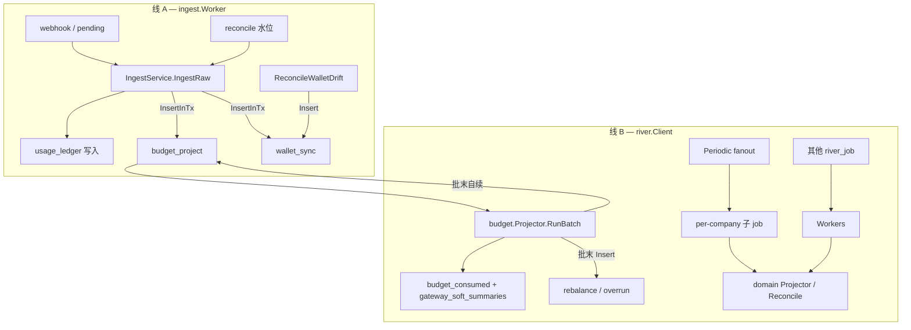

# Backend · 离线任务（现状）

> **定位**：离线任务 **as-built** 说明——当前代码如何实现、从哪入队、谁消费。  
> **基础设施细节**（Schema、Unique、`InsertInTx` 约定）：[Backend-River实现.md](./Backend-River实现.md)  
> **投影实现与剩余验收**：[Backend-预算.md](./Backend-预算.md)  
> **入账快路径**：[Backend-Ingest架构.md](./Backend-Ingest架构.md)  
> **预算投影域**：[Backend-预算.md](./Backend-预算.md)、[Backend-离线任务.md](./Backend-离线任务.md)

---

## 1. 运行时概览

进程内 **两条异步线**，无 `async_jobs`、无 poll `Runner`：

```text
cmd/server
  ├─ HTTP / Gateway
  ├─ infra/ingest.Worker.Start()     ← 线 A：日志库 pending + reconcile
  └─ infra/river.Client.Start()      ← 线 B：river_job claim + Workers + Periodic
```

| 线 | 包 | 存储 | 职责 |
| --- | --- | --- | --- |
| **A — Ingest** | `internal/infra/ingest` | 日志库 `ingest_jobs`；主库 `scheduler_locks` | webhook/reconcile 驱动 `IngestByLogID`；钱包漂移扫描 |
| **B — River** | `internal/infra/river` | 主库 `river_job` 等 | 全部副作用 job：claim、retry、Periodic |

装配入口：`internal/app/wire_river.go` → `buildBackgroundWorkers`。



---

## 2. 分层与依赖方向

| 层 | 路径 | 职责 |
| --- | --- | --- |
| **domain** | `domain/*` | 业务逻辑；**不** import `river` / `pgx` |
| **jobs** | `internal/infra/jobs` | `Enqueuer` 接口、Job Args、`Insert*` helper |
| **river workers** | `internal/infra/river/workers` | 薄壳：`Work()` → 调 domain 一个方法 |
| **river client** | `internal/infra/river` | Client 装配、Periodic、队列权重 |

Domain 入队只依赖 `jobs.Enqueuer`（`Insert` / `InsertInTx`）。事务内入队通过 `store.Tx`（`postgres.txStore` 实现），见 [Backend-River实现.md §3](./Backend-River实现.md#3-事务入队不泄漏-pgx-到-domain)。

### 2.1 Holder 装配顺序

Registry 阶段 domain 服务已构造，但 River Client 尚未就绪，因此：

1. `jobs.NewHolder(NoopEnqueuer)` — 占位，避免 nil
2. domain / billing / ingest / newapisync 注入 `*jobs.Holder`（实现 `Enqueuer`）
3. `river.NewClient` 成功后 `holder.Set(client.Enqueuer)`

代码：`internal/infra/jobs/holder.go`、`wire_river.go`。

`RIVER_ENABLED=false` 时 Holder 保持 `NoopEnqueuer`（`Insert` 返回 `nil`，**不入队**）。

---

## 3. 已实现的 Job kind（13 个）

| kind | 队列 | Unique | 触发 | Worker | Domain 入口 |
| --- | --- | --- | --- | --- | --- |
| `newapi_sync` | critical | 无 | Keys/Models 生命周期 | `workers/newapi_sync.go` | `newapisync.OutboxHandler` |
| `wallet_sync` | default | args，5s 窗 | 入账、充值、漂移 reconcile | `workers/wallet_sync.go` | `billing.SyncCompanyWallet` |
| `rebalance` | default | per axis | Projector 批末、充值、月切、预算 reconcile 修复、轴变更 | `workers/rebalance.go` | `budget.Rebalancer.Run` |
| `overrun` | default | per payload | Projector 批末 | `workers/overrun.go` | `budget.OverrunProcessor.Run` |
| `org_sync` | default | per company；fanout 用 `company_id=0` | Periodic fanout / fanout 扇出 | `workers/org_sync.go` | `FanoutScheduledSyncJobs` / `RunScheduledSync` |
| `monthly_rebalance` | default | 1min | Periodic | `workers/monthly_rebalance.go` | `MonthlyRebalanceScheduler.EnqueueMonthlyRebalanceAll` |
| `budget_project` | default | args，1s 窗，多 state | 入账同事务、批末自续 | `workers/budget_project.go` | `budget.Projector.RunBatch` |
| `budget_reconcile` | low | args，30min | fanout 扇出 | `workers/budget_project.go` | `budget.ReconcileService.RunCompany` |
| `budget_reconcile_fanout` | low | args，30min | Periodic | `workers/budget_project.go` | `budget.ReconcileService.FanoutReconcileJobs` |
| `dashboard_project` | low | args，1h | fanout 扇出、批末自续 | `workers/dashboard_project.go` | `dashboard.Projector.RunBatch` |
| `dashboard_project_fanout` | low | args，1h | Periodic | `workers/dashboard_project.go` | `dashboard.Projector.FanoutProjectJobs` |
| `dashboard_reconcile` | low | args，24h | fanout 扇出 | `workers/dashboard_project.go` | `dashboard.ReconcileService.RunCompany` |
| `dashboard_reconcile_fanout` | low | args，24h | Periodic | `workers/dashboard_project.go` | `dashboard.ReconcileService.FanoutReconcileJobs` |

Args 与 `InsertOpts()`：`internal/infra/jobs/args.go`。  
入队 helper：`internal/infra/jobs/enqueue.go`。  
Worker 注册：`internal/infra/river/client.go` → `registerWorkers`。

---

## 4. 入队点（谁写入 `river_job`）

### 4.1 事务内（`InsertInTx`，与 ledger 同事务）

**Ingest 成功路径**（`domain/usage/ingest.go` → `WithTx`）：

1. `ledger` 写入（`InsertSegments`）
2. `InsertBudgetProject`
3. `InsertWalletSync`

任一步失败 → 整笔事务回滚（含已插入的 `river_job` 行）。  
`rebalance` / `overrun` **不再**在 Ingest 同事务入队，改由 `budget.Projector` 批末入队。

### 4.2 事务外（`Insert`）

| 来源 | kind | 说明 |
| --- | --- | --- |
| `budget.Projector.RunBatch` | `rebalance`、`overrun` | 批末 side effect；批未跑完时自续 `budget_project` |
| `billing.afterRecharge` | `wallet_sync`、`rebalance`（company 轴） | 经 `wire_helpers` 注入的 enqueue 函数；失败 `slog.Warn`，不阻断充值 |
| `billing.ReconcileWalletDrift` | `wallet_sync` | ingest Worker 周期调用；失败 Warn |
| `budget.ReconcileService.RunCompany` | `rebalance`（company 轴） | reconcile 修复 drift 后 |
| `newapisync/lifecycle_*.go` | `newapi_sync` | Create/Update Key、Provider、ModelLimits；**当前非** DB 同事务 |
| `newapisync/lifecycle_rebalance.go` | `rebalance` | Rebalance 轴变更 |
| `MonthlyRebalanceScheduler` | `rebalance`（company 轴） | 月切后扇出 |
| `budget.ReconcileService.FanoutReconcileJobs` | `budget_reconcile` | Periodic fanout → 每 active company 一条 |
| `dashboard.Projector.FanoutProjectJobs` | `dashboard_project` | Periodic fanout → 每 active company 一条 |
| `dashboard.Projector.RunBatch` | `dashboard_project` | 批未跑完时自续 |
| `dashboard.ReconcileService.FanoutReconcileJobs` | `dashboard_reconcile` | Periodic fanout → 每 active company 一条 |
| River Periodic | 见 §6 | fanout / sync 单 job 入队 |
| `org.SyncService.FanoutScheduledSyncJobs` | `org_sync` | 仅 enabled 且到期的 tenant |

---

## 5. Worker 行为摘要

### 5.1 `wallet_sync`

- 比较 DB `BalancePoint` 与 NewAPI 可用 quota，正/负漂移调用 `TopUp`
- 公司无 `NewAPIWalletUserID` → domain 返回 `billing.ErrWalletNotConfigured` → worker `river.JobCancel`（永久取消，不重试）
- **Store 查询错误**原样返回 → River 重试（勿与「未配置钱包」混淆）

### 5.2 `rebalance` / `overrun`

- Args 带 `company_id` + axis / payload；worker 注入 tenant context 后调 `Rebalancer` / `OverrunProcessor`
- 主要触发源为 `budget.Projector` 批末；行为与迁移前 processor 等价
- 测试见 `tests/worker/processors_test.go`

### 5.3 `newapi_sync`

- `sub_kind`：`create_key` / `update_key` / `upsert_channel` / `update_model_limits`
- 未知 sub_kind 或 `IsPermanentOutboxError` → `JobCancel`

### 5.4 `org_sync`

- Periodic 入队 `org_sync{company_id:0}` → worker 调 `FanoutScheduledSyncJobs`，对到期 tenant 入队 `org_sync{company_id}`
- per-tenant job → `RunScheduledSync`；锁 `org_sync:{company_id}`；手动 `TriggerSync` 共用（冲突 409）

### 5.5 `monthly_rebalance`

- Periodic 检测开账月是否变化（`MonthlyRebalanceScheduler.lastMonth`）
- 月切时对所有 active company 入队 company 轴 `rebalance`

### 5.6 `budget_project`

- 按 `budget_projection_progress` 游标批量读 ledger，写 `budget_consumed`、更新 `gateway_soft_summaries`
- 批末：`budgetcheck.RefreshSummaries` 刷新进程内 Gateway 缓存，入队 `rebalance` / `overrun`
- 本批满 `batchSize`（500）→ 自续入队 `budget_project`

### 5.7 `budget_reconcile` / `budget_reconcile_fanout`

- fanout：Periodic 入队 1 条 → `FanoutReconcileJobs` → 每 company 入队 `budget_reconcile`
- per-company：对比近 2 个月 ledger 与 `budget_consumed`，修复 drift；必要时更新 gateway summary 并入队 company 轴 `rebalance`

### 5.8 `dashboard_project` / `dashboard_project_fanout`

- fanout：Periodic 入队 1 条 → `FanoutProjectJobs` → 每 company 入队 `dashboard_project`
- per-company：按 `dashboard_projection_progress` 游标批量 upsert `usage_buckets`；批满则自续

### 5.9 `dashboard_reconcile` / `dashboard_reconcile_fanout`

- fanout：Periodic 入队 1 条 → `FanoutReconcileJobs` → 每 company 入队 `dashboard_reconcile`
- per-company：对比近 90 天 ledger 与 `usage_buckets`，修复 drift

---

## 6. Periodic 任务

注册：`internal/infra/river/periodic.go`（仅 `RIVER_ENABLED=true`）。

| Periodic job | 间隔 | 默认 | 入队 kind |
| --- | --- | --- | --- |
| 组织同步 fanout | `WORKER_ORG_SYNC_INTERVAL_SEC` | 60s | `org_sync`（`company_id=0`） |
| 月切 rebalance | `WORKER_POLL_INTERVAL_SEC` | 5s | `monthly_rebalance` |
| 预算 reconcile fanout | 代码常量 | 30min | `budget_reconcile_fanout` |
| 看板投影 fanout | 代码常量 | 1h | `dashboard_project_fanout` |
| 看板 reconcile fanout | 代码常量 | 24h | `dashboard_reconcile_fanout` |

后三项间隔见 `internal/config/river.go`（`WorkerBudgetReconcileInterval` 等），当前**无**独立 env。

Fanout 模式：Periodic 只入队 **1 条** fanout job → worker 扫全 active company 并批量 `Insert` 子 job。

Leader 选举与漏 tick 说明见 [Backend-River实现.md §6、§8](./Backend-River实现.md)。

---

## 7. 配置

嵌入 `config.Config` 的 `RiverConfig`（`internal/config/river.go`）：

| 变量 | 默认 | 含义 |
| --- | --- | --- |
| `RIVER_ENABLED` | `true` | 是否启动 River Client 并 `holder.Set` 真 Enqueuer |
| `RIVER_MAX_WORKERS` | `20` | 全局 worker 上限；按 2:2:1 分到 critical / default / low |

与 Ingest 共用、但语义不同的 interval：

| 变量 | 用途 |
| --- | --- |
| `WORKER_POLL_INTERVAL_SEC` | ingest Worker 轮询间隔；**兼** monthly_rebalance Periodic |
| `WORKER_ORG_SYNC_INTERVAL_SEC` | org_sync Periodic |
| `INGEST_RECONCILE_*` | reconcile 批次与锁（线 A，非 River） |

---

## 8. 与 Ingest / 预算的当前关系

**现状（异步预算投影已落地）：**

- Ingest **只写** `usage_ledger`；同事务入队 `budget_project` + `wallet_sync`
- `budget.Projector` 异步写 `budget_consumed`、`gateway_soft_summaries`；批末入队 `rebalance` / `overrun`
- Gateway 预检读 `gateway_soft_summaries`（`GatewaySoftVersion` / `GatewaySoftRemain`），经 `budgetcheck` 进程内缓存加速
- 看板读 `usage_buckets`，由 `dashboard.Projector` / `dashboard.ReconcileService` 独立维护

设计细节见 [Backend-预算.md](./Backend-预算.md)、[Backend-离线任务.md](./Backend-离线任务.md)。

---

## 9. 存储与运维

- 表：`river_job`、`river_leader`、`river_queue`、`river_migration` 等，合入 `schema.sql`（wipe 部署，无 runtime migrate-up）
- 投影进度：`budget_projection_progress`、`dashboard_projection_progress`
- 保留 `scheduler_locks`：Ingest reconcile（`ingest_reconcile`）、org 同步 per-tenant（`org_sync:{company_id}`）；与 River leader 无关
- 运维 SQL（队列深度、discarded、按 tenant）：[Backend-River实现.md §7](./Backend-River实现.md#7-可观测首版-sql)
- 测试查 job：`store.RiverJobView` + `postgres/log_testhook.go`（`-tags=testhook`）

---

## 10. 测试

| 区域 | 路径 |
| --- | --- |
| Worker 集成 | `tests/worker/`（rebalance、overrun、newapi_sync、wallet_sync、org_sync、monthly_rebalance） |
| 入队 / Unique | `tests/store/postgres/wallet_sync_test.go`、`enqueue_tx_test.go` |
| Ingest 入队 | `tests/domain/usage/ingest_enqueue_test.go`；`tests/handler/gateway/webhook_ingest_test.go` |
| 预算投影 / reconcile | `tests/domain/budget/budget_projector_test.go`、`budget_reconcile_test.go`、`gateway_summary_test.go`、`ingest_fixture_test.go` |
| 看板投影 / reconcile | `tests/domain/dashboard/dashboard_projector_test.go`、`dashboard_reconcile_test.go` |
| Billing / wallet | `tests/domain/billing/wallet_sync_test.go`、`service_test.go` |
| 月切 scheduler | `tests/domain/budget/monthly_rebalance_test.go` |
| 测试辅助 | `tests/testutil/river/`（`NewRuntime`、`NewInsertOnlyEnqueuer`）；`tests/testutil/worker/`（ingest-only / River `RunOnce`） |

单测需 PostgreSQL：`make test-unit`（`-tags=testhook`）。测试配置默认 `RiverEnabled: true`（`tests/testutil/config.go`）。

---

## 11. 代码索引

```text
internal/
  app/wire_river.go              # 装配 ingest + river；Holder.Set；budget.Async / dashboard 注入
  app/wire_helpers.go            # billing enqueue 闭包
  config/river.go                # RIVER_* env；fanout 间隔常量
  domain/usage/ingest.go         # 事务内 budget_project + wallet_sync
  domain/budget/async.go         # Projector + ReconcileService 装配
  domain/budget/budget_projector.go
  domain/budget/budget_reconcile.go
  domain/budget/monthly_rebalance.go
  domain/dashboard/dashboard_projector.go
  domain/dashboard/dashboard_reconcile.go
  domain/billing/wallet_sync.go
  domain/billing/lot_confirm.go  # afterRecharge
  domain/org/remote/sync.go         # 同步、fanout、锁
  domain/newapisync/lifecycle_*.go
  infra/jobs/                    # Enqueuer, Holder, Args, enqueue.go
  infra/river/client.go          # registerWorkers, queueConfig
  infra/river/periodic.go
  infra/river/workers/*.go
  infra/ingest/worker.go         # 线 A
  store/tx.go                    # store.Tx 窄接口
  store/postgres/tx.go           # txStore + WithTx
  store/river_job_view.go        # 测试读 job
```

---

## 12. 关联文档

| 文档 | 内容 |
| --- | --- |
| [Backend-River实现.md](./Backend-River实现.md) | Schema、Unique 映射、队列、失败恢复 |
| [Backend-架构.md](./Backend-架构.md) §7 | 后台运行时、NewAPISync 与 Worker 关系 |
| [Backend-Ingest架构.md](./Backend-Ingest架构.md) | webhook → pending → ingest |
| [Backend-离线任务.md](./Backend-离线任务.md) · [Backend-预算.md](./Backend-预算.md) | 异步预算投影、离线任务（已基本落地） |
| [Backend-预算.md](./Backend-预算.md) | 预算域设计 |
