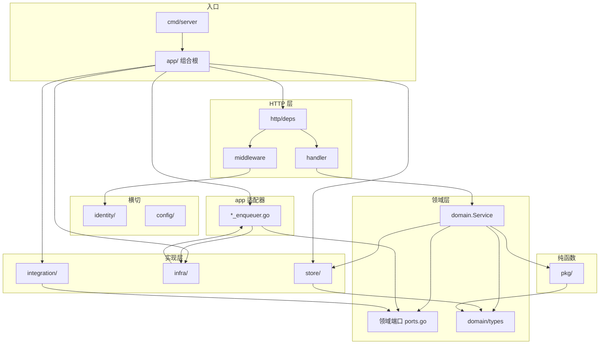
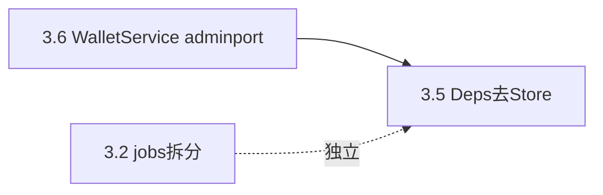

# Backend 结构优化

> **目的：** 定义 `apps/backend/` **目标架构**、**当前分层债务**与**分阶段收口路线**。  
> **相关：** [Backend.md](./Backend.md)（索引）· [Backend-架构.md](./Backend-架构.md)（分层 SSOT、文件命名 §3.1）· [Backend-计费模式.md](./Backend-计费模式.md)（lot SSOT）· [Backend-测试优化.md](./Backend-测试优化.md)（Phase 1.4 = PR3 rejection_cases，可独立 PR）· [工程收口.md](./工程收口.md)（上线 P0 优先于本文 Phase 3）  
> **维护：** 结构变化先更新本文 §1，再同步 [Backend-架构.md §3](./Backend-架构.md#3-项目结构) 目标态摘要。

**进度摘要：**

- **Phase 2 ✅**（2026-07-12）：domain 零 infra import、ports 推广、billing/lot、usage aggregate、AuthzRevisionReader
- **Phase 1 遗留**：1.4 Gateway `rejection_cases` SSOT（测试债务，不阻塞结构；见 [Backend-测试优化.md §12](./Backend-测试优化.md#12-pr3-实施规格)）
- **Phase 3 待办**：§3 七项（上线 P0 优先于结构 P2，见 [工程收口.md](./工程收口.md)）

---

## 1. 目标架构

### 1.1 分层

```text
HTTP（handler / middleware）
  ↓
Domain（Service）
  ├→ Store
  └→ Port → Infra / Integration
```

**请求链：**

```text
Client → middleware（identity 鉴权、租户解析）
       → handler（编解码、调 domain.Service）
       → domain.Service（业务规则 + 端口调用）
       → store / 端口实现（由 app/ 注入，domain 只见接口）
```

**不变量：**

- 业务 Handler **优先**调 `domain.Service`，不直访 Store（health / metrics / readiness 等基础设施 handler 除外）
- Handler **零业务规则**；**多 Service 串联的新业务流程**在 `app/` 编排
- domain 间通过**对方 Service 接口**协作可接受（如 `billing` → `usage.Reader`），但避免循环依赖
- DTO SSOT：`domain/types/`
- domain **禁止** import `integration/newapi`（经 `adminport.Port`；`company.WalletService` 为已知例外，见 §2 P2）
- **领域端口按域定义**（各域 `ports.go`），**适配器在 `app/*_enqueuer.go`** 注入；domain 只见接口
- middleware 读 authz 修订经 `identity/authz.RevisionReader`，不经 `Store.Company()`（见 §1.3）
- 多租户：`company_id` 经 `pkg/ctxcompany` / `domain/company.Context`；store 查询带 tenant 条件
- 业务测在 `tests/`（不在 `internal/`）

<details>
<summary>详细分层图（展开）</summary>



</details>

### 1.2 目录职责

```text
apps/backend/
├── cmd/server, testdbclean/
├── internal/
│   ├── app/           # 唯一组合根：wire_* + *_enqueuer 端口适配 + testhook
│   ├── config/
│   ├── identity/      # session、credentials、authz（含 RevisionReader）
│   ├── domain/        # 14 业务域 + types/ + errors.go
│   │   └── billing/
│   │       └── lot/   # lot 写 SSOT（consume / ledger）
│   ├── http/
│   │   ├── deps/      # Handler 依赖注入
│   │   ├── handler/   # 14 子包 + register
│   │   ├── middleware/
│   │   ├── httputil/, response/
│   ├── infra/         # jobs, river, ingest, notification, budgetcheck, permission
│   ├── integration/   # newapi adapter, datasource/feishu
│   ├── pkg/           # 纯函数：budget, org, ctxcompany, clock, …
│   └── store/         # 接口 + postgres/（仅 import domain/types）
│       └── postgres/  # usage_aggregate.go；大 Repo 按 *_repo_<主题>.go 拆分
├── seed/
└── tests/             # 镜像 internal/ 结构
    └── testutil/
        └── budget/    # budgetfix 包（snapshot 等 helper）
```

文件命名与域内拆分原则见 [Backend-架构.md §3.1](./Backend-架构.md#31-文件命名与拆分)。

### 1.3 领域端口

domain **禁止** import `infra/*`；异步、外部系统与横切能力经端口访问。**接口定义在各域 `ports.go`（或 `identity/`）**，**实现在 `infra/` / `integration/`，经 `app/*_enqueuer.go` 等适配器注入**（见 `app/wire_domain_services.go`）。

**硬约束（Phase 2 已验收）：** `rg 'internal/infra/' apps/backend/internal/domain/` 无匹配。

**端口放哪：**

| 范围 | 位置 | 示例 |
| --- | --- | --- |
| 多域共享 | 独立包 `domain/<name>/` | `adminport.Port`、`grants.Normalizer` |
| 单域异步入队 | 该域 `ports.go` + `app/*_enqueuer.go` | `budget.JobEnqueuer`、`usage.IngestJobEnqueuer` |
| 单域私有 | 该域 `ports.go` | `BudgetChecker`（budget + gateway 共用） |
| HTTP 层消费 | `identity/` 或 `http/middleware/` | `authz.RevisionReader` |
| 外部数据源 | `integration/` 实现 + domain Provider 接口 | `org/remote` 的 `datasource.Provider` |

**已落地端口清单：**

```mermaid
flowchart LR
  subgraph domainPorts [domain ports]
    budgetPorts[budget/ports.go]
    orgRemote[org/remote/ports.go]
    usagePorts[usage/ports.go]
    dashPorts[dashboard/ports.go]
    syncPorts[newapisync/ports.go]
    orgNotify[org/core notify]
  end
  subgraph appAdapters [app adapters]
    budgetEq[budget_enqueuer]
    orgEq[org_enqueuer]
    usageEq[usage_enqueuer]
    dashEq[dashboard_enqueuer]
    syncEq[newapisync_enqueuer]
  end
  subgraph infra [infra]
    jobs[jobs + river]
  end
  domainPorts --> appAdapters --> infra
```



| 端口 | 定义位置 | 适配器 | 说明 |
| --- | --- | --- | --- |
| `budget.JobEnqueuer` | `domain/budget/ports.go` | `app/budget_enqueuer.go` | Phase 1 试点 |
| `remote.JobEnqueuer` | `domain/org/remote/ports.go` | `app/org_enqueuer.go` | 组织同步 job |
| `usage.IngestJobEnqueuer` | `domain/usage/ports.go` | `app/usage_enqueuer.go` | 入账 enqueue |
| `dashboard.JobEnqueuer` | `domain/dashboard/ports.go` | `app/dashboard_enqueuer.go` | 看板投影 |
| `newapisync.SyncJobEnqueuer` | `domain/newapisync/ports.go` | `app/newapisync_enqueuer.go` | PlatformKey 生命周期 |
| `core.Notifier` | `domain/org/core/notify.go` | `app` 注入 | org 通知；usage ingest **不再**直连 notifier |
| `authz.RevisionReader` | `identity/authz/revision.go` | `authz.Service` 实现 | middleware 读 authz 修订号 |

**横切 / 集成端口（非 domain→infra 直连）：**

| 端口 | 消费方 | 实现 |
| --- | --- | --- |
| `adminport.Port` | newapisync, keys, billing, company（长期） | `integration/newapi/admin_port_adapter` |
| `grants.Normalizer` | org, keys | `infra/permission` |
| `BudgetChecker` | budget, gateway | `infra/budgetcheck` |
| `budget.Notifier` | budget overrun | `infra/notification`（Phase 1 试点） |

**端口注入约定（Wire SSOT）：**

| 文件 | 职责 |
| --- | --- |
| `app/wire_domain_services.go` | org / usage ingest / dashboard read model 等 domain 构造 + enqueuer 注入 |
| `app/wire_river.go` | dashboard projector / reconcile 传 `NewDashboardEnqueuer` |
| `app/wiring_infra.go` | newapisync 传 `NewNewAPISyncEnqueuer` |
| `app/registry.go` | `httpdeps.Deps` 组装；`AuthzSvc` 兼 `RevisionReader` |

**硬规则（Phase 2 验证）：**

- Job adapter **必须**在 `app/`，不可放 `infra/jobs`（避免 `jobs → domain → jobs` 循环）
- `usage.IngestJobEnqueuer.EnqueueAfterIngest(ctx, tx, companyID)` **必须透传 `store.Tx`**（`app/usage_enqueuer.go` 内调用 `InsertBudgetProject` / `InsertWalletSync`）
- org 阈值通知：domain 构造 `types.Notification`，经 `core.Notifier.Send`；不 import `infra/notification` helper

```go
// domain/budget/ports.go — 域内端口示意
type JobEnqueuer interface {
    EnqueueMonthlyRebalance(ctx context.Context, companyID int64) error
}
type BudgetChecker interface { /* … */ }
type Notifier interface { /* … */ }
```

### 1.4 钱包边界

**Lot 写 SSOT 在 `domain/billing/lot/`**（FIFO 消费、`wallet_remain` 维护）。原 `domain/wallet/` 已合并为该子包；`domain/billing/` 负责充值、确认、展示、`GetWallet`、`wallet_sync` 等完整计费域。语义详见 [Backend-计费模式.md](./Backend-计费模式.md)。

| 名称 | 含义 | 路径/归属 |
| --- | --- | --- |
| **Lot 写 SSOT** | FIFO 消费、`wallet_remain` 维护 | `domain/billing/lot/` |
| **Billing 域** | 充值、确认、展示、`GetWallet`、wallet_sync | `domain/billing/` |
| **产品「钱包」** | 前端 `/wallet`、API `WalletView` | billing 读模型，非独立 domain |
| **`company.WalletService`** | NewAPI `GetUserQuota` 派生读 + 缓存 | `domain/company/`；**不是** lot SSOT；Phase 3.6 经 `adminport.Port` 收口 |

### 1.5 Phase 2 目标态快照

Phase 2 完成后，读者仅看 §1 即可把握当前结构形态（§3 保留任务历史与 ✅ 标记）：

- **domain 零 infra import** — 5 域各自 `ports.go` + `app/*_enqueuer.go` 适配
- **`store/usagequery/` 已删** — 聚合查询在 `store/postgres/usage_aggregate.go`，经 `UsageRepository` 暴露
- **`domain/wallet/` 已删** — lot 写路径统一经 `domain/billing/lot/`
- **middleware 不直读 store** — `identity/authz.RevisionReader` 经 `deps.AuthzSvc` 注入
- **Store 机械拆分** — ledger / billing / models 等按 `<域>_repo_<主题>.go` 拆分
- **testutil 合并** — `tests/testutil/budget/`（`budgetfix`）替代根级 `budget.go`
- **Phase 1 遗留** — 1.4 Gateway `rejection_cases` SSOT（`tests/testutil/gateway/rejection_cases.go`，待独立 PR）
- **剩余 P2 债务** — 见 §2（scope→authz、`WalletService`→adminport、Deps 移除 `Store`），计划 Phase 3

---

## 2. 当前分层债务

| 优先级 | 现状 | 目标 | 状态 |
| --- | --- | --- | --- |
| ~~**P0**~~ | ~~store 依赖 `domain/company`~~ | ~~store 只收 `company_id int64`~~ | ✅ Phase 1.2（`pkg/companyids`） |
| ~~**P0**~~ | ~~domain 直连 `infra/*`（org / usage / dashboard / newapisync 等）~~ | ~~经 §1.3 端口；`app/` 注入~~ | ✅ Phase 2.1 |
| ~~**P1**~~ | ~~`domain/usage` → `store/usagequery`~~ | ~~查询并入 `UsageRepository`，删子包~~ | ✅ Phase 2.3 |
| ~~**P1**~~ | ~~middleware 直读 store~~ | ~~`AuthzRevisionReader` 端口~~ | ✅ Phase 2.6 |
| ~~**P1**~~ | ~~wallet / billing / company 三包并行~~ | ~~按 §1.4 合并为 `domain/billing/lot/`~~ | ✅ Phase 2.5 |
| **P1（测试）** | Gateway precheck/evaluate 拒绝场景 case 重复 | `tests/testutil/gateway/rejection_cases.go` SSOT | 待 Phase 1.4 |
| **P2** | `domain/usage/scope.go` → `identity/authz` | scope 计算下沉 `pkg/`，或经 Deps 注入 | |
| **P2** | `company.WalletService` 用 raw AdminClient | 经 `adminport.Port`（与 §1.4 一并收口） | |
| **P2** | `http/deps` 暴露 `Store` | 2.6 完成后从 Deps 移除 | |

---

## 3. 路线图

### Phase 1 — P0 结构与端口试点 ✅（2026-07-12）

| # | 任务 | 路径 | 备注 |
| ---: | --- | --- | --- |
| 1.1 | 拆分 org structure 大文件 | `domain/org/structure/member_*.go`、`role_*.go` | ✅ |
| 1.2 | store 去 domain/company 依赖 | `pkg/companyids/`、`store/postgres/bootstrap.go` 等 | ✅ |
| 1.3a | `GatewaySoftCache` 端口 | `domain/budget/gateway_soft_cache.go`、`infra/budgetcheck/domain_adapter.go` | ✅ |
| 1.3b | `JobEnqueuer` 端口（试点 budget） | `domain/budget/ports.go`、`app/budget_enqueuer.go` | ✅ |
| 1.3c | `Notifier` 端口（试点 budget overrun） | `domain/budget/ports.go`、`domain/budget/overrun.go` | ✅ |
| 1.4 | Gateway rejection_cases SSOT | `tests/testutil/gateway/rejection_cases.go` | 待独立 PR |

**Exit Criteria**

- [x] `make test-unit` 全绿
- [x] 1.2 完成后：`store` 不再 import `domain/*`（除 `types`）
- [x] budget + gateway 不再 import `infra/budgetcheck` / `infra/jobs` / `infra/notification`
- [x] org structure 大文件已按职责拆分（behavior-preserving）

---

### Phase 2 — P1 模块化收口 ✅（2026-07-12）

| # | 任务 | 路径 | 备注 |
| ---: | --- | --- | --- |
| 2.1 | 端口推广至 org / usage / dashboard / newapisync | `domain/*/ports.go`、`app/*_enqueuer.go` | ✅ |
| 2.2 | 拆分 ledger / models / billing postgres repo | `store/postgres/*_repo_*.go` | ✅ |
| 2.3 | usagequery 收入 UsageRepository | `store/postgres/usage_aggregate.go` | ✅ |
| 2.4 | testutil budget helper 合并 | `tests/testutil/budget/snapshot.go` | ✅ |
| 2.5 | wallet → billing/lot 合并 | `domain/billing/lot/` | ✅ |
| 2.6 | `AuthzRevisionReader` 端口 | `identity/authz/revision.go` | ✅ |
| 2.7 | grants / adminport 最小单测 | `tests/domain/grants/`、`tests/domain/adminport/` | ✅ |

**Exit Criteria**

- [x] `make test-unit` 全绿
- [x] domain 无 `infra/*` import（经端口访问）
- [x] `store/usagequery/` 已删除；middleware 不直读 store
- [x] `domain/wallet/` 已合并为 `domain/billing/lot/`；lot 测试集中在 billing

---

### Phase 3 — P2 体验与性能（按需，上线 P0 优先）

**范围：** 按需推进；[工程收口.md](./工程收口.md) 上线 P0 优先于结构 P2；Phase 3 不阻塞 Phase 2 已验收结构。



| # | 任务 | 路径 | 做法 | 验收 |
| ---: | --- | --- | --- | --- |
| 3.1 | Feishu client 拆分 | `integration/datasource/feishu/` | `client.go`（~392 行）按 API 面拆：`auth.go`、`departments.go`、`members.go`；`Provider` 接口不变 | `make test-unit` 全绿；org remote 导入行为不变 |
| 3.2 | `infra/jobs/args.go` 按 kind 拆文件 | `infra/jobs/` | 按 `Kind*` 拆（如 `args_wallet_sync.go`、`args_rebalance.go`）；`enqueuer.go` 保持 Insert* 入口 | 无行为变更；`rg 'KindWalletSync' infra/jobs/` 仍可解析 |
| 3.3 | schema clone 优化 | `tests/testutil/pg/clone.go` | 优化 per-schema 克隆（减少全表 COPY、复用 clone plan） | `make test-unit` wall time 下降（基准见 [Backend-测试优化.md](./Backend-测试优化.md) PR3 backlog） |
| 3.4 | `internal/*_test.go` 外迁 | `tests/infra/`、`tests/identity/` | 3 个文件：`identity/sessiontoken/issuer_test.go`、`infra/permission/manifest_test.go`、`infra/permission/grants_test.go` | `internal/` 无 `*_test.go`（除 build tag 例外）；`make test-unit` 全绿 |
| 3.5 | Deps 移除 Store 字段 | `http/deps/` | 删 `http/deps/deps.go` 中 `Store` 字段；handler 已无直访 | `rg '\.Store\b' apps/backend/internal/http/handler/` 无匹配；`http/deps/deps.go` 无 `Store` 字段 |
| 3.6 | `company.WalletService` 改 adminport | `domain/company/wallet.go` | 改依赖 `adminport.Port`（或窄接口 `GetUserQuota`）；更新 `wiring_infra.go`、billing/newapisync 构造 | 消除 §2 P2「raw AdminClient」；`make test-unit` 全绿 |
| 3.7 | 文档 stale 路径清扫 | 各 `Backend-*.md` | `rg 'infra/worker\|domain/wallet\|store/usagequery' docs/`；重点：[Backend-业务时钟与账期.md](./Backend-业务时钟与账期.md)、[架构终态设计.md](./架构终态设计.md) | `docs/` 无 stale 路径（历史过去式描述除外） |

**依赖说明：** 3.6 与 3.5 可同 PR；3.1 / 3.3 / 3.4 / 3.7 互不阻塞。

**Exit Criteria**

- [ ] `make test-unit` 全绿
- [ ] `http/deps.Deps` 不含 `Store` 字段（`rg 'Store\s+store\.Store' apps/backend/internal/http/deps/deps.go` 无匹配）
- [ ] 业务 handler 经 domain 访问持久化（`rg '\.Store\b' apps/backend/internal/http/handler/` 无匹配）
- [ ] `domain/usage/scope.go` 不再 import `identity/authz`（或 scope 逻辑迁至 `pkg/`）
- [ ] `docs/` 无 stale 路径：`rg 'domain/wallet|store/usagequery|infra/worker' docs/`（§3 历史任务过去式除外）

---

## 4. PR 自检

**默认模式（Phase 2 已确立）：**

- [ ] 新异步入队：域内 `ports.go` 定义接口 + `app/*_enqueuer.go` 适配，**禁止** domain import `infra/jobs`
- [ ] lot 写路径只经 `domain/billing/lot/`
- [ ] usage 聚合查询只经 `UsageRepository` / `usage_aggregate.go`，不新建 `store/*query` 子包
- [ ] middleware 读 authz 修订经 `AuthzRevisionReader`，不经 `Store.Company()`

**通用：**

- [ ] domain 是否新增了 `infra/*` / `integration/*` / `http/*` import？→ 改端口
- [ ] store 是否新增了 `domain/*`（非 types）import？
- [ ] 业务 handler 是否绕过 domain 直调 store？
- [ ] 是否新增**跨域编排**（多 Service 串联的新流程）？→ 优先放 `app/`；单点调用对方 Service 接口可接受
- [ ] 新增 infra 依赖时，是否已定义端口并在 `app/` 注入？
- [ ] lot / 钱包写逻辑是否只进 `domain/billing/lot/`？
- [ ] 大文件拆分是否 behavior-preserving（仅移动）？
- [ ] 合并后跑：`rg 'internal/infra/' apps/backend/internal/domain/`、`make test-unit`

---

*目标架构（§1）随设计定型少改；债务（§2）与路线（§3）随进展更新。*
