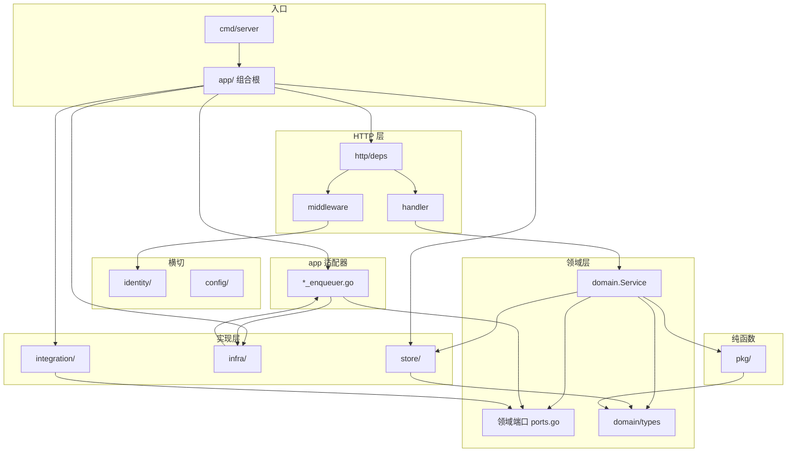

# Backend 结构优化

> **目的：** 记录 `apps/backend/` **当前结构基线**与**剩余分层债务**（非上线阻塞）。  
> **相关：** [Backend.md](./Backend.md) · [Backend-架构.md](./Backend-架构.md)（分层 SSOT、文件命名 §3.1）· [Backend-计费模式.md](./Backend-计费模式.md)（lot SSOT）· [Backend-测试优化.md](./Backend-测试优化.md)（Gateway rejection_cases）· [工程收口.md](./工程收口.md)（上线 P0 优先于本文 P2）  
> **维护：** 结构变化先更新本文，再同步 [Backend-架构.md §3](./Backend-架构.md#3-项目结构) 目标态摘要。

**读者速览：** 2026-07-12 起，domain 零 `infra/*` import、五域 `ports.go` + `app/*_enqueuer.go`、`billing/lot` 写 SSOT、`RevisionReader` 端口均已落地。下文 §1 为现状；§2 为剩余债务；§3 为 PR 自检。

---

## 1. 当前架构

### 1.1 分层

```text
HTTP（handler / middleware）
  ↓
Domain（Service）
  ├→ Store
  └→ Port → Infra / Integration（经 app/ 注入）
```

**请求链：**

```text
Client → middleware（identity 鉴权、租户解析）
       → handler（编解码、调 domain.Service）
       → domain.Service（业务规则 + 端口调用）
       → store / 端口实现
```

**不变量：**

- 业务 Handler **优先**调 `domain.Service`，不直访 Store（health / metrics / readiness 等基础设施 handler 除外）
- Handler **零业务规则**；**多 Service 串联的新业务流程**在 `app/` 编排
- domain 间通过**对方 Service 接口**协作可接受，避免循环依赖
- DTO SSOT：`domain/types/`
- domain **禁止** import `integration/newapi`（经 `adminport.Port`；`company.WalletService` 为已知例外，见 §2）
- **领域端口按域定义**（各域 `ports.go`），**适配器在 `app/*_enqueuer.go`** 注入
- middleware 读 authz 修订经 `identity/authz.RevisionReader`，不经 `Store.Company()`
- 多租户：`company_id` 经 `pkg/ctxcompany` / `domain/company.Context`；store 查询带 tenant 条件
- 业务测在 `tests/`（不在 `internal/`）

**硬约束（CI / 本地可验）：**

```bash
# domain 不得 import infra
rg 'internal/infra/' apps/backend/internal/domain/

# 业务 handler 不得直访 Store
rg '\.Store\b' apps/backend/internal/http/handler/
```

<details>
<summary>分层图（展开）</summary>



</details>

### 1.2 目录职责

```text
apps/backend/
├── cmd/server, testdbclean/
├── internal/
│   ├── app/           # 组合根：wire_* + *_enqueuer 端口适配 + testhook
│   ├── config/
│   ├── identity/      # session、credentials、authz（含 RevisionReader）
│   ├── domain/        # 14 业务域 + types/ + errors.go
│   │   └── billing/
│   │       └── lot/   # lot 写 SSOT（consume / ledger）
│   ├── http/
│   │   ├── deps/      # Handler 依赖注入
│   │   ├── handler/   # 14 子包 + register
│   │   ├── middleware/
│   │   ├── httputil/, response/
│   ├── infra/         # jobs, river, ingest, notification, budgetcheck, permission
│   ├── integration/   # newapi adapter, datasource/feishu
│   ├── pkg/           # 纯函数：budget, org, ctxcompany, clock, companyids, …
│   └── store/         # 接口 + postgres/（仅 import domain/types）
│       └── postgres/  # usage_aggregate.go；大 Repo 按 *_repo_<主题>.go 拆分
├── seed/
└── tests/             # 镜像 internal/ 结构
    └── testutil/
        └── budget/    # budgetfix 包（snapshot / ptr / seed 等）
```

文件命名与域内拆分原则见 [Backend-架构.md §3.1](./Backend-架构.md#31-文件命名与拆分)。

**Store 拆分（现状）：**

| 域 | 文件 |
| --- | --- |
| billing | `billing_repo_wallet.go`、`billing_repo_lots.go`、`billing_repo_orders.go` |
| ledger | `ledger_repo_write.go`、`ledger_repo_projector.go`（门面 `ledger_repo.go`） |
| models | `models_repo_crud.go`、`models_repo_capabilities.go` |
| budget / org / keys | 各 `*_repo_*.go` 多文件 |

**org structure 拆分（现状）：** `domain/org/structure/` — `member_list.go`、`member_mutate.go`、`member_batch.go`、`member_helpers.go`、`role_crud.go`、`role_members.go` 等。

### 1.3 领域端口

domain **禁止** import `infra/*`；异步、外部系统与横切能力经端口访问。**接口在各域 `ports.go`（或 `identity/`）**，**实现在 `infra/` / `integration/`，经 `app/*_enqueuer.go` 注入**（见 `app/wire_domain_services.go`）。

| 端口 | 定义 | 适配器 | 说明 |
| --- | --- | --- | --- |
| `budget.JobEnqueuer` | `domain/budget/ports.go` | `app/budget_enqueuer.go` | 预算投影 / overrun / rebalance |
| `budget.Notifier` | 同上 | `app` 注入 `infra/notification` | overrun 通知 |
| `remote.JobEnqueuer` | `domain/org/remote/ports.go` | `app/org_enqueuer.go` | org sync job |
| `usage.IngestJobEnqueuer` | `domain/usage/ports.go` | `app/usage_enqueuer.go` | 入账后 enqueue；**须透传 `store.Tx`** |
| `dashboard.JobEnqueuer` | `domain/dashboard/ports.go` | `app/dashboard_enqueuer.go` | 看板投影 / reconcile |
| `newapisync.SyncJobEnqueuer` | `domain/newapisync/ports.go` | `app/newapisync_enqueuer.go` | PlatformKey 生命周期 |
| `core.Notifier` | `domain/org/core/notify.go` | `app` 注入 | org 阈值通知 |
| `authz.RevisionReader` | `identity/authz/revision.go` | `authz.Service` | middleware 读 authz 修订号 |
| `GatewaySoftCache` | `domain/budget/gateway_soft_cache.go` | `infra/budgetcheck/domain_adapter.go` | Gateway 软摘要 / 预算执法 |

**横切 / 集成端口：**

| 端口 | 消费方 | 实现 |
| --- | --- | --- |
| `adminport.Port` | newapisync, keys, billing, company（部分） | `integration/newapi/admin_port_adapter` |
| `grants.Normalizer` | org, keys | `infra/permission` |
| `datasource.Provider` | org/remote | `integration/datasource/feishu` 等 |

**注入 SSOT：**

| 文件 | 职责 |
| --- | --- |
| `app/wire_domain_services.go` | domain 构造 + enqueuer 注入 |
| `app/wire_river.go` | River worker / dashboard projector |
| `app/wiring_infra.go` | newapisync、admin port、wallet 等 |
| `app/registry.go` | `httpdeps.Deps`；`AuthzSvc` 兼 `RevisionReader` |

**规则：**

- Job adapter **必须**在 `app/`，不可放 `infra/jobs`（避免 `jobs → domain → jobs` 循环）
- `usage.IngestJobEnqueuer.EnqueueAfterIngest(ctx, tx, companyID)` **必须透传 `store.Tx`**
- org 通知：domain 构造 `types.Notification`，经 `core.Notifier.Send`；不 import `infra/notification`

### 1.4 钱包与 lot 边界

**Lot 写 SSOT 在 `domain/billing/lot/`**（FIFO 消费、`wallet_remain` 维护）。`domain/wallet/` 已删除；计费语义见 [Backend-计费模式.md](./Backend-计费模式.md)。

| 名称 | 含义 | 路径 |
| --- | --- | --- |
| **Lot 写 SSOT** | FIFO 消费、`wallet_remain` | `domain/billing/lot/` |
| **Billing 域** | 充值、确认、展示、`GetWallet`、wallet_sync | `domain/billing/` |
| **产品「钱包」** | 前端 `/wallet`、API `WalletView` | billing 读模型 |
| **`company.WalletService`** | NewAPI `GetUserQuota` 派生读 + 缓存 | `domain/company/`；**不是** lot SSOT；待收口见 [§2.2](#22-walletservice--adminport) |

**Usage 聚合：** `store/postgres/usage_aggregate.go`，经 `UsageRepository` 暴露；`store/usagequery/` 已删除。

---

## 2. 剩余债务

上线 P0 见 [工程收口.md](./工程收口.md)。本节按**重要性**排序：先收口架构例外与 Gateway 测试 SSOT，再 HTTP 层纯度与 domain 依赖，最后机械拆分与性能。**各项互不阻塞**，可独立 PR。

### 优先级一览

| 序 | 级别 | 项 | 为何重要 |
| ---: | --- | --- | --- |
| 1 | **高** | [2.1 Gateway rejection_cases SSOT](#21-gateway-rejection_cases-ssot) | Gateway 是计费入口；case 重复会导致 precheck / evaluate / handler 行为漂移 |
| 2 | **高** | [2.2 WalletService → adminport](#22-walletservice--adminport) | domain 层最后一个 raw NewAPI 例外；与 §1.3 adminport 基线不一致 |
| 3 | **中** | [2.3 Deps 移除 Store](#23-deps-移除-store) | HTTP 组合根仍暴露全量 Store；handler 已净，属组合根卫生 |
| 4 | **中** | [2.4 usage scope 与 authz 解耦](#24-usage-scope-与-authz-解耦) | domain 反向依赖 identity；影响 usage / dashboard 可读性与复用 |
| 5 | **低** | [2.5 文档 stale 路径](#25-文档-stale-路径) | 低成本；避免新人按旧路径改代码 |
| 6 | **低** | [2.6 internal 单测外迁](#26-internal-单测外迁) | 与「测在 tests/」约定一致 |
| 7 | **低** | [2.7 大文件机械拆分](#27-大文件机械拆分) | 可读性；零行为变更 |
| 8 | **低** | [2.8 schema clone 性能](#28-schema-clone-性能) | 测试墙钟；见 [Backend-测试优化.md](./Backend-测试优化.md) |

---

### 2.1 Gateway rejection_cases SSOT

**问题：** 同一拒绝场景在三个测试层各维护一份 inline table，改规则时容易漏改。

| 场景 | `evaluate_test.go` | `precheck_test.go` | handler HTTP |
| --- | --- | --- | --- |
| insufficient wallet | ✅ | ✅ | ✅（`TestGatewayRejectsInsufficientWallet`） |
| suspended company | ✅ | ✅ | ❌ G3 待补 |
| model not allowlist | ✅ | ✅ | ❌ G2 待补 |
| inactive key | ✅ | ✅（独立 Test） | ❌ |
| exhausted soft remain | ✅ | — | — |

**现状文件：**

- `tests/domain/gateway/evaluate_test.go` — `TestEvaluateRejects`（6 case，`MutatePC`）
- `tests/domain/gateway/precheck_test.go` — `TestPrecheckRejects`（3 case，`GatewayScenarioOpts`）
- `tests/testutil/gateway/` — 有 fixture，**无** `rejection_cases.go`

**目标：**

1. 新增 `tests/testutil/gateway/rejection_cases.go` — `RejectionCase{Name, MutatePC, Scenario, Model, WantHTTP}`
2. evaluate / precheck 遍历同一 table（precheck 取子集）
3. handler 补 G2/G3：`TestGatewayRejectionHTTPMapping` 期望 **403**

**约束（不可妥协）：**

- precheck **每 case 仍须独立 store**（wallet=0 / suspended 不可共享 fixture）
- **不合并** `call_chain_test.go`（PRD 10.3 顺序校验）

**验收：** case 数据只在 `rejection_cases.go`；`make test-unit` 全绿；净增 clone ≤3。完整规格见 [Backend-测试优化.md §12](./Backend-测试优化.md#12-pr3-实施规格)。

---

### 2.2 WalletService → adminport

**问题：** §1 约定 domain 不经 raw `integration/newapi`；`company.WalletService` 仍是例外，与 `company.Service`、`newapisync` 等已用 `adminport.Port` 的路径不一致。

**现状：**

```text
wiring_infra.go
  adminClient := newapi.NewClient(...)
  adminPort   := newapi.NewAdminPortAdapter(adminClient)  → newapisync 等
  wallet      := NewWalletService(cfg, adminClient)       → 仍用 raw client
```

- `domain/company/wallet.go` — 匿名接口 `{ GetUserQuota }`，带 TTL 缓存
- 消费方：`newapisync` lifecycle（remain 封顶）、Gateway 间接路径

**目标（二选一，推荐 A）：**

| 方案 | 做法 |
| --- | --- |
| **A（推荐）** | `adminport.Port` 增加 `GetUserQuota`（或窄接口嵌入 Port）；`NewWalletService(cfg, port adminport.Port)` |
| B | 新建 `domain/company/quota_port.go`，adapter 仍在 `integration/newapi` |

**验收：**

- `domain/company/wallet.go` 不 import `integration/newapi`
- `wiring_infra.go` 不再把 `adminClient` 传入 wallet（可保留 client 仅给 adapter 构造）
- `make test-unit` 全绿；newapisync wallet cap 行为不变

**可与 [2.3](#23-deps-移除-store) 同 PR。**

---

### 2.3 Deps 移除 Store

**问题：** HTTP 组合根 `httpdeps.Deps` 仍携带全量 `store.Store`，与「handler 只调 domain」目标态不符。业务 handler 已净。

**现状：**

- `http/deps/deps.go:28` — `Store store.Store`
- `app/registry.go:67` — 装配时填入
- **Handler 直访：** `rg '\.Store\b' internal/http/handler/` → 无匹配 ✅
- **实际消费：** `ServiceRegistry.IngestWorker` 用 `r.Store.Logs()`、`r.Store.SchedulerLock()`

**目标：**

1. 从 `httpdeps.Deps` 删除 `Store` 字段
2. `IngestWorker` 改从 `ServiceRegistry.Infra.store` 或窄接口（`LogsRepository` + `SchedulerLock`）取依赖
3. `registry.go` 不再向 Deps 复制 store

**验收：**

```bash
rg 'Store\s+store\.Store' apps/backend/internal/http/deps/deps.go   # 无匹配
rg '\.Store\b' apps/backend/internal/http/handler/                   # 无匹配
make test-unit
```

---

### 2.4 usage scope 与 authz 解耦

**问题：** `domain/usage/scope.go` import `identity/authz`，用于 dashboard 部门可见范围（`authz.HasAny`）。domain 不应反向依赖 identity 包。

**现状：**

- `usage/scope.go` — `ResolveScopeDepartments`、`IsDepartmentAccessible` 等
- 调用链：dashboard / memberanalytics read path → `usage.ResolveScope*`

**目标（推荐顺序）：**

1. 把「是否 org-wide dashboard」判断下沉 `pkg/usage/` 或 `pkg/authzscope/`（纯函数，入参 permission keys）
2. 或在 read model 构造时由 handler/app 注入 `OrgWideChecker` 端口

**验收：** `usage/scope.go` 不 import `identity/authz`；dashboard 部门过滤行为不变。

---

### 2.5 文档 stale 路径

**问题：** 部分 doc 仍引用已删除路径，与 §1 基线矛盾。

**已知命中（2026-07-12）：**

| 文件 | 内容 |
| --- | --- |
| `docs/架构终态设计.md:15` | `domain/wallet` 写 SSOT |
| `docs/Backend-业务时钟与账期.md:251` | `infra/worker/runner.go` |

**目标：** 改为 `domain/billing/lot/`、`infra/river/` 等现行路径；历史描述用过去式或删段。

**验收：**

```bash
rg 'domain/wallet|store/usagequery|infra/worker/runner' docs/
# 仅允许 Backend-结构优化.md 等「已删除」说明性引用
```

---

### 2.6 internal 单测外迁

**问题：** 约定业务测在 `tests/`；`internal/` 仍留 3 个单测文件。

| 现路径 | 建议目标 |
| --- | --- |
| `internal/identity/sessiontoken/issuer_test.go` | `tests/identity/sessiontoken/` |
| `internal/infra/permission/manifest_test.go` | `tests/infra/permission/` |
| `internal/infra/permission/grants_test.go` | 同上 |

**验收：** `internal/` 无 `*_test.go`（`//go:build testhook` 嵌入测除外）；`make test-unit` 全绿。

---

### 2.7 大文件机械拆分

**零行为变更**，仅按职责切文件。

| 文件 | 行数 | 拆法 |
| --- | ---: | --- |
| `integration/datasource/feishu/client.go` | ~391 | `auth.go`、`departments.go`、`members.go`；`Provider` 接口不变 |
| `infra/jobs/args.go` | ~253 | 按 kind 拆 `args_wallet_sync.go`、`args_rebalance.go` 等；`Insert*` 仍集中在 `enqueue.go` |

**验收：** `make test-unit` 全绿；org remote 导入行为不变。

---

### 2.8 schema clone 性能

**问题：** 全量 `make test-unit` 墙钟 ~101s（617 `Test*`），瓶颈在 per-schema PG clone。

**范围：** `tests/testutil/pg/clone.go` — 减少全表 COPY、复用 clone plan。

**验收：** 墙钟下降（基准见 [Backend-测试优化.md](./Backend-测试优化.md)）；无测试语义变更。与结构分层无关，可独立 PR。

---

**并行关系：**

```text
2.1 rejection_cases     ── 独立
2.2 WalletService       ──┬── 可同 PR
2.3 Deps.Store          ──┘
2.4 scope/authz         ── 独立
2.5 doc 清扫            ── 独立（建议顺手做）
2.6 / 2.7 / 2.8         ── 互不依赖
```

---

## 3. PR 自检

**结构基线（默认应满足）：**

- [ ] 新异步入队：域内 `ports.go` + `app/*_enqueuer.go`，**禁止** domain import `infra/jobs`
- [ ] lot 写路径只经 `domain/billing/lot/`
- [ ] usage 聚合只经 `UsageRepository` / `usage_aggregate.go`，不新建 `store/*query` 子包
- [ ] middleware 读 authz 修订经 `RevisionReader`，不经 `Store.Company()`

**通用：**

- [ ] domain 是否新增了 `infra/*` / `integration/newapi` / `http/*` import？→ 改端口
- [ ] store 是否新增了 `domain/*`（非 `types`）import？
- [ ] 业务 handler 是否绕过 domain 直调 store？
- [ ] 是否新增**跨域编排**？→ 优先 `app/`；单点调对方 Service 可接受
- [ ] lot / 钱包写逻辑是否只进 `domain/billing/lot/`？
- [ ] 大文件拆分是否 behavior-preserving（仅移动）？
- [ ] 合并后：`rg 'internal/infra/' apps/backend/internal/domain/`、`make test-unit`

---

*§1 随代码基线更新；§2 随债务收口删减。*
