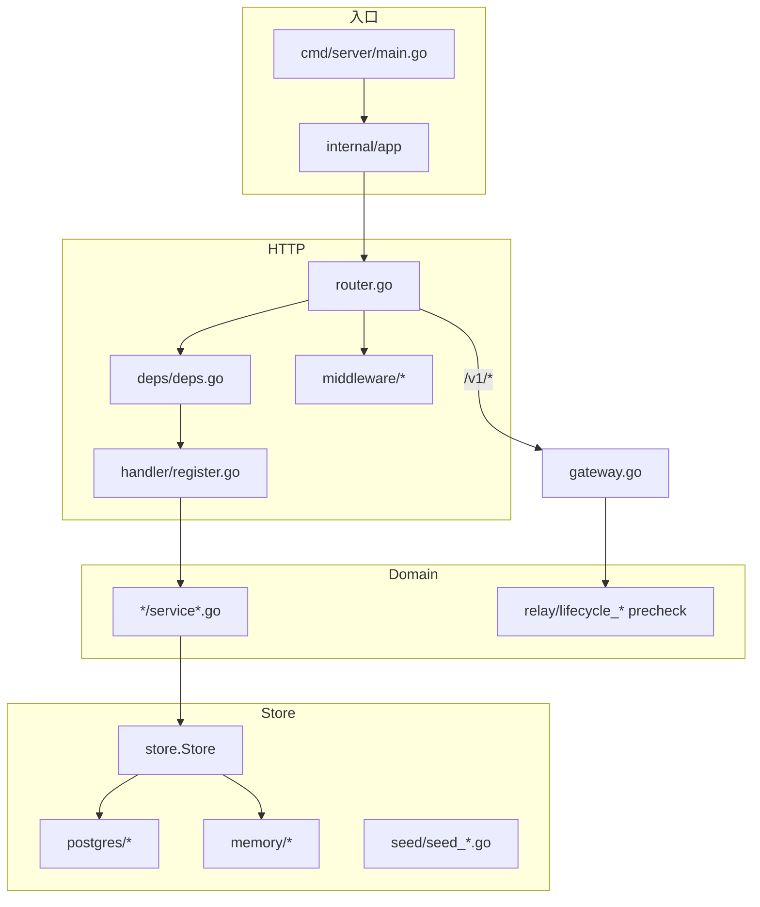

# Backend 结构优化与模块化

本文是 `apps/backend/` 的**活文档**：记录当前结构基线、分层约定与**尚未完成的优化项**。  
数据口径（2026-07）：**358** 个 `.go` 文件（含测试）；`internal/` **~20,000** 行。

**读者：** 后端 / 架构  
**相关：** [Backend-设计.md](./Backend-设计.md) · [Backend-存储架构.md](./Backend-存储架构.md) · [Backend-SaaS多租户改造.md](./Backend-SaaS多租户改造.md)

---

## 1. 结论

结构收口（SaaS 过渡、Deps 统一、relay/worker/store 拆分、Gateway precheck、P1 domain 大文件拆分、scaffold 同步、**P2 store/seed 治理**）**已全部完成**。  
当前无需推倒重来；后续重心在 **memory 双维护成本** 与 **可选 P3 增强**，按下面优先级渐进即可。

| 维度          | 状态                                                                     |
| ------------- | ------------------------------------------------------------------------ |
| 分层          | HTTP → domain → store；组合根 `internal/app/`                            |
| DI            | `ServiceRegistry` + 单一 `http/deps/deps.go`                             |
| domain 单文件 | P1 热点已拆；最大 `budget/service.go`（302 行），未超硬阈值              |
| store 单文件  | P2 已拆；最大 `seed/seed_org.go`（142 行）、`clone_keys.go`（105 行）    |
| 双份维护      | `store/memory/` 21 文件，新表仍须 postgres + memory 同步（见 §4.3 评估） |

---

## 2. 架构基线



**两条鉴权路径：**

| 路径     | 租户解析                                   | status 规则                                         |
| -------- | ------------------------------------------ | --------------------------------------------------- |
| `/v1/*`  | Bearer `sk-` → mapping → `PrecheckService` | 非 active 拒绝（`company.IsRelayBlocked`）          |
| `/api/*` | session + `CompanyResolve`                 | suspended 仅允许 GET/HEAD/OPTIONS（`company_gate`） |

**分层规则：**

| 层           | 允许                        | 禁止                                                             |
| ------------ | --------------------------- | ---------------------------------------------------------------- |
| `handler`    | 解析请求、调 domain         | 直接 `store`（**例外：** `relay/gateway.go` 解析 token→mapping） |
| `domain`     | 业务规则、`store` 接口      | `net/http`、middleware                                           |
| `middleware` | HTTP 横切                   | 持久化                                                           |
| `store`      | SQL / 内存、`ctxcompany.ID` | 业务规则                                                         |

**文件拆分规则（`org` 域标杆）：** 单文件 **>200 行** 或 **≥2 个独立用例** → 按子能力拆文件，对外仍单一 `Service` 门面。

**Context：** `pkg/ctxcompany`（ID 传播）→ `domain/company/context.go`（业务 Context）→ `store/company_id.go`（repo 便利）。

---

## 3. 当前体量热点

`internal/` Top 12（行数）：

| 行数 | 文件                                      | 建议                                           |
| ---- | ----------------------------------------- | ---------------------------------------------- |
| 384  | `integration/datasource/feishu/client.go` | 继续增长再按 API 域拆                          |
| 302  | `domain/budget/service.go`                | 可选：tree / groups / alerts 拆文件（见 §4.4） |
| 264  | `domain/org/member.go`                    | 标杆域，可接受                                 |
| 248  | `domain/org/import.go`                    | 可接受                                         |
| 236  | `pkg/common/routing.go`                   | 可接受                                         |
| 231  | `domain/dashboard/cost.go`                | 可接受                                         |
| 229  | `store/memory/relay_mapping.go`           | 已拆过，观察即可                               |
| 223  | `domain/usage/log_aggregator.go`          | 命名可与 `budget/ingest_*` 对齐                |
| 218  | `domain/org/role.go`                      | 可接受                                         |
| 215  | `domain/models/service.go`                | 可接受                                         |
| 210  | `domain/org/remote_apply.go`              | 可接受                                         |
| 194  | `http/handler/keys/handler.go`            | 可接受                                         |

P2 已消除原热点 `seed/tables.go`（450 行）、`store/clone.go`（364 行）、`store/store.go` 多接口混杂（131 行）。  
domain 侧曾超标文件（`ingest_*`、`platform_key_*`、`company/service_*`、`lifecycle_*`、`gateway.go`）均已 **<250 行**。

---

## 4. 后续可做项

### 4.1 P2-A — `seed/tables.go` 按表拆分 ✅ 已完成

`tables.go` 已拆为同包 `seed_*.go`：`seed_tables.go`（`ApplyTables` + `tableWriter`）、`seed_company.go`、`seed_org.go`、`seed_budget.go`、`seed_models.go`、`seed_keys.go`、`seed_audit.go`。  
`loader.go` 无需改动；`tests/store/seed/` 回归通过。

长期可演进为从 `schema.sql` codegen，属独立长期项。

### 4.2 P2-B — `store/clone.go` 按实体拆分 ✅ 已完成

`clone.go` 已拆为：`clone_org.go`、`clone_budget.go`、`clone_keys.go`、`clone_models.go`、`clone_snapshot.go`（含 `CloneSnapshot` 与公开 `Clone*`）。  
memory store 调用方不变；`tests/store/memory/` 回归通过。

### 4.3 P2-C — `store` 接口与 memory 策略 ✅ 接口拆分已完成

**store 接口按域拆文件（已完成）：** `store.go` 仅保留 `Snapshot` + `Store`（52 行）；repo 接口迁至 `org_repo.go`、`budget_repo.go`、`keys_repo.go`、`models_repo.go`、`audit_repo.go`、`usage_repo.go`、`credential_repo.go`（与既有 `company.go`、`invite.go`、`relay.go` 并列）。postgres/memory 实现文件未改。

**memory store 缩减（评估结论，暂不实施）：**

| 项           | 结论                                                                                                |
| ------------ | --------------------------------------------------------------------------------------------------- |
| 当前规模     | 21 个镜像文件，handler/domain 测试依赖 `memory.New()` + `CloneSnapshot`                             |
| 暂不缩减原因 | 一次性删改震动大；postgres 对 SaaS 新表（company/invite/platform/billing/relay）集成测试覆盖仍不足  |
| 触发条件     | postgres 集成测试补位 SaaS 表读写后，再列「最低 fake 集」并逐步用 selective fake 替代全量镜像       |
| 方向         | 保留 `Snapshot` + 针对 `Store` 的轻量 fake；新表优先 postgres 测试，memory 仅补 domain 单测必需路径 |

### 4.4 P3 — 可选增强（按需）

| 项                                 | 触发条件                            | 做法                                                                                                                                   |
| ---------------------------------- | ----------------------------------- | -------------------------------------------------------------------------------------------------------------------------------------- |
| `budget/service.go` 拆分           | 增至 >350 行或新增大用例            | `service_tree.go`（GetTree/UpdateNode/quotas）、`service_groups.go`、`service_alerts.go`（含 overrun policy）                          |
| `tests/testutil/saas.go`（245 行） | 测试辅助继续膨胀                    | 拆 `saas_company.go`、`saas_platform.go`                                                                                               |
| `SupportSaas` 分叉收敛             | 新功能再踩 flag                     | 6 处引用：`register.go`、`company_resolve`、`provider_key`、`channel_policy`、`config`；domain 内用策略 + DI 替代 `if cfg.SupportSaas` |
| Gateway observability              | 需要统一租户日志                    | 在 access log 统一 `company_id` 字段，不合并鉴权链                                                                                     |
| `wiring_domain.go`                 | wiring 继续膨胀                     | billing `rebalanceEnqueue` 闭包提取到 `infra`                                                                                          |
| `seed` codegen                     | seed 文件再次膨胀或 schema 频繁变更 | 从 `schema.sql` 生成 `insert*` 样板                                                                                                    |

### 4.5 不建议做

| 项                          | 原因                             |
| --------------------------- | -------------------------------- |
| Gateway mapping 下沉 domain | handler 例外已约定，收益小       |
| 合并 relay Get/Find         | 租户内 vs webhook 跨租户语义不同 |
| wire / fx / dig             | 手动 DI 已清晰                   |
| 一次性删除 memory store     | 测试基础设施震动过大             |
| 过度拆子包                  | 文件级拆分足够                   |

---

## 5. 目标包结构（当前）

```
internal/
├── app/                         # wiring_infra → wiring_domain → registry
├── domain/
│   ├── types/
│   ├── company/                 # service_* context gate status wallet
│   ├── keys/                    # platform_key_* provider_key approval
│   ├── budget/                  # service ingest_* rebalance
│   ├── relay/                   # lifecycle_* precheck channel_policy
│   └── org/                     # 拆分标杆
├── http/deps/deps.go            # 单一 HTTP Deps
├── infra/platformauth/ worker/
└── store/
    ├── store.go                 # Snapshot + Store
    ├── org_repo.go budget_repo.go keys_repo.go …
    ├── clone_*.go               # memory 快照克隆
    ├── postgres/ memory/
    └── seed/seed_*.go           # ApplyTables 编排 + 按域 insert*
```

---

## 6. 新功能接入清单

1. `domain/types/` — DTO
2. `store/*_repo.go` — repo 接口（或扩展现有域文件）
3. `store/postgres/` + `store/memory/`（若仍需要）
4. `domain/<name>/service.go`
5. `app/wiring_domain.go` — 构造
6. `app/registry.go` — 注册
7. `http/deps/deps.go` — 加字段（参考 `scaffold/snippets/deps_reference.go.snippet`）
8. `http/handler/<name>/` + `register.go`
9. `infra/permission/keys.go`
10. `tests/domain/` + `tests/handler/`
11. 可选：`make scaffold-domain DOMAIN=foo`

---

## 7. 度量

| 指标                     | 当前                         | 目标                                    |
| ------------------------ | ---------------------------- | --------------------------------------- |
| domain 最大单文件        | 302 行                       | <250（或观察，`budget/service` 可暂缓） |
| store 最大单文件         | 142 行（`seed/seed_org.go`） | <250 ✅                                 |
| P1/P2 拆分文件最大       | 142 行                       | <250 ✅                                 |
| HTTP Deps 拷贝处         | 1                            | 保持                                    |
| domain import `net/http` | 0                            | 保持                                    |
| memory store 文件数      | 21                           | 待 postgres 集成测试补位后再缩减        |
| `gateway.go`             | 115 行                       | <150                                    |

**验证：** `go test ./...` 全绿；`gateway_test`、`tenant_isolation_test`、`platform_test` 覆盖 SaaS 关键路径。

---

## 8. 建议执行顺序（接下来 5 件）

1. **评估并补 postgres 集成测试（SaaS 表）** — 为 memory 缩减与长期单 store 测试打基础
2. **`budget/service.go` 或 `testutil/saas.go` 拆分** — 仅在继续增长时做
3. **`SupportSaas` 分叉收敛** — 新功能触及时用策略 + DI 替代 flag 分支
4. **`seed` codegen 长期项** — schema 稳定或 seed 再膨胀时考虑
5. **Gateway observability / `wiring_domain` 提取** — 按需
