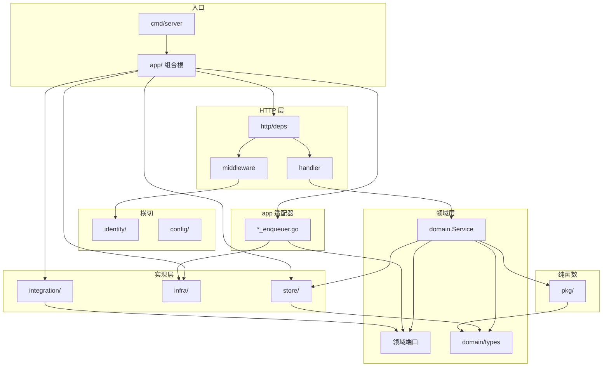

# Backend 结构优化

> **目的：** 记录 `apps/backend/` **当前结构基线**与**剩余分层债务**（非上线阻塞）。  
> **相关：** [Backend.md](./Backend.md) · [Backend-架构.md](./Backend-架构.md)（分层 SSOT、文件命名 §3.1）· [Backend-计费模式.md](./Backend-计费模式.md)（lot SSOT）· [Backend-测试优化.md](./Backend-测试优化.md)（Gateway rejection_cases）· [工程收口.md](./工程收口.md)（上线 P0 优先于本文 P2）  
> **维护：** 结构变化先更新本文，再同步 [Backend-架构.md §3](./Backend-架构.md#3-项目结构) 目标态摘要。

**读者速览：** Phase 1（2026-07-12）已落地：Gateway `rejection_cases` SSOT、`WalletService` 经最小 `QuotaReader` 接收 `adminport.Port`、`httpdeps.Deps` 无 `Store`、`usage/scope` 经 `pkg/authzscope`（零 `identity/authz` import）。domain 零 `infra/*` import；Job 类端口五域 `ports.go` + `app/*_enqueuer.go`；`billing/lot` 写 SSOT。端口定义位置见 §1.3。下文 §1 为现状；§2 为剩余债务；§3 为 PR 自检。

---

## 1. 当前架构

### 1.1 分层

```text
HTTP（handler / middleware）
  ↓
Domain（Service）
  ├→ Store
  └→ Port → Infra / Integration（经 app/ 注入）
```

**请求链：**

```text
Client → middleware（identity 鉴权、租户解析）
       → handler（编解码、调 domain.Service）
       → domain.Service（业务规则 + 端口调用）
       → store / 端口实现
```

**不变量：**

- 业务 Handler **优先**调 `domain.Service`，不直访 Store（health / metrics / readiness 等基础设施 handler 除外）
- Handler **零业务规则**；**多 Service 串联的新业务流程**在 `app/` 编排
- domain 间通过**对方 Service 接口**协作可接受，避免循环依赖
- DTO SSOT：`domain/types/`
- domain **禁止** import **具体** integration 实现（`integration/newapi` client、`integration/datasource/feishu` 等）；NewAPI 经 `adminport.Port`（含 `GetUserQuota`），数据源经 `integration/datasource.Provider`（接口包，与 `domain/adminport` 并列，位置待收敛 §2.9）
- **`WalletService`** 依赖最小 `company.QuotaReader`；`adminport.Port` 满足该接口，`wiring_infra.go` 注入 `adminPort`，不传 raw `AdminClient`
- **`httpdeps.Deps`** 不携带 `store.Store`；worker 经 `ServiceRegistry.Infra.store`
- **dashboard scope** 权限判断经 `pkg/authzscope`；`domain/usage/scope.go` 不 import `identity/authz`
- **Job 类端口**：接口在各域 `ports.go`，适配器在 `app/*_enqueuer.go`；**其它端口**定义位置见 §1.3
- middleware 读 authz 修订经 `identity/authz.RevisionReader`，不经 `Store.Company()`
- 多租户：`company_id` 经 `pkg/ctxcompany` / `domain/company.Context`；store 查询带 tenant 条件
- 业务测在 `tests/`（不在 `internal/`）

**硬约束（CI / 本地可验）：**

```bash
# domain 不得 import infra
rg 'internal/infra/' apps/backend/internal/domain/

# domain 不得 import 具体 integration 实现（Provider 接口包 integration/datasource 允许）
rg 'integration/newapi|integration/datasource/feishu' apps/backend/internal/domain/

# 业务 handler 不得直访 Store
rg '\.Store\b' apps/backend/internal/http/handler/
```

<details>
<summary>分层图（展开）</summary>



</details>

### 1.2 目录职责

```text
apps/backend/
├── cmd/server, testdbclean/
├── internal/
│   ├── app/           # 组合根：wire_* + *_enqueuer 端口适配 + testhook
│   ├── config/
│   ├── identity/      # session、credentials、authz（含 RevisionReader）
│   ├── domain/        # 14 业务域 + types/ + errors.go
│   │   └── billing/
│   │       └── lot/   # lot 写 SSOT（consume / ledger）
│   ├── http/
│   │   ├── deps/      # Handler 依赖注入
│   │   ├── handler/   # 14 子目录（含 health/shared 等基础设施包）+ register
│   │   ├── middleware/
│   │   ├── httputil/, response/
│   ├── infra/         # jobs, river, ingest, notification, budgetcheck, permission
│   ├── integration/   # newapi adapter, datasource/feishu
│   ├── pkg/           # 纯函数：budget, org, ctxcompany, clock, companyids, …
│   └── store/         # 接口 + postgres/（仅 import domain/types）
│       └── postgres/  # usage_aggregate.go；大 Repo 按 *_repo_<主题>.go 拆分
├── seed/
└── tests/             # 镜像 internal/ 结构
    └── testutil/
        └── budget/    # budgetfix 包（snapshot / ptr / seed 等）
```

文件命名与域内拆分原则见 [Backend-架构.md §3.1](./Backend-架构.md#31-文件命名与拆分)。

**Store 拆分（现状）：**

| 域 | 文件 |
| --- | --- |
| billing | `billing_repo_wallet.go`、`billing_repo_lots.go`、`billing_repo_orders.go` |
| ledger | `ledger_repo_write.go`、`ledger_repo_projector.go`（门面 `ledger_repo.go`） |
| models | `models_repo_crud.go`、`models_repo_capabilities.go` |
| budget / org / keys | 各 `*_repo_*.go` 多文件 |

**org structure 拆分（现状）：** `domain/org/structure/` — `member_list.go`、`member_mutate.go`、`member_batch.go`、`member_helpers.go`、`role_crud.go`、`role_members.go` 等。

### 1.3 领域端口

domain **禁止** import `infra/*`；异步、外部系统与横切能力经端口访问。**Job 类端口**走 `ports.go` + `app/*_enqueuer.go`；**其它端口**定义位置不统一（现状，见下表「定义位置」列），**实现在 `infra/` / `integration/`，经 `app/wire_*.go` 注入**。

**端口定义位置（现状）：**

| 模式 | 定义 | 注入 | 说明 |
| --- | --- | --- | --- |
| Job enqueuer（6 域） | 各域 `ports.go` | `app/*_enqueuer.go` | billing / budget / usage / dashboard / newapisync / org-remote |
| NewAPI Admin | `domain/adminport/` | `wiring_infra.go` | 推荐新外部 Admin 能力放此 |
| 数据源 | `integration/datasource/` | `wire_domain_services.go` | Provider 接口；feishu 等在 `integration/datasource/feishu` |
| 鉴权修订 | `identity/authz/revision.go` | `authz.Service` | middleware 读 revision |
| 缓存 / 通知 | `domain/types/notifier.go` 等 | `wiring_infra.go` | 如 `GatewaySoftCache`、`types.Notifier` |

| 端口 | 定义 | 适配器 | 说明 |
| --- | --- | --- | --- |
| `billing.JobEnqueuer` | `domain/billing/ports.go` | `app/billing_enqueuer.go` | wallet_sync / 充值后 rebalance |
| `budget.JobEnqueuer` | `domain/budget/ports.go` | `app/budget_enqueuer.go` | 预算投影 / overrun / rebalance |
| `types.Notifier` | `domain/types/notifier.go` | `app` 注入 `infra/notification` | org 阈值 / budget overrun 通知 |
| `remote.JobEnqueuer` | `domain/org/remote/ports.go` | `app/org_enqueuer.go` | org sync job |
| `usage.IngestJobEnqueuer` | `domain/usage/ports.go` | `app/usage_enqueuer.go` | 入账后 enqueue；**须透传 `store.Tx`** |
| `dashboard.JobEnqueuer` | `domain/dashboard/ports.go` | `app/dashboard_enqueuer.go` | 看板投影 / reconcile |
| `newapisync.SyncJobEnqueuer` | `domain/newapisync/ports.go` | `app/newapisync_enqueuer.go` | PlatformKey 生命周期 |
| `authz.RevisionReader` | `identity/authz/revision.go` | `authz.Service` | middleware 读 authz 修订号 |
| `GatewaySoftCache` | `domain/budget/gateway_soft_cache.go` | `budgetcheck.WrapStore`（`wire_gateway.go` / `wire_river.go`） | Gateway 软摘要；**非** enqueuer 模式 |

**横切 / 集成端口：**

| 端口 | 消费方 | 实现 |
| --- | --- | --- |
| `adminport.Port` | newapisync, keys, billing, company（部分） | `integration/newapi/admin_port_adapter` |
| `grants.Normalizer` | org, keys | `infra/permission` |
| `datasource.Provider` | org/remote | `integration/datasource/feishu` 等 |

**注入 SSOT：**

| 文件 | 职责 |
| --- | --- |
| `app/wire_domain_services.go` | domain 构造 + enqueuer 注入 |
| `app/wire_river.go` | River worker / dashboard projector |
| `app/wiring_infra.go` | newapisync、admin port、wallet 等 |
| `app/registry.go` | `httpdeps.Deps`；`AuthzSvc` 兼 `RevisionReader` |

**规则：**

- Job adapter **必须**在 `app/`，不可放 `infra/jobs`（避免 `jobs → domain → jobs` 循环）
- `usage.IngestJobEnqueuer.EnqueueAfterIngest(ctx, tx, companyID)` **必须透传 `store.Tx`**
- org 通知：domain 构造 `types.Notification`，经 `core.Notifier.Send`；不 import `infra/notification`

### 1.4 钱包与 lot 边界

**Lot 写 SSOT 在 `domain/billing/lot/`**（FIFO 消费、`wallet_remain` 维护）。`domain/wallet/` 已删除；计费语义见 [Backend-计费模式.md](./Backend-计费模式.md)。

| 名称 | 含义 | 路径 |
| --- | --- | --- |
| **Lot 写 SSOT** | FIFO 消费、`wallet_remain` | `domain/billing/lot/` |
| **Billing 域** | 充值、确认、展示、`GetWallet`、wallet_sync | `domain/billing/` |
| **产品「钱包」** | 前端 `/wallet`、API `WalletView` | billing 读模型 |
| **`company.WalletService`** | NewAPI `GetUserQuota` 派生读 + 缓存 | `domain/company/`；依赖 `QuotaReader`，由 `adminport.Port` 满足；**不是** lot SSOT |

**Usage 聚合：** `store/postgres/usage_aggregate.go`，经 `UsageRepository` 暴露；`store/usagequery/` 已删除。

---

## 2. 剩余债务

上线 P0 见 [工程收口.md](./工程收口.md)。Phase 1 高/中优先级债务已完成；下列低优先级项互不阻塞，可独立 PR。

### 优先级一览

| 序 | 级别 | 类型 | 项 | 状态 |
| ---: | --- | --- | --- | --- |
| — | — | — | ~~2.1 Gateway rejection_cases~~ | ✅ Phase 1 |
| — | — | — | ~~2.2 WalletService → adminport~~ | ✅ Phase 1 |
| — | — | — | ~~2.3 Deps 移除 Store~~ | ✅ Phase 1 |
| — | — | — | ~~2.4 usage scope 与 authz 解耦~~ | ✅ Phase 1 |
| 1 | **低** | 文档 | [2.5 文档 stale 路径](#25-文档-stale-路径) | ✅ 2026-07-12 |
| 2 | **低** | 测试 | [2.6 internal 单测外迁](#26-internal-单测外迁) | ✅ 2026-07-12 |
| 3 | **低** | 可读性 | [2.7 大文件机械拆分](#27-大文件机械拆分) | 待做 |
| 4 | **低** | 性能 | [2.8 schema clone 性能](#28-schema-clone-性能) | 待做 |
| 5 | **低** | 分层 | [2.9 端口定义位置收敛](#29-端口定义位置收敛) | 待做 |

<details>
<summary>Phase 1 已完成项（归档）</summary>

### ~~2.1 Gateway rejection_cases SSOT~~ ✅

- `tests/testutil/gateway/rejection_cases.go` — evaluate / precheck / handler 共享 case 数据
- handler `TestGatewayRejectionHTTPMapping` — G2/G3 期望 403
- `inactive_key` precheck 仍独立 Test（post-seed 污染 store）

### ~~2.2 WalletService → adminport~~ ✅

- `adminport.Port.GetUserQuota`；`NewWalletService` 依赖最小 `company.QuotaReader`
- `wiring_infra.go` 不再向 wallet 传 raw `AdminClient`

### ~~2.3 Deps 移除 Store~~ ✅

- `httpdeps.Deps` 无 `Store`；`IngestWorker` 经 `ServiceRegistry.Infra.store`

### ~~2.4 usage scope 与 authz 解耦~~ ✅

- `pkg/authzscope.HasAny`；`usage/scope.go` 零 `identity/authz` import

</details>

---

### 2.5 文档 stale 路径 ✅

**问题：** 部分 doc 仍引用已删除路径，与 §1 基线矛盾。

**已知命中（2026-07-12，已修）：**

| 文件 | 原内容 | 状态 |
| --- | --- | --- |
| `docs/架构终态设计.md:15` | `domain/wallet` 写 SSOT | ✅ 已改为 `domain/billing/lot/` |
| `docs/Backend-业务时钟与账期.md:251` | `infra/worker/runner.go` | ✅ 已改为 `infra/river/` |
| 多份 Backend* / README / plan | `实现-异步预算投影.md`（已删） | ✅ 已改链至 `Backend-离线任务.md` + `Backend-预算.md` |
| `docs/reviews/2026-07-07-backend-安全评估.md` | `postgres/usagequery` | ✅ 已改为 `usage_aggregate.go` |

**验收：**

```bash
rg '实现-异步预算投影' docs/
# 应为 0

rg 'domain/wallet|store/usagequery|infra/worker/runner' docs/
# 仅允许 Backend-结构优化.md 等「已删除」说明性引用
```

---

### 2.6 internal 单测外迁 ✅

**问题：** 约定业务测在 `tests/`；`internal/` 仍留 3 个单测文件。

| 原路径 | 目标（已迁移） |
| --- | --- |
| `internal/identity/sessiontoken/issuer_test.go` | `tests/identity/sessiontoken/issuer_test.go` |
| `internal/infra/permission/manifest_test.go` | `tests/infra/permission/manifest_test.go` |
| `internal/infra/permission/grants_test.go` | `tests/infra/permission/grants_test.go` |

**验收：** `internal/` 无普通 `*_test.go`（`//go:build testhook` 嵌入测除外）；`make test-unit` 全绿。

---

### 2.7 大文件机械拆分

**零行为变更**，仅按职责切文件。

| 文件 | 行数 | 拆法 |
| --- | ---: | --- |
| `integration/datasource/feishu/client.go` | ~391 | `auth.go`、`departments.go`、`members.go`；`Provider` 接口不变 |
| `infra/jobs/args.go` | ~253 | 按 kind 拆 `args_wallet_sync.go`、`args_rebalance.go` 等；`Insert*` 仍集中在 `enqueue.go` |

**验收：** `make test-unit` 全绿；org remote 导入行为不变。

---

### 2.8 schema clone 性能

**问题：** 全量 `make test-unit` 瓶颈在 per-schema PG clone（Test 数量与墙钟基准见 [Backend-测试优化.md](./Backend-测试优化.md)，不在本文维护精确值）。

**范围：** `tests/testutil/pg/clone.go` — 减少全表 COPY、复用 clone plan。

**验收：** 墙钟下降（对比测试优化文档基线）；无测试语义变更。与结构分层无关，可独立 PR。

---

### 2.9 端口定义位置收敛

**问题：** 端口接口分散在 `domain/*/ports.go`、`domain/adminport/`、`integration/datasource/`、`identity/authz/`、域内具名文件（如 `gateway_soft_cache.go`），与 [Backend-架构.md §3.1](./Backend-架构.md#31-文件命名与拆分)「领域端口 → `ports.go`」目标态不完全一致。现状可运行，但新人易误判「所有端口都该进 `ports.go`」。

**目标（非阻塞）：** 新外部系统端口优先 `domain/<域>/ports.go` 或 `domain/adminport/`；`integration/datasource` 是否迁入 `domain/` 待 org 域重构时一并评估。Job enqueuer 与 Notifier 模式保持不变。

**验收：** 文档与 §1.3「定义位置」表同步；无强制大规模搬家。

---

**并行关系：**

```text
2.5 doc 清扫            ── 独立
2.6 / 2.7 / 2.8 / 2.9   ── 互不依赖
```

---

## 3. PR 自检

**结构基线（默认应满足）：**

- [ ] 新异步入队：域内 `ports.go` + `app/*_enqueuer.go`，**禁止** domain import `infra/jobs`
- [ ] lot 写路径只经 `domain/billing/lot/`
- [ ] usage 聚合只经 `UsageRepository` / `usage_aggregate.go`，不新建 `store/*query` 子包
- [ ] middleware 读 authz 修订经 `RevisionReader`，不经 `Store.Company()`

**通用：**

- [ ] domain 是否新增了 `infra/*` / `integration/newapi` / `integration/datasource/feishu` / `http/*` import？→ 改端口（`integration/datasource` Provider 接口包除外）
- [ ] store 是否新增了 `domain/*`（非 `types`）import？
- [ ] 业务 handler 是否绕过 domain 直调 store？
- [ ] 是否新增**跨域编排**？→ 优先 `app/`；单点调对方 Service 可接受
- [ ] lot / 钱包写逻辑是否只进 `domain/billing/lot/`？
- [ ] 大文件拆分是否 behavior-preserving（仅移动）？
- [ ] 合并后：`rg 'internal/infra/' apps/backend/internal/domain/`、`rg 'integration/newapi|integration/datasource/feishu' apps/backend/internal/domain/`、`make test-unit`

---

*§1 随代码基线更新；§2 随债务收口删减。*
