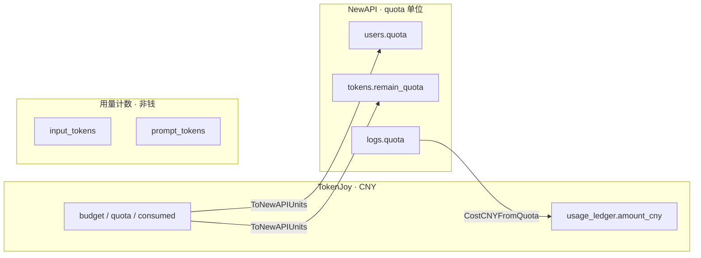
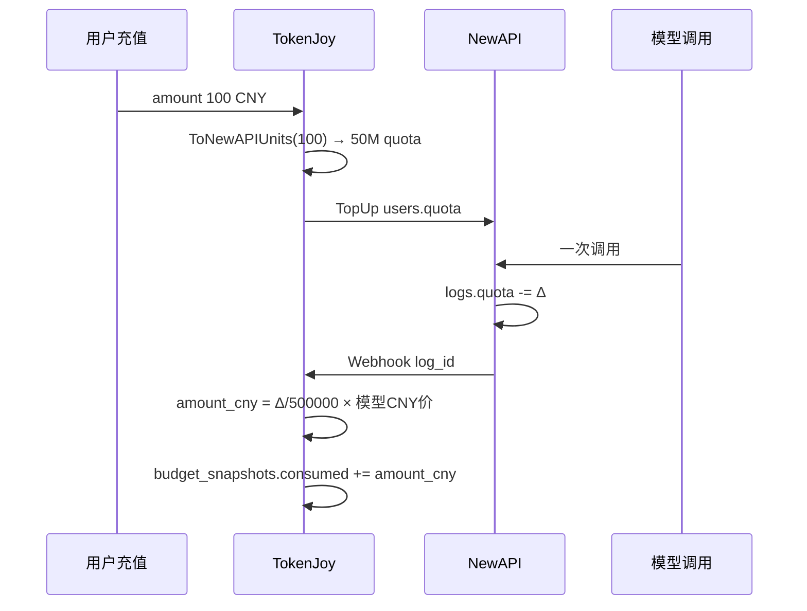

# Backend 计费单位

TokenJoy 产品面统一 **人民币（CNY / RMB）**；NewAPI 侧使用 **`quota` 内部额度单位**（原生语义接近美元计价）。二者通过模型单价和固定比例 `QuotaPerUnit` 换算，**不是 token 个数**。

**相关：** [Backend-存储架构.md](./Backend-存储架构.md) §8（limit / consumed 术语）· [Backend-预算.md](./Backend-预算.md) §5（Rebalance 换算）

---

## 1. 三种计量，不要混

| 类型 | 是什么 | 用在哪 | 单位 |
| --- | --- | --- | --- |
| **金额（CNY）** | 预算、消耗、充值、看板费用 | Postgres 主库、控制台 API | 元（`NUMERIC`，字段常带 `cny` / `budget` / `amount`） |
| **NewAPI quota** | Relay 钱包与 Token 的内部额度整数 | NewAPI `users.quota`、`tokens.remain_quota`、`logs.quota` | 无货币符号的 **`int64` 单位** |
| **LLM token 数** | 模型用量统计 | `usage_ledger.input_tokens`、`usage_buckets`、`newapi.logs.prompt_tokens` | 个（prompt / completion） |



**结论：**

- 问「花了多少钱」→ 只看 **CNY** 字段。
- 问「NewAPI 还剩多少额度」→ 看 **`quota` / `remain_quota` 整数**，不要当成元，也不要当成 token 数。
- 问「用了多少 token」→ 看 **`input_tokens` / `output_tokens`**，与预算扣费无直接 1:1 关系（扣费按模型单价换算）。

---

## 2. TokenJoy 侧：全是 CNY

以下字段在产品和 Postgres 中语义均为 **人民币元**：

| 字段 | 表 / API | 角色 |
| --- | --- | --- |
| `budget` | `org_nodes`, `budget_groups` | limit（分配上限） |
| `personal_quota` | `members` | limit（成员） |
| `quota` | `platform_keys` | limit（Key 分配额） |
| `consumed` | `budget_snapshots` | 已消耗 |
| `used` | `PlatformKey` JSON | 已消耗（= consumed） |
| `amount_cny` | `usage_ledger` | 单笔调用结算金额 |
| `cost_cny` | `usage_buckets`、看板 | 聚合费用 |
| `amount` | `company_recharge_orders` | 充值金额 |
| `balance` / `currency` | 钱包 API | `currency` 固定 `'CNY'` |

模型目录单价：

| 字段 | 含义 |
| --- | --- |
| `models.input_price` | 每单位用量对应的 CNY 价（与 `QuotaPerUnit` 配合） |
| `models.output_price` | 同上 |

`input_price + output_price` 作为该模型在换算时的 **CNY 单价**（见 `ModelPriceCNY`）。

---

## 3. NewAPI 侧：quota 单位（非 CNY、非 token）

NewAPI 全站用 **`quota` 整数** 表示额度，常见约定（上游 One API / New API）：

> **`500_000` quota ≈ 1 美元** 的等价消耗能力（随通道计费在 NewAPI 内部扣减）。

TokenJoy **不把 USD 存库、不在 API 暴露美元**；只在边界用同一套整数刻度，按 **TokenJoy 配置的 CNY 模型价** 解释：

| NewAPI 字段 | 类型 | TokenJoy 怎么用 |
| --- | --- | --- |
| `users.quota` | 企业钱包剩余 quota | 预检时 `FromNewAPIUnits` → CNY 粗算；充值 `TopUp` 写入 |
| `tokens.remain_quota` / `used_quota` | Token 剩余 / 已用 quota | Rebalance `UpdateToken`；Gateway 预检 |
| `logs.quota` | 单次 consume 扣掉的 quota | Ingest → `CostCNYFromLog` → `amount_cny` |
| `relay_mappings.newapi_token_remain_quota` | 缓存的 Token remain | 展示 / rebalance 辅助，权威仍在 NewAPI |

---

## 4. 换算公式（代码真源）

常量：`QuotaPerUnit = 500_000`（`internal/pkg/common/constants.go`）

### 4.1 NewAPI quota → CNY（入账）

单次调用，用 **当次模型** 的 CNY 单价：

```text
amount_cny = logs.quota / QuotaPerUnit × ModelPriceCNY(实际模型)
```

实现：`CostCNYFromQuota` → `usage.BuildCallSettledEntry` → 写入 `usage_ledger.amount_cny`。

示例：`quota = 500_000`，`ModelPriceCNY = 2` → **`amount_cny = 2` 元**。

### 4.2 CNY → NewAPI quota（充值 / Rebalance）

写入 Token 或钱包时，用 **白名单内最贵模型** 的 CNY 单价（保守估计能调用的次数）：

```text
remain_quota = cny_remaining / HighestModelPriceCNY × QuotaPerUnit
```

实现：`ToNewAPIUnits` ← `ComputeRemainQuotaCNY` / `TopUp`。

充值特例：`TopUp(order.Amount)` 时无模型列表，单价回退 **`DefaultModelPriceCNY = 1`**，即 **1 元 → 500_000 quota**。

### 4.3 CNY ← NewAPI quota（读钱包）

```text
cny ≈ quota / QuotaPerUnit × HighestModelPriceCNY
```

实现：`FromNewAPIUnits`（预检读企业钱包等）。

---

## 5. 字段对照总表

| 你看到 | 钱 or quota or token | 币种/单位 | 说明 |
| --- | --- | --- | --- |
| `org_nodes.budget` | **钱** | CNY | limit |
| `budget_snapshots.consumed` | **钱** | CNY | 已消耗 SSOT |
| `platform_keys.quota` / `used` | **钱** | CNY | limit / consumed |
| `usage_ledger.amount_cny` | **钱** | CNY | 单笔事实 |
| `usage_buckets.cost_cny` | **钱** | CNY | 看板聚合 |
| `company_recharge_orders.amount` | **钱** | CNY | 充值 |
| `users.quota` | **quota** | NewAPI 单位 | 企业钱包；原生 ≈ USD 刻度 |
| `tokens.remain_quota` | **quota** | NewAPI 单位 | Token 剩余额度 |
| `logs.quota` | **quota** | NewAPI 单位 | 单次扣减；入账时换成 CNY |
| `input_tokens` / `output_tokens` | **token 数** | 个 | 仅用量统计 |
| `logs.prompt_tokens` / `completion_tokens` | **token 数** | 个 | NewAPI 原始用量 |

---

## 6. CNY 与 NewAPI「美元刻度」的关系

| 项 | 说明 |
| --- | --- |
| TokenJoy 产品账 | **全程 CNY**，前端 `currency: 'CNY'` |
| NewAPI 内部 | **quota 整数**，生态默认 `500_000` 对应 **$1** 量级 |
| 二者桥梁 | **无独立汇率表**；用 `models.*_price`（CNY）+ `QuotaPerUnit` 线性换算 |
| 隐含假设 | TokenJoy 配置的 CNY 单价与 NewAPI 按 quota 扣减 **大致校准**；模型价调价会影响 CNY ↔ quota 双向换算 |
| 风险 | 若 NewAPI 通道按美元扣 quota，而 `models` 价是 CNY 标价且未与通道对齐，会出现 **钱包 quota 与组织 consumed(CNY) 漂移**；靠 Rebalance 与模型价维护对齐 |

---

## 7. 数据流简图



---

## 8. 读代码 / 对接时常问

| 问题 | 答案 |
| --- | --- |
| `quota` 是 token 数吗？ | **不是**。是 NewAPI 内部额度单位。 |
| 控制台预算 5000 是什么？ | **5000 CNY**（`personal_quota` / `budget` 等）。 |
| `logs.quota = 500000` 花了多少？ | 取决于模型：`500000/500000 × 该模型 CNY 单价`。 |
| 看板 `costCny` 从哪来？ | `usage_buckets` / `usage_ledger`，已是 CNY，勿再换算。 |
| 为何要有 `QuotaPerUnit`？ | 对齐 NewAPI 整数刻度，避免浮点；与上游 `500000` 惯例一致。 |
| Token 预检看哪个？ | 组织轴看 **CNY** `consumed` vs `budget`；Relay 轴还看 **quota** `remain_quota`。 |
