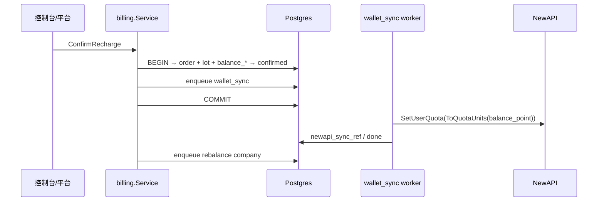
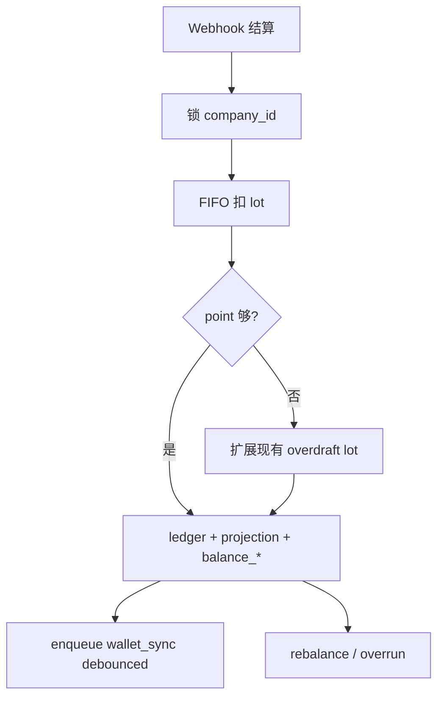

# Backend 计费单位 — point + lot 新账本

**一句话：** 内部统一 **point**；钱包展示币以 **`company_recharge_lots`（lot）成本价** 为 SSOT；NewAPI `users.quota` 仅为 **派生通道配额**（可重建、非资金真相）。**破坏性更新**：改 `schema.sql` 后 wipe 重建 + seed，无增量脚本、无历史数据兼容。

**相关：** [Backend-预算.md](./Backend-预算.md) · [Backend-存储架构.md](./Backend-存储架构.md) · [Backend.md](./Backend.md) · [Frontend.md](./Frontend.md)

---

## 0. 破坏性约束与设计目标

1. **无 migration**：不维护 `ALTER`/回填/双写；表结构以本文 DDL 为准，部署 `down -v` + seed。
2. **权威切换**：废除「企业钱包 = NewAPI `users.quota`」。Postgres lot + ledger 为资金与消耗真相；NewAPI 只承担通道扣费与 Token `remain_quota` 分配视图。
3. **破坏性字段/契约**：
   - 禁止金额字段带币种后缀（`amount_cny` / `cost_cny` 等全部删除）。
   - 组织 limit / consumed / Gateway 比较：**point**。
   - 钱包 API：**展示币**（lot 成本价闭合）；预算 API：**展示币管理近似**（当前 PPU，见 §6.2）。
4. **双指标**（不可混读）：

| 指标 | 用途 | 闭合 |
| --- | --- | --- |
| `balancePoint` | Gateway、预算、NewAPI 同步 | point 守恒 |
| `balance`（展示币） | 钱包页、财务对账 | paid+adjust lot 成本价闭合 |

5. **生产约束**：`RELAY_GATEWAY_ENABLED=true` 为调用主路径；禁止旁路直连 NewAPI 消费（否则 overdraft 激增）。

术语：**lot** = 充值批次；每笔 lot 必有 companion **`company_recharge_orders`** 行（含系统单）。

---

## 1. 权威矩阵（SSOT）

| 能力 | SSOT | 派生 / 缓存 |
| --- | --- | --- |
| 企业可用 point | `Σ lot.points_remaining` / `companies.balance_point` | — |
| 展示币钱包闭合 | `company_recharge_lots`（`lot_kind ∈ {paid,adjust}`） | — |
| 单笔消耗 | `usage_ledger`（point + 锁定 `display_amount`） | — |
| 组织 consumed | `budget_snapshots.consumed`（point） | — |
| 看板 | `usage_buckets.cost`（point） | 展示币按需聚合 ledger |
| Token 分配 | NewAPI `remain_quota` | rebalance 按 `balance_point` 封顶 |
| Gateway 挡单 | Postgres `balance_point` + 组织预算（point） | NewAPI wallet / token 双检（§4.2） |
| NewAPI 企业 wallet | — | `wallet_sync` 从 Postgres 派生；漂移以 Postgres 覆盖 |

不变量：

- 禁止用 NewAPI quota 反算对外钱包余额。
- NewAPI 与 Postgres 漂移：**以 Postgres 为准**校准（§4.5）。

---

## 2. 三个世界

### 2.1 Usage / Point / Wallet

- **Usage**：token / 次数；审计，不计价。
- **Point**：`CostFromQuota` 统一计量；预算、Gateway、投影均在此世界。
- **Wallet（lot）**：充值 / 赠送 / 调账 / overdraft 均落 lot；`amount_display` + `unit_price_display` 为展示币 SSOT。

映射：Usage → Point →（FIFO 扣 lot）→ `display_amount = points × unit_price_display`。

### 2.2 展示币闭合（paid + adjust 口径）

仅 **`lot_kind IN ('paid','adjust')` 且 `amount_display > 0`** 参与钱包展示闭合：

```text
unit_price_display = amount_display / points_granted          -- 创建时锁定

totalTopup(c)     = Σ amount_display
                    WHERE billing_currency = c AND lot_kind IN ('paid','adjust')

balance(c)        = Σ (points_remaining × unit_price_display)
                    WHERE billing_currency = c AND lot_kind IN ('paid','adjust')

totalConsumed(c)  = totalTopup(c) − balance(c)
```

恒等式（钱包 API 保证）：

```text
totalTopup(c) − totalConsumed(c) = balance(c)
```

**不参与上述闭合的 lot：**

| `lot_kind` | point 可花 | 展示币 |
| --- | --- | --- |
| `gift` | ✅ | 不计入 totalTopup；消耗 display=0 |
| `overdraft` | ✅（兜底） | 不计入 totalTopup；消耗 display=0；见 `overdraftPoints` |

`gift` / `overdraft` 仍参与 **point 守恒** 与 FIFO，但不扭曲「充值 − 消耗 = 余额」的财务口径。

### 2.3 Point 守恒（全 lot）

```text
Σ lot.points_granted − Σ ledger.amount = Σ lot.points_remaining
```

含 `gift` / `overdraft` / 跨币种 lot；`balance_point = Σ points_remaining`。

### 2.4 配置变更

- `billing_currency` / `points_per_unit` 变更**不回写**历史 lot / limit。
- 多币种：按 `billing_currency` 分组展示 `balances[]`。
- **无市场 FX**：跨币种仅 `points_granted = amount_pay × PPU(pay)`，`amount_display = points_granted / PPU(billing)`。

---

## 3. `source` × `lot_kind` 矩阵

| 场景 | `source` | `lot_kind` | 订单 `amount` | 展示币 |
| --- | --- | --- | --- | --- |
| 企业自助充值 | `self` | `paid` | 实付 | 公式计算 |
| 平台代充 | `platform` | `paid` | 实付 | 公式计算 |
| 平台赠送 | `platform` | `gift` | `0` | `0` |
| 运维补点（有价） | `adjust` | `adjust` | 单据 | 显式写入 |
| 运维补点（无价） | `adjust` | `adjust` | `0` | `0` |
| ingest 透支兜底 | `system` | `overdraft` | `0` | `0` |

> **首版实现范围：** 已落地 `paid`（自助/平台充值）与 ingest `overdraft`；`gift` / `adjust` 平台 API 见 §9。

规则：

1. **每笔 lot 必有 1:1 `company_recharge_orders`**（`recharge_order_id UNIQUE`）。
2. **overdraft**：每企业**至多一个 active overdraft lot**；不足时 `UPDATE points_granted/remaining += gap`，不每次新建 lot（减少碎片）。首建时 `source=system`，`idempotency_key=overdraft:{company_id}`。
3. `source` = 业务入口；`lot_kind` = 记账与汇总规则（不可混用）。

---

## 4. 数据模型

### 4.1 `currencies`

```sql
CREATE TABLE currencies (
    currency         CHAR(3) PRIMARY KEY,
    points_per_unit  BIGINT NOT NULL CHECK (points_per_unit > 0),
    enabled          BOOLEAN NOT NULL DEFAULT TRUE,
    created_at       TIMESTAMPTZ NOT NULL DEFAULT NOW(),
    updated_at       TIMESTAMPTZ NOT NULL DEFAULT NOW()
);
```

Seed：默认 `CNY`；`points_per_unit` 来自平台配置。

### 4.2 `companies`

```sql
-- schema.sql 终态列（非 ALTER 补丁）
    billing_currency     CHAR(3) NOT NULL REFERENCES currencies (currency),
    fifo_head_lot_id     TEXT,
    balance_point        NUMERIC(28, 10) NOT NULL DEFAULT 0,
```

- 禁止单列 `balance_display`。
- `balance_point`：全 lot 剩余 point 之和；Gateway O(1)。
- 展示币闭合由 `company_recharge_lots` 聚合（`AggregateWallet`），不冗余 JSON 列。

### 4.3 `company_recharge_orders`

状态：`pending` → `confirmed` | `failed`。`confirmed` 在 lot 落库后即成立，**不等待** NewAPI。

```sql
CREATE TABLE company_recharge_orders (
    id               TEXT PRIMARY KEY,
    company_id       BIGINT NOT NULL REFERENCES companies (id) ON DELETE CASCADE,
    amount           NUMERIC(18, 6) NOT NULL DEFAULT 0,
    currency         CHAR(3) NOT NULL,
    points_per_unit  BIGINT NOT NULL,
    points_granted   NUMERIC(28, 10) NOT NULL,
    source           TEXT NOT NULL,
    lot_kind         TEXT NOT NULL,
    idempotency_key  TEXT,
    newapi_sync_ref  TEXT,
    status           TEXT NOT NULL DEFAULT 'pending',
    display_order_id TEXT NOT NULL DEFAULT '',
    payment_method   TEXT NOT NULL DEFAULT '',
    invoice_status   TEXT NOT NULL DEFAULT 'none',
    created_by       TEXT NOT NULL,
    created_at       TIMESTAMPTZ NOT NULL DEFAULT NOW(),
    updated_at       TIMESTAMPTZ NOT NULL DEFAULT NOW(),
    CHECK (lot_kind IN ('paid','gift','adjust','overdraft')),
    CHECK (points_granted > 0),
    CHECK (
        (lot_kind = 'paid' AND amount > 0)
        OR (lot_kind IN ('gift','overdraft') AND amount = 0)
        OR (lot_kind = 'adjust')
    )
);
```

### 4.4 `company_recharge_lots`

```sql
CREATE TABLE company_recharge_lots (
    id                 TEXT PRIMARY KEY,
    company_id         BIGINT NOT NULL REFERENCES companies (id) ON DELETE CASCADE,
    recharge_order_id  TEXT NOT NULL UNIQUE REFERENCES company_recharge_orders (id),
    billing_currency   CHAR(3) NOT NULL,
    lot_kind           TEXT NOT NULL,
    amount_display     NUMERIC(18, 6) NOT NULL,
    points_granted     NUMERIC(28, 10) NOT NULL,
    points_remaining   NUMERIC(28, 10) NOT NULL,
    unit_price_display NUMERIC(28, 18) NOT NULL,
    status             TEXT NOT NULL DEFAULT 'active',
    created_at         TIMESTAMPTZ NOT NULL DEFAULT NOW(),
    updated_at         TIMESTAMPTZ NOT NULL DEFAULT NOW(),
    CHECK (lot_kind IN ('paid','gift','adjust','overdraft')),
    CHECK (points_granted > 0),
    CHECK (points_remaining >= 0 AND points_remaining <= points_granted),
    CHECK (
        (lot_kind IN ('gift','overdraft') AND amount_display = 0 AND unit_price_display = 0)
        OR (lot_kind = 'paid' AND amount_display > 0 AND unit_price_display = amount_display / points_granted)
        OR (lot_kind = 'adjust' AND amount_display >= 0
            AND (amount_display = 0 OR unit_price_display = amount_display / points_granted))
    )
);

CREATE INDEX idx_recharge_lots_fifo
    ON company_recharge_lots (company_id, created_at)
    WHERE status = 'active' AND points_remaining > 0;
```

**`amount_display` 写入规则：**

```text
paid:   amount_display = points_granted / PPU(billing_currency)
gift / overdraft: 0
adjust: 运维写入；须满足 unit_price = amount_display / points_granted（或二者皆为 0）
```

### 4.5 `usage_ledger`

```sql
CREATE TABLE usage_ledger (
    id               TEXT NOT NULL,
    company_id       BIGINT NOT NULL REFERENCES companies (id) ON DELETE CASCADE,
    event_type       TEXT NOT NULL,
    idempotency_key  TEXT NOT NULL,
    segment_index    INT NOT NULL DEFAULT 0,
    lot_id           TEXT NOT NULL REFERENCES company_recharge_lots (id),
    amount           NUMERIC(28, 10) NOT NULL DEFAULT 0,
    display_amount   NUMERIC(18, 6) NOT NULL DEFAULT 0,
    billing_currency CHAR(3) NOT NULL,
    department_id    TEXT NOT NULL,
    member_id        TEXT,
    budget_group_id  TEXT,
    platform_key_id  TEXT NOT NULL,
    source           TEXT NOT NULL,
    occurred_at      TIMESTAMPTZ NOT NULL,
    period_key       TEXT NOT NULL,
    model            TEXT NOT NULL,
    input_tokens     BIGINT NOT NULL DEFAULT 0,
    output_tokens    BIGINT NOT NULL DEFAULT 0,
    call_status      TEXT,
    caller_id        TEXT,
    caller_name      TEXT,
    preview_snippet  TEXT,
    call_detail      JSONB NOT NULL DEFAULT '{}',
    created_at       TIMESTAMPTZ NOT NULL DEFAULT NOW(),
    PRIMARY KEY (company_id, id, occurred_at),
    UNIQUE (company_id, idempotency_key, lot_id, occurred_at)
) PARTITION BY RANGE (occurred_at);
```

- 幂等业务键：`(company_id, idempotency_key, lot_id)`；`occurred_at` 仅因分区约束入 UNIQUE，**必须取 NewAPI log 结算时间**。
- 跨 lot：`segment_index=0` 写全字段；续段只写扣减列。

### 4.6 投影表（仅 point）

```sql
-- usage_buckets.cost、budget_snapshots.consumed、org_nodes.budget、
-- members.personal_quota、budget_groups.budget、platform_keys.quota
-- 语义均为 point；无 billing_currency 拆键
```

控制台写入 limit：API 可收展示币，落库时 `point = display × PPU(billing_currency)`（当前值）。

### 4.7 模型目录量纲

`models.input_price` / `output_price` 单位为 **point / 模型计价单位**。Seed：`point_price = legacy_display_price × PPU(CNY)`；之后目录直接维护 point 价。

---

## 5. 运行时

### 5.1 充值：订单 → lot → wallet_sync



原则：先 Postgres 后 NewAPI；失败不回滚 lot；outbox = `async_jobs` channel `wallet_sync`。

### 5.2 Gateway 预检（生产硬依赖）

全部比较单位为 **point**（展示币不参与挡单）：

| # | 检查 | 数据源 |
| --- | --- | --- |
| 1 | 企业 active | `companies` |
| 2 | `balance_point ≥ estimate` | Postgres |
| 3 | 组织 `consumed + estimate ≤ limit` | snapshots + limit |
| 4 | Token `remain_quota ≥ estimate` | NewAPI |
| 5 | NewAPI `users.quota` 折算 point `≥ estimate` | NewAPI（通道硬顶） |
| 6 | 白名单 / Key 状态 | allowlist + keys |

第 5 项防止 **Postgres 放行但 NewAPI 拒单**。若 `wallet_sync` 滞后超阈值，Gateway **拒绝**并返回可重试错误（不 proxy）。

> **首版实现范围（§5.2）：**
> - 第 2–6 项骨架已落地；`estimate` 当前为固定最小值 `0.01 × PPU`（10 point），非按请求模型动态估价。
> - 第 5 项首版仅比较 NewAPI `users.quota` 折算 point `≥ minEstimate`（通道硬顶）；**未**比较 Postgres `balance_point` 与 NewAPI 漂移，亦无 pending `wallet_sync` 滞后拒单 / `RetryAfter`。

并发：预检读 `balance_point` + ingest 对 `company_id` 加锁（`FOR UPDATE` / advisory lock）。

### 5.3 Ingest：FIFO + overdraft



```go
func AllocateLots(ctx context.Context, companyID int64, amountPoint decimal.Decimal) ([]LedgerSegment, error) {
    remaining := amountPoint
    var segs []LedgerSegment
    for _, lot := range store.ListActiveLotsFIFO(ctx, companyID) {
        if remaining.LessThanOrEqual(decimal.Zero) {
            break
        }
        take := decimal.Min(remaining, lot.PointsRemaining)
        segs = append(segs, LedgerSegment{
            LotID: lot.ID, Points: take,
            DisplayAmount: take.Mul(lot.UnitPriceDisplay),
            BillingCurrency: lot.BillingCurrency,
        })
        remaining = remaining.Sub(take)
    }
    if remaining.GreaterThan(decimal.Zero) {
        ExpandOverdraftLot(ctx, companyID, remaining) // 单 lot 累加，告警
        // append final segment from overdraft lot
    }
    return segs, nil
}
```

**禁止**因 lot 不足让 Webhook 永久失败。

> **首版实现范围（§5.3）：** FIFO + overdraft 已落地；实现使用 `float64` + Postgres `NUMERIC`，伪代码中的 `decimal.Decimal` 为可读性示例，大额场景可再换 decimal。

### 5.4 NewAPI 双扣与 wallet_sync

每次调用：

- **Postgres**：ingest 按**实际模型价**扣 `balance_point`。
- **NewAPI**：通道按 **quota units** 扣 `users.quota`。

二者量纲不同，必然存在取整差。策略：

1. **ingest 成功后** debounce 入队 `wallet_sync`（建议 ≤5s 窗口合并）。
2. `target = ToQuotaUnits(balance_point, modelPriceUpper)` → `TopUp(delta)` 差量同步（等价于设目标 quota）。
3. 定时对账：`|FromQuotaUnits(na_quota) − balance_point| > ε` → 告警 + Postgres 覆盖 NewAPI。
4. Gateway 第 5 检兜底，避免 sync 空窗拒单。

> **首版实现范围（§5.4）：**
> - 已落地：`wallet_sync` worker + `TopUp(delta)` 差量同步；同 company **pending** 任务 `dedupe_key` 去重。
> - 待增强：显式 ≤5s `next_retry` debounce、定时 ε 对账 job、pending sync 滞后时 Gateway 拒单（见 §5.2 脚注）。

```go
func FromQuotaUnits(units int64, modelPricePoint decimal.Decimal) decimal.Decimal {
    return decimal.NewFromInt(units).
        Div(decimal.NewFromInt(common.QuotaPerUnit)).
        Mul(modelPricePoint)
}
```

### 5.5 钱包读路径

```text
balance_point      = Σ lot.points_remaining
totalTopup(c)      = Σ amount_display WHERE billing_currency=c AND lot_kind IN ('paid','adjust')
balance(c)         = Σ (points_remaining × unit_price_display) WHERE billing_currency=c AND lot_kind IN ('paid','adjust')
totalConsumed(c)   = totalTopup(c) − balance(c)
overdraftPoints    = Σ points_remaining WHERE lot_kind='overdraft'
giftPoints         = Σ points_remaining WHERE lot_kind='gift'
```

---

## 6. 前后端契约

### 6.1 钱包 API

```json
{
  "companyId": 2,
  "billingCurrency": "CNY",
  "balances": [
    { "currency": "CNY", "balance": 37.5, "totalTopup": 100.0, "totalConsumed": 62.5 }
  ],
  "balancePoint": 375000,
  "giftPoints": 50000,
  "overdraftPoints": 0
}
```

`totalTopup - totalConsumed = balance`（同币种）。`balancePoint` 含 gift/overdraft 可花额度。

### 6.2 预算 API

- 存储 / Gateway / **JSON 读写**：**point**（首版 API 内外均为 point 量纲）。
- 前端展示：UI 自行 `÷ PPU(billing_currency)` 换算为展示币（如 ¥）；提交时 `× PPU` 写回。
- 目标态（可选后续）：handler 边界自动 `point ↔ 展示币` 换算，字段名语义为展示币管理近似。
- 与钱包财务口径可能不一致——产品文案区分「预算管理」与「账户余额」。
- 部门真实展示币花费：聚合 `usage_ledger.display_amount`（带时间范围）。

### 6.3 字段名

禁止 `*CNY*` / `amount_cny` / `cost_cny`。统一 `amount` / `cost` / `consumed` / `balance`。

---

## 7. 公式

```go
func CostFromQuota(quota int64, modelPricePoint decimal.Decimal) decimal.Decimal {
    return decimal.NewFromInt(quota).
        Div(decimal.NewFromInt(common.QuotaPerUnit)).
        Mul(modelPricePoint)
}

func ToQuotaUnits(points, modelPriceUpperPoint decimal.Decimal) int64 {
    if points.LessThanOrEqual(decimal.Zero) {
        return 0
    }
    return points.Div(modelPriceUpperPoint).
        Mul(decimal.NewFromInt(common.QuotaPerUnit)).IntPart()
}
```

`QuotaPerUnit` = `internal/pkg/common` 唯一比例常量。充值 / sync 用允许集最高价上界（宁少勿超）。

---

## 8. 一致性校验

| # | 闭环 | 公式 |
| --- | --- | --- |
| 1 | point 守恒 | `Σ points_granted − Σ ledger.amount = Σ points_remaining` |
| 2 | 展示币闭合（paid+adjust） | `totalTopup(c) − totalConsumed(c) = balance(c)` |
| 3 | 段成本价 | `ledger.display_amount = ledger.amount × lot.unit_price_display` |
| 4 | 投影 | 同事务 `ledger.amount` → snapshots / buckets |
| 5 | 幂等 | `(company_id, idempotency_key, lot_id)` |
| 6 | FIFO 原子 | lot 扣减与 ledger 同事务 |
| 7 | 通道 | `wallet_sync` 后 NewAPI wallet 与 `balance_point` 在 ε 内 |

### 8.1 边界

| 场景 | 行为 |
| --- | --- |
| 预检不足 | Gateway 拒绝，不 proxy |
| ingest 不足 | 扩展 overdraft lot，告警 |
| 跨 lot | 多 ledger 段 |
| 切 `billing_currency` | 旧 lot 保留；`balances[]` 分币种 |
| 赠送 | `lot_kind=gift`；point 可花，display 不计 |
| 退款 | 未实现；Roadmap 冲正单 |

---

## 9. 破坏性落地清单

按依赖顺序 wipe 后一次到位（无中间态）：

1. `schema.sql`：`currencies`、`company_recharge_lots`、companies 新列、orders/ledger/buckets/snapshots 终态 DDL。
2. 删除全部 `amount_cny` / `cost_cny` 及 `paid`/`topped_up` 订单状态。
3. `models` seed：价格改 point 量纲。
4. 组织 limit 列改 point；seed 数值同步换算。
5. `billing`：Confirm → lot；`GetWallet` 只读 lot。
6. `usage.Ingest`：FIFO + overdraft + projection（point only）。
7. `relay.Precheck`：§5.2 六项；`wallet_sync` debounce。
8. `rebalance`：`ComputeRemainQuota`（point）+ `ToQuotaUnits`。
9. 前端：`balances[]` / `balancePoint` / `giftPoints` / `overdraftPoints`；去 `*Cny*`；预算页 UI `÷PPU` 展示。
10. seed demo lots；`make test-unit`（含 `wallet_closure_test`）+ `pnpm -F @tokenjoy/frontend test`。

**首版验收状态：**

| # | 项 | 状态 |
| --- | --- | --- |
| 1–8 | schema / billing / ingest / precheck / rebalance | ✅ 已落地 |
| 3–4 | gift / adjust 平台 API | ✅ 首版已补（§9 脚注） |
| 5.2/5.4 | sync 滞后拒单 + ε 对账 | ✅ 首版已补 |
| 9 | 前端钱包 + 预算展示 | ✅ 首版已补 |
| 10 | 闭合集成测 | ✅ `wallet_closure_test` |

---

## 10. 性能

| 场景 | 数据源 |
| --- | --- |
| Gateway / 超限 | `balance_point` + `budget_snapshots` |
| 看板 | `usage_buckets.cost` |
| 钱包 | `company_recharge_lots` 聚合 |
| 财务时段 | `usage_ledger.display_amount` + 时间范围 |

优先级：lot 聚合 → `fifo_head_lot_id` → ledger 分区索引 → `balance_point` 缓存。

---

## 11. 与预算 / Gateway

见 [Backend-预算.md](./Backend-预算.md)。Rebalance 输入为 point；NewAPI 不承担资金真相。

---

## 12. 残留风险（接受）

| 风险 | 缓解 |
| --- | --- |
| 预检竞态 | ingest 锁；短窗 overdraft + 告警 |
| sync 取整差 | Gateway 第 5 检 + 定时校准 |
| 预算展示 ≠ 钱包 | 产品文案；财务走 ledger |
| 分区幂等依赖 `occurred_at` | 稳定取 log 时间 |
| 无退款 | Roadmap |
继续，看下文档 