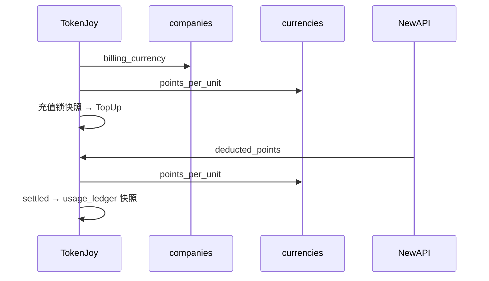

# Backend 计费与多货币 — 实现规格

**一句话：** 用户只见 **`Money { amount, currency }`**；NewAPI 点数是黑盒；产品账与网关之间只用 **`points_per_unit`** 商业常数换算；充值锁快照。不做日更外汇、不做历史迁移——**全库按本规格重建**。

**相关：** [Backend-存储架构.md](./Backend-存储架构.md) §8 · [Backend-预算.md](./Backend-预算.md) · [Frontend.md](./Frontend.md) §5.9

**约束：**

- 代码与 schema **禁止** `CNY` / `cny` / `amount_cny` / `cost_cny` 等币种硬编码或字段后缀
- **`companies` 只存 `billing_currency`**
- **`points_per_unit` 跟币种走**，存平台 **`currencies`** 目录表
- **模型零售价留在 `models`**（`input_price` / `output_price`），不拆 `model_prices`
- 入账、充值、读钱包、Rebalance、预检 **五处** 共用同一套边界函数

**表数：** 主库 **35 → 36**（仅 +`currencies`）。

---

## 1. 存储分层

| 问题 | 归属 | 存哪 |
| --- | --- | --- |
| 平台支持哪些币？每币换多少点？ | 平台目录 | `currencies` |
| 这家租户用哪种币？ | 租户 | `companies.billing_currency` |
| 这个模型零售价多少？ | 租户价目 | `models.input_price` / `output_price` |
| 某笔充值 / 消耗当时的 ratio？ | 事务快照 | 充值单、`usage_ledger` |

```text
ratio = currencies.points_per_unit
        WHERE currency = companies.billing_currency
```

`points_per_unit` **不在** `companies` 上——它是币种的属性，不是租户的属性。

---

## 2. `currencies`（平台目录，+1 表）

```sql
CREATE TABLE currencies (
    currency         CHAR(3) PRIMARY KEY,
    points_per_unit  BIGINT NOT NULL CHECK (points_per_unit > 0),
    is_default       BOOLEAN NOT NULL DEFAULT FALSE,
    enabled          BOOLEAN NOT NULL DEFAULT TRUE,
    created_at       TIMESTAMPTZ NOT NULL DEFAULT NOW(),
    updated_at       TIMESTAMPTZ NOT NULL DEFAULT NOW()
);

CREATE UNIQUE INDEX idx_currencies_default
    ON currencies (is_default) WHERE is_default = TRUE;
```

**Seed（数据，非代码）：**

```sql
INSERT INTO currencies (currency, points_per_unit, is_default, enabled) VALUES
    ('CNY', 500000, TRUE, TRUE),
    ('USD', 500000, FALSE, TRUE);
```

| 列 | 说明 |
| --- | --- |
| `points_per_unit` | 1 单位该币 → 多少 relay 点数（商业常数，非外汇） |
| `is_default` | 有且仅有一行 `true` |
| `enabled` | `false` 禁止新租户选用 |

类似 `permissions`：全平台参考数据，**不是** company 配置表。

---

## 3. `companies`（只加一列）

```sql
    billing_currency  CHAR(3) NOT NULL REFERENCES currencies (currency),
```

开户传 `billingCurrency`，或默认 `currencies.is_default`；运行期不改币。

---

## 4. `models`（价目不拆表）

**现有表已够用**，保留 `input_price` / `output_price`：

```sql
-- models 结构不变，仅语义约定：
-- input_price / output_price 的单位 = 该租户 companies.billing_currency
```

| 为何不要 `model_prices` | 说明 |
| --- | --- |
| 每租户一种记账币 | 同一模型不需要多币多行价 |
| 多币靠多租户 | CNY 公司与 USD 公司各自 `models` 行，数字已是各自币种 |
| 入账不用价目 | `settled = deducted_points / points_per_unit`，不读 `models` 价格 |

价目用途：**展示、预估、偏差监控**（对比 ledger 实际消耗）。

---

## 5. `points_per_unit` 与换算

| 时刻 | 公式 | ratio 来源 |
| --- | --- | --- |
| 充值 | `MoneyToRelayPoints(amount, ratio)` | lookup + **锁入订单** |
| 入账 | `SettleFromDeductedPoints(Δ, ratio)` | lookup + **锁入 ledger** |
| 读钱包 / Rebalance | 同上 | lookup 现价 |

```go
func MoneyToRelayPoints(amount float64, pointsPerUnit int64) int64
func RelayPointsToMoney(points int64, pointsPerUnit int64) float64
func SettleFromDeductedPoints(deductedPoints int64, pointsPerUnit int64) float64

func ResolvePointsPerUnit(ctx context.Context, repo CurrencyRepository, currency string) (int64, error)
```

**删除：** `ToNewAPIUnits`、`FromNewAPIUnits`、`CostCNYFromQuota`、`CostCNYFromLog`、`ModelPriceCNY`、`HighestModelPriceCNY`、`DefaultModelPriceCNY`。

---

## 6. 其他 schema 变更（列改名 / 加固，无新表）

### `company_recharge_orders`

```sql
    currency         CHAR(3) NOT NULL,
    points_per_unit  BIGINT NOT NULL,
    quota_granted    BIGINT NOT NULL,
    locked_at        TIMESTAMPTZ NOT NULL,
```

### `usage_ledger`（替换 `amount_cny`）

```sql
    amount           NUMERIC(18, 6) NOT NULL DEFAULT 0,
    currency         CHAR(3) NOT NULL,
    points_per_unit  BIGINT NOT NULL,
```

### `usage_buckets`（替换 `cost_cny`）

```sql
    cost       NUMERIC(18, 6) NOT NULL DEFAULT 0,
    currency   CHAR(3) NOT NULL,
```

---

## 7. 数据流



---

## 8. Go 改动摘要

| 组件 | 改动 |
| --- | --- |
| `CurrencyRepository` | `Default()`, `Get(currency)`, `ListEnabled()` |
| `Company` | +`BillingCurrency` |
| `billing` / `usage` / `relay` | 经 `ResolvePointsPerUnit` |
| `models` | 价继续读 `input_price`/`output_price`；展示时带 `billing_currency` |
| 前端 | `cost` + `currency`；禁止默认币字面量 |

---

## 9. 反模式

| 反模式 | 后果 |
| --- | --- |
| `points_per_unit` 存 `companies` | 重复；改价语义乱 |
| 拆 `model_prices` | 无必要；与现有 `models` 重复 |
| 用 `models` 价格入账 | 与网关双计倍率 |
| 快照不落库、只读目录现价 | 改价篡改历史 |
| 字段名含 `cny` | 多币二次重构 |

---

## 10. 实施顺序

1. `currencies` + `companies.billing_currency`
2. `CurrencyRepository` + `quota.go` + `ResolvePointsPerUnit`
3. 充值 / ledger / buckets 列名与快照
4. billing → ingest → relay → dashboard → 前端
5. 删尽 `*CNY*` / `*cny*`

全库 **down -v 重建**，不做 migration。
