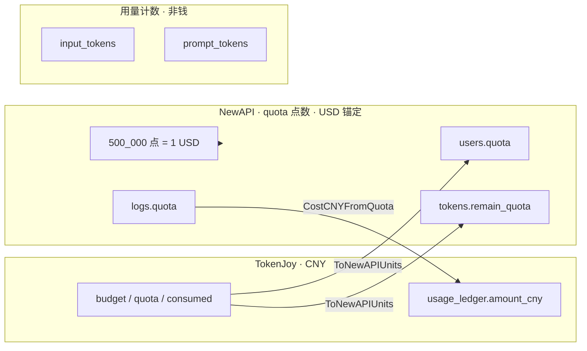
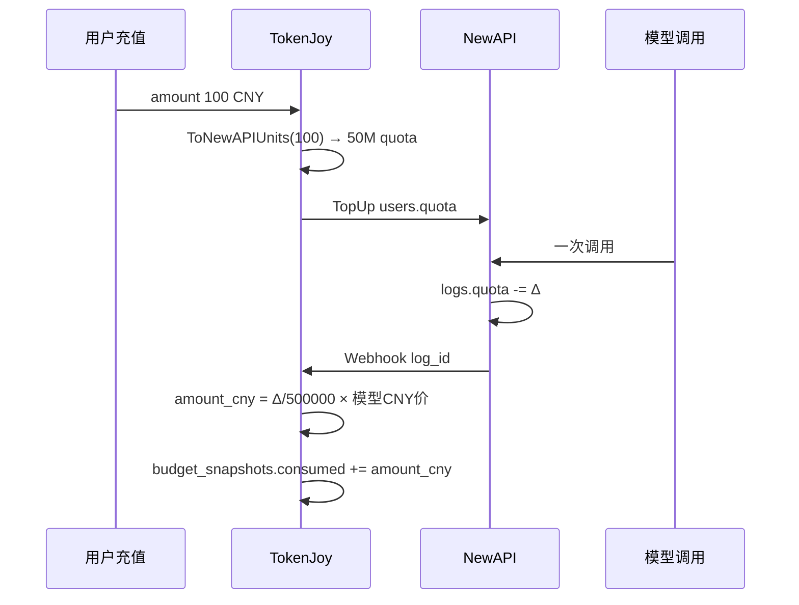

# Backend 计费单位

TokenJoy 产品面统一 **人民币（CNY / RMB）**；NewAPI 侧用 **`quota` 配额点数**（`int64` 整数，**锚定 USD**：`500_000` 点 = **1 美元**）。二者在集成边界换算，**都不是 LLM token 个数**。

**相关：** [Backend-存储架构.md](./Backend-存储架构.md) §8（limit / consumed 术语）· [Backend-预算.md](./Backend-预算.md) §5（Rebalance 换算）

---

## 1. 三种计量，不要混

| 类型 | 是什么 | 用在哪 | 单位 |
| --- | --- | --- | --- |
| **金额（CNY）** | 预算、消耗、充值、看板费用 | Postgres 主库、控制台 API | 元（`NUMERIC`，字段常带 `cny` / `budget` / `amount`） |
| **NewAPI quota** | Relay 内部计费点数，**按 USD 刻度** | `users.quota`、`remain_quota`、`logs.quota` | **`int64` 点数**；`500_000` 点 = 1 USD |
| **LLM token 数** | 模型用量统计 | `input_tokens`、`prompt_tokens` 等 | 个（prompt / completion） |



**结论：**

- 问「TokenJoy 花了多少钱」→ **CNY** 字段。
- 问「NewAPI 扣了多少」→ **`logs.quota` 点数**；换成美元是 `quota / 500_000` USD，**不是 token 数**。
- 问「用了多少 token」→ **`input_tokens` / `output_tokens`**；NewAPI 用它算该扣多少 quota，但 quota ≠ token。

---

## 2. TokenJoy 侧：全是 CNY

以下字段在产品和 Postgres 中语义均为 **人民币元**：

| 字段 | 表 / API | 角色 |
| --- | --- | --- |
| `budget` | `org_nodes`, `budget_groups` | limit（分配上限） |
| `personal_quota` | `members` | limit（成员） |
| `quota` | `platform_keys` | limit（Key 分配额） |
| `consumed` | `budget_snapshots` | 已消耗 |
| `used` | `PlatformKey` JSON | 已消耗（= consumed） |
| `amount_cny` | `usage_ledger` | 单笔调用结算金额 |
| `cost_cny` | `usage_buckets`、看板 | 聚合费用 |
| `amount` | `company_recharge_orders` | 充值金额 |
| `balance` / `currency` | 钱包 API | `currency` 固定 `'CNY'` |

模型目录单价：

| 字段 | 含义 |
| --- | --- |
| `models.input_price` | 每单位用量对应的 CNY 价（与 `QuotaPerUnit` 配合） |
| `models.output_price` | 同上 |

`input_price + output_price` 作为该模型在换算时的 **CNY 单价**（见 `ModelPriceCNY`）。

---

## 3. NewAPI 侧：quota 点数，锚定 USD

NewAPI（上游 One API / New API）的 **`quota` 不是 CNY，也不是 token 数**，而是 **内部配额点数**，官方刻度：

```text
500_000 quota 点 = 1 USD
```

| 要点 | 说明 |
| --- | --- |
| 存储形态 | `int64` 整数，字段名 `quota` / `remain_quota`，**不带 `$` 或 `¥` 符号** |
| 货币锚定 | 点数按 **美元** 标定；控制台可显示为美元等价 |
| 扣费逻辑 | NewAPI 根据 **模型倍率 × 分组倍率 × token 数** 算出本次消耗点数，再从 `remain_quota` / `users.quota` 扣减 |
| 与 token 关系 | token 是输入；**扣多少点**由 NewAPI 计费规则决定，**不是 1 token = 1 点** |

TokenJoy 集成边界：

| NewAPI 字段 | TokenJoy 怎么用 |
| --- | --- |
| `users.quota` | 企业钱包剩余点数；`FromNewAPIUnits` → CNY 粗算；充值 `TopUp` 写入 |
| `tokens.remain_quota` | Token 剩余点数；Rebalance `UpdateToken`；Gateway 预检 |
| `logs.quota` | 单次扣掉的点数；Ingest → `CostCNYFromLog` → `amount_cny` |
| `relay_mappings.newapi_token_remain_quota` | 缓存副本；权威仍在 NewAPI |

> **易混：** `platform_keys.quota`（Postgres）是 **CNY 分配额**；`tokens.remain_quota`（NewAPI）是 **USD 锚定的点数**。同名不同层。

---

## 4. 换算公式（代码真源）

常量：`QuotaPerUnit = 500_000`（`internal/pkg/common/constants.go`）

### 4.1 NewAPI quota → CNY（入账）

NewAPI 已按 USD 刻度扣下 `logs.quota` 点数；TokenJoy 用 **当次模型 CNY 单价** 解释成人民币：

```text
amount_cny = logs.quota / QuotaPerUnit × ModelPriceCNY(实际模型)

其中 QuotaPerUnit = 500_000（与 NewAPI 官方「500_000 点 = 1 USD」一致）
```

实现：`CostCNYFromQuota` → `usage.BuildCallSettledEntry` → `usage_ledger.amount_cny`。

示例：`quota = 500_000`，`ModelPriceCNY = 2` → **`amount_cny = 2` 元**（TokenJoy 账）；在 NewAPI 侧同一数值等价 **1 USD** 档位的点数。

### 4.2 CNY → NewAPI quota（充值 / Rebalance）

```text
remain_quota = cny_remaining / HighestModelPriceCNY × QuotaPerUnit
```

实现：`ToNewAPIUnits` ← `ComputeRemainQuotaCNY` / `TopUp`。

充值特例：`TopUp(order.Amount)` 无模型列表时 `HighestModelPriceCNY` 回退 **1**，即 **1 CNY → 500_000 点**。在 NewAPI 刻度上这等于 **1 USD 档位的点数**——**隐含 1 CNY 充值 ≈ 1 USD 点数容量**（无独立汇率表）。

### 4.3 CNY ← NewAPI quota（读钱包）

```text
cny ≈ quota / QuotaPerUnit × HighestModelPriceCNY
```

实现：`FromNewAPIUnits`。读的是 TokenJoy 视角的 CNY 等价，不是把 `quota` 直接当人民币元。

---

## 5. 字段对照总表

| 你看到 | 钱 or quota or token | 币种/单位 | 说明 |
| --- | --- | --- | --- |
| `org_nodes.budget` | **钱** | CNY | limit |
| `budget_snapshots.consumed` | **钱** | CNY | 已消耗 SSOT |
| `platform_keys.quota` / `used` | **钱** | CNY | limit / consumed |
| `usage_ledger.amount_cny` | **钱** | CNY | 单笔事实 |
| `usage_buckets.cost_cny` | **钱** | CNY | 看板聚合 |
| `company_recharge_orders.amount` | **钱** | CNY | 充值 |
| `users.quota` | **quota 点数** | USD 锚定 | `500_000` 点 = 1 USD |
| `tokens.remain_quota` | **quota 点数** | USD 锚定 | Token 剩余点数 |
| `logs.quota` | **quota 点数** | USD 锚定 | 单次扣减；入账时换成 CNY |
| `input_tokens` / `output_tokens` | **token 数** | 个 | 仅用量统计 |
| `logs.prompt_tokens` / `completion_tokens` | **token 数** | 个 | NewAPI 原始用量 |

---

## 6. CNY（TokenJoy）与 USD 锚定点数（NewAPI）

| 层 | 记账货币 | 形态 |
| --- | --- | --- |
| TokenJoy Postgres / API | **CNY** | `budget`、`consumed`、`amount_cny` 等 |
| NewAPI | **USD 锚定的 quota 点数** | `int64`；`500_000` = 1 USD |
| 边界换算 | TokenJoy 自定 | `models.*_price`（CNY）+ `QuotaPerUnit`；**无独立 USD/CNY 汇率表** |

| 项 | 说明 |
| --- | --- |
| NewAPI 扣费 | 按模型/分组倍率和 **token 数** 算出 **quota 点数**（USD 刻度） |
| TokenJoy 入账 | 把 `logs.quota` 点数用 **CNY 模型价** 写成 `amount_cny` |
| 充值 | `1 CNY → 500_000 点`（默认单价 1 时）≈ NewAPI 侧 **1 USD 档位** 点数 |
| 风险 | CNY 模型价若与 NewAPI 通道 USD 成本未对齐，组织 `consumed`(CNY) 与钱包 `quota` 可能漂移；靠 Rebalance + 调价维护 |

---

## 7. 数据流简图



---

## 8. 读代码 / 对接时常问

| 问题 | 答案 |
| --- | --- |
| `quota` 是 token 数吗？ | **不是**。是 NewAPI **配额点数**（USD 锚定）。 |
| `quota` 是 USD 吗？ | **不是美元浮点金额**；是 `int64` 点数，**`500_000` 点 = 1 USD**。 |
| `platform_keys.quota` 呢？ | 那是 **CNY 分配额**，与 NewAPI `remain_quota` 不同层。 |
| 控制台预算 5000 是什么？ | **5000 CNY**。 |
| `logs.quota = 500000` 在 NewAPI 是多少？ | **1 USD 档位**的点数；在 TokenJoy 入账多少 CNY 取决于 `ModelPriceCNY`。 |
| 看板 `costCny` 从哪来？ | 已是 CNY，勿再换算。 |
| 为何 `QuotaPerUnit = 500000`？ | 与 NewAPI 官方 **1 USD = 500_000 点** 一致。 |
