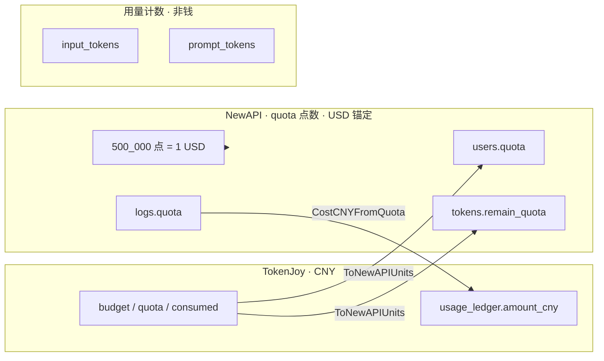
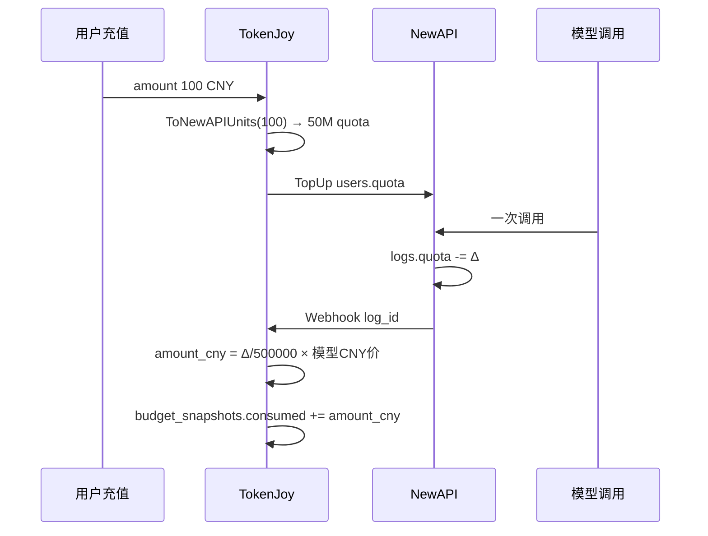
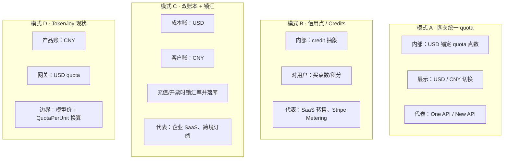
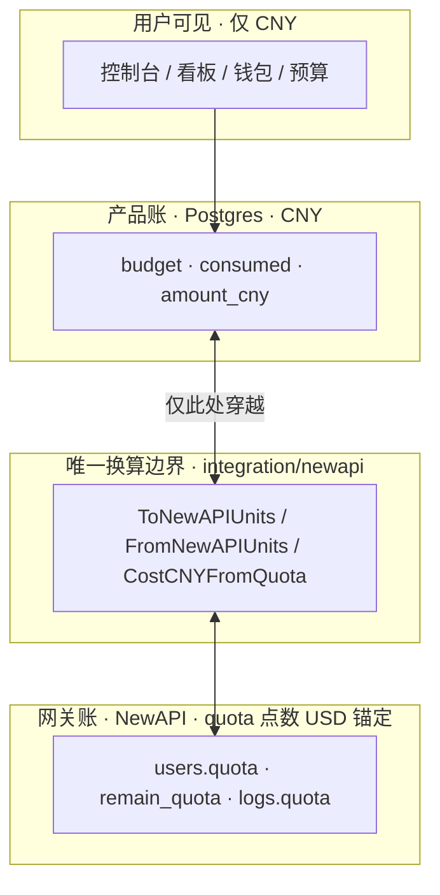

# Backend 计费单位

TokenJoy 产品面统一 **人民币（CNY / RMB）**；NewAPI 侧用 **`quota` 配额点数**（`int64` 整数，**锚定 USD**：`500_000` 点 = **1 美元**）。二者在集成边界换算，**都不是 LLM token 个数**。

**相关：** [Backend-存储架构.md](./Backend-存储架构.md) §8（limit / consumed 术语）· [Backend-预算.md](./Backend-预算.md) §5（Rebalance 换算）

---

## 1. 三种计量，不要混

| 类型             | 是什么                              | 用在哪                                      | 单位                                                  |
| ---------------- | ----------------------------------- | ------------------------------------------- | ----------------------------------------------------- |
| **金额（CNY）**  | 预算、消耗、充值、看板费用          | Postgres 主库、控制台 API                   | 元（`NUMERIC`，字段常带 `cny` / `budget` / `amount`） |
| **NewAPI quota** | Relay 内部计费点数，**按 USD 刻度** | `users.quota`、`remain_quota`、`logs.quota` | **`int64` 点数**；`500_000` 点 = 1 USD                |
| **LLM token 数** | 模型用量统计                        | `input_tokens`、`prompt_tokens` 等          | 个（prompt / completion）                             |



**结论：**

- 问「TokenJoy 花了多少钱」→ **CNY** 字段。
- 问「NewAPI 扣了多少」→ **`logs.quota` 点数**；换成美元是 `quota / 500_000` USD，**不是 token 数**。
- 问「用了多少 token」→ **`input_tokens` / `output_tokens`**；NewAPI 用它算该扣多少 quota，但 quota ≠ token。

---

## 2. TokenJoy 侧：全是 CNY

以下字段在产品和 Postgres 中语义均为 **人民币元**：

| 字段                   | 表 / API                     | 角色                    |
| ---------------------- | ---------------------------- | ----------------------- |
| `budget`               | `org_nodes`, `budget_groups` | limit（分配上限）       |
| `personal_quota`       | `members`                    | limit（成员）           |
| `quota`                | `platform_keys`              | limit（Key 分配额）     |
| `consumed`             | `budget_snapshots`           | 已消耗                  |
| `used`                 | `PlatformKey` JSON           | 已消耗（= consumed）    |
| `amount_cny`           | `usage_ledger`               | 单笔调用结算金额        |
| `cost_cny`             | `usage_buckets`、看板        | 聚合费用                |
| `amount`               | `company_recharge_orders`    | 充值金额                |
| `balance` / `currency` | 钱包 API                     | `currency` 固定 `'CNY'` |

模型目录单价：

| 字段                  | 含义                                              |
| --------------------- | ------------------------------------------------- |
| `models.input_price`  | 每单位用量对应的 CNY 价（与 `QuotaPerUnit` 配合） |
| `models.output_price` | 同上                                              |

`input_price + output_price` 作为该模型在换算时的 **CNY 单价**（见 `ModelPriceCNY`）。

---

## 3. NewAPI 侧：quota 点数，锚定 USD

NewAPI（上游 One API / New API）的 **`quota` 不是 CNY，也不是 token 数**，而是 **内部配额点数**，官方刻度：

```text
500_000 quota 点 = 1 USD
```

| 要点          | 说明                                                                                                      |
| ------------- | --------------------------------------------------------------------------------------------------------- |
| 存储形态      | `int64` 整数，字段名 `quota` / `remain_quota`，**不带 `$` 或 `¥` 符号**                                   |
| 货币锚定      | 点数按 **美元** 标定；控制台可显示为美元等价                                                              |
| 扣费逻辑      | NewAPI 根据 **模型倍率 × 分组倍率 × token 数** 算出本次消耗点数，再从 `remain_quota` / `users.quota` 扣减 |
| 与 token 关系 | token 是输入；**扣多少点**由 NewAPI 计费规则决定，**不是 1 token = 1 点**                                 |

TokenJoy 集成边界：

| NewAPI 字段                                | TokenJoy 怎么用                                                   |
| ------------------------------------------ | ----------------------------------------------------------------- |
| `users.quota`                              | 企业钱包剩余点数；`FromNewAPIUnits` → CNY 粗算；充值 `TopUp` 写入 |
| `tokens.remain_quota`                      | Token 剩余点数；Rebalance `UpdateToken`；Gateway 预检             |
| `logs.quota`                               | 单次扣掉的点数；Ingest → `CostCNYFromLog` → `amount_cny`          |
| `relay_mappings.newapi_token_remain_quota` | 缓存副本；权威仍在 NewAPI                                         |

> **易混：** `platform_keys.quota`（Postgres）是 **CNY 分配额**；`tokens.remain_quota`（NewAPI）是 **USD 锚定的点数**。同名不同层。

---

## 4. 换算公式（代码真源）

常量：`QuotaPerUnit = 500_000`（`internal/pkg/common/constants.go`）

### 4.1 NewAPI quota → CNY（入账）

NewAPI 已按 USD 刻度扣下 `logs.quota` 点数；TokenJoy 用 **当次模型 CNY 单价** 解释成人民币：

```text
amount_cny = logs.quota / QuotaPerUnit × ModelPriceCNY(实际模型)

其中 QuotaPerUnit = 500_000（与 NewAPI 官方「500_000 点 = 1 USD」一致）
```

实现：`CostCNYFromQuota` → `usage.BuildCallSettledEntry` → `usage_ledger.amount_cny`。

示例：`quota = 500_000`，`ModelPriceCNY = 2` → **`amount_cny = 2` 元**（TokenJoy 账）；在 NewAPI 侧同一数值等价 **1 USD** 档位的点数。

### 4.2 CNY → NewAPI quota（充值 / Rebalance）

```text
remain_quota = cny_remaining / HighestModelPriceCNY × QuotaPerUnit
```

实现：`ToNewAPIUnits` ← `ComputeRemainQuotaCNY` / `TopUp`。

充值特例：`TopUp(order.Amount)` 无模型列表时 `HighestModelPriceCNY` 回退 **1**，即 **1 CNY → 500_000 点**。在 NewAPI 刻度上这等于 **1 USD 档位的点数**——**隐含 1 CNY 充值 ≈ 1 USD 点数容量**（无独立汇率表）。

### 4.3 CNY ← NewAPI quota（读钱包）

```text
cny ≈ quota / QuotaPerUnit × HighestModelPriceCNY
```

实现：`FromNewAPIUnits`。读的是 TokenJoy 视角的 CNY 等价，不是把 `quota` 直接当人民币元。

---

## 5. 字段对照总表

| 你看到                                     | 钱 or quota or token | 币种/单位 | 说明                     |
| ------------------------------------------ | -------------------- | --------- | ------------------------ |
| `org_nodes.budget`                         | **钱**               | CNY       | limit                    |
| `budget_snapshots.consumed`                | **钱**               | CNY       | 已消耗 SSOT              |
| `platform_keys.quota` / `used`             | **钱**               | CNY       | limit / consumed         |
| `usage_ledger.amount_cny`                  | **钱**               | CNY       | 单笔事实                 |
| `usage_buckets.cost_cny`                   | **钱**               | CNY       | 看板聚合                 |
| `company_recharge_orders.amount`           | **钱**               | CNY       | 充值                     |
| `users.quota`                              | **quota 点数**       | USD 锚定  | `500_000` 点 = 1 USD     |
| `tokens.remain_quota`                      | **quota 点数**       | USD 锚定  | Token 剩余点数           |
| `logs.quota`                               | **quota 点数**       | USD 锚定  | 单次扣减；入账时换成 CNY |
| `input_tokens` / `output_tokens`           | **token 数**         | 个        | 仅用量统计               |
| `logs.prompt_tokens` / `completion_tokens` | **token 数**         | 个        | NewAPI 原始用量          |

---

## 6. CNY（TokenJoy）与 USD 锚定点数（NewAPI）

| 层                      | 记账货币                  | 形态                                                               |
| ----------------------- | ------------------------- | ------------------------------------------------------------------ |
| TokenJoy Postgres / API | **CNY**                   | `budget`、`consumed`、`amount_cny` 等                              |
| NewAPI                  | **USD 锚定的 quota 点数** | `int64`；`500_000` = 1 USD                                         |
| 边界换算                | TokenJoy 自定             | `models.*_price`（CNY）+ `QuotaPerUnit`；**无独立 USD/CNY 汇率表** |

| 项            | 说明                                                                                                             |
| ------------- | ---------------------------------------------------------------------------------------------------------------- |
| NewAPI 扣费   | 按模型/分组倍率和 **token 数** 算出 **quota 点数**（USD 刻度）                                                   |
| TokenJoy 入账 | 把 `logs.quota` 点数用 **CNY 模型价** 写成 `amount_cny`                                                          |
| 充值          | `1 CNY → 500_000 点`（默认单价 1 时）≈ NewAPI 侧 **1 USD 档位** 点数                                             |
| 风险          | CNY 模型价若与 NewAPI 通道 USD 成本未对齐，组织 `consumed`(CNY) 与钱包 `quota` 可能漂移；靠 Rebalance + 调价维护 |

---

## 7. 数据流简图



---

## 8. 读代码 / 对接时常问

| 问题                                     | 答案                                                                    |
| ---------------------------------------- | ----------------------------------------------------------------------- |
| `quota` 是 token 数吗？                  | **不是**。是 NewAPI **配额点数**（USD 锚定）。                          |
| `quota` 是 USD 吗？                      | **不是美元浮点金额**；是 `int64` 点数，**`500_000` 点 = 1 USD**。       |
| `platform_keys.quota` 呢？               | 那是 **CNY 分配额**，与 NewAPI `remain_quota` 不同层。                  |
| 控制台预算 5000 是什么？                 | **5000 CNY**。                                                          |
| `logs.quota = 500000` 在 NewAPI 是多少？ | **1 USD 档位**的点数；在 TokenJoy 入账多少 CNY 取决于 `ModelPriceCNY`。 |
| 看板 `costCny` 从哪来？                  | 已是 CNY，勿再换算。                                                    |
| 为何 `QuotaPerUnit = 500000`？           | 与 NewAPI 官方 **1 USD = 500_000 点** 一致。                            |

---

## 9. 双币种会不会乱？业界怎么做

### 9.1 结论先说

| 问题 | 答案 |
| --- | --- |
| USD（NewAPI）+ CNY（TokenJoy）常见吗？ | **很常见**。国内大量基于 One API / New API 的二开产品都是「对用户 CNY，对网关 quota」。 |
| 会不会乱？ | **对开发会乱**，对用户可以不乱——前提是 **分层清晰、UI 只展示一层**。 |
| TokenJoy 现在的问题 | 技术上可行，但 **缺显式汇率与双金额落库**；充值路径隐含 `1 CNY → 500_000 点 ≈ 1 USD 档位`。 |

### 9.2 业界四种常见模式



| 模式 | 内部真账 | 用户看到 | 汇率 | 典型场景 |
| --- | --- | --- | --- | --- |
| **A 网关 quota** | `500_000` 点 = 1 USD | 控制台可选 $ 或 ¥ 显示 | 配置项 `usd_exchange_rate`，**多数只影响展示** | One API、New API 及二开 |
| **B Credits** | credit（如 1 credit = $0.01） | 「余额 / 点数」，不暴露 API 成本 | 在 credit 定价时吃掉 markup | AI 转售、B2B API 平台 |
| **C 双账本锁汇** | 同时存 USD 成本 + CNY 客户价 | 发票仅 CNY | **充值/开票时锁定**，可追溯 | 正规 SaaS 财务、跨境订阅 |
| **D 产品 CNY + 网关 USD** | Postgres 全 CNY；NewAPI 全 quota | 仅 CNY | **隐式**（靠模型价校准） | 国内控制台 + NewAPI Relay |

**TokenJoy 属于 D**，与国内 NewAPI 二开圈的主流选择一致。

### 9.3 One API / New API 圈怎么做

上游设计本身就是 **「内部 USD 刻度 quota + 展示可切换」**：

| 能力 | 说明 |
| --- | --- |
| 内部记账 | `quota` 点数，`QuotaPerUnit = 500_000` ↔ 1 USD |
| 控制台展示 | 支持「以美元显示额度」 |
| CNY 展示 | 新版 New API 有 **USD/CNY 选择器** + `usd_exchange_rate`，用于**价格/充值展示**，不是改内部点数规则 |
| 扣费公式 | `配额消耗 = 模型固定价(USD) × 分组倍率 × 500_000` |

也就是说：**他们也在「内部 USD、对外可显示 CNY」**，靠汇率配置隔离「真账」和「展示」。

### 9.4 正规 SaaS 跨境计费怎么做（Stripe 类）

若财务要严谨，业界通常：

1. **单一成本货币**（多为 USD，因 OpenAI/Anthropic 成本是美元）
2. **客户账单货币**（CNY）在 **充值 / 开票瞬间** 换算
3. **落库四元组**：`amount_cny`、`amount_usd`（或 quota）、`exchange_rate`、`rate_locked_at`
4. **UI 只展示客户货币**；运维/对账才看网关层

TokenJoy **第 1、4 步做得较好**（用户只见 CNY）；**第 2、3 步尚未 formalize**（无锁汇字段）。

### 9.5 TokenJoy 现在哪里容易「感觉乱」

| 混乱点 | 原因 | 用户是否感知 |
| --- | --- | --- |
| 两个 `quota` | Postgres `platform_keys.quota` = CNY；NewAPI `remain_quota` = 点数 | 否（UI 不展示 NewAPI 点数） |
| 充值无显式汇率 | `100 CNY → 50M 点` 在 NewAPI 等于 **$100 档位** 点数 | 否，除非财务对账 |
| 入账用 CNY 模型价解释 USD 点数 | `logs.quota` 是 NewAPI 扣的；`amount_cny` 靠 `ModelPriceCNY` 重解释 | 否；**模型价需与通道成本校准** |
| 组织预算 vs 钱包 | CNY 双轴 + USD quota 钱包 | 产品设计上刻意分离，文档需写清 |

**对用户：** 只要控制台、发票、看板 **统一 CNY**，就不乱。  
**对研发/财务：** 边界层要有一份「哪层是 CNY、哪层是 quota 点数」的契约——即本文档。

### 9.6 若要进一步「不那么乱」（建议优先级）

不改 NewAPI 前提下，业界演进路径通常如下：

| 优先级 | 做法 | 效果 |
| --- | --- | --- |
| P0（已有） | 文档分层；UI 不暴露 NewAPI quota | 用户侧清晰 |
| P1 | 充值订单增加 `exchange_rate`、`quota_granted` 落库 | 财务可对账「100 CNY 换了多少点」 |
| P2 | 配置 `USD_CNY_RATE`（或每日拉汇率），充值/TopUp 显式使用 | 去掉「1 CNY ≈ 1 USD 档位」隐含假设 |
| P3 | 入账改为：先用 NewAPI 规则算 USD 等价，再 × 锁汇 → `amount_cny` | 与通道扣点严格一致，模型价作校验而非主换算 |
| 不推荐 | 强行把 Postgres 改成 USD | 国内产品、预算树、控制台全是 CNY 语义，改动面极大 |

**国内 NewAPI 二开多数停在 P0–P1**，靠运营调价（模型 CNY 单价、充值倍率）吸收汇率波动，而不是做实时外汇。

### 9.7 一句话

**USD + CNY 双币种不反常；乱的是把两层账混在一个字段名里。** 业界要么 **内部统一 quota/USD、展示再换汇**（One API），要么 **credit 抽象**（SaaS 转售），要么 **锁汇双落库**（正规财务）。TokenJoy 走「**产品 CNY + 网关 USD quota**」是常见路线；当前主要缺口是 **充值边界缺显式汇率记录**，不是架构方向错了。

---

## 10. 如何简化：分层契约与落地清单

核心原则：**两层账、一个边界、用户只见 CNY。**



### 10.1 三条铁律（立刻可做，零 schema 改动）

| # | 铁律 | 做法 |
| --- | --- | --- |
| 1 | **用户层只有 CNY** | 控制台、API JSON、发票不出现 NewAPI `remain_quota`、不出现「配额点数」 |
| 2 | **换算只在一个包** | 所有 CNY ↔ quota 只允许 `internal/integration/newapi/quota.go`；业务代码禁止手写 `/ 500000` |
| 3 | **同名不同义要区分（类型/文档/CR）** | 见下表 |

**命名对照（读代码 / CR 时用）：**

| 避免泛称 `quota` | 推荐心智名 | 实际字段 |
| --- | --- | --- |
| 产品分配额 | `limitCny` / `quotaCny` | `platform_keys.quota`、`org_nodes.budget` |
| 产品已消耗 | `consumedCny` / `usedCny` | `budget_snapshots.consumed`、`PlatformKey.used` |
| 网关剩余点数 | `relayPoints` / `remainPoints` | NewAPI `remain_quota` |
| 网关单次扣点 | `deductedPoints` | `logs.quota` |

> 数据库字段可暂不改；**新代码、新 API、日志、文档** 必须用左侧心智名。

### 10.2 代码结构简化（小改，收益大）

| 动作 | 说明 |
| --- | --- |
| **收敛边界** | 换算只走 `ToNewAPIUnits` / `FromNewAPIUnits` / `CostCNYFromQuota` |
| **类型别名（可选）** | `type RelayPoints int64`、`type MoneyCNY float64`，减少传参搞混 |
| **充值单一路径** | 所有 TopUp 只走 `billing.Service.topUpAndFinish` |
| **入账单一路径** | 所有 `amount_cny` 只由 `CostCNYFromLog` 产生 |

### 10.3 产品 / UI 简化

| 做 | 不做 |
| --- | --- |
| 钱包 `balance` + `currency: CNY` | 展示 NewAPI 点数或美元 |
| 预算 / Key 表单标注「元」 | 字段只写 `quota` 不写单位 |
| 运维页单独看 Relay 同步 | 把 `remain_quota` 给普通成员 |

### 10.4 数据简化（按优先级）

| 阶段 | 改动 | 效果 |
| --- | --- | --- |
| **P1** | 充值订单落 `quota_granted` + `usd_cny_rate` | 对账清晰 |
| **P1** | 配置 `RELAY_USD_CNY_RATE` 或充值倍率 | 去掉隐式 1 CNY ≈ 1 USD 档位 |
| **P2** | 入账用统一汇率标尺（非仅模型价） | 与 NewAPI 扣点一致 |
| **不做** | Postgres 预算改 USD | 与国内产品语义冲突 |

### 10.5 双轴对外只讲一个故事

| 对用户 | 技术实质 |
| --- | --- |
| 企业钱包 = 充值总资金 | NewAPI `users.quota` → 界面显示 CNY |
| 部门预算 = 组织内分配 | `org_nodes.budget` + snapshots |
| Key 额度 = 调用上限 | `platform_keys.quota`（CNY） |

预检两层都跑，对用户统一「余额/预算不足」话术即可。

### 10.6 Code Review 清单

- [ ] 新字段是否标明 CNY 或 RelayPoints？
- [ ] 是否在 `integration/newapi` 外手写 `/ 500000`？
- [ ] API 是否只暴露 `costCny` / `consumed` / `budget`？
- [ ] 充值是否走单一路径？

### 10.7 最小可行方案（推荐）

> **充值边界显式 `usd_cny_rate` + 落库 `quota_granted`；UI/API 只暴露 CNY；换算永不离开 `integration/newapi`。**

性价比最高：不动预算模型，消除最大隐含假设。

### 10.8 不建议的「简化」

| 做法 | 为何更乱 |
| --- | --- |
| 控制台同时显示 CNY 和点数 | 用户心算两层 |
| 全站改 USD | 与组织预算语义冲突 |
| 各 domain 自行换算 | 汇率不一致 |
| 用 token 数计费 | 与 NewAPI 扣费模型不一致 |
